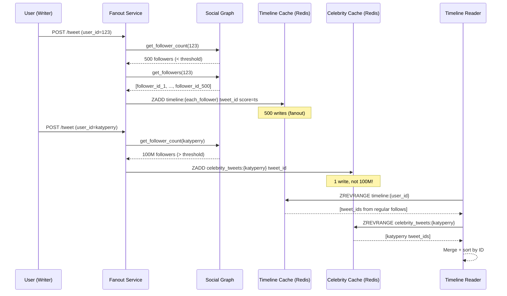

⚡ TL;DR - Twitter's API architecture is a case study
in what happens when a public API becomes the foundation
for an ecosystem and then changes abruptly; key
architectural lessons: (1) API versioning strategy
matters - Twitter's v1→v1.1→v2 migrations broke
thousands of apps; (2) rate limiting must be designed
for third-party developers, not just internal use
(Twitter's v1.1 rate limit cut devastated the developer
ecosystem); (3) the 2013 "Fail Whale" era taught the
industry about cascading failures at scale; (4) Twitter's
2022-2023 API access changes showed how abrupt monetization
of a previously free API can destroy an ecosystem; key
pattern: API deprecation must be gradual with long
migration windows.

---

| #068 | Category: HTTP & APIs | Difficulty: ★★★★ |
|:---|:---|:---|
| **Depends on:** | API Observability, Rate Limiting, API Gateway, REST API Design | |
| **Used by:** | GraphQL vs REST Decision Framework, API Platform Design | |
| **Related:** | Rate Limiting, API Gateway, Observability, Stripe Outage Pattern, Decision Framework | |

---

### 🔥 The Problem This Solves

**WORLD WITHOUT IT:**
Building Twitter's API at 350 million users, 6,000
tweets per second, millions of third-party apps all
making API calls simultaneously. No one has built an
API at this scale before. How do you decide: rate
limits per app vs per user? How do you handle a
sudden 10× traffic spike? How do you deprecate v1
without breaking all existing clients? These are
unsolved engineering problems in 2010. Twitter has
to solve them in production.

**THE BREAKING POINT:**
November 4, 2016: US Election Night. Twitter traffic
spiked 6× normal levels. The API served 62,000 tweets
per minute at peak. The backend held (unlike 2013's
Fail Whale era). Why did 2016 work when 2013 didn't?
The answer is the architectural changes Twitter made
in 2012-2014.

---

### 📘 Textbook Definition

**Twitter API evolution - key architectural decisions:**
- **2006-2012 (v1):** REST API with OAuth 1.0 authentication.
  No per-endpoint rate limits. All endpoints shared a
  global 150 requests per hour limit. Third-party apps
  grew explosive (TweetDeck, HootSuite, Twitterrific).
- **2012-2013 (v1 → v1.1):** Per-endpoint rate limits
  (user timeline: 15 req/15min per token). This cut
  third-party clients' allowed request count dramatically.
  Many clients could no longer offer real-time timeline
  refresh. Ecosystem damage: significant.
- **2018-2022 (v2 rollout):** Gradual v2 introduction.
  New authentication (OAuth 2.0 + PKCE). New object model
  (expansions instead of nested objects). Long parallel
  operation of v1.1 and v2.
- **2023 (access tier changes):** Free tier removed.
  Essential tier: $100/month, 10k tweets/month read.
  This eliminated the majority of the developer ecosystem.

**The Fail Whale era (2008-2012):**
Twitter's original architecture: Ruby on Rails monolith,
MySQL. As traffic grew: the message bus (RabbitMQ)
became the bottleneck. Timeline reads required fan-out:
if user A follows 1000 people, reading A's timeline
requires reading the last 20 tweets from each of 1000
accounts = 20,000 database reads per timeline request.
Solution: pre-computed timelines (Fanout-on-write).
When a tweet is written: write it to the timeline cache
of every follower. Timeline reads become O(1). At scale:
Katy Perry (100M followers) creating a tweet triggers
100M timeline cache writes. Solution: hybrid (famous
accounts fanout on read + cache, regular accounts
fanout on write).

---

### ⏱️ Understand It in 30 Seconds

**One line:**
Twitter's API architecture is a decade of lessons in
rate limiting design, API versioning strategy, and the
cost of abrupt API changes on an ecosystem.

**One analogy:**
> Twitter's API is a city's public transportation
> system. In the early days: free, unlimited (buses
> don't check tickets). City grows. Need to add limits.
> The challenge: millions of daily commuters (apps)
> have built their routines (products) around the
> current system. Change the schedule or add fares:
> some commuters adjust, some move to cars (competitor
> APIs), some just stop commuting (apps shut down).
> Twitter's 2023 API changes were equivalent to the
> city eliminating free buses overnight and charging
> $100/month for a bus pass.

**One insight:**
Twitter's API became a platform - it was the foundation
for an entire ecosystem of products (HootSuite, Buffer,
Twitterrific, TweetDeck, third-party analytics tools).
The critical lesson: once you have a platform (not just
an API), breaking changes are existential events for
your ecosystem. Platform API changes require extraordinary
care: long migration windows (12-24 months), parallel
operation, and often: permanent support of old versions
(or ecosystem destruction, like 2023). Most internal
APIs never become platforms - but the pattern to watch
for: are external developers building products on your
API?

---

### 🔩 First Principles Explanation

**Twitter's timeline fanout architecture:**

```
FANOUT-ON-WRITE (pre-computed timelines):

User A creates a tweet:
1. Tweet stored in tweet database
2. Fanout service reads A's followers
   (A has 1,000 followers)
3. For each follower (B, C, D, ...):
   - Insert tweet ID into follower's timeline cache
   - Timeline cache: Redis sorted set (tweet_id, timestamp)
4. Read timeline: Redis ZRANGE → O(1) read

Problem with @katyperry (100M followers):
- Creating 1 tweet triggers 100M Redis writes
- Write amplification: 100M× write latency spike

HYBRID APPROACH (Twitter's solution):
- Regular users (< 1M followers): fanout on write
- Celebrity accounts (> threshold): fanout on read
  - Read timeline: merge pre-computed timeline
    (regular accounts) + real-time query for
    celebrity accounts they follow
  - Celebrity tweet not injected into 100M caches
  - On read: pull last N celebrity tweets + cached timeline
```

**Rate limiting architecture (v1.1 design):**

```
v1 (global limit):
  150 req/hour per user across ALL endpoints
  Problem: timeline refresh = 1 of 150, DMs = 1 of 150
  Third-party apps competed with themselves

v1.1 (per-endpoint limits):
  /statuses/home_timeline: 15 req/15min per token
  /statuses/user_timeline: 900 req/15min per token
  /statuses/mentions_timeline: 75 req/15min per token

Limit buckets:
  Per-user-per-app: token from OAuth identifies the pair
  Per-app (app-only auth): app-level pool for unauthenticated
    calls (search API etc)

Implementation: Redis counters
  Key: rate_limit:{app_id}:{user_id}:{endpoint}:{window_start}
  Incr + Expire: atomic increment, expire after window
  Return headers: X-Rate-Limit-Limit,
                  X-Rate-Limit-Remaining,
                  X-Rate-Limit-Reset
```

---

### 🧪 Thought Experiment

**SCENARIO: Twitter API design decision audit**

```
Decision 1: Global rate limit in v1 (150 req/hour)
  Benefit: Simple to implement and understand
  Cost: Apps must ration across all features
  Better: Per-endpoint limits (v1.1 approach)
  Grade: Reasonable for 2006; outdated by 2012

Decision 2: Hard cut v1 → v1.1 in 2012
  Benefit: Clean, single API version to maintain
  Cost: All existing v1 apps broke immediately
  Better: 12+ month parallel operation + migration guide
  Grade: Too abrupt - caused ecosystem backlash

Decision 3: Fanout-on-write for all users
  Benefit: O(1) read (fastest timeline load)
  Cost: Celebrity tweets cause write spikes (Fail Whale)
  Better: Hybrid approach (regular = fanout write,
          celebrity = fanout read with cache)
  Grade: Classic read/write trade-off, correct evolution

Decision 4: Free API access for 17 years then $100/month
  Benefit: Monetize previously-free resource
  Cost: Destroyed third-party developer ecosystem overnight
  Better: Freemium tier (generous free, paid for volume)
  Grade: Business decision. Engineering: implement
         graceful tiering, not cliff change.
```

---

### 🧠 Mental Model / Analogy

> Twitter's architecture evolution is a case study in
> the write-amplification problem at social scale.
> The fanout problem: one write (tweet) triggers N writes
> (one per follower's timeline). This is the same
> challenge in any pub/sub system at scale. The insight:
> at scale, you cannot afford to treat all writes
> equally. Famous accounts (Katy Perry: 100M followers)
> require different handling than regular users
> (100 followers). Tier your write strategy by write
> amplification factor. This pattern recurs: in CDNs
> (popular content cached differently), in messaging
> (broadcast vs unicast), in databases (hot rows vs
> cold rows). Recognize the write amplification
> multiplier and design accordingly.

---

### 📶 Gradual Depth - Five Levels

**Level 1 - What it is (anyone can understand):**
Twitter handles millions of tweets per day and millions
of apps reading tweets. They had to design the API to
handle all this traffic without breaking. They made
some decisions that worked (timeline caching) and some
that damaged their developer community (abrupt API changes).

**Level 2 - How to use it (junior developer):**
When building with Twitter's API: respect rate limits
(use X-Rate-Limit-Remaining header to pace requests),
cache responses to avoid re-fetching unchanged data,
use OAuth 2.0 PKCE for new apps (v1.1 OAuth is deprecated),
use cursor pagination for timeline reads (not offset).

**Level 3 - How it works (mid-level engineer):**
Timeline reads: Redis sorted set per user, tweet IDs
(not full tweets) stored. Tweet content fetched from
tweet store by ID (separate service). Materialized
view pattern: timeline cache is a pre-computed,
denormalized view. When a tweet is deleted: remove
tweet ID from all timeline caches (reverse fanout).

**Level 4 - Why it was designed this way (senior/staff):**
Twitter pioneered the "read mostly, optimize reads"
approach for social timelines. The alternative (read-
time assembly of timeline from all followed accounts)
does not scale: N followed accounts × M tweets each
per timeline read. By pre-computing timelines (write-
time fanout), read latency becomes O(1) Redis sorted
set range. Trade-off: write amplification and timeline
consistency (a deleted tweet may still appear in the
cached timeline briefly). This is the classic CAP
trade-off: Twitter chose AP (availability, partition
tolerance) over C (consistency). A briefly-visible
deleted tweet is acceptable; a slow timeline is not.

**Level 5 - Mastery (distinguished engineer):**
Twitter's architecture influenced the entire industry:
(1) Snowflake IDs (distributed ID generation without
a central counter - now used by Discord, Instagram,
etc.); (2) The fanout vs fan-in timeline debate
influenced every social product's architecture
(LinkedIn's social graph, Instagram's feed, Facebook's
news feed); (3) Twitter Finagle: an RPC framework
(Scala/Netty) built internally, open-sourced, influenced
gRPC design; (4) Manhattan: Twitter's distributed
database (now internal) - designed for write-heavy
social graph storage. These architectural patterns
live on in the industry even if Twitter's own platform
changed direction.

---

### ⚙️ How It Works (Mechanism)

**Implementing Twitter-style timeline fanout in Python:**

```python
import redis
from dataclasses import dataclass
from typing import Optional

redis_client = redis.Redis(host='localhost', port=6379)

# Thresholds
CELEBRITY_FOLLOWER_THRESHOLD = 1_000_000
TIMELINE_MAX_LENGTH = 800  # Twitter's cache limit

@dataclass
class Tweet:
    tweet_id: int
    user_id: int
    content: str
    timestamp: float

class TimelineService:
    """Hybrid fanout: write for regulars, read for celebrities."""

    def get_follower_count(self, user_id: int) -> int:
        # In production: from social graph service
        count = redis_client.get(f"followers:count:{user_id}")
        return int(count) if count else 0

    def get_followers(
        self, user_id: int, limit: int = 10000
    ) -> list[int]:
        """Get follower IDs from social graph."""
        # In production: sharded social graph storage
        members = redis_client.smembers(f"followers:{user_id}")
        return [int(m) for m in members][:limit]

    def fanout_tweet(self, tweet: Tweet) -> None:
        """Write tweet to followers' timeline caches."""
        follower_count = self.get_follower_count(tweet.user_id)

        if follower_count >= CELEBRITY_FOLLOWER_THRESHOLD:
            # Celebrity: no fanout. Read-time merge.
            # Store as celebrity tweet for read-time injection
            redis_client.zadd(
                f"celebrity_tweets:{tweet.user_id}",
                {str(tweet.tweet_id): tweet.timestamp}
            )
            return

        # Regular user: fanout to all followers
        followers = self.get_followers(tweet.user_id)
        pipeline = redis_client.pipeline()
        for follower_id in followers:
            timeline_key = f"timeline:{follower_id}"
            pipeline.zadd(
                timeline_key,
                {str(tweet.tweet_id): tweet.timestamp}
            )
            # Trim to max length (oldest first removed)
            pipeline.zremrangebyrank(
                timeline_key, 0, -(TIMELINE_MAX_LENGTH + 1)
            )
        pipeline.execute()

    def get_timeline(
        self,
        user_id: int,
        followed_celebrity_ids: list[int],
        limit: int = 20
    ) -> list[int]:
        """Read timeline: merge cached + celebrity tweets."""
        # Get pre-computed timeline (regular accounts)
        timeline_key = f"timeline:{user_id}"
        tweet_ids = redis_client.zrevrange(
            timeline_key, 0, limit - 1
        )
        tweet_id_set = {int(tid) for tid in tweet_ids}

        # Merge celebrity tweets (read-time)
        pipeline = redis_client.pipeline()
        for celebrity_id in followed_celebrity_ids:
            pipeline.zrevrange(
                f"celebrity_tweets:{celebrity_id}",
                0,
                limit - 1  # Last N tweets per celebrity
            )
        celeb_results = pipeline.execute()

        for celeb_tweet_ids in celeb_results:
            for tid in celeb_tweet_ids:
                tweet_id_set.add(int(tid))

        # Sort by ID (Snowflake IDs are time-sortable)
        sorted_ids = sorted(tweet_id_set, reverse=True)
        return sorted_ids[:limit]
```



---

### 🔄 The Complete Picture - End-to-End Flow

**Rate limit handling in a Twitter API client:**

```python
import time
import httpx
from dataclasses import dataclass

@dataclass
class RateLimitState:
    limit: int = 900
    remaining: int = 900
    reset_ts: float = 0.0

class TwitterApiClient:
    """Client with rate limit awareness."""

    def __init__(self, bearer_token: str):
        self.client = httpx.Client(
            base_url="https://api.twitter.com/2",
            headers={"Authorization": f"Bearer {bearer_token}"}
        )
        self.rate_limits: dict[str, RateLimitState] = {}

    def _update_rate_limits(
        self, endpoint: str, response: httpx.Response
    ) -> None:
        state = self.rate_limits.get(endpoint, RateLimitState())
        limit = response.headers.get("x-rate-limit-limit")
        remaining = response.headers.get("x-rate-limit-remaining")
        reset = response.headers.get("x-rate-limit-reset")
        if limit:
            state.limit = int(limit)
        if remaining:
            state.remaining = int(remaining)
        if reset:
            state.reset_ts = float(reset)
        self.rate_limits[endpoint] = state

    def _wait_if_needed(self, endpoint: str) -> None:
        state = self.rate_limits.get(endpoint)
        if not state:
            return
        if state.remaining == 0:
            wait_sec = max(0, state.reset_ts - time.time())
            if wait_sec > 0:
                print(f"Rate limit hit - waiting {wait_sec:.1f}s")
                time.sleep(wait_sec + 1)  # +1s buffer

    def get_timeline(
        self, user_id: str, max_results: int = 10
    ) -> list[dict]:
        endpoint = "/timelines/reverse_chronological"
        self._wait_if_needed(endpoint)
        response = self.client.get(
            f"/users/{user_id}/timelines/reverse_chronological",
            params={"max_results": max_results}
        )
        self._update_rate_limits(endpoint, response)
        if response.status_code == 429:
            # Rate limit exceeded; retry after reset
            self._wait_if_needed(endpoint)
            response = self.client.get(
                f"/users/{user_id}/timelines/reverse_chronological",
                params={"max_results": max_results}
            )
        response.raise_for_status()
        return response.json().get("data", [])
```

---

### 💻 Code Example

**Example 1 - BAD: Polling timeline without rate limit awareness**

```python
# BAD: Polling without checking rate limits
# Will hit 429 errors and get API access suspended
import httpx

while True:
    response = httpx.get(
        "https://api.twitter.com/2/users/123/timelines/...",
        headers={"Authorization": "Bearer TOKEN"}
    )
    tweets = response.json()
    process(tweets)
    time.sleep(1)  # 60 requests/minute = 3600/hour
    # But limit is 15/15min = 60/hour: instant ban

# GOOD: Respect rate limits from response headers
response = httpx.get(url, headers=headers)
remaining = int(response.headers.get("x-rate-limit-remaining", 1))
reset_ts = float(response.headers.get("x-rate-limit-reset", 0))
if remaining == 0:
    wait = max(0, reset_ts - time.time())
    time.sleep(wait + 1)  # Wait for window reset
```

---

### ⚖️ Comparison Table

| API Era | Rate Limit Model | Ecosystem Impact |
|:---|:---|:---|
| v1 (2006-2012) | 150 req/hour global | Developer-friendly, enabled ecosystem growth |
| v1.1 (2012-2022) | Per-endpoint, 15 req/15min for timeline | Constrained third-party clients, limited real-time refresh |
| v2 Free (2018-2023) | 500k tweets/month read | Enabled academic researchers, small apps |
| v2 Paid (2023+) | $100/month for 10k tweets | Eliminated most third-party developer ecosystem |

---

### ⚠️ Common Misconceptions

| Misconception | Reality |
|:---|:---|
| Twitter's Fail Whale was a hardware capacity problem | The Fail Whale was primarily a software architecture problem. The monolithic Ruby on Rails app could not fan-out timelines at scale. The message queue (RabbitMQ) became a bottleneck. Adding hardware did not fix the architectural bottleneck. The fix was architectural: fanout service, Redis timeline caches, service decomposition. |
| Celeb tweets are just written to 100M timelines faster | Twitter does NOT fanout celebrity tweets to 100M followers' timelines. The engineering cost (100M Redis writes per Katy Perry tweet) is prohibitive. Instead: hybrid approach where celebrity tweets are NOT pre-computed into follower timelines - they are merged at read time from a celebrity-specific cache. This is a public detail from Twitter's engineering blog. |
| Rate limits exist primarily to prevent abuse | Rate limits exist primarily for capacity management (billing and scaling). Abuse prevention is secondary. The per-endpoint rate limits in v1.1 were designed to give each endpoint fair resource allocation, not primarily to block attackers. Commercial rate limits exist to monetize (v2 paid tiers). The confusion: "rate limiting" in API security (prevent scraping) vs "rate limiting" in capacity management (fair use). |

---

### 🚨 Failure Modes & Diagnosis

**429 Too Many Requests (rate limit exceeded)**

**Symptom:** API calls return 429 with header
`x-rate-limit-remaining: 0` and `x-rate-limit-reset: 1698000000`.

**Diagnosis:**
```python
# Read rate limit headers from 429 response
response = httpx.get(url, headers=headers)
if response.status_code == 429:
    reset_ts = int(response.headers["x-rate-limit-reset"])
    wait_seconds = reset_ts - int(time.time())
    print(f"Rate limited. Wait {wait_seconds}s")
    # Implement exponential backoff for retries
```

**Fix:** Track remaining requests per endpoint.
Back off before hitting 0 (stop at 10% remaining
for safety margin). Use separate tokens for different
endpoints if possible (app-only auth for read-only
public endpoints).

---

### 🔗 Related Keywords

**Prerequisites (understand these first):**
- `API Throttling and Rate Limiting` - rate limit mechanisms
- `API Observability` - metrics and monitoring patterns

**Builds On This (learn these next):**
- `GraphQL vs REST vs gRPC Decision Framework` - when
  Twitter's REST choice was right/wrong
- `Designing an API Platform for 100+ Teams` - platform
  API lessons from Twitter's ecosystem

---

### 📌 Quick Reference Card

```
┌──────────────────────────────────────────────────────────┐
│ Timeline  │ Fanout-on-write for regular users            │
│ strategy  │ Fanout-on-read for celebrities (>1M follows) │
├───────────┼────────────────────────────────────────────── │
│ Rate      │ Per-endpoint, per-user-per-app               │
│ limiting  │ Headers: X-Rate-Limit-Remaining + Reset      │
├───────────┼───────────────────────────────────────────────┤
│ Versioning│ v1 → v1.1 (2012): breaking change backlash  │
│           │ v2 (2018): gradual parallel operation        │
├───────────┼───────────────────────────────────────────────┤
│ Snowflake │ 64-bit distributed time-sortable ID          │
│ IDs       │ Epoch + machine ID + sequence number         │
├───────────┼───────────────────────────────────────────────┤
│ Fail Whale│ Root cause: fanout bottleneck, not hardware  │
│           │ Fix: Redis timeline caches + fanout service  │
├───────────┼───────────────────────────────────────────────┤
│ ONE-LINER │ "Celebrity fanout is read-time (not write);  │
│           │  API deprecation must be gradual or you lose │
│           │  your ecosystem"                             │
└──────────────────────────────────────────────────────────┘
```

**If you remember only 3 things:**
1. Fanout architecture: regular users = write-time
   fanout to timeline cache; celebrities = read-time
   merge from celebrity cache. Write amplification
   is the key constraint.
2. Rate limit headers: always read X-Rate-Limit-Remaining.
   Stop at 10% remaining. Wait for X-Rate-Limit-Reset.
3. API deprecation: parallel operation for 12+ months,
   not hard cutover. Twitter's abrupt 2023 changes are
   the anti-pattern.

---

### 💎 Transferable Wisdom

**Reusable Engineering Principle:**
"Write amplification scales linearly with follower
count. Read amplification scales linearly with following
count. Design the hot path for the dominant operation."
For social graphs: reads dominate writes (user reads
timeline 20× per day, writes once). Optimize reads:
pre-compute timelines (write-time fanout). Accept write
amplification as the cost. At celebrity scale (100M
followers): write amplification becomes impractical;
switch to read-time assembly for that tier. This
pattern: tiered strategy based on the write-amplification
multiplier. Where else: CDN (popular content = pre-
cached at edge; rare content = origin pull); Kafka
(broadcast topics = fanout to all partitions;
targeted topics = specific partition routing).

**Where else this pattern applies:**
- Database replication: one write → N replica writes
  (write amplification)
- Cache invalidation: one key change → invalidate N
  related cache keys
- Event sourcing: one event → N read model projections
  updated (write amplification in CQRS)

---

### 💡 The Surprising Truth

Twitter's engineering blog (2012-2018) was one of the
most influential sources of distributed systems thinking
in the industry. Many patterns now considered standard
practice were first publicly documented by Twitter
engineers: Snowflake IDs (distributed ID generation
without coordination), Zipkin (distributed tracing,
originally Twitter's Scribe), the fanout vs fan-in
timeline architecture, and Finagle (fault-tolerant RPC
with circuit breakers). Even as Twitter's product
struggled commercially, its engineering output raised
the entire industry's architectural knowledge. The
irony: the company that is most famous for 140-character
messages produced some of the most substantive long-form
engineering documentation of the distributed systems era.
Many of the engineers who built these systems are now
at companies like Stripe, Slack, Square, and Cloudflare
spreading these patterns further.

---

### ✅ Mastery Checklist

**You've mastered this when you can:**
1. **EXPLAIN** Why Twitter uses fanout-on-write for
   regular users and fanout-on-read for celebrities,
   and what the threshold decision is based on.
2. **IMPLEMENT** A basic timeline fanout service with
   Redis sorted sets and a hybrid strategy.
3. **DIAGNOSE** Rate limit exhaustion using response
   headers and implement backoff logic.
4. **EVALUATE** Twitter's 2012 v1→v1.1 migration
   decision: what they got right, what was too abrupt.
5. **APPLY** The write-amplification mental model to
   other distributed systems problems (replication,
   caching, CQRS).

---

### 🎯 Interview Deep-Dive

**Q1: Design Twitter's timeline feature at scale.**

*Why they ask:* Classic system design interview question.

*Strong answer includes:*
- Fanout-on-write for regular users: when a tweet is
  written, push to all followers' timeline caches
  (Redis sorted set: tweet_id, timestamp). Read is O(1).
- Fanout-on-read for celebrities (> threshold):
  celebrities do not fanout to 100M caches. At read
  time: merge pre-computed timeline with recent
  celebrity tweets from a celebrity-specific cache.
- Snowflake IDs: 64-bit, time-sortable, no coordination
  needed. Time-sortability enables sorting timelines
  by tweet ID without storing timestamps separately.
- Tweet storage: separate from timeline caches. Timeline
  caches store only tweet IDs. Actual tweet content
  in tweet store (sharded by tweet_id). Timeline read:
  get IDs from cache, batch-fetch tweet content.
- Deletion: remove tweet from tweet store. Fanout
  to remove from follower caches (or mark as deleted,
  filter at read time). Eventual consistency acceptable:
  deleted tweet may appear briefly in timeline.

**Q2: How would you design a rate limiting system for
a public API used by millions of third-party developers?**

*Why they ask:* Tests API platform design thinking.

*Strong answer includes:*
- Per-endpoint rate limits (not global): each endpoint
  has its own limit bucket. Twitter lesson: global
  limits cause apps to ration between features.
- Multiple identity dimensions: per-user (user-specific
  actions), per-app (app-level pool for public data),
  per-IP (bot protection).
- Tiered limits: free tier (low limits), paid tiers
  (higher limits). Design the tiers BEFORE launch.
  Changing limits after ecosystem grows = ecosystem damage.
- Rate limit response headers: X-Rate-Limit-Limit,
  X-Rate-Limit-Remaining, X-Rate-Limit-Reset. Required.
  Without these, developers cannot implement proper
  backoff (they just hit 429 in the dark).
- Graceful degradation: when limit is hit, return 429
  with Retry-After header. Never silently drop requests.
- Implementation: Redis INCR + EXPIRE (sliding window
  or fixed window). Token bucket (Lua script, atomic)
  for burst allowance. See API-052.
- Long-term: plan API deprecation with 12-24 month
  migration windows. Document rate limit changes
  6+ months in advance.
