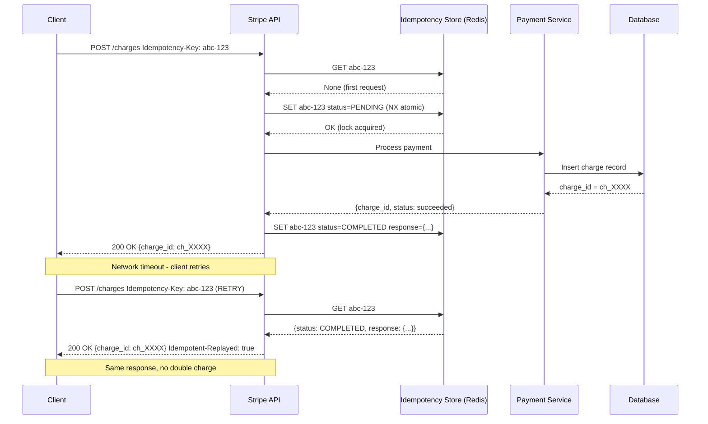

⚡ TL;DR - Stripe's API is the industry standard for
payment API design; key architectural lessons from
Stripe's incidents and design patterns: (1) idempotency
keys are mandatory for payment APIs (network retry
must not cause double charge); (2) Stripe uses
`Stripe-Version` header to allow old integrations to
run forever (never forced migration); (3) their 2019
outage pattern: a database failover (expected) triggered
a cascade via connection pool exhaustion (unexpected);
(4) Stripe's retry logic uses exponential backoff with
idempotency keys, not just retrying on failure; (5)
the API design principle: "your customers' code will
be wrong, build the API to handle that gracefully"
(duplicate requests, missing idempotency keys, wrong
retry patterns).

---

| #069 | Category: HTTP & APIs | Difficulty: ★★★★ |
|:---|:---|:---|
| **Depends on:** | Idempotency and Safe Retries, Rate Limiting, API Observability, Async Job Pattern | |
| **Used by:** | API Versioning at Scale, API Platform Design | |
| **Related:** | Idempotency, Rate Limiting, Observability, Async Job, Twitter Incident, Versioning | |

---

### 🔥 The Problem This Solves

**WORLD WITHOUT IT:**
User clicks "Pay $99" in your e-commerce app. Request
goes to Stripe. Network times out at 30 seconds.
Your app receives a timeout error. Did the charge
succeed? Unknown. If you retry: risk of double charge
($198). If you don't retry: risk of lost sale. The
user's credit card may or may not have been charged.
This is the fundamental problem of distributed systems
applied to money: money must never be double-counted,
but retries are necessary for reliability.

**THE BREAKING POINT:**
Stripe's SLA for the payments API: 99.999% uptime
(5.2 minutes downtime per year). Every minute of
outage: thousands of businesses cannot accept payments.
Each outage has direct revenue impact for Stripe's
customers and reputational damage for Stripe. The
challenge: design for the fault, not the happy path.

---

### 📘 Textbook Definition

**Stripe's core API reliability patterns:**

**Idempotency keys:**
Client generates a unique key for each payment attempt.
Sent as `Idempotency-Key: <uuid>` header. Stripe
stores the key + result. Replay of the same key
returns the same result (no new charge). Key expires
after 24 hours.

**API versioning (non-breaking evolution):**
Stripe uses date-based versions: `2023-10-16`. Client
specifies version in `Stripe-Version` header or
during API key creation. Stripe runs all historical
API versions simultaneously. Once on a version:
never forced to migrate. New features in new versions;
old versions supported indefinitely (or very long sunset).

**Retry strategy:**
Stripe's official client libraries implement exponential
backoff with jitter on 5xx errors and network timeouts.
Always use idempotency key to make retries safe.
Retry on: 500, 503, network timeout. Do NOT retry on:
400, 401, 402, 422 (these indicate a permanent error).

**Stripe's outage pattern (2019, 2023):**
Database failover triggers connection pool exhaustion.
Services holding connections to the old primary wait
for timeouts (30s). New connections cannot be established
(pool limit reached). Request queue fills. Timeout
cascade. Mitigation: aggressive connection timeouts
(5s, not 30s), circuit breakers, connection pool
minimum size (maintain a baseline of ready connections).

---

### ⏱️ Understand It in 30 Seconds

**One line:**
Stripe solved the hardest problem in API design -
making payment APIs idempotent, retryable, and
backwards-compatible forever - and published the
patterns for everyone to follow.

**One analogy:**
> Stripe's idempotency key is like a check number on
> a paper check. If you write check #1234 for $99
> and the bank loses it, you can write another check
> with the same #1234. The bank will not cash the same
> check number twice. Even if the original check shows
> up later, it's rejected as a duplicate. Without the
> check number (idempotency key): two separate payments,
> double the charge.

**One insight:**
Stripe's approach to API design is fundamentally
pessimistic: assume every request will be retried.
Assume every client will send duplicate requests.
Assume networks will fail mid-request. Build the API
to handle all of these gracefully by default. This
is the opposite of optimistic API design ("assume
the client will call us correctly once"). The shift:
"make the client's mistakes safe" rather than "prevent
the client from making mistakes."

---

### 🔩 First Principles Explanation

**Idempotency key implementation:**

```python
import uuid
import json
import redis
import hashlib
from datetime import timedelta
from typing import Optional, Any
from enum import Enum

redis_client = redis.Redis()

class IdempotencyStatus(Enum):
    PENDING = "pending"
    COMPLETED = "completed"
    FAILED = "failed"

class IdempotencyStore:
    """Stripe-style idempotency key store."""

    KEY_TTL = timedelta(hours=24)  # Keys expire after 24h

    def _redis_key(self, idempotency_key: str) -> str:
        return f"idempotency:{idempotency_key}"

    def get(self, idempotency_key: str) -> Optional[dict]:
        """Return cached result if key exists, else None."""
        data = redis_client.get(self._redis_key(idempotency_key))
        if data:
            return json.loads(data)
        return None

    def set_pending(
        self, idempotency_key: str, request_hash: str
    ) -> bool:
        """
        Mark key as pending (in-flight request).
        Returns False if key already exists (concurrent request).
        Uses SET NX (atomic) to prevent race condition.
        """
        record = {
            "status": IdempotencyStatus.PENDING.value,
            "request_hash": request_hash,
        }
        result = redis_client.set(
            self._redis_key(idempotency_key),
            json.dumps(record),
            nx=True,  # Only set if NOT already exists
            ex=int(self.KEY_TTL.total_seconds()),
        )
        return result is not None  # True = we set it (lock acquired)

    def set_completed(
        self,
        idempotency_key: str,
        response_status: int,
        response_body: dict,
        request_hash: str,
    ) -> None:
        """Store completed response for future replays."""
        record = {
            "status": IdempotencyStatus.COMPLETED.value,
            "response_status": response_status,
            "response_body": response_body,
            "request_hash": request_hash,
        }
        redis_client.set(
            self._redis_key(idempotency_key),
            json.dumps(record),
            ex=int(self.KEY_TTL.total_seconds()),
        )

def compute_request_hash(
    endpoint: str, body: dict
) -> str:
    """Hash to detect if same key is used with different body."""
    content = json.dumps(
        {"endpoint": endpoint, "body": body}, sort_keys=True
    )
    return hashlib.sha256(content.encode()).hexdigest()
```

**Middleware to enforce idempotency:**

```python
from fastapi import Request, Response
from fastapi.responses import JSONResponse

idempotency_store = IdempotencyStore()

async def idempotency_middleware(
    request: Request, call_next
) -> Response:
    """
    Intercept POST/PATCH requests and enforce idempotency.
    Stripe's approach: idempotency key required for
    all state-mutating operations.
    """
    # Only apply to mutating operations
    if request.method not in ("POST", "PATCH"):
        return await call_next(request)

    idempotency_key = request.headers.get("Idempotency-Key")
    if not idempotency_key:
        return JSONResponse(
            status_code=400,
            content={
                "error": {
                    "type": "idempotency_error",
                    "message": (
                        "Idempotency-Key header required for "
                        "POST/PATCH requests."
                    ),
                }
            },
        )

    body = await request.body()
    body_json = json.loads(body) if body else {}
    request_hash = compute_request_hash(
        str(request.url), body_json
    )

    # Check for existing result
    existing = idempotency_store.get(idempotency_key)
    if existing:
        if existing["request_hash"] != request_hash:
            return JSONResponse(
                status_code=422,
                content={
                    "error": {
                        "type": "idempotency_error",
                        "message": (
                            "Idempotency key used with different "
                            "request parameters."
                        ),
                    }
                },
            )
        if existing["status"] == IdempotencyStatus.PENDING.value:
            return JSONResponse(
                status_code=409,
                content={"error": {"message": "Request in progress"}},
            )
        # Return cached response
        return JSONResponse(
            status_code=existing["response_status"],
            content=existing["response_body"],
            headers={"Idempotent-Replayed": "true"},
        )

    # New key: acquire lock
    acquired = idempotency_store.set_pending(
        idempotency_key, request_hash
    )
    if not acquired:
        # Concurrent request with same key
        return JSONResponse(
            status_code=409,
            content={"error": {"message": "Concurrent request"}},
        )

    # Process request
    response = await call_next(request)
    response_body = json.loads(response.body)

    # Store result
    idempotency_store.set_completed(
        idempotency_key,
        response.status_code,
        response_body,
        request_hash,
    )
    return response
```

---

### 🧪 Thought Experiment

**SCENARIO: Payment retry - what can go wrong?**

```
Attempt 1:
  Client: POST /charges {amount: 9900, idempotency_key: "abc-123"}
  → Network: times out after 30s
  → Did charge succeed? UNKNOWN

Without idempotency:
  Attempt 2 (retry):
  Client: POST /charges {amount: 9900}  # No idempotency key
  → Charge succeeds: DOUBLE CHARGE
  → Customer charged $198 instead of $99

With idempotency (Stripe pattern):
  Attempt 2 (retry):
  Client: POST /charges {amount: 9900, idempotency_key: "abc-123"}
  → Server: idempotency_key "abc-123" already completed
    (Attempt 1 succeeded before timeout)
  → Return cached result: charge_id="ch_XXXX", status="succeeded"
  → No new charge. Same result. $99 charged once.

  If Attempt 1 truly failed (DB write failed before timeout):
  → Server: idempotency_key "abc-123" failed
  → Attempt 2 with same key processes fresh: new charge
  → Or: Attempt 2 returns same failure (client must use new key)
```

---

### 🧠 Mental Model / Analogy

> Stripe's API design philosophy is "defensive by default."
> They assume the worst: clients will retry, clients
> will have bugs, networks will fail. Rather than
> documenting "don't do this," they make the dangerous
> thing safe. Idempotency keys make retries safe.
> Backwards-compatible versioning makes migration safe.
> Exponential backoff in their SDKs makes client
> failure safe. This is the difference between an
> API and a platform: a platform protects you from
> your own mistakes.

---

### 📶 Gradual Depth - Five Levels

**Level 1 - What it is (anyone can understand):**
Stripe's payment API is designed so that if your
code crashes mid-payment, you can safely retry without
double-charging the customer. They also never force
you to update your code when they update their API.

**Level 2 - How to use it (junior developer):**
Always send `Idempotency-Key: <uuid>` with POST requests
to Stripe. Use `stripe.Charge.create()` with the
official SDK (it handles retries automatically). Never
use a new idempotency key per retry - reuse the same
key for the same payment attempt.

**Level 3 - How it works (mid-level engineer):**
Stripe stores the idempotency key + response in
Redis with 24h TTL. On duplicate request: return
cached response. The idempotency key is verified
against the request hash (if same key, different body:
return 422 Unprocessable). This means: changing
the charge amount while retrying with the same key
is an error.

**Level 4 - Why it was designed this way (senior/staff):**
Stripe's versioning decision: run all versions
simultaneously. Cost: maintaining 10+ years of version
branches. Benefit: zero migration pressure on customers.
Alternative: sunset old versions (force migration).
Stripe chose the former because payment integrations
are often built-and-forgotten (no engineering team
actively maintaining them). Forced migrations cause
outages for customers who cannot respond quickly.
The business case: supporting old versions forever
is cheaper than the support cost of broken customer
integrations after forced migration.

**Level 5 - Mastery (distinguished engineer):**
Stripe's 2019 outage pattern (publicly documented):
A database failover (planned maintenance) caused all
connections to the old primary to timeout. The timeout
duration: 30 seconds (default TCP timeout). For 30s:
no requests could proceed, connection pool slots were
occupied by pending timeouts. The queue of waiting
requests grew. When failover completed and timeouts
cleared: the backlog caused a secondary surge that
overwhelmed the new primary. Lessons: (1) aggressive
TCP timeout (5s) - do not wait 30s to detect a dead
connection; (2) connection pool max size limits must
account for failover scenarios (reduce pool size to
reduce the number of stuck connections); (3) circuit
breaker: open after 10% failure rate to stop new
requests from joining the queue during failover.
These lessons are now encoded in Stripe's operational
playbook and their engineering blog.

---

### ⚙️ How It Works (Mechanism)

**Stripe-style API versioning:**

```python
from fastapi import FastAPI, Header, Request
from fastapi.responses import JSONResponse
from enum import Enum
from typing import Optional

class ApiVersion(str, Enum):
    V_2020_03_02 = "2020-03-02"
    V_2022_11_15 = "2022-11-15"
    V_2023_10_16 = "2023-10-16"

CURRENT_VERSION = ApiVersion.V_2023_10_16
SUPPORTED_VERSIONS = set(ApiVersion)

app = FastAPI()

def get_api_version(
    stripe_version: Optional[str] = Header(
        None, alias="Stripe-Version"
    )
) -> ApiVersion:
    if stripe_version is None:
        return CURRENT_VERSION  # Default to latest
    if stripe_version not in SUPPORTED_VERSIONS:
        # Unknown version - return error
        # Stripe: returns an error, not silently uses current
        raise ValueError(f"Unknown API version: {stripe_version}")
    return ApiVersion(stripe_version)

@app.post("/v1/charges")
async def create_charge(
    request: Request,
    stripe_version: Optional[str] = Header(
        None, alias="Stripe-Version"
    )
):
    version = get_api_version(stripe_version)

    # Version-specific response serialization
    charge = await process_charge(request)
    return serialize_charge(charge, version)

def serialize_charge(charge: dict, version: ApiVersion) -> dict:
    """Each version has its own serialization."""
    if version == ApiVersion.V_2020_03_02:
        # Old format: card object directly on charge
        return {
            "id": charge["id"],
            "amount": charge["amount"],
            "card": charge.get("payment_method_details"),  # old name
        }
    # 2022+: payment_method_details replaces card
    return {
        "id": charge["id"],
        "amount": charge["amount"],
        "payment_method_details": charge.get("payment_method_details"),
    }
```



---

### 🔄 The Complete Picture - End-to-End Flow

**Retry client matching Stripe's SDK pattern:**

```python
import uuid
import time
import httpx

class StripeStyleApiClient:
    """Client implementing Stripe-style reliable API calls."""

    MAX_RETRIES = 2
    INITIAL_DELAY = 0.5  # 500ms
    MAX_DELAY = 20.0

    def __init__(self, api_key: str, base_url: str):
        self.client = httpx.Client(
            base_url=base_url,
            headers={
                "Authorization": f"Bearer {api_key}",
                "Stripe-Version": "2023-10-16",
            },
            timeout=httpx.Timeout(30.0),
        )

    def create_charge(
        self,
        amount: int,
        currency: str,
        payment_method: str,
        idempotency_key: Optional[str] = None,
    ) -> dict:
        if idempotency_key is None:
            idempotency_key = str(uuid.uuid4())

        headers = {"Idempotency-Key": idempotency_key}
        body = {
            "amount": amount,
            "currency": currency,
            "payment_method": payment_method,
        }

        return self._post_with_retry(
            "/charges", body, headers, idempotency_key
        )

    def _post_with_retry(
        self, endpoint: str, body: dict,
        headers: dict, idempotency_key: str
    ) -> dict:
        delay = self.INITIAL_DELAY
        last_error = None

        for attempt in range(self.MAX_RETRIES + 1):
            try:
                response = self.client.post(
                    endpoint, json=body, headers=headers
                )

                # Permanent errors: no retry
                if response.status_code in (400, 401, 402, 422):
                    response.raise_for_status()

                # Rate limit: wait for Retry-After
                if response.status_code == 429:
                    retry_after = float(
                        response.headers.get("Retry-After", delay)
                    )
                    time.sleep(retry_after)
                    continue

                # Server errors: retry with backoff
                if response.status_code >= 500:
                    raise httpx.HTTPStatusError(
                        "Server error", request=response.request,
                        response=response
                    )

                return response.json()

            except (httpx.TimeoutException, httpx.HTTPStatusError) as e:
                last_error = e
                if attempt < self.MAX_RETRIES:
                    jitter = delay * 0.25
                    sleep_time = min(
                        delay + jitter, self.MAX_DELAY
                    )
                    time.sleep(sleep_time)
                    delay *= 2  # Exponential backoff
                    # Reuse SAME idempotency key on retry
                    continue

        raise last_error
```

---

### 💻 Code Example

**Example 1 - BAD: Payment retry without idempotency**

```python
# BAD: Retry without idempotency key = double charge risk
def charge_customer(amount: int, payment_method: str):
    for attempt in range(3):
        try:
            response = requests.post(
                "https://api.stripe.com/v1/charges",
                data={"amount": amount,
                      "payment_method": payment_method},
                headers={"Authorization": f"Bearer {API_KEY}"}
            )
            return response.json()
        except requests.exceptions.Timeout:
            continue  # DANGER: may have succeeded already

# GOOD: Idempotency key guarantees exactly-once semantics
def charge_customer(
    amount: int,
    payment_method: str,
    idempotency_key: str  # Caller provides key
):
    for attempt in range(3):
        try:
            response = requests.post(
                "https://api.stripe.com/v1/charges",
                data={"amount": amount,
                      "payment_method": payment_method},
                headers={
                    "Authorization": f"Bearer {API_KEY}",
                    "Idempotency-Key": idempotency_key  # SAME KEY each retry
                }
            )
            return response.json()
        except requests.exceptions.Timeout:
            time.sleep(1)
            continue  # Safe: same idempotency key = no double charge
```

---

### ⚖️ Comparison Table

| Pattern | Stripe's Approach | Alternative | Stripe's Reason |
|:---|:---|:---|:---|
| API versioning | Date-based, all versions forever | Semver, sunset old versions | Payment integrations are often unmaintained |
| Retry safety | Idempotency keys required | Documentation-only guidance | Assume clients will retry wrong |
| Error codes | Machine-readable type + human message | HTTP status only | Clients must handle errors programmatically |
| SDK responsibility | SDK handles retry + backoff | Client implements retry | Reduce client bugs by centralizing logic |
| Outage communication | Real-time status page + postmortem | No communication | Developer trust requires transparency |

---

### ⚠️ Common Misconceptions

| Misconception | Reality |
|:---|:---|
| Idempotency key uniqueness just prevents duplicates | Idempotency keys also protect against concurrent requests. Stripe uses SET NX (atomic "set if not exists") to handle the case where two requests arrive simultaneously with the same key. The second concurrent request receives a 409 Conflict (or waits), not a duplicate response. The lock (PENDING state) is set atomically before processing begins. |
| Stripe versioning means they maintain 10 code branches | Stripe does not maintain N code branches for N versions. Their API is built with version adapters: core business logic is version-agnostic, and version-specific serialization/deserialization layers translate to/from the version the client expects. The version affects the input/output format, not the business logic. This is the Adapter pattern applied to API versioning. |
| API idempotency is only needed for payment APIs | Idempotency is needed for any state-mutating operation where: (1) the operation is not naturally idempotent (PUT can be, POST usually is not); (2) the client may retry on timeout; (3) the consequence of duplication is material (user creation, order placement, email sending). Idempotency keys solve the distributed systems problem of "at-least-once delivery" for HTTP. |

---

### 🚨 Failure Modes & Diagnosis

**Connection pool exhaustion during database failover**

**Symptom:** API suddenly returns 503 Service Unavailable.
Database failover log shows successful switch to replica.
But API does not recover for 30-60 seconds after
failover completes.

**Root Cause:** Connection pool holding N connections
to old primary. Each connection waits for TCP timeout
(default: 30s). Pool slots occupied. New connections
cannot be established.

**Diagnosis:**
```python
# Monitor active DB connections
import psycopg2
from psycopg2 import pool

# Check pool state
db_pool = pool.ThreadedConnectionPool(
    minconn=5,
    maxconn=20,
    dsn="postgresql://localhost/mydb",
    connect_timeout=5,    # 5s to establish new connection
    options="-c statement_timeout=30000"  # 30s query timeout
)

# In a diagnostic endpoint:
@app.get("/health/db")
async def db_health():
    return {
        "pool_min": db_pool.minconn,
        "pool_max": db_pool.maxconn,
        # Number of connections currently checked out:
        "connections_in_use": len(db_pool._used),
    }
```

**Fix:**
```python
# Stripe lesson: aggressive connection timeout
# Not the database query timeout - the TCP connection timeout
# This controls how long to wait for a new connection
# to the database (not an existing query)

# psycopg2:
connection = psycopg2.connect(
    dsn=DATABASE_URL,
    connect_timeout=5   # Fail fast: 5s, not 30s
)

# SQLAlchemy:
from sqlalchemy import create_engine
engine = create_engine(
    DATABASE_URL,
    pool_size=10,
    max_overflow=5,
    pool_timeout=5,         # 5s wait for pool slot
    pool_pre_ping=True,     # Check connection before use
    connect_args={"connect_timeout": 5},  # TCP connect timeout
)
```

---

### 🔗 Related Keywords

**Prerequisites (understand these first):**
- `Idempotency and Safe Retries` - the core pattern
- `API Throttling and Rate Limiting` - rate limits
  during incidents

**Builds On This (learn these next):**
- `API Versioning at Scale (Stripe Strategy)` - detailed
  versioning implementation
- `Designing an API Platform for 100+ Teams` - building
  platforms with Stripe-level reliability

---

### 📌 Quick Reference Card

```
┌──────────────────────────────────────────────────────────┐
│ Idempotency  │ POST requires Idempotency-Key header      │
│              │ Store result in Redis with 24h TTL        │
│              │ SET NX for concurrent request protection  │
├──────────────┼───────────────────────────────────────────┤
│ Versioning   │ Date-based: Stripe-Version: 2023-10-16   │
│              │ All versions run simultaneously forever   │
├──────────────┼───────────────────────────────────────────┤
│ Retry        │ Retry on 5xx + timeout                    │
│              │ Never retry on 4xx (permanent error)      │
│              │ Exponential backoff + same idempotency key│
├──────────────┼───────────────────────────────────────────┤
│ DB Failover  │ connect_timeout=5 (not 30s default)       │
│              │ pool_pre_ping=True (detect dead connection)│
│              │ Circuit breaker: open at 10% failure rate │
├──────────────┼───────────────────────────────────────────┤
│ ONE-LINER    │ "Make retries safe (idempotency), make   │
│              │  versions permanent, fail fast on          │
│              │  dead connections"                        │
└──────────────────────────────────────────────────────────┘
```

**If you remember only 3 things:**
1. Idempotency key = same key per payment attempt,
   across all retries. Different attempt = new key.
   Stored in Redis with SET NX to handle concurrency.
2. Versioning: date-based versions, run all versions
   forever, adapter pattern for serialization.
   Never force migration.
3. Failover cascade: aggressive connect_timeout (5s,
   not 30s), pool_pre_ping, circuit breaker.
   The cascade is caused by slow connection timeout,
   not the failover itself.

---

### 💎 Transferable Wisdom

**Reusable Engineering Principle:**
"Design for the fault, not the happy path." Stripe
assumes every payment request will be retried. They
build idempotency as a first-class primitive, not an
afterthought. The mental model shift: instead of
"what happens when the request succeeds?" ask "what
happens when the request is retried 3 times? What
happens when 1000 clients retry simultaneously after
an outage?" Design the failure behavior explicitly.
This principle: in API design, assume retries; in
database design, assume partial writes; in messaging,
assume duplicate messages; in networking, assume packet
loss. Build the system to handle the fault mode
correctly - the happy path handles itself.

**Where else this pattern applies:**
- Event processing (Kafka): at-least-once delivery +
  consumer idempotency (same message processed twice
  = same result)
- Database writes: upsert (INSERT ON CONFLICT UPDATE)
  instead of INSERT then UPDATE separately
- File uploads: chunked upload with resume = each
  chunk has its own idempotency key

---

### 💡 The Surprising Truth

Stripe's most valuable engineering asset is not their
payment processing infrastructure - it is their API
design documentation. Stripe's API reference is
considered the gold standard for API documentation
in the industry. When Stripe writes "this endpoint
is idempotent with the Idempotency-Key header," they
include: (1) the exact semantics of idempotency in
this context; (2) what to do if you get a 409 (key
in-progress); (3) what Stripe does if the key expires;
(4) code examples in 8 languages; (5) what NOT to do
(using the same key for different amounts). This level
of documentation investment is itself a product decision:
it reduces support volume, increases developer trust,
and makes the API safer to use. The lesson: for a
platform API, documentation quality IS product quality.
A poorly documented idempotency key implementation is
worse than no idempotency key at all - developers
implement it wrong and think they are protected.

---

### ✅ Mastery Checklist

**You've mastered this when you can:**
1. **IMPLEMENT** An idempotency key middleware with
   Redis SET NX, PENDING state, and COMPLETED result
   caching with 24h TTL.
2. **EXPLAIN** Why Stripe uses date-based versioning
   and why all versions run forever (business case).
3. **DIAGNOSE** Connection pool exhaustion during
   database failover and fix with aggressive TCP timeout.
4. **DESIGN** A retry client that uses exponential
   backoff, reuses the same idempotency key on retry,
   and does NOT retry on 4xx errors.
5. **APPLY** The "design for the fault" principle to
   a new API endpoint (what are the failure modes?
   How do you make them safe?).

---

### 🎯 Interview Deep-Dive

**Q1: How would you design an idempotent payment API?**

*Why they ask:* Tests distributed systems + API design.

*Strong answer includes:*
- Client generates idempotency key (UUID) per payment
  attempt. Sends as `Idempotency-Key` header on every
  retry of the same attempt.
- Server: Redis SET NX to atomically acquire the key
  (prevents concurrent duplicates). Mark as PENDING.
  Process payment. Store result (status, response body).
  Mark as COMPLETED with 24h TTL.
- On retry (same key): return cached result immediately.
  No new payment processed.
- Edge cases: (1) key used with different amount = 422
  Unprocessable (request hash mismatch); (2) key in
  PENDING (another request processing) = 409 Conflict;
  (3) key expired (>24h) = process as new request.
- Persistence: Redis for speed, but also persist to
  database for durability (Redis can be lost on restart
  without persistence configured).

**Q2: How does Stripe handle API versioning without
breaking existing integrations?**

*Why they ask:* Tests API design depth (versioning).

*Strong answer includes:*
- Date-based versions: `2023-10-16`, `2022-11-15`, etc.
  Client specifies via `Stripe-Version` header.
- All historical versions run simultaneously. Once a
  customer is on a version: never forced to migrate.
  Stripe committed to supporting versions indefinitely.
- Implementation: adapter pattern. Core business logic
  is version-agnostic (charge processing, validation).
  Version-specific serialization adapters convert
  between internal representation and version-specific
  response format.
- New features: always added to new versions only.
  Old versions do not get new features (no backporting).
  This creates a migration incentive without forcing it.
- Why not semver (major.minor.patch): semver implies
  major versions are breaking. Stripe's "every version
  is supported forever" removes the concept of breaking
  vs non-breaking. Date versioning makes it clearer
  which version a customer is on (use your Stripe
  dashboard: it shows your API version and migration
  guide for each newer version).
