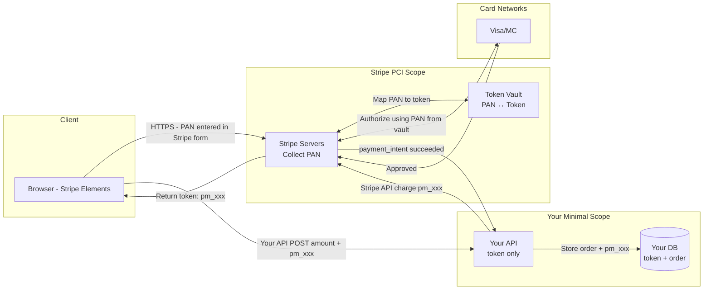

⚡ TL;DR - PCI-DSS (Payment Card Industry Data Security
Standard) defines security requirements for any system
that stores, processes, or transmits cardholder data
(CHD); key principle: minimize CHD scope by tokenizing
card numbers at the edge (before your API sees them);
if your API uses Stripe/Braintree/Adyen: your scope
is minimal - they handle CHD; the most critical
requirements for APIs: (1) TLS 1.2+ everywhere in
the CHD environment; (2) no PANs (Primary Account
Numbers) in logs; (3) audit log every access to CHD;
(4) network segmentation (CHD environment isolated);
(5) quarterly vulnerability scans + annual penetration
test; tokenization = the most impactful scope-reduction
strategy; storing a token (e.g., `tok_abc123`) is
NOT PCI scope; storing a PAN (4111 1111 1111 1111) IS.

---

| #070 | Category: HTTP & APIs | Difficulty: ★★★★ |
|:---|:---|:---|
| **Depends on:** | OAuth 2.0 Security, JWT Security, CSRF/SSRF, TLS/Certificate Pinning | |
| **Used by:** | Stripe API Outage Pattern, API Versioning at Scale | |
| **Related:** | JWT Security, OAuth Security, CSRF/SSRF, TLS Pinning, Stripe Incident, Versioning | |

---

### 🔥 The Problem This Solves

**WORLD WITHOUT IT:**
E-commerce company stores full card numbers in their
database. Database is compromised. 2 million PANs
(Primary Account Numbers) exposed. Every cardholder's
card must be cancelled and reissued. Bank issues $20
fine per card = $40 million fine. Visa/Mastercard
terminate the merchant agreement = company cannot
accept card payments = business failure. Plus: lawsuits,
reputation damage, regulatory investigations. This
happened to Target (2013, 40M cards), Home Depot
(2014, 56M cards), Heartland Payment Systems (2009,
130M cards). PCI-DSS exists to prevent this.

**THE BREAKING POINT:**
The specific technical failure in most card breaches:
card data was captured in transit (before encryption)
or stored in clear text in database tables or application
logs. The attackers did not need to break TLS - they
installed malware at the payment terminal (Target,
point of sale), or found PANs in application logs
(a developer added debug logging that printed full
request bodies including card numbers).

---

### 📘 Textbook Definition

**PCI-DSS (Payment Card Industry Data Security Standard):**
A set of security standards established by the PCI
Security Standards Council (Visa, Mastercard, American
Express, Discover, JCB). Required for any organization
that stores, processes, or transmits cardholder data.
Current version: PCI-DSS v4.0 (2022). Previous: v3.2.1.

**12 PCI-DSS requirements (high-level):**
1. Install and maintain network security controls
2. Apply secure configurations to all system components
3. Protect stored account data (if stored at all)
4. Protect cardholder data with strong cryptography
   during transmission over open, public networks
5. Protect all systems and networks from malicious software
6. Develop and maintain secure systems and software
7. Restrict access to system components by business need
8. Identify users and authenticate access to system
   components
9. Restrict physical access to cardholder data
10. Log and monitor all access to network resources
    and cardholder data
11. Test security of systems and networks regularly
12. Support information security with organizational
    policies and programs

**PCI-DSS compliance levels (merchants):**
- Level 1: > 6M card transactions/year. Annual on-site
  audit by a QSA (Qualified Security Assessor).
- Level 2: 1-6M transactions/year. Annual SAQ
  (Self-Assessment Questionnaire).
- Level 3-4: < 1M transactions/year. SAQ + quarterly
  vulnerability scan.

**Cardholder Data (CHD) components:**
- PAN (Primary Account Number): the 16-digit card number
  - MUST NEVER be stored unless absolutely required
  - If stored: must be truncated (first 6 + last 4),
    hashed (one-way hash), or encrypted (HSM-managed key)
- Expiry date, CVV, cardholder name: Sensitive
  Authentication Data (SAD)
  - CVV: MUST NEVER be stored (not even encrypted)
  - Expiry: MAY be stored with PAN
- SAD (CVV, PIN, magnetic stripe data): MUST NEVER
  be stored, not even encrypted, after authorization

**Tokenization:**
Replace the PAN with a random token (a non-predictable
value that maps back to the PAN in a token vault).
Token: `tok_1Mv9qnJl2eZvKYlo2Cg8QZZX` (Stripe format)
PAN: `4111 1111 1111 1111` (what you NEVER want to
store or log). The token vault (held by Stripe, Braintree,
your HSM) is PCI-in-scope. Your API using the token
is NOT PCI-in-scope (the token has no value to an attacker).

---

### ⏱️ Understand It in 30 Seconds

**One line:**
PCI-DSS is the security standard that turns card data
into a liability management problem - the answer is
to never let your system see actual card numbers
(tokenization).

**One analogy:**
> PCI-DSS is like a nuclear materials handling protocol.
> The primary goal is not to make handling nuclear
> material safe - it is to minimize the amount of
> nuclear material you handle. The fewer people, systems,
> and processes that ever touch the material, the fewer
> ways for it to escape. Tokenization is equivalent
> to storing a radiation badge number (non-radioactive)
> instead of actual radioactive material. If the badge
> number is stolen: the thief has a useless number.
> The real material stays locked in the vault.

**One insight:**
The best PCI-DSS strategy is scope reduction: the fewer
systems in your CHD environment, the fewer requirements
apply. By using a payment processor (Stripe/Braintree)
and their JavaScript Elements/Hosted Fields (card data
collected by THEIR front-end, not yours): your
application never sees the PAN. Your scope drops to
SAQ A (the simplest possible self-assessment). You
answer "I use a payment processor that handles all
CHD" to most questions. The irony: most PCI-DSS
compliance effort is spent on systems that could have
been out of scope if the architecture was designed
differently.

---

### 🔩 First Principles Explanation

**CHD scope reduction via tokenization flow:**

```
WITHOUT tokenization (in-scope everything):
Client → Your API → Your DB (stores PAN) → Card network
         ↑                    ↑
    PCI-in-scope         PCI-in-scope
    (your servers        (your database,
    see the PAN)          logs, backups)

WITH tokenization (scope-reduced):
Client → Stripe.js → Stripe servers (collect PAN)
         (card form    ↓
         hosted by    Stripe returns token: tok_xxx
         Stripe)
         ↓
Client → Your API {amount, token: tok_xxx}
         ↓
Your API → Stripe API {charge token tok_xxx}
         ↓                    ↓
Your DB (stores tok_xxx)  Stripe charges actual card

Your API never sees PAN.
Your DB stores only token (useless without Stripe vault).
Your scope: SAQ A or SAQ A-EP (minimum possible).
Stripe's servers are PCI Level 1 certified.
```

---

### 🧪 Thought Experiment

**SCENARIO: What logs are safe to write?**

```python
# Scenario: User pays $99.99 with card 4111 1111 1111 1111

# Request body received by your API:
{
    "amount": 9999,
    "payment_method_id": "pm_1Mv9qn...",  # Stripe token
    "customer_id": "cus_abc123"
}

# SAFE to log: ✓
logger.info(
    "Charge initiated",
    amount=9999,
    customer_id="cus_abc123",
    payment_method_id="pm_1Mv9qn..."  # Token, not PAN
)
# No PAN, no CVV, no expiry in logs.

# If you're collecting card data directly (in-scope):
# BAD: logging full request body ✗
logger.debug("Request body: %s", json.dumps(request.body))
# This would log:
# {"card_number": "4111111111111111", "cvv": "123"}
# PCI violation + breach liability

# GOOD: Mask sensitive fields before logging ✓
def mask_card_data(data: dict) -> dict:
    """Remove or mask CHD before logging."""
    safe = data.copy()
    if "card_number" in safe:
        pan = safe["card_number"]
        # Only last 4 digits allowed in logs
        safe["card_number"] = f"****-****-****-{pan[-4:]}"
    # CVV must NEVER appear in logs - remove entirely
    safe.pop("cvv", None)
    safe.pop("cvc", None)
    return safe

logger.debug("Request: %s", json.dumps(mask_card_data(body)))
```

---

### 🧠 Mental Model / Analogy

> PCI-DSS compliance is like running a classified
> government program. The core strategy: minimize
> the number of people with clearance (reduce scope).
> For each system component: ask "does this component
> NEED to handle classified data?" If no: redesign
> it so it doesn't (scope reduction). If yes: apply
> the full protocol (encryption, access control, audit
> logging, physical security). Tokenization is the
> scope reduction mechanism: route classified data
> (PANs) through the cleared channel (payment processor)
> and give your non-cleared systems (your API, DB)
> only the security badge number (token).

---

### 📶 Gradual Depth - Five Levels

**Level 1 - What it is (anyone can understand):**
PCI-DSS is a set of rules that say how businesses
must protect credit card numbers. The main rule: don't
store card numbers unless you absolutely must, and if
you do, protect them very carefully.

**Level 2 - How to use it (junior developer):**
Use Stripe or Braintree for payment processing. Use
their hosted payment form (Stripe Elements/Checkout)
so card numbers go directly to Stripe, never to your
servers. You receive a token. Store the token. Never
log request/response bodies that could contain card
numbers. Enable TLS 1.2+ everywhere.

**Level 3 - How it works (mid-level engineer):**
PCI-DSS has 12 requirement domains. For an API:
requirements 3 (data protection), 4 (encryption in
transit), 6 (secure software), 8 (authentication),
and 10 (logging) are most relevant. Implement: TLS 1.2+
for all CHD transmission, no PAN in logs (mask last-4
only), audit log for all CHD access, MFA for admin
access to CHD environment, quarterly vulnerability
scan (automated).

**Level 4 - Why it was designed this way (senior/staff):**
PCI-DSS v4.0 (2022) shift: from "must implement
specific controls" to "must achieve the security
objective." This allows organizations to use equivalent
controls (compensating controls) if the standard
control is not feasible. Example: instead of "must
use only approved cipher suites" - "must use strong
cryptography appropriate to the risk." This gives
organizations flexibility but requires documentation
of equivalence. The shift reflects the industry's
maturity: PCI council acknowledges that rigid controls
become outdated (PCI-DSS v3 cipher suite list became
outdated as TLS 1.3 emerged).

**Level 5 - Mastery (distinguished engineer):**
Point-to-point encryption (P2PE): card data encrypted
at the payment terminal hardware, transmitted encrypted
through your network, decrypted only at the payment
processor's HSM. Your network carries only ciphertext.
P2PE reduces merchant scope dramatically: if
certified P2PE is used, the merchant network is not
in scope for PCI-DSS because it never carries
decryptable cardholder data. This is the hardware-level
equivalent of tokenization. Used in: retail POS
terminals (Verifone, Ingenico with P2PE certification).
The API implication: if you build a payment terminal
integration, P2PE vendor certification is the correct
approach, not building your own encryption.

---

### ⚙️ How It Works (Mechanism)

**API-level PCI compliance controls:**

```python
import logging
import re
from functools import wraps
from typing import Callable
import hashlib

# 1. PAN masking for logging
class PCIAwareLogger:
    """Logger that redacts PANs and CVVs before logging."""

    # Luhn-valid 13-19 digit sequences (simplified regex)
    PAN_PATTERN = re.compile(r'\b\d{13,19}\b')
    CVV_PATTERN = re.compile(
        r'"(?:cvv|cvc|cvv2|security_code)"\s*:\s*"\d{3,4}"',
        re.IGNORECASE
    )

    def __init__(self, name: str):
        self._logger = logging.getLogger(name)

    def _redact(self, message: str) -> str:
        # Mask PAN: keep last 4, mask rest
        def mask_pan(match):
            pan = match.group(0)
            return '*' * (len(pan) - 4) + pan[-4:]

        message = self.PAN_PATTERN.sub(mask_pan, message)
        # Remove CVV entirely
        message = self.CVV_PATTERN.sub(
            '"cvv": "***REDACTED***"', message
        )
        return message

    def info(self, message: str, **kwargs) -> None:
        self._logger.info(self._redact(str(message)))

    def debug(self, message: str, **kwargs) -> None:
        self._logger.debug(self._redact(str(message)))

# 2. Audit logging for CHD access
import time

class CHDAuditLogger:
    """Log every access to cardholder data (PCI Req 10)."""

    def __init__(self, audit_log_path: str):
        self.audit_logger = logging.getLogger("pci.audit")
        # Separate file handler for audit logs
        handler = logging.FileHandler(audit_log_path)
        handler.setFormatter(logging.Formatter(
            "%(asctime)s %(message)s"
        ))
        self.audit_logger.addHandler(handler)

    def log_access(
        self,
        user_id: str,
        action: str,
        resource: str,
        outcome: str,
        ip_address: str,
    ) -> None:
        """
        PCI Req 10.2: log every individual user access
        to cardholder data.
        """
        self.audit_logger.critical(
            f"AUDIT user_id={user_id} action={action} "
            f"resource={resource} outcome={outcome} "
            f"ip={ip_address} timestamp={time.time()}"
        )

# 3. TLS version enforcement (FastAPI middleware)
from fastapi import Request, Response
from fastapi.responses import JSONResponse

async def enforce_tls_version_middleware(
    request: Request, call_next
) -> Response:
    """
    Reject requests that did not use TLS 1.2+.
    In practice: handled at load balancer/nginx level.
    This middleware is for defense-in-depth.
    """
    # This header is set by nginx/LB based on TLS negotiation
    tls_version = request.headers.get("X-TLS-Version", "TLSv1.3")

    if tls_version in ("TLSv1", "TLSv1.1", "SSLv3"):
        return JSONResponse(
            status_code=400,
            content={
                "error": f"TLS {tls_version} not supported. "
                         "Use TLS 1.2 or higher."
            }
        )
    return await call_next(request)

# 4. PAN truncation for storage
def truncate_pan_for_display(pan: str) -> str:
    """
    PCI Req 3.4: Mask PAN when displayed.
    Only first 6 and last 4 digits may be visible.
    """
    clean = pan.replace(" ", "").replace("-", "")
    if len(clean) < 10:
        return "****"
    return f"{clean[:6]}{'*' * (len(clean) - 10)}{clean[-4:]}"
    # 4111111111111111 → 411111******1111

# 5. Tokenization via Stripe (preferred approach)
import stripe

class PaymentService:
    """
    PCI scope-reduced payment processing.
    Card data collected by Stripe Elements (client-side).
    This service only handles tokens.
    """

    def __init__(self, stripe_secret_key: str):
        stripe.api_key = stripe_secret_key

    def charge_customer(
        self,
        payment_method_id: str,  # Stripe token, not PAN
        amount_cents: int,
        currency: str,
        idempotency_key: str,
        customer_id: str,
    ) -> dict:
        """
        This function never sees a PAN.
        payment_method_id is a Stripe token.
        """
        try:
            payment_intent = stripe.PaymentIntent.create(
                amount=amount_cents,
                currency=currency,
                payment_method=payment_method_id,
                customer=customer_id,
                confirm=True,
                idempotency_key=idempotency_key,
            )
            return {
                "status": payment_intent.status,
                "payment_intent_id": payment_intent.id,
            }
        except stripe.error.CardError as e:
            return {"status": "failed", "error": e.user_message}
```



---

### 🔄 The Complete Picture - End-to-End Flow

**Network segmentation (PCI Req 1):**

```
╔══════════════════════════════════════════╗
║  Internet                                ║
╚══════════════════════════════════════════╝
         │ HTTPS only
         ▼
╔══════════════════════════════════════════╗
║  DMZ (Load Balancer + WAF)              ║
║  - TLS termination (TLS 1.2+ only)      ║
║  - WAF rules (OWASP)                    ║
╚══════════════════════════════════════════╝
         │ Internal HTTP (no CHD)
         ▼
╔══════════════════════════════════════════╗
║  Application Zone                        ║
║  - Your API servers                      ║
║  - Handles tokens only (no CHD scope)   ║
╚══════════════════════════════════════════╝
         │ Separate firewall segment
         ▼
╔══════════════════════════════════════════╗
║  CHD Zone (if you store CHD)            ║
║  - Strict access control (MFA required) ║
║  - Audit logging for every access       ║
║  - Network: only ports 443 and DB port  ║
║  - No outbound internet access          ║
╚══════════════════════════════════════════╝

Firewall rules example (CHD zone):
  ALLOW: app_zone:ANY → chd_zone:5432 (DB)
  ALLOW: chd_zone:5432 → chd_zone:ANY (DB response)
  DENY: ALL OTHER TRAFFIC to/from chd_zone
```

---

### 💻 Code Example

**Example 1 - BAD: Storing sensitive authentication data**

```python
# BAD: Storing CVV (ABSOLUTE PCI VIOLATION)
# CVV must NEVER be stored, not even encrypted
card_data = {
    "pan": "4111111111111111",
    "expiry": "12/2025",
    "cvv": "123",  # NEVER store this - PCI violation
}
db.execute(
    "INSERT INTO cards VALUES (%s, %s, %s)",
    (card_data["pan"], card_data["expiry"], card_data["cvv"])
)

# BAD: Logging full card data
logger.debug("Processing card: %s", json.dumps(card_data))
# This log line is a PCI breach - CVV and PAN in plaintext log

# GOOD: Use tokenization - never store or log PANs/CVVs
payment_method = stripe.PaymentMethod.create(
    type="card",
    card={
        "number": "4111111111111111",
        "exp_month": 12,
        "exp_year": 2025,
        "cvc": "123",
    },
)
# Stripe returns: pm_1Mv9qnJl2eZvKYlo...
# Store ONLY the token - no PAN, no CVV
db.execute(
    "INSERT INTO payment_methods(token, customer_id) VALUES (%s, %s)",
    (payment_method.id, customer_id)
)
logger.info("Payment method created: %s", payment_method.id)
# Log shows token only (no CHD)
```

---

### ⚖️ Comparison Table

| Approach | CHD Scope | PCI Level Required | Complexity |
|:---|:---|:---|:---|
| Store raw PANs | All systems that touch data | Level 1 (full audit) | Very high |
| Tokenization (Stripe Elements) | Only the token vault (Stripe's) | SAQ A or SAQ A-EP | Low |
| Direct API integration (no hosted fields) | Your servers (capture PAN in transit) | SAQ D | Medium-high |
| P2PE (hardware encryption) | Network carries only ciphertext | Reduced SAQ | Medium (hardware setup) |

---

### ⚠️ Common Misconceptions

| Misconception | Reality |
|:---|:---|
| TLS encryption means you can store PANs safely | PCI-DSS prohibits storing CVVs even if encrypted. For PANs: if stored, must be encrypted with HSM-managed keys AND access controlled AND audit logged. TLS protects data in transit; PCI-DSS also governs data at rest, access controls, and audit logging. TLS alone is not sufficient. |
| Using Stripe means you are PCI-compliant | Using Stripe reduces your PCI scope but does not make you PCI-compliant automatically. You must still: (1) use Stripe Elements/Hosted Fields (not your own card form); (2) not log or transmit PANs through your systems; (3) maintain TLS 1.2+ on your web servers; (4) implement access controls on your admin systems; (5) complete an SAQ A (self-assessment). Compliance is an audit, not a checkbox. |
| CVV (security code) can be stored encrypted | No. CVV/CVC/CVV2 must NEVER be stored after payment authorization, not even encrypted. This is one of the most absolute requirements in PCI-DSS (Requirement 3.2). It is also technically enforced by Stripe and other processors: they do not return the CVV in their API responses for this reason. A system that stores CVVs fails PCI-DSS immediately. |
| PCI-DSS only applies to large companies | PCI-DSS applies to ANY organization that accepts, transmits, or stores cardholder data, regardless of size. The compliance level (Level 1-4) determines the rigor of the assessment, but the requirements themselves apply to everyone. A three-person startup that takes card payments is subject to PCI-DSS. |

---

### 🚨 Failure Modes & Diagnosis

**PAN appearing in application logs**

**Symptom:** Security scan / PCI audit finds PANs
in application logs. Finding: "cardholder data in
application log file /var/log/app/api.log".

**How it happens:**
```python
# Developer added debug logging:
logger.debug("Payment request: %s", request.body)
# If request contains card_number: PAN is now in logs

# Or: exception handler logs full context:
except Exception as e:
    logger.error("Payment failed: %s", str(e))
    # Exception message may contain PAN from validation error:
    # "ValidationError: card_number '4111111111111111' is invalid"
```

**Detection:**
```bash
# Scan logs for Luhn-valid 13-19 digit sequences
grep -P '\b\d{13,19}\b' /var/log/app/*.log | head -20

# More targeted: match common card patterns
grep -P '\b4\d{15}\b|\b5[1-5]\d{14}\b|\b3[47]\d{13}\b' \
     /var/log/app/*.log
```

**Fix:**
1. Immediately: rotate all logs to separate location,
   restrict access to security team.
2. Implement PAN masking in logging middleware (see
   PCIAwareLogger above).
3. Audit all logging statements for CHD in the codebase.
4. Add pre-commit hook to scan for PAN-containing
   log statements.
5. Report the finding to your QSA (PCI compliance auditor).

---

### 🔗 Related Keywords

**Prerequisites (understand these first):**
- `OAuth 2.0 Security Best Practices` - authentication
  for payment APIs
- `TLS and Certificate Pinning` - encryption requirements

**Builds On This (learn these next):**
- `Real-World API Incident - Stripe API Outage Pattern` -
  Stripe's reliability patterns in practice
- `API Versioning at Scale` - PCI version management

---

### 📌 Quick Reference Card

```
┌──────────────────────────────────────────────────────────┐
│ Store PAN?   │ Never, if possible. If must: encrypt +   │
│              │ HSM key + audit log. Tokenize instead.   │
├──────────────┼───────────────────────────────────────────┤
│ Store CVV?   │ NEVER. Absolute prohibition. Not even    │
│              │ encrypted. Remove after authorization.    │
├──────────────┼───────────────────────────────────────────┤
│ Logs         │ Mask PAN (first 6 + last 4 max)          │
│              │ Remove CVV, expiry from all logs          │
├──────────────┼───────────────────────────────────────────┤
│ Scope        │ Use Stripe Elements → SAQ A (minimal)    │
│ reduction    │ Host your own form → SAQ D (extensive)   │
├──────────────┼───────────────────────────────────────────┤
│ TLS          │ 1.2+ required for all CHD transmission   │
│              │ No TLS 1.0/1.1 in CHD environment        │
├──────────────┼───────────────────────────────────────────┤
│ ONE-LINER    │ "If your API never sees a PAN, your PCI  │
│              │  scope is minimal (SAQ A)"               │
└──────────────────────────────────────────────────────────┘
```

**If you remember only 3 things:**
1. Never store CVV. Ever. Not encrypted. Not hashed.
   Not "temporarily." This is an absolute PCI requirement.
2. Tokenize: use Stripe Elements (card form hosted by
   Stripe). Your API receives a token, not a PAN.
   Your PCI scope drops from SAQ D to SAQ A.
3. Scan logs for PANs: a PAN in a log file is a PCI
   breach. Implement masking middleware before any
   logging statement can capture a PAN.

---

### 💎 Transferable Wisdom

**Reusable Engineering Principle:**
"The scope of a security compliance requirement is
determined by data flow, not organizational boundaries."
PCI-DSS scope is defined by: does this system store,
process, or transmit CHD? If yes: in scope. The most
powerful compliance engineering principle: redesign
the data flow to route sensitive data through a
compliance-certified third party (Stripe, HSM). Your
system then only handles non-sensitive tokens.
This pattern: compliance scope reduction via data
flow redesign. Where else: HIPAA (route PHI through
certified BAA partner; your system stores de-identified
reference IDs); SOC 2 (route customer data through
certified cloud providers with SOC 2 reports; your
CI/CD pipeline handles only build artifacts);
encryption key management (route key operations
through HSM or KMS; your application handles only
ciphertexts).

**Where else this pattern applies:**
- HIPAA: route PHI through certified EHR systems;
  your app uses patient IDs (non-PHI references)
- GDPR: route PII through consent management platform;
  your analytics uses pseudonymous IDs
- Export control (ITAR): route controlled technical
  data through approved systems; your API handles
  reference numbers

---

### 💡 The Surprising Truth

The most dangerous PCI risk for most modern APIs is
not inadequate encryption or weak passwords - it is
over-logging. During the early days of a startup,
developers commonly set log levels to DEBUG and log
full request/response bodies. This practice, which
is incredibly useful for debugging, becomes a PCI
time bomb when the startup integrates payment
processing. A single `logger.debug("Request: %s",
request.body)` line, added by a developer debugging
an unrelated feature, can cause PANs to appear in:
application logs, centralized logging systems (Splunk,
Datadog), log archives in S3, developer local machines
(where logs are tailed during development). The entire
log pipeline suddenly becomes in-scope for PCI. The
fix is not just implementing masking - it is understanding
that logging policy is a compliance control, not an
operational detail. Logging configuration changes
should be reviewed with the same rigor as code changes
that touch payment flows.

---

### ✅ Mastery Checklist

**You've mastered this when you can:**
1. **EXPLAIN** The difference between SAQ A and SAQ D
   PCI compliance levels and what architectural change
   moves you from D to A (Stripe Elements).
2. **IMPLEMENT** A PAN masking middleware that regex-
   matches 13-19 digit sequences in log messages and
   replaces with `****1234` (last 4 only).
3. **DESIGN** A payment system architecture where your
   API never receives a PAN (using tokenization).
4. **LIST** What can never be stored under PCI-DSS:
   CVV, full magnetic stripe data, PIN block.
5. **AUDIT** An application's logging configuration for
   PCI exposure: what grep command finds PANs in logs?

---

### 🎯 Interview Deep-Dive

**Q1: Your API handles payment processing. How do you
ensure PCI-DSS compliance?**

*Why they ask:* Tests security compliance depth.

*Strong answer includes:*
- First: scope reduction. Use Stripe Elements or Braintree
  Hosted Fields for card collection. Your API receives
  a token (pm_xxx), never a PAN. This moves you from
  SAQ D to SAQ A.
- TLS 1.2+ for all communication. Disable TLS 1.0/1.1.
  HSTS on all endpoints.
- No CVV storage. Ever. Remove after authorization.
  Your database should have no CVV column.
- Logging: implement masking middleware. Scan all log
  statements that could receive request bodies. Use
  grep to verify no PANs in existing logs.
- Access control: MFA for all admin access to any
  CHD-adjacent system. RBAC with least privilege.
- Audit logging: log every access to payment-related
  data (who, when, what action, outcome).
- Quarterly: automated vulnerability scan of all
  in-scope systems.
- Annual: penetration test by an approved vendor.

**Q2: What data is absolutely prohibited from being
stored under PCI-DSS, even encrypted?**

*Why they ask:* Tests specific PCI-DSS knowledge.

*Strong answer includes:*
- CVV/CVC/CVV2/security code (the 3-4 digit code):
  NEVER stored, not encrypted, not hashed, not "briefly."
  Must be removed from memory after authorization.
- Full magnetic stripe data (track data): includes
  all data on the magnetic stripe. Not stored after
  authorization. Even encrypted storage prohibited.
- PIN and PIN block: encrypted PIN used for chip/PIN
  transactions. Not stored after authorization.
- These are all "Sensitive Authentication Data" (SAD):
  PCI-DSS explicitly prohibits post-authorization
  storage of all SAD, regardless of encryption.
- Contrast: PAN (card number) MAY be stored if: (1)
  encrypted with HSM-managed key; (2) access controlled;
  (3) audit logged. Storing PANs is allowed but strongly
  discouraged. SAD storage is absolutely prohibited.
- Why: SAD can be used to re-generate a working card.
  A thief with the magnetic stripe data and CVV can
  make a physical counterfeit card. Even if encrypted,
  storage creates an attack target. The requirement
  exists because there is NO legitimate business reason
  to store SAD after authorization - the issuing bank
  already has all this data.
