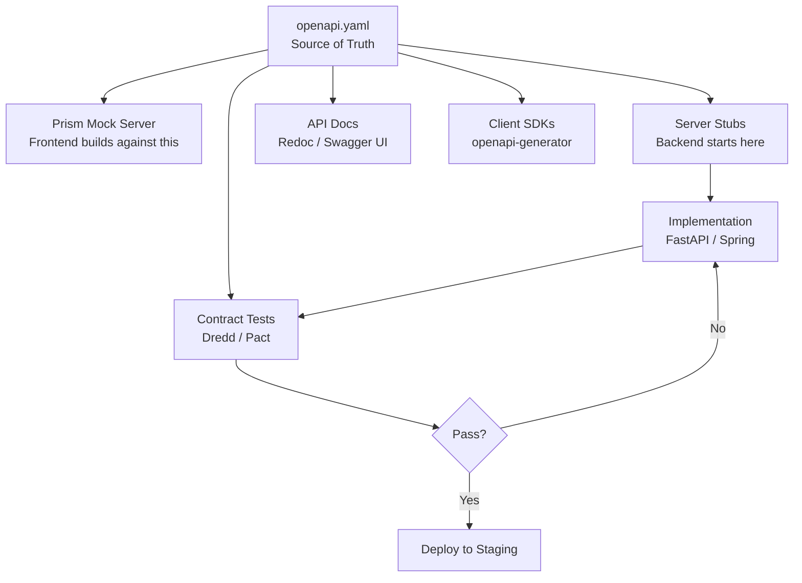

⚡ TL;DR - API-First means the API contract (OpenAPI
spec) is designed and reviewed BEFORE any implementation
begins; the contract is the source of truth, not the
code; benefits: parallel development (frontend, backend,
mobile can build against a mock server from day one),
early contract review catches design mistakes before
they are expensive to fix, generated SDK/docs/mocks
are always in sync with the actual API; the alternative
(code-first: implement then document) produces APIs
that reflect implementation details rather than consumer
needs; Swagger Hub, Stoplight Studio, Bump.sh are
the toolchain; the industry shift: API-first is now
the standard for teams that expose APIs to external
developers or have multiple client teams.

---

| #071 | Category: HTTP & APIs | Difficulty: ★★★★ |
|:---|:---|:---|
| **Depends on:** | REST API Design, HTTP Methods and Status Codes, OpenAPI Specification, API Documentation | |
| **Used by:** | Internal vs Public API Design, API Versioning Strategy, API Platform Design, API Deprecation | |
| **Related:** | REST Design, HTTP Methods, OpenAPI, API Docs, Internal vs Public, Versioning, Platform, Deprecation | |

---

### 🔥 The Problem This Solves

**WORLD WITHOUT IT (code-first approach):**
Backend team builds the API. Frontend team waits for
backend to deploy to staging before they can start
integration. Backend deploys to staging: API design
has problems. The endpoint to get a user's orders
returns all 5000 historical orders in one response
(no pagination). Frontend needs to redesign their UI.
Backend must add pagination. 2-week delay. This cycle
repeats 3-4 times. Launch delayed by 6 weeks.

**THE BREAKING POINT:**
Twilio's 2019 developer survey: 63% of developers
said they faced integration issues because the API
changed during development. API design changes after
initial implementation are 4-10× more expensive than
design changes in the specification phase (no code
deployed, no clients written, no tests running).

---

### 📘 Textbook Definition

**API-First design:**
A development strategy where the API contract (typically
an OpenAPI/Swagger specification) is designed, reviewed,
and finalized BEFORE implementation begins. The spec
is the single source of truth. Code, documentation,
mocks, and SDKs are generated FROM the spec.

**Code-first design (the alternative):**
Implementation is written first. Documentation and
specs are generated from the code (e.g., FastAPI's
auto-generated docs). The implementation becomes the
source of truth. Design mistakes are discovered by
consumers, not reviewers.

**OpenAPI Specification (OAS):**
YAML/JSON contract describing the API: paths, methods,
request/response schemas, authentication, error formats.
Version 3.1.0 is current (2021). Supported by: Swagger
Editor, Stoplight, Redoc, Postman.

**Contract-driven development:**
Frontend, backend, and mobile teams all build against
the API contract simultaneously using mock servers.
Contract tests (Pact, Dredd) verify implementation
matches the contract.

**Design-time tools:**
- Stoplight Studio: GUI OpenAPI editor with live preview
- Swagger Editor: in-browser YAML editor
- Redocly: API portal generation from OpenAPI spec
- Prism (Stoplight): mock server from OpenAPI spec
  (serves example responses without a real backend)
- oapi-codegen: generate Go server stubs from OpenAPI
- openapi-generator: generate client SDKs in 50+ languages

---

### ⏱️ Understand It in 30 Seconds

**One line:**
API-first means your OpenAPI contract is written and
reviewed before a single line of implementation code,
so teams can build in parallel against a mock server.

**One analogy:**
> API-First is like an architect's blueprint. You design
> the building (API contract) in detail before construction
> begins. The electricians (frontend team), plumbers
> (mobile team), and builders (backend team) all work
> from the same blueprint in parallel. Without a
> blueprint: the electricians start wiring while the
> builders are still deciding where the walls go. The
> walls change, the wiring is in the wrong place,
> everything must be redone.

**One insight:**
The most valuable aspect of API-first is not the
generated code or docs - it is the forced design
review before implementation. When a team writes an
OpenAPI spec first, they are forced to answer design
questions: What are the error response schemas? How
is pagination handled? What does the 404 response
look like? Should this be one endpoint or two? These
questions are trivial to answer in a 1-hour design
review and expensive to change after implementation.
API-first is a forcing function for design quality.

---

### 🔩 First Principles Explanation

**OpenAPI-first workflow:**

```
1. DESIGN PHASE (before any code):
   Write OpenAPI spec (YAML/JSON)
   ↓
   Review with all consumers:
     Frontend: "Do you need pagination here?"
     Mobile: "Does this response fit in 4G?"
     Backend: "Can we implement this efficiently?"
   ↓
   Iterate until all consumers sign off
   ↓ (spec is now locked for this version)

2. PARALLEL DEVELOPMENT:
   Backend: implements routes (tested against spec)
   Frontend: builds against Prism mock server
             (serves example responses from spec)
   Mobile: same - builds against mock server
   Tests: contract tests generated from spec
   Docs: published from spec (Redoc, Slate)
   SDKs: generated from spec (openapi-generator)

3. INTEGRATION:
   Replace mock server URL with real staging URL
   Run contract tests: verify implementation matches spec
   Fix any deviations (implementation bug, not spec bug)
```

---

### 🧪 Thought Experiment

**SCENARIO: Design review catches expensive mistake**

```
Proposed OpenAPI spec:
  POST /orders
  Response 200:
    schema:
      type: object
      properties:
        order_id: {type: string}
        status: {type: string}
        items:
          type: array
          items: {$ref: '#/components/schemas/OrderItem'}
        customer:
          type: object
          properties:
            id: {type: string}
            name: {type: string}
            email: {type: string}
            address: {$ref: '#/components/schemas/Address'}
            payment_methods:
              type: array
              items: {$ref: '#/components/schemas/PaymentMethod'}
              # Returns ALL payment methods for the customer?
              # This endpoint is POST /orders, not GET /customers

REVIEW CATCHES:
Mobile developer: "Why does creating an order return
all the customer's payment methods? My response is
300KB when I only need the order confirmation."

Design fix (in spec, before any code):
  Remove `payment_methods` from order creation response.
  Add to separate GET /customers/{id}/payment-methods.

Cost to fix in spec: 5 minutes.
Cost to fix after implementation + frontend built
against the old schema: 2-3 days.
```

---

### 🧠 Mental Model / Analogy

> API-first is the difference between designing a door
> and carving a door-shaped hole. Code-first: you build
> a wall (implement the API), then cut holes where
> doors seem needed (add endpoints as consumers ask).
> The doors are the wrong size, in the wrong place,
> and the hinges open the wrong way. API-first: you
> design the doors (API contract) before building
> the walls. You know exactly what size and type each
> door needs to be (consumer requirements), where it
> goes (endpoint design), and how it opens (request/
> response schema). The walls are built around the
> pre-designed doors.

---

### 📶 Gradual Depth - Five Levels

**Level 1 - What it is (anyone can understand):**
API-first means you design and agree on the API's
input/output format before any code is written. Like
agreeing on a restaurant menu before the chef starts
cooking, so the customers (other developers) know
what to expect.

**Level 2 - How to use it (junior developer):**
Write an `openapi.yaml` file before implementation.
Run `prism mock openapi.yaml` to start a mock server.
Frontend/mobile teams build against `localhost:4010`
(Prism). When backend is ready, switch to the real
URL. Validate implementation with `dredd openapi.yaml
https://staging.api.com`.

**Level 3 - How it works (mid-level engineer):**
Mock server (Prism) reads the OpenAPI spec's `examples`
field. Returns those examples for requests that match
the spec. Contract tests (Dredd) make actual HTTP
requests to the real implementation and validate
responses against the spec schemas. If the implementation
returns a field not in the spec: test fails. If it
omits a required field: test fails.

**Level 4 - Why it was designed this way (senior/staff):**
API-first enables organizational scaling. With code-first:
every API change requires back-and-forth between
backend and frontend teams (backend implements, frontend
tests, finds issues, backend changes). Communication
is the bottleneck. With API-first: all communication
about the API design happens in the spec review phase
(async, async can be parallel). Implementation phase
is parallel with no cross-team communication needed
(each team has the spec as the source of truth).
Conway's Law: your API design reflects your communication
structure. API-first restructures the communication
to happen before implementation.

**Level 5 - Mastery (distinguished engineer):**
The highest-maturity form: API-first as a platform
governance model. The platform team owns the API
design style guide (naming conventions, pagination
patterns, error response format, authentication
standards). Individual API teams submit OpenAPI specs
for review against the style guide before implementation.
Automated linting (Spectral, Redocly): enforces style
guide rules in CI/CD. The spec is checked into git;
spec changes trigger mock server updates, documentation
rebuilds, and SDK regeneration automatically. The
platform team reviews specs like code reviews, not
API deployments. This is the model at Stripe, Twilio,
and large enterprise API platforms.

---

### ⚙️ How It Works (Mechanism)

**OpenAPI spec for an orders API:**

```yaml
# openapi.yaml
openapi: "3.1.0"
info:
  title: "Orders API"
  version: "2024-01-15"  # Date-based version

servers:
  - url: https://api.example.com/v1
    description: Production
  - url: https://api.staging.example.com/v1
    description: Staging

paths:
  /orders:
    post:
      summary: Create an order
      operationId: createOrder
      tags: [Orders]
      security:
        - BearerAuth: []
      parameters:
        - in: header
          name: Idempotency-Key
          required: true
          schema:
            type: string
            format: uuid
          description: UUID to make the request idempotent
      requestBody:
        required: true
        content:
          application/json:
            schema:
              $ref: '#/components/schemas/CreateOrderRequest'
            example:
              items:
                - product_id: "prod_abc123"
                  quantity: 2
              payment_method_id: "pm_xxx"
      responses:
        '201':
          description: Order created successfully
          headers:
            Location:
              schema:
                type: string
              description: URL of the created order
          content:
            application/json:
              schema:
                $ref: '#/components/schemas/Order'
              example:
                order_id: "ord_xyz789"
                status: "pending"
                total_cents: 9998
                created_at: "2024-01-15T10:30:00Z"
        '400':
          $ref: '#/components/responses/BadRequest'
        '401':
          $ref: '#/components/responses/Unauthorized'
        '429':
          $ref: '#/components/responses/TooManyRequests'

components:
  schemas:
    CreateOrderRequest:
      type: object
      required: [items, payment_method_id]
      properties:
        items:
          type: array
          minItems: 1
          items:
            $ref: '#/components/schemas/OrderItemRequest'
        payment_method_id:
          type: string
          description: Stripe payment method ID

    Order:
      type: object
      required: [order_id, status, total_cents, created_at]
      properties:
        order_id:
          type: string
        status:
          type: string
          enum: [pending, processing, completed, cancelled]
        total_cents:
          type: integer
          minimum: 0
        created_at:
          type: string
          format: date-time

    Error:
      type: object
      required: [error]
      properties:
        error:
          type: object
          required: [type, message]
          properties:
            type:
              type: string
              enum:
                - validation_error
                - authentication_error
                - rate_limit_error
                - internal_error
            message:
              type: string
            param:
              type: string
              description: The field that caused the error

  responses:
    BadRequest:
      description: Validation error
      content:
        application/json:
          schema:
            $ref: '#/components/schemas/Error'
    Unauthorized:
      description: Missing or invalid authentication
      content:
        application/json:
          schema:
            $ref: '#/components/schemas/Error'
    TooManyRequests:
      description: Rate limit exceeded
      headers:
        Retry-After:
          schema:
            type: integer
      content:
        application/json:
          schema:
            $ref: '#/components/schemas/Error'

  securitySchemes:
    BearerAuth:
      type: http
      scheme: bearer
      bearerFormat: JWT
```

**Generating server stubs and running mock:**

```bash
# Generate FastAPI server stubs from OpenAPI spec
pip install openapi-generator-cli
openapi-generator-cli generate \
  -i openapi.yaml \
  -g python-fastapi \
  -o ./server-stubs/

# Run Prism mock server (serves spec examples)
npm install -g @stoplight/prism-cli
prism mock openapi.yaml
# Mock server at http://localhost:4010
# GET /orders → returns spec example response immediately

# Validate implementation against spec
npm install -g @apidevtools/swagger-parser dredd
dredd openapi.yaml https://staging.api.example.com/v1

# Lint spec against style guide (Spectral)
npm install -g @stoplight/spectral-cli
spectral lint openapi.yaml --ruleset .spectral.yaml
```



---

### 🔄 The Complete Picture - End-to-End Flow

**CI/CD spec gate:**

```yaml
# .github/workflows/api-spec.yml
name: API Spec Validation

on:
  pull_request:
    paths:
      - 'api/openapi.yaml'

jobs:
  lint-spec:
    runs-on: ubuntu-latest
    steps:
      - uses: actions/checkout@v3

      - name: Lint OpenAPI spec
        run: |
          npx @stoplight/spectral-cli lint api/openapi.yaml \
            --ruleset api/.spectral.yaml \
            --fail-severity warn

      - name: Validate spec syntax
        run: |
          npx @apidevtools/swagger-parser validate api/openapi.yaml

      - name: Check for breaking changes
        uses: oasdiff/oasdiff-action/breaking@main
        with:
          base: origin/main:api/openapi.yaml
          revision: api/openapi.yaml

      - name: Generate and verify mock
        run: |
          npx @stoplight/prism-cli mock api/openapi.yaml &
          sleep 2
          # Run smoke test against mock
          curl -f http://localhost:4010/orders \
            -H "Authorization: Bearer test" \
            -H "Idempotency-Key: $(uuidgen)" || exit 1
```

---

### 💻 Code Example

**Example 1 - BAD: Code-first leads to inconsistent API**

```python
# BAD: Code-first - API shape reflects implementation
# Each developer invents their own response format
@app.get("/users/{user_id}")
def get_user(user_id: str):
    user = db.get(user_id)
    return {"user": user}  # Wrapped in "user" key

@app.get("/orders/{order_id}")
def get_order(order_id: str):
    order = db.get(order_id)
    return order  # Not wrapped - inconsistent!

@app.get("/products/{product_id}")
def get_product(product_id: str):
    product = db.get(product_id)
    return {"data": product, "status": "ok"}  # Different again

# Consumer must handle 3 different response shapes.
# This is what happens without an API-first contract.

# GOOD: API-first - all responses follow the same schema
# Defined in openapi.yaml before implementation
# FastAPI validates against Pydantic models generated from spec:
from pydantic import BaseModel

class UserResponse(BaseModel):
    """Generated from OpenAPI spec $ref: '#/components/schemas/User'"""
    user_id: str
    name: str
    email: str
    created_at: datetime

@app.get("/users/{user_id}", response_model=UserResponse)
def get_user(user_id: str) -> UserResponse:
    # Pydantic validates response matches spec schema
    return UserResponse(**db.get_user(user_id))
```

---

### ⚖️ Comparison Table

| Approach | Design Quality | Development Speed | Consumer Experience |
|:---|:---|:---|:---|
| Code-first | Low (reflects impl details) | Fast initial start | Inconsistent, surprises |
| API-first (no tooling) | High | Slower start, faster overall | Consistent, predictable |
| API-first + mock server | High | Parallel development | Consistent + early feedback |
| API-first + contract tests | High | Same as above | Guaranteed consistency |

---

### ⚠️ Common Misconceptions

| Misconception | Reality |
|:---|:---|
| FastAPI/Swagger auto-generation is API-first | FastAPI generates OpenAPI from code annotations. This is code-first: the code is the source of truth, the spec is derived. True API-first: the OpenAPI spec is written first, then code is generated from or validates against the spec. The direction matters. Code-first produces specs that reflect implementation; API-first produces implementations that conform to the spec. |
| API-first means the spec never changes | The spec CAN change in API-first. The discipline is that spec changes go through a review process BEFORE implementation changes. You do not implement a change and then update the spec to match - you update the spec, get approval, then implement. This preserves the spec as the source of truth. |
| API-first only works for external APIs | API-first is equally valuable for internal APIs consumed by multiple teams. If a backend service is consumed by a frontend team and a mobile team: the same problems exist (parallel development, design reviews). API-first is about reducing coordination overhead, not about public vs internal. |

---

### 🚨 Failure Modes & Diagnosis

**Implementation drifts from spec (spec rot)**

**Symptom:** Consumers use the spec as documentation
and find that the real API behaves differently.
Example: spec says `order_status` is an enum of
`[pending, processing, completed]`. Real API returns
`PENDING` (uppercase). Spec says response includes
`created_at` (ISO 8601). Real API returns `createdAt`
(camelCase). Consumers find this via runtime errors,
not at build time.

**Root Cause:** Spec was written API-first but contract
tests were never implemented. The spec was never
enforced as a constraint on the implementation.

**Fix:**
```bash
# Run Dredd contract tests in CI/CD
# Every PR must pass contract tests before merge
dredd openapi.yaml https://staging.api.example.com \
  --sorted \
  --reporter cli \
  --fail-on-error

# Or use Pact for consumer-driven contract tests
# (contracts defined by consumers, not spec authors)
```

---

### 🔗 Related Keywords

**Prerequisites (understand these first):**
- `REST API Design Principles` - the principles that
  go into a good API spec
- `OpenAPI Specification` - the format for API contracts
- `API Documentation` - what the spec generates

**Builds On This (learn these next):**
- `Internal vs Public API Design Principles`
- `API Versioning at Scale (Stripe Strategy)`
- `Designing an API Platform for 100+ Teams`

---

### 📌 Quick Reference Card

```
┌──────────────────────────────────────────────────────────┐
│ Workflow     │ Design spec → Review → Lock → Parallel dev│
│              │ Mock server enables parallel from day 1   │
├──────────────┼───────────────────────────────────────────┤
│ Tools        │ Stoplight Studio: GUI spec editor         │
│              │ Prism: mock server from spec              │
│              │ Dredd: contract tests vs real impl        │
│              │ Spectral: spec linting rules              │
├──────────────┼───────────────────────────────────────────┤
│ Key benefit  │ Design mistakes caught in spec review,    │
│              │ not after implementation                  │
├──────────────┼───────────────────────────────────────────┤
│ vs code-first│ FastAPI auto-docs = code-first (impl is   │
│              │ source of truth). API-first = spec is     │
│              │ source of truth, code validates against.  │
├──────────────┼───────────────────────────────────────────┤
│ ONE-LINER    │ "Spec before code: design the door before │
│              │  building the wall"                       │
└──────────────────────────────────────────────────────────┘
```

**If you remember only 3 things:**
1. API-first: spec is written BEFORE implementation.
   Code-first: spec generated from code after the fact.
   The direction determines who is the source of truth.
2. Mock server (Prism) enables parallel development:
   frontend builds against mock from day 1, switches
   to real backend when ready. No waiting.
3. Contract tests (Dredd) enforce the spec: if the
   implementation drifts from the spec, CI/CD fails.

---

### 💎 Transferable Wisdom

**Reusable Engineering Principle:**
"Interface before implementation." This is the API
design version of a principle that applies everywhere:
define the contract (interface, API, schema, protocol)
before implementing either side. In software: define
the interface (Java interface, Python abstract class,
TypeScript interface) before writing the implementation
or the caller. In databases: define the schema before
writing queries. In messaging: define the message
format (Protobuf, Avro) before writing producer or
consumer. The contract review is the highest-leverage
engineering activity: a 1-hour interface review
prevents days of integration rework. API-first is
the same principle applied to web APIs.

**Where else this pattern applies:**
- Protobuf-first development: define .proto schema
  before writing gRPC service or client
- Schema-first GraphQL: define GraphQL schema before
  implementing resolvers
- Event schema-first: define Avro/JSONSchema for Kafka
  events before implementing producer or consumer

---

### 💡 The Surprising Truth

The most common reason API-first fails is not tooling
- it is organizational culture. Teams adopt the tools
(write an OpenAPI spec, set up Prism) but skip the
design review. The spec is written by one developer,
committed to git, and implementation begins without
any cross-team review. The spec might as well be
generated from code. The value of API-first is not
the YAML file - it is the structured conversation
between consumers and implementers that happens BEFORE
code is written. Shopify's API team (one of the best
in the industry) is explicit about this: their API
review process takes 2-4 weeks for major API changes,
involves product, security, developer experience, and
implementation teams, and explicitly covers backward
compatibility, performance implications for mobile,
and documentation quality. The tooling is secondary.
The discipline is primary.

---

### ✅ Mastery Checklist

**You've mastered this when you can:**
1. **WRITE** An OpenAPI 3.1 spec for a CRUD API with
   reusable components, authentication, and comprehensive
   error responses before any implementation.
2. **RUN** Prism mock server from the spec and demonstrate
   parallel development against the mock.
3. **CONFIGURE** Dredd contract tests in CI/CD to fail
   on any deviation between spec and implementation.
4. **SET UP** Spectral linting with custom rules for
   your team's API style guide.
5. **EXPLAIN** Why FastAPI auto-documentation is
   code-first (not API-first) and what the difference
   means for source-of-truth ownership.

---

### 🎯 Interview Deep-Dive

**Q1: What is API-first design and how does it differ
from code-first?**

*Why they ask:* Tests API design maturity and process thinking.

*Strong answer includes:*
- API-first: the OpenAPI contract is written and reviewed
  BEFORE implementation begins. The contract is the source
  of truth. Code validates against it.
- Code-first: code is written first. OpenAPI spec is
  generated from code annotations (FastAPI, SpringDoc).
  The implementation is the source of truth. The spec
  describes what was built.
- The key difference: direction of truth flow. API-first
  means design decisions are made in the spec, not discovered
  in the code. Code-first means design decisions are
  made by the implementer, documented afterward.
- Benefits of API-first: (1) parallel development (frontend
  and backend build simultaneously against spec/mock);
  (2) design mistakes caught in review, not after deployment;
  (3) generated SDKs, docs, tests are in sync with actual
  contract; (4) governance: platform team can review
  specs before implementation begins.
- When code-first is acceptable: prototype/internal tool
  where you are the only consumer, speed is priority,
  design quality is less critical.

**Q2: How do you enforce that the API implementation
matches the spec?**

*Why they ask:* Tests practical tooling knowledge.

*Strong answer includes:*
- Contract tests: Dredd or Pact. Dredd reads the OpenAPI
  spec, makes actual HTTP requests to the implementation,
  validates responses against spec schemas. Run in CI/CD.
  PR cannot merge if contract tests fail.
- Pact (consumer-driven): consumers write contract tests
  from their perspective. Producer must satisfy all consumer
  contracts. Better for microservices where consumers
  are known.
- Spec linting in CI: Spectral (Stoplight) validates the
  spec itself against style guide rules (naming conventions,
  required descriptions, error response format).
- Breaking change detection: oasdiff, Optic. Detect
  breaking changes in spec diffs (removed fields,
  changed types, removed endpoints). Block PRs that
  introduce breaking changes without version bump.
- Generated server stubs: generate server stubs from
  the spec. Backend fills in the implementation inside
  the generated interface. Any deviation from the interface
  is a compile error.
