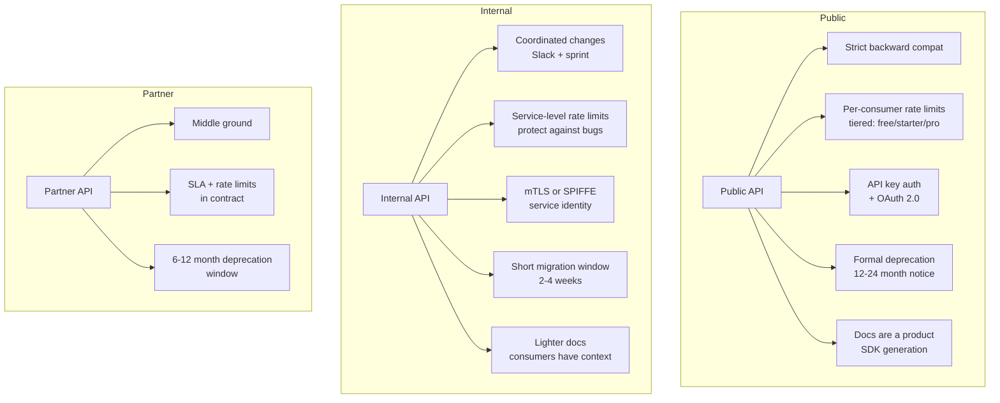

⚡ TL;DR - Public APIs and internal APIs have fundamentally
different design constraints; public APIs: designed
for unknown consumers (strict backward compatibility,
extensive documentation, SDK support, conservative
rate limits, formal deprecation process); internal
APIs: designed for known consumers (can break more
freely, can be optimized for internal use cases,
lighter documentation burden, simpler auth); the
critical mistake: designing internal APIs with
public-API discipline (over-engineered) or designing
public APIs with internal-API flexibility (under-
disciplined); the inflection point: when internal APIs
evolve into public APIs (usually unplanned), teams
are surprised by the backward-compatibility constraints
they now own.

---

| #072 | Category: HTTP & APIs | Difficulty: ★★★★ |
|:---|:---|:---|
| **Depends on:** | API-First Design Strategy, REST API Design, HTTP Methods, Rate Limiting | |
| **Used by:** | API Versioning at Scale, API Platform Design, API Deprecation Strategy | |
| **Related:** | API-First, Versioning, Platform, Deprecation, REST Design, Rate Limiting | |

---

### 🔥 The Problem This Solves

**WORLD WITHOUT IT:**
Company decides to open a previously internal API to
external developers. Internal API was designed for
internal use: no authentication (internal network
trusted), fields named by implementation convention
(`usr_id`, `crts`, `odr_dt`), breaking changes
deployed without notice, no pagination (returns all
records), no rate limiting, error messages contain
stack traces and internal paths.

The external launch: within 24 hours, developers report
incomprehensible field names, stack traces in errors
(security exposure), API goes down because a single
developer's script hammered an endpoint with 10,000
requests. The internal API was not designed to be
a public API. The retrofit is expensive and takes
months.

---

### 📘 Textbook Definition

**Public API:**
An API exposed to external consumers (third-party
developers, partners, the public). Key characteristics:
- Backward compatibility is a hard contract
- Consumers are unknown (can't coordinate with all of them)
- Documentation is a product (poor docs = adoption failure)
- Rate limits protect infrastructure from unknown load patterns
- Authentication is required (no network trust)
- Error messages must be safe (no internal implementation details)
- Deprecation requires long runways (12-24 months)

**Internal API (private):**
An API consumed only within the organization, by known
teams or services. Key characteristics:
- Backward compatibility is a strong preference, not a contract
- Consumers are known (can coordinate breaking changes)
- Documentation can be lighter (consumers have context)
- Rate limits may be simpler (internal traffic patterns known)
- Authentication may leverage internal identity (mTLS, SPIFFE)
- Error messages can include internal detail (no external exposure)
- Breaking changes can be coordinated (planned migration window)

**Partner API (middle ground):**
API exposed to a controlled set of external partners
(not public). Characteristics between public and internal:
stricter than internal (external consumers, legal contracts),
lighter than public (known partners, can coordinate changes,
shorter deprecation windows).

---

### ⏱️ Understand It in 30 Seconds

**One line:**
The key difference: with internal APIs you can call
all consumers in a meeting; with public APIs, consumers
you will never meet have built businesses on your contract.

**One analogy:**
> Internal API: a private road on your property.
> You can repave, close, or reroute it whenever you want.
> You notify the handful of people who use it.
> Public API: a public highway. You can add lanes
> (new features), but you cannot remove the existing
> lanes (breaking changes) without massive disruption.
> You own the highway. Others have built gas stations,
> motels, and cities along it. Changes require years
> of notice, environmental review, and alternative routes.

---

### 🔩 First Principles Explanation

**Error response design comparison:**

```python
# INTERNAL API: rich error for debugging
# Internal consumers can handle implementation details
class InternalAPIError:
    def __init__(self, exc: Exception, context: dict):
        self.error = {
            "type": type(exc).__name__,
            "message": str(exc),
            "traceback": traceback.format_exc(),  # Full stack trace
            "context": context,  # Internal request context
            "service": "order-service",
            "host": socket.gethostname(),
        }
# Internal consumers use this to debug quickly.
# Would be a SECURITY VIOLATION in a public API.

# PUBLIC API: safe, consumer-oriented errors
class PublicAPIError:
    def __init__(
        self, type_: str, message: str,
        param: str | None = None,
        code: str | None = None
    ):
        self.error = {
            "type": type_,           # machine-readable
            "message": message,      # human-readable (safe)
            "param": param,          # which field caused error
            "code": code,            # specific error code
            # NO traceback, NO internal service name,
            # NO host, NO internal IDs
        }
    # Example:
    # {"type": "validation_error",
    #  "message": "items must have at least 1 element",
    #  "param": "items",
    #  "code": "array_min_items"}
```

**Rate limiting design comparison:**

```python
# INTERNAL API: simpler limits
# Internal services have predictable, controlled traffic
INTERNAL_RATE_LIMITS = {
    "default": {"requests": 10_000, "window_seconds": 60},
    "batch_job": {"requests": 100_000, "window_seconds": 3600},
}
# No per-user limit; only per-service
# No hard enforcement; alert at 90%, throttle at 100%

# PUBLIC API: tiered, per-consumer limits
PUBLIC_RATE_LIMITS = {
    "free": {
        "requests_per_minute": 60,
        "requests_per_day": 5_000,
        "max_burst": 10,
    },
    "starter": {
        "requests_per_minute": 300,
        "requests_per_day": 100_000,
        "max_burst": 50,
    },
    "pro": {
        "requests_per_minute": 3_000,
        "requests_per_day": 1_000_000,
        "max_burst": 500,
    },
    "enterprise": {
        "requests_per_minute": "custom",
        "requests_per_day": "custom",
    },
}
# Per API key (not per IP), per endpoint, tiered
# Hard enforcement: 429 with Retry-After
# Headers: X-Rate-Limit-Remaining, X-Rate-Limit-Reset
```

---

### 🧪 Thought Experiment

**SCENARIO: Breaking change impact analysis**

```
Change: rename response field `created_at` → `createdAt`

INTERNAL API:
  Consumers: 3 known services (teams A, B, C)
  Process:
    1. Slack message: "We're renaming `created_at` to
       `createdAt` in 2 weeks. Update your integration."
    2. Team A: updates code same day.
    3. Team B: updates code in 1 week.
    4. Team C: updates code day before deadline.
    5. Release: field renamed.
  Cost: 3 hours total coordination.

PUBLIC API:
  Consumers: 15,000 registered developers.
  Unknown: how many actively use the field?
             How many have automated tests?
             Which languages? Some not case-sensitive?
  Process: CANNOT make this breaking change.
  Options:
    a) Add `createdAt` as a NEW field in the response
       (alongside `created_at`). Run both for 18 months.
       Deprecate `created_at`. Monitor usage in metrics.
       After 18 months: remove `created_at`. (~18mo effort)
    b) New API version (v2) with `createdAt`. Run v1
       and v2 in parallel indefinitely. (~permanent effort)
    c) Never rename it. Accept the inconsistency.
  Cost: months of engineering + developer communication.

Lesson: what is trivial for internal API is a major
project for a public API.
```

---

### 🧠 Mental Model / Analogy

> Internal APIs are conversations between colleagues:
> you can be informal, say "let's change this next
> week," and everyone understands the context. Public
> APIs are legal contracts: every word matters,
> changes require formal notice, you cannot assume
> your audience knows your internal context. The same
> change (renaming a field) requires a 5-minute Slack
> message for an internal API and a 6-month deprecation
> cycle with blog posts, email campaigns, and SDK
> updates for a public API. This is not bureaucracy;
> it is the cost of unknown consumers.

---

### 📶 Gradual Depth - Five Levels

**Level 1 - What it is (anyone can understand):**
Internal APIs are used only by your own company's code.
Public APIs are used by other companies and developers.
This difference changes how careful you must be with
changes - external developers can't be told "please
update your code" without a formal process.

**Level 2 - How to use it (junior developer):**
When building a new API: ask "who will consume this,
and can I contact all of them?" If yes → internal API
principles. If no → public API principles. Use different
templates: internal API can start simpler, public API
needs authentication, rate limiting, versioning, and
formal documentation from day one.

**Level 3 - How it works (mid-level engineer):**
The technical differences cascade from one root:
backward compatibility commitment. Public API commits
to not breaking consumers (unknown, cannot coordinate).
This requires: additive-only changes (add fields,
never remove), formal versioning (v1, v2), deprecation
timelines, API change log, consumer notification.
Internal API can be more flexible: breaking changes
are coordinated, consumers are known and reachable.

**Level 4 - Why it was designed this way (senior/staff):**
The distinction is economic, not technical. Breaking
a public API breaks other companies' products, causing
economic harm to Stripe/Twilio/AWS for which they
bear reputational and contractual responsibility. The
strictness of the public API contract is proportional
to the economic dependence of consumers. AWS API
Gateway: virtually no breaking changes in 10 years.
Stripe: all versions supported indefinitely. These
commitments reflect the economic value of developer
trust. Internal APIs: the economic harm of a breaking
change is contained within the company (engineering
time to update consumers). The stricter the public
API commitment: the higher the trust, the higher the
adoption, the higher the network effect.

**Level 5 - Mastery (distinguished engineer):**
The "public API trap" for platform teams: internal
APIs that become public-by-accident. Internal service A
is consumed by services B, C, and D. Over time:
external partners want access to A's functionality.
Marketing team says "just expose A's API directly."
A was designed as internal (no rate limiting, fields
named for internal convenience, no formal versioning).
Now it is a public API with no public-API properties.
The fix is expensive: add authentication, rate limiting,
rename fields (breaking), add versioning, write docs.
Prevention: decide public vs internal at design time,
not after. If there is ANY chance an API will become
public: design it with public-API discipline from day
one. The cost of retrofitting is always higher than
designing correctly initially.

---

### ⚙️ How It Works (Mechanism)

**Public API authentication (multi-scheme):**

```python
from fastapi import FastAPI, Depends, Security
from fastapi.security import APIKeyHeader, HTTPBearer
import secrets

app = FastAPI()

api_key_header = APIKeyHeader(name="X-API-Key", auto_error=False)
bearer = HTTPBearer(auto_error=False)

async def get_consumer(
    api_key: str | None = Security(api_key_header),
    token: str | None = Security(bearer),
) -> dict:
    """
    Public API: multiple auth schemes, rate limit by consumer.
    Internal API: simpler (mTLS or service account token).
    """
    if api_key:
        consumer = await validate_api_key(api_key)
        if not consumer:
            raise HTTPException(status_code=401)
        return consumer
    if token:
        consumer = await validate_jwt(token.credentials)
        if not consumer:
            raise HTTPException(status_code=401)
        return consumer
    raise HTTPException(status_code=401)

async def validate_api_key(key: str) -> dict | None:
    """Validate API key and return consumer tier."""
    # Constant-time comparison to prevent timing attacks
    stored_hash = await db.get_api_key_hash(key[:16])  # prefix lookup
    if not stored_hash:
        return None
    if not secrets.compare_digest(hash_key(key), stored_hash):
        return None
    return await db.get_consumer_by_key_prefix(key[:16])
```

**Backward-compatible response evolution:**

```python
# Adding a new field: always backward compatible
# (old consumers ignore unknown fields)

# v2024-01: Response
{
    "order_id": "ord_xxx",
    "status": "completed",
    "total_cents": 9999
}

# v2024-06: Added field (backward compatible)
{
    "order_id": "ord_xxx",
    "status": "completed",
    "total_cents": 9999,
    "total_currency": "usd",  # NEW - old consumers ignore
}

# v2024-06: NEVER remove or rename existing field
# "total_cents" → "amount_cents" = BREAKING CHANGE
# Even if "total_cents" seems wrong: add "amount_cents"
# alongside it and deprecate "total_cents" formally.
```



---

### 🔄 The Complete Picture - End-to-End Flow

**Deprecation notice implementation:**

```python
from datetime import datetime, timezone

DEPRECATED_FIELDS = {
    "order_date": {
        "replacement": "created_at",
        "sunset_date": "2025-06-01",
        "notice": "Use `created_at` instead. `order_date` will "
                  "be removed on 2025-06-01."
    }
}

async def add_deprecation_headers(
    request: Request, response: Response
) -> None:
    """
    Public API: add Deprecation and Sunset headers when
    a deprecated field, parameter, or endpoint is accessed.
    RFC 8594 standard: Sunset header.
    """
    deprecated_param_used = check_deprecated_params(request)
    if deprecated_param_used:
        field_info = DEPRECATED_FIELDS[deprecated_param_used]
        response.headers["Deprecation"] = "true"
        response.headers["Sunset"] = field_info["sunset_date"]
        response.headers["Link"] = (
            '<https://docs.example.com/migration>; '
            'rel="deprecation"; type="text/html"'
        )
        # Also include in response body warning
```

---

### 💻 Code Example

**Example 1 - BAD: Internal API error exposed publicly**

```python
# BAD: Internal error handling exposed to public consumers
@app.post("/orders")
def create_order(data: dict):
    try:
        result = order_service.create(data)
        return result
    except Exception as e:
        # NEVER do this in a public API:
        return {"error": str(e),  # May contain DB connection strings
                "traceback": traceback.format_exc()}
        # Exposes: internal service names, file paths,
        # database queries, implementation details

# GOOD: Public API error handling
class OrderError(BaseModel):
    type: str
    message: str
    param: str | None = None

@app.post("/orders", responses={400: {"model": OrderError}})
def create_order(data: CreateOrderRequest) -> OrderResponse:
    try:
        result = order_service.create(data)
        return OrderResponse.from_domain(result)
    except ValidationError as e:
        # Human-readable, no internals
        raise HTTPException(
            status_code=400,
            detail={
                "type": "validation_error",
                "message": "Invalid order data",
                "param": e.field,
            }
        )
    except Exception:
        # Log internally, return generic error
        logger.exception("Order creation failed")
        raise HTTPException(
            status_code=500,
            detail={
                "type": "internal_error",
                "message": "An internal error occurred.",
                # No traceback, no implementation details
            }
        )
```

---

### ⚖️ Comparison Table

| Design Dimension | Internal API | Public API |
|:---|:---|:---|
| Breaking changes | Coordinate with known teams (2-4 weeks) | 12-24 month deprecation + formal sunset |
| Authentication | mTLS / service token / SPIFFE | API key + OAuth 2.0, strict key management |
| Rate limiting | Per-service, simple, alert-based | Per-consumer, tiered, hard enforcement |
| Error messages | Rich (stack traces, internal context) | Safe (type + message only, no internals) |
| Documentation | Internal wiki, team context assumed | Full API reference, guide, tutorials, SDKs |
| Versioning | Optional for low-churn APIs | Mandatory, date-based or URI-based |
| Field naming | Internal conventions OK | Standard REST/JSON conventions required |

---

### ⚠️ Common Misconceptions

| Misconception | Reality |
|:---|:---|
| All APIs should be designed as if they were public | Internal APIs do not need the full discipline of public APIs. Applying public API strictness to internal APIs slows down development unnecessarily. Use the right discipline for the audience. The key question: "can I call all consumers to coordinate a breaking change?" If yes: internal discipline is appropriate. |
| Microservice APIs are always internal | Microservice APIs can be consumed by: other internal services (internal), third-party partners (partner), or external developers (public). The consumption pattern determines the discipline, not the deployment topology. A microservice that is "internal" in terms of network access can still be "public" in terms of who consumes it (multiple teams with no coordination overhead). |
| GraphQL avoids the internal vs public distinction | GraphQL APIs still have internal vs public considerations: the schema is the contract; removing a field from the schema is a breaking change for public consumers; deprecating fields with `@deprecated` is the GraphQL equivalent of public API deprecation. The difference is the query language, not the breaking-change problem. |

---

### 🚨 Failure Modes & Diagnosis

**"Public API trap" - internal API unexpectedly becomes public**

**Symptom:** Engineering manager announces: "We're
opening our internal orders API to partners next month."
The internal API has no authentication, no rate limits,
fields named `odr_id` (internal abbreviation), errors
return stack traces, no formal versioning.

**Diagnosis checklist:**
```bash
# Audit the internal API before public exposure
grep -r "traceback" api/  # Find error handlers exposing traces
grep -r "internal" api/handlers/  # Find internal-only fields

# Check for authentication
curl https://api.internal.example.com/orders
# Should return 401 (but likely returns data)

# Check for rate limiting
for i in {1..1000}; do
  curl -s -o /dev/null https://api.internal.example.com/orders
done
# If all succeed: no rate limiting
```

**Fix plan (before public launch):**
1. Add authentication (API keys or OAuth)
2. Add rate limiting (per API key, tiered)
3. Review all field names: rename to public-API conventions
   (additive: add new names, keep old for migration)
4. Review all error handlers: remove stack traces
5. Add formal versioning
6. Write documentation
7. Set up monitoring and alerting
8. Define deprecation policy
Estimated time: 3-6 months for a well-maintained
internal API.

---

### 🔗 Related Keywords

**Prerequisites (understand these first):**
- `API-First Design Strategy` - design before implementation
- `REST API Design Principles` - public API conventions

**Builds On This (learn these next):**
- `API Versioning at Scale` - versioning for public APIs
- `Designing an API Platform for 100+ Teams` - governance

---

### 📌 Quick Reference Card

```
┌──────────────────────────────────────────────────────────┐
│ Key question │ "Can I call all consumers to coordinate?" │
│              │ Yes → internal discipline                  │
│              │ No → public discipline                     │
├──────────────┼───────────────────────────────────────────┤
│ Breaking     │ Internal: 2-4 week coordination           │
│ changes      │ Public: 12-24 month deprecation           │
├──────────────┼───────────────────────────────────────────┤
│ Error resp.  │ Internal: rich, with internals for debug  │
│              │ Public: type + message only, no internals │
├──────────────┼───────────────────────────────────────────┤
│ Auth         │ Internal: mTLS / SPIFFE / service token   │
│              │ Public: API key + OAuth 2.0               │
├──────────────┼───────────────────────────────────────────┤
│ Trap to avoid│ Designing public APIs with internal       │
│              │ discipline (exposed stack traces, no       │
│              │ versioning, no rate limiting)             │
├──────────────┼───────────────────────────────────────────┤
│ ONE-LINER    │ "Internal: coordinate changes with people │
│              │  you know. Public: honor a contract with  │
│              │  people you've never met."                │
└──────────────────────────────────────────────────────────┘
```

**If you remember only 3 things:**
1. The difference is backward-compatibility commitment.
   Public API = contract with unknown consumers = never
   break without 12-24 month notice. Internal = coordinate
   with known consumers = 2-4 week migration.
2. Error responses: public APIs must never return
   stack traces, internal service names, or database
   query details. This is both a security and UX requirement.
3. The "public API trap": if there is any chance an
   internal API will be exposed externally, design it
   with public-API discipline from day one. Retrofitting
   is always more expensive.

---

### 💎 Transferable Wisdom

**Reusable Engineering Principle:**
"The cost of a change is proportional to the number
of consumers you cannot coordinate with." This is a
general systems principle that extends beyond APIs:
changing a database schema (consumers = all services
that query it); changing a message format (consumers =
all services that read the topic); changing a function
signature (consumers = all callers in the codebase).
In each case: if you can enumerate and coordinate all
consumers, the change is cheap. If consumers are
unknown or uncoordinated, changes require backward
compatibility. This is why public APIs are strict
and internal code is flexible. The formalization of
this principle: Hyrum's Law - "With a sufficient
number of users of an API, it does not matter what
you promise in the contract: all observable behaviors
of your system will be depended on by somebody."

**Where else this pattern applies:**
- Database schemas: internal DB (coordinate migrations
  with owning team); shared DB (treat as public API)
- Message formats: internal topic (coordinate consumers);
  external event stream (treat as public API contract)
- Library APIs: published to npm/PyPI = public; internal
  monorepo library = internal (can change with codemod)

---

### 💡 The Surprising Truth

The internal/public distinction is blurring in modern
organizations. In large companies with many teams:
service A's API may be consumed by 50 teams. "Internal"
but nobody can coordinate with all 50 teams. The
effective discipline required: public API. This is
the insight behind platform engineering: when you
build an API for more than ~5-10 teams within a company,
you are building a de facto public API and should
apply public-API discipline. Amazon famously mandated
in 2002 (the Bezos API Mandate) that all data and
functionality must be exposed only through API interfaces,
and all teams must design their APIs as if they would
be externalized someday. The effect: Amazon's internal
APIs were designed with public-API discipline for years
before AWS launched. When AWS launched (2006): the
internal APIs were already public-API quality. The
internal/external distinction disappears at scale.

---

### ✅ Mastery Checklist

**You've mastered this when you can:**
1. **AUDIT** An internal API for public-API readiness
   (authentication, rate limiting, error responses,
   field naming, documentation, versioning).
2. **DESIGN** Two versions of the same error handler:
   one for internal (rich, stack trace), one for public
   (safe, typed error object).
3. **IMPLEMENT** A public API deprecation workflow:
   Deprecation + Sunset headers, usage metrics to track
   deprecated field usage, client notification.
4. **EXPLAIN** Hyrum's Law and how it applies to public
   API design.
5. **DECIDE** For any new API: which consumers, what
   discipline, what backward-compatibility commitment.

---

### 🎯 Interview Deep-Dive

**Q1: What are the key differences between designing
an internal API vs a public API?**

*Why they ask:* Tests design maturity beyond "just make it work."

*Strong answer includes:*
- Backward compatibility: public = strict contract, never
  break without 12-24 month deprecation. Internal = coordinate
  with known consumers, 2-4 week migration window.
- Authentication: public = API key + OAuth 2.0, strict
  key management, rotation support. Internal = mTLS /
  SPIFFE service identity or service account tokens.
- Rate limiting: public = per-consumer (API key), tiered
  (free/paid), hard enforcement with 429 + Retry-After.
  Internal = per-service, protect against bugs/runaway jobs.
- Error responses: public = safe (type + message, no internals).
  Internal = rich (stack trace, context for debugging).
- Documentation: public = a product (tutorials, code examples,
  SDK, changelog). Internal = team wiki with context assumed.
- The single root: "can you reach all consumers to coordinate?"
  If not: public API discipline.

**Q2: How do you handle a breaking change in a public API?**

*Why they ask:* Tests backward compatibility thinking.

*Strong answer includes:*
- Never remove or rename a field in an existing version.
- For additive changes: add a new field alongside the old
  one. Both exist in the same version. Old consumers ignore
  the new field (JSON parsers ignore unknown fields).
- For breaking changes: new API version (v2 endpoint or
  date-based version). Both v1 and v2 run in parallel
  until sunset.
- Deprecation timeline:
  (1) Announce: blog post, email to all API key holders,
      change log, deprecation headers in responses.
  (2) Monitor usage: track which consumers still use
      deprecated field/endpoint. Follow up with high-usage
      consumers directly.
  (3) Sunset date: at least 12 months out from announcement
      for significant changes.
  (4) Enforce sunset: return 410 Gone (or 404) for
      deprecated endpoints. Remove deprecated fields.
- Communication: Deprecation response header (RFC 8594),
  Sunset response header with date, Link header pointing
  to migration guide.
