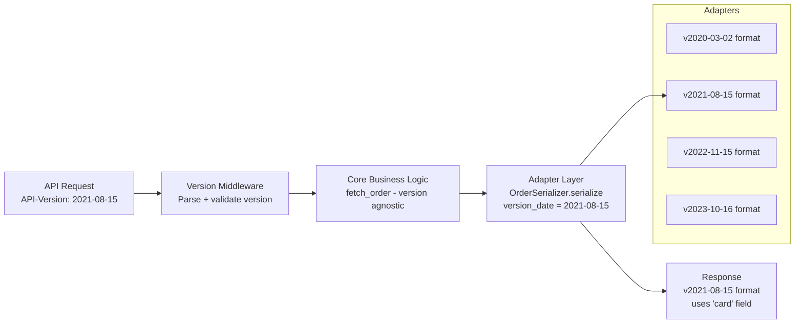

⚡ TL;DR - API versioning is not URI versioning
(`/v1/`, `/v2/`) - that is just URL namespacing; real
API versioning is a strategy for managing breaking
changes across unknown consumers over time; Stripe's
approach (the industry gold standard): date-based
versions (`Stripe-Version: 2023-10-16`), all versions
run simultaneously forever via an adapter layer, no
forced migration, consumers pin to a version at API
key creation; the key insight: version identifiers
tell you WHEN the contract was established, not WHAT
changed; the alternative (semver major versions) forces
all consumers to migrate when any breaking change
occurs - with unknown consumers, this is impractical;
the three implementation models: URI versioning
(simplest, visible), header versioning (cleaner URL),
parameter versioning (simplest for clients).

---

| #073 | Category: HTTP & APIs | Difficulty: ★★★★★ |
|:---|:---|:---|
| **Depends on:** | API-First Design Strategy, Internal vs Public API, HTTP Methods, Stripe Incident Pattern | |
| **Used by:** | API Platform Design, API Deprecation Strategy | |
| **Related:** | Stripe Incident, API-First, Internal vs Public, Platform Design, Deprecation | |

---

### 🔥 The Problem This Solves

**WORLD WITHOUT IT:**
You have 50,000 developers using your API. You need
to change the response schema of your most-used endpoint.
Without versioning: change it, and 50,000 integrations
break simultaneously (including integrations nobody
maintains anymore). With versioning: you can release
a new version, migrate willing developers, and keep
the old version running for the rest. The challenge:
how do you run the old and new version simultaneously
without maintaining two complete codebases?

---

### 📘 Textbook Definition

**API versioning strategies:**

**URI versioning:**
`https://api.example.com/v1/orders`
`https://api.example.com/v2/orders`
- Pros: visible in URL (easy to route), easy to test
- Cons: URLs are not supposed to encode versions
  (REST purists object), clients must update URLs
  to migrate

**Header versioning (Stripe's approach):**
`API-Version: 2023-10-16` (request header)
- Pros: URL stays clean, version is part of the negotiation
- Cons: not visible in URL (harder to route in some proxies)

**Query parameter versioning:**
`https://api.example.com/orders?version=2`
- Pros: easy to test in browser
- Cons: caching complexity (Vary: must include version param)

**Stripe's date-based versioning model:**
- Version identifier: a date (`2023-10-16`)
- Meaning: "this is the contract as it was on this date"
- Implementation: each response field/structure change
  creates a new date version
- All versions run simultaneously via an adapter layer
- Consumer pins to a version (at API key creation or
  in the request header)

**Breaking vs non-breaking changes:**
Non-breaking (backward compatible):
- Adding a new field to a response
- Adding a new optional request parameter
- Adding a new endpoint
- Adding a new value to an enum (for response fields)

Breaking (requires new version):
- Removing a response field
- Renaming a response field
- Changing a field type (string → integer)
- Making an optional request parameter required
- Changing error response schema
- Removing or renaming an enum value

---

### ⏱️ Understand It in 30 Seconds

**One line:**
Stripe's versioning strategy: every consumer pins to
the date-stamped version that existed when they first
integrated, and Stripe runs all versions forever via
thin serialization adapters.

**One analogy:**
> Stripe's versioning is like a museum conserving every
> edition of a reference book. When you bought the
> 2019 edition of "Engineering Mathematics": it's the
> contract you built your study around. Stripe (the
> library) keeps every edition in stock. When you
> request your 2019 edition (by asking for that version):
> the library gives you exactly that edition. New
> editions are available but you're never forced to
> switch. The cost: the library must maintain shelf
> space for every edition ever printed. The benefit:
> nobody's study program breaks because the library
> decided to only stock the 2024 edition.

---

### 🔩 First Principles Explanation

**Stripe's adapter layer architecture:**

```
Request with header: Stripe-Version: 2021-08-15

Core business logic
  (version-agnostic: processes payment, validates data)
       │
       ▼
Response adapter layer:
  is_version >= "2022-11-15"?
    → use new `payment_method_details` field
  else:
    → use old `card` field (2021-08-15 consumer expects this)
       │
       ▼
Response serialized for version 2021-08-15:
{
  "id": "ch_xxx",
  "card": {  ← old field name, as of 2021 spec
    "brand": "visa",
    "last4": "4242"
  }
  // No `payment_method_details` - that was 2022-11-15+
}
```

**Implementation of the adapter pattern:**

```python
from dataclasses import dataclass
from datetime import date
from typing import Any

@dataclass
class Charge:
    """Core domain model - version-agnostic."""
    charge_id: str
    amount: int
    payment_method_brand: str
    payment_method_last4: str
    created_at: str

class ChargeSerializer:
    """
    Version-specific serialization (Stripe adapter pattern).
    Each breaking change adds a version gate.
    """

    def serialize(
        self, charge: Charge, api_version: date
    ) -> dict:
        # Base response (oldest supported version)
        response = {
            "id": charge.charge_id,
            "amount": charge.amount,
            "created": charge.created_at,
        }

        # Version gate: 2022-11-15 changed `card` to
        # `payment_method_details`
        if api_version >= date(2022, 11, 15):
            response["payment_method_details"] = {
                "type": "card",
                "card": {
                    "brand": charge.payment_method_brand,
                    "last4": charge.payment_method_last4,
                }
            }
        else:
            # Pre-2022-11-15: old `card` field directly on charge
            response["card"] = {
                "brand": charge.payment_method_brand,
                "last4": charge.payment_method_last4,
            }

        # Version gate: 2023-08-16 renamed `created` to `created_at`
        if api_version >= date(2023, 8, 16):
            response["created_at"] = response.pop("created")

        return response
```

---

### 🧪 Thought Experiment

**SCENARIO: Which versioning model for which API?**

```
API A: Internal service (5 known consumer teams)
  → No versioning needed.
  → Coordinate breaking changes via RFC + Slack.
  → At most: internal changelog.

API B: Partner API (20 known partners, annual contracts)
  → URI versioning (/v1/, /v2/)
  → Support 2 concurrent versions max
  → 12-month deprecation window per major version
  → Annual migration email + dedicated support

API C: Public API (50,000 developers, unknown usage patterns)
  → Stripe-style date versioning (Stripe-Version header)
  → Support ALL versions simultaneously (adapter pattern)
  → Never sunset without 12-18 month notice + usage data
  → Track per-version usage to identify zombie versions
    (versions with < 0.01% traffic after 12 months of notice)

API D: GraphQL API (any size)
  → Schema-level deprecation (@deprecated directive)
  → Version the schema (same options as REST)
  → Never remove @deprecated fields until usage is < threshold
  → Introspection lets clients discover deprecated fields
```

---

### 🧠 Mental Model / Analogy

> API versioning is like a river delta. The river (core
> business logic) flows from the mountains (domain). At
> the delta (API layer): multiple channels (versions)
> diverge. The same water (same data) flows through
> different channels (v1, v2, v3) to different parts
> of the sea (different consumers). Adding a new channel
> (new version) is easy. Closing a channel (sunsetting
> a version) requires that all ships (consumers) that
> used that channel have moved to another. The cost of
> more channels: maintaining more riverbanks. Stripe
> pays this cost intentionally, because the cost of
> forcing ships to move channels (forced migrations)
> is higher (developer trust damage) than maintaining
> extra riverbanks (adapter code).

---

### 📶 Gradual Depth - Five Levels

**Level 1 - What it is (anyone can understand):**
API versioning lets an API change while old users keep
working with the old behavior. Like having two menus
at a restaurant - old customers use the 2021 menu,
new customers use the 2024 menu.

**Level 2 - How to use it (junior developer):**
For URI versioning: prefix all routes with `/v1/`.
For header versioning: read the `API-Version` header,
default to current version if absent. For new APIs:
choose URI versioning (simplest). For Stripe-scale
APIs with unknown consumers: date-based header versioning.

**Level 3 - How it works (mid-level engineer):**
URI versioning: separate route handlers per version
(or shared handler + serializer per version). Header
versioning: middleware reads version header, passes
to serializer. The serializer converts the domain
model to the version-specific response format.

**Level 4 - Why it was designed this way (senior/staff):**
Stripe's choice of date-based (vs semver) versioning
is intentional: semver implies "v2 is a major change,
v1.1 is minor." This creates a migration threshold:
"we must migrate before v3." Date-based versioning
is neutral: `2023-10-16` is just "the contract as
of this date." No implication of magnitude. Each
date version may have small or large changes. This
removes the psychological urgency that semver major
versions create (FOMO on new features, fear of missing
security patches). Stripe's goal: consumers stay on
whatever version works for them, indefinitely.

**Level 5 - Mastery (distinguished engineer):**
The sunset strategy: Stripe cannot run all versions
forever (operational burden grows). The sunset process:
track per-version API traffic (Prometheus labels by
version). When a version reaches < 0.01% traffic
for 3 months: it is a "zombie version" (only automated
tests or unmaintained integrations). Sunset process:
email the API key holders associated with those requests,
provide migration guide, 6-month sunset notice.
If no response after 3 months: upgrade them to the
next version silently (if the change is low-risk)
or block their requests with a clear error
(`{"error": "API version 2019-02-15 has been sunset."}`).
The operational challenge: per-version traffic metrics
require version tagging on every API call's telemetry.

---

### ⚙️ How It Works (Mechanism)

**FastAPI header versioning implementation:**

```python
from fastapi import FastAPI, Header, Depends
from datetime import date
from typing import Annotated

app = FastAPI()

SUPPORTED_VERSIONS = {
    date(2023, 10, 16),
    date(2022, 11, 15),
    date(2021, 8, 15),
    date(2020, 3, 2),
}
CURRENT_VERSION = date(2023, 10, 16)
OLDEST_SUPPORTED = date(2020, 3, 2)

def get_api_version(
    api_version: Annotated[
        str | None, Header(alias="API-Version")
    ] = None
) -> date:
    if api_version is None:
        # Default to current version
        return CURRENT_VERSION

    try:
        parsed = date.fromisoformat(api_version)
    except ValueError:
        raise HTTPException(
            status_code=400,
            detail={
                "type": "invalid_request_error",
                "message": f"Invalid API version: {api_version}. "
                           f"Use ISO date format: YYYY-MM-DD",
            }
        )

    if parsed < OLDEST_SUPPORTED:
        raise HTTPException(
            status_code=400,
            detail={
                "type": "invalid_request_error",
                "message": (
                    f"API version {api_version} is no longer "
                    f"supported. Oldest supported: {OLDEST_SUPPORTED}"
                ),
                "migration_guide": (
                    "https://docs.example.com/api/migration"
                ),
            }
        )

    # Use closest supported version <= requested
    supported_before_or_at = [
        v for v in SUPPORTED_VERSIONS if v <= parsed
    ]
    return max(supported_before_or_at) if supported_before_or_at \
        else CURRENT_VERSION

@app.get("/orders/{order_id}")
async def get_order(
    order_id: str,
    api_version: date = Depends(get_api_version),
) -> dict:
    order = await fetch_order(order_id)
    serializer = OrderSerializer()
    response = serializer.serialize(order, api_version)

    # Add version headers to response
    from fastapi.responses import JSONResponse
    return JSONResponse(
        content=response,
        headers={
            "API-Version": str(api_version),
            "API-Version-Latest": str(CURRENT_VERSION),
        }
    )
```



---

### 🔄 The Complete Picture - End-to-End Flow

**Breaking change tracking in CI/CD:**

```yaml
# .github/workflows/breaking-change-check.yml
name: Breaking Change Detection

on:
  pull_request:
    paths:
      - 'api/openapi.yaml'

jobs:
  detect-breaking:
    runs-on: ubuntu-latest
    steps:
      - uses: actions/checkout@v3
        with:
          fetch-depth: 0

      - name: Check for breaking changes
        uses: oasdiff/oasdiff-action/check-breaking@main
        with:
          base: origin/main:api/openapi.yaml
          revision: api/openapi.yaml

      - name: Require version bump for breaking changes
        if: failure()
        run: |
          echo "BREAKING CHANGE DETECTED"
          echo "You must:"
          echo "1. Create a new API version date"
          echo "2. Add the change as a version gate in the adapter layer"
          echo "3. Keep the old behavior for existing versions"
          echo "4. Update CHANGELOG.md with migration guide"
          exit 1
```

---

### 💻 Code Example

**Example 1 - BAD: URI versioning with full code duplication**

```python
# BAD: Separate handlers per version = code duplication
# v1 and v2 handlers are 90% identical
@app.get("/v1/orders/{order_id}")
def get_order_v1(order_id: str):
    order = db.get_order(order_id)
    return {
        "order_id": order.id,
        "date": order.created_at,        # old field name
        "card": order.payment_method,    # old field name
    }

@app.get("/v2/orders/{order_id}")
def get_order_v2(order_id: str):
    order = db.get_order(order_id)
    return {
        "order_id": order.id,
        "created_at": order.created_at,  # new field name
        "payment_method": order.payment_method,  # new field name
    }
# Any bug fix in order fetching must be done in BOTH handlers.
# With 10 versions: 10 handlers to maintain.

# GOOD: Single handler + version-aware serializer
@app.get("/orders/{order_id}")
def get_order(
    order_id: str,
    api_version: date = Depends(get_api_version)
):
    order = db.get_order(order_id)  # Single fetch
    return OrderSerializer().serialize(order, api_version)
    # Serializer handles all version-specific field mapping
```

---

### ⚖️ Comparison Table

| Strategy | Pros | Cons | Best For |
|:---|:---|:---|:---|
| URI versioning (/v1/) | Simple routing, visible | URL proliferation, REST purity debate | Partner APIs, small public APIs |
| Header versioning (Stripe) | Clean URLs, expressive | Proxy routing complexity | Large public APIs, 10k+ consumers |
| Query parameter (?v=2) | Easy browser testing | Cache complexity, messy URLs | Internal APIs, simple tools |
| Date-based (Stripe) | Fine-grained, neutral magnitude | More versions = more adapters | Public APIs with strict backward compat |
| Semver (/v1/, /v2/, /v3/) | Semantic meaning | Major bump = forced migration | APIs with predictable, infrequent breaks |

---

### ⚠️ Common Misconceptions

| Misconception | Reality |
|:---|:---|
| `/v1/`, `/v2/` in the URL IS versioning | URI prefixes are URL namespacing, not versioning. Real versioning is the strategy for what changes trigger a new version, how long old versions are supported, and how consumers migrate. You can have URI versioning (`/v1/`) with terrible backward-compatibility discipline (every change increments the version, forcing constant migration). Stripe has excellent versioning discipline using header versioning with no URI prefix. The URL is the mechanism; the discipline is the strategy. |
| New API versions should be the default for new sign-ups | Stripe makes new API versions the default for new API key registrations. Existing API keys remain on their pinned version forever. This is the correct approach: new developers get the best, most current API; existing integrations are not disrupted. The mistake: changing the default for all consumers, including existing ones. |
| Breaking changes are always bad | Breaking changes are sometimes necessary (security fix, fundamental design flaw). The discipline is not to avoid breaking changes entirely but to handle them with appropriate notice and migration support. A breaking change with 18-month notice, a detailed migration guide, and SDK update is acceptable. A breaking change with 2-week notice is not (for a public API). |

---

### 🚨 Failure Modes & Diagnosis

**Version proliferation (too many versions to maintain)**

**Symptom:** Each quarter brings a new date version.
After 3 years: 12 different versions in production.
Every change to the serializer layer must account for
12 version gates. Code is unmaintainable. Developers
afraid to make changes.

**Root Cause:** Every small change triggers a new version
instead of grouping changes into infrequent releases.

**Fix:**
```python
# Track version usage metrics
# Prometheus label: api_version
from prometheus_client import Counter
api_calls = Counter(
    'api_calls_total',
    'API calls by version',
    ['version', 'endpoint']
)

# In request handler:
api_calls.labels(
    version=str(api_version),
    endpoint=request.url.path
).inc()

# Query: which versions are still active?
# api_calls_total{version!="current"}[30d]
# Versions with < 10 requests/day are zombie versions
```

**Strategy:**
1. Release new versions quarterly (not on every change)
2. Group multiple changes into one version date
3. Track version traffic metrics
4. Sunset zombie versions (< 0.01% traffic after notice)

---

### 🔗 Related Keywords

**Prerequisites (understand these first):**
- `API-First Design Strategy` - design the contract first
- `Internal vs Public API Design` - why backward compat matters
- `Stripe API Outage Pattern` - Stripe's specific approach

**Builds On This (learn these next):**
- `API Deprecation Strategy` - sunsetting old versions
- `Designing an API Platform for 100+ Teams` - governance at scale

---

### 📌 Quick Reference Card

```
┌──────────────────────────────────────────────────────────┐
│ Non-breaking │ Add field, add endpoint, add optional     │
│ changes      │ param, add enum value (in response)       │
├──────────────┼───────────────────────────────────────────┤
│ Breaking     │ Remove/rename field, change field type,   │
│ changes      │ make param required, change error schema  │
├──────────────┼───────────────────────────────────────────┤
│ Stripe model │ Date-based header versioning              │
│              │ Adapter layer: single core + per-version  │
│              │ serialization. All versions forever.      │
├──────────────┼───────────────────────────────────────────┤
│ URI model    │ /v1/ /v2/ - simpler routing               │
│              │ Best for partner APIs                     │
├──────────────┼───────────────────────────────────────────┤
│ Sunset       │ 12-18 months notice → track zombie traffic│
│              │ → email key holders → remove             │
├──────────────┼───────────────────────────────────────────┤
│ ONE-LINER    │ "A version is a contract date; adapters   │
│              │  translate core domain to that contract   │
│              │  without duplicating business logic"      │
└──────────────────────────────────────────────────────────┘
```

**If you remember only 3 things:**
1. Breaking vs non-breaking: adding fields is always
   safe; removing/renaming requires a new version.
   Adding optional params is safe; making params
   required is breaking.
2. Adapter pattern (Stripe): single business logic layer,
   version-aware serialization layer. No code duplication
   across versions.
3. Sunset requires data: track per-version API traffic.
   Zombie versions (< 0.01% after notice) can be sunset.
   Never sunset blindly.

---

### 💎 Transferable Wisdom

**Reusable Engineering Principle:**
"Separate the stable from the unstable at the right
boundary." In API versioning: the core business logic
(process payment, validate order) is stable across
versions. The serialization format (field names, structure)
is unstable (changes per version). Separate them at
the right boundary (adapter layer). The same principle:
database schema vs domain model (ORM as adapter);
event format vs event handler (deserializer as adapter);
UI component vs data (view model as adapter). The
adapter pattern is the universal solution for "one
stable core, many unstable representations."

**Where else this pattern applies:**
- gRPC service evolution: Protobuf field numbers are
  stable, field names can change (the number is the
  stable identity)
- Database schema: column names are stable once production-
  used; renaming requires migration (same as breaking
  change in API)
- Configuration formats: YAML config schema versions
  need adapter for reading old formats

---

### 💡 The Surprising Truth

The most successful API versioning strategies are built
around the consumer's laziness, not their diligence.
The assumption behind "we'll release v2 and everyone
will migrate in 6 months" is that consumers are actively
maintaining their integrations. The reality: most
integrations are "set and forget." The integration was
built by a developer who left the company. The business
owner does not know what API version they use. The
infrastructure team is responsible for keeping the
lights on, not migrating APIs. Stripe's "all versions
forever" strategy is built on the explicit recognition
that many consumers WILL NOT migrate, ever. The cost
of maintaining old versions indefinitely is less than
the support cost, relationship damage, and churn caused
by forcing migration on consumers who cannot do it.
API versioning strategy is ultimately a business
decision about consumer success, not an engineering
decision about code cleanliness.

---

### ✅ Mastery Checklist

**You've mastered this when you can:**
1. **CLASSIFY** Any API change as breaking or non-breaking
   with reasoning (field addition, removal, type change,
   required parameter, enum changes).
2. **IMPLEMENT** A version-aware serializer (adapter
   pattern) that handles 3+ versions from a single
   domain model without code duplication.
3. **SET UP** Breaking change detection in CI/CD
   (oasdiff or OpenAPI diff tool) that blocks PRs with
   breaking changes.
4. **DESIGN** A sunset strategy for a version with
   < 0.01% traffic: tracking, notification, timeline.
5. **COMPARE** URI vs header vs date-based versioning
   and recommend the appropriate strategy for a given API.

---

### 🎯 Interview Deep-Dive

**Q1: How do you implement API versioning for a public
API with 50,000 developers?**

*Why they ask:* Tests API platform design depth.

*Strong answer includes:*
- Stripe's date-based versioning: `API-Version: YYYY-MM-DD`
  header. Consumers pin to a version at API key creation.
  Middleware reads the header, defaults to current version
  for new keys.
- Adapter layer: single core business logic (version-agnostic).
  Version-aware serializer converts domain model to
  version-specific response format. Each breaking change
  adds a version gate in the serializer. No code duplication.
- Breaking change detection: CI/CD gate with oasdiff
  (or Optic) that detects breaking changes and requires
  a new version date + adapter update.
- Sunset strategy: track per-version traffic in Prometheus.
  After 12-18 months of sunsets notice, zombie versions
  (<0.01% traffic) are candidates for removal. Email API
  key holders, provide migration guide.
- Why date-based vs semver: date-based is neutral (no
  v2 major bump stigma). Consumers stay on their date
  indefinitely without pressure to migrate to "v3."

**Q2: What is the difference between breaking and
non-breaking API changes?**

*Why they ask:* Tests fundamental API contract knowledge.

*Strong answer includes:*
- Non-breaking (backward compatible): existing client code
  continues to work without any changes.
  - Adding a new field to a response (old clients ignore it)
  - Adding a new optional request parameter (old clients omit it)
  - Adding a new endpoint (old clients don't call it)
  - Adding a new value to a request enum (old clients don't send it)
  - Loosening validation (accepting more inputs)
- Breaking: existing client code breaks without changes.
  - Removing or renaming a response field
  - Changing a field type (integer → string)
  - Making an optional parameter required
  - Removing an endpoint or HTTP method
  - Changing authentication scheme
  - Tightening validation (rejecting previously-accepted inputs)
  - Changing error response schema
- Edge cases: adding a required field to a REQUEST schema
  is breaking (clients don't send it). Adding a required
  field to a RESPONSE schema is non-breaking (clients
  can ignore it). The direction matters.
- Automation: use oasdiff, OpenAPI Diff, or Optic in
  CI/CD to detect breaking changes automatically. Do not
  rely on code review alone.
