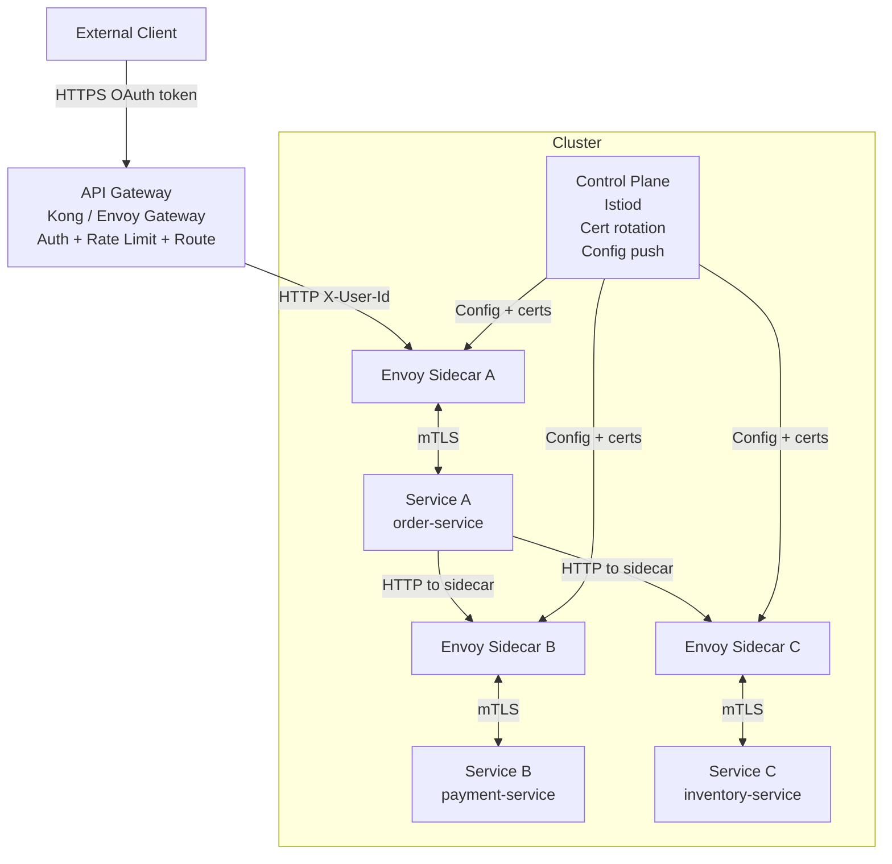

⚡ TL;DR - API Gateway and Service Mesh solve different
problems and are usually deployed TOGETHER, not as
alternatives; API Gateway: North-South traffic (client
→ your services), handles external auth, rate limiting,
routing, protocol translation; Service Mesh: East-West
traffic (service → service within cluster), handles
mTLS, observability, retry, circuit breaking, traffic
shaping; the key insight: an API Gateway does not see
traffic between your microservices; a Service Mesh does
not see traffic from external clients; both operate at
L7 (HTTP); the common mistake: thinking you need one or
the other; most production Kubernetes deployments use
both: API Gateway at the cluster ingress + Istio/Linkerd
inside the cluster.

---

| #074 | Category: HTTP & APIs | Difficulty: ★★★★★ |
|:---|:---|:---|
| **Depends on:** | API Gateway Rate Limiting, gRPC vs REST Performance, TLS/Certificate Pinning, Rate Limiting | |
| **Used by:** | GraphQL vs REST vs gRPC Decision Framework, API Platform Design | |
| **Related:** | API Gateway, gRPC vs REST, TLS, Rate Limiting, Decision Framework, Platform | |

---

### 🔥 The Problem This Solves

**WORLD WITHOUT IT:**
Microservices architecture with 50 services. Service A
calls Service B which calls C, D, and E. Requirements:
(1) All service-to-service calls must use mTLS.
(2) Every service-to-service call must be logged with
distributed trace ID.
(3) Service C must retry failed calls to D automatically.
(4) External clients must authenticate via OAuth 2.0.
(5) Rate limiting at the cluster level.

Without API Gateway + Service Mesh: every service must
implement (1)-(3) itself (code duplication across 50
services). The external requirements (4)-(5) are applied
inconsistently. Each team implements their own retry logic,
circuit breaker, mTLS setup. 50 services = 50 ways to do it.

---

### 📘 Textbook Definition

**API Gateway (North-South traffic):**
Sits at the cluster ingress. Handles traffic from external
clients (browsers, mobile apps, third-party) into the
cluster. Key functions:
- Authentication (OAuth 2.0 token validation, API key check)
- Rate limiting (per-consumer, per-endpoint)
- Request routing (path-based, header-based)
- Protocol translation (HTTP/1.1 → HTTP/2, REST → gRPC)
- SSL/TLS termination
- Request transformation (header injection, body transformation)
- API versioning routing (/v1/ → service-a, /v2/ → service-b)

Products: Kong, AWS API Gateway, Azure APIM, Google Cloud
Endpoints, Envoy Gateway, Nginx + Lua.

**Service Mesh (East-West traffic):**
Transparent proxy (sidecar) injected into every pod in
the cluster. Handles traffic between services. Key functions:
- mTLS (automatic certificate provisioning + rotation)
- Observability (distributed tracing, metrics, access log)
- Retry and circuit breaking (configured centrally)
- Traffic shaping (canary deployments, traffic splitting)
- Service discovery and load balancing
- Authorization (which service can call which service)

Products: Istio + Envoy (most popular), Linkerd (simpler),
Consul Connect, Cilium Service Mesh.

**The sidecar pattern:**
Service Mesh injects an Envoy sidecar proxy into each pod.
All inbound and outbound traffic goes through the sidecar.
The sidecar handles mTLS, logging, retry, metrics.
The application code sees plain HTTP (no mTLS code needed).

---

### ⏱️ Understand It in 30 Seconds

**One line:**
API Gateway handles client-to-cluster traffic (North-South);
Service Mesh handles service-to-service traffic within
the cluster (East-West). Both are needed.

**One analogy:**
> API Gateway: the airport security checkpoint. Travelers
> (external clients) enter the airport (cluster) through
> one controlled point. Security (auth), passport check
> (API key), routing to the right terminal (service routing).
> Service Mesh: the internal airport infrastructure -
> corridors, gates, intercoms. Once inside the airport,
> passengers (services) move between gates. Every corridor
> is monitored (observability), every gate has access
> control (mTLS + authorization), lost connections auto-
> redirect (retry). Without the gateway: any stranger
> can enter the airport (unauthenticated external access).
> Without the mesh: once inside, no monitoring or
> access control between gates (zero-trust gap).

---

### 🔩 First Principles Explanation

**Traffic flow with both Gateway and Mesh:**

```
External Client (mobile app)
   │
   │ HTTPS (OAuth 2.0 token in Bearer header)
   ▼
API Gateway (Kong / AWS APIM / Envoy Gateway)
   ├── Validate OAuth token (JWT signature)
   ├── Rate limit (100 req/min for this API key)
   ├── Route: /orders/* → order-service:8080
   └── Strip/inject headers (X-User-Id)
   │
   │ HTTP (token stripped, X-User-Id injected)
   │ (inside cluster - no TLS needed here IF mesh provides it)
   ▼
Istio Sidecar Proxy (Envoy, co-located with API Gateway pod)
   │ mTLS established with order-service sidecar
   ▼
order-service Pod
   Envoy sidecar (inbound mTLS → plain HTTP to app)
   │
   └── app calls inventory-service
       Envoy sidecar (outbound: app → sidecar → mTLS → sidecar → app)
       ├── Automatic retry (3 attempts, 500ms timeout per attempt)
       ├── Circuit break if inventory-service fails > 50%
       └── Distributed trace span appended
```

---

### 🧪 Thought Experiment

**SCENARIO: Which handles which responsibility?**

```
Requirement 1: Block requests without valid API key
→ API GATEWAY (North-South, external authentication)
→ Not service mesh (mesh does not see external auth headers)

Requirement 2: mTLS between order-service and payment-service
→ SERVICE MESH (East-West, internal authentication)
→ Not API Gateway (gateway does not route this traffic)

Requirement 3: Rate limit: each customer max 100 req/min
→ API GATEWAY (per-consumer rate limiting, has API key context)
→ Not service mesh (mesh has service identity, not user identity)

Requirement 4: Retry payment-service calls on 503
→ SERVICE MESH (East-West reliability, centrally configured)
→ API Gateway could do it for gateway→first-service, but not
   for service-to-service calls inside the cluster

Requirement 5: Canary deploy: 10% traffic to payment-service v2
→ SERVICE MESH (East-West traffic shaping, VirtualService)
→ API Gateway cannot route traffic between internal services

Requirement 6: Observe P99 latency for every service call
→ SERVICE MESH (every sidecar emits metrics)
→ API Gateway only sees gateway→first-service latency
```

---

### 🧠 Mental Model / Analogy

> API Gateway is the customs officer at the border (checks
> who enters and what they bring). Service Mesh is the
> internal road network (all travel within the country
> uses the same roads, all roads are monitored). A country
> needs BOTH: border control for external entry, road
> network monitoring for internal travel. The mistake:
> "we have a gateway, why do we need a mesh?" is like
> "we have border control, why do we need internal roads
> to have speed limits?" Different problems.

---

### 📶 Gradual Depth - Five Levels

**Level 1 - What it is (anyone can understand):**
API Gateway is the front door to your system (external
clients use it). Service Mesh is the internal roads
between your services (microservices use it to talk to
each other). Both help with security, monitoring, and
reliability - at different layers.

**Level 2 - How to use it (junior developer):**
For a new Kubernetes cluster: deploy an API Gateway
(Kong, Nginx) at the ingress. For service-to-service
mTLS, retry, and observability: install Istio. Start
with the API Gateway (you definitely need it). Add the
Service Mesh when you have > 5 microservices and need
consistent observability and zero-trust.

**Level 3 - How it works (mid-level engineer):**
Service Mesh sidecar: Istio injects an Envoy proxy into
each pod as a sidecar container. The iptables rules are
modified to redirect all pod traffic through the sidecar.
The app is unaware. Envoy handles TLS, metrics, tracing.
API Gateway: Envoy-based (Kong, Envoy Gateway) or
proprietary (AWS APIM). Routes requests, validates tokens,
enforces rate limits.

**Level 4 - Why it was designed this way (senior/staff):**
The Service Mesh was invented to solve the "distributed
systems library problem": each language needed its own
library for retry, circuit breaking, mTLS. Netflix Hystrix
(Java), Resilience4j (Java), Go packages for retry.
The Service Mesh extracts this into the infrastructure
layer (Envoy sidecar): language-agnostic, consistently
configured across all services, observable without code
changes. The trade-off: Envoy sidecar adds ~1-3ms latency
per hop and ~50-100MB RAM per pod. For 50 pods: 2.5-5GB
RAM overhead. This is the "mesh tax." Cilium Service Mesh
uses eBPF to avoid the sidecar tax (processes packets in
the kernel).

**Level 5 - Mastery (distinguished engineer):**
The emerging pattern: Ambient Mesh (Istio v1.15+, 2023).
Instead of per-pod sidecars: a node-level DaemonSet (ztunnel)
handles mTLS. A per-namespace L7 proxy (waypoint proxy)
handles L7 features (retry, header manipulation). The
sidecar tax is eliminated. Security (mTLS) is applied
to all pods automatically without sidecar injection.
L7 features (retry, circuit breaking) are opt-in per
namespace. This changes the cost model: zero overhead for
pure mTLS (ambient mode), opt-in overhead for L7 features.

---

### ⚙️ How It Works (Mechanism)

**Istio VirtualService (East-West traffic shaping):**

```yaml
# Istio VirtualService: traffic splitting for canary deployment
# Service Mesh configuration (not API Gateway)
apiVersion: networking.istio.io/v1beta1
kind: VirtualService
metadata:
  name: payment-service
spec:
  hosts:
    - payment-service  # East-West: internal service DNS name
  http:
    - match:
        - headers:
            x-canary:
              exact: "true"
      route:
        - destination:
            host: payment-service
            subset: v2  # All canary-flagged requests to v2
          weight: 100
    - route:
        - destination:
            host: payment-service
            subset: v1  # 90% to v1
          weight: 90
        - destination:
            host: payment-service
            subset: v2  # 10% to v2
          weight: 10
      retries:
        attempts: 3
        perTryTimeout: 2s
        retryOn: 5xx,connect-failure

---
# API Gateway configuration (North-South)
# Kong Declarative Config
_format_version: "3.0"

services:
  - name: payment-service
    url: http://payment-service.default.svc.cluster.local:8080

routes:
  - name: payment-route
    service: payment-service
    paths:
      - /payments

plugins:
  - name: jwt
    service: payment-service
    config:
      key_claim_name: kid
      claims_to_verify:
        - exp
  - name: rate-limiting
    service: payment-service
    config:
      minute: 100  # Per consumer
      policy: redis
      redis_host: redis
```



---

### 🔄 The Complete Picture - End-to-End Flow

**Istio AuthorizationPolicy (zero-trust East-West):**

```yaml
# Only order-service can call payment-service
# All other services: DENY
apiVersion: security.istio.io/v1beta1
kind: AuthorizationPolicy
metadata:
  name: payment-service-authz
  namespace: default
spec:
  selector:
    matchLabels:
      app: payment-service
  rules:
    - from:
        - source:
            principals:
              # SPIFFE identity: service account in namespace
              - cluster.local/ns/default/sa/order-service
      to:
        - operation:
            methods: ["POST"]
            paths: ["/payments"]
  # Default: DENY all other sources
```

---

### 💻 Code Example

**Example 1 - BAD: Retry logic in application code**

```python
# BAD: Every service implements its own retry logic
# 50 microservices = 50 different retry implementations
import time
import requests

def call_payment_service(payload: dict) -> dict:
    for attempt in range(3):
        try:
            response = requests.post(
                "http://payment-service/charge",
                json=payload,
                timeout=2.0
            )
            if response.status_code < 500:
                return response.json()
        except requests.Timeout:
            pass
        time.sleep(0.5 * (2 ** attempt))
    raise Exception("Payment service unavailable")
# This retry logic:
# - Different from the Java service's retry logic
# - Not centrally observable
# - Not consistently configured across services

# GOOD: Retry configured in Istio VirtualService (YAML above)
# Application code is simple:
def call_payment_service(payload: dict) -> dict:
    response = httpx.post(
        "http://payment-service/charge",
        json=payload,
        timeout=7.0  # 3 attempts × 2s each + buffer
    )
    response.raise_for_status()
    return response.json()
# Retry is handled by Envoy sidecar. Centrally configured.
# Consistent across all languages. Observable in Kiali.
```

---

### ⚖️ Comparison Table

| Dimension | API Gateway | Service Mesh |
|:---|:---|:---|
| Traffic direction | North-South (external → cluster) | East-West (service → service) |
| Primary auth | External auth (OAuth, API key) | Service identity (mTLS, SPIFFE) |
| Rate limiting | Per-consumer, per-endpoint | Per-service, not per user |
| Observability | External client metrics | Internal service-to-service metrics |
| Retry/circuit break | Gateway→first service only | All internal service hops |
| Traffic shaping | External routing rules | Internal canary/A-B splits |
| Complexity | Medium | High (especially Istio) |
| Latency overhead | 1-5ms (one gateway hop) | 1-3ms per hop (sidecar) |

---

### ⚠️ Common Misconceptions

| Misconception | Reality |
|:---|:---|
| Service Mesh replaces the API Gateway | They solve different problems. Service Mesh handles East-West (service-to-service). API Gateway handles North-South (external clients). You need both in a microservices architecture. Some products (like Kong) offer both - a gateway + mesh capabilities - but the logical functions are still separate. |
| Service Mesh means all traffic is encrypted | By default in Istio: yes (mTLS). But mTLS can be set to PERMISSIVE mode (accepts both mTLS and plain HTTP) for gradual rollout. In PERMISSIVE mode: plain HTTP traffic is not encrypted. For zero-trust: set to STRICT mode (only mTLS). Monitor Kiali for any non-mTLS traffic. |
| Istio is the only service mesh option | Istio is the most feature-rich but also most complex. Linkerd is simpler (Go proxy vs C++ Envoy), lower overhead (~5MB per pod vs ~50MB), narrower feature set. Cilium Service Mesh uses eBPF (kernel-level, no sidecar). Choice depends on: feature needs, team expertise, overhead tolerance. |
| API Gateway is only for external-facing APIs | Internal APIs can also benefit from an API Gateway. If you have multiple internal teams consuming an internal API: the API Gateway provides consistent authentication, rate limiting, and routing without each team implementing it. The distinction is not external vs internal but "do I need centralized cross-cutting concerns for this API?" |

---

### 🚨 Failure Modes & Diagnosis

**mTLS in PERMISSIVE mode - silent plain text traffic**

**Symptom:** Istio is installed. mTLS is configured.
But a security audit shows some service-to-service
traffic is plain HTTP (not encrypted).

**Root Cause:** Istio default is PERMISSIVE mode.
Services that have not been injected with the sidecar
(e.g., legacy pods, non-injected namespaces) can still
communicate via plain HTTP.

**Diagnosis:**
```bash
# Check mTLS mode
kubectl get peerauthentication -A

# Visualize mTLS in Kiali (Istio dashboard)
kubectl port-forward svc/kiali 20001:20001 -n istio-system
# Open http://localhost:20001 → Graph → Security tab
# Red edges = plain HTTP; Green = mTLS

# Check if all pods have sidecar injected
kubectl get pods -A | grep -v "2/2\|3/3\|4/4"
# Pods without "2/2" (app + sidecar): no Envoy sidecar
```

**Fix:**
```yaml
# Enforce STRICT mTLS cluster-wide (no plain HTTP)
apiVersion: security.istio.io/v1beta1
kind: PeerAuthentication
metadata:
  name: default
  namespace: istio-system  # Cluster-wide policy
spec:
  mtls:
    mode: STRICT  # Reject plain HTTP from any source
```

---

### 🔗 Related Keywords

**Prerequisites (understand these first):**
- `API Gateway Rate Limiting and Auth at Scale` - gateway patterns
- `TLS and Certificate Pinning in APIs` - mTLS fundamentals
- `gRPC vs REST Performance at Scale` - protocol considerations

**Builds On This (learn these next):**
- `GraphQL vs REST vs gRPC Decision Framework` - protocol choice
- `Designing an API Platform for 100+ Teams` - platform architecture

---

### 📌 Quick Reference Card

```
┌──────────────────────────────────────────────────────────┐
│ Gateway      │ North-South: external client → cluster    │
│              │ Handles: auth, rate limit, routing, TLS   │
├──────────────┼───────────────────────────────────────────┤
│ Service Mesh │ East-West: service → service in cluster   │
│              │ Handles: mTLS, observability, retry, CB   │
├──────────────┼───────────────────────────────────────────┤
│ Use both?    │ Yes. Always. They are complementary.      │
│              │ Gateway handles external, Mesh internal.  │
├──────────────┼───────────────────────────────────────────┤
│ Istio modes  │ PERMISSIVE: accept mTLS + plain HTTP      │
│              │ STRICT: mTLS only (zero-trust)            │
├──────────────┼───────────────────────────────────────────┤
│ Sidecar tax  │ ~1-3ms latency + ~50-100MB RAM per pod    │
│              │ Ambient Mesh (eBPF): eliminates sidecar   │
├──────────────┼───────────────────────────────────────────┤
│ ONE-LINER    │ "Gateway = border security;               │
│              │  Mesh = internal road network.            │
│              │  Both required."                          │
└──────────────────────────────────────────────────────────┘
```

**If you remember only 3 things:**
1. API Gateway = North-South (external → cluster).
   Service Mesh = East-West (service → service).
   They are not alternatives - they are complementary.
2. Service Mesh provides mTLS automatically (no code
   changes). Set to STRICT mode for zero-trust. Check
   PERMISSIVE mode is not silently allowing plain HTTP.
3. The sidecar tax: ~50MB RAM + ~1-3ms per hop. For
   100 pods: ~5GB RAM. Worth it for 10+ microservices.
   Ambient Mesh (Istio v1.15+) eliminates the sidecar.

---

### 💎 Transferable Wisdom

**Reusable Engineering Principle:**
"Separate concerns at the right network boundary."
API Gateway is the network boundary between external
and internal (North-South). Service Mesh is the network
boundary between services (East-West). Both implement
cross-cutting concerns (security, observability, retry)
at the infrastructure level, not the application level.
The principle: cross-cutting concerns (logging, security,
reliability) should be extracted to the lowest feasible
level (infrastructure > framework > library > application).
Infrastructure-level implementation: consistent (no
per-service variation), language-agnostic, centrally
configured. The more you push cross-cutting concerns
toward infrastructure: the simpler each application
becomes. This is the same principle as: logging in
the kernel instead of each application, TLS in the
OS/library instead of each application.

**Where else this pattern applies:**
- Kubernetes network policies (East-West firewall)
  vs cloud load balancer (North-South traffic)
- Database connection pool (shared infrastructure)
  vs per-application connection handling
- eBPF for observability (infrastructure-level) vs
  per-application instrumentation

---

### 💡 The Surprising Truth

The Service Mesh is mostly an Envoy story. Envoy (Lyft,
2016, open-sourced) is the data plane for: Istio,
Contour, Kong Enterprise, AWS App Mesh, Azure OSM,
and Envoy Gateway (the new Kubernetes Gateway API
implementation). The "different service meshes" are
mostly different control planes (Istio's Istiod,
Consul, Linkerd's control plane) configuring the same
or similar data plane (Envoy). When you "choose a
service mesh," you are mostly choosing: which control
plane, which configuration model, which operational
complexity. The actual packet handling in most cases
is Envoy. Understanding Envoy's configuration model
(Listeners, Routes, Clusters, Endpoints) makes all
service meshes intelligible. Most engineers use the
service mesh abstraction (Istio CRDs) and never look
at the Envoy configuration it generates. Understanding
the Envoy layer is the difference between debugging
a mesh problem in 30 minutes vs 3 hours.

---

### ✅ Mastery Checklist

**You've mastered this when you can:**
1. **EXPLAIN** Which traffic (North-South vs East-West)
   each tool handles and give a concrete example of
   a requirement that only one can satisfy.
2. **CONFIGURE** An Istio VirtualService for 90/10
   canary traffic split with retry on 5xx.
3. **ENFORCE** STRICT mTLS cluster-wide and verify
   no plain HTTP traffic using Kiali.
4. **DESIGN** The complete ingress → service → service
   traffic flow with authentication and observability
   at each hop.
5. **DECIDE** Between API Gateway vs Service Mesh vs
   both for a given architecture, with reasoning.

---

### 🎯 Interview Deep-Dive

**Q1: What is the difference between an API Gateway
and a Service Mesh? Why do you need both?**

*Why they ask:* Common cloud-native architecture question.

*Strong answer includes:*
- API Gateway: North-South traffic (external clients to
  cluster). Functions: authenticate external clients (OAuth,
  API key), rate limit per-consumer, route requests to
  services, terminate TLS, transform requests/responses.
- Service Mesh: East-West traffic (service to service within
  cluster). Functions: mTLS between services (automatic cert
  provisioning), observability (distributed tracing, metrics
  from every service hop), retry/circuit breaking configured
  centrally, traffic shaping (canary deployments, A/B testing),
  service authorization (which service can call which).
- Why both: Gateway handles external entry but does not see
  traffic between services. Mesh handles internal traffic
  but does not handle external auth (no API key context).
  Real example: external client sends API key → Gateway
  validates, injects X-User-Id → order-service calls
  payment-service → Mesh handles mTLS, retry, observability.
  Without Gateway: unauthenticated external access.
  Without Mesh: no mTLS or observability for internal calls.

**Q2: How does Istio's mTLS work in a Kubernetes cluster?**

*Why they ask:* Tests service mesh implementation depth.

*Strong answer includes:*
- Istio injects an Envoy sidecar into each pod. iptables
  rules redirect all inbound and outbound pod traffic
  through the sidecar.
- Istiod (control plane) automatically provisions X.509
  certificates for each pod using a SPIFFE identity
  (based on Kubernetes service account).
- When service A calls service B: A's sidecar initiates
  mTLS with B's sidecar using A's SPIFFE certificate.
  B's sidecar validates A's certificate and enforces
  AuthorizationPolicy (which services can call B).
- Application: plain HTTP to its own sidecar.
  Sidecar: handles all mTLS automatically.
  Application sees: plain HTTP. Sidecar sees: mTLS.
- PERMISSIVE vs STRICT: PERMISSIVE accepts both mTLS
  and plain HTTP (gradual adoption). STRICT: only mTLS.
  For zero-trust: set STRICT cluster-wide.
- Certificate rotation: Istiod rotates certificates
  automatically (default: 24h TTL). No manual cert
  management required.
- Ambient Mesh (Istio 1.15+): no sidecar. ztunnel
  DaemonSet handles L4 mTLS at node level. Eliminates
  the sidecar overhead.
