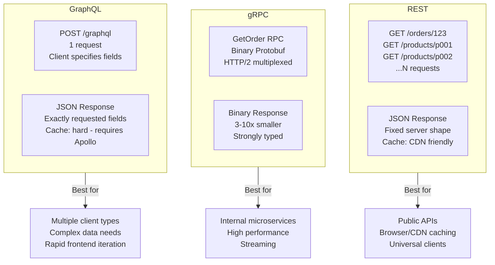

⚡ TL;DR - Choose the protocol based on the consumer
and data complexity, not the technology's hype; REST:
public APIs, browser clients, resource-centric operations,
broad tooling support; gRPC: internal microservices,
performance-critical paths, streaming, strongly-typed
contracts; GraphQL: complex client-specific data needs,
multiple clients (web/mobile) needing different response
shapes, rapid frontend iteration without backend changes;
the default for most teams: REST (broadest ecosystem,
easiest to consume); use gRPC for internal service
performance; use GraphQL when you have a real N+1 fetching
problem or multiple clients with divergent data needs;
the fatal mistake: using GraphQL for simplicity when
your use case is CRUD (overengineered complexity for
no benefit).

---

| #075 | Category: HTTP & APIs | Difficulty: ★★★★★ |
|:---|:---|:---|
| **Depends on:** | REST API Design, HTTP Methods, GraphQL, gRPC vs REST, GraphQL Specification | |
| **Used by:** | Designing an API Platform for 100+ Teams | |
| **Related:** | REST Design, gRPC vs REST, Service Mesh, Platform Design, Event-Driven APIs, GraphQL Spec | |

---

### 🔥 The Problem This Solves

**WORLD WITHOUT IT:**
Frontend team needs an order details page. The order
has: order metadata, 5 line items, each with a product
(name, image), the customer's shipping address, and
payment method last-4. REST approach: (1) GET /orders/123,
(2) GET /products/p001, (3) GET /products/p002, ...,
(4) GET /customers/456/address. 6 HTTP round trips on
mobile (high latency). Alternative: add a custom
`/order-detail` endpoint that returns everything.
Now the mobile team wants a slightly different shape
(no payment method details). Another custom endpoint.
This is the overfetching/underfetching trap - the
problem GraphQL and BFF patterns solve.

---

### 📘 Textbook Definition

**REST (Representational State Transfer):**
Resource-centric URL design, HTTP verbs (GET/POST/PUT/
DELETE/PATCH), stateless, cacheable. Not a protocol
- it is an architectural style applied to HTTP. The
industry standard for public APIs. Technology-agnostic
clients (any HTTP client works). Cache-friendly
(GET responses cacheable by CDN and browser).

**gRPC (Google Remote Procedure Call):**
Protocol: HTTP/2 + Protocol Buffers (binary serialization).
Strongly typed contract (.proto file). Generated client
stubs in 10+ languages. First-class streaming support
(unary, server-streaming, client-streaming, bidirectional).
Faster than REST: binary encoding 3-10× smaller,
HTTP/2 multiplexing, no parsing overhead. Constraint:
not browser-native (requires gRPC-web proxy for browsers).

**GraphQL:**
Query language: clients specify exactly what data they
need in the request. Single endpoint (`POST /graphql`).
Schema-first: strongly typed schema (SDL). Resolvers
map schema fields to data sources. Eliminates N+1
HTTP requests: client fetches all needed data in one
query. Trade-off: complex caching (not URL-based,
requires Apollo Client / normalized cache), N+1 database
queries if resolvers are naive (requires DataLoader for
batching), introspection exposes schema to all clients
(potential information disclosure for public APIs).

**Backend for Frontend (BFF):**
A REST or GraphQL API purpose-built for one client type
(mobile app, web app). Aggregates multiple backend
services. Returns the exact shape each client needs.
Alternative to GraphQL for the multi-client problem.

---

### ⏱️ Understand It in 30 Seconds

**One line:**
REST = simple, universal, cacheable, for external APIs;
gRPC = fast, typed, for internal microservices; GraphQL
= flexible querying for complex data needs with multiple
client types.

**One analogy:**
> REST is like a restaurant with a fixed menu: you order
> specific dishes, you get exactly those dishes. Simple,
> predictable. gRPC is like the kitchen staff's own
> intercom: direct, efficient, specific protocol for
> internal communication. GraphQL is like a custom
> order window: "I want the burger, but just the patty
> and top bun, with extra pickles, and add a side of
> the breakfast potatoes but only the crispy ones." The
> cook (server) assembles exactly what you asked for.
> Powerful but the cook needs to be trained to understand
> complex custom orders (more server complexity).

---

### 🔩 First Principles Explanation

**The fundamental trade-offs:**

```
REST:
  Client control: LOW (server defines response shape)
  Server complexity: LOW (standard HTTP + JSON)
  Caching: EXCELLENT (HTTP cache infrastructure)
  Client tooling: EXCELLENT (any HTTP client)
  Type safety: LOW (schema validation optional, often None)
  Streaming: LIMITED (HTTP/1.1 polling or SSE; HTTP/2 with effort)

gRPC:
  Client control: LOW (contract defined in .proto)
  Server complexity: MEDIUM (Protobuf schema maintenance)
  Caching: POOR (binary body, HTTP/2, no standard cache)
  Client tooling: GOOD (generated stubs) but ZERO for browsers
  Type safety: EXCELLENT (strict .proto schema, compile-time)
  Streaming: EXCELLENT (4 streaming modes)

GraphQL:
  Client control: HIGH (client specifies fields)
  Server complexity: HIGH (resolvers + DataLoader + schema)
  Caching: HARD (per-query, not URL-based; requires Apollo)
  Client tooling: GOOD for JS/TS; variable for other languages
  Type safety: GOOD (schema + codegen); not compile-time
  Streaming: LIMITED (subscriptions over WebSocket)
```

---

### 🧪 Thought Experiment

**SCENARIO: Which protocol for which system?**

```
System 1: Payment API exposed to 50,000 third-party devs
  → REST
  → Reasons: broadest tooling support (any language),
    HTTP caching at CDN layer, familiar to all developers,
    public API documentation standard (OpenAPI)
  → NOT gRPC: no browser support, less familiar to external devs
  → NOT GraphQL: introspection exposes schema, caching is hard,
    most third-party devs don't need flexible querying

System 2: Internal microservices (order → inventory → shipping)
  → gRPC
  → Reasons: 3-10× faster than REST (binary + HTTP/2),
    strongly typed (compile-time contract safety),
    streaming (shipping status updates),
    generated stubs in Go, Python, Java
  → NOT REST: internal services don't need URL cacheability
  → NOT GraphQL: over-engineered for service-to-service calls

System 3: E-commerce product catalog (web + iOS + Android)
  → GraphQL or BFF
  → Reasons: web needs 20 fields, mobile needs 8 fields
    (smaller payload), mobile also needs user reviews
    (different endpoint in REST), web doesn't
    GraphQL: one query per page, client specifies fields
    BFF alternative: separate REST API per client type
  → NOT plain REST: N+1 HTTP round trips or custom endpoints
    proliferating for each client's unique data shape

System 4: Real-time chat (WebSocket-like streaming)
  → gRPC bidirectional streaming OR WebSocket
  → NOT REST (HTTP polling is inefficient for real-time)
  → NOT GraphQL (subscriptions work but complex setup)
```

---

### 🧠 Mental Model / Analogy

> Think about the consumer relationship:
> - Public API (third-party developers you've never met):
>   Use REST. They already know HTTP. Every tool supports it.
>   Lowest integration friction. Documentation is standard
>   (OpenAPI). Caching works.
> - Internal services (your own engineers, all on the same team):
>   Use gRPC. You control both sides. Type safety prevents bugs
>   at compile time. Performance matters more than universality.
> - Multiple clients needing different data shapes:
>   Use GraphQL (if team has GraphQL expertise) or BFF
>   (if team prefers simpler REST per client type).
>
> The question is not "which is best?" but "which fits this
> consumer-producer relationship?"

---

### 📶 Gradual Depth - Five Levels

**Level 1 - What it is (anyone can understand):**
REST, gRPC, and GraphQL are different ways for clients
and servers to talk to each other. REST is the most
common and understood. gRPC is faster but harder to
use from browsers. GraphQL lets clients ask for exactly
what they need, useful when different apps need different data.

**Level 2 - How to use it (junior developer):**
Default to REST. Use gRPC only if you need the performance
(internal services, < 10ms response time requirement).
Use GraphQL only if you have multiple client types
(web + mobile) that need very different response shapes
and your backend calls would otherwise require 5+ round
trips. Always check: does your team have the expertise?
A badly implemented GraphQL API is worse than a good REST API.

**Level 3 - How it works (mid-level engineer):**
The critical performance difference: REST over HTTP/1.1
= one connection per request (or limited keep-alive pool).
gRPC over HTTP/2 = multiplexed streams on one connection.
REST response = JSON (text, human-readable). gRPC =
Protobuf (binary, 3-10× smaller). GraphQL N+1 problem:
querying a list of orders where each order needs its
product = 1 query for orders + N queries for products
(one per order). DataLoader batches these N queries
into one.

**Level 4 - Why it was designed this way (senior/staff):**
GraphQL (Facebook, 2012, open-sourced 2015) was invented
because Facebook's mobile app had the N+1 HTTP round
trip problem. REST's URL-based resource model is optimized
for server-defined resource boundaries. Mobile networks
in 2012 had high latency (200-400ms per request). 10 REST
round trips = 2-4 seconds of latency. GraphQL: 1 round
trip, client specifies fields. gRPC (Google, 2015) was
invented because internal microservice communication at
Google was bottlenecked by Stubby (internal RPC, not
open-sourced). gRPC replaced Stubby for open-source
ecosystems with full HTTP/2 + Protobuf.

**Level 5 - Mastery (distinguished engineer):**
The future: GraphQL's schema stitching (federated
GraphQL) enables a "graph of graphs." Apollo Federation:
each team owns a subgraph (their service's types).
The Gateway stitches subgraphs into one unified schema.
Consumers query the unified schema; queries are
distributed to the right subgraph services. This is
the GraphQL-native version of the API Gateway. Used by:
Netflix (Federated GraphQL), GitHub (GraphQL API),
Shopify (GraphQL API). The challenge: federated GraphQL
adds significant operational complexity (schema registry,
composition validation, distributed tracing across
subgraphs). Only justified at Shopify/Netflix scale
(hundreds of microservices, hundreds of frontend teams).

---

### ⚙️ How It Works (Mechanism)

**REST example:**

```python
# REST: resource-centric, HTTP verbs
# Well-designed REST endpoint
from fastapi import FastAPI, Path, Query, status

app = FastAPI()

@app.get(
    "/orders/{order_id}",
    status_code=status.HTTP_200_OK,
    response_model=OrderResponse,
    summary="Get a single order",
)
async def get_order(
    order_id: str = Path(description="Order ID"),
    include: list[str] = Query(default=[]),  # ?include=items,address
) -> OrderResponse:
    """
    REST: endpoint is the resource identifier.
    Query params control what's included (sparse fieldsets).
    Client can't specify arbitrary nested fields.
    Server controls the response shape (additive options via ?include=).
    """
    order = await fetch_order(order_id)
    if "items" in include:
        order.items = await fetch_order_items(order_id)
    return order
```

**gRPC example (proto + Python):**

```protobuf
// orders.proto
syntax = "proto3";

service OrderService {
  rpc GetOrder(GetOrderRequest) returns (Order);
  rpc StreamOrderUpdates(GetOrderRequest)
      returns (stream OrderUpdate);  // Server-side streaming
}

message GetOrderRequest {
  string order_id = 1;
}

message Order {
  string order_id = 1;
  repeated OrderItem items = 2;
  int64 total_cents = 3;
  string status = 4;
}
```

```python
# gRPC Python implementation (generated stub)
import grpc
from orders_pb2_grpc import OrderServiceServicer
from orders_pb2 import Order, OrderUpdate

class OrderService(OrderServiceServicer):
    async def GetOrder(self, request, context):
        order = await fetch_order(request.order_id)
        return Order(
            order_id=order.id,
            total_cents=order.total_cents,
            status=order.status,
        )

    async def StreamOrderUpdates(self, request, context):
        """Server-side streaming: push updates as they happen."""
        async for update in watch_order(request.order_id):
            yield OrderUpdate(
                order_id=update.order_id,
                status=update.status,
                updated_at=update.timestamp,
            )
```

**GraphQL example:**

```python
# GraphQL (Strawberry - Python)
import strawberry
from strawberry.types import Info

@strawberry.type
class OrderItem:
    product_id: str
    quantity: int
    unit_price_cents: int

@strawberry.type
class Order:
    order_id: str
    status: str
    total_cents: int

    @strawberry.field
    async def items(self, info: Info) -> list[OrderItem]:
        # DataLoader batches these across all orders
        # in the same request to avoid N+1 DB queries
        return await info.context.loaders.order_items.load(
            self.order_id
        )

@strawberry.type
class Query:
    @strawberry.field
    async def order(self, order_id: str) -> Order | None:
        return await fetch_order(order_id)

# Client query (client specifies EXACTLY what it needs):
# query {
#   order(orderId: "ord_123") {
#     orderId
#     status
#     items {
#       productId
#       quantity
#     }
#     # NOT fetching total_cents (mobile doesn't need it)
#     # → smaller response payload for mobile
#   }
# }
```



---

### 🔄 The Complete Picture - End-to-End Flow

**DataLoader in GraphQL (solving N+1):**

```python
from strawberry.dataloader import DataLoader
from collections import defaultdict

async def batch_load_products(
    product_ids: list[str]
) -> list[Product | None]:
    """
    Instead of N queries (one per product_id):
    1 query for ALL product IDs in the batch.
    DataLoader collects IDs across all resolvers
    and calls this once per request.
    """
    # One SQL: SELECT * FROM products WHERE id IN (...)
    products = await db.fetch_all(
        "SELECT * FROM products WHERE id = ANY($1)",
        product_ids
    )
    product_map = {p.id: p for p in products}
    # Return in same order as product_ids
    return [product_map.get(pid) for pid in product_ids]

# Add DataLoader to context per request
async def get_context():
    return {
        "loaders": {
            "products": DataLoader(load_fn=batch_load_products)
        }
    }
```

---

### 💻 Code Example

**Example 1 - BAD: GraphQL for a simple CRUD API**

```python
# BAD: GraphQL for a simple blog posts CRUD
# No N+1 problem, no multiple clients with divergent needs
# GraphQL adds: schema maintenance, DataLoader setup,
# Apollo Client on frontend, no CDN caching, complexity
# for zero benefit

type Query {
  post(id: ID!): Post  # Just get a post
  posts: [Post!]!      # Just list posts
}
type Mutation {
  createPost(input: CreatePostInput!): Post
  updatePost(id: ID!, input: UpdatePostInput!): Post
  deletePost(id: ID!): Boolean
}
# This is straightforward CRUD. REST is simpler.
# GET /posts/123 - equivalent GraphQL query is more verbose.
# The CDN can cache GET /posts/123. It cannot cache GraphQL POST.

# GOOD: REST for simple CRUD
# GET    /posts       → list posts (cacheable by CDN)
# GET    /posts/123   → get post (cacheable by CDN + browser)
# POST   /posts       → create post
# PUT    /posts/123   → update post
# DELETE /posts/123   → delete post
# Simple, standard, all tooling works, CDN-cacheable.
```

---

### ⚖️ Comparison Table

| Dimension | REST | gRPC | GraphQL |
|:---|:---|:---|:---|
| **Consumer type** | Any (public, browser, mobile) | Internal services, generated clients | Multiple frontend clients |
| **Payload format** | JSON (text) | Protobuf (binary) | JSON (text) |
| **Performance** | Baseline | 3-10× faster | Similar to REST (extra server processing) |
| **Type safety** | None by default (OpenAPI optional) | Compile-time (proto) | Schema + codegen (not compile-time) |
| **Caching** | Excellent (HTTP/CDN) | Poor (binary, HTTP/2) | Hard (requires Apollo) |
| **Streaming** | SSE / polling | 4 streaming modes | Subscriptions (WebSocket) |
| **Browser support** | Native | gRPC-web only | Native |
| **N+1 problem** | Yes (custom endpoints needed) | Yes (separate calls) | Solved (DataLoader) |
| **Schema evolution** | OpenAPI, manual | Protobuf field numbers | @deprecated directive |
| **Operational complexity** | Low | Medium | High |

---

### ⚠️ Common Misconceptions

| Misconception | Reality |
|:---|:---|
| GraphQL is always faster than REST | GraphQL sends one HTTP request vs N REST requests. But on the server: the GraphQL server must resolve each field. Naive resolver = N+1 database queries (slower than REST). With DataLoader: batched to 1 query. GraphQL ELIMINATES HTTP round trips. It does not eliminate database queries - those still need optimization. |
| gRPC requires both client and server to use Protobuf | gRPC has multiple encoding options. gRPC-JSON uses JSON encoding with Protobuf schema for type checking. This allows REST-like JSON payloads in gRPC channels. More useful: gRPC-web (browser-compatible gRPC) uses a wrapper protocol over standard HTTP/1.1 or HTTP/2. gRPC transcoding (via Envoy or grpc-gateway) lets you expose a gRPC service as REST, serving both gRPC and REST from the same implementation. |
| You must choose one protocol for all your APIs | Use the right protocol for each use case. It is perfectly correct to use REST for your public API, gRPC for internal service communication, and GraphQL for your main frontend API. Netflix uses REST for external API, gRPC for internal, and GraphQL (Federated) for their Studio apps. Multiple protocols in one architecture is not inconsistency - it is appropriate tool selection. |

---

### 🚨 Failure Modes & Diagnosis

**GraphQL N+1 database queries**

**Symptom:** GraphQL API is slower than equivalent
REST endpoint. Profiling shows 50+ database queries
per request. Each order in a list requires a separate
product query.

**Root Cause:** Naive resolvers without DataLoader.

**Diagnosis:**
```python
# Log database queries per request
import logging
db_logger = logging.getLogger("db")

async def fetch_product(product_id: str) -> Product:
    db_logger.debug("Fetching product: %s", product_id)
    # This will log N times per order list query
    return await db.get_product(product_id)

# In logs:
# DEBUG Fetching product: p001
# DEBUG Fetching product: p002
# DEBUG Fetching product: p003
# ... 47 more lines per request
```

**Fix:**
```python
# DataLoader batches these into ONE query
from strawberry.dataloader import DataLoader

async def batch_load_products(ids):
    products = await db.fetch_all(
        "SELECT * FROM products WHERE id = ANY($1)", ids
    )
    product_map = {p.id: p for p in products}
    return [product_map.get(id) for id in ids]

product_loader = DataLoader(load_fn=batch_load_products)
# Now: 1 SQL query regardless of list length
```

---

### 🔗 Related Keywords

**Prerequisites (understand these first):**
- `REST API Design Principles` - REST fundamentals
- `gRPC vs REST Performance at Scale` - detailed comparison
- `GraphQL Specification Core Design Decisions` - GraphQL depth

**Builds On This (learn these next):**
- `Designing an API Platform for 100+ Teams` - applying
  this framework at scale

---

### 📌 Quick Reference Card

```
┌──────────────────────────────────────────────────────────┐
│ REST         │ Public API, browser, external clients     │
│              │ Simple CRUD, CDN caching, universal tools │
├──────────────┼───────────────────────────────────────────┤
│ gRPC         │ Internal microservices, high performance  │
│              │ Streaming, type safety, generated stubs   │
├──────────────┼───────────────────────────────────────────┤
│ GraphQL      │ Multiple clients with different data needs│
│              │ N+1 problem, rapid frontend iteration     │
├──────────────┼───────────────────────────────────────────┤
│ BFF          │ Alternative to GraphQL: REST API per      │
│              │ client type (simpler if team lacks GQL)   │
├──────────────┼───────────────────────────────────────────┤
│ N+1 fix      │ DataLoader: batch all resolver DB calls   │
│              │ into one SQL query per request           │
├──────────────┼───────────────────────────────────────────┤
│ ONE-LINER    │ "REST=external, gRPC=internal,           │
│              │  GraphQL=multiple clients; default REST"  │
└──────────────────────────────────────────────────────────┘
```

**If you remember only 3 things:**
1. Default to REST for new public APIs. It has the
   broadest ecosystem, easiest consumption, CDN caching.
   Switch to gRPC for internal services when performance
   matters. Consider GraphQL only for the N+1 / multi-client
   problem.
2. gRPC performance advantage: binary (3-10× smaller)
   + HTTP/2 multiplexing + generated type-safe stubs.
   Not browser-native - use REST or gRPC-web for browsers.
3. GraphQL's N+1 problem: without DataLoader, each
   resolver makes a separate DB query. With DataLoader:
   all queries for the same type are batched into one.
   Never deploy GraphQL without DataLoader.

---

### 💎 Transferable Wisdom

**Reusable Engineering Principle:**
"Match the tool to the consumer relationship, not to
the technology's marketing." REST was designed for
public, cacheable resources (Tim Berners-Lee's web model).
gRPC was designed for internal service RPC (Google's
internal need). GraphQL was designed for client-specified
queries with complex data graphs (Facebook's mobile need).
Each was designed for a specific problem. Using GraphQL
for CRUD is using a Swiss Army knife to open a soda can.
Using REST for internal microservices at 10k RPS is
using a highway billboard to send a text message.
The principle extends: use SQL for relational queries,
use Redis for key-value with TTL, use Kafka for durable
event streams, use WebSocket for real-time bidirectional
communication. Match the data access pattern to the
storage/transport mechanism.

**Where else this pattern applies:**
- Database choice: relational (structured, joins),
  document (flexible schema), graph (relationship queries),
  time-series (append-only, time-based queries)
- Caching strategy: in-memory (hot data, low latency),
  Redis (shared across instances), CDN (static/cacheable)
- Messaging: Kafka (durable, replayable), RabbitMQ
  (transient, fanout), SQS (at-least-once, delayed)

---

### 💡 The Surprising Truth

GraphQL's biggest production problem is not the N+1
database query - it is authorization. In REST, each
endpoint has a clear authorization check (`if not user.can_read_orders: return 403`). In GraphQL:
authorization must be checked at the FIELD level, not
the query level. A user might be authorized to see
`order.id` but not `order.payment_details`. If you
implement authorization at the query level (check
before resolving any fields): too coarse-grained.
If you implement at the field level: every resolver
must check authorization, every new field needs an
auth rule, complex inheritance of auth rules. The
solutions: Graphene-django permissions, Strawberry
permission classes, AWS AppSync resolvers with IAM,
or field-level middleware. Teams that migrate to
GraphQL without a field-level authorization strategy
end up with either: (1) too permissive (any authenticated
user can query any field); or (2) too restrictive
(queries fail silently because unauthorized fields
return null). Authorization in GraphQL requires more
design work than authorization in REST.

---

### ✅ Mastery Checklist

**You've mastered this when you can:**
1. **DECIDE** The right protocol for any given system
   (public API, internal service, multi-client app,
   real-time streaming) with reasoning.
2. **IMPLEMENT** DataLoader batching to eliminate N+1
   queries in a GraphQL resolver.
3. **COMPARE** REST and gRPC response sizes for the
   same payload (show Protobuf encoding vs JSON).
4. **DESIGN** A field-level authorization strategy
   for a GraphQL API.
5. **EXPLAIN** Why CDN caching is easy for REST and
   hard for GraphQL (and what solutions exist).

---

### 🎯 Interview Deep-Dive

**Q1: When would you choose GraphQL over REST?**

*Why they ask:* Tests protocol decision-making.

*Strong answer includes:*
- Specific use cases for GraphQL:
  (1) Multiple client types (web app needs 20 fields,
      mobile needs 8 different fields) - GraphQL eliminates
      overfetching/underfetching.
  (2) N+1 HTTP round trip problem: order detail page needs
      order + N products + customer address = N+2 REST calls.
      GraphQL: 1 call, client specifies all needed fields.
  (3) Rapid frontend iteration without backend changes:
      new client UI needs a different set of fields.
      REST: change the backend endpoint. GraphQL: change
      the client query (no backend change needed if fields
      already exist in the schema).
  (4) Complex, interlinked data (social graph, product catalog
      with categories, attributes, reviews, recommendations).
- When NOT to use GraphQL:
  (1) Simple CRUD (no N+1 problem, one client type)
  (2) Public API for external third-party developers
      (harder to cache, less familiar tooling)
  (3) Team lacks GraphQL expertise (DataLoader, auth,
      schema design, Apollo Client)
  (4) Performance is critical (REST/gRPC with HTTP/2 faster
      than GraphQL server processing overhead)

**Q2: How does gRPC achieve better performance than REST?**

*Why they ask:* Tests protocol internals depth.

*Strong answer includes:*
- Binary encoding (Protocol Buffers): JSON is text -
  human-readable, large (repeated field names). Protobuf
  is binary - field numbers instead of names, varint encoding
  for small integers, 3-10× smaller payload. No parsing
  text: binary deserialization is faster.
- HTTP/2 multiplexing: HTTP/1.1 = one request per connection
  (or limited pipelining). HTTP/2 = multiple streams on one
  connection. gRPC runs multiple concurrent calls over one
  long-lived HTTP/2 connection. No connection setup overhead
  per call (amortized over N calls). No head-of-line blocking
  (one slow call does not block others on the same connection).
- Generated stubs: no runtime reflection or dynamic deserialization.
  Generated code knows the exact wire format at compile time.
  Faster serialization/deserialization than JSON parsing.
- Streaming: gRPC supports server-streaming (one request, N
  responses), client-streaming (N requests, one response),
  bidirectional (N requests, N responses). REST: SSE or
  chunked transfer encoding for server streaming; no native
  bidirectional. gRPC streaming is built into the protocol.
- Practical numbers: internal benchmarks (context-dependent):
  gRPC typically 30-60% lower latency, 3-10× smaller payload.
  With Python (not Go): verify C extension is active
  (`grpc._cython.cygrpc` - without it Python gRPC uses
  a slow pure-Python path).
