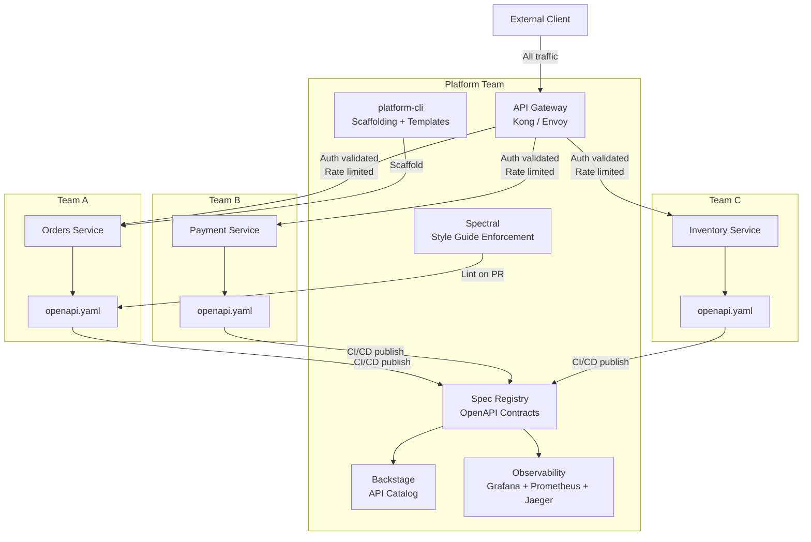

⚡ TL;DR - An API Platform is the shared infrastructure
that enables 100+ teams to build and operate APIs
consistently; key components: API Gateway (centralized
auth + rate limiting + routing), API catalog / portal
(discoverability), spec registry (OpenAPI contract
governance), developer portal (documentation + sandbox),
observability pipeline (centralized metrics/tracing),
and platform team (governs standards, operates shared
infra); the hardest problem is not the technology -
it is governance: how do you enforce standards without
blocking teams, and how do you allow autonomy without
chaos; the platform team is a product team whose
customers are internal developers; Paved Road principle:
make the right way easy and the wrong way hard.

---

| #076 | Category: HTTP & APIs | Difficulty: ★★★★★ |
|:---|:---|:---|
| **Depends on:** | API-First, Internal vs Public, Versioning, Service Mesh, Decision Framework, API Gateway | |
| **Used by:** | API Deprecation Strategy | |
| **Related:** | API Gateway, API-First, Internal vs Public, Versioning, Service Mesh, Decision Framework, Deprecation | |

---

### 🔥 The Problem This Solves

**WORLD WITHOUT IT:**
Company has grown to 150 engineering teams. Each team
runs their own microservices and exposes APIs. The result:
50 different authentication schemes (some teams use JWT,
some use API keys, some use session cookies, some nothing).
40 different rate limiting strategies (some teams have none).
No central API catalog (engineers spend 2 hours finding
which team owns which endpoint). No consistent error
format (each API returns errors differently). Security
team finds 20 APIs with no authentication exposed on the
internal network. One team's runaway batch job hits
another team's API 100k times/minute and takes it down
(no rate limiting). This is the un-governed API ecosystem.

---

### 📘 Textbook Definition

**API Platform components:**

**1. API Gateway:**
Centralized ingress for all internal (and optionally external)
API traffic. Cross-cutting: authentication validation, rate
limiting, routing, observability injection. Teams register
their services; the gateway handles the cross-cutting concerns.

**2. API Catalog / Service Registry:**
Searchable directory of all APIs in the organization.
Contains: who owns it, what it does, SLA, documentation
link, contact. Enables discovery (engineer can find the
orders service without Slacking the orders team).

**3. OpenAPI Spec Registry:**
Central storage for all API contracts. CI/CD publishes
the spec on every deployment. Portal reads from the
registry to serve up-to-date docs. Breaking change
detection compares spec versions.

**4. Developer Portal:**
Self-service documentation site with: API reference
(generated from OpenAPI specs), interactive sandbox
(try the API without writing code), SDK download,
getting started guides, changelog.

**5. Observability Pipeline:**
Centralized collection of metrics, traces, and logs from
all APIs. Platform team aggregates and surfaces: SLO
compliance per API, error rate trends, latency percentiles.
Teams can access their own API's telemetry via Grafana/Datadog.

**6. Platform Team:**
Dedicated team (typically 5-15 engineers for a 1000-
engineer org). Operates the shared infrastructure.
Defines API standards (style guide, versioning policy,
error format). Provides tooling (Spectral lint config,
CI/CD templates, SDK generators). Key principle: the
platform team is a product team - internal developers
are their customers.

---

### ⏱️ Understand It in 30 Seconds

**One line:**
An API platform provides shared infrastructure (gateway,
catalog, observability) and governance (standards,
tooling) so 100+ teams build APIs consistently without
reinventing the wheel.

**One analogy:**
> An API platform is a city's infrastructure: roads
> (API gateway for routing), address registry (API catalog),
> building codes (API standards), utility connections
> (observability pipeline), and city planners (platform team).
> Without infrastructure: each building owner builds their
> own roads, runs their own power lines, defines their own
> address format. The city is chaotic and expensive.
> With infrastructure: builders follow codes (standards),
> connect to shared utilities (gateway, observability),
> and can find any address (API catalog). The infrastructure
> cost is shared; individual teams move faster.

---

### 🔩 First Principles Explanation

**Paved Road principle:**

```
The platform team makes the right way easy and the wrong
way hard. This is not enforcement - it is design.

EXAMPLE: Authentication

WITHOUT Paved Road:
  Teams implement auth themselves.
  Result: 50 different JWT validation implementations.
  Some teams forget to validate expiry. Some forget to
  validate the issuer. Some forget to check the audience.
  15 of 150 teams have authentication bugs.

WITH Paved Road:
  The API Gateway validates JWTs for all registered services.
  Teams configure: "I accept JWT tokens" in one YAML field.
  The gateway does the rest. Teams CANNOT implement auth
  incorrectly because they don't implement auth.

The wrong way (bypass the gateway, implement auth in the
service) is possible but requires MORE work than using
the platform. Nobody chooses the harder path voluntarily.
```

**API governance without blocking teams:**

```
Two extremes (both bad):

Too strict: Platform team reviews every API change.
  All API changes blocked behind platform team review.
  Platform team is a bottleneck.
  Teams hate the platform team.

Too loose: No governance.
  Teams do whatever they want.
  180 different patterns.
  No consistency.
  Security gaps.

BALANCED (Paved Road):
  Machine-enforced: Spectral lint in CI/CD.
    Rules: field naming convention, required fields in
    error schema, must have description on every operation.
    These run automatically. No human review needed.
  Human review: reserved for high-impact changes.
    New API authentication scheme, new rate limit tier,
    API going public (internal → public).
  Self-service: for common patterns (CRUD API, event-driven).
    Templates + generators: `platform-cli create-api orders`
    creates a scaffolded service with all standards applied.
```

---

### 🧪 Thought Experiment

**SCENARIO: What breaks first at 100 teams?**

```
Without platform governance, here is the failure cascade:

Month 1-6: Teams move fast. No friction.
Month 12: "We need to audit all APIs for GDPR compliance."
  → No central list of APIs. Audit takes 3 months manually.
  → 15 APIs found with PII in response fields, no GDPR controls.

Month 18: "All APIs must support mTLS for PCI compliance."
  → Each team must implement mTLS separately.
  → 50 teams × 2 days = 100 engineer-days.
  → With Service Mesh: Istio applied to all pods in 1 day.

Month 24: "A new developer joined team X. They can't find
the orders API."
  → 2 hours of Slack messages.
  → 30-minute meeting with orders team.
  → No API catalog.

Month 30: Security incident. "Which APIs are using the
compromised JWT signing key?"
  → No central key registry.
  → Unknown. Must audit all 350 services.
  → Takes 2 weeks.

WITH platform:
  Month 1: API catalog. API Gateway with centralized key management.
  Month 12: GDPR audit: query the spec registry. 2 hours.
  Month 18: PCI mTLS: Istio + one AuthorizationPolicy. 1 day.
  Month 24: Orders API: search the catalog. 30 seconds.
  Month 30: Compromised key: rotate in key management. All gateways
    updated automatically. 2 hours.
```

---

### 🧠 Mental Model / Analogy

> Building an API platform is product management for
> infrastructure. The "users" are internal developers.
> The platform team must: understand developer pain points
> (why is authentication hard for teams?), build solutions
> that reduce friction (JWT validation in the gateway),
> measure adoption (what % of new services use the standard
> auth pattern?), and iterate based on feedback. A platform
> team that builds what it thinks is right without talking
> to developers builds things nobody uses. Developer
> productivity requires empathy: the hardest thing to
> understand from the platform side is how a brand-new
> engineer experiences the platform for the first time.
> The "day 1 developer experience" is the highest-leverage
> metric for a platform team.

---

### 📶 Gradual Depth - Five Levels

**Level 1 - What it is (anyone can understand):**
An API platform is the shared tools and infrastructure
that make it easy for all engineering teams in a large
company to build, document, and operate their APIs
consistently and securely.

**Level 2 - How to use it (junior developer):**
When joining a company with an API platform: check the
API catalog to find existing APIs (don't build what
already exists). Follow the API standards (style guide,
Spectral lint config). Register your service in the
API Gateway (for auth and rate limiting). Publish your
OpenAPI spec to the spec registry (CI/CD does it
automatically).

**Level 3 - How it works (mid-level engineer):**
The platform team operates: API Gateway (Kong/Envoy),
spec registry (Backstage or custom Git repo), developer
portal (Stoplight/Readme/custom). CI/CD integration:
on every pull request, Spectral lint checks the OpenAPI
spec against style guide. On merge to main: spec is
published to the registry, documentation is updated,
breaking change alert fires if spec changed.

**Level 4 - Why it was designed this way (senior/staff):**
The platform team's incentive is adoption, not compliance.
Forcing teams to use the platform via mandate is the
wrong approach - teams find workarounds, resent the
platform team, and the platform team becomes the "police."
The right approach: make the platform so valuable that
teams WANT to use it. Value: "using the gateway gives
you automatic auth validation, rate limiting, metrics,
and centralized key rotation. Implementing it yourself
gives you less reliability and more work." If teams are
not adopting the platform: the platform is not valuable
enough, not because teams are non-compliant.

**Level 5 - Mastery (distinguished engineer):**
The highest-maturity API platform characteristic:
self-service by default, with approval gates for
exceptions. The normal path: a developer uses `platform-cli
create-api` to scaffold a new service. The CLI generates:
OpenAPI stub, service registration in API Gateway,
Kubernetes deployment YAML, Dockerfile, CI/CD pipeline,
observability config. No manual steps. No tickets.
The exceptional path: a team wants to use a non-standard
auth scheme. This requires a platform review (a form,
a meeting, an approval). The friction for the exceptional
path is intentional: it is the incentive to use the
standard path. Google's Internal Developer Platform
(Blaze/BuildCop), Netflix's Paved Path, Spotify's
Backstage - these are all implementations of the same
principle.

---

### ⚙️ How It Works (Mechanism)

**Platform CLI (self-service scaffolding):**

```bash
# Scaffolding command (platform team provides)
platform-cli create-api \
  --name orders \
  --team order-management \
  --language python \
  --protocol rest

# Generated files:
# api/openapi.yaml         - OpenAPI 3.1 stub
# src/main.py              - FastAPI stub with platform middleware
# Dockerfile               - Standardized build
# k8s/deployment.yaml      - Kubernetes deployment + gateway registration
# k8s/service.yaml         - Kubernetes service
# k8s/gateway.yaml         - API Gateway VirtualService
# .github/workflows/ci.yml - CI with Spectral lint + spec publish
# .spectral.yaml           - Org style guide rules (from platform)

# Generated openapi.yaml includes platform requirements:
# - Required: description on all operations
# - Required: error response schema (org standard format)
# - Required: versioning header
# - Required: OpenAPI info contact (team's Slack channel)
```

**Backstage API catalog integration:**

```yaml
# catalog-info.yaml (in each team's repository)
# Backstage reads this to build the API catalog
apiVersion: backstage.io/v1alpha1
kind: API
metadata:
  name: orders-api
  description: Order management API
  annotations:
    github.com/project-slug: company/orders-service
    backstage.io/techdocs-ref: dir:.
  tags:
    - rest
    - orders
    - internal
spec:
  type: openapi
  lifecycle: production
  owner: group:order-management-team
  definition:
    $text: ./api/openapi.yaml  # Read OpenAPI spec from repo
```

**API Gateway registration:**

```yaml
# k8s/gateway.yaml - generated by platform-cli
apiVersion: gateway.networking.k8s.io/v1beta1
kind: HTTPRoute
metadata:
  name: orders-api
  namespace: default
  annotations:
    platform.company.com/team: order-management
    platform.company.com/sla: tier-2
spec:
  parentRefs:
    - name: api-gateway
      namespace: gateway
  hostnames:
    - "api.internal.company.com"
  rules:
    - matches:
        - path:
            type: PathPrefix
            value: /orders
      backendRefs:
        - name: orders-service
          port: 8080
---
# Kong plugin: auth + rate limit via annotations
# (platform team manages the plugin config)
apiVersion: configuration.konghq.com/v1
kind: KongPlugin
metadata:
  name: orders-jwt-auth
plugin: jwt
config:
  key_claim_name: kid
  claims_to_verify: [exp, iss]
---
apiVersion: configuration.konghq.com/v1
kind: KongPlugin
metadata:
  name: orders-rate-limit
plugin: rate-limiting
config:
  minute: 1000
  policy: redis
  redis_host: platform-redis
```



---

### 🔄 The Complete Picture - End-to-End Flow

**Breaking change detection in CI/CD:**

```yaml
# .github/workflows/api-governance.yml
# Generated by platform-cli - every API's CI pipeline
name: API Governance

on: [push, pull_request]

jobs:
  lint-spec:
    runs-on: ubuntu-latest
    steps:
      - uses: actions/checkout@v3

      - name: Spectral lint (org style guide)
        run: |
          npx @stoplight/spectral-cli lint api/openapi.yaml \
            --ruleset https://platform.company.com/spectral.yaml \
            --fail-severity warn
        # Rules: naming conventions, required descriptions,
        # error format, versioning, SLA tier annotation

      - name: Check for breaking changes
        uses: oasdiff/oasdiff-action/breaking@main
        with:
          base: origin/main:api/openapi.yaml
          revision: api/openapi.yaml
        # Blocks PR if breaking change without version bump

      - name: Publish spec to registry
        if: github.ref == 'refs/heads/main'
        run: |
          platform-cli publish-spec api/openapi.yaml \
            --service orders \
            --version $(git rev-parse --short HEAD)
```

---

### 💻 Code Example

**Example 1 - BAD: Platform as police (mandate-driven governance)**

```python
# BAD: Platform team reviews every API change manually
# Ticket required for any new API endpoint

# This creates:
# 1. Platform team bottleneck (they review 200 PRs/week)
# 2. Teams find workarounds (deploy anyway, "we'll file ticket later")
# 3. Resentment: "platform team blocks everything"
# 4. Actual non-compliance (teams skip the process under pressure)
# No enforcement mechanism - just a process that teams circumvent.

# GOOD: Automated enforcement (Spectral in CI/CD)
# spectral.yaml (org rules published by platform team)
rules:
  operation-description:
    description: "All operations must have a description"
    severity: error
    given: "$.paths[*][get,post,put,patch,delete]"
    then:
      field: description
      function: truthy

  error-response-format:
    description: "All error responses must use org error schema"
    severity: error
    given: "$.paths[*][*].responses[4*,5*].content.application/json.schema"
    then:
      function: schema
      functionOptions:
        schema:
          required: [error]
          properties:
            error:
              required: [type, message]

  security-definition:
    description: "All operations must have security defined"
    severity: error
    given: "$.paths[*][*]"
    then:
      field: security
      function: defined
# These rules run automatically in CI.
# Teams cannot merge without passing.
# No human review needed for standard patterns.
```

---

### ⚖️ Comparison Table

| Governance Approach | Developer Experience | Security | Scale | Adoption |
|:---|:---|:---|:---|:---|
| No governance | Fastest initially, chaos long-term | Inconsistent, gaps | Poor (150 patterns) | N/A |
| Manual review (tickets) | Slow (bottleneck) | High (if reviewed) | Poor (team is bottleneck) | Low (teams bypass) |
| Automated + self-service (Paved Road) | Fast (standard path) | High (automated) | Excellent | High (least friction) |
| Hard enforcement (can't deploy without approval) | Blocked | Highest | Poor | Resentment |

---

### ⚠️ Common Misconceptions

| Misconception | Reality |
|:---|:---|
| A platform team's job is to enforce standards | A platform team's job is to make standards easy to follow. Enforcement without enablement is "no-team theater" - teams find workarounds. The right model: make the standard path so easy and so beneficial that teams choose it. Enforcement is a backup for the rare non-compliant case, not the primary mechanism. |
| One API Gateway means one team controls all APIs | The API Gateway is infrastructure, like a load balancer. Teams should be able to register their services in the gateway self-service (platform-cli registers in the gateway as part of scaffold). The platform team operates the gateway; they do not control which services register or what routes teams configure (within style guide bounds). |
| An API catalog is just nice-to-have documentation | The API catalog is a critical business asset. It prevents: duplicate services (two teams building the same thing independently), integration failures (team uses the wrong version of an API), security gaps (no one knows who owns the authentication service). The catalog is the source of truth for "what APIs exist, who owns them, and what is their SLA." At 150+ teams, without a catalog, the org cannot answer these questions. |

---

### 🚨 Failure Modes & Diagnosis

**Platform team as bottleneck**

**Symptom:** Teams complain: "We can't ship because
platform team hasn't reviewed our API spec." Platform
team is reviewing 50+ PRs/week. Reviews take 5-7 days.
Engineering VP escalates.

**Root Cause:** Manual review for all changes, not just
high-risk changes.

**Fix:**
```
Phase 1: Automate standard checks (Spectral in CI/CD).
  All style guide checks → machine enforcement.
  Platform team reviews only fail cases.
  → Reduces 80% of review volume.

Phase 2: Define high-risk tiers requiring human review.
  Only these require platform team approval:
  - API going from internal to public
  - New authentication scheme (not from standard list)
  - Breaking change with versioning exception request
  - New API with SLA tier 0 (highest criticality)
  All other changes: self-service (automated checks only).
  → Reduces remaining volume by 90%.

Phase 3: SLO for remaining reviews.
  Platform team commits: 24-hour turnaround on required reviews.
  Teams know what needs review and how fast they will get it.
```

---

### 🔗 Related Keywords

**Prerequisites (understand these first):**
- `API-First Design Strategy` - spec-driven development
- `Service Mesh vs API Gateway Trade-offs` - infrastructure
- `API Versioning at Scale` - versioning governance
- `API Gateway Rate Limiting and Auth at Scale` - gateway patterns

**Builds On This (learn these next):**
- `API Deprecation Strategy` - lifecycle management at scale

---

### 📌 Quick Reference Card

```
┌──────────────────────────────────────────────────────────┐
│ Core           │ Gateway + Catalog + Spec Registry       │
│ components     │ + Developer Portal + Observability      │
├────────────────┼───────────────────────────────────────── │
│ Governance     │ Automated (Spectral CI/CD) + Human      │
│ model          │ review only for high-risk exceptions    │
├────────────────┼───────────────────────────────────────── │
│ Paved Road     │ Make standard path easy, exception path │
│                │ harder. Not enforcement - design.       │
├────────────────┼───────────────────────────────────────── │
│ Platform team  │ Product team. Internal devs = customers │
│ mindset        │ Measure adoption, not compliance.       │
├────────────────┼───────────────────────────────────────── │
│ Day 1 metric   │ Time to first working API call for a   │
│                │ new engineer following the standard path│
├────────────────┼───────────────────────────────────────── │
│ ONE-LINER      │ "Make the right way the easy way.       │
│                │  Automate standards. Self-service        │
│                │  common path. Human review exceptions." │
└──────────────────────────────────────────────────────────┘
```

**If you remember only 3 things:**
1. Platform team is a product team. Internal developers
   are customers. Measure adoption, not compliance.
   If adoption is low: the platform is not valuable enough.
2. Paved Road: make the standard path (use the gateway,
   follow the style guide) easier than the non-standard
   path. Automated lint enforcement in CI/CD is more
   effective than manual review.
3. The API catalog is a business-critical asset at
   150+ teams. Without it: no one knows what APIs exist,
   who owns them, or what their SLA is.

---

### 💎 Transferable Wisdom

**Reusable Engineering Principle:**
"Platform engineering is the application of product
thinking to internal infrastructure." The platform
team builds products (gateway, catalog, tooling) for
internal customers (developers). Product principles
apply: understand customer pain points (developer
surveys, office hours, support tickets), build with
them not for them (co-design the scaffold CLI with
representative teams), measure success (adoption
rate, time-to-first-API, support ticket volume),
iterate based on feedback. The mistake: platform team
thinks "we know better, we'll build it right and
mandate adoption." This is the same mistake as building
a product without customer discovery. Platform success
= developer success. Developer success = developer
empathy.

**Where else this pattern applies:**
- Security platform: security tooling that is easy to
  use reduces security incidents more than security
  mandates that developers find hard to follow
- ML platform: self-service ML tooling (Kubeflow,
  MLflow) with golden path makes ML accessible to
  all teams, not just ML specialists
- Data platform: data catalog (dbt, Amundsen) + self-
  service query layer + standard schema conventions =
  data governance without data team bottleneck

---

### 💡 The Surprising Truth

The biggest predictor of API platform success is not
the technology stack - it is the platform team's
internal communication strategy. The most technically
excellent API platform fails if engineers do not know
it exists or do not understand how to use it.
Spotify's Backstage team discovered that their adoption
was low not because Backstage was bad, but because
they had not run developer discovery sessions. When
they ran quarterly "Backstage office hours," wrote
engineering blog posts about platform features, and
created demo videos, adoption jumped 60% in 6 months
with no code changes. The platform team's job is 50%
engineering and 50% internal marketing. Developers
do not automatically seek out new tools - they need
to be shown the value in their own context. Platform
teams that invest in developer relations (internal
evangelism, documentation, onboarding workshops) get
dramatically higher adoption than teams that build
and wait.

---

### ✅ Mastery Checklist

**You've mastered this when you can:**
1. **DESIGN** The minimal viable API platform for a
   50-team organization: which components, what order
   to build them, what measures success.
2. **CONFIGURE** Spectral linting rules for an org
   API style guide and integrate into CI/CD.
3. **EXPLAIN** The Paved Road principle and apply it
   to a specific governance challenge (authentication
   enforcement, rate limiting policy).
4. **SET UP** A Backstage catalog-info.yaml for an API
   and connect it to a Backstage developer portal.
5. **DIAGNOSE** Why an API platform has low adoption
   and propose 3 specific interventions.

---

### 🎯 Interview Deep-Dive

**Q1: How would you build an API platform for a company
with 100+ engineering teams?**

*Why they ask:* Senior/staff engineering question on platform design.

*Strong answer includes:*
- Start with the problems: which ones are most painful?
  (insecure APIs with no auth? can't find APIs? inconsistent
  errors? teams copying auth code incorrectly?) Prioritize
  by pain, not by technical elegance.
- Core components (build in this order):
  (1) API Gateway: centralize auth + rate limiting. Highest
      security ROI. Teams opt-in per service.
  (2) API Catalog (Backstage): discoverability. Simple to
      add (YAML file in each repo). Immediate value.
  (3) Spectral lint in CI/CD: automated style guide enforcement.
      No review bottleneck. Teams get fast feedback.
  (4) Spec registry: CI/CD publishes OpenAPI spec on merge.
      Developer portal reads from registry.
  (5) Observability: centralized metrics per API (Prometheus
      + Grafana). Teams can see their SLO compliance.
- Governance model: Paved Road. Scaffold CLI creates
  standard structure. Standard path = minimal friction.
  Exception path = human review (well-defined process).
- Success metrics: API catalog coverage %, time-to-first
  API call for new engineer, % of services using gateway,
  Spectral lint pass rate, support ticket volume.

**Q2: How do you enforce API standards across 100 teams
without creating a bottleneck?**

*Why they ask:* Tests platform governance depth.

*Strong answer includes:*
- Automated enforcement for standard checks: Spectral
  linting in CI/CD. Rules: naming conventions, required
  descriptions, error response format, versioning, security
  annotations. These run in < 30s. No human needed.
- Human review only for high-risk exceptions:
  (1) API going from internal to public
  (2) Non-standard authentication scheme
  (3) Breaking change requiring versioning exception
  (4) SLA tier 0 (highest criticality) new API
  SLA for these: 24-hour turnaround.
- The standard path should be zero-friction:
  `platform-cli create-api` scaffolds compliant service.
  Pre-registered in gateway. Spec published automatically.
  The developer who follows the standard path never
  encounters a review gate.
- Measure enforcement effectiveness: % of merged PRs
  passing Spectral without failures (target: > 95%).
  % of teams using gateway (target: > 90%). If teams
  are bypassing the gateway: investigate why (is it
  too slow? too complex to register?) - it is a platform
  problem, not a team compliance problem.
