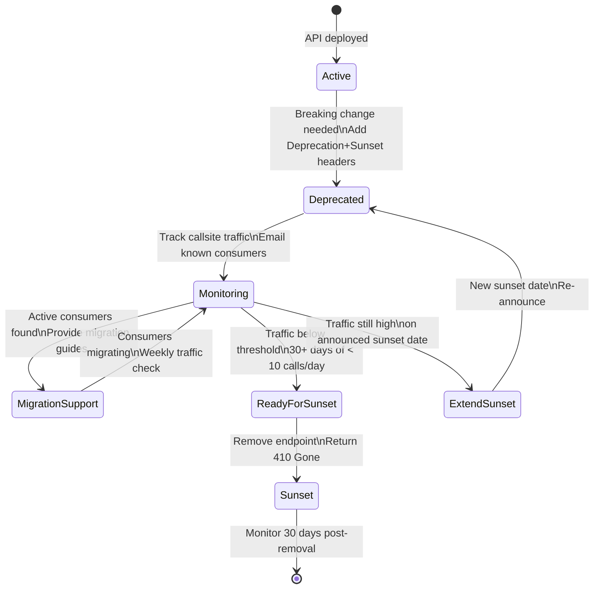

⚡ TL;DR - API deprecation is the process of retiring
an API version with minimum disruption to consumers;
the three pillars: signal (Deprecation + Sunset headers,
per RFC 8594), discover (who is still calling the
deprecated API? log callsite headers, API key, timestamp),
migrate (give consumers enough time and clear migration
guides); the fatal mistake is setting a sunset date
without knowing who is still calling the API - you
will break consumers who did not see the announcement;
minimum sunset windows: 6 months for internal APIs,
12-24 months for public APIs; never remove an API on
the sunset date without traffic confirmation (verify
zero traffic for 30+ days first); the hardest problem
is not the technical sunset - it is finding and migrating
the last 1% of consumers who never responded.

---

| #077 | Category: HTTP & APIs | Difficulty: ★★★★☆ |
|:---|:---|:---|
| **Depends on:** | API Versioning at Scale, API Platform Design, Internal vs Public API | |
| **Used by:** | gRPC Service Evolution | |
| **Related:** | Internal vs Public API, Versioning at Scale, API Platform, gRPC Evolution, Rate Limiting Governance | |

---

### 🔥 The Problem This Solves

**WORLD WITHOUT IT:**
Team has a v1 REST API with 150 known consumers (and
unknown consumers who integrated without registering).
The v1 schema has a `customer_name` field that needs
to be split into `first_name` and `last_name` (breaking
change). Team sends an email: "We're retiring v1 in
90 days." 40% of teams respond and migrate. 90 days
pass. Team removes v1. 60% of consumers break. Production
incidents across 90 services. 3 weeks of emergency
fixes. Escalation to VP. Post-mortem: "We didn't know
who was still using v1." This is the un-governed
deprecation failure.

---

### 📘 Textbook Definition

**API Deprecation:**
The process of marking an API version as obsolete and
scheduled for removal. Does not remove the API - signals
to consumers that they must migrate. Deprecation is
the start of the lifecycle end, not the end itself.

**API Sunset:**
The date when a deprecated API will be removed or stop
responding. Defined by: Sunset header (RFC 8594, HTTP
date format), versioning policy document, consumer
communications.

**RFC 8594 - Sunset Header:**
Standardized header for signaling deprecation and sunset:

```
Deprecation: true
Sunset: Sat, 01 Jan 2026 00:00:00 GMT
Link: <https://docs.company.com/api/migration/v1-to-v2>;
      rel="successor-version"
```

**Zombie API:**
An API version that has passed its sunset date but
is still running because traffic analysis revealed
consumers did not migrate. Named for APIs that refuse
to die.

**Callsite Tracking:**
Logging which consumer (API key, service name, user-agent)
called a deprecated endpoint. Required for: knowing
who to contact for migration assistance, verifying
zero traffic before removal, finding zombie consumers.

---

### ⏱️ Understand It in 30 Seconds

**One line:**
Signal deprecation with standard headers, discover who
is still using it via callsite tracking, migrate them
with adequate notice and clear guides, and only remove
after confirming zero traffic.

**One analogy:**
> Deprecating an API is like closing a highway exit.
> The process: (1) signal - post signs well in advance
> ("Exit 42 closing March 1"), (2) track - count cars
> using the exit daily (are 1000 cars/day still using it?),
> (3) communicate - contact trucking companies that use
> the exit regularly (migration assistance for high-volume
> consumers), (4) verify - confirm near-zero usage before
> closing, (5) close - but keep an emergency bypass for
> the rare car that arrives on day 1 of closure (grace period).
> Closing without the sign (no deprecation headers),
> closing without counting cars (no traffic tracking),
> or closing without contacting trucking companies
> (no migration assistance) = car crashes on closing day.

---

### 🔩 First Principles Explanation

**The fundamental challenge: you cannot control consumers**

```
Internal API:
  You can theoretically require teams to migrate.
  But enforcement is limited.
  Teams have roadmaps, priorities, other work.
  "Migrate off v1 by June" competes with "deliver Q2 feature."
  Minimum window: 6 months (allows one sprint planning cycle
  per team to schedule the migration).

Public API (third-party developers):
  You have zero control.
  Developers on free tier may not check your mailing list.
  Indie developers may have abandoned the integration.
  Enterprise customers may have a legal review required
  before they can change an API integration.
  Minimum window: 12-24 months. Stripe gives 2+ years.
  Twilio has deprecated endpoints that are still running
  5 years after sunset announcement (because removing
  them would break too many integrations).

The discovery problem:
  Email announcements: 40% read rate for developers.
  Developer portal announcements: seen only by active users.
  Deprecation headers: seen only if consumer reads headers.
  The ONLY reliable way to know who is still using the API:
  server-side callsite logging. Log every call to deprecated
  endpoints with: timestamp, API key / service identity,
  User-Agent, callsite IP.
  Then: reach out to every consumer who called in the last 30 days.
```

---

### 🧪 Thought Experiment

**SCENARIO: Sunset a public API endpoint**

```
Day 1: Announce deprecation
  - Add Deprecation: true + Sunset: [date 18 months out]
    to API responses for the v1 endpoint
  - Publish migration guide: what changed, step-by-step
  - Email all registered API key holders who have called
    the endpoint in the last 90 days
  - Add in-app banner in developer portal
  - Log all v1 endpoint calls with API key + timestamp

Month 3: First migration check
  - Query: how many unique API keys still called v1
    in the last 30 days?
  - Segment: by call volume (high/medium/low)
  - Contact high-volume consumers directly (1:1 migration support)
  - Send reminder email to all active consumers

Month 9: Second migration check
  - Query: unique API keys, daily call volume
  - If still > 100 API keys or > 10k calls/day:
    extend sunset date (you cannot remove a well-used API)
  - Publish updated sunset date with explanation
  - Run migration workshop (webinar)

Month 15: Final migration push
  - Contact all remaining consumers by name (you have the log)
  - Free migration assistance from developer support team
  - Set return code warning: add header X-Deprecation-Warning
    to every response (some consumers may only notice
    when their monitoring alerts on unexpected headers)

Month 18 (sunset date):
  - Verify: < 10 calls/day for last 14 days before removing
  - If not: do NOT remove. Extend again. Log the remaining callsites.
  - If yes: add 410 Gone responses with migration link
  - Monitor for 30 days: any spikes from consumers who
    were not calling recently but resume (seasonal traffic)
```

---

### 🧠 Mental Model / Analogy

> Think of API deprecation as change management for code.
> Organizational change management has phases: announce,
> communicate, support, transition. So does API deprecation.
> The mistake is treating it as a technical problem
> (set a date, update the code, remove the endpoint)
> rather than a human coordination problem. The technical
> part (adding Deprecation headers, removing the endpoint)
> takes one sprint. The human part (reaching all consumers,
> getting them to act, handling stragglers) takes 12-18 months
> for a public API. Invest in the human side: clear migration
> guides, migration tooling (codemods that update client
> code automatically), and direct outreach to high-value
> consumers. The ROI on migration tooling is high - if you
> can make migration a 10-minute automated upgrade instead
> of a 2-day manual rewrite, your migration rate goes from
> 40% to 90%.

---

### 📶 Gradual Depth - Five Levels

**Level 1 - What it is (anyone can understand):**
API deprecation is the process of announcing that an
old version of an API will stop working, giving users
time to upgrade to the new version before it is removed.

**Level 2 - How to use it (junior developer):**
When a consumer: watch for `Deprecation: true` and
`Sunset: <date>` headers in API responses. Check the
`Link` header for the migration guide URL. If you see
these, schedule the migration before the sunset date.
When a producer: add these headers to deprecated
endpoints, publish a migration guide, track who is
still calling via access logs, contact them.

**Level 3 - How it works (mid-level engineer):**
RFC 8594 standardizes the Deprecation and Sunset headers.
Callsite tracking: API Gateway (Kong, Envoy) can log
`X-Consumer-ID`, `X-Forwarded-For`, User-Agent to a
centralized log (Elasticsearch, BigQuery). Query: "which
API keys called /v1/orders in the last 30 days?" Join
to your consumer database to get contact info. Reach
out. Automate migration reminders from this data.

**Level 4 - Why it was designed this way (senior/staff):**
The sunset window is a negotiation. Too short: consumers
break (they did not have enough time). Too long: the
old API code stays in production indefinitely (maintenance
burden, security patching required on deprecated code,
confusion for new developers). The optimal window
depends on: number of consumers, API call criticality
(is it in a payment flow?), consumer type (enterprise
with long legal review vs indie developer with 1 integration).
Stripe's approach: never remove old API behavior for
a customer who was using the API before the deprecation
date (they are "grandfathered" on the version they
integrated against). This trades maintenance burden
for zero-disruption deprecation. Only viable if your
per-customer schema compatibility layer is well-engineered.

**Level 5 - Mastery (distinguished engineer):**
The highest sophistication: predictive deprecation.
Instead of reacting to "we need to change this field,"
build the API so that non-breaking changes are the
default. Additive-only: new fields, new endpoints,
new optional parameters. Semantic versioning for APIs:
MAJOR = breaking change (new version, old kept for
N months), MINOR = additive change (backward compatible),
PATCH = bug fix (backward compatible). Design the API
contract so breaking changes require exceptional business
justification (not just "we want to rename the field").
The discipline: if a breaking change is required, the
cost (migration support, sunset window, consumer disruption)
must be weighed against the benefit. Most "nice-to-have"
breaking changes fail this cost-benefit analysis when
the migration cost is honestly accounted for.

---

### ⚙️ How It Works (Mechanism)

**Deprecation headers middleware (FastAPI):**

```python
from fastapi import FastAPI, Request, Response
from datetime import datetime, timezone
from typing import Callable

app = FastAPI()

SUNSET_DATE = "Sat, 01 Jan 2026 00:00:00 GMT"
MIGRATION_GUIDE = (
    "https://docs.company.com/api/v2/migration"
)

def deprecated_endpoint(
    sunset: str = SUNSET_DATE,
    migration_url: str = MIGRATION_GUIDE,
):
    """Middleware factory: mark endpoint as deprecated."""
    async def middleware(
        request: Request,
        call_next: Callable,
    ) -> Response:
        response = await call_next(request)
        response.headers["Deprecation"] = "true"
        response.headers["Sunset"] = sunset
        response.headers["Link"] = (
            f'<{migration_url}>; rel="successor-version"'
        )
        # Log callsite for migration tracking
        api_key = request.headers.get(
            "Authorization", "unknown"
        )
        user_agent = request.headers.get(
            "User-Agent", "unknown"
        )
        log_deprecated_call(
            endpoint=str(request.url.path),
            api_key=api_key,
            user_agent=user_agent,
            timestamp=datetime.now(timezone.utc),
        )
        return response
    return middleware

# V1 route group with deprecation applied
@app.middleware("http")
async def apply_deprecation(request: Request, call_next):
    if request.url.path.startswith("/v1/"):
        return await deprecated_endpoint()(request, call_next)
    return await call_next(request)

@app.get("/v1/orders/{order_id}")
async def get_order_v1(order_id: str):
    """Legacy v1 - deprecated, use /v2/orders/{id}."""
    # ... legacy response shape
    pass

@app.get("/v2/orders/{order_id}")
async def get_order_v2(order_id: str):
    """Current version."""
    pass
```

**Callsite tracking and consumer outreach query:**

```sql
-- BigQuery: find all consumers still using deprecated API
-- Run weekly, use to drive outreach

SELECT
  api_key,
  COUNT(*) as calls_last_30d,
  MAX(timestamp) as last_call,
  ARRAY_AGG(
    DISTINCT user_agent ORDER BY user_agent LIMIT 5
  ) as user_agents,
FROM api_access_logs
WHERE
  endpoint LIKE '/v1/%'
  AND timestamp > TIMESTAMP_SUB(
      CURRENT_TIMESTAMP(), INTERVAL 30 DAY
  )
GROUP BY api_key
HAVING calls_last_30d > 0
ORDER BY calls_last_30d DESC;

-- Join to consumer DB for contact info
-- Top consumers: reach out directly (1:1 migration support)
-- Long-tail consumers: automated email campaign
```

**Zero-traffic verification before removal:**

```python
# Pre-removal checklist script
from datetime import datetime, timezone, timedelta

async def verify_safe_to_sunset(
    endpoint_pattern: str,
    lookback_days: int = 30,
    max_daily_calls: int = 10,
) -> dict:
    """
    Run before removing a deprecated endpoint.
    Returns: safe_to_remove (bool) + details.
    """
    cutoff = datetime.now(timezone.utc) - timedelta(
        days=lookback_days
    )
    results = await db.fetch_all(
        """
        SELECT
          DATE(timestamp) as date,
          COUNT(*) as calls,
          COUNT(DISTINCT api_key) as unique_consumers
        FROM api_access_logs
        WHERE endpoint LIKE $1
          AND timestamp > $2
        GROUP BY DATE(timestamp)
        ORDER BY date DESC
        """,
        [endpoint_pattern, cutoff],
    )
    if not results:
        return {"safe_to_remove": True, "reason": "zero traffic"}
    max_calls = max(r["calls"] for r in results)
    if max_calls > max_daily_calls:
        return {
            "safe_to_remove": False,
            "reason": (
                f"peak {max_calls} calls/day > threshold {max_daily_calls}"
            ),
            "details": results,
        }
    return {
        "safe_to_remove": True,
        "reason": f"max {max_calls} calls/day below threshold",
    }
```



---

### 🔄 The Complete Picture - End-to-End Flow

**410 Gone response after sunset:**

```python
@app.get("/v1/orders/{order_id}")
async def get_order_v1_sunset(order_id: str):
    """
    Return 410 Gone after sunset date.
    Include: migration link in response body.
    Log the call (someone missed the announcement).
    """
    raise HTTPException(
        status_code=410,
        detail={
            "error": {
                "type": "endpoint_removed",
                "message": (
                    "This API endpoint was sunset on 2026-01-01. "
                    "Please migrate to v2."
                ),
                "migration_guide": (
                    "https://docs.company.com/api/v2/migration"
                ),
                "v2_equivalent": f"/v2/orders/{order_id}",
            }
        },
    )
```

---

### 💻 Code Example

**Example 1 - BAD: Remove endpoint on sunset date without checking traffic**

```python
# BAD: Hard-coded sunset date removal with no traffic check
# March 1, 2026: remove the /v1/ routes

# Migration Day - engineer deletes the /v1/ route group
# Immediately: 47 production incidents across 47 services
# who missed the deprecation announcement.
# Root cause: no callsite tracking, no traffic verification.

# GOOD: Verify zero traffic before removal
# Pre-removal checklist:
# 1. Run verify_safe_to_sunset() for last 30 days
# 2. Confirm max daily calls < 10
# 3. Check for seasonal consumers (are we in a low-traffic
#    period that masks normal usage?):
#    Look at 90-day traffic trend, not just 30 days
# 4. Get approval from platform/API governance team
# 5. Only then: add 410 Gone responses
# 6. Monitor for 30 days post-sunset for any spikes
```

---

### ⚖️ Comparison Table

| Factor | Internal API | Public API |
|:---|:---|:---|
| **Minimum sunset window** | 6 months | 12-24 months |
| **Consumer discovery** | Service registry + callsite logs | API key logs + email |
| **Communication channel** | Slack + email | Email + portal + Deprecation headers |
| **Migration support** | Engineering 1:1 between teams | Documentation + support tickets |
| **Removal strategy** | Traffic verify + removal | Traffic verify + 410 Gone + monitor |
| **Grandfathering** | Rare (coordinate directly) | Common (Stripe: per-customer version) |
| **Zombie API risk** | Lower (you can mandate migration) | Higher (no control over 3rd-party developers) |

---

### ⚠️ Common Misconceptions

| Misconception | Reality |
|:---|:---|
| Setting a sunset date is the hard part | Setting the date is trivial. The hard part is: discovering every consumer (callsite tracking), getting them to act (communication, migration support), and knowing it is actually safe to remove (traffic verification). The sunset date is a milestone in a process, not the process itself. |
| 410 Gone immediately on sunset date is fine | 410 Gone with a migration link is correct for the long-term state. But on the exact sunset date: some consumers hit your API in the first hour who had been dormant for 30 days (low-frequency cron jobs, monthly batch processes). Grace period recommendation: add 410 Gone after 72 hours of the sunset date, not immediately, to catch these consumers with a clear error message rather than a total failure. |
| API versioning via URI (v1/v2) means you have an API deprecation strategy | URI versioning gives you version isolation (v1 and v2 can coexist). It does not give you a deprecation strategy. The strategy requires: lifecycle policy (minimum sunset windows), consumer communication process, callsite tracking, migration guides, and removal verification. URI versioning is the mechanism; deprecation strategy is the process. |

---

### 🚨 Failure Modes & Diagnosis

**Zombie API (traffic after sunset date)**

**Symptom:** Sunset date passed. Team removed the v1
route. 12 production incidents in the first hour.
Post-mortem: 12 services were still calling v1 - they
had not seen the deprecation announcement.

**Root Cause:** No callsite tracking. Team did not know
who was calling. Communication went to primary contacts
only. Secondary services (cron jobs, rarely-run integrations)
were not discovered.

**Diagnosis:**
```python
# After incident: identify remaining callers
# Check logs before 410 Gone was added
# Look for: IP, User-Agent, Authorization header

# In access logs (before removal):
# 2026-01-01 12:00:01 /v1/orders/123 api-key=xyz1
# 2026-01-01 12:00:02 /v1/orders/456 api-key=abc2
# These were callsites NOT in the "known consumer" list

# The fix: callsite tracking from day 1 of deprecation
# Query: SELECT DISTINCT api_key FROM v1_access_logs
#   WHERE timestamp > [deprecation date]
# Join to consumer DB → get all contacts
# This is the migration outreach list
```

**Fix for next time:**
1. Callsite tracking: log every deprecated endpoint
   call with consumer identity.
2. Outreach from logs: not from consumer registration data.
3. Traffic gate: do not remove until verified zero traffic
   for 30+ days.

---

### 🔗 Related Keywords

**Prerequisites (understand these first):**
- `API Versioning at Scale` - version isolation strategy
- `Internal vs Public API Design Principles` - sunset windows differ

**Builds On This (learn these next):**
- `gRPC Service Evolution` - Protobuf backward compatibility
- `Rate Limiting as Universal Resource Governance` - lifecycle patterns

---

### 📌 Quick Reference Card

```
┌──────────────────────────────────────────────────────────┐
│ Signal       │ Deprecation: true + Sunset: [date RFC]    │
│              │ Link: <migration-url>; rel=successor-ver  │
├──────────────┼───────────────────────────────────────────┤
│ Discover     │ Callsite tracking: log api-key+UA per     │
│              │ deprecated endpoint call. Query weekly.   │
├──────────────┼───────────────────────────────────────────┤
│ Migrate      │ Email from callsite logs (not registrations│
│              │ Migration guide + migration tooling       │
├──────────────┼───────────────────────────────────────────┤
│ Sunset       │ Verify < 10 calls/day for 30+ days FIRST  │
│              │ THEN add 410 Gone with migration link     │
├──────────────┼───────────────────────────────────────────┤
│ Windows      │ Internal: 6 months minimum                │
│              │ Public: 12-24 months minimum              │
├──────────────┼───────────────────────────────────────────┤
│ ONE-LINER    │ "Signal → Discover → Migrate → Verify → │
│              │  Remove. Never remove without traffic=0." │
└──────────────────────────────────────────────────────────┘
```

**If you remember only 3 things:**
1. Add `Deprecation: true` and `Sunset: <date>` headers
   to deprecated endpoints (RFC 8594). Include a `Link`
   header with the migration guide.
2. Track callsites: log which consumer called the
   deprecated endpoint. Use these logs (not your consumer
   registration DB) to drive migration outreach.
3. Never remove an endpoint on the sunset date without
   verifying near-zero traffic for 30+ days first.
   Zombie APIs are better than production incidents.

---

### 💎 Transferable Wisdom

**Reusable Engineering Principle:**
"Deprecation is a communication problem, not a technical
problem." The technical side (headers, traffic tracking,
410 response) is one sprint. The communication side
(reaching every consumer, supporting their migration,
managing stragglers) is 6-24 months. Systems that treat
deprecation as a technical operation miss the human
coordination work. This principle applies to any breaking
change: database schema migrations, protocol changes,
infrastructure platform changes. The pattern: signal
the change (with machine-readable headers or schema
annotations), discover who is affected (usage tracking,
not registration lists), support the transition
(migration guides, tooling, direct assistance for
high-impact consumers), and verify completion before
removing the old behavior. This is the universal
backward-compatibility playbook.

**Where else this pattern applies:**
- Database schema migration: blue-green column rename
  (add new_name column, write to both, migrate readers,
  then remove old_name - never rename directly)
- Feature flags: mark feature as deprecated in code
  (log usage), migrate callers, then remove flag
- Kubernetes API deprecation: kubectl deprecation warnings,
  apiVersion migration, version removal in future releases
- npm package deprecation: `npm deprecate pkg@version` adds
  warning on install, packages.json version ranges protect

---

### 💡 The Surprising Truth

The hardest consumers to migrate are not the ones who
refuse - they are the ones who are invisible. Every
API has "ghost consumers": integrations built by
developers who have since left the company, integrations
in services that run only monthly (batch jobs), integrations
in services owned by teams that were acquired and are
not monitored. These ghost consumers will call your API
on the day you remove it, because: (1) they are not on
your mailing list, (2) they never checked the Deprecation
headers (their code does not log response headers),
(3) they run infrequently (last 90 days of traffic
looked like zero, but they run quarterly). The solution:
extend the "zero traffic" verification window to 90+
days for quarterly batch processes, set up alerting
on "any call to deprecated endpoint" for the last 14
days before removal, and design the 410 response to
include enough context for a developer who had no idea
the API was deprecated to immediately understand what
happened and where to go. The 410 response is not an
error for compliant consumers - it is a rescue for
the ghost consumer who just found out.

---

### ✅ Mastery Checklist

**You've mastered this when you can:**
1. **IMPLEMENT** `Deprecation:`, `Sunset:`, and `Link:`
   headers per RFC 8594 in a FastAPI middleware.
2. **DESIGN** A callsite tracking query (SQL) that
   gives you every consumer calling a deprecated endpoint
   in the last 30 days with their contact info.
3. **DETERMINE** The right sunset window for a given
   API (internal, public, number of consumers, call
   criticality, consumer type).
4. **VERIFY** Safe removal: traffic threshold, lookback
   window, seasonal traffic consideration, 410 response
   design.
5. **EXPLAIN** Why Stripe's per-customer versioning
   ("grandfathering") is a valid strategy for public
   APIs and when it is appropriate.

---

### 🎯 Interview Deep-Dive

**Q1: How do you safely deprecate a public API endpoint
with thousands of consumers?**

*Why they ask:* Tests real-world API lifecycle management.

*Strong answer includes:*
- Signal immediately: add Deprecation, Sunset, Link headers
  the day deprecation is decided. This is machine-readable
  so consumers can automate monitoring (Datadog alert
  on Deprecation header in prod traffic = team gets paged).
- Set a realistic sunset window: 18-24 months for a public
  API with thousands of consumers. Announce sunset date
  early (developers plan roadmaps 6-12 months out).
- Discover who is calling: callsite tracking via API Gateway
  logs. Query: which API keys called the endpoint in the
  last 90 days (not 30 - catch quarterly batch processes).
  Join to consumer DB for contact info.
- Tiered outreach: (1) high-volume consumers (>1k calls/day):
  direct email + account manager contact + offer 1:1 migration
  support. (2) medium-volume (100-1k calls/day): email +
  migration guide. (3) low-volume: email only.
- Migration tooling: if the change is mechanical (rename a
  field, restructure a response), provide a codemod
  (automated code transformation). High ROI for migration
  adoption.
- Traffic gate: do not remove until < 10 calls/day for
  90+ days. If approaching sunset date and traffic is still
  high: extend the date (announced publicly), investigate
  remaining callers.
- 410 Gone with migration link: after verified zero traffic.
  Monitor for 30 days post-sunset.

**Q2: What is the Deprecation header (RFC 8594) and how
does it differ from versioning?**

*Why they ask:* Tests knowledge of standards and lifecycle concepts.

*Strong answer includes:*
- Deprecation header (RFC 8594): `Deprecation: true` (or
  an HTTP date for "deprecated since") signals this endpoint
  is deprecated. Sunset header: `Sunset: <HTTP-date>` signals
  the removal date. Link header with `rel="successor-version"`
  points to the replacement. These are standardized and
  machine-readable - monitoring tools can parse them.
- URI versioning (`/v1/`, `/v2/`) is the isolation mechanism:
  allows v1 and v2 to coexist in the same server. This is
  not deprecation - it is version namespacing.
- The distinction: you can have URI versioning without a
  deprecation strategy (run v1 and v2 forever, no retirement
  plan). Or you can have a deprecation strategy without URI
  versioning (deprecating a single endpoint with a renamed
  parameter). They solve different problems and are
  complementary.
- Consumer tooling: Spectral can lint API specs for expired
  Sunset dates (flag any endpoint where Sunset date has
  passed but the endpoint is still in the spec). API
  clients can log a warning when they receive a Deprecation
  header. This closes the loop: the consumer learns about
  deprecation even if they never read the email.
