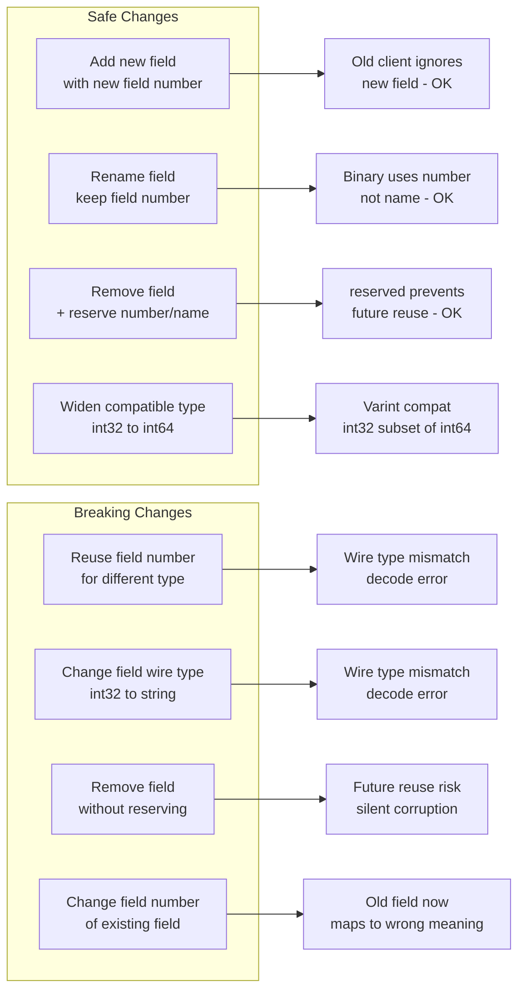

⚡ TL;DR - Protobuf backward compatibility is governed
by field numbers, not field names; the rules: NEVER
change a field number, NEVER reuse a field number (use
`reserved` instead), NEVER change a field type
incompatibly (int32 → int64 is safe, int32 → string
is not); adding new fields is always backward compatible;
removing fields requires reserving the field number;
renaming fields is safe (binary encoding uses field
numbers, not names); the service evolution challenge
is schema compatibility across independent deployment
timelines: old client + new server must work, and
new client + old server must work; gRPC's wire format
advantage is that unknown fields are silently ignored
(future compatibility), but missing required fields
in older clients will use zero values (not errors) -
which can be semantically wrong.

---

| #078 | Category: HTTP & APIs | Difficulty: ★★★★☆ |
|:---|:---|:---|
| **Depends on:** | gRPC vs REST Performance, API Deprecation, gRPC Protocol Internals | |
| **Used by:** | Event-Driven APIs | |
| **Related:** | gRPC vs REST, API Versioning, Deprecation, Event-Driven APIs, gRPC Protocol Internals | |

---

### 🔥 The Problem This Solves

**WORLD WITHOUT IT:**
gRPC service has `OrderItem` message with fields:
`product_id (1)`, `quantity (2)`, `unit_price (3)`.
A developer renames field 2 from `quantity` to `count`
and reuses field number 3 for a new `currency` string
field (previously `unit_price` was an int32). Multiple
old clients still running. Result: old clients
(still using Protobuf compiled before the change)
receive field 2 as `count` but decode it as `quantity`
(works - name is irrelevant in binary), but field 3
is now a string `currency` while old clients expect
an int32 `unit_price`. Binary decoding: the wire type
for string (2 = length-delimited) vs int32 (0 = varint)
is different. Proto decoding error or data corruption.
This is the field number reuse failure.

---

### 📘 Textbook Definition

**Protocol Buffers (Protobuf) wire format:**
Binary encoding where each field is represented as:
`(field_number << 3) | wire_type`. Field names are
not encoded - only field numbers. Wire types:
- 0: Varint (int32, int64, uint32, uint64, bool, enum)
- 1: 64-bit (fixed64, sfixed64, double)
- 2: Length-delimited (string, bytes, embedded messages, repeated)
- 5: 32-bit (fixed32, sfixed32, float)

**Backward compatibility:** old code can read messages
written by new code. Unknown fields (fields added in
new schema but not present in old schema) are preserved
in memory and re-serialized (proto3 default behavior).

**Forward compatibility:** new code can read messages
written by old code. Missing fields take default values
(0 for numbers, empty string for strings, false for
bool, empty list for repeated). There are no optional
vs required fields in proto3 - all fields are optional
by default.

**Breaking change:** a schema change that causes a
decode error or silent data corruption in a client
compiled against the previous schema.

---

### ⏱️ Understand It in 30 Seconds

**One line:**
Protobuf encodes field numbers (not names) in binary,
so field names can change freely; but field numbers
are permanent - never change them, never reuse them.

**One analogy:**
> Protobuf field numbers are like database column IDs
> in a schema-less binary format. Imagine a table where
> columns are stored as (column_id, value) pairs instead
> of (column_name, value). If you rename a column
> (change the display name but keep the column ID):
> all existing data is still readable. If you reuse
> a column ID for a different data type: old readers
> try to decode the new data with the old schema -
> corruption. Field numbers are permanent contracts.
> Field names are documentation.

---

### 🔩 First Principles Explanation

**The compatibility matrix:**

```
SCENARIO: Service A (server) and Service B (client)
  deployed independently. At any moment:
  - Old Service B (v1 client) may be talking to new Service A (v2 server)
  - New Service B (v2 client) may be talking to old Service A (v1 server)
  Both must work.

PROTO V1 (both deployed):
  message Order {
    string order_id = 1;
    int32 total_cents = 2;
    string status = 3;
  }

PROTO V2 (server updated, client still v1):
  message Order {
    string order_id = 1;
    int32 total_cents = 2;
    string status = 3;
    string currency = 4;       // NEW: v1 client ignores this
    int32 discount_cents = 5;  // NEW: v1 client ignores this
  }
  → V1 client reads v2 response:
    - Fields 1, 2, 3: decoded normally
    - Fields 4, 5: unknown, silently ignored (not an error)
    → BACKWARD COMPATIBLE

PROTO V2 (client updated, server still v1):
  V2 client sends Order with currency = "USD" (field 4)
  V1 server receives it:
    - Fields 1, 2, 3: decoded normally
    - Field 4: unknown, silently ignored
    → FORWARD COMPATIBLE (v1 server ignores currency field)
  BUT: v2 client may now REQUIRE currency (business logic).
    v1 server response has no field 4 → currency = "" (empty).
    Is empty string a valid currency? If yes: OK.
    If no: the client must handle missing currency gracefully.
    This is a semantic compatibility issue, not a wire format issue.
```

---

### 🧪 Thought Experiment

**SCENARIO: Required vs optional semantics in proto3**

```
Proto3 eliminated the required keyword.
All fields are optional (have zero/empty default values).

This sounds dangerous but is intentional.

PROTO2 (has required):
  message Order {
    required string order_id = 1;  // Decode fails if missing
  }
  Problem: If you add a required field in v2, all old
    messages (serialized without this field) FAIL to decode.
    Required fields in proto2 are the #1 backward compatibility
    problem. Every proto2 deployment has a "never use required"
    rule.

PROTO3 (all optional):
  message Order {
    string order_id = 1;  // Missing = empty string
    int32 total = 2;      // Missing = 0
    bool processed = 3;   // Missing = false
  }
  New server adds field 4. Old client reads it: field 4 is
    absent → default value. No decode error.
  But: is total = 0 a valid order? Is processed = false
    correct for an unset field vs actually false?

PROTO3 + OPTIONAL keyword (proto3 optional):
  message Order {
    optional string order_id = 1;  // Proto3 optional:
    // hasField() returns true if field was explicitly set.
    // Missing field vs field set to empty string now distinguishable.
    // Use this for fields where "not set" has different semantics
    // than "set to empty/zero".
  }
```

---

### 🧠 Mental Model / Analogy

> Think of Protobuf schema evolution like a database
> migration with an active production system. Rules for
> safe database column changes with zero downtime:
> - Add new columns (nullable by default): always safe.
>   Old queries ignore the new column.
> - Rename a column: NOT safe directly (queries using
>   old name break). Must: add new column, populate,
>   update all readers, then drop old column (multi-step).
> - Change column type (int → string): NOT safe directly.
>   Multi-step process.
> - Drop a column: drop readers first, then drop column.
>
> Protobuf has a similar pattern but with an important
> advantage: renaming the proto field name is safe
> (binary uses field numbers, not names). The only
> operations that require multi-step care:
> removing a field (reserve the field number to prevent
> reuse) and changing a field type (requires a new field
> number + migration period).

---

### 📶 Gradual Depth - Five Levels

**Level 1 - What it is (anyone can understand):**
Protobuf is a system for encoding data in binary.
It uses numbers (not names) to identify each field.
If you never change those numbers and only add new ones,
old and new code can communicate safely even if they
were built at different times.

**Level 2 - How to use it (junior developer):**
Three rules: (1) Never change a field number. (2) When
removing a field, mark the number as `reserved` in
the proto file so no one reuses it by accident. (3)
Adding new fields is always safe - old clients ignore
them. Never rename and reuse a field number for a
different type.

**Level 3 - How it works (mid-level engineer):**
Each proto field encodes as: `(field_number << 3) | wire_type`.
A string field (wire type 2) and an int32 field (wire type 0)
have different wire type bits in their tag. If you change
field 3 from int32 to string: the wire type in the binary
changes from 0 to 2. A decoder compiled against the old
schema tries to read field 3 as a varint (wire type 0) but
the binary contains a length-delimited string (wire type 2).
Protocol error: unexpected wire type. This is why changing
field types is a breaking change.

**Level 4 - Why it was designed this way (senior/staff):**
Protobuf's schema-driven binary format trades human readability
for: (1) size (no field names in binary = 3-10× smaller
than JSON), (2) type safety (field types are in the schema,
not encoded in each message), (3) schema evolution (unknown
fields are preserved). The alternative: self-describing formats
(JSON, MessagePack) encode field names in every message.
Self-describing formats allow field renames without breakage
(both old and new name are just strings). But they pay a
size cost for every message. Protobuf's design: pay the
schema distribution cost once (all services share the .proto
file via a proto registry), save size on every message.

**Level 5 - Mastery (distinguished engineer):**
Proto registry and schema management at scale. Google's
approach: a central proto registry (similar to a schema
registry for Avro). All .proto files are committed to
a monorepo. Generated code (stubs) is generated centrally
and checked in. When a .proto changes: generated code is
regenerated for all languages. All services are compiled
against the same stubs. In a microservice (polyrepo)
architecture: the proto file is either vendored (copied
into each service repo) or retrieved from a registry
at build time. Tools: Buf (proto linting + compatibility
checks + schema registry), protoc (proto compiler),
grpc-gateway (generate REST from proto), protovalidate
(field validation rules in proto).

---

### ⚙️ How It Works (Mechanism)

**Safe schema evolution examples:**

```protobuf
// V1 proto - both client and server use this
syntax = "proto3";

message OrderItem {
  string product_id = 1;    // Field number 1: PERMANENT
  int32 quantity = 2;       // Field number 2: PERMANENT
  int32 unit_price_cents = 3;  // Field number 3: PERMANENT
}

// V2 proto - adding new fields (SAFE)
message OrderItem {
  string product_id = 1;    // UNCHANGED - field number preserved
  int32 quantity = 2;       // UNCHANGED - field number preserved
  int32 unit_price_cents = 3;  // UNCHANGED
  string currency = 4;     // NEW: old clients ignore this → OK
  string sku = 5;           // NEW: old clients ignore this → OK
}

// V3 proto - removing a field (SAFE if done correctly)
message OrderItem {
  string product_id = 1;
  int32 quantity = 2;
  // unit_price_cents removed - but field number 3 is RESERVED
  reserved 3;                      // Never reuse field number 3
  reserved "unit_price_cents";    // Never reuse the field name
  string currency = 4;
  string sku = 5;
  int64 unit_price_millicents = 6; // New field: wider type
}
```

**Breaking changes (NEVER do these):**

```protobuf
// BREAKING: Change a field type
message OrderItem {
  string product_id = 1;
  // BAD: changed from int32 to string
  // Old client encoded int32 varint; new server tries to
  // read length-delimited string → wire type mismatch
  string quantity = 2;  // WAS: int32 quantity = 2; BREAKING!
}

// BREAKING: Reuse a field number
message OrderItem {
  string product_id = 1;
  // BAD: field 2 was quantity (int32), now discount (float)
  // Old client: decodes field 2 as int32 (varint wire type)
  // New message: encodes field 2 as float (32-bit wire type)
  // Wire type mismatch → decode error or data corruption
  float discount_percent = 2;  // WAS: int32 quantity = 2; BREAKING!
}

// BREAKING: Remove a field without reserving it
message OrderItem {
  string product_id = 1;
  // quantity field 2 removed without reservation
  // Someone adds a new field and reuses field number 2:
  string notes = 2;  // Reuses field 2! Old clients decode as quantity
  int32 unit_price_cents = 3;
}
```

**Service evolution with API versioning:**

```protobuf
// When breaking change is unavoidable: new service version
// Keep old service running during migration period

// orders/v1/orders.proto
syntax = "proto3";
package orders.v1;

service OrderService {
  rpc GetOrder(GetOrderRequest) returns (Order);
}

message Order {
  string order_id = 1;
  int32 total_cents = 2;  // int32 - v1 field
}

// orders/v2/orders.proto
syntax = "proto3";
package orders.v2;

service OrderService {
  rpc GetOrder(GetOrderRequest) returns (Order);
}

message Order {
  string order_id = 1;
  int64 total_cents = 2;  // int64 - v2 field (breaking: type change)
  string currency = 3;   // NEW: required in v2
}
```

```python
# gRPC server supporting both v1 and v2 during migration
from concurrent import futures
import grpc
from orders.v1 import orders_pb2_grpc as v1_servicer
from orders.v2 import orders_pb2_grpc as v2_servicer

class OrderServiceV1(v1_servicer.OrderServiceServicer):
    async def GetOrder(self, request, context):
        order = await fetch_order(request.order_id)
        return orders_v1_pb2.Order(
            order_id=order.order_id,
            total_cents=int(order.total_cents),  # int32 for v1
        )

class OrderServiceV2(v2_servicer.OrderServiceServicer):
    async def GetOrder(self, request, context):
        order = await fetch_order(request.order_id)
        return orders_v2_pb2.Order(
            order_id=order.order_id,
            total_cents=order.total_cents,  # int64 for v2
            currency=order.currency,
        )

def serve():
    server = grpc.server(futures.ThreadPoolExecutor(max_workers=10))
    # Register both v1 and v2 service implementations
    v1_servicer.add_OrderServiceServicer_to_server(
        OrderServiceV1(), server
    )
    v2_servicer.add_OrderServiceServicer_to_server(
        OrderServiceV2(), server
    )
    server.add_insecure_port("[::]:50051")
    server.start()
    server.wait_for_termination()
```



---

### 🔄 The Complete Picture - End-to-End Flow

**Buf schema registry (enforcing compatibility in CI):**

```yaml
# buf.yaml - proto linting and breaking change config
version: v2
modules:
  - path: proto
breaking:
  use:
    - FILE   # Detect file-level breaking changes
  against:
    # Compare against last committed version
    git_ref: HEAD~1

# buf.yaml lint rules:
lint:
  use:
    - DEFAULT
  except:
    - PACKAGE_DIRECTORY_MATCH  # if needed
```

```bash
# CI breaking change check
buf breaking --against .git#branch=main

# Output for a breaking change:
# proto/orders/v1/orders.proto:12:3:
#   Field "5" on message "Order" changed type from
#   "TYPE_INT32" to "TYPE_STRING".
# buf: 1 error
# → CI fails, PR blocked
```

---

### 💻 Code Example

**Example 1 - BAD: Proto field number reuse after field removal**

```protobuf
// V1 proto
message ShippingAddress {
  string street = 1;
  string city = 2;
  string state = 3;
  string zip_code = 4;    // field 4: string (wire type 2)
}

// BAD V2 proto: zip_code removed, field number 4 reused
message ShippingAddress {
  string street = 1;
  string city = 2;
  string state = 3;
  // zip_code removed (NOT reserved - mistake!)
  int32 zip_plus_four = 4; // REUSED field 4 for different type!
  // Old client decodes field 4 as string (zip_code).
  // New binary encodes field 4 as int32 (varint, wire type 0).
  // Wire type mismatch: decode error or garbage data.
}

// GOOD V2 proto: reserve removed fields
message ShippingAddress {
  string street = 1;
  string city = 2;
  string state = 3;
  reserved 4;                // zip_code field number: NEVER reuse
  reserved "zip_code";      // zip_code field name: NEVER reuse
  string postal_code = 5;   // New field for the replacement
  int32 zip_plus_four = 6;  // New field with NEW number
}
```

---

### ⚖️ Comparison Table

| Change Type | Wire Compatible | Semantic Safe | Action Required |
|:---|:---|:---|:---|
| Add new field (new number) | Yes | Usually | Handle zero-default in old client |
| Rename field (keep number) | Yes | Yes | Update proto file, regenerate stubs |
| Remove field (with `reserved`) | Yes | Yes | Reserve number AND name |
| Remove field (without `reserved`) | Yes (now) | No (future risk) | ALWAYS reserve |
| Change field type (compatible) | int32→int64: Yes | Yes | Check semantics |
| Change field type (incompatible) | int32→string: No | No | New field number required |
| Change field number | No | No | NEVER do this |
| Reuse field number (same type) | Usually | No | NEVER do this |
| Reuse field number (diff type) | No | No | NEVER do this |

---

### ⚠️ Common Misconceptions

| Misconception | Reality |
|:---|:---|
| int32 → int64 is a breaking change | For Protobuf: int32 and int64 use the same wire type (varint, type 0). An old int32 field can decode a value encoded as int64 (truncated to 32 bits if value > 2^31). An old int64 field can decode a value encoded as int32 (zero-extended). Wire-compatible. But: if old clients have int32 fields and the new server sends values > 2^31, the old client will overflow. Semantic breaking change (not wire), but not a decode error. Recommendation: if you need to extend to int64, add a new field rather than changing the type. |
| Renaming a proto field breaks backward compatibility | Field names are not encoded in the binary wire format. Renaming `quantity` to `count` in the .proto file does not change the binary encoding one bit. Old clients (compiled against old proto with `quantity`) and new clients (compiled against new proto with `count`) serialize/deserialize identically. The name change is visible only in generated code (the Go/Python/Java field name changes). Only impact: all code using the generated field accessor must be updated. But wire compatibility is maintained. |
| Proto3 optional means the same thing as proto2 optional | In proto2, optional was the default (vs required). In proto3, the `optional` keyword was removed and later re-added with different semantics. In proto3, `optional string name = 1;` creates a field with a "has" presence marker: `has_name()` returns true only if the field was explicitly set (even if set to empty string). Without the optional keyword, `string name = 1;` has no presence: you cannot distinguish "not set" from "set to empty string." Use `optional` in proto3 when the distinction between "not set" and "default value" is semantically meaningful. |

---

### 🚨 Failure Modes & Diagnosis

**Silent data corruption from field number reuse**

**Symptom:** After a proto schema change, some fields
in received messages contain unexpected values. No
decode errors. Data is wrong but not obviously so.
For example: `quantity` field returns 0 for some
messages but correct values for others.

**Root Cause:** Field number was reused for a different
field with a compatible wire type. Old binary data
(in logs, databases, message queues) was encoded with
the old field meaning. New client decodes old data
with new schema: same field number, same wire type,
different semantic meaning.

**Diagnosis:**
```bash
# Check proto history for field number changes
git log -p proto/orders/v1/orders.proto | \
  grep "^[-+].*= [0-9]*;"

# Look for a field number appearing on both a removed line
# and an added line with different field names:
# -  int32 quantity = 2;
# +  string category = 2;   ← REUSE: different name, SAME number

# Check if reserved was added when field was removed:
# grep "reserved 2" proto/orders/v1/orders.proto
# → If no output: reserved was never added → reuse was possible
```

**Fix (immediate):**
1. Add `reserved 2; reserved "quantity";` to the proto file
2. Change reused field 2 to a new field number (e.g., 7)
3. Regenate all stubs and redeploy
4. Any messages in transit/storage with old encoding
   must be reprocessed or discarded

---

### 🔗 Related Keywords

**Prerequisites (understand these first):**
- `gRPC vs REST Performance at Scale` - why gRPC / Protobuf
- `gRPC Design Rationale and Protocol Internals` - wire format depth

**Builds On This (learn these next):**
- `Event-Driven APIs` - Protobuf schema registries in Kafka
- `API Versioning at Scale` - versioning strategies for gRPC

---

### 📌 Quick Reference Card

```
┌──────────────────────────────────────────────────────────┐
│ SAFE         │ Add field (new number), rename field,     │
│              │ remove + reserve, compatible type widen   │
├──────────────┼───────────────────────────────────────────┤
│ BREAKING     │ Reuse field number, change type (diff wire│
│              │ type), change field number of existing    │
├──────────────┼───────────────────────────────────────────┤
│ Reserved     │ reserved 3;             - number         │
│              │ reserved "field_name";  - name           │
│              │ Both in same statement or separate        │
├──────────────┼───────────────────────────────────────────┤
│ Wire types   │ 0=varint (int32,64,bool,enum)            │
│              │ 1=64-bit (double,fixed64)                 │
│              │ 2=length-delim (string,bytes,message)    │
│              │ 5=32-bit (float,fixed32)                  │
├──────────────┼───────────────────────────────────────────┤
│ Tooling      │ buf breaking: CI breaking change check   │
│              │ buf lint: style guide enforcement        │
├──────────────┼───────────────────────────────────────────┤
│ ONE-LINER    │ "Field numbers are permanent contracts.   │
│              │  Names are documentation."               │
└──────────────────────────────────────────────────────────┘
```

**If you remember only 3 things:**
1. Field numbers are permanent. Never change them.
   Never reuse them. When removing a field: always add
   `reserved <number>;` and `reserved "<name>";`.
2. Binary wire format encodes field numbers and wire types,
   not field names. Renaming a field is safe. Changing
   a field's type is dangerous (wire type may change).
3. Use `buf breaking` in CI to catch proto breaking changes
   before they reach production. Wire compatibility
   is enforced by the compiler but semantic compatibility
   requires human review.

---

### 💎 Transferable Wisdom

**Reusable Engineering Principle:**
"In any schema system, identifiers used in the wire
format are permanent contracts; names used only in
code are implementation details." This principle applies
to: Protobuf field numbers (permanent), Avro schema
IDs in schema registry (permanent, encoded in Kafka
message header), database column OIDs in PostgreSQL
(not permanent - different from column names), JSON
field names (the name IS the identifier - renaming is
breaking). The pattern: when designing a binary or
compact schema format, assign opaque IDs (numbers) to
fields so that names can evolve without breaking the
wire format. This is the core design decision of Protobuf,
Avro, and Apache Thrift. JSON/YAML/XML use human-readable
names as identifiers: simple but expensive (names
repeated in every message, renames are breaking).

**Where else this pattern applies:**
- Avro schema evolution: schema is registered by ID in
  Confluent Schema Registry, backward/forward compatibility
  enforced by registry
- Apache Thrift: field IDs (like proto field numbers),
  same evolution rules
- Cap'n Proto: pointer-based evolution (even more flexible
  than Protobuf - zero-copy deserialization)
- FlatBuffers: table fields accessed by vtable offset,
  deprecated fields kept for backward compat

---

### 💡 The Surprising Truth

Proto3's removal of the `required` field type was one
of the most important backward-compatibility decisions
in Protobuf's history - and it is also one of the most
misunderstood. The common reaction: "No required fields?
How do I validate that a message has all the fields
it needs?" The answer: proto validation is not Protobuf's
job. Protobuf is a serialization format; field presence
validation is application logic. The proto3 approach:
every field is optional at the wire level, application
code validates business rules. But this exposes a subtle
failure mode: a missing required field defaults to 0/empty.
If a downstream service receives `total_cents = 0` when
the field was simply not set (old client that did not
know about this field), it might process a zero-value
order. The fix: proto3 `optional` keyword (presence
marker, proto3.14+) or explicit sentinel values in your
business logic ("total_cents = -1 means not set"). The
proto3 design is correct for schema evolution but it
requires application-layer validation to prevent silent
zero-value business logic errors. Teams that learn this
lesson only after a production incident where an order
was processed with `total_cents = 0` remember it forever.

---

### ✅ Mastery Checklist

**You've mastered this when you can:**
1. **IDENTIFY** All breaking proto changes in a diff
   (field number changes, type changes, field number reuse).
2. **WRITE** A proto3 message with correct `reserved`
   declarations for removed fields.
3. **EXPLAIN** The wire type system: why int32→string is
   breaking but int32→int64 may be wire-compatible.
4. **CONFIGURE** `buf breaking` in CI/CD to block breaking
   proto changes on pull requests.
5. **DESIGN** A gRPC service evolution strategy for a
   breaking change: new package version, parallel
   deployment, migration window, old version sunset.

---

### 🎯 Interview Deep-Dive

**Q1: What makes a Protobuf schema change backward
compatible?**

*Why they ask:* Tests gRPC/Protobuf internals depth.

*Strong answer includes:*
- Core rule: field numbers are permanent and map to wire
  encoding. Binary format: `(field_number << 3) | wire_type`.
  Names are not encoded - only used in generated code.
- Safe changes: (1) Add new fields with new field numbers.
  Old clients ignore unknown fields. (2) Rename fields (names
  not in binary). (3) Remove fields IF you reserve the field
  number and name. (4) Widen compatible types (int32→int64:
  both use varint wire type 0).
- Breaking changes: (1) Change a field's wire type (int32→string:
  wire type changes from 0 to 2 → decode error on old client).
  (2) Reuse a field number for a different type. (3) Change a
  field number.
- Proto3 unknown fields: proto3 preserves unknown fields
  in memory and re-serializes them. This means a message
  routed through a v1 proxy service (that does not know
  about v2 fields) does not drop those fields. Important
  for passthrough services.
- Proto3 zero defaults: missing fields default to 0/empty.
  Cannot distinguish "not set" from "set to zero" without
  `optional` keyword (proto3 presence). Business logic must
  account for this.

**Q2: How would you handle a required breaking change in
a gRPC service used by 20 internal teams?**

*Why they ask:* Tests real-world service evolution strategy.

*Strong answer includes:*
- Package versioning: create `orders/v2` proto package alongside
  `orders/v1`. Implement both in the same server initially.
  Both v1 and v2 endpoint respond correctly.
- Migration window: communicate 3-month migration window
  (internal APIs). Provide v2 client stubs and migration guide.
  Track which teams are still on v1 via API Gateway metrics
  or gRPC interceptor logging.
- Dual implementation during migration: the v1 handler calls
  the same underlying business logic as v2, translates response
  to v1 schema. Single source of truth for business logic.
- Sunset v1: after migration window, confirm zero v1 traffic
  via metrics. Add UNIMPLEMENTED gRPC status to v1 methods
  (gRPC equivalent of 410 Gone) with error message directing
  to v2 proto.
- Tools: buf schema registry for proto storage + compatibility
  checks. Buf's breaking change detection in CI blocks
  incompatible changes to the same version's proto file.
