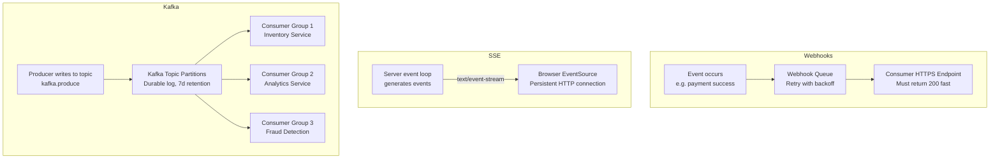

⚡ TL;DR - Event-driven APIs push data to consumers
when events occur, rather than requiring consumers to
poll; three primary mechanisms: Webhooks (HTTP POST
from server to consumer endpoint when event happens -
simple, fire-and-forget, consumer needs a public URL),
SSE (Server-Sent Events - persistent HTTP connection,
server pushes text events, browser-native, one-way),
Kafka (persistent event log, consumer groups, ordered
partitions, replay capability, high throughput -
but operational overhead); choose webhooks for simple
third-party integrations (GitHub, Stripe, Twilio use
webhooks for their public APIs), SSE for browser
real-time updates (notifications, progress bars, live
dashboards), Kafka for internal event-driven architecture
(high volume, replay, fan-out to many consumers);
the fatal webhook mistake: not returning HTTP 200 within
5 seconds (provider retries, your endpoint gets flooded
with duplicate events).

---

| #079 | Category: HTTP & APIs | Difficulty: ★★★★☆ |
|:---|:---|:---|
| **Depends on:** | HTTP Caching, WebSocket, gRPC Service Evolution | |
| **Used by:** | HTTP Specification - Roy Fielding REST Dissertation | |
| **Related:** | HTTP Caching, WebSocket Protocol, gRPC Evolution, REST Spec, HTTP/2 | |

---

### 🔥 The Problem This Solves

**WORLD WITHOUT IT:**
E-commerce platform needs to notify third-party fulfillment
partners when an order is placed. Request-response approach:
fulfillment partner polls `GET /new-orders?since=<timestamp>`
every 30 seconds. 10,000 fulfillment partners × 2 requests/minute
= 20,000 requests/minute on the orders API just for polling.
Most responses: empty (no new orders). 90% wasted requests.
Average delivery latency: 15 seconds (half the polling interval).
Peak orders: polling rate must increase or latency degrades.
This is the polling tax - the overhead of simulating push
with pull.

---

### 📘 Textbook Definition

**Webhook:**
HTTP callback: consumer registers a URL; the event source
(producer) makes an HTTP POST request to that URL when
an event occurs. Consumer endpoint must: respond quickly
(< 5 seconds), return HTTP 200 to acknowledge. Producer
retries on non-200 responses (retry with exponential
backoff). At-least-once delivery: consumer must be
idempotent (same event may be delivered multiple times).

**Server-Sent Events (SSE):**
HTTP/1.1 persistent connection where server sends events
as a stream of text. Protocol: `Content-Type: text/event-stream`.
Event format: `data: <payload>\n\n`. Browser-native
(`EventSource` API). One-way: server to browser only.
Reconnects automatically on disconnect (`Last-Event-ID`
header for resume). Not suitable for very high frequency
events (connection per consumer).

**Apache Kafka (as event-driven API):**
Distributed commit log: producers write events to topics
(partitioned logs). Consumers read events at their own
pace (offset-based). Events are retained for configurable
duration (default 7 days) - consumers can replay.
Consumer groups: multiple consumers share a partition
(parallel processing). High throughput: 100k-1M+ events/sec.
Kafka as an external API: AsyncAPI spec describes the
topics, event schemas, and consumer patterns.

**AsyncAPI Specification:**
OpenAPI equivalent for event-driven APIs. Describes:
channels (topics, queues), message schemas, bindings
(Kafka, AMQP, WebSocket, HTTP SSE). Enables documentation
and code generation for async APIs.

---

### ⏱️ Understand It in 30 Seconds

**One line:**
Webhooks: server pushes events to consumer via HTTP POST;
SSE: server streams events over persistent HTTP connection;
Kafka: consumer reads events from a distributed log at
their own pace with replay capability.

**One analogy:**
> Webhooks = package delivery: someone rings your doorbell
> and hands you the package when it arrives. You need to
> be home and answer the door quickly. If you don't answer:
> they try again later.
> SSE = live radio: you tune in and the radio station broadcasts
> continuously. You hear events as they happen. You can't
> rewind. If you tune in late: you miss past events.
> Kafka = a library subscription: every book (event) is added
> to the library shelf and stays there for 7 days.
> You visit the library whenever you want and read from where
> you left off. You can read the same book multiple times.
> Multiple readers can read independently at different paces.

---

### 🔩 First Principles Explanation

**The delivery guarantee trade-off:**

```
WEBHOOKS:
  Delivery: At-least-once (producer retries on non-200)
  Ordering: Not guaranteed (retries may reorder events)
  Replay: Not available (events pushed, not stored by producer)
  Consumer URL: Consumer must have public HTTPS endpoint
  Throughput: Limited (sequential HTTP calls per consumer)
  Consumer state: Consumer tracks "what have I processed"
    via idempotency keys in event payload

SSE:
  Delivery: At-most-once (if consumer disconnects and reconnects,
    missed events between disconnect and reconnect may be lost
    unless server implements a message buffer + Last-Event-ID)
  Ordering: Ordered (single connection, sequential stream)
  Replay: Limited (only if server implements buffer; no default)
  Consumer URL: Consumer connects TO server (no public URL needed)
  Throughput: One SSE connection per consumer; manageable for
    10k browser clients, challenging for 1M+
  Consumer state: Browser EventSource handles reconnect; server
    must buffer recent events for reconnect recovery

KAFKA:
  Delivery: At-least-once (default) or exactly-once (transactions)
  Ordering: Per-partition (globally ordered within one partition)
  Replay: Yes - configurable retention (default 7 days to forever)
  Consumer URL: Consumer connects to Kafka broker (no public URL)
  Throughput: Very high (100k to millions events/sec)
  Consumer state: Consumer commits offset to Kafka;
    can reset to any past offset for replay
```

---

### 🧪 Thought Experiment

**SCENARIO: Which mechanism for which use case?**

```
Use case 1: Notify 10k third-party integrations when
  a payment is processed (public API, external developers)
  → WEBHOOKS
  - External developers have HTTP endpoints
  - At-least-once is fine (idempotent payment processing)
  - Throughput: 10k webhooks/hour is manageable
  - Simple to implement (HTTP POST)
  - Example: Stripe, GitHub, Twilio all use webhooks

Use case 2: Show a live order status timeline in browser
  ("Order placed → Packed → Shipped → Delivered")
  → SSE (Server-Sent Events)
  - Browser-native (EventSource API)
  - One-way: server pushes status updates
  - Low frequency events (4-5 per order lifetime)
  - Works over HTTP/2 (multiplexed, no separate WebSocket)
  - Reconnect handled automatically by browser EventSource

Use case 3: Payment service publishes events for
  inventory, accounting, analytics, fraud detection
  (internal, multiple consumers, high volume)
  → KAFKA
  - Multiple consumer groups (each gets all events)
  - Accounting can replay past events (month-end audit)
  - Fraud detection processes in real-time (< 1s)
  - Analytics processes in batch (every hour, larger batch)
  - Event schema in Protobuf + Confluent Schema Registry
  - High volume: 50k payments/minute at peak

Use case 4: Real-time collaborative editing (Google Docs)
  → WEBSOCKET (bidirectional needed) or CRDT + Kafka
  - SSE is one-way; collaborative editing needs bidirectional
  - WebSocket for browser bidirectional connection
  - Kafka for event log (operation log for history + replay)
```

---

### 🧠 Mental Model / Analogy

> The core distinction is pull vs push and who manages state:
> - Polling: consumer manages "when" and "how far back"
>   by including a timestamp or cursor in each request.
>   Overhead: wasted requests when no new events.
> - Webhooks: producer manages "who to push to" and "when."
>   Consumer just handles delivery. Overhead: consumer
>   needs a public HTTPS endpoint, and fast response time.
> - SSE: consumer establishes a persistent connection;
>   producer pushes to all open connections. Hybrid model:
>   consumer initiates, producer pushes. Browser-native,
>   HTTP-based, no extra protocol.
> - Kafka: consumer manages "offset" (cursor position in
>   the log). Producer writes to the log; consumer reads
>   at its own pace. The log is the buffer. Consumer can
>   be slow, fast, or offline - catches up when ready.
>
> The choice maps to: consumer type (browser vs service vs
> external partner), delivery guarantee needs, throughput,
> and replay requirements.

---

### 📶 Gradual Depth - Five Levels

**Level 1 - What it is (anyone can understand):**
Instead of your code asking a server for new data every
few seconds (polling), event-driven APIs have the server
tell your code when something new happens (push). The
three main push methods differ in how they deliver events
and how much complexity they add.

**Level 2 - How to use it (junior developer):**
Webhooks: register your HTTPS URL with the provider;
handle POST requests with HMAC signature verification;
return HTTP 200 immediately, process async. SSE: use
`EventSource` API in browser; respond with
`Content-Type: text/event-stream` from server; send
`data: {...}\n\n` events. Kafka: configure consumer
group, subscribe to topic, poll for records, process,
commit offset.

**Level 3 - How it works (mid-level engineer):**
Webhook delivery: provider queues events, delivers in
order, retries with exponential backoff on non-200
(typically up to 24 hours with 15-20 retries). Your
endpoint MUST be idempotent - same event may arrive
twice (retry after network timeout even if you processed
it). Use the event ID as an idempotency key. SSE: HTTP
keep-alive connection, `Transfer-Encoding: chunked`.
Server sends events as newline-delimited text. Browser
`EventSource` reconnects automatically with `Last-Event-ID`
header. Kafka: leader partition accepts writes;
replicated to N-1 followers. Consumer reads from
partition offset, processes records, commits offset.
Consumer group coordinator assigns partitions to
consumers; rebalances on join/leave.

**Level 4 - Why it was designed this way (senior/staff):**
The fundamental constraint that determines architecture:
consumer availability. Webhooks require consumer to be
publicly addressable (has an HTTPS endpoint). Most
enterprise B2B integrations can satisfy this. Browser
clients CANNOT receive webhooks (no public address).
SSE solves browser push: client initiates a persistent
connection, server pushes events over that connection.
For internal services: neither webhooks (internal
services are not publicly addressable by default) nor
SSE (HTTP-per-consumer overhead) scale to 100k events/sec.
Kafka solves: durable log, consumer group parallelism,
offset management, replay. Each technology is optimized
for a specific consumer profile.

**Level 5 - Mastery (distinguished engineer):**
Event-driven API design at scale requires AsyncAPI
specification governance. AsyncAPI is the event-driven
equivalent of OpenAPI: describes channels (Kafka topics,
WebSocket endpoints, SSE streams), message schemas
(JSON Schema, Avro, Protobuf), bindings (Kafka partition
key, delivery guarantees). At Confluent/Kafka scale:
schema registry + schema evolution (Avro or Protobuf
with compatibility checks). The operational challenge:
consumer lag monitoring. If a Kafka consumer group's
lag increases (consumer processing is slower than
producer publishing rate): the consumer eventually
cannot keep up. Monitoring: `kafka.consumer.records-lag-max`
per consumer group. Alert: lag > X seconds. Scale:
add consumers up to partition count. Consumer > partitions:
idle consumers (only as many active consumers as partitions).

---

### ⚙️ How It Works (Mechanism)

**Webhook server (producer + HMAC signature):**

```python
import hmac
import hashlib
import json
import time
from fastapi import FastAPI, Request, HTTPException
import httpx

app = FastAPI()

WEBHOOK_SECRET = "whsec_your_shared_secret"

# 1. PRODUCER SIDE: Send webhook to registered consumer URL
async def deliver_webhook(
    consumer_url: str,
    event_type: str,
    payload: dict,
    event_id: str,
) -> bool:
    """
    Deliver webhook with HMAC signature.
    Returns True if delivered, False if failed.
    """
    body = json.dumps(payload)
    timestamp = int(time.time())
    # Signed payload: timestamp.body
    signed_payload = f"{timestamp}.{body}"
    signature = hmac.new(
        WEBHOOK_SECRET.encode(),
        signed_payload.encode(),
        hashlib.sha256,
    ).hexdigest()

    headers = {
        "Content-Type": "application/json",
        "X-Event-ID": event_id,
        "X-Event-Type": event_type,
        "X-Timestamp": str(timestamp),
        "X-Signature": f"sha256={signature}",
    }
    async with httpx.AsyncClient(timeout=10.0) as client:
        try:
            resp = await client.post(
                consumer_url, content=body, headers=headers
            )
            return resp.status_code == 200
        except (httpx.TimeoutException, httpx.RequestError):
            return False

# 2. CONSUMER SIDE: Verify HMAC signature + process
@app.post("/webhooks/orders")
async def receive_order_webhook(request: Request):
    """
    Webhook receiver: verify signature, acknowledge fast,
    process async.
    """
    body = await request.body()
    timestamp = request.headers.get("X-Timestamp", "")
    received_sig = request.headers.get("X-Signature", "")

    # Verify signature (prevents forged events)
    signed_payload = f"{timestamp}.{body.decode()}"
    expected_sig = "sha256=" + hmac.new(
        WEBHOOK_SECRET.encode(),
        signed_payload.encode(),
        hashlib.sha256,
    ).hexdigest()
    if not hmac.compare_digest(received_sig, expected_sig):
        raise HTTPException(status_code=401, detail="Invalid signature")

    # Verify timestamp freshness (replay attack prevention)
    if abs(int(time.time()) - int(timestamp)) > 300:  # 5 min
        raise HTTPException(status_code=401, detail="Stale timestamp")

    event_id = request.headers.get("X-Event-ID")
    payload = json.loads(body)

    # CRITICAL: Acknowledge immediately, process async
    # Do NOT process inline - providers time out in 5-30s
    await queue_for_processing(event_id, payload)
    return {"status": "acknowledged"}  # HTTP 200
```

**SSE server (FastAPI):**

```python
from fastapi import FastAPI
from fastapi.responses import StreamingResponse
import asyncio
import json

app = FastAPI()

@app.get("/orders/{order_id}/status-stream")
async def order_status_stream(order_id: str):
    """
    SSE stream: push order status updates to browser.
    Browser uses: const src = new EventSource('/orders/123/status-stream')
    """
    async def event_generator():
        last_status = None
        while True:
            status = await fetch_order_status(order_id)
            if status != last_status:
                last_status = status
                event_data = json.dumps({
                    "order_id": order_id,
                    "status": status,
                })
                # SSE format: data: {payload}\n\n
                yield f"data: {event_data}\n\n"
                if status in ("delivered", "cancelled"):
                    break  # Terminal state: close stream
            await asyncio.sleep(2)  # Check every 2s

    return StreamingResponse(
        event_generator(),
        media_type="text/event-stream",
        headers={
            "Cache-Control": "no-cache",
            "Connection": "keep-alive",
            "X-Accel-Buffering": "no",  # Disable Nginx buffering
        },
    )
```

**Kafka consumer (Python confluent-kafka):**

```python
from confluent_kafka import Consumer, KafkaException
import json

def create_consumer(group_id: str) -> Consumer:
    return Consumer({
        "bootstrap.servers": "kafka:9092",
        "group.id": group_id,
        "auto.offset.reset": "earliest",
        "enable.auto.commit": False,  # Manual commit: only after processing
    })

def process_order_events():
    consumer = create_consumer("order-processor-group")
    consumer.subscribe(["order-events"])

    try:
        while True:
            msg = consumer.poll(timeout=1.0)
            if msg is None:
                continue
            if msg.error():
                raise KafkaException(msg.error())

            event = json.loads(msg.value())
            event_type = event.get("type")

            if event_type == "order.placed":
                process_order(event["data"])
            elif event_type == "order.cancelled":
                handle_cancellation(event["data"])

            # Commit AFTER successful processing
            # If processing fails: do not commit → retry on restart
            consumer.commit(msg)

    except KeyboardInterrupt:
        pass
    finally:
        consumer.close()
```



---

### 🔄 The Complete Picture - End-to-End Flow

**Webhook retry logic (producer side):**

```python
import asyncio
from enum import Enum

class DeliveryStatus(Enum):
    PENDING = "pending"
    DELIVERED = "delivered"
    FAILED = "failed"

async def deliver_with_retry(
    event_id: str,
    consumer_url: str,
    payload: dict,
    max_retries: int = 20,
) -> DeliveryStatus:
    """
    Exponential backoff retry for webhook delivery.
    Matches Stripe's retry schedule approximately.
    """
    delays = [
        0, 5, 30, 120, 600, 1800, 3600, 7200, 14400,
        # ... up to 24 hours total
    ]
    for attempt, delay in enumerate(delays[:max_retries]):
        if delay > 0:
            await asyncio.sleep(delay)
        success = await deliver_webhook(
            consumer_url, "order.placed", payload, event_id
        )
        if success:
            return DeliveryStatus.DELIVERED
        # Log the failure, continue to next attempt
    return DeliveryStatus.FAILED
```

---

### 💻 Code Example

**Example 1 - BAD: Webhook endpoint does slow processing inline**

```python
# BAD: Process webhook inline - times out for provider
@app.post("/webhooks/payment")
async def payment_webhook_bad(request: Request):
    payload = await request.json()
    order_id = payload["data"]["object"]["metadata"]["order_id"]

    # This takes 2-10 seconds:
    await update_order_status(order_id, "paid")
    await send_confirmation_email(order_id)
    await notify_fulfillment_partner(order_id)

    # Stripe times out after 30s. If update_order_status
    # takes 10s + email 5s + notify 8s = 23s total.
    # Stripe may consider this a failure and retry.
    # Your endpoint processes the same event twice.
    return {"status": "ok"}

# GOOD: Acknowledge immediately, process async
from celery import Celery

celery_app = Celery(broker="redis://redis:6379/0")

@app.post("/webhooks/payment")
async def payment_webhook_good(request: Request):
    payload = await request.json()
    event_id = request.headers.get("Stripe-Signature", "")

    # Verify signature first (fast, < 1ms)
    verify_stripe_signature(payload, event_id)

    # Enqueue for async processing (fast, < 5ms)
    celery_app.send_task(
        "tasks.process_payment_event",
        args=[payload],
        task_id=payload["id"],  # Idempotency key
    )
    # Return 200 in < 100ms total
    return {"status": "acknowledged"}
```

---

### ⚖️ Comparison Table

| Dimension | Webhooks | SSE | Kafka |
|:---|:---|:---|:---|
| **Consumer type** | External services, partners | Browser, HTTP clients | Internal services |
| **Consumer URL** | Consumer needs public HTTPS URL | Consumer initiates connection | Consumer connects to Kafka broker |
| **Throughput** | Medium (sequential HTTP/consumer) | Medium (one conn/consumer) | Very high (100k+/sec) |
| **Ordering** | Not guaranteed | Ordered (per connection) | Ordered per partition |
| **Replay** | Not available | Very limited (buffer only) | Yes (configurable retention) |
| **Delivery guarantee** | At-least-once (retries) | At-most-once (no default buffer) | At-least-once or exactly-once |
| **Fan-out** | One consumer per webhook | One SSE conn = one consumer | Consumer groups (N groups = N independent consumers) |
| **Operational complexity** | Low | Low | High (Kafka cluster management) |
| **Use cases** | GitHub, Stripe, Twilio (public API event push) | Live dashboards, progress bars | Internal event bus, CQRS, event sourcing |

---

### ⚠️ Common Misconceptions

| Misconception | Reality |
|:---|:---|
| WebSocket is always better than SSE | WebSocket requires a protocol upgrade and bidirectional connection. For server-to-browser push only (notifications, status updates), SSE is simpler: it is plain HTTP/1.1 or HTTP/2, no upgrade required, works through all HTTP proxies, and the browser `EventSource` API handles reconnect automatically. WebSocket is only needed when bidirectional communication is required (chat, real-time collaboration). For read-only dashboards and notification feeds: SSE is simpler and equally capable. |
| Webhooks guarantee exactly-once delivery | Webhooks guarantee at-least-once. Exactly-once is impossible without consumer coordination. Scenario: provider delivers webhook, consumer processes it (takes 8 seconds), network timeout occurs before consumer returns 200. Provider marks it as failed, retries. Consumer processes it a second time. Consumer MUST be idempotent: use the event ID from the payload as an idempotency key, check if already processed before processing. `event_id` in a `processed_events` table with a unique constraint. |
| Kafka is too complex for small teams | Kafka in managed form (Confluent Cloud, AWS MSK, Upstash Kafka) has near-zero operational overhead. The choice between Kafka and webhooks/SSE is about consumer profile, not team size. If you have multiple internal services consuming the same events (fan-out), need replay, and have > 10k events/hour: Kafka (managed) is the right tool regardless of team size. The complexity argument applied to unmanaged Kafka (self-hosted ZooKeeper + Kafka cluster) - that is a legitimate complexity concern for small teams. |

---

### 🚨 Failure Modes & Diagnosis

**Webhook flood from retry storm**

**Symptom:** API endpoint receives 10× normal traffic.
All requests are from one provider (Stripe, GitHub, etc.).
Response time increases > 5 seconds for some requests.
Provider detects timeouts, retries more aggressively.
Feedback loop: more retries → slower responses → more retries.

**Root Cause:** Webhook endpoint does slow processing
inline. Under load, processing exceeds provider timeout.
Provider retries. Duplicate processing plus overload.

**Diagnosis:**
```bash
# Check endpoint response time distribution
# In observability platform (Datadog/Grafana):
# histogram_quantile(0.99, rate(http_request_duration_seconds[5m]))
# Filter by: endpoint="/webhooks/payment"

# Check retry headers from provider:
# Stripe: X-Stripe-Delivery-Attempt (> 1 means retry)
# GitHub: X-GitHub-Delivery (unique ID, check if same ID seen twice)

# Check async queue depth:
# Redis/Celery: celery inspect active
# If queue depth growing: worker is too slow
```

**Fix:**
1. Acknowledge webhook in < 200ms: queue for async processing.
2. Scale async workers to match incoming rate.
3. Implement idempotency check: skip duplicate event_ids.

---

### 🔗 Related Keywords

**Prerequisites (understand these first):**
- `HTTP Caching and ETags` - HTTP fundamentals
- `WebSocket Protocol Internals` - bidirectional comparison

**Builds On This (learn these next):**
- `HTTP Specification - Roy Fielding REST Dissertation` - push vs pull design
- `WebSocket Protocol Internals` - bidirectional alternative

---

### 📌 Quick Reference Card

```
┌──────────────────────────────────────────────────────────┐
│ Webhooks     │ External push. POST to consumer URL.      │
│              │ At-least-once. Consumer needs public URL. │
│              │ Consumer must be idempotent. < 5s ack.    │
├──────────────┼───────────────────────────────────────────┤
│ SSE          │ Browser push. text/event-stream.           │
│              │ EventSource API. One-way. Auto-reconnect.  │
│              │ Ordered. No replay by default.             │
├──────────────┼───────────────────────────────────────────┤
│ Kafka        │ Internal bus. Consumer groups.             │
│              │ Per-partition ordering. Replay. High       │
│              │ throughput. Offset-based consumption.      │
├──────────────┼───────────────────────────────────────────┤
│ HMAC verify  │ Signature = SHA256(secret, timestamp.body)│
│              │ Compare with hmac.compare_digest (const time)│
├──────────────┼───────────────────────────────────────────┤
│ Idempotency  │ event_id → unique constraint in DB        │
│              │ Skip if already processed                  │
├──────────────┼───────────────────────────────────────────┤
│ ONE-LINER    │ "Webhooks=external push, SSE=browser push, │
│              │  Kafka=internal fan-out with replay"       │
└──────────────────────────────────────────────────────────┘
```

**If you remember only 3 things:**
1. Webhooks: return HTTP 200 immediately (< 200ms), process
   async. Never process inline. Consumer must be idempotent
   (same event may arrive twice). Verify HMAC signature.
2. SSE: perfect for browser dashboards and notifications.
   Browser-native `EventSource`. Server sends
   `data: {...}\n\n`. One-way only (server to client).
3. Kafka: use when you need fan-out (multiple consumers
   getting all events), replay (reprocess past events),
   or high throughput (> 10k events/hour). Managed Kafka
   (Confluent/MSK) removes operational overhead.

---

### 💎 Transferable Wisdom

**Reusable Engineering Principle:**
"The polling tax is always paid by someone - either
the client pays it in wasted HTTP requests, or the
system pays it in complexity." Polling is simple to
implement but inefficient at scale (most responses
empty, latency = polling interval). Push mechanisms
(webhooks, SSE, Kafka) eliminate polling but add
complexity. The trade-off: accept polling overhead at
small scale, migrate to push when polling overhead
exceeds push complexity cost. The inflection point
for webhooks: when polling requests outnumber real
events by 10× (most polls return nothing). The
inflection point for Kafka: when you have 3+ consumers
of the same events, or when you need replay. The principle
applies to: database change feeds (polling vs CDC/Debezium),
file sync (polling vs inotify/fsevents), message
delivery (polling vs push notification / APNS / FCM).

**Where else this pattern applies:**
- Mobile push notifications: APNS (iOS) / FCM (Android)
  instead of app polling a server
- Database change data capture (CDC): Debezium instead
  of polling updated_at timestamps
- Infrastructure alerts: Prometheus Alertmanager push
  vs periodic monitoring queries
- Service discovery: etcd watch (push) vs polling registry

---

### 💡 The Surprising Truth

The hardest problem in webhook design is not delivery -
it is the webhook endpoint's blast radius when it goes
down. Scenario: your webhook endpoint goes down for
2 hours (deployment, incident). The provider accumulates
2 hours of events in the retry queue. When your endpoint
comes back up: it receives all 2 hours of queued events
simultaneously. If each event takes 100ms to process:
2 hours of events × 1000 events/hour = 2,000 events
= 200 seconds of serial processing. During this period:
your endpoint is overloaded. It times out. The provider
marks deliveries as failed and adds them back to the
retry queue. The endpoint is now in a death spiral.
The solution: back-pressure from the consumer side.
Your webhook endpoint should have a configurable rate
limit on intake (accept N events/second, queue the rest
with HTTP 429). If the provider respects 429 + Retry-After
headers: providers queue events and deliver at your
rate. If the provider does NOT respect 429: you need
a separate buffer (Redis queue + worker pool) to absorb
the burst. The subtle corollary: your webhook endpoint's
SLO is not just latency - it is also burst absorption
capacity. This is rarely considered in initial webhook
design.

---

### ✅ Mastery Checklist

**You've mastered this when you can:**
1. **IMPLEMENT** A webhook receiver with HMAC signature
   verification, timestamp replay attack prevention,
   and async processing queue.
2. **BUILD** An SSE endpoint in FastAPI that pushes
   status updates to a browser `EventSource` client.
3. **CONFIGURE** A Kafka consumer group with manual
   offset commit (commit-after-processing for at-least-once).
4. **DESIGN** An event-driven API for a specific scenario
   with justification for webhook vs SSE vs Kafka choice.
5. **HANDLE** The webhook burst absorption problem
   (provider queued 2 hours of events, your endpoint
   just came back up).

---

### 🎯 Interview Deep-Dive

**Q1: When would you use webhooks vs Kafka for event delivery?**

*Why they ask:* Tests event-driven API design.

*Strong answer includes:*
- Webhooks when: consumer is external (third-party developer
  with an HTTPS endpoint), event volume is moderate
  (< 1k events/hour per consumer), simple at-least-once
  delivery is sufficient, operational simplicity is valued
  (no Kafka cluster to manage). Example: GitHub Actions
  triggers (webhook from GitHub to your CI system),
  Stripe payment events to your fulfillment system.
- Kafka when: multiple internal consumers of the same
  events (fan-out: inventory + analytics + fraud all
  consume order.placed), replay is needed (reprocess
  historical events for new consumer or to fix a bug),
  high throughput (100k+ events/hour), ordering guarantees
  (per partition), or exactly-once processing (Kafka
  transactions). Example: order service publishes
  order.placed to Kafka, consumed by inventory, accounting,
  fulfillment, and analytics independently.
- Key distinction: Kafka is a pull model (consumers read
  at their own pace from the log). Webhooks are push
  (producer actively delivers to consumer URL). If
  consumers need to catch up at their own pace (batch
  analytics runs every hour and replays 1 hour of events):
  Kafka. If consumer needs immediate push with no Kafka
  dependency: webhook.

**Q2: How do you make a webhook consumer idempotent?**

*Why they ask:* Tests at-least-once delivery handling.

*Strong answer includes:*
- Core problem: webhook providers retry on non-200 response.
  If your endpoint processed the event but returned
  non-200 (network timeout after processing): provider
  retries. Same event, second delivery. Must not process twice.
- Pattern: idempotency key = event ID from provider.
  Before processing: check if event_id already in processed_events
  table. If yes: skip processing, return 200. If no:
  process, then insert event_id into processed_events.
- Atomic check-and-process: wrap in a transaction.
  `INSERT INTO processed_events (event_id, processed_at)
  VALUES ($1, now()) ON CONFLICT (event_id) DO NOTHING
  RETURNING event_id;`
  If returns no rows: already processed, skip.
  If returns the row: this is the first processing.
- Timing: the idempotency check must be BEFORE the
  side-effect (payment charge, email send, inventory update).
  Checking AFTER the side effect does not prevent duplicate
  side effects - it only records the fact that you ran twice.
- Table retention: processed_events can be cleaned up after
  the provider's maximum retry window (usually 24-72 hours).
  Keep records for at least that long.
