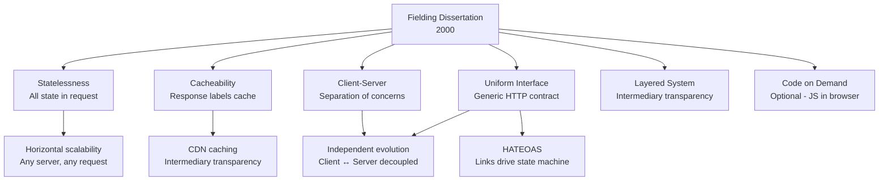

⚡ TL;DR - Roy Fielding's 2000 dissertation defined REST
as six architectural constraints on distributed hypermedia
systems (not just "use HTTP with JSON"); the six constraints:
client-server separation, statelessness, cacheability,
uniform interface, layered system, code-on-demand (optional);
the uniform interface has four sub-constraints, the most
misunderstood being HATEOAS (Hypermedia as the Engine
of Application State) - the idea that API responses
contain links to valid next actions, making clients
self-navigating without out-of-band documentation;
the industry irony: virtually every API called "REST"
violates at least HATEOAS, making it technically
"HTTP + JSON" rather than true REST; Fielding himself
has criticized APIs calling themselves REST without
implementing HATEOAS; understanding the original
constraints clarifies why they exist and which
violations are acceptable trade-offs.

---

| #080 | Category: HTTP & APIs | Difficulty: ★★★★★ |
|:---|:---|:---|
| **Depends on:** | REST API Design, HTTP Methods, HTTP Headers, Event-Driven APIs | |
| **Used by:** | RFC 7230-7235 HTTP/1.1 Specification | |
| **Related:** | REST Design, HTTP Methods, HTTP Headers, Decision Framework, Event-Driven APIs, HTTP/1.1 Spec, API Contract Management | |

---

### 🔥 The Problem This Solves

**WORLD WITHOUT IT:**
Before REST (late 1990s): CORBA, DCOM, RPC-based
distributed systems. Tight coupling: clients must know
server implementation details (method signatures,
data structures, protocols). Not designed for massive
scale. Not designed for evolution (server changes break
clients). Not designed for heterogeneous clients
(browser + desktop + mobile all need different bindings).
HTTP existed (Tim Berners-Lee invented the web) but there
was no principled architectural framework for building
web-scale distributed systems on top of HTTP. Fielding
codified WHY the web scaled: the constraints that made
the web architecture work, formalized as REST.

---

### 📘 Textbook Definition

**REST (Representational State Transfer):**
An architectural style for distributed hypermedia systems,
defined in Roy Fielding's 2000 doctoral dissertation at
UC Irvine: "Architectural Styles and the Design of
Network-based Software Architectures."

REST is NOT:
- A protocol
- A standard
- An HTTP feature
- A synonym for "HTTP API"

REST IS:
An architectural style: a named set of constraints that,
if applied, produce specific desired properties
(performance, scalability, simplicity, modifiability,
visibility, portability, reliability).

**The Six Constraints:**

**1. Client-Server:**
Separation of concerns between UI (client) and data storage
(server). Client is not concerned with data storage.
Server is not concerned with UI. Allows independent
evolution.

**2. Statelessness:**
Each request from client to server must contain ALL
information necessary to understand and process the request.
Session state is kept entirely on the client.
No server-side session state between requests.
Improves visibility (any request is fully understandable
alone), reliability (partial failures are easy to recover
from), and scalability (any server can handle any request
- no sticky sessions).

**3. Cache:**
Responses must label themselves as cacheable or
non-cacheable. Well-managed caching: eliminates some
client-server interactions, improving efficiency and
scalability.

**4. Uniform Interface:**
The central feature of REST. Four sub-constraints:
(a) Identification of resources (URIs identify resources)
(b) Manipulation of resources through representations
    (clients hold a representation - JSON, XML - of
    the resource; manipulate via that representation)
(c) Self-descriptive messages (each message includes
    enough information to describe how to process it;
    Content-Type header specifies the media type)
(d) HATEOAS: Hypermedia as the Engine of Application
    State. The application state is driven by hypermedia
    links in responses. Client discovers next actions
    from the current representation (not from out-of-band
    documentation). This is the constraint that 99% of
    "REST APIs" do not implement.

**5. Layered System:**
Client cannot tell whether it is connected directly to
the end server or to an intermediary (proxy, CDN, gateway).
Intermediaries can: cache responses (CDN), enforce
security (API gateway), balance load. No changes needed
in client or server.

**6. Code on Demand (optional):**
Server can extend client functionality by transferring
executable code (JavaScript in browsers). Optional
constraint - systems that do not support it are still
REST.

---

### ⏱️ Understand It in 30 Seconds

**One line:**
Fielding's REST defines six constraints for distributed
hypermedia systems; the most powerful and most ignored
is HATEOAS - API responses contain links to valid next
actions, making clients self-navigating.

**One analogy:**
> HATEOAS is like navigating a website vs using an API
> with documentation. Website: you load the homepage,
> which contains links. You click a link → page has more
> links. You never need to read documentation to navigate
> (the site IS the documentation through links). True REST
> API: same concept. You GET /orders/123, response contains:
> `{"status": "processing", "_links": {"cancel": "/orders/123/cancel",
> "track": "/orders/123/tracking"}}`. Client knows what actions
> are available right now (cancel and track) without reading
> external docs. Response links change based on state
> (if order is "delivered": only "return" link, no "cancel" link).
> Real-world APIs: documentation-driven, not hypermedia-driven.
> This is why most "REST" APIs are not actually REST.

---

### 🔩 First Principles Explanation

**Why statelessness scales:**

```
WITHOUT STATELESSNESS (server-side sessions):
  Request 1 → Server A → stores session_id=123 in memory
  Request 2 → Server B → session_id=123 not found → error

  Solution: sticky sessions (load balancer sends all requests
  from session 123 to Server A). Limits horizontal scaling.
  Or: centralized session store (Redis). Extra network hop.

WITH STATELESSNESS (REST):
  Each request contains auth token (JWT or API key).
  Request 1 → Server A → validates token, processes
  Request 2 → Server B → validates token, processes
  No shared state. Any server handles any request.
  Horizontal scaling is trivially correct.

Cost of statelessness:
  Larger requests (must send auth credentials every time).
  No multi-step server-side wizards (client must manage state).
  This cost is explicitly accepted in REST's design.
```

**Why the uniform interface enables independent evolution:**

```
WITHOUT UNIFORM INTERFACE (RPC-style):
  Client calls: orders.getById(123, true, ["items", "address"])
  Server changes method signature:
    orders.getOrderDetails(orderId, includeItems, includeAddress)
  Every client breaks immediately.

WITH UNIFORM INTERFACE (REST):
  Client calls: GET /orders/123?include=items,address
  Server changes internal implementation:
  - Changed from SQL to document store: clients don't care
  - Added caching layer: clients don't care
  - Changed response serialization library: clients don't care
  The URI + HTTP verb + representation = the contract.
  Implementation details are hidden behind the uniform interface.
```

---

### 🧪 Thought Experiment

**SCENARIO: HATEOAS in practice**

```
TRUE REST (HATEOAS) response for an order:

GET /orders/123
{
  "order_id": "ord_123",
  "status": "awaiting_payment",
  "total_cents": 4999,
  "_links": {
    "self": { "href": "/orders/123" },
    "payment": { "href": "/orders/123/payment", "method": "POST" },
    "cancel": { "href": "/orders/123/cancel", "method": "DELETE" }
  }
}
// Client sees: can pay or cancel. No documentation needed.
// Client does not need to know the payment URL in advance.

After payment:
GET /orders/123
{
  "order_id": "ord_123",
  "status": "processing",
  "_links": {
    "self": { "href": "/orders/123" },
    "cancel": { "href": "/orders/123/cancel", "method": "DELETE" },
    "track": { "href": "/orders/123/tracking", "method": "GET" }
  }
}
// Client sees: can cancel or track. Payment link gone (already paid).
// Application state drives what links are available.
// Server controls the state machine; client follows links.

After delivery:
GET /orders/123
{
  "order_id": "ord_123",
  "status": "delivered",
  "_links": {
    "self": { "href": "/orders/123" },
    "return": { "href": "/orders/123/return", "method": "POST" }
  }
}
// Client sees: can return. Cancel and track links gone.
// HATEOAS: hypermedia drives the application state machine.

REAL WORLD "REST" APIs:
GET /orders/123
{ "order_id": "ord_123", "status": "awaiting_payment", "total": 4999 }
// No links. Client must read documentation to know:
// "POST /orders/{id}/payment to pay, DELETE /orders/{id} to cancel"
// This is not REST by Fielding's definition.
// It is HTTP + JSON. Which works fine. But is not REST.
```

---

### 🧠 Mental Model / Analogy

> Understanding the six constraints as trade-offs:
> Each constraint sacrifices something to gain something:
> - Client-server: sacrifices simplicity (two components to build)
>   to gain independent evolution
> - Statelessness: sacrifices efficiency (larger requests)
>   to gain scalability and visibility
> - Cache: sacrifices absolute freshness (cached response
>   may be stale) to gain performance
> - Uniform interface: sacrifices efficiency (generic interface
>   is less efficient than purpose-built RPC)
>   to gain generality and independent evolution
> - Layered system: sacrifices performance (overhead from
>   intermediaries) to gain composability and security
> - Code on demand: sacrifices simplicity to gain extensibility
>
> Fielding's thesis: the web scaled to billions of users
> because it was designed with these constraints. Not all
> are needed for every system. But for global hypermedia
> systems (the web), they collectively create web-scale
> properties.

---

### 📶 Gradual Depth - Five Levels

**Level 1 - What it is (anyone can understand):**
Roy Fielding wrote the rules for how the web architecture
works - why it scales to billions of users - in his year
2000 PhD thesis. He called these rules "REST." Most
developers say their APIs are REST, but very few actually
follow all the rules.

**Level 2 - How to use it (junior developer):**
The most relevant constraints in practice:
Statelessness: always include auth in every request (JWT,
API key). Do not depend on server session state.
Uniform interface: use URIs for resources, HTTP verbs
for actions (GET/POST/PUT/DELETE), standard media types
(application/json).
Cacheability: add Cache-Control headers to responses.

**Level 3 - How it works (mid-level engineer):**
The six constraints produce emergent properties.
Statelessness + client-server → any server can handle
any request → horizontal scaling. Cacheability + layered
system → CDN caches responses → reduced origin server
load. Uniform interface → intermediaries (proxies,
gateways) can process requests generically without
application knowledge. These emergent properties explain
why HTTP-based systems at scale (CDN caching, load balancing,
API gateways) work so naturally: HTTP was designed with
REST constraints in mind (Fielding co-wrote HTTP 1.0 spec).

**Level 4 - Why it was designed this way (senior/staff):**
Fielding co-authored the HTTP/1.1 RFC (RFC 2616) and the
URI specification. REST was not invented independently
of HTTP - it was the architectural description of the
choices made while designing HTTP. The dissertation was
retrospective: "here are the constraints that explain
why HTTP works at web scale." This means REST and HTTP
are deeply aligned. HTTP headers like Cache-Control,
ETag, Content-Type are the mechanism; REST constraints
are the architecture. They cannot be fully understood
independently.

**Level 5 - Mastery (distinguished engineer):**
The most important insight in Fielding's dissertation:
the uniform interface constraint is the central REST
feature, and it necessarily degrades efficiency. An
optimal interface for a specific application would be
more efficient than a generic one. REST accepts this
efficiency trade-off in exchange for generality:
any client that understands HTTP can interact with any
REST API without application-specific knowledge. This
is why CDNs, load balancers, and proxies work transparently
with any REST API. A system that uses a non-generic
protocol (gRPC, WebSocket, custom RPC) gains efficiency
but loses intermediary transparency. The HATEOAS
constraint extends this to application semantics:
any client that understands hypermedia can navigate
any REST API without external documentation. The
industry has largely decided HATEOAS complexity is
not worth its benefit for modern API designs (clients
are typically built against specific APIs, not general
hypermedia engines). Fielding has publicly criticized
this decision but the industry pragmatism has prevailed.

---

### ⚙️ How It Works (Mechanism)

**HATEOAS implementation (Spring HATEOAS style in Python):**

```python
from fastapi import FastAPI
from pydantic import BaseModel
from typing import Optional

app = FastAPI()

class Link(BaseModel):
    href: str
    method: str = "GET"
    type: Optional[str] = None

class OrderResponse(BaseModel):
    order_id: str
    status: str
    total_cents: int
    links: dict[str, Link]

def build_order_links(
    order_id: str, status: str
) -> dict[str, Link]:
    """
    HATEOAS: build links based on current order state.
    Client discovers valid actions from response, not docs.
    """
    links: dict[str, Link] = {
        "self": Link(href=f"/orders/{order_id}"),
    }
    # State machine drives available actions
    if status == "awaiting_payment":
        links["payment"] = Link(
            href=f"/orders/{order_id}/payment",
            method="POST",
        )
        links["cancel"] = Link(
            href=f"/orders/{order_id}",
            method="DELETE",
        )
    elif status == "processing":
        links["cancel"] = Link(
            href=f"/orders/{order_id}",
            method="DELETE",
        )
        links["track"] = Link(
            href=f"/orders/{order_id}/tracking",
        )
    elif status == "shipped":
        links["track"] = Link(
            href=f"/orders/{order_id}/tracking",
        )
    elif status == "delivered":
        links["return"] = Link(
            href=f"/orders/{order_id}/return",
            method="POST",
        )
    return links

@app.get("/orders/{order_id}", response_model=OrderResponse)
async def get_order(order_id: str) -> OrderResponse:
    order = await fetch_order(order_id)
    return OrderResponse(
        order_id=order.id,
        status=order.status,
        total_cents=order.total_cents,
        links=build_order_links(order.id, order.status),
    )
```

**Richardson Maturity Model (REST levels):**

```
Level 0: HTTP as transport tunnel
  POST /order-service
  Body: { "action": "createOrder", "items": [...] }
  → RPC over HTTP. URLs are not resources. One endpoint.
  → XML-RPC, SOAP-style APIs

Level 1: Resources (URL as resource identifier)
  POST /orders
  GET  /orders/123
  DELETE /orders/123
  → Resources identified by URLs. Closer to REST.
  → But still using HTTP verbs generically.

Level 2: HTTP Verbs (proper use of GET/POST/PUT/DELETE)
  GET /orders/123           → retrieve
  POST /orders             → create
  PUT /orders/123          → update
  DELETE /orders/123       → delete
  → Most industry "REST" APIs are at this level.
  → HTTP status codes used properly (200, 201, 404, 409).

Level 3: HATEOAS (hypermedia controls in responses)
  GET /orders/123 →
    { ..., "_links": {
      "cancel": "/orders/123/cancel",
      "pay": "/orders/123/payment"
    }}
  → True REST by Fielding's definition.
  → Very rare in practice.
  → Implemented by: Siren, HAL, JSON:API, JSON-LD
```



---

### 🔄 The Complete Picture - End-to-End Flow

**Media type negotiation (self-descriptive messages):**

```python
# Content negotiation: client specifies preferred format
# Server responds with matching Content-Type
# This implements "self-descriptive messages" constraint

from fastapi import FastAPI, Request
from fastapi.responses import JSONResponse, Response
import xml.etree.ElementTree as ET

app = FastAPI()

@app.get("/orders/{order_id}")
async def get_order_negotiated(
    order_id: str, request: Request
) -> Response:
    """
    Content negotiation: supports JSON and XML.
    Implements "self-descriptive messages" REST constraint.
    Each response identifies its format via Content-Type.
    """
    order = await fetch_order(order_id)
    accept = request.headers.get("Accept", "application/json")

    if "application/xml" in accept:
        root = ET.Element("order")
        ET.SubElement(root, "orderId").text = order.id
        ET.SubElement(root, "status").text = order.status
        xml_str = ET.tostring(root, encoding="unicode")
        return Response(
            content=xml_str,
            media_type="application/xml",
        )
    # Default: JSON
    return JSONResponse(content={
        "order_id": order.id,
        "status": order.status,
    })
```

---

### 💻 Code Example

**Example 1 - BAD: "REST" API that violates statelessness**

```python
# BAD: Server-side session state (violates REST statelessness)
from fastapi import FastAPI, Request, HTTPException
from collections import defaultdict

app = FastAPI()

# Server-side multi-step state (checkout wizard)
sessions = defaultdict(dict)

@app.post("/checkout/start")
async def start_checkout(request: Request, user_id: str):
    # Server stores checkout state between requests
    session_id = generate_session_id()
    sessions[session_id] = {"user_id": user_id, "step": 1}
    return {"session_id": session_id}

@app.post("/checkout/add-items")
async def add_items(session_id: str, items: list):
    if session_id not in sessions:
        raise HTTPException(status_code=404)
    # Multi-step checkout state stored on server
    sessions[session_id]["items"] = items
    sessions[session_id]["step"] = 2
    return {"status": "items added"}

# Problem: session state ties client to specific server
# Must use sticky sessions or centralized session store

# GOOD: Stateless (all state in the request)
@app.post("/orders")
async def create_order_stateless(
    request: Request,
    order_data: CreateOrderRequest,
):
    # All state in request body or token
    # No server-side session state
    # Any server can handle this request
    user = verify_jwt_token(
        request.headers.get("Authorization")
    )
    order = await create_order(user.id, order_data)
    return {"order_id": order.id, "status": order.status}
```

---

### ⚖️ Comparison Table

| Constraint | Property Gained | Cost | Industry Practice |
|:---|:---|:---|:---|
| Client-server | Independent evolution | Two components to build | Universal |
| Statelessness | Horizontal scale, visibility | Larger requests, no server wizards | Universal |
| Cache | Performance, scalability | Stale data risk | Universal |
| Uniform interface | Generality, intermediary support | Efficiency trade-off | Partial (Level 2) |
| HATEOAS | Self-navigating clients, server controls state machine | Client complexity, reduced performance | Rare |
| Layered system | Security, composability | Intermediary overhead | Universal (CDN/proxy) |
| Code on demand | Client extensibility | Security concerns | Browser-only (JS) |

---

### ⚠️ Common Misconceptions

| Misconception | Reality |
|:---|:---|
| If you use HTTP + JSON, your API is REST | REST is not a synonym for HTTP + JSON. REST is a set of architectural constraints. Most HTTP + JSON APIs implement REST levels 0-2 (resources + HTTP verbs). True REST (level 3) requires HATEOAS: hypermedia links in responses that drive application state. Fielding has blogged explicitly about this: "REST APIs must be hypertext driven." Not implementing HATEOAS makes your API an HTTP API, not a REST API. Whether this matters depends on your use case. |
| Statelessness means no database | Statelessness means no CLIENT state stored on the SERVER between requests. The database (server-side persistent store) is fine. The distinction: database stores resource state (the order's status). Session state (tracking where the client is in a multi-step process) is what statelessness prohibits from being stored on the server. Session state must be in the client (JWT contains user context; client tracks checkout step in browser state). |
| REST is better than gRPC | REST and gRPC solve different problems with different trade-offs. REST (uniform interface): great for external APIs, CDN caching, heterogeneous clients. gRPC: great for internal services where type safety and performance matter more than generic interface. Fielding's paper was about web-scale hypermedia, not about internal RPC. Using REST constraints for internal service communication that is never cached or proxied is applying a web-architecture pattern to a non-web problem. |

---

### 🚨 Failure Modes & Diagnosis

**Violating statelessness in a load-balanced system**

**Symptom:** Some users get intermittent errors. The
error occurs after a multi-step operation (checkout,
form wizard). Errors are not reproducible consistently.
Some server restarts fix the problem temporarily.

**Root Cause:** Multi-step operation state stored in
server memory (not in the database or client). Different
requests in the same workflow go to different servers.
The second server does not have the state from the first.

**Diagnosis:**
```bash
# Check for in-memory session state
grep -r "session\[" src/  # Python
grep -r "sessions\." src/ # JS
grep -r "HttpSession" src/ # Java

# Check load balancer config for sticky sessions
# (sticky sessions are a sign of statelessness violation):
kubectl describe configmap nginx-ingress-config | \
  grep -i "affinity\|sticky"

# If sticky sessions enabled → application has server-side state
```

**Fix:**
1. Move session state to the client (JWT contains context)
2. Or: move session state to centralized store (Redis)
3. Remove sticky session requirement from load balancer

---

### 🔗 Related Keywords

**Prerequisites (understand these first):**
- `REST API Design Principles` - applying REST in practice
- `HTTP Methods and Status Codes` - the HTTP mechanics
- `HTTP Headers and Request/Response Lifecycle` - the protocol

**Builds On This (learn these next):**
- `RFC 7230-7235 HTTP/1.1 Specification` - the HTTP spec
- `API Design as Contract Management` - applying REST theory

---

### 📌 Quick Reference Card

```
┌──────────────────────────────────────────────────────────┐
│ 6 Constraints│ Client-server, Stateless, Cacheable,      │
│              │ Uniform interface, Layered, Code-on-demand │
├──────────────┼───────────────────────────────────────────┤
│ HATEOAS      │ Links in response = valid next actions     │
│              │ Application state driven by hypermedia     │
├──────────────┼───────────────────────────────────────────┤
│ Richardson   │ L0: HTTP tunnel                            │
│ Maturity     │ L1: Resources (URLs)                       │
│              │ L2: HTTP Verbs + status codes (industry)   │
│              │ L3: HATEOAS (true REST)                    │
├──────────────┼───────────────────────────────────────────┤
│ Industry     │ Most APIs = Level 2 (not true REST)        │
│ reality      │ Fielding calls this "not REST"             │
├──────────────┼───────────────────────────────────────────┤
│ Why it       │ REST = codified constraints of WHY the     │
│ matters      │ web scaled. Understanding = understanding  │
│              │ trade-offs in your API design.             │
├──────────────┼───────────────────────────────────────────┤
│ ONE-LINER    │ "REST = 6 constraints for web-scale APIs.  │
│              │  Most 'REST' APIs are HTTP + JSON (Level 2)│
│              │  HATEOAS is rare but theoretically correct"│
└──────────────────────────────────────────────────────────┘
```

**If you remember only 3 things:**
1. REST is six constraints, not "HTTP + JSON." The most
   important and most violated constraint is HATEOAS:
   responses contain links to valid next actions.
2. Statelessness: each request must contain all state
   needed to process it. No server-side session state
   between requests. This is why JWTs exist.
3. The Richardson Maturity Model: Level 2 (resources +
   HTTP verbs + status codes) is what most industry APIs
   implement. Level 3 (HATEOAS) is true REST. Both are
   valid trade-offs.

---

### 💎 Transferable Wisdom

**Reusable Engineering Principle:**
"Architectural constraints are not arbitrary rules -
they are explicit trade-offs that produce emergent
system properties." Fielding's dissertation is a
masterclass in architectural reasoning: for each
constraint, it explains what property is gained and
what is sacrificed. Engineering decisions should follow
this pattern: "We choose statelessness (cost: larger
requests) to gain horizontal scalability (benefit: any
server can handle any request)." The inverse: "We
choose server-side sessions (cost: sticky sessions or
centralized session store) to gain smaller requests
(benefit: less data per request)." Neither is right;
both are explicit trade-offs. APIs that claim to be
REST but do not consciously choose which constraints
to implement (and which to omit) have implicit design
decisions that may not match their architecture's
actual requirements. The discipline: be explicit about
which constraints you implement, why, and what you
sacrifice.

**Where else this pattern applies:**
- CQRS: separates reads from writes (trade-off: complexity
  for independent scaling)
- Event sourcing: stores events not state (trade-off:
  complex replay for audit trail and temporal queries)
- Microservices: decomposes monolith (trade-off: network
  overhead for independent deployment)
- Database normalization: reduces redundancy (trade-off:
  join overhead for data integrity)

---

### 💡 The Surprising Truth

Fielding did not intend REST as a prescription for API
design. He was describing the web's existing architecture
in formal terms. The dissertation's chapter on REST
is titled "Deriving REST" - he derived REST from the
constraints that the web's architecture had already
evolved to satisfy, not as new constraints to impose.
When the industry adopted "REST" as an API design
methodology, it took a descriptive analysis and turned
it into a prescriptive framework. The result: the
industry applied web-scale constraints (HATEOAS,
uniform interface generality) to APIs that were not
the web and did not need web-scale intermediary
transparency. Most enterprise APIs have a small number
of known clients (not billions of unknown browsers)
and would benefit more from tight coupling and
type safety (gRPC-style) than from the loose coupling
and generic interface that REST is designed for.
The lesson: architectural patterns describe solutions
to specific problems. Applying a pattern without
matching it to its original problem context produces
unnecessary complexity. REST is an excellent pattern
for public web APIs with unknown heterogeneous clients.
It is a poor pattern for internal service communication
between services you control on both sides.

---

### ✅ Mastery Checklist

**You've mastered this when you can:**
1. **EXPLAIN** All six REST constraints, the property
   each produces, and the cost each imposes.
2. **IMPLEMENT** A HATEOAS response for an order
   resource that includes state-dependent links.
3. **PLACE** A real-world API on the Richardson Maturity
   Model (Level 0-3) with justification.
4. **ARTICULATE** Why violating statelessness in a
   load-balanced system causes intermittent failures.
5. **ARGUE** When applying REST constraints is and
   is not appropriate (public API vs internal service).

---

### 🎯 Interview Deep-Dive

**Q1: What are the six REST constraints and which one
is most important?**

*Why they ask:* Tests REST theory depth beyond "HTTP + JSON."

*Strong answer includes:*
- The six: Client-server, Stateless, Cacheable, Uniform
  interface, Layered system, Code-on-demand (optional).
- Most important: Uniform interface - it is the central
  differentiator of REST from other distributed architectures.
  Contains four sub-constraints including HATEOAS.
- Why uniform interface matters: any HTTP intermediary
  (CDN, proxy, API gateway) can operate on REST requests
  without application-specific knowledge. Generic HTTP
  caching, generic routing, generic auth enforcement.
  This is why CDN + REST works trivially.
- HATEOAS: almost never implemented in practice. But
  the theoretical importance: server controls the state
  machine; client does not need to know valid actions
  in advance. Reduces client-server coupling.
- Industry level: most APIs are Richardson Level 2
  (resources + HTTP verbs + status codes). Not HATEOAS.
  Fielding considers this not REST but the industry
  pragmatically accepts it.

**Q2: Why does statelessness make HTTP APIs easier to
scale horizontally?**

*Why they ask:* Tests understanding of scalability constraints.

*Strong answer includes:*
- Stateless = each request is self-contained. The server
  does not need to know about previous requests from
  the same client.
- With server-side state: client's session (authentication
  state, wizard progress, shopping cart) is stored in
  one server's memory. Load balancer MUST route all
  requests from that client to the SAME server (sticky
  sessions). If that server goes down: session is lost.
  Cannot scale freely (cannot add arbitrary new servers;
  must handle sticky routing).
- Stateless: auth token (JWT) is in every request.
  Server 1 or Server 2 or Server 50 can handle any request
  - they all have the information needed (JWT contains
  user identity and permissions). Load balancer can use
  round-robin. New servers can be added without configuration.
  Any server can fail and another takes over instantly.
- The cost: larger requests (must send JWT with every
  request). No server-side multi-step wizards without
  moving state to client or to a centralized store.
- Practical implication: JWT tokens instead of session
  cookies is a statelessness pattern. The token IS the
  session, carried by the client, validated by any server.
