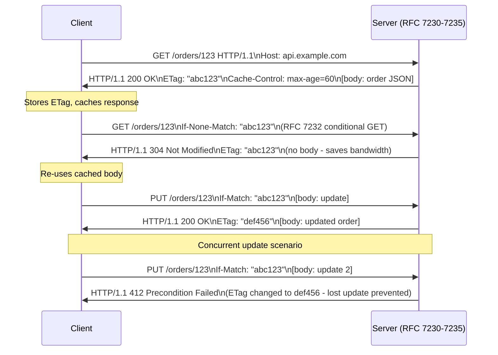

⚡ TL;DR - RFC 7230-7235 (published June 2014) replaced
the monolithic RFC 2616 by splitting HTTP/1.1 into six
focused documents: message syntax (7230), semantics
and content (7231), conditional requests (7232),
range requests (7233), caching (7234), and authentication
(7235); key design decisions: case-insensitive header
field names but case-sensitive header field values,
persistent connections by default (Connection: close
to opt-out), chunked transfer encoding for streaming
unknown-length bodies, content negotiation built into
the protocol (Accept/Content-Type), and a pluggable
authentication framework (WWW-Authenticate/Authorization);
understanding the RFCs explains behaviors that surprise
developers: why `CONTENT-TYPE` and `content-type`
are equivalent, why HTTP/1.1 without Content-Length
hangs, why 304 Not Modified has no body, why the
`Date` header is required on all responses.

---

| #081 | Category: HTTP & APIs | Difficulty: ★★★★★ |
|:---|:---|:---|
| **Depends on:** | REST API Design, HTTP Methods, HTTP Headers, Roy Fielding Dissertation | |
| **Used by:** | gRPC Design Rationale | |
| **Related:** | REST Design, HTTP Methods, HTTP Headers, HTTP Keep-Alive, Roy Fielding, gRPC Design | |

---

### 🔥 The Problem This Solves

**WORLD WITHOUT IT:**
RFC 2616 (1999) defined HTTP/1.1 in a single 176-page
document. Problems: ambiguities and contradictions in
the spec led to inconsistent implementations across
web servers and clients. Errata list grew to 57 items.
Developers misread or misapplied rules. Result: subtle
interoperability bugs (caching inconsistencies between
Apache, Nginx, and browsers, connection management
differences, authentication header parsing differences).
RFC 7230-7235 (2014) was a major editorial revision:
same protocol, cleaner specification, six focused
documents.

---

### 📘 Textbook Definition

**RFC 7230 - Message Syntax and Routing:**
HTTP message format: request line, status line, headers,
optional body. Connection management: persistent
connections (default in HTTP/1.1), `Connection: close`
to opt-out. Transfer encoding: `chunked` for streaming
bodies of unknown length.

**RFC 7231 - Semantics and Content:**
HTTP methods (GET, POST, PUT, DELETE, HEAD, OPTIONS,
CONNECT, TRACE), status codes (1xx-5xx),
content negotiation (Accept, Content-Type,
Accept-Language, Accept-Encoding), request/response
semantics.

**RFC 7232 - Conditional Requests:**
Entity tags (ETag): unique identifier for a specific
version of a resource. Conditional headers:
`If-Match`, `If-None-Match`, `If-Modified-Since`,
`If-Unmodified-Since`. Used for: optimistic concurrency
(update only if current version matches), cache
validation (304 Not Modified).

**RFC 7233 - Range Requests:**
`Range: bytes=0-1023` - request partial content.
`Content-Range: bytes 0-1023/10240` - response with
partial content (206 Partial Content). Used for:
resumable downloads, video streaming, large file
transfers.

**RFC 7234 - Caching:**
Cache-Control directives: `no-cache`, `no-store`,
`max-age`, `private`, `public`, `must-revalidate`.
Cache validation: `ETag` + `If-None-Match`, `Last-Modified`
+ `If-Modified-Since`. `Age` header: how long a cached
response has been stored. `Vary` header: cache key
includes specified request headers.

**RFC 7235 - Authentication:**
Authentication framework: `WWW-Authenticate` (server
challenge), `Authorization` (client credential),
`Proxy-Authenticate` / `Proxy-Authorization`
(proxy authentication). Status codes: 401 Unauthorized
(authenticate with server), 407 Proxy Authentication
Required. Pluggable: specific schemes (Basic, Bearer,
Digest) defined in separate RFCs.

---

### ⏱️ Understand It in 30 Seconds

**One line:**
RFC 7230-7235 defines the HTTP/1.1 protocol: message
format, method semantics, conditional requests, caching,
range requests, and authentication - the spec that
every HTTP implementation must follow.

**One analogy:**
> RFC 7230-7235 is the grammar and vocabulary rules
> for HTTP conversations. Just as grammar rules define
> how sentences are structured (subject-verb-object,
> punctuation placement, capitalization rules), HTTP
> RFCs define how HTTP messages are structured (request
> line format, header name case rules, body encoding).
> A browser and a server can communicate correctly
> because both have read the same "grammar rules" and
> follow them. Interoperability bugs are "grammatical
> misunderstandings": one side followed a rule the other
> side read differently.

---

### 🔩 First Principles Explanation

**HTTP message format (RFC 7230 §3):**

```
HTTP REQUEST FORMAT:
  request-line = method SP request-target SP HTTP-version CRLF
  *(header-field CRLF)
  CRLF
  [ message-body ]

EXAMPLE:
  GET /orders/123 HTTP/1.1\r\n
  Host: api.example.com\r\n
  Authorization: Bearer eyJ...\r\n
  Accept: application/json\r\n
  \r\n
  (empty body - GET request)

HTTP RESPONSE FORMAT:
  status-line = HTTP-version SP status-code SP reason-phrase CRLF
  *(header-field CRLF)
  CRLF
  [ message-body ]

EXAMPLE:
  HTTP/1.1 200 OK\r\n
  Content-Type: application/json\r\n
  Content-Length: 42\r\n
  Date: Mon, 01 Jan 2024 00:00:00 GMT\r\n
  \r\n
  {"order_id": "123", "status": "processing"}

KEY RULES (RFC 7230 §3.2):
  1. Header field names are CASE INSENSITIVE
     "content-type" == "Content-Type" == "CONTENT-TYPE"
  2. Header field values may be CASE SENSITIVE
     (depends on the specific header)
     "Bearer TOKEN123" != "bearer token123" (Authorization)
     but "application/json" == "Application/JSON" (Content-Type)
  3. Request MUST include Host header (HTTP/1.1)
  4. Header field names: token characters only
     (no spaces in names - "X My Header" is invalid)
```

**Persistent connections (RFC 7230 §6.3):**

```
HTTP/1.1 persistent connection rules:

DEFAULT: connections are persistent (keep-alive).
  Server keeps connection open after response.
  Client can send another request on same connection.

TO CLOSE: either side sends "Connection: close" header.
  After this exchange, connection MUST be closed.

REQUEST PIPELINING (RFC 7230 §6.3.2):
  Client can send multiple requests without waiting
  for each response (pipelining). Server must respond
  in the same order requests were received.
  Problem: head-of-line blocking.
  If first request takes 2 seconds: all subsequent
  responses are delayed 2 seconds even if ready.
  HTTP/2 multiplexing solves this with streams.

IDLE TIMEOUT:
  Not specified in RFC (implementation-defined).
  Typical: Nginx default 65s, Apache default 5s.
  AWS ALB: 60s. Clients should close before server.
  Mismatch: server closes at 65s, client sends at 65.5s
  → server already closed → "connection reset by peer"
  → client must handle this and retry.
```

**Chunked transfer encoding (RFC 7230 §4.1):**

```
Used when: server does not know response length in advance
  (streaming, server-sent events, generated content)

Format:
  HTTP/1.1 200 OK
  Transfer-Encoding: chunked
  Content-Type: application/json

  1a\r\n               <- chunk size in hex (26 bytes)
  {"status": "processing"}\r\n    <- chunk data
  1c\r\n               <- next chunk (28 bytes)
  {"status": "shipped", "ts": 1}\r\n
  0\r\n                <- zero chunk = end of body
  \r\n

Client accumulates chunks into complete body.
Enables streaming without buffering entire response.
Python FastAPI: StreamingResponse uses chunked encoding.
Cannot use Content-Length + chunked simultaneously.
```

---

### 🧪 Thought Experiment

**SCENARIO: Why 304 Not Modified has no body**

```
CONDITIONAL GET flow:

First request:
  Client: GET /orders/123
  Server:
    HTTP/1.1 200 OK
    ETag: "abc123"          ← unique version identifier
    Last-Modified: Mon, 01 Jan 2024 00:00:00 GMT
    Content-Length: 256
    [body: order JSON, 256 bytes]

  Client stores: ETag="abc123", body in local cache

Second request (cache validation):
  Client: GET /orders/123
          If-None-Match: "abc123"   ← send stored ETag
          If-Modified-Since: Mon, 01 Jan 2024 00:00:00 GMT

  Server: checks if order 123 has changed since ETag "abc123"
    If NOT changed:
      HTTP/1.1 304 Not Modified
      ETag: "abc123"          ← confirm same version
      (no body - saves 256 bytes of bandwidth)
    If CHANGED:
      HTTP/1.1 200 OK
      ETag: "def456"          ← new ETag
      Content-Length: 289
      [body: updated order JSON]

Why 304 has no body:
  RFC 7232 §4.1: "The server generating a 304 response
  MUST generate any of the following header fields that
  would have been sent in a 200 OK response to the same
  request: Cache-Control, Content-Location, Date, ETag,
  Expires, and Vary. A 304 response cannot contain a
  message-body."

The purpose: validate cache without re-sending the body.
If server says "nothing changed": client uses cached body.
Body would be redundant and waste bandwidth.
```

---

### 🧠 Mental Model / Analogy

> Think of the RFC 7230-7235 split as a library
> with six specialized books vs the original one
> fat volume. The original RFC 2616 was one 176-page
> book that covered everything. Finding the rule about
> ETag handling required knowing it was on page 103.
> Finding the caching rule required page 86.
> RFC 7230-7235: six slim volumes, each focused.
> "I need caching rules" → RFC 7234 alone.
> "I need authentication" → RFC 7235 alone.
> This is the same principle as the Single Responsibility
> Principle in software: smaller, focused documents
> (modules) are easier to understand, implement, and
> update independently.

---

### 📶 Gradual Depth - Five Levels

**Level 1 - What it is (anyone can understand):**
HTTP/1.1 was defined in detailed specification documents
(RFCs) that tell browsers, web servers, and APIs exactly
how to format and interpret HTTP messages. Following
the spec ensures that any HTTP client can talk to any
HTTP server correctly.

**Level 2 - How to use it (junior developer):**
Practical rules from the RFCs:
Always include `Content-Type` with request bodies.
Always include `Content-Length` (or use chunked encoding)
with response bodies. Use ETags for caching with
`If-None-Match`. Use `Cache-Control: max-age=3600` for
cacheable responses. `Authorization: Bearer <token>`
format for JWT auth.

**Level 3 - How it works (mid-level engineer):**
RFC 7232 conditional requests enable optimistic concurrency
in APIs. Pattern: GET resource → receive ETag in response →
send PUT with `If-Match: <ETag>` → server updates only
if ETag matches current state → returns 412 Precondition
Failed if another update occurred between GET and PUT.
This prevents "lost update" race conditions in REST APIs.
No database transactions needed across service boundaries.

**Level 4 - Why it was designed this way (senior/staff):**
The HTTP authentication framework (RFC 7235) was designed
as a challenge-response protocol: client makes unauthenticated
request, server responds with `401 Unauthorized` and
`WWW-Authenticate: Bearer realm="api"`, client resends
with `Authorization: Bearer <token>`. This two-step process
was designed for interactive user agents (browsers) that
can prompt for credentials on demand. Modern API clients
send credentials immediately on every request (proactive
authorization). The challenge-response dance is typically
skipped. But the framework remains: the `WWW-Authenticate`
header tells the client WHAT kind of authentication is
needed if they don't know in advance.

**Level 5 - Mastery (distinguished engineer):**
RFC 7230 §5.7 covers message transformation by intermediaries
(proxies, CDNs). Intermediaries are allowed to modify
headers and transform message bodies under specific
conditions, but MUST NOT change semantics. Key rule:
a proxy must not transform a response unless the
`no-transform` directive is absent from Cache-Control.
This is why: (1) some CDNs gzip responses even if the
origin did not, (2) some proxies add or remove headers,
(3) you see headers like `Via: 1.1 cloudfront` in
CDN-proxied responses (RFC 7230 §5.7.1 requires Via
header from intermediaries). Understanding this explains
why debugging HTTP issues in a CDN-fronted system
requires checking both origin headers and CDN-modified
response headers - they may differ.

---

### ⚙️ How It Works (Mechanism)

**ETag-based optimistic concurrency (RFC 7232):**

```python
from fastapi import FastAPI, Request, HTTPException, Header
from typing import Optional
import hashlib, json

app = FastAPI()

def compute_etag(data: dict) -> str:
    """Compute ETag as hash of response content."""
    content = json.dumps(data, sort_keys=True)
    return f'"{hashlib.md5(content.encode()).hexdigest()}"'

@app.get("/orders/{order_id}")
async def get_order(
    order_id: str,
    if_none_match: Optional[str] = Header(None),
):
    """
    GET with ETag: supports 304 Not Modified.
    Implements RFC 7232 conditional GET.
    """
    order = await fetch_order(order_id)
    order_dict = order.dict()
    etag = compute_etag(order_dict)

    # If client has this version → 304 Not Modified
    if if_none_match and if_none_match == etag:
        from fastapi.responses import Response
        return Response(
            status_code=304,
            headers={"ETag": etag},
            # No body per RFC 7232 §4.1
        )
    from fastapi.responses import JSONResponse
    return JSONResponse(
        content=order_dict,
        headers={
            "ETag": etag,
            "Cache-Control": "private, max-age=60",
        },
    )

@app.put("/orders/{order_id}")
async def update_order(
    order_id: str,
    update: OrderUpdate,
    if_match: Optional[str] = Header(None),
):
    """
    PUT with If-Match: optimistic concurrency.
    Implements RFC 7232 conditional PUT.
    Prevents lost updates when two clients update concurrently.
    """
    order = await fetch_order(order_id)
    current_etag = compute_etag(order.dict())

    # If ETag provided but doesn't match: concurrent update occurred
    if if_match and if_match != current_etag:
        raise HTTPException(
            status_code=412,  # Precondition Failed (RFC 7232)
            detail="Resource modified by another client. Re-fetch and retry.",
        )
    updated = await update_order_in_db(order_id, update)
    return JSONResponse(
        content=updated.dict(),
        headers={"ETag": compute_etag(updated.dict())},
    )
```

**Content negotiation (RFC 7231 §5.3):**

```python
from fastapi import FastAPI, Request
from fastapi.responses import Response
import json, csv, io

app = FastAPI()

@app.get("/orders")
async def list_orders(request: Request) -> Response:
    """
    Content negotiation: serve JSON or CSV based on Accept header.
    Implements RFC 7231 §5.3.2 (Accept header).
    """
    accept = request.headers.get("Accept", "application/json")
    orders = await fetch_orders()

    if "text/csv" in accept:
        output = io.StringIO()
        writer = csv.writer(output)
        writer.writerow(["order_id", "status", "total_cents"])
        for order in orders:
            writer.writerow([order.id, order.status, order.total_cents])
        return Response(
            content=output.getvalue(),
            media_type="text/csv",
            headers={
                "Content-Disposition": "attachment; filename=orders.csv"
            },
        )
    # Default: JSON
    return Response(
        content=json.dumps([o.dict() for o in orders]),
        media_type="application/json",
    )
```



---

### 🔄 The Complete Picture - End-to-End Flow

**Range request for resumable download (RFC 7233):**

```python
@app.get("/files/{file_id}")
async def download_file(
    file_id: str,
    request: Request,
) -> Response:
    """
    Range request support: enables resumable downloads.
    Implements RFC 7233.
    """
    file_path = await get_file_path(file_id)
    file_size = file_path.stat().st_size

    # Check for Range header
    range_header = request.headers.get("Range")
    if range_header:
        # Parse "bytes=1024-2047"
        byte_range = range_header.replace("bytes=", "")
        start, end = byte_range.split("-")
        start = int(start)
        end = int(end) if end else file_size - 1
        chunk_size = (end - start) + 1

        with open(file_path, "rb") as f:
            f.seek(start)
            data = f.read(chunk_size)

        return Response(
            content=data,
            status_code=206,  # Partial Content (RFC 7233)
            headers={
                "Content-Range": (
                    f"bytes {start}-{end}/{file_size}"
                ),
                "Accept-Ranges": "bytes",
                "Content-Length": str(chunk_size),
            },
        )
    # Full file
    return FileResponse(
        path=file_path,
        headers={"Accept-Ranges": "bytes"},
    )
```

---

### 💻 Code Example

**Example 1 - BAD: Ignoring RFC rules in HTTP client**

```python
# BAD: Common violations of RFC 7230-7235

# 1. Not handling 304 Not Modified (re-fetches unnecessarily)
# Client always sends GET without If-None-Match.
# Server always returns 200 with full body.
# Wastes bandwidth for large responses that rarely change.

# 2. Not handling optimistic concurrency with ETags
# Client does PUT without If-Match.
# Two concurrent clients both update the same resource.
# Last write wins. First client's changes silently lost.
# "Lost update" problem.

# 3. Not retrying on "Connection reset by peer"
# Server closes persistent connection after idle timeout.
# Client sends request exactly at timeout.
# "Connection reset by peer" error.
# BAD: crash. GOOD: retry once on new connection.

# GOOD: HTTP client with RFC-compliant behavior
import httpx

class RFCCompliantClient:
    def __init__(self, base_url: str):
        self.base_url = base_url
        self.etag_cache: dict[str, str] = {}
        self.client = httpx.AsyncClient()

    async def get(self, path: str) -> httpx.Response:
        """GET with conditional request (RFC 7232)."""
        headers = {}
        if path in self.etag_cache:
            headers["If-None-Match"] = self.etag_cache[path]

        try:
            resp = await self.client.get(
                f"{self.base_url}{path}", headers=headers
            )
        except httpx.RemoteProtocolError:
            # "Connection reset by peer": server closed idle connection
            # Retry once on new connection (RFC 7230 §6.3.4)
            await self.client.aclose()
            self.client = httpx.AsyncClient()
            resp = await self.client.get(
                f"{self.base_url}{path}", headers=headers
            )

        if resp.status_code == 304:
            # Use cached response - server says nothing changed
            return resp  # Caller uses local cache
        if etag := resp.headers.get("ETag"):
            self.etag_cache[path] = etag
        return resp
```

---

### ⚖️ Comparison Table

| RFC | Topic | Key Behavior |
|:---|:---|:---|
| **7230** | Message syntax | Header names case-insensitive; values may be case-sensitive; persistent connections by default; chunked encoding for unknown-length bodies |
| **7231** | Semantics | Method semantics (safe/idempotent); status code classes (1xx-5xx); content negotiation (Accept/Content-Type); representation metadata |
| **7232** | Conditional | ETag for version identity; If-Match (optimistic concurrency); If-None-Match (cache validation); 304 Not Modified has no body; 412 Precondition Failed |
| **7233** | Range | Range: bytes=start-end; 206 Partial Content; Accept-Ranges; Content-Range; enables resumable downloads |
| **7234** | Caching | Cache-Control directives; cache validation (ETag, Last-Modified); Vary header; Age header |
| **7235** | Auth | WWW-Authenticate challenge; Authorization header; pluggable scheme framework; 401 vs 407 |

---

### ⚠️ Common Misconceptions

| Misconception | Reality |
|:---|:---|
| Header names are case-sensitive | RFC 7230 §3.2: "Each header field consists of a case-insensitive field name followed by a colon..." Header names are explicitly case-insensitive. `Content-Type`, `content-type`, and `CONTENT-TYPE` are identical. HTTP/2 further specifies all header names MUST be lowercase. Programs that compare header names case-sensitively may fail when receiving headers from compliant servers that use different casing. |
| 404 and 410 are interchangeable | RFC 7231 §6.5.4 (404 Not Found): The server did not find the resource. It may exist in the future. Clients should retry or try again later. RFC 7231 §6.5.9 (410 Gone): The resource has been permanently removed. Clients should not retry. Search engines interpret 410 as "deindex this page permanently." Using 404 for a deprecated API endpoint means search engines and clients think it might come back. Using 410 (with a migration link in the body) is the correct response after API sunset. |
| The Date header is optional | RFC 7231 §7.1.1.2: "An origin server MUST send a Date header field in all cases." The only exceptions: if the server does not have a reliable clock (1xx and 5xx responses may omit Date if the server has no clock). In practice: all HTTP servers must include Date in all 2xx, 3xx, and 4xx responses. Clients use the Date header to compute cache age (Age header represents seconds since Date). Missing Date breaks cache age calculation. |

---

### 🚨 Failure Modes & Diagnosis

**Connection reset by peer under load**

**Symptom:** Under load, HTTP client gets
`Connection reset by peer` errors. Error is intermittent
and increases as load increases. Does not happen in
low-traffic tests.

**Root Cause:** Server closes persistent connections
after idle timeout. Under load, the connection
is reused exactly when the server's idle timer fires.
Client sends request on a connection the server has
already closed.

**Diagnosis:**
```bash
# Check server idle timeout
# Nginx:
grep "keepalive_timeout" /etc/nginx/nginx.conf
# Default: keepalive_timeout 65;  (65 seconds)

# Check client timeout (should be < server timeout)
# httpx default: 5s per request; no keepalive timeout

# Capture the TCP event:
sudo tcpdump -i eth0 -w capture.pcap port 8080
# Look for: RST flag from server exactly N seconds after last request
# N = keepalive_timeout

# Python httpx client: check connection pool behavior
import httpx
transport = httpx.AsyncHTTPTransport(
    retries=1  # Retry once on connection reset
)
client = httpx.AsyncClient(transport=transport)
```

**Fix:**
1. Set client keepalive timeout lower than server timeout:
   client = 55s if server = 65s. Client closes proactively.
2. Add retry-on-reset logic: retry once on
   `httpx.RemoteProtocolError` (per RFC 7230 §6.3.4:
   clients that receive a premature close should retry).
3. Or use HTTP/2: multiplexed streams eliminate the
   per-connection idle timeout problem.

---

### 🔗 Related Keywords

**Prerequisites (understand these first):**
- `HTTP Methods and Status Codes` - the semantics
- `HTTP Headers and Request/Response Lifecycle` - the mechanism
- `HTTP Keep-Alive and Connection Reuse` - persistent connections

**Builds On This (learn these next):**
- `gRPC Design Rationale and Protocol Internals` - why HTTP/2
  was designed as an improvement over HTTP/1.1

---

### 📌 Quick Reference Card

```
┌──────────────────────────────────────────────────────────┐
│ 7230          │ Message format. Headers case-insensitive. │
│               │ Persistent connections default. Chunked. │
├───────────────┼───────────────────────────────────────── │
│ 7231          │ Method semantics. Status codes.           │
│               │ Content negotiation (Accept/*).           │
├───────────────┼───────────────────────────────────────── │
│ 7232          │ ETag + If-None-Match → 304 (no body)     │
│               │ If-Match → 412 (optimistic concurrency)  │
├───────────────┼───────────────────────────────────────── │
│ 7233          │ Range: bytes=N-M → 206 Partial Content    │
│               │ Accept-Ranges + Content-Range headers     │
├───────────────┼───────────────────────────────────────── │
│ 7234          │ Cache-Control directives. Age header.     │
│               │ Vary for request-header-dependent cache.  │
├───────────────┼───────────────────────────────────────── │
│ 7235          │ WWW-Authenticate → Authorization          │
│               │ 401 (origin) vs 407 (proxy) auth.        │
├───────────────┼───────────────────────────────────────── │
│ ONE-LINER     │ "RFC 7230-7235 = the grammar of HTTP/1.1. │
│               │  Headers case-insensitive. ETags =        │
│               │  version IDs. 304 has no body."           │
└──────────────────────────────────────────────────────────┘
```

**If you remember only 3 things:**
1. Header names are case-insensitive (RFC 7230).
   `Content-Type` == `content-type`. Values may be
   case-sensitive. HTTP/2 requires lowercase names.
2. ETag = resource version identifier (RFC 7232).
   `If-None-Match` for cache validation (304 No Modified,
   no body). `If-Match` for optimistic concurrency
   (412 Precondition Failed = concurrent update detected).
3. `Connection reset by peer` on idle connections:
   server closes after keepalive timeout. Client must
   retry once per RFC 7230 §6.3.4. Set client timeout
   lower than server timeout to prevent race.

---

### 💎 Transferable Wisdom

**Reusable Engineering Principle:**
"Conditional requests are the HTTP implementation of
optimistic concurrency control." The same pattern
(get-version, update-if-version-matches, retry-on-conflict)
applies to: database rows (SELECT ... FOR UPDATE, optimistic
locking with version column), distributed cache
(Redis SET NX for atomic operations), S3 objects
(ETag + conditional PUT), config management (etcd's
revision-based conditional update). The HTTP ETag +
If-Match pattern is one implementation of a universal
concurrency pattern. Understanding it in HTTP makes
it immediately recognizable in other contexts.

**Where else this pattern applies:**
- PostgreSQL MVCC: row version (xmax/xmin) as implicit ETag
- Redis WATCH: watch key, modify in transaction, abort if
  key changed (COMPARE-AND-SWAP)
- Amazon DynamoDB: conditional expressions (version attribute)
- Kubernetes: resourceVersion on every object (must match
  for conflicting updates → 409 Conflict)
- Git: commit SHA = ETag for the repository state at a point

---

### 💡 The Surprising Truth

RFC 7231's definition of HTTP method safety and idempotency
has practical security implications that most developers
are unaware of. Safe methods (GET, HEAD, OPTIONS, TRACE)
are defined as methods that "the client does not request,
and cannot expect, any state change on the server as a
result." This definition is why: (1) browsers pre-fetch
links using GET (they assume GET is safe to execute
without user intent), (2) caches serve GET responses
without consulting the origin, (3) CSRF protections
often focus only on state-changing methods (POST/PUT/DELETE).
If you implement a state-changing operation using GET
(e.g., `GET /users/123/delete`): you violate this safety
guarantee. Consequence: a browser pre-fetch, a crawler
following links, or a CDN cache refresh can accidentally
trigger your delete operation. The RFC's method safety
definition is not just academic - it is the behavioral
contract that the entire web infrastructure (caches,
pre-fetchers, CDNs, CSRF frameworks) relies on. Violating
it means components that have never seen your code will
interact with your API in ways you did not anticipate.

---

### ✅ Mastery Checklist

**You've mastered this when you can:**
1. **EXPLAIN** The six RFC 7230-7235 documents and their
   scope without consulting notes.
2. **IMPLEMENT** ETag-based cache validation (RFC 7232)
   with `If-None-Match` and `304 Not Modified`.
3. **IMPLEMENT** Optimistic concurrency with `If-Match`
   and `412 Precondition Failed`.
4. **CONFIGURE** Range request support for resumable
   downloads (RFC 7233).
5. **DIAGNOSE** "Connection reset by peer" errors from
   keepalive timeout mismatch between client and server.

---

### 🎯 Interview Deep-Dive

**Q1: What is the difference between 401 and 403 HTTP
status codes?**

*Why they ask:* Tests HTTP spec understanding and security implications.

*Strong answer includes:*
- 401 Unauthorized (RFC 7235 §3.1): "The request has not
  been applied because it lacks valid authentication credentials
  for the target resource." MUST include `WWW-Authenticate`
  header indicating the challenge scheme. Meaning: "I don't
  know who you are. Authenticate and try again." Response
  MUST include `WWW-Authenticate: Bearer realm='api'` (or
  other scheme). Client should retry with credentials.
- 403 Forbidden (RFC 7231 §6.5.3): "The server understood
  the request but refuses to authorize it." No authentication
  challenge. Meaning: "I know who you are. You are not allowed
  to access this resource." Retrying with different credentials
  will not help (the user is authenticated but lacks permission).
- Security implication: for resources that should not reveal
  existence to unauthorized users, 404 Not Found is the correct
  response (not 403). Returning 403 confirms the resource
  exists to the requestor. Returning 404 prevents information
  disclosure. Example: admin-only endpoint at `/admin/users`:
  return 404 for unauthenticated AND unauthorized requests.
  Only return 200 for admin users.

**Q2: How does HTTP content negotiation work
(Accept header)?**

*Why they ask:* Tests HTTP/RFC depth for API design.

*Strong answer includes:*
- Client sends Accept header in request: `Accept: application/json,
  application/xml;q=0.9, */*;q=0.8`. The `q` (quality) parameter
  is a preference weight (default 1.0, range 0.0-1.0). This
  says: "I prefer JSON (q=1.0), second choice XML (q=0.9),
  any format as last resort (q=0.8)."
- Server checks Accept header against its supported formats.
  Best match wins. If no acceptable format: server returns
  406 Not Acceptable.
- In practice: most JSON APIs do not implement proper content
  negotiation (they always return JSON regardless of Accept
  header). They should at minimum check for `application/json`
  and return 415 Unsupported Media Type for unrecognized
  Content-Type on incoming bodies.
- Vary header: if response content depends on the Accept
  header, the server MUST include `Vary: Accept` so caches
  know to store separate cached versions per Accept value.
  Without Vary: cache may return a JSON response to a client
  requesting XML.
- Related headers: `Content-Language` (response language),
  `Content-Encoding` (Accept-Encoding → gzip/br/deflate
  compression), `Content-Type` (the actual format of the
  response body).
