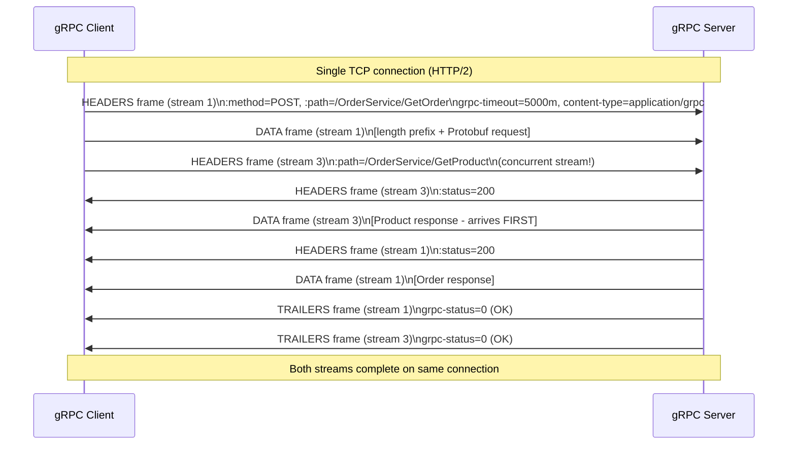

⚡ TL;DR - gRPC is Google's open-source RPC framework
(2015) built on HTTP/2 + Protocol Buffers; its design
rationale: HTTP/2 provides multiplexing (multiple concurrent
streams on one connection, eliminating HOL blocking),
binary framing (no text parsing overhead), header
compression (HPACK: reduces header overhead on repeated
calls), and server push; Protobuf provides type safety
(compile-time), binary efficiency (3-10× smaller than
JSON), and code generation (eliminates hand-written
serialization); gRPC's four streaming modes (unary,
server-streaming, client-streaming, bidirectional)
map to different RPC patterns using HTTP/2's stream
multiplexing; the critical browser limitation:
gRPC uses HTTP/2 trailers (for final status code)
which browsers cannot access, requiring gRPC-web proxy;
the operational cost: gRPC-specific load balancers,
observability tooling, health check protocol (grpc.health.v1).

---

| #082 | Category: HTTP & APIs | Difficulty: ★★★★★ |
|:---|:---|:---|
| **Depends on:** | gRPC vs REST Performance, gRPC Service Evolution, RFC 7230-7235 | |
| **Used by:** | GraphQL Specification Core Design | |
| **Related:** | gRPC vs REST, Service Mesh, Decision Framework, gRPC Evolution, HTTP/1.1 Spec, GraphQL Spec | |

---

### 🔥 The Problem This Solves

**WORLD WITHOUT IT:**
Google's internal microservice communication (early 2010s):
~10B RPCs/second internally (Stubby, Google's internal
RPC framework). Stubby is not open-sourced. The external
ecosystem (all other companies) uses: REST (HTTP/1.1 +
JSON) for internal services. Problems with REST for
internal services at Google's scale:
1. HTTP/1.1 head-of-line blocking: one slow request
   blocks all subsequent requests on the same connection.
2. JSON serialization overhead: parsing JSON is CPU-intensive
   at 100M requests/second.
3. No generated client stubs: each team writes HTTP client
   code by hand. Type safety depends on documentation.
4. No native streaming: bidirectional streaming requires
   WebSocket (different protocol, different port, different
   proxies).
gRPC solves all four: HTTP/2 eliminates HOL blocking,
Protobuf replaces JSON, generated stubs eliminate
hand-written client code, and HTTP/2 streams provide
all four streaming modes.

---

### 📘 Textbook Definition

**gRPC (gRPC Remote Procedure Calls):**
Open-source framework (Google, 2015). Transport:
HTTP/2. Serialization: Protocol Buffers (by default).
Interface definition: .proto files. Code generation:
protoc compiler generates client stubs and server
interfaces in 10+ languages.

**HTTP/2 features used by gRPC:**

**Binary framing layer:** HTTP/1.1 is text-based.
HTTP/2 breaks all communication into small binary
frames. Benefit: efficient to parse (no byte-by-byte
text scanning), each frame has a type and flags
(DATA, HEADERS, RST_STREAM, SETTINGS, PING, etc.).

**Stream multiplexing:** Multiple logical streams share
one TCP connection. Each gRPC call = one HTTP/2 stream
(identified by a stream ID). Streams are independent:
a slow stream does not block other streams. HTTP/1.1:
one response at a time per connection (pipelining exists
but head-of-line blocking still applies). HTTP/2:
N streams concurrently on one connection.

**HPACK header compression:** HTTP headers are compressed
using a shared compression context between client and
server. Repeated headers (e.g., `:path`, `Content-Type`)
are replaced by references to a dynamic table. gRPC
metadata (headers like authorization, grpc-timeout)
benefit from HPACK on repeated calls.

**gRPC-specific HTTP/2 usage:**

**Request:** `POST /<service>/<method>` (all gRPC calls are POST).
`Content-Type: application/grpc`.
`grpc-timeout: 5S` (deadline propagation).
Request headers (gRPC metadata) before DATA frames.

**Response:** Initial HEADERS frame (status: 200).
DATA frames (serialized Protobuf message, length-prefixed).
Trailing HEADERS frame (`:status`, `grpc-status`,
`grpc-message`) - this is the final status.

**Trailers (the browser limitation):** gRPC status
(OK, NOT_FOUND, UNAVAILABLE, etc.) is in HTTP/2
TRAILER frames, not regular headers. Browser
`fetch()` API cannot access HTTP/2 trailers.
grpc-web protocol: wraps trailers in a special
DATA frame, browser can parse it. Requires a grpc-web
proxy (Envoy or grpc-web-proxy) between browser and gRPC server.

---

### ⏱️ Understand It in 30 Seconds

**One line:**
gRPC uses HTTP/2 for multiplexed streaming + Protobuf
for binary efficiency + code generation for type-safe
stubs - together eliminating the performance and safety
gaps of REST/JSON for internal microservice communication.

**One analogy:**
> HTTP/1.1 + REST is like a single-lane road: one car
> (request) at a time. Fast cars (small requests) are
> stuck behind slow cars (large, slow requests) -
> head-of-line blocking. HTTP/2 is like a multi-lane
> highway: many cars (streams) travel simultaneously.
> Each car is assigned its own lane (stream ID).
> A broken-down car (slow stream) does not block
> the other lanes. gRPC adds: (1) a vehicle specification
> standard (Protobuf schema) so all cars are compatible,
> (2) a GPS navigation system pre-built for the highway
> (generated client stubs), and (3) a signal system
> for bidirectional traffic (streaming modes).

---

### 🔩 First Principles Explanation

**HTTP/2 stream lifecycle for one gRPC call:**

```
Stream ID 1 (client-initiated, always odd):

STEP 1: Client sends HEADERS frame (stream 1)
  :method = POST
  :path = /orders.v1.OrderService/GetOrder
  :scheme = https
  :authority = orders.internal:50051
  content-type = application/grpc
  grpc-timeout = 5000m           (5 seconds in milliseconds)
  authorization = Bearer eyJ...

STEP 2: Client sends DATA frame (stream 1)
  Length-prefixed Protobuf message:
    [0x00]                       (compressed flag: not compressed)
    [0x00 0x00 0x00 0x0A]       (4 bytes: message length = 10)
    [0x0A 0x08 0x6F 0x72 0x64...]  (Protobuf-encoded GetOrderRequest)

STEP 3: Server sends HEADERS frame (stream 1, initial)
  :status = 200
  content-type = application/grpc

STEP 4: Server sends DATA frame (stream 1)
  Length-prefixed Protobuf message (Order response)

STEP 5: Server sends HEADERS frame (stream 1, trailers)
  END_STREAM flag set
  grpc-status = 0                (0 = OK in gRPC status codes)
  grpc-message =                 (empty on success)

Stream 1 closed after step 5.

CONCURRENT: While stream 1 is in progress:
  Stream 3 can start (GetProduct RPC)
  Stream 5 can start (ListInventory RPC)
  All share the same TCP connection.
  No HOL blocking between streams.
```

**gRPC status codes (not HTTP status codes):**

```
gRPC uses its own status code system (google.rpc.Code):
  0 = OK
  1 = CANCELLED
  2 = UNKNOWN
  3 = INVALID_ARGUMENT     (HTTP equivalent: 400)
  4 = DEADLINE_EXCEEDED    (HTTP equivalent: 504)
  5 = NOT_FOUND            (HTTP equivalent: 404)
  6 = ALREADY_EXISTS       (HTTP equivalent: 409)
  7 = PERMISSION_DENIED    (HTTP equivalent: 403)
  8 = RESOURCE_EXHAUSTED   (HTTP equivalent: 429)
  9 = FAILED_PRECONDITION  (HTTP equivalent: 412)
  12 = UNIMPLEMENTED       (HTTP equivalent: 501)
  13 = INTERNAL            (HTTP equivalent: 500)
  14 = UNAVAILABLE         (HTTP equivalent: 503)
  16 = UNAUTHENTICATED     (HTTP equivalent: 401)

These are sent in the grpc-status trailer header,
not in the HTTP :status header (which is always 200
for a well-formed gRPC call - even error responses).
```

---

### 🧪 Thought Experiment

**SCENARIO: Why gRPC deadlines propagate across services**

```
Service A calls Service B which calls Service C.
Client sets deadline: 5 seconds for the full call.

WITHOUT deadline propagation:
  A → B: 5s timeout
  B → C: no timeout specified
  If C hangs for 30s:
    A times out after 5s, returns error to client.
    B is still waiting for C.
    C is still processing.
    Wasted work: B and C spend 30s on a request that
    was cancelled 5s in.

WITH gRPC deadline propagation:
  A → B: grpc-timeout: 5000m (5 seconds)
  B computes remaining time: 5s - elapsed(1s) = 4s
  B → C: grpc-timeout: 4000m (4 seconds remaining)
  If C takes > 4s: B's call to C is cancelled.
  C receives DEADLINE_EXCEEDED status.
  B propagates DEADLINE_EXCEEDED back to A.
  No wasted work beyond the deadline window.

Implementation in Python (gRPC):
```python
import grpc
from orders_pb2_grpc import OrderServiceStub

def get_order_with_deadline(
    channel, order_id: str, timeout_seconds: float = 5.0
):
    """gRPC call with deadline propagation."""
    stub = OrderServiceStub(channel)
    try:
        # timeout= sets the grpc-timeout header
        response = stub.GetOrder(
            GetOrderRequest(order_id=order_id),
            timeout=timeout_seconds,
        )
        return response
    except grpc.RpcError as e:
        if e.code() == grpc.StatusCode.DEADLINE_EXCEEDED:
            # Log: which service in the call chain was slow
            raise TimeoutError(f"GetOrder timed out after {timeout_seconds}s")
        raise
```
```

---

### 🧠 Mental Model / Analogy

> gRPC's four streaming modes map to four real-world
> communication patterns:
>
> 1. Unary (request → response):
>    Like a phone call question-answer.
>    "What is the order status?" → "Processing."
>    One message each way.
>
> 2. Server streaming (request → stream of responses):
>    Like a stockbroker calling you with price updates.
>    You ask "tell me every time AAPL changes."
>    They call back repeatedly with updates.
>
> 3. Client streaming (stream of requests → response):
>    Like uploading a video, then getting a confirmation.
>    You send chunks continuously, server responds once.
>
> 4. Bidirectional streaming (stream → stream):
>    Like a two-way radio conversation.
>    Both parties send and receive independently,
>    interleaved in real time.
>
> HTTP/1.1 supports only unary (one request, one response).
> HTTP/2 streams support all four modes with one connection.

---

### 📶 Gradual Depth - Five Levels

**Level 1 - What it is (anyone can understand):**
gRPC is a framework for services to call each other
using a shared contract (proto file). It is fast
because it uses binary encoding and allows multiple
calls over one network connection simultaneously.

**Level 2 - How to use it (junior developer):**
Define a service in a `.proto` file. Run `protoc` to
generate Python/Go/Java/etc. code. Implement the server
interface (generated by protoc). Create a channel and
stub on the client side. Make calls with `stub.MethodName(Request())`.
Add `timeout=5.0` on every call (deadline).

**Level 3 - How it works (mid-level engineer):**
gRPC over HTTP/2: each call is a stream (identified by
stream ID). Request: HEADERS frame + DATA frames (Protobuf
body). Response: HEADERS frame (200 OK) + DATA frames
(Protobuf body) + TRAILER HEADERS frame (grpc-status).
Protobuf wire: each field encoded as (field_number << 3)
| wire_type followed by value. For length-delimited
types: length prefix + bytes. Binary: no parsing of
text, field names not transmitted.

**Level 4 - Why it was designed this way (senior/staff):**
The choice of HTTP/2 as transport (not a custom TCP protocol):
gRPC operates on port 443 (TLS) by default. It works
through existing HTTPS infrastructure: firewalls, proxies,
load balancers (with h2 support). Google could have
defined a custom binary TCP protocol (faster than HTTP/2).
They chose HTTP/2 because: the ecosystem (TLS, proxy
infrastructure, load balancers) already handles HTTP/2.
Custom protocol = new firewall rules, new proxy config,
new load balancer support. HTTP/2 reuses all of it.
The performance trade-off (slightly less efficient than
a minimal custom protocol) is worth the operational
compatibility.

**Level 5 - Mastery (distinguished engineer):**
gRPC load balancing challenges. HTTP/1.1: each connection
handles one request. Load balancers can distribute
connections evenly. HTTP/2: one connection handles many
streams. If you have one gRPC connection per client
and 100 clients, all streams from client 50 go to the
same server (because all streams share one connection).
Standard L4 load balancers (TCP-level) will not distribute
gRPC calls across backends - they distribute connections.
gRPC load balancing: L7 (HTTP/2-aware) load balancers
that inspect frames and route individual streams.
Solutions: Envoy (service mesh), Nginx Plus (HTTP/2 upstreams),
gRPC-aware Kubernetes ingress (nginx-ingress with GRPC
protocol hint), headless Kubernetes Services with
gRPC client-side load balancing. This is why gRPC
in Kubernetes typically requires a service mesh
(Istio/Linkerd) for correct load distribution.

---

### ⚙️ How It Works (Mechanism)

**gRPC server + bidirectional streaming:**

```python
from concurrent import futures
import grpc
from grpc import aio
import asyncio

# Proto generates: OrderServiceServicer base class
# and OrderServiceStub for clients

class OrderServiceImpl:
    """gRPC service implementation."""

    async def GetOrder(self, request, context):
        """Unary: one request, one response."""
        order = await fetch_order(request.order_id)
        if not order:
            context.set_code(grpc.StatusCode.NOT_FOUND)
            context.set_details(
                f"Order {request.order_id} not found"
            )
            return OrderResponse()
        return OrderResponse(
            order_id=order.id,
            status=order.status,
            total_cents=order.total_cents,
        )

    async def StreamOrderUpdates(self, request, context):
        """Server streaming: one request, N responses."""
        order_id = request.order_id
        async for update in watch_order_status(order_id):
            if context.cancelled():
                # Client cancelled: stop streaming
                return
            yield OrderUpdate(
                order_id=order_id,
                status=update.status,
                updated_at=update.timestamp,
            )

    async def BulkCreateOrders(self, request_iterator, context):
        """Client streaming: N requests, one response."""
        created = 0
        failed = 0
        async for order_request in request_iterator:
            try:
                await create_order(order_request)
                created += 1
            except Exception:
                failed += 1
        return BulkCreateResponse(
            created=created, failed=failed
        )

    async def Chat(self, request_iterator, context):
        """Bidirectional streaming: N requests, N responses."""
        async for message in request_iterator:
            # Respond to each message as it arrives
            response = await process_message(message)
            yield response

async def serve():
    server = aio.server()
    orders_pb2_grpc.add_OrderServiceServicer_to_server(
        OrderServiceImpl(), server
    )
    server.add_insecure_port("[::]:50051")
    await server.start()
    await server.wait_for_termination()
```

**gRPC interceptor (middleware pattern):**

```python
import grpc
import time
import logging

logger = logging.getLogger("grpc.access")

class LoggingInterceptor(grpc.aio.ServerInterceptor):
    """Server-side interceptor for logging and metrics."""

    async def intercept_service(
        self, continuation, handler_call_details
    ):
        """Called for every incoming RPC."""
        method = handler_call_details.method
        # e.g., /orders.v1.OrderService/GetOrder
        start_time = time.monotonic()

        try:
            response = await continuation(handler_call_details)
            elapsed = (time.monotonic() - start_time) * 1000
            logger.info(
                "grpc method=%s duration_ms=%.1f status=OK",
                method, elapsed
            )
            return response
        except grpc.RpcError as e:
            elapsed = (time.monotonic() - start_time) * 1000
            logger.error(
                "grpc method=%s duration_ms=%.1f status=%s",
                method, elapsed, e.code()
            )
            raise

async def serve_with_interceptors():
    server = grpc.aio.server(
        interceptors=[LoggingInterceptor()]
    )
    # Register service...
    server.add_insecure_port("[::]:50051")
    await server.start()
    await server.wait_for_termination()
```



---

### 🔄 The Complete Picture - End-to-End Flow

**gRPC health check (standard protocol):**

```python
# gRPC health check protocol (grpc.health.v1)
# Used by Kubernetes liveness/readiness probes
# and load balancers (Envoy, Istio)

from grpc_health.v1 import health, health_pb2, health_pb2_grpc

async def add_health_check(server, service_name: str):
    """
    Register gRPC health check service.
    Required for Kubernetes integration.
    grpc.health.v1.Health/Check = standard health RPC.
    """
    health_servicer = health.HealthServicer()
    health_pb2_grpc.add_HealthServicer_to_server(
        health_servicer, server
    )
    # Set initial status as SERVING
    health_servicer.set(
        service_name,
        health_pb2.HealthCheckResponse.SERVING,
    )
    return health_servicer

# Kubernetes probe:
# livenessProbe:
#   grpc:
#     port: 50051
#     service: orders.v1.OrderService
# (requires Kubernetes 1.24+ for native gRPC probes)
```

---

### 💻 Code Example

**Example 1 - BAD: gRPC without deadlines (cascading timeout failure)**

```python
# BAD: gRPC calls without deadlines
import grpc
from orders_pb2_grpc import OrderServiceStub

def bad_get_order(channel, order_id: str):
    stub = OrderServiceStub(channel)
    # No timeout parameter - call can hang indefinitely
    # If order service hangs: this call hangs
    # All callers wait. Thread pool exhausted.
    # Cascading failure: entire caller service hangs.
    return stub.GetOrder(GetOrderRequest(order_id=order_id))

# GOOD: Always set deadline, propagate remaining time
import grpc

def good_get_order(
    channel,
    order_id: str,
    timeout_seconds: float,  # Passed from caller
) -> OrderResponse:
    """
    gRPC call with deadline. Never call gRPC without a deadline.
    timeout_seconds should be the REMAINING time from the
    caller's own deadline, not a fixed value.
    """
    stub = OrderServiceStub(channel)
    try:
        return stub.GetOrder(
            GetOrderRequest(order_id=order_id),
            timeout=timeout_seconds,
        )
    except grpc.RpcError as e:
        if e.code() == grpc.StatusCode.DEADLINE_EXCEEDED:
            raise TimeoutError(
                f"Order service timed out after {timeout_seconds}s"
            )
        if e.code() == grpc.StatusCode.UNAVAILABLE:
            raise ServiceUnavailableError(
                f"Order service unavailable: {e.details()}"
            )
        raise
```

---

### ⚖️ Comparison Table

| Dimension | HTTP/1.1 + REST | HTTP/2 + gRPC |
|:---|:---|:---|
| **Connections** | Multiple connections (one per parallel request) | One connection, many streams |
| **Head-of-line blocking** | Yes (per connection) | No (streams are independent) |
| **Payload format** | JSON (text, human-readable) | Protobuf (binary, compact) |
| **Payload size** | Baseline | 3-10× smaller |
| **Headers** | Repeated on every request | HPACK compressed (repeated headers cheap) |
| **Streaming** | Polling, SSE, WebSocket (separate protocol) | 4 modes built in (unary, server, client, bidirectional) |
| **Type safety** | Optional (OpenAPI) | Compile-time (proto schema) |
| **Code generation** | Optional (OpenAPI generators vary) | First-class (protoc stubs in 10+ languages) |
| **Browser support** | Native | Requires gRPC-web proxy |
| **Load balancing** | L4 (per connection) works | L7 (per stream) required for correct distribution |

---

### ⚠️ Common Misconceptions

| Misconception | Reality |
|:---|:---|
| gRPC error codes are sent in HTTP status codes | gRPC always returns HTTP/2 `:status: 200` for a valid gRPC call, even if the gRPC status is an error. The actual gRPC status (NOT_FOUND, PERMISSION_DENIED, etc.) is in the `grpc-status` TRAILER header at the end of the response. Observability tools that only look at HTTP status codes will see all gRPC calls as "200 OK" even if they contain errors. gRPC-aware monitoring (Envoy metrics, grpc.io metrics) exposes the grpc-status dimension. |
| gRPC requires Protobuf | gRPC is protocol-independent at the framework level. While the default and most common serialization is Protobuf, gRPC supports: JSON (grpc-json, enabled by grpc-gateway), Avro, MessagePack, and custom codecs. The transport is HTTP/2 + length-prefixed messages; the encoding of the message content is pluggable. Protobuf is default because of its efficiency and code generation, but not mandatory. |
| HTTP/2 multiplexing eliminates all connection bottlenecks | HTTP/2 multiplexing eliminates APPLICATION-LEVEL head-of-line blocking. It does NOT eliminate TCP-level HOL blocking. TCP delivers bytes in order. If a TCP segment is lost: all subsequent bytes (across all HTTP/2 streams) wait for retransmission. HTTP/3 (QUIC) uses UDP + stream-independent loss recovery to eliminate TCP HOL blocking. For very high packet loss environments: HTTP/2 may actually be worse than HTTP/1.1 with multiple connections (each HTTP/1.1 connection has independent TCP HOL blocking; HTTP/2 has one TCP stream for all HTTP/2 streams). |

---

### 🚨 Failure Modes & Diagnosis

**gRPC load balancing failure (all traffic to one backend)**

**Symptom:** One gRPC backend is overloaded (CPU 90%)
while others are idle. Request latency is high. Increasing
backend count does not help (traffic does not distribute).

**Root Cause:** L4 load balancer distributing connections,
not streams. gRPC client maintains one persistent HTTP/2
connection to one backend. All streams from that client
go to the same backend. With 1 client and 3 backends:
100% of traffic to one backend.

**Diagnosis:**
```bash
# Check backend request rates
# If one backend has 10x more requests:
kubectl top pods -n orders --sort-by=cpu
# orders-service-6b7... 890m  (overloaded)
# orders-service-8c2... 45m   (idle)
# orders-service-9d1... 52m   (idle)

# Check load balancer type:
kubectl get svc orders-service -o yaml | grep -A5 sessionAffinity
# If sessionAffinity: None but traffic still unbalanced:
# → L4 lb is distributing connections, not streams

# Verify with connection count:
kubectl exec -it orders-client -- ss -tn | grep 50051
# 1 connection → all streams to one backend
```

**Fix:**
Option 1: Service mesh (Istio): L7 load balancing per stream.
Option 2: gRPC client-side load balancing with headless
Service (Kubernetes DNS returns all pod IPs; client
opens connection to each).
Option 3: grpc-roundrobin load balancer in client config.

---

### 🔗 Related Keywords

**Prerequisites (understand these first):**
- `gRPC vs REST Performance at Scale` - performance comparison
- `gRPC Service Evolution` - Protobuf backward compatibility
- `RFC 7230-7235 HTTP/1.1 Specification` - HTTP foundation

**Builds On This (learn these next):**
- `GraphQL Specification Core Design Decisions` - another protocol comparison
- `Service Mesh vs API Gateway` - gRPC in production

---

### 📌 Quick Reference Card

```
┌──────────────────────────────────────────────────────────┐
│ Transport    │ HTTP/2: binary frames, multiplexed streams │
│              │ All gRPC calls = POST on HTTP/2 stream    │
├──────────────┼───────────────────────────────────────────┤
│ Serialization│ Protobuf: field numbers, binary, 3-10x    │
│              │ smaller than JSON. Schema = .proto file.  │
├──────────────┼───────────────────────────────────────────┤
│ Status codes │ grpc-status TRAILER (not HTTP :status)    │
│              │ HTTP :status always 200 for valid gRPC    │
├──────────────┼───────────────────────────────────────────┤
│ Streaming    │ Unary, server, client, bidirectional      │
│              │ All over one HTTP/2 connection            │
├──────────────┼───────────────────────────────────────────┤
│ Browser      │ gRPC-web: wraps trailers in DATA frame.   │
│              │ Requires Envoy proxy. Not native HTTP/2.  │
├──────────────┼───────────────────────────────────────────┤
│ Load balance │ L7 required (per stream, not per conn)    │
│              │ Service mesh (Istio) or client-side LB    │
├──────────────┼───────────────────────────────────────────┤
│ ONE-LINER    │ "HTTP/2 multiplexing + Protobuf efficiency │
│              │  + generated stubs = gRPC."               │
└──────────────────────────────────────────────────────────┘
```

**If you remember only 3 things:**
1. gRPC = HTTP/2 (multiplexed streams, no HOL blocking)
   + Protobuf (binary, 3-10× smaller than JSON) + generated
   stubs (type-safe client code from .proto).
2. gRPC error status is in `grpc-status` TRAILER header,
   not HTTP status. Monitoring tools must be gRPC-aware
   to see real error rates.
3. gRPC requires L7 load balancing (per stream). L4 load
   balancers distribute connections, not streams - all
   traffic ends up on one backend per client. Use service
   mesh or client-side load balancing.

---

### 💎 Transferable Wisdom

**Reusable Engineering Principle:**
"Protocol design is a series of explicit trade-offs
between generality and efficiency." HTTP/1.1 chose
human-readable text for maximum interoperability and
debuggability (inspect with curl, Wireshark shows
readable messages). HTTP/2 chose binary for efficiency
(parsing speed, HPACK compression) at the cost of
debuggability (cannot read frames with plain text tools,
need h2 decoder). Protobuf chose binary + field numbers
for efficiency and schema evolution at the cost of
self-description (message body is not readable without
the .proto file). JSON chose self-description for
interoperability at the cost of efficiency. Each
protocol is the right choice for its target use case.
Using HTTP/1.1 + JSON for internal microservices at
1M RPS means paying an efficiency tax (larger messages,
more CPU for parsing) for a benefit (debuggability,
universal tooling) that matters much less internally
where you control both sides.

**Where else this pattern applies:**
- Kafka: binary (Avro/Protobuf) for high-throughput
  topics; JSON acceptable for low-volume with schema flexibility
- Database wire protocol: PostgreSQL wire protocol = binary
  (efficient); psql displays results in text (debuggability)
- DNS: binary UDP packets (efficient); dig output = human-readable
- SMTP: text-based (designed for human debugging in 1982);
  SMTP over TLS + MIME = the text protocol with binary attachments bolted on

---

### 💡 The Surprising Truth

gRPC's most counterintuitive design decision: all gRPC
calls use HTTP POST, including "read" operations. REST
developers expect GET for retrievals. But gRPC is not
REST: it is RPC. The distinction is fundamental. In
RPC: you call a procedure (`GetOrder`). The HTTP method
is an implementation detail of the transport. Using POST
is correct because: (1) Protobuf request bodies may be
large (GET has no body per convention), (2) RPC methods
are not resources (there is no URI for an "order" in
RPC, only a `GetOrder` method), (3) HTTP caching
infrastructure expects GET for cacheable resources;
gRPC does not use HTTP-level caching (it uses application-
level caching or no caching). The consequence: gRPC
calls are not cacheable by HTTP caches (CDNs, proxies).
If you use gRPC for an endpoint that benefits from
CDN caching (read-heavy, cacheable data): you lose the
CDN cache benefit. This is one reason gRPC is primarily
for internal services (no CDN) and REST remains dominant
for public APIs (CDN caching is valuable for public
read-heavy data).

---

### ✅ Mastery Checklist

**You've mastered this when you can:**
1. **EXPLAIN** How gRPC maps to HTTP/2 frames: which
   frame types, the role of TRAILER frames for gRPC status.
2. **IMPLEMENT** All four gRPC streaming modes in Python
   (unary, server-streaming, client-streaming, bidirectional).
3. **DIAGNOSE** gRPC load balancing failure (L4 vs L7)
   from pod CPU distribution metrics.
4. **CONFIGURE** gRPC health check service for Kubernetes
   liveness and readiness probes.
5. **EXPLAIN** Why gRPC is not browser-native and what
   grpc-web does differently from native gRPC.

---

### 🎯 Interview Deep-Dive

**Q1: How does HTTP/2 multiplexing work and how does
gRPC benefit from it?**

*Why they ask:* Tests protocol internals depth.

*Strong answer includes:*
- HTTP/2 binary framing: all communication is broken into
  frames. Each frame has a stream ID. Multiple streams
  coexist on one TCP connection. Each gRPC call = one
  HTTP/2 stream (identified by a unique stream ID).
- Multiplexing: frames from different streams are interleaved.
  Stream 1 sends HEADERS frame; before DATA frames arrive,
  Stream 3's HEADERS and DATA may be sent. The TCP connection
  carries frames from both streams in any order. Each endpoint
  reassembles frames by stream ID.
- gRPC benefit: N concurrent gRPC calls over one TCP connection.
  No head-of-line blocking between calls (a slow GetOrder
  call does not delay a fast GetProduct call on the same
  connection). HTTP/1.1: need N connections for N concurrent
  calls (or pipelining, which still has HOL blocking at TCP).
- The caveat: TCP HOL blocking still applies. HTTP/3 (QUIC)
  eliminates this at the transport level, but gRPC
  over HTTP/2 still has TCP-level HOL blocking on packet loss.

**Q2: Why does gRPC not work natively in browsers?**

*Why they ask:* Tests practical gRPC limitations.

*Strong answer includes:*
- The trailer problem: gRPC uses HTTP/2 TRAILER frames to
  send the final `grpc-status` and `grpc-message`. TRAILER
  frames are sent after DATA frames, at the end of the stream.
  Browser `fetch()` API cannot access HTTP/2 trailers -
  the browser HTTP/2 implementation (Chrome, Firefox) does
  not expose trailing headers to JavaScript code.
- grpc-web protocol: a wrapper protocol that encodes trailers
  inside a special DATA frame (0x80 flag byte). The browser
  receives this as a normal DATA frame, and the grpc-web
  JavaScript client parses it to extract the status. The
  server must send gRPC responses in grpc-web format (not
  native gRPC format).
- Proxy requirement: native gRPC server cannot serve
  grpc-web directly (different framing). Need: Envoy
  with `grpc_web` filter, or grpc-web-proxy (standalone
  proxy), to translate between browser grpc-web protocol
  and backend native gRPC protocol.
- Alternative: grpc-gateway - generates a REST/JSON proxy
  from .proto files. Browser uses regular `fetch()` to REST
  endpoints; grpc-gateway translates to gRPC calls to backend.
  Simpler than grpc-web but loses streaming modes.
