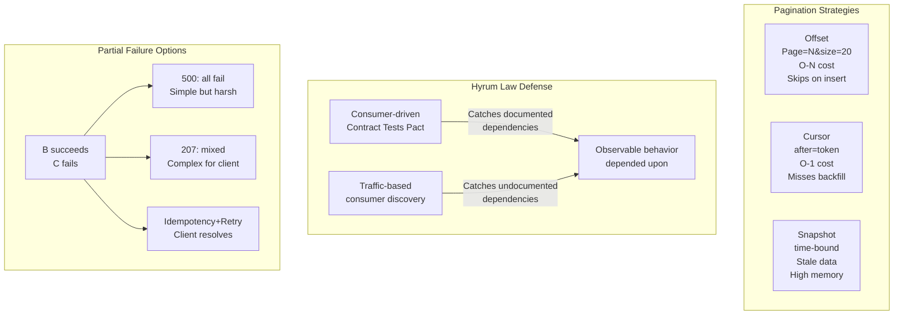

⚡ TL;DR - The genuinely hard, unsolved (or partially
solved) problems in API design: (1) pagination without
consistency guarantees (cursor-based pagination breaks
when items are inserted/deleted between pages), (2) backward
compatibility at schema level (Hyrum's Law: any observable
behavior becomes a dependency - you cannot safely change
anything), (3) distributed API error semantics (partial
failure in multi-API calls produces ambiguous partial
success states), (4) rate limiting fairness (how do you
rate limit without punishing legitimate burst traffic?),
(5) API contract testing at scale (how do you test that
all consumer contracts are satisfied after an API change?),
(6) long-running operation cancellation (if a client
disconnects during a 30-second operation, should the
server continue?); these are not solved by frameworks
or protocols - they require explicit design decisions
with known trade-offs.

---

| #084 | Category: HTTP & APIs | Difficulty: ★★★★★ |
|:---|:---|:---|
| **Depends on:** | Internal vs Public API, Versioning at Scale, Decision Framework, API Platform, GraphQL Spec | |
| **Used by:** | WebSocket Protocol Internals | |
| **Related:** | Internal vs Public API, Versioning, Decision Framework, Platform, Deprecation, GraphQL Spec, WebSocket, Contract Management | |

---

### 🔥 The Problem This Solves

**WORLD WITHOUT IT:**
Engineers repeatedly discover the same hard API design
problems independently - in every organization. A team
implements cursor pagination for their events API,
ships to production, and six months later discovers
users are experiencing "missing events" or "duplicate
events" during high-write periods. Another team
implements a perfectly documented REST API v2, sends
an email announcement, and breaks 12 consumers anyway
because of an undocumented behavior they relied on
(Hyrum's Law). These are not bugs - they are inherent
design problems that have no perfect solution, only
trade-offs. Understanding them prevents wasted time
discovering them from scratch.

---

### 📘 Textbook Definition

**Open Problems (not "unsolved" - known with trade-offs):**

**Problem 1 - Consistent Pagination:**
Cursor-based pagination provides a stable cursor pointing
to a position in a sorted list. But "position in a sorted
list" is undefined when the list changes between paginated
requests. Standard formulation: cursor is an opaque token
encoding row identity (not offset). New inserts before
cursor: do not appear in future pages (missed). Deletes
before cursor: cause "ghost rows" or gaps. No perfect
solution without locking the result set between requests.

**Problem 2 - Hyrum's Law:**
"With a sufficient number of users of an API, it does
not matter what you promise in the contract: all observable
behaviors of your system will be depended upon by somebody."
- Hyrum Wright (Google). The semantic gap between documented
contract and actual behavior. Consumers depend on:
response ordering (not promised), response time characteristics
(not documented), empty list vs null behavior, error message
text (parsed by some consumers), field ordering in JSON objects.

**Problem 3 - Partial Failure Semantics:**
A client calls API A, which calls APIs B and C. B succeeds,
C fails. What does A return? Option 1: 500 (but B's work
is lost from client perspective). Option 2: 207 Multi-Status
(but complex for clients to handle). Option 3: return B's
result and propagate C's error. No universal answer.

**Problem 4 - Rate Limit Fairness:**
Token bucket allows burst. But what is "fair"? A consumer
with 1000/hour allocation and 100/minute burst: is it fair
to allow 600 requests in the first minute then throttle
for the remaining 59 minutes? Sliding window prevents
burst exploitation but is computationally expensive.
Fixed window allows gaming (burst at end of window).

**Problem 5 - Contract Testing Coverage:**
Consumer-driven contract testing (Pact): each consumer
defines its expectations, server validates against all
consumer contracts. But: consumer tests only cover
documented interactions. Silent dependencies (ordering,
field presence, error text) are not contractually specified.
At 200 consumers: running all consumer tests takes hours.

**Problem 6 - Long-Running Operation Cancellation:**
Client calls `POST /reports/generate` (30-second operation).
Client disconnects (network drop, timeout, user navigates away).
Server has been computing for 15 seconds. Should server continue?
HTTP: no standard mechanism to detect client disconnection
mid-request and propagate cancellation to work threads.
gRPC: client cancellation propagates via CANCEL frame.
REST: partial work completed, resource consumed.

---

### ⏱️ Understand It in 30 Seconds

**One line:**
Pagination consistency, Hyrum's Law lock-in, partial failure
semantics, rate limit fairness, contract coverage, and
cancellation propagation are the genuinely hard API problems
with no perfect answers - only explicit trade-offs.

**One analogy:**
> These are the API design equivalent of distributed
> systems fundamental impossibilities (CAP theorem,
> FLP impossibility). You cannot have: consistent pagination
> + high write throughput + low latency simultaneously.
> You cannot have: zero Hyrum's Law dependencies + zero
> documentation + full consumer autonomy. Understanding
> these trade-offs prevents the mistake of "solving"
> a problem in a way that just moves the trade-off to
> a different location (e.g., solving pagination consistency
> by locking the result set - which kills write throughput).

---

### 🔩 First Principles Explanation

**Pagination: the three strategies and their failure modes:**

```
OFFSET PAGINATION: GET /orders?page=2&page_size=20
  Algorithm: SQL OFFSET 20 LIMIT 20
  Failure mode: Item inserted at position 15 between page 1 and 2.
    Page 1: shows items 1-20.
    Insert: item X added at position 15. List shifts.
    Page 2: SQL OFFSET 20 LIMIT 20 → shows items 21-40 (new numbering).
    Result: item 20 (old position) now at position 21 → skipped.
    Client never sees item 20. Missing record.
  Additional failure: O(N) query cost (OFFSET N requires scanning N rows).
  Performance degrades for large N. Page 10,000 = OFFSET 200000.

CURSOR PAGINATION: GET /orders?after=cursor_opaque_token
  Algorithm: cursor encodes: (sort_key, id) of last seen item.
    SQL: WHERE (created_at, id) > (cursor_created_at, cursor_id)
    ORDER BY created_at, id LIMIT 20
  Failure mode (inserts before cursor):
    cursor points at item created_at=2024-01-10, id=100.
    New items inserted with created_at=2024-01-08 (backdated import).
    These items precede cursor in sort order.
    They will NEVER appear in subsequent pages (cursor has passed them).
    Result: some records permanently missed.
  Failure mode (deletes):
    Item at cursor position is deleted.
    SQL uses (created_at, id) > (deleted_item). Safe: next items exist.
    No data loss. Just a "gap" in count display (shows 19 of 20 expected).
  Tradeoff: cursor pagination is BETTER than offset (no missing records
    for typical insert/delete patterns) but not PERFECT.

SNAPSHOT PAGINATION: Capture result set at request time
  Algorithm: execute query, store entire result in Redis with TTL.
    Each page reads from snapshot: no re-executing query.
  Failure mode: stale data (snapshot was taken 30 min ago).
  Cost: memory proportional to result set size × number of active paginations.
  Used by: Google Search results pages (snapshot per search session).
  Not practical for APIs: too expensive, too stale for most use cases.
```

---

### 🧪 Thought Experiment

**SCENARIO: Hyrum's Law in practice - a real breaking change that is not a breaking change**

```
API publishes JSON response with undocumented field ordering:
{
  "order_id": "123",
  "status": "processing",
  "total": 4999
}

Team decides to alphabetize JSON keys for aesthetic reasons:
{
  "order_id": "123",
  "status": "processing",
  "total": 4999
}
→ Wait: alphabetically: order_id, status, total
→ No change for these keys. But add a new key:
{
  "order_id": "123",
  "status": "processing",
  "total": 4999,
  "currency": "USD"
}
Alphabetical: currency, order_id, status, total.

Consumer A: Python dict (order-independent). No impact.
Consumer B: Java Jackson (order-independent). No impact.
Consumer C: Go struct (order-independent). No impact.
Consumer D: A Ruby client that parses the response
  byte-by-byte and uses the POSITION of "total" to
  extract data without parsing JSON properly.
  (This happens in real production systems.)
  Before: "total" is field index 2.
  After: "total" is field index 3 (currency came first alphabetically).
  Consumer D breaks.

JSON field order is NOT documented.
JSON spec: objects are UNORDERED.
Consumer D's behavior is clearly wrong.
But per Hyrum's Law: it is depending on an observable
behavior of the system.

The only safe change: never reorder JSON fields.
Or: accept that some consumers will break and treat it
as a documented breaking change with migration support.

LESSON: Hyrum's Law means "correct" changes can break consumers.
Pre-change validation requires running all consumer tests.
Not just unit tests - integration tests against actual consumer code.
```

---

### 🧠 Mental Model / Analogy

> These open problems are all instances of the same
> fundamental tension: API designers want to evolve,
> consumers want stability. Every change an API makes
> is an evolution. Every undocumented behavior that
> consumers depend on is stability they are not entitled
> to but receive in practice. The CAP theorem says you
> cannot have Consistency, Availability, and Partition
> Tolerance simultaneously. API design has an analogous
> trilemma: you cannot have Evolvability (change the API
> freely), Stability (consumers never break), and Low
> Coupling (consumers do not need to know implementation
> details) simultaneously. Choosing two forces a trade-off
> on the third.

---

### 📶 Gradual Depth - Five Levels

**Level 1 - What it is (anyone can understand):**
Some API design problems do not have perfect solutions.
For example: displaying a list of orders that may change
while you are browsing through pages is inherently hard -
some items may appear twice or be missed. These are
not bugs, they are fundamental trade-offs.

**Level 2 - How to use it (junior developer):**
Know these problems exist before you encounter them.
For pagination: use cursor-based, document that new items
inserted before the cursor may be missed. For versioning:
treat all observable behaviors (not just documented ones)
as breaking changes when you remove them. For long-running
operations: implement job IDs and status polling; clients
can reconnect to check status even after disconnection.

**Level 3 - How it works (mid-level engineer):**
Cursor pagination: encode a stable sort key (created_at + id)
in the cursor. Use the cursor as a WHERE clause predicate.
This is efficient (index-backed) and stable for typical
operations. For Hyrum's Law: use consumer-driven contract
tests (Pact) to discover undocumented dependencies before
changing. For partial failure: use idempotency keys + status
check endpoint so clients can determine if their operation
succeeded despite a disconnect.

**Level 4 - Why it was designed this way (senior/staff):**
Stripe's solution to the long-running operation cancellation
problem: idempotency + async job pattern. POST creates a
job (synchronous, returns job ID). Client polls GET /jobs/ID.
If client disconnects: job continues on server. Client
reconnects and checks status. Final state is persistent
(stored in DB). This decouples the HTTP request lifetime
from the operation lifetime. The trade-off: clients must
poll (instead of streaming). Alternatively: use WebSocket
or SSE to push final state when the job completes.

**Level 5 - Mastery (distinguished engineer):**
The deepest form of Hyrum's Law: performance characteristics.
Google's API team has documented cases where clients
depend on server response time. Example: client code
has a `time.sleep(response.duration * 1.1)` to avoid
overwhelming the server (adapted to server speed).
When Google optimized the server (10× faster): clients
started polling 10× more frequently, overwhelming the
server. Speed improvement = service overload. The solution:
rate limit based on absolute quotas, not relative speed.
This extends Hyrum's Law to performance: "any performance
characteristic that consumers observe (latency, throughput,
ordering) will be depended upon by some consumer."

---

### ⚙️ How It Works (Mechanism)

**Cursor pagination (implementation):**

```python
import base64, json
from fastapi import FastAPI, Query
from typing import Optional

app = FastAPI()

def encode_cursor(created_at: str, order_id: str) -> str:
    """Encode cursor as base64-JSON of sort position."""
    payload = json.dumps({"created_at": created_at, "id": order_id})
    return base64.b64encode(payload.encode()).decode()

def decode_cursor(cursor: str) -> dict:
    """Decode cursor back to sort position."""
    payload = base64.b64decode(cursor.encode()).decode()
    return json.loads(payload)

@app.get("/orders")
async def list_orders(
    limit: int = Query(default=20, le=100, ge=1),
    after: Optional[str] = None,  # cursor
):
    """
    Cursor-based pagination.
    Consistent for typical insert/update patterns.
    Known limitation: items inserted BEFORE cursor position
    will not appear in subsequent pages.
    """
    if after:
        cursor = decode_cursor(after)
        # Efficient: uses (created_at, id) compound index
        orders = await db.fetch_all(
            """
            SELECT * FROM orders
            WHERE (created_at, id) > ($1::timestamptz, $2)
            ORDER BY created_at ASC, id ASC
            LIMIT $3
            """,
            cursor["created_at"],
            cursor["id"],
            limit + 1,  # Fetch one extra to detect hasNextPage
        )
    else:
        orders = await db.fetch_all(
            """
            SELECT * FROM orders
            ORDER BY created_at ASC, id ASC
            LIMIT $1
            """,
            limit + 1,
        )

    has_next = len(orders) > limit
    orders = orders[:limit]
    next_cursor = None
    if has_next and orders:
        last = orders[-1]
        next_cursor = encode_cursor(
            str(last["created_at"]), str(last["id"])
        )

    return {
        "data": orders,
        "pagination": {
            "next_cursor": next_cursor,
            "has_next_page": has_next,
        },
        "meta": {
            "limit": limit,
            "note": (
                "Items inserted before the current page position "
                "may not appear in subsequent pages."
            ),
        },
    }
```

**Partial failure response (207 Multi-Status pattern):**

```python
from fastapi import FastAPI
from fastapi.responses import JSONResponse

app = FastAPI()

@app.post("/orders/bulk-update")
async def bulk_update_orders(updates: list[OrderUpdate]):
    """
    Batch operation: partial success pattern.
    Returns 207 Multi-Status with per-item results.
    Clients MUST check individual item statuses.
    """
    results = []
    any_success = False
    any_failure = False

    for update in updates:
        try:
            await update_order(update.order_id, update.data)
            results.append({
                "order_id": update.order_id,
                "status": 200,
                "result": "updated",
            })
            any_success = True
        except OrderNotFoundError:
            results.append({
                "order_id": update.order_id,
                "status": 404,
                "error": "Order not found",
            })
            any_failure = True
        except Exception as e:
            results.append({
                "order_id": update.order_id,
                "status": 500,
                "error": "Internal error",
            })
            any_failure = True

    if any_success and any_failure:
        status_code = 207  # Multi-Status: partial success
    elif any_failure:
        status_code = 500  # All failed
    else:
        status_code = 200  # All succeeded

    return JSONResponse(
        status_code=status_code,
        content={"results": results},
    )
```



---

### 🔄 The Complete Picture - End-to-End Flow

**Long-running operation with cancellation support:**

```python
import asyncio
from enum import Enum
from uuid import uuid4

class JobStatus(Enum):
    PENDING = "pending"
    RUNNING = "running"
    COMPLETED = "completed"
    CANCELLED = "cancelled"
    FAILED = "failed"

# In-memory job store (use Redis in production)
jobs: dict[str, dict] = {}

@app.post("/reports/generate", status_code=202)
async def generate_report(
    request: ReportRequest, background_tasks: BackgroundTasks
):
    """
    Long-running operation: async job pattern.
    Returns immediately with job_id.
    Client polls /jobs/{id} for status and result.
    Even if client disconnects: job continues on server.
    """
    job_id = str(uuid4())
    jobs[job_id] = {"status": JobStatus.PENDING, "result": None}
    background_tasks.add_task(run_report_job, job_id, request)
    return {"job_id": job_id, "status_url": f"/jobs/{job_id}"}

@app.get("/jobs/{job_id}")
async def get_job_status(job_id: str):
    """Client polls this to check job completion."""
    job = jobs.get(job_id)
    if not job:
        raise HTTPException(status_code=404)
    return job

@app.delete("/jobs/{job_id}")
async def cancel_job(job_id: str):
    """
    Client-initiated cancellation.
    Sets cancellation flag; running task checks it.
    """
    job = jobs.get(job_id)
    if not job:
        raise HTTPException(status_code=404)
    jobs[job_id]["cancel_requested"] = True
    return {"status": "cancellation requested"}

async def run_report_job(job_id: str, request: ReportRequest):
    jobs[job_id]["status"] = JobStatus.RUNNING
    try:
        for chunk_index in range(100):  # Long-running processing
            if jobs[job_id].get("cancel_requested"):
                jobs[job_id]["status"] = JobStatus.CANCELLED
                return
            await asyncio.sleep(0.1)  # Simulate work
            # Check cancellation between chunks
        jobs[job_id]["status"] = JobStatus.COMPLETED
        jobs[job_id]["result"] = {"report_url": "..."}
    except Exception as e:
        jobs[job_id]["status"] = JobStatus.FAILED
        jobs[job_id]["error"] = str(e)
```

---

### 💻 Code Example

**Example 1 - BAD: Rate limiting with fixed window (gameable)**

```python
# BAD: Fixed window rate limiter - gameable at window boundary
import time
from collections import defaultdict

request_counts = defaultdict(int)
window_start = defaultdict(float)
LIMIT = 100  # 100 requests per minute

def is_rate_limited_bad(api_key: str) -> bool:
    now = time.time()
    window = int(now // 60)  # Fixed 1-minute windows
    key = f"{api_key}:{window}"
    request_counts[key] += 1
    # GAMEABLE: at window boundary
    # 59:50 → 100 requests in last 10 seconds of window
    # 00:10 → 100 requests in first 10 seconds of next window
    # Result: 200 requests in 20 seconds. Limit bypassed.
    return request_counts[key] > LIMIT

# GOOD: Sliding window (Redis sorted set)
import redis.asyncio as redis

redis_client = redis.Redis()
WINDOW_SECONDS = 60
LIMIT = 100

async def is_rate_limited_sliding(api_key: str) -> bool:
    """
    Sliding window rate limiter using Redis sorted set.
    Counts requests in the last WINDOW_SECONDS.
    Cannot be gamed by window boundary.
    Cost: O(log N) per request for ZADD + ZREMRANGEBYSCORE.
    """
    now = time.time()
    window_start = now - WINDOW_SECONDS
    key = f"rate:{api_key}"

    pipeline = redis_client.pipeline()
    pipeline.zadd(key, {str(now): now})  # Add current request
    pipeline.zremrangebyscore(key, 0, window_start)  # Remove old
    pipeline.zcard(key)  # Count in window
    pipeline.expire(key, WINDOW_SECONDS + 1)  # TTL
    results = await pipeline.execute()

    count = results[2]
    return count > LIMIT
```

---

### ⚖️ Comparison Table

| Problem | Best Current Solution | Known Limitations | Accepted Trade-off |
|:---|:---|:---|:---|
| **Pagination consistency** | Cursor-based (sort key + id) | Backfilled items missed | Efficiency over perfect consistency |
| **Hyrum's Law** | Consumer-driven contract tests (Pact) | Does not catch performance dependencies | Documentation never complete |
| **Partial failure** | Idempotency + async job + status endpoint | Client complexity (must handle async) | Reliability over simplicity |
| **Rate limit fairness** | Sliding window (Redis sorted set) | O(N) memory, computationally expensive | Fairness over efficiency |
| **Contract coverage** | Pact + traffic-based consumer discovery | Undocumented behaviors never fully captured | Test coverage never 100% |
| **Cancellation propagation** | Client cancel + job status endpoint; gRPC CANCEL frame | REST has no native cancel propagation | gRPC better than REST here |

---

### ⚠️ Common Misconceptions

| Misconception | Reality |
|:---|:---|
| Cursor pagination solves all pagination problems | Cursor pagination solves the OFFSET problem (O(N) cost, skipped records on insert-before). It does NOT solve the consistency problem for backfilled inserts (items with created_at earlier than the cursor are permanently missed). For most APIs: this trade-off is acceptable (typical inserts happen in real-time, not backfilled). For financial or audit APIs that may receive backdated data: cursor pagination will miss backdated items, and the product must decide if this is acceptable or if a different pattern (event log with seq IDs) is needed. |
| Documenting your API prevents Hyrum's Law | Documentation only covers intentional behavior. Hyrum's Law applies to unintentional, observable behavior: response ordering, response time, field presence in error responses, empty array vs null for missing lists. Even with perfect documentation: some consumer will depend on something you did not intend to be part of the contract. The defense: versioned APIs (new version for breaking changes, even unintentional ones), consumer-driven contract tests to surface hidden dependencies before changes reach production. |
| HTTP 207 is the solution for partial success | HTTP 207 Multi-Status exists but is rarely used outside WebDAV. The semantics are well-defined but uncommon. Most REST frameworks do not have special handling for 207. The practical alternative to 207 for batch APIs: return 200 with a body that contains per-item status. `{"results": [{"id": "1", "status": 200}, {"id": "2", "status": 404}]}`. Client parses the body-level status. This is less "correct" per HTTP spec but more widely understood by developers and tooling. Both are valid choices with explicit trade-offs. |

---

### 🚨 Failure Modes & Diagnosis

**Cursor pagination missing backfilled records**

**Symptom:** Data import job backfills 10,000 orders
with timestamps from 30 days ago. Client paginates
through orders (cursor-based, sorted by created_at).
Orders from 30 days ago do not appear in any page.
Data integrity check shows orders exist in DB but are
never returned by the paginated API.

**Root Cause:** Cursor encodes `created_at=today-N`.
Backfilled orders have `created_at=30 days ago`.
SQL WHERE: `(created_at, id) > (cursor_created_at, cursor_id)`.
Backfilled orders' `created_at` (30 days ago) is LESS THAN
cursor_created_at. They never appear.

**Diagnosis:**
```sql
-- Verify records exist but are behind the cursor:
SELECT count(*) FROM orders
WHERE created_at < '2024-01-10'  -- cursor timestamp
AND created_at > '2023-12-01';   -- backfill range
-- → Returns 10000 (records exist, cursor has passed them)
```

**Resolution options:**
1. Accept: document this as a known limitation.
   Backfill imports should be re-paginated from the beginning.
2. Use sequential ID cursor instead of timestamp cursor:
   IDs are monotonic - backfilled orders would have new IDs
   (not old), so they appear in subsequent pages.
3. Use offset for admin APIs that need full consistency;
   cursor for user-facing high-traffic pagination.

---

### 🔗 Related Keywords

**Prerequisites (understand these first):**
- `API Versioning at Scale` - versioning strategy for Hyrum's Law
- `Internal vs Public API Design` - audience affects which problems apply

**Builds On This (learn these next):**
- `WebSocket Protocol Internals` - cancellation + bidirectional push
- `API Design as Contract Management` - Hyrum's Law formalization

---

### 📌 Quick Reference Card

```
┌──────────────────────────────────────────────────────────┐
│ Pagination   │ Cursor > offset. Doc missed-backfill risk │
│              │ Use seq IDs if backfill is common.        │
├──────────────┼───────────────────────────────────────────┤
│ Hyrum's Law  │ Any observable behavior becomes dependency│
│              │ Pact contract tests surface hidden deps   │
├──────────────┼───────────────────────────────────────────┤
│ Partial fail │ Job ID + status endpoint (async pattern)  │
│              │ Idempotency key for safe retry            │
├──────────────┼───────────────────────────────────────────┤
│ Rate limit   │ Sliding window (Redis ZSET). Not fixed    │
│              │ window (gameable at boundary).            │
├──────────────┼───────────────────────────────────────────┤
│ Cancellation │ REST: job ID + cancel endpoint.           │
│              │ gRPC: CANCEL frame propagates natively.  │
├──────────────┼───────────────────────────────────────────┤
│ ONE-LINER    │ "No perfect pagination, no full Hyrum     │
│              │  defense, no universal partial failure    │
│              │  semantics. Explicit trade-offs always."  │
└──────────────────────────────────────────────────────────┘
```

**If you remember only 3 things:**
1. Cursor pagination is better than offset but not perfect.
   Backfilled items (earlier timestamp than cursor) are
   permanently missed. Document this limitation explicitly.
2. Hyrum's Law: consumers depend on unintentional behaviors.
   Use Pact consumer-driven contract tests to surface these
   before you change something that breaks a consumer.
3. For long-running operations: return a job ID immediately
   (202 Accepted), client polls status. Client disconnect
   does not cancel the job. Client cancels via DELETE /jobs/ID.

---

### 💎 Transferable Wisdom

**Reusable Engineering Principle:**
"Every observable behavior is a contract, whether you
intended it or not." This is Hyrum's Law. The engineering
response is not to document more - it is to test what
consumers actually depend on (Pact), reduce observable
surface (minimize implicit behaviors), and version explicitly
when changing. The deeper lesson: distributed system
interfaces (APIs, message schemas, database schemas,
event formats) are all subject to this principle.
Any observable behavior of any interface will be depended
upon by downstream systems. The discipline: make your
contract explicit, make your non-contract behavior
unpredictable (randomize JSON field order to prevent
order dependencies), and test consumer dependencies
before breaking changes.

**Where else this pattern applies:**
- Database schema changes: column order, index selectivity,
  query plan stability are all Hyrum's Law dependencies
  for ORMs and query builders
- OS syscall interfaces: Linux ABI stability is maintained
  because applications depend on undocumented behaviors
- Kafka topic schema: message ordering, partition assignment,
  consumer group offset behavior - all consumed by downstream

---

### 💡 The Surprising Truth

The most dangerous Hyrum's Law dependency in modern API
design is not JSON field ordering or response time - it
is error message text. Thousands of production applications
have code like this: `if "not found" in error_message.lower():
retry_with_fallback()`. Or a Slack bot that sends an alert
when the error message contains "circuit breaker." Or
a monitoring dashboard that counts "timeout" in error
messages. Error message text is never documented as part
of the contract. API teams change error messages routinely
("Order not found" → "Order {id} does not exist").
Consumers who parse error message text break silently
(no exception, just wrong behavior). The defense:
structured error codes (`error.type = "ORDER_NOT_FOUND"`)
that are versioned and stable. Error message text is
for humans (display in UI). Error codes are for machines
(parse in code). If your API only returns string error
messages without stable codes: you have already created
a Hyrum's Law dependency on that text for every consumer
who wrote code that touches the error field.

---

### ✅ Mastery Checklist

**You've mastered this when you can:**
1. **IMPLEMENT** Cursor-based pagination with compound
   sort key (created_at + id) and document the backfill
   limitation explicitly.
2. **CONFIGURE** Pact consumer-driven contract tests
   between two services and run them in CI.
3. **DESIGN** A partial failure response for a batch
   operation that clients can reliably consume.
4. **IMPLEMENT** A sliding window rate limiter using
   Redis sorted sets.
5. **EXPLAIN** Hyrum's Law and give three examples of
   unintentional API behaviors that consumers might depend on.

---

### 🎯 Interview Deep-Dive

**Q1: What are the limitations of cursor-based pagination
and how would you handle backfilled data?**

*Why they ask:* Tests pagination depth beyond "use cursor not offset."

*Strong answer includes:*
- How cursor works: encode (sort_key, id) of last seen item
  in cursor. SQL uses WHERE (sort_key, id) > (cursor_sort_key,
  cursor_id). Efficient (index-backed), no O(N) offset cost.
- The backfill problem: cursor encodes a point in time.
  Items inserted with a timestamp BEFORE that point will
  never appear in subsequent pages. If created_at = today
  is the cursor: yesterday's backdated import items will
  never be seen (their timestamp is before the cursor).
- Mitigation options:
  (1) Use sequential monotonic IDs (not timestamps) as cursor key.
  Backfilled items get new IDs (always after existing IDs).
  They appear in subsequent pages. Cost: cannot paginate
  by time; only by insertion order.
  (2) Document the limitation. For financial APIs: backfills
  require re-pagination from the beginning (API consumer
  responsibility).
  (3) For admin/audit APIs that MUST see all records: use
  offset-based pagination with a snapshot (materialized view
  with a stable sequence number for each item). Expensive
  but consistent.

**Q2: How do you handle Hyrum's Law when evolving a
widely-used API?**

*Why they ask:* Tests API evolution strategy depth.

*Strong answer includes:*
- Consumer-driven contract tests (Pact): each consumer
  writes tests that describe their expectations of the
  API. These are shared with the provider. Provider runs
  all consumer contract tests on every change. If any
  consumer contract fails: change is blocked. This surfaces
  dependencies before production.
- Traffic-based consumer discovery: log every API call
  with consumer identity (API key, User-Agent). Before
  any change: query logs for "who has called this endpoint
  in the last 90 days?" Reach out to every consumer.
  Do not rely on consumer self-registration.
- Minimize observable surface:
  (1) Randomize JSON field order (prevents field-order dependencies).
  (2) Use structured error codes, not just message text.
  (3) Avoid behaviors that are "technically undefined" in docs
  but observable: response time patterns, field presence
  in edge cases, empty array vs null.
- Version explicitly for breaking changes: even "harmless"
  changes (alphabetizing fields) should go through a version
  bump if they are in a public API, because Hyrum's Law
  guarantees someone depends on the current behavior.
