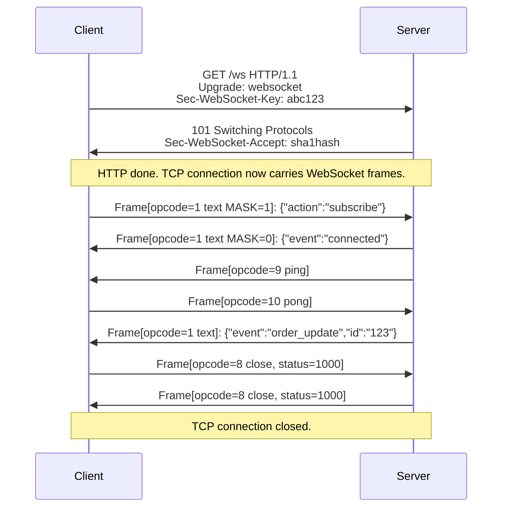

⚡ TL;DR - WebSocket (RFC 6455) is an HTTP-upgraded,
bidirectional, full-duplex protocol running over TCP.
Upgrade handshake: client sends `Upgrade: websocket`
header; server responds 101 Switching Protocols; from
that point the same TCP connection carries WebSocket
frames, not HTTP. Frame format: 2-14 byte header +
payload (FIN bit, opcode, MASK bit, payload length).
Client-to-server frames MUST be masked (XOR with 4-byte
key). Server-to-client frames MUST NOT be masked.
Key failure modes: (1) proxy buffering (HTTP proxies
buffer data, breaking the "persistent connection" until
the HTTP response "finishes" - never, for WebSocket),
(2) Nginx `proxy_read_timeout` killing idle connections
before application-level heartbeat fires, (3) backpressure
missing at application layer causing memory bloat when
the server produces faster than the client consumes.
gRPC bidirectional streaming solves the same problem
as WebSocket but within HTTP/2; SSE solves server push
(not bidirectional) within HTTP/1.1.

---

| #085 | Category: HTTP & APIs | Difficulty: ★★★★☆ |
|:---|:---|:---|
| **Depends on:** | HTTP Fundamentals, REST Dissertation, RFC 7230-7235 | |
| **Used by:** | API Design as Contract Management | |
| **Related:** | HTTP Fundamentals, REST Dissertation, RFC 7230, Event-Driven APIs, Contract Management, Rate Limiting | |

---

### 🔥 The Problem This Solves

**WORLD WITHOUT IT:**
HTTP is request-response. Client sends request, server
sends response, connection closes (or is kept alive for
the next request). For real-time applications (trading
dashboards, live collaborative editing, multiplayer games,
chat applications, live sports scores): HTTP requires
polling. Client polls every 500ms: `GET /messages/new`.
At 1,000 concurrent users: 2,000 requests/second for
no data 99% of the time. Long-polling improves this
(server holds the request open until data is available)
but creates complex server state and limits requests-per-
connection throughput. Server-Sent Events solves server-to-
client push but is unidirectional. WebSocket solves both:
low-latency bidirectional communication over a persistent
TCP connection that starts as HTTP.

---

### 📘 Textbook Definition

**RFC 6455 WebSocket Protocol:**
Published in December 2011. Upgrades an HTTP/1.1 connection
to a WebSocket connection. After the upgrade handshake:
the connection is a raw TCP stream using the WebSocket
framing protocol. HTTP is no longer used for data transfer.

**Upgrade handshake (HTTP/1.1 only):**
1. Client sends:
   - `GET /chat HTTP/1.1`
   - `Upgrade: websocket`
   - `Connection: Upgrade`
   - `Sec-WebSocket-Key: dGhlIHNhbXBsZSBub25jZQ==` (16-byte random, base64)
   - `Sec-WebSocket-Version: 13`
2. Server responds:
   - `HTTP/1.1 101 Switching Protocols`
   - `Upgrade: websocket`
   - `Connection: Upgrade`
   - `Sec-WebSocket-Accept: s3pPLMBiTxaQ9kYGzzhZRbK+xOo=`
     (SHA-1 of Sec-WebSocket-Key + "258EAFA5-E914-47DA-95CA-C5AB0DC85B11")
3. After 101: TCP connection carries WebSocket frames. HTTP done.

**WebSocket Frame Format (RFC 6455, Section 5.2):**
```
Bit:  0 1 2 3 4 5 6 7 8 9 0 1 2 3 4 5 6 7
      +-+-+-+-+-------+-+-------------+------
      |F|R|R|R| opcode|M| Payload len |
      |I|S|S|S|  (4)  |A| (7)         |
      |N|V|V|V|       |S|             |
      | |1|2|3|       |K|             |
      +-+-+-+-+-------+-+-------------+
      FIN: 1 = final fragment
      Opcode: 0=continuation, 1=text, 2=binary,
              8=close, 9=ping, 10=pong
      MASK: 1 = payload is masked (client to server)
      Payload len: 0-125=length, 126=next 2 bytes
                   are length, 127=next 8 bytes
```

**Masking:**
Client-to-server frames MUST be masked. 4-byte masking key
chosen randomly per frame. Payload XOR'd with cycling
key bytes. Purpose: prevents cache poisoning attacks
on HTTP intermediaries that might mistake WebSocket
data for HTTP responses.

**Control Frames:**
- Ping (opcode 9): keepalive sent by either side.
- Pong (opcode 10): required response to ping.
- Close (opcode 8): initiates graceful close. Payload
  contains 2-byte status code (1000=normal, 1001=away,
  1011=server error). Both sides send Close before
  closing TCP.

---

### ⏱️ Understand It in 30 Seconds

**One line:**
WebSocket upgrades HTTP/1.1 to a bidirectional TCP stream
using a single handshake; after the 101 response, both
sides send raw frames - no request/response cycle, no headers
per message - enabling sub-millisecond real-time communication.

**One analogy:**
> HTTP is a postal service: you write a letter (request),
> mail it, wait for a reply (response), then write again.
> WebSocket is a phone call: after dialing (handshake),
> both sides talk freely without waiting for the other
> to finish. The "dialing" happens over the existing
> postal infrastructure (TCP/port 80 or 443), which is
> why WebSocket can traverse most firewalls and proxies
> that would block raw TCP on other ports.

---

### 🔩 First Principles Explanation

**Why the upgrade mechanism (not a new protocol on a new port):**

Firewalls and corporate proxies block ports 443 (HTTPS)
and 80 (HTTP) very rarely. A protocol on port 7777 would
be blocked by most enterprise firewalls. By upgrading
from HTTP, WebSocket inherits the allowed-port status of
HTTP/HTTPS. Port 80 = ws://, port 443 = wss://.

**Why masking is required (and why it is not encryption):**
In 2010, Michal Zalewski demonstrated that transparent
HTTP proxies could be poisoned: an attacker-controlled
WebSocket frame that looks like an HTTP response could
cause the proxy to cache malicious content. Masking
prevents the WebSocket data stream from containing
recognizable HTTP response bytes. Masking does NOT
provide confidentiality - the masking key is transmitted
in the same frame. Use wss:// (TLS) for confidentiality.

**Why HTTP/2 WebSocket (RFC 8441) exists:**
HTTP/2 multiplexes many streams over one TCP connection.
WebSocket requires upgrading the entire HTTP/1.1 connection.
RFC 8441 (2018) defines WebSocket over HTTP/2 using the
CONNECT method with protocol=websocket. This allows
WebSocket streams to coexist with HTTP/2 streams on the
same connection. Browser support as of 2024: Chrome, Firefox
(not all environments). Not yet universal.

---

### 🧪 Thought Experiment

**SCENARIO: Why does WebSocket break through (most) HTTP proxies
but fail through others?**

```
Client → HTTP Proxy → Server

1. Client sends CONNECT or Upgrade request.
2. Proxy sees "Upgrade: websocket".
3. Two proxy behaviors:

   TRANSPARENT PROXY (most):
   Forwards the GET+Upgrade headers to server.
   Server responds 101. Proxy forwards 101 to client.
   Proxy enters "tunnel mode": bytes flow through
   without HTTP parsing. WebSocket works.

   INTERCEPTING/CONTENT-INSPECTION PROXY:
   Proxy terminates TLS (for inspection).
   Proxy may not support Upgrade: websocket.
   Proxy may buffer the "HTTP response" waiting for
   Content-Length or Transfer-Encoding: chunked.
   101 Switching Protocols: proxy does not enter tunnel mode.
   WebSocket frames accumulate in proxy buffer.
   Client receives no data. Connection eventually times out.

4. TEST: Does wss:// (TLS) fix it?
   For intercepting proxies that do not terminate TLS: yes
   (proxy cannot inspect encrypted traffic, tunnels it).
   For intercepting proxies that DO terminate TLS: no
   (proxy still inspects and blocks Upgrade).

CONCLUSION: WebSocket may fail in enterprise environments
with full TLS inspection. Mitigation: use long-polling
fallback (socket.io does this), or ensure wss:// is used
and negotiate with network team to allowlist WebSocket
traffic on proxy.
```

---

### 🧠 Mental Model / Analogy

> WebSocket framing is a lightweight wrapper around raw
> TCP. Compare to HTTP/2: HTTP/2 has elaborate binary
> framing with stream IDs, flow control, HPACK header
> compression, and priority. WebSocket has 2-14 byte
> frames with opcodes. WebSocket is intentionally minimal:
> multiplexing is not built in (one logical channel per
> connection), flow control is not built in (application
> must implement backpressure), compression is optional
> extension (permessage-deflate, RFC 7692). This minimalism
> is both a strength (simple to implement, low overhead)
> and a weakness (every application reinvents heartbeating,
> reconnection, backpressure, and multiplexing). Libraries
> like socket.io wrap WebSocket with these missing features.

---

### 📶 Gradual Depth - Five Levels

**Level 1 - What it is (anyone can understand):**
WebSocket is how web browsers and servers do real-time
communication. Instead of the browser asking "any new
messages?" every second, WebSocket keeps a persistent
connection open so the server can send data immediately
when it is available. Used in: chat, live sports scores,
trading dashboards, collaborative editing (Google Docs).

**Level 2 - How to use it (junior developer):**
Browser: `const ws = new WebSocket('wss://api.example.com/ws');`
`ws.onmessage = (event) => console.log(event.data);`
`ws.send(JSON.stringify({action: 'subscribe', channel: 'orders'}));`
Server (FastAPI): `@app.websocket("/ws")` with `await ws.accept()`,
`await ws.receive_text()`, `await ws.send_text()`.

**Level 3 - How it works (mid-level engineer):**
HTTP handshake with Upgrade header. Server returns 101.
TCP connection carries WebSocket frames. Frame header:
FIN bit, opcode (1=text, 2=binary, 8=close, 9=ping, 10=pong),
MASK bit, payload length (7-bit or extended for larger payloads).
Client frames are masked (XOR). Server frames are not.
Heartbeat: client or server sends Ping; other side must
respond with Pong. If pong not received within timeout:
connection considered dead, close and reconnect.

**Level 4 - Why it was designed this way (senior/staff):**
WebSocket was designed under the constraint that it must
work with existing HTTP infrastructure (firewalls, proxies,
load balancers) and require no new ports. The Upgrade
mechanism reuses port 80/443. The random masking key per
frame prevents transparent proxy cache poisoning. The
lack of built-in multiplexing is intentional: WebSocket
is a transport. Applications that need multiplexing
should use application-level channels (subscribe/unsubscribe
to named channels) or use WebSocket over HTTP/2 (RFC 8441)
for OS-level stream multiplexing.

**Level 5 - Mastery (distinguished engineer):**
WebSocket at scale requires solving three problems that
the protocol deliberately omits:
(1) Fan-out: 1 server event must reach 10,000 connected clients.
HTTP/2 with SSE is actually better here (HTTP/2 multiplexes
multiple SSE streams over fewer TCP connections at the OS level).
WebSocket requires one TCP connection per client - at 100,000
clients: 100,000 TCP connections. OS file descriptor limits
(ulimit -n), ephemeral port exhaustion on load balancer,
keepalive memory cost per idle connection.
(2) Sticky routing: WebSocket connections land on one
server process. Horizontal scaling requires a shared
pub/sub layer (Redis pub/sub, Kafka topic) so any process
can publish to any connected client, regardless of which
server holds the connection.
(3) Reconnection with state recovery: client disconnects,
reconnects to a different server (after scale event or restart),
must re-subscribe to channels and recover missed messages.
Protocol: client sends `?last_event_id=X` on reconnect;
server replays events from X forward. SSE has this built in
(Last-Event-ID header). WebSocket requires application implementation.

---

### ⚙️ How It Works (Mechanism)

**Handshake verification:**

```python
import hashlib, base64

WEBSOCKET_GUID = "258EAFA5-E914-47DA-95CA-C5AB0DC85B11"

def compute_accept_key(sec_websocket_key: str) -> str:
    """
    RFC 6455 Section 4.2.2:
    Server computes Sec-WebSocket-Accept from client key.
    Prevents non-WebSocket responses from being accepted.
    """
    combined = sec_websocket_key + WEBSOCKET_GUID
    sha1_hash = hashlib.sha1(combined.encode()).digest()
    return base64.b64encode(sha1_hash).decode()

# Example:
key = "dGhlIHNhbXBsZSBub25jZQ=="
accept = compute_accept_key(key)
print(accept)  # s3pPLMBiTxaQ9kYGzzhZRbK+xOo=
# This matches RFC 6455 Appendix B example.
```

**Frame masking (client to server):**

```python
def mask_payload(masking_key: bytes, payload: bytes) -> bytes:
    """
    RFC 6455 Section 5.3:
    Payload masked by XOR with cycling 4-byte masking key.
    Same function is used for masking AND unmasking.
    """
    return bytes(
        payload[i] ^ masking_key[i % 4]
        for i in range(len(payload))
    )

# Masking key is 4 bytes chosen randomly per frame.
# Transmitted in frame header alongside masked payload.
# Masking key is NOT secret - it is in the frame.
# Purpose: prevent proxy cache poisoning, not encryption.
```

**ASCII frame structure:**

```
 0                   1                   2
 0 1 2 3 4 5 6 7 8 9 0 1 2 3 4 5 6 7 8 9 0 1 2 3
+-+-+-+-+-------+-+-------------+
|F|R|R|R| opcode|M|  Payload    |
|I|S|S|S| (4b)  |A|  len (7b)   |
|N|V|V|V|       |S|             |
+-+-+-+-+-------+-+-------------+
  Then (if MASK=1): 4 bytes masking key
  Then payload bytes (possibly masked)

  FIN=1: this frame is the final fragment.
  RSV1-3: reserved (must be 0 unless extension negotiated).
  Opcodes:
    0x0  continuation
    0x1  text (UTF-8)
    0x2  binary
    0x8  close
    0x9  ping
    0xA  pong
```



---

### 🔄 The Complete Picture - End-to-End Flow

**FastAPI WebSocket server with heartbeat and fan-out:**

```python
from fastapi import FastAPI, WebSocket, WebSocketDisconnect
from contextlib import asynccontextmanager
import asyncio, json
from typing import Any

app = FastAPI()

class ConnectionManager:
    def __init__(self):
        # channel -> set of WebSocket connections
        self.channels: dict[str, set[WebSocket]] = {}

    async def subscribe(
        self, ws: WebSocket, channel: str
    ):
        self.channels.setdefault(channel, set()).add(ws)

    def unsubscribe(self, ws: WebSocket, channel: str):
        self.channels.get(channel, set()).discard(ws)

    async def broadcast(
        self, channel: str, message: Any
    ):
        """Fan-out: send to all connections in channel."""
        dead: set[WebSocket] = set()
        for ws in self.channels.get(channel, set()):
            try:
                await ws.send_json(message)
            except Exception:
                dead.add(ws)
        # Cleanup dead connections
        self.channels.get(channel, set()).difference_update(dead)

manager = ConnectionManager()

@app.websocket("/ws")
async def websocket_endpoint(ws: WebSocket):
    await ws.accept()
    channel = None
    heartbeat_task = None

    async def heartbeat():
        """Application-level heartbeat (above TCP keepalive)."""
        while True:
            await asyncio.sleep(25)  # Every 25 seconds
            try:
                await ws.send_json({"type": "ping"})
            except Exception:
                return  # Connection dead

    try:
        heartbeat_task = asyncio.create_task(heartbeat())

        while True:
            data = await ws.receive_json()
            action = data.get("action")

            if action == "subscribe":
                channel = data.get("channel", "default")
                await manager.subscribe(ws, channel)
                await ws.send_json({
                    "type": "subscribed",
                    "channel": channel,
                })

            elif action == "pong":
                pass  # Client responded to heartbeat

            elif action == "message":
                if channel:
                    await manager.broadcast(channel, {
                        "type": "message",
                        "data": data.get("payload"),
                    })

    except WebSocketDisconnect:
        pass
    finally:
        if channel:
            manager.unsubscribe(ws, channel)
        if heartbeat_task:
            heartbeat_task.cancel()
```

---

### 💻 Code Example

**Example 1 - BAD: Missing backpressure (unbounded memory growth)**

```python
# BAD: Server sends faster than client consumes.
# No backpressure. Memory grows unbounded.
@app.websocket("/stream")
async def stream_events_bad(ws: WebSocket):
    await ws.accept()
    while True:
        events = await get_events_from_db()  # Fast
        for event in events:
            # BAD: No check if client is consuming.
            # WebSocket send buffer fills. Then OS TCP
            # send buffer fills. Then OOM.
            await ws.send_json(event)
        await asyncio.sleep(0.01)  # 100 events/second

# GOOD: Use asyncio.wait_for to implement backpressure
# via send timeout + queue with max size
import asyncio
from asyncio import Queue

@app.websocket("/stream")
async def stream_events_good(ws: WebSocket):
    await ws.accept()
    queue: Queue = Queue(maxsize=100)  # Bounded queue

    async def producer():
        """Produces events, blocks when queue is full."""
        while True:
            events = await get_events_from_db()
            for event in events:
                await queue.put(event)  # Blocks if full
            await asyncio.sleep(0.01)

    async def consumer():
        """Sends queued events to WebSocket client."""
        while True:
            event = await queue.get()
            try:
                await asyncio.wait_for(
                    ws.send_json(event),
                    timeout=5.0,  # Client must consume in 5s
                )
            except asyncio.TimeoutError:
                # Client is too slow. Drop or disconnect.
                await ws.close(code=1008)
                return

    producer_task = asyncio.create_task(producer())
    try:
        await consumer()
    finally:
        producer_task.cancel()
```

**Example 2 - Nginx configuration for WebSocket proxying**

```nginx
# WRONG: Nginx closes WebSocket connections after 60s
# (default proxy_read_timeout).
upstream websocket_backend {
    server app:8000;
}

server {
    location /ws {
        proxy_pass http://websocket_backend;
        # Missing: proxy_http_version, upgrade headers.
        # Missing: extended timeouts.
        # Nginx will buffer response, never forward 101.
    }
}

# CORRECT: WebSocket-aware Nginx configuration
server {
    location /ws {
        proxy_pass http://websocket_backend;
        proxy_http_version 1.1;          # Required for Upgrade
        proxy_set_header Upgrade $http_upgrade;
        proxy_set_header Connection "Upgrade";
        proxy_set_header Host $host;
        proxy_set_header X-Real-IP $remote_addr;
        # Extend timeouts: 0 = no timeout (use application
        # heartbeat instead of Nginx timeout)
        proxy_read_timeout 3600s;        # 1 hour
        proxy_send_timeout 3600s;
        # Important: disable buffering for WebSocket
        proxy_buffering off;
    }
}
```

---

### ⚖️ Comparison Table

| Feature | WebSocket | Server-Sent Events | gRPC Bidirectional Streaming | Long Polling |
|:---|:---|:---|:---|:---|
| **Direction** | Full-duplex (both sides) | Server to client only | Full-duplex | Server to client (one per poll) |
| **Protocol** | TCP upgrade from HTTP/1.1 | HTTP/1.1 or HTTP/2 | HTTP/2 | HTTP/1.1 |
| **Framing** | Binary frames (2-14 byte header) | Plain text (data:\n\n) | Binary Protobuf | JSON/HTTP response per poll |
| **Reconnection** | Application responsibility | Built-in (Last-Event-ID) | Client responsibility | Per-request |
| **Multiplexing** | Not built in (1 connection = 1 channel) | HTTP/2 multiplexes streams | HTTP/2 streams | N/A |
| **Browser support** | Universal (since IE 10) | Universal | Via grpc-web proxy | Universal |
| **Proxy compatibility** | Requires Upgrade support | Works with any HTTP proxy | Requires HTTP/2 end-to-end | Universal |
| **Use case** | Chat, gaming, collaborative editing | Live feeds, dashboards, notifications | Microservice streaming | Legacy fallback, simple push |

---

### ⚠️ Common Misconceptions

| Misconception | Reality |
|:---|:---|
| WebSocket is faster than HTTP for all use cases | WebSocket eliminates per-request HTTP headers (saves 200-800 bytes per message for small payloads). For infrequent messages: the persistent TCP connection costs more in keepalive overhead than it saves. WebSocket is faster for high-frequency small messages (trading tick data, gaming events). For occasional updates (every 30 seconds): SSE or even polling may be simpler with equivalent performance. The overhead of maintaining persistent connections at scale (100k concurrent users = 100k TCP connections) is not free. |
| WebSocket is automatically secure because you use wss:// | wss:// provides TLS encryption in transit - same as HTTPS. But wss:// does NOT provide: authentication (you must authenticate the WebSocket connection yourself, typically via token in URL query param or first message after connect), authorization (which channels a client may subscribe to), protection against compromised clients. A malicious client with a valid token can consume CPU via message flood. Rate limiting WebSocket is harder than HTTP rate limiting (per-message rate limiting requires application-level logic, not just API gateway rules). |
| WebSocket multiplexes automatically | WebSocket provides ONE logical channel per TCP connection. If you need multiple logical channels (subscribe to orders AND users AND events), you must implement application-level multiplexing: each message carries a channel field, server routes to the right handler. Libraries like socket.io, Phoenix Channels, and ActionCable implement this. Without it: clients need multiple WebSocket connections (one per channel), which is expensive. HTTP/2 + SSE is better for read-heavy fan-out because HTTP/2 multiplexes OS-level streams. |

---

### 🚨 Failure Modes & Diagnosis

**Failure Mode 1: Nginx kills connections after 60 seconds**

**Symptom:** WebSocket connections drop exactly 60 seconds
after establishment. Clients reconnect. Repeat. Browser
shows `WebSocket closed: code 1006 (Abnormal Closure)`.

**Root Cause:** Nginx default `proxy_read_timeout 60s`.
If no data flows in 60 seconds, Nginx closes the connection.
For idle WebSocket connections (no messages in 60s):
Nginx terminates the TCP proxy.

**Diagnosis:**
```bash
# Check Nginx config for proxy timeouts:
grep -r "proxy_read_timeout" /etc/nginx/

# Check access logs for 101 followed by 400 or 502:
tail -f /var/log/nginx/access.log | grep " 101 "

# Check Nginx error log for upstream timeouts:
tail -f /var/log/nginx/error.log | grep "timed out"
```

**Fix:** Set `proxy_read_timeout 3600s` in Nginx location
block OR implement application heartbeat under 60 seconds
(send ping every 25s, Nginx sees activity and resets timeout).

---

**Failure Mode 2: Sticky session not configured - messages lost**

**Symptom:** In a multi-server deployment, some clients
receive no messages from the server. Other clients work fine.
The pattern: clients on server-A receive messages published
to server-A. Clients on server-B receive messages published
to server-B. Cross-server messages are lost.

**Root Cause:** WebSocket connections are stateful (per-process).
Fan-out code publishes to connections in-memory. If a message
is published to server-A but the client is connected to
server-B: the client never receives the message.

**Diagnosis:**
```bash
# Check load balancer config for sticky sessions:
# AWS ALB: check target group "stickiness" setting
aws elbv2 describe-target-group-attributes \
  --target-group-arn $TG_ARN \
  | grep stickiness

# Alternatively: check if Redis pub/sub is configured
# as the shared message bus between server processes
grep -r "redis" /app/config/ | grep "pubsub\|channel"
```

**Fix Option 1:** Enable sticky sessions (AWS ALB target group
stickiness, Nginx ip_hash). Drawback: uneven load distribution,
connections not redistributed if a server goes down.

**Fix Option 2 (better):** Use Redis pub/sub as message bus.
Every server subscribes to Redis channels. Any server
publishes to Redis; Redis delivers to all subscribers;
each subscriber sends to its local connected clients.
No sticky routing needed.

---

### 🔗 Related Keywords

**Prerequisites (understand these first):**
- `HTTP/1.1 and HTTP/2 Fundamentals` - WebSocket upgrades from HTTP/1.1
- `RFC 7230-7235 HTTP/1.1 Specification` - the connection management
  WebSocket upgrades from

**Builds On This (learn these next):**
- `Event-Driven APIs (Webhooks vs Kafka vs SSE)` - where WebSocket fits
  in the event-driven landscape
- `API Design as Contract Management` - how to version WebSocket message formats

---

### 📌 Quick Reference Card

```
┌──────────────────────────────────────────────────────────┐
│ HANDSHAKE    │ GET + Upgrade: websocket → 101            │
│              │ Sec-WS-Accept = SHA1(key+GUID) base64     │
├──────────────┼───────────────────────────────────────────┤
│ FRAME HEADER │ FIN|RSV|opcode|MASK|payloadlen            │
│              │ Client frames: MASK=1 (XOR with key)      │
│              │ Server frames: MASK=0                     │
├──────────────┼───────────────────────────────────────────┤
│ OPCODES      │ 0=cont 1=text 2=binary 8=close            │
│              │ 9=ping 10=pong                            │
├──────────────┼───────────────────────────────────────────┤
│ NGINX FIX    │ proxy_http_version 1.1                    │
│              │ proxy_set_header Upgrade $http_upgrade    │
│              │ proxy_read_timeout 3600s                  │
├──────────────┼───────────────────────────────────────────┤
│ SCALE ISSUES │ 100k conn = 100k TCP sockets (fd limits)  │
│              │ Fan-out: Redis pub/sub + per-server relay │
├──────────────┼───────────────────────────────────────────┤
│ ONE-LINER    │ "HTTP → 101 → TCP carries binary frames   │
│              │  both ways. No headers. No req/resp."     │
└──────────────────────────────────────────────────────────┘
```

**If you remember only 3 things:**
1. WebSocket upgrades HTTP/1.1 to bidirectional TCP framing.
   After 101: no more HTTP on that connection.
   Client frames are masked; server frames are not.
2. Production failure #1: Nginx `proxy_read_timeout 60s`
   kills idle connections. Fix: extend timeout to 3600s
   OR send application heartbeat every 25s.
3. Scale: WebSocket = 1 TCP connection per client.
   Fan-out at 100k users requires Redis pub/sub as
   the message bus between server instances.

---

### 💎 Transferable Wisdom

**Reusable Engineering Principle:**
"Protocol upgrades inherit the infrastructure of their
parent protocol." WebSocket works through HTTP firewalls
and proxies because it starts as HTTP. SSH over WebSocket,
gRPC over HTTP/2, QUIC over UDP - all follow the same
principle: new protocols that require new ports face
adoption barriers. New protocols that masquerade as
existing protocols or upgrade from them gain instant
access to existing infrastructure. The trade-off: you
inherit the parent protocol's limitations. WebSocket is
limited to HTTP/1.1 upgrade (one connection per TCP,
no server push from HTTP/2 multiplexing). WebSocket over
HTTP/2 (RFC 8441) is an attempt to get both: bidirectional
framing + HTTP/2 multiplexing.

**Where else this pattern applies:**
- gRPC: runs entirely over HTTP/2 (POST to /service/method).
  Gets HTTP/2 multiplexing without any new protocol.
- QUIC/HTTP/3: runs over UDP but mimics TCP semantics.
  Gets UDP's lower latency without changing application code.
- AMQP over WebSocket: message queues (RabbitMQ) tunneled
  over WebSocket to reach browser clients behind HTTP proxies.

---

### 💡 The Surprising Truth

WebSocket has a masking security feature (client-to-server
masking) that is universally criticized as "security theater"
by engineers who misunderstand its purpose. It is NOT
encryption, NOT authentication, NOT protection against
man-in-the-middle attacks. The masking key is transmitted
in plaintext in the frame header. Any attacker who can
read the frame can unmask the payload trivially. The
actual purpose: prevent proxy cache poisoning from 2010.
A page loaded via HTTP could execute JavaScript that creates
a WebSocket connection to a server, sending crafted frames
that look like HTTP responses. A transparent caching proxy
between the browser and server might parse these WebSocket
frames as HTTP responses and cache malicious content for
other users. The random per-frame masking key ensures
WebSocket binary data cannot be crafted to resemble a
valid HTTP response that would poison a proxy cache.
The "correct" defense is always wss:// (TLS) which prevents
intermediate inspection entirely. Masking is a legacy
defense for the era before wss:// was universal.
Today: always use wss://. Masking is a no-op security feature
maintained for RFC compliance, not for actual security benefit.

---

### ✅ Mastery Checklist

**You've mastered this when you can:**
1. **IMPLEMENT** The WebSocket handshake manually:
   generate `Sec-WebSocket-Accept` from a client-provided
   `Sec-WebSocket-Key` using SHA-1 + GUID + base64.
2. **CONFIGURE** Nginx to correctly proxy WebSocket
   connections (proxy_http_version, Upgrade header,
   extended timeouts, proxy_buffering off).
3. **DESIGN** A fan-out system for 100k concurrent
   WebSocket clients using Redis pub/sub.
4. **EXPLAIN** Why client-to-server masking is required
   by RFC 6455 and why it is not encryption.
5. **DIAGNOSE** WebSocket connections dropping every 60
   seconds (Nginx proxy_read_timeout) using Nginx
   error logs and application heartbeat configuration.

---

### 🎯 Interview Deep-Dive

**Q1: Explain the WebSocket handshake and why the masking
key in the frame is not a security feature.**

*Why they ask:* Tests protocol depth vs just "WebSocket
enables bidirectional communication."

*Strong answer includes:*
- Upgrade handshake: GET + `Upgrade: websocket` + `Connection: Upgrade`
  + `Sec-WebSocket-Key` (16-byte random, base64). Server
  responds 101 + `Sec-WebSocket-Accept` (SHA-1 of key +
  "258EAFA5-E914-47DA-95CA-C5AB0DC85B11", base64). After 101:
  TCP carries WebSocket frames. HTTP done.
- Masking: client frames are XOR-masked with a 4-byte key
  transmitted in the same frame. Anyone who can read the frame
  can trivially unmask it. Not encryption.
- Purpose: prevent transparent proxy cache poisoning (2010
  vulnerability). A WebSocket frame crafted to look like
  an HTTP response could poison a proxy cache. Random masking
  per frame prevents frames from resembling HTTP responses.
- wss:// (TLS) is the actual security mechanism for
  confidentiality and integrity. Masking is a legacy artifact.

**Q2: How would you scale WebSocket to 100,000 concurrent
connections?**

*Why they ask:* Tests distributed systems understanding
applied to WebSocket's specific constraints.

*Strong answer includes:*
- Connection model: 1 WebSocket connection = 1 TCP socket =
  1 file descriptor. At 100k connections: need OS-level
  tuning (`ulimit -n 200000`, `net.core.somaxconn`,
  `net.ipv4.tcp_tw_reuse`).
- WebSocket servers should be async (Node.js, Python asyncio,
  Go goroutines). Synchronous (thread-per-connection) does
  not scale to 100k - you'd need 100k threads.
- Horizontal scaling: connections land on specific server
  instances. A client on server-A cannot receive messages
  published by server-B without a shared message bus.
  Redis pub/sub: every server subscribes to relevant channels.
  Publisher (any server) publishes to Redis. Redis fans out
  to all subscribers. Each subscriber relays to its local
  connected clients.
- Load balancing: L7 load balancer (Nginx, AWS ALB) must
  support WebSocket Upgrade. Set `proxy_http_version 1.1`,
  `Upgrade` and `Connection` headers, and extended timeouts.
  No sticky sessions needed when using Redis pub/sub.
