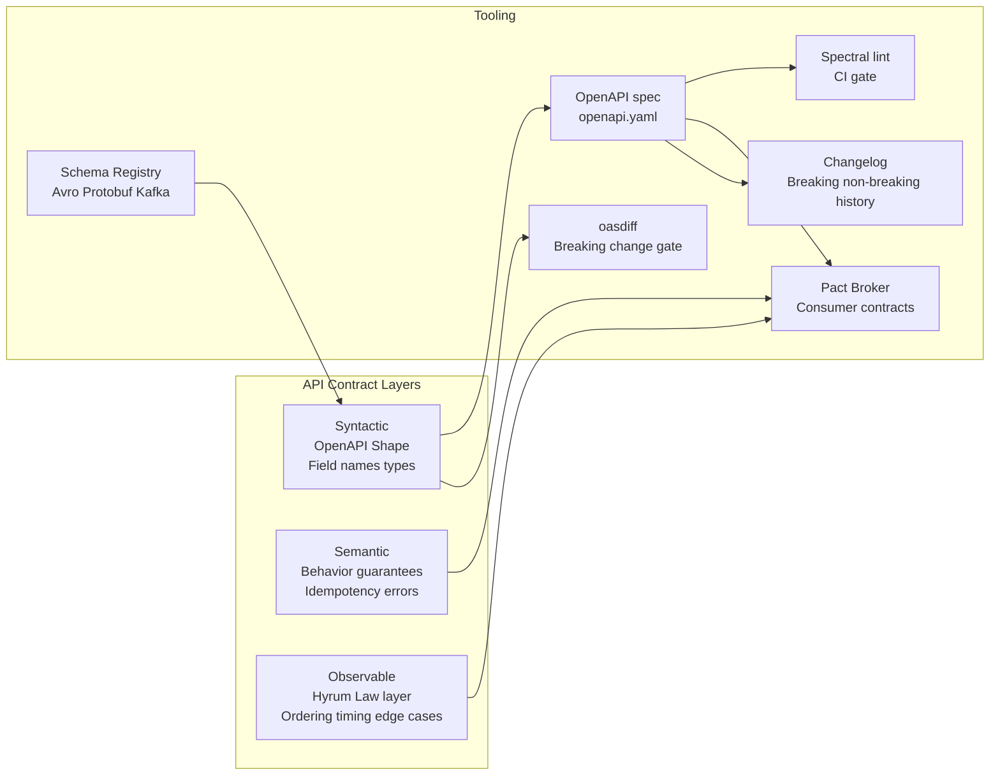

⚡ TL;DR - An API is not a URL pattern or a programming
interface: it is a contract between a provider and every
consumer. Contract management is the discipline of making
that contract explicit, versioned, tested, and governed.
The three contract layers: (1) syntactic (shape of the data -
OpenAPI, Protobuf, Avro), (2) semantic (meaning and behavior -
preconditions, postconditions, error semantics), (3) observable
(all behaviors consumers depend on - response ordering,
timing, field presence in edge cases). Most teams manage
layer 1. Few manage layer 2. Almost none systematically
manage layer 3 (until they break it). Pact provides
consumer-driven contract testing for layers 1 and 2.
Nothing fully automates layer 3 except traffic replay
testing. The Pattern Bridge is this entry: connecting
API design theory (REST constraints, Hyrum's Law, schema
evolution) to API design practice (OpenAPI-first design,
Pact consumer contracts, schema registry, API changelog).

---

| #086 | Category: HTTP & APIs | Difficulty: ★★★★★ |
|:---|:---|:---|
| **Depends on:** | Internal vs Public API, Versioning at Scale, Deprecation, Open Problems in API Design, WebSocket Protocol | |
| **Used by:** | Rate Limiting as Universal Resource Governance | |
| **Related:** | Internal vs Public API, Versioning, Deprecation, Open Problems, WebSocket, Rate Limiting | |

---

### 🔥 The Problem This Solves

**WORLD WITHOUT IT:**
Teams treat APIs as implementation artifacts: write code,
expose endpoint, share URL in Slack, move on. Consumers
write code against the actual behavior (not the documented
contract, because there is no documented contract). Six
months later: team A refactors, renames a JSON field from
`user_id` to `userId` (camelCase is "more idiomatic").
Three consumers break. Team A says: "That should not have
been a breaking change - the data is the same." Consumers
say: "You changed the contract." Team A: "We never documented
a contract." This is the failure. Without explicit contract
management: every API change is a negotiation after the fact.
With contract management: the contract exists before the
code, breaking changes are detected before merge, consumers
get advance notice, and migration is planned rather than
reactive.

---

### 📘 Textbook Definition

**API Contract:** The complete specification of what a
provider guarantees to consumers. Includes:
- **Syntactic contract:** Data shapes, field names, types,
  required vs optional fields, error response formats.
  Tools: OpenAPI, Protobuf, Avro, JSON Schema.
- **Semantic contract:** Behavioral guarantees. What does
  `POST /orders` do? Idempotent if same order_id? Returns
  the order resource or just an ID? Retryable on 500?
- **Observable contract (Hyrum's Law layer):** All behaviors
  that consumers actually depend on, whether documented or not.
  Response ordering, timing characteristics, field presence
  in edge cases, empty list vs null, error message text.

**Consumer-Driven Contract (CDC):** The consumer specifies
its expectations of the provider's API. The provider tests
that its implementation satisfies all consumer contracts.
If the provider breaks a consumer contract: the CI/CD pipeline
fails. Consumer drives the contract definition, not the provider.

**Schema Registry:** Central store for API schemas
(Avro, Protobuf, JSON Schema). Supports schema versioning
and compatibility checks. Compatibility levels: BACKWARD
(new schema reads old data), FORWARD (old schema reads
new data), FULL (both). Used heavily in Kafka-based
event-driven architectures.

**API Changelog:** Versioned, public record of all
breaking and non-breaking changes to an API. Required for
consumer migration. Format: semantic versioning + date +
change type (added/changed/deprecated/removed/fixed).
"Keep a Changelog" format (keepachangelog.com).

---

### ⏱️ Understand It in 30 Seconds

**One line:**
Treat your API as a contract with three layers (syntactic,
semantic, observable), generate the OpenAPI spec before
writing code, use Pact consumer-driven contracts to catch
breaking changes in CI, and maintain a changelog so
consumers can migrate proactively.

**One analogy:**
> Building an API without contract management is like a
> lawyer writing a contract by first building the house,
> then describing what they built. The description may
> not match what the other party expected. Contract-first
> is like a lawyer writing the agreement before breaking
> ground: both parties know exactly what they agreed to,
> changes require renegotiation, and disputes are resolved
> by pointing to the document, not to the code.

---

### 🔩 First Principles Explanation

**The three fundamental questions of contract management:**

**1. What did I promise?**
Most teams answer this with OpenAPI (syntactic). But the
semantic layer (preconditions, postconditions, idempotency,
error semantics) is usually missing. Example: OpenAPI says
`POST /orders returns 201`. Does not say: Is this idempotent
with the same `Idempotency-Key`? Can a consumer retry on
timeout? What does a 409 mean (duplicate order, or business
rule violation, or lock contention)? Without documenting
semantics: every consumer makes assumptions. When assumptions
are wrong: bugs appear in production under specific conditions.

**2. Who depends on what I promised?**
Traffic analysis + consumer-driven contracts (Pact). Without
this: you do not know who is calling your API or what they
depend on. At Google: teams run "impact analysis" before
any API change: query logs for all consumers, enumerate
behaviors they depend on, determine if the change affects
them. Non-trivial for public APIs (unknown consumers).

**3. How do I govern changes over time?**
Backward-compatibility policy + versioning strategy +
deprecation timeline. Stripe's policy: no breaking changes
to API versions. Ever. A version is frozen at release.
New behavior = new version. Old versions maintained
"indefinitely" (in practice: 5+ years). This is possible
for Stripe (one product, well-funded) and may not be
appropriate for all teams. But the principle: changes
must be governed by policy, not ad-hoc.

---

### 🧪 Thought Experiment

**SCENARIO: What does "breaking change" mean for a JSON API?**

```
Given an API response for GET /users/123:
{
  "id": 123,
  "name": "Alice",
  "email": "alice@example.com",
  "created_at": "2024-01-15T12:00:00Z"
}

QUESTION: Which of these changes are "breaking"?

A) Add a new field:
{
  "id": 123,
  "name": "Alice",
  "email": "alice@example.com",
  "created_at": "2024-01-15T12:00:00Z",
  "phone": "555-1234"         ← new field
}
ANSWER: Non-breaking IF consumers use lenient parsing
(ignore unknown fields). Breaking IF consumers use strict
parsing (fail on unknown fields). Python dicts: fine.
Java Jackson: fine (ignoreUnknown). Java JAXB strict: breaks.
CONTRACT LESSON: New fields are "non-breaking" is a
convention, not a guarantee. Your API policy must state:
"consumers MUST ignore unknown fields."

B) Remove a field:
{
  "id": 123,
  "name": "Alice",
  "created_at": "2024-01-15T12:00:00Z"
}
ANSWER: Breaking. Any consumer that reads email will
get null/error. Requires a deprecation period.

C) Change field type: "id": "123" (string instead of integer)
ANSWER: Breaking. Any consumer that does arithmetic on id
(user.id + 1 for paginating IDs) will break.

D) Change null to empty list:
Before: "tags": null
After:  "tags": []
ANSWER: Breaking for consumers that check `if tags is None`
instead of `if not tags`. Common Python bug.

E) Change response ordering:
Before: fields in order: id, name, email
After:  fields in order: email, id, name (alphabetical)
ANSWER: Non-breaking per JSON spec (objects unordered).
Breaking per Hyrum's Law (consumers depending on order).

F) Change error message text:
Before: {"error": "User not found"}
After:  {"error": "User 123 does not exist"}
ANSWER: Non-breaking per contract (error string).
Breaking per Hyrum's Law (consumers who parse error text).

LESSON: "breaking" has at least three definitions:
(1) Syntactically breaking (type change, field removal),
(2) Semantically breaking (behavior change even if shape same),
(3) Hyrum's Law breaking (observable change even if undocumented).
Contract management must address all three.
```

---

### 🧠 Mental Model / Analogy

> Think of an API as a published specification, like a
> programming language specification. When Python's
> language spec changes (deprecated feature removed in 3.x):
> there is a PEP document, a deprecation cycle of 2 major
> versions, explicit `DeprecationWarning` at runtime, and
> a migration guide. Python users do not complain about
> planned removals because the contract is managed: notice
> given, timeline published, migration documented. When
> an API team changes a field name with no notice: users
> complain because there was no contract management. The
> discipline is the same: make it explicit, give notice,
> support migration, deprecate before removing.

---

### 📶 Gradual Depth - Five Levels

**Level 1 - What it is (anyone can understand):**
Before writing any code, write down exactly what your
API will do: what data it accepts, what data it returns,
what errors it gives. Share that document with everyone
who will use your API. If you want to change your API
later: update the document first, give people time to
update their code, then make the change.

**Level 2 - How to use it (junior developer):**
Use OpenAPI (Swagger) to define your API before coding.
Generate server stubs from the spec (openapi-generator).
Use Pact to write consumer contract tests. Run Pact
broker in CI: every push to provider repo verifies all
consumer contracts still pass.

**Level 3 - How it works (mid-level engineer):**
Contract-first workflow: spec in `openapi.yaml` is the
source of truth. CI runs Spectral lint to enforce naming
conventions (camelCase, pluralized resource paths). CI runs
oasdiff to detect breaking changes (compare against
previous version's spec). Pact consumer writes interactions
(request + expected response) and uploads to Pact Broker.
Pact provider retrieves consumer contracts and verifies
its implementation. If a consumer contract fails: CI fails.
Changelog updated on every version bump.

**Level 4 - Why it was designed this way (senior/staff):**
Consumer-driven contracts inverts the traditional model.
In provider-driven contracts: provider writes spec, consumers
adapt. Provider may not know what consumers depend on.
In consumer-driven contracts: consumers write their
expectations, provider validates. Provider discovers
undocumented dependencies early (consumer contract test
for field `x` fails when provider stops returning `x`
even if `x` was never documented as required). The trade-off:
managing Pact Broker at scale (1000 consumer-provider pairs)
is complex. Team maturity required: consumers must write
and maintain their contracts, not rely on provider to
"just tell us when things change."

**Level 5 - Mastery (distinguished engineer):**
Contract management at the Google/Stripe scale requires
automated tooling beyond what Pact covers. Key elements:
(1) API linter (Spectral, google-api-design-guide) as
a mandatory CI step. Hundreds of rules: error model,
resource naming, versioning, pagination, field naming.
(2) Breaking change detector (oasdiff, buf breaking)
as a mandatory CI gate. Blocks merge if breaking change
without version bump.
(3) Traffic-based Hyrum's Law analysis: query production
logs before any change, identify all consumers, enumerate
field-level usage patterns (is `sorted_at` field actually
read by any consumer?). Make the decision to remove or
retain based on data, not assumption.
(4) Specification coverage: cross-check Pact consumer
contracts against OpenAPI spec. Identify gaps where
consumers call endpoints not tested by any Pact interaction.
(5) Schema registry with compatibility enforcement for
async (Kafka/Avro): every schema change validates against
compatibility policy before message is published.

---

### ⚙️ How It Works (Mechanism)

**Consumer-Driven Contracts with Pact:**

```python
# ===== CONSUMER SIDE (orders-service tests): =====
# File: orders_service/tests/test_user_contract.py
import pytest
from pact import Consumer, Provider, Like, EachLike

@pytest.fixture(scope="session")
def pact():
    consumer = Consumer("orders-service")
    provider = Provider("user-service")
    return consumer.has_pact_with(
        provider,
        host_name="localhost",
        port=1234,
        pact_dir="pacts/",
        publish_to_broker=True,
        broker_base_url="http://pact-broker:9292",
    )

def test_get_user_for_order(pact):
    """
    Consumer contract: orders-service needs user name
    and email. Does NOT need phone, preferences, etc.
    Only declares what it actually uses.
    """
    expected_user = {
        "id": Like(123),          # Any integer
        "name": Like("Alice"),    # Any string
        "email": Like("a@b.com"), # Any string
        # NOTE: NOT including phone - we don't use it.
        # Adding it would make the contract too strict.
    }

    (
        pact.given("user 123 exists")
        .upon_receiving("GET user 123 for order processing")
        .with_request("GET", "/users/123")
        .will_respond_with(200, body=expected_user)
    )

    with pact:
        # This runs against the Pact mock server
        import requests
        response = requests.get("http://localhost:1234/users/123")
        user = response.json()
        assert user["name"] is not None
        assert user["email"] is not None

# ===== PROVIDER SIDE (user-service CI): =====
# File: user_service/tests/test_pact_provider.py
# Runs the Pact verification against all consumer contracts
import pytest
from pact import Verifier

def test_provider_pact_verification():
    """
    Provider CI step: retrieve all consumer contracts
    from Pact Broker and verify our implementation
    satisfies all of them.
    """
    verifier = Verifier(
        provider="user-service",
        provider_base_url="http://localhost:8000",
    )
    output, _ = verifier.verify_with_broker(
        broker_url="http://pact-broker:9292",
        publish_verification_results=True,
        provider_version="1.2.3",
    )
    # output is 0 if all contracts pass, non-zero if any fail
    assert output == 0, "Provider broke one or more consumer contracts"
```

**OpenAPI-first with Spectral lint:**

```yaml
# .spectral.yaml - API design rules enforced in CI
extends:
  - spectral:oas
rules:
  # Enforce resource naming conventions
  operation-operationId-defined: error
  operation-tags: error
  # Custom rule: camelCase for JSON fields
  camelcase-properties:
    description: JSON response properties must be camelCase
    given: "$.paths..responses..content..schema..properties"
    then:
      function: pattern
      functionOptions:
        match: "^[a-z][a-zA-Z0-9]*$"
    severity: error
  # Custom rule: pagination response must include next_cursor
  pagination-cursor-required:
    description: >
      List endpoints must include pagination metadata
    given: "$.paths[*].get"
    then:
      function: schema
      functionOptions:
        schema:
          properties:
            responses:
              properties:
                "200":
                  required: ["content"]
    severity: warn
```



---

### 🔄 The Complete Picture - End-to-End Flow

**Contract-first API development pipeline:**

```
1. DESIGN:
   Write openapi.yaml BEFORE writing server code.
   Paste into Swagger Editor (editor.swagger.io) for preview.
   Team reviews: naming conventions, resource model, error responses.
   Commit to repo. Trigger CI.

2. LINT (CI gate, blocks merge on failure):
   npx @stoplight/spectral-cli lint openapi.yaml \
     --ruleset .spectral.yaml
   → Enforces naming, operationId presence, pagination shape,
     required error model fields.

3. BREAKING CHANGE DETECTION (CI gate):
   # Compare against main branch (previous released version)
   oasdiff breaking openapi.yaml origin/main/openapi.yaml
   → Exit code 1 if breaking changes detected without version bump.
   → Blocking gate: cannot merge if breaking without changelog entry.

4. SERVER CODE:
   # Generate server stubs from spec (optional)
   openapi-generator-cli generate \
     -i openapi.yaml \
     -g python-fastapi \
     -o generated/
   → Implement business logic in generated stubs.
   → Spec is source of truth; code follows spec.

5. CONSUMER CONTRACT TESTS (Pact):
   # Consumer writes Pact tests against their slice of the API.
   # Consumer uploads pact file to Pact Broker.
   # Provider CI downloads all consumer pacts, runs verification.
   # Failure: cannot deploy provider if any consumer contract fails.

6. CHANGELOG:
   # Update CHANGELOG.md on every version bump.
   # Format: Added/Changed/Deprecated/Removed/Fixed
   # Breaking changes: listed under "Changed" or "Removed"
   #   with migration instructions.
   # Example:
   ## [2.1.0] - 2024-01-15
   ### Added
   - GET /orders/{id}/timeline - order event history
   ### Changed
   - POST /orders: new optional field `idempotency_key`
   ### Deprecated
   - GET /orders?user_id - use GET /users/{id}/orders instead
     (removed in v3.0.0, planned: 2025-01-15)

7. DEPLOYMENT:
   # Canary deploy. Monitor consumer error rates.
   # Rollback if consumer error rate increases above threshold.
```

---

### 💻 Code Example

**Example 1 - BAD: Provider-driven contracts (no consumer input)**

```python
# BAD: Provider writes spec based on what they built,
# not what consumers need. Consumers adapt to the spec.
# No mechanism to detect that a consumer depends on
# a field the provider considers "optional" and might remove.

# Provider decides: "phone is optional, we'll deprecate it"
# No consumer was asked. No contract test.
# Result: 3 consumers break when phone is removed.

# openapi.yaml (provider-driven):
# components:
#   schemas:
#     User:
#       properties:
#         id: {type: integer}
#         name: {type: string}
#         email: {type: string}
#         phone: {type: string}  # "optional" - removing next sprint

# GOOD: Consumer-driven contract (Pact).
# Before removing "phone", run Pact verification.
# If any consumer contract includes "phone": CI fails.
# Provider CANNOT remove phone without that consumer
# updating their contract first (acknowledging the change).

# Consumer contract that would block the removal:
# test_user_contract.py
def test_consumer_needs_phone(pact):
    expected_user = {
        "id": Like(123),
        "name": Like("Alice"),
        "phone": Like("555-1234"),  # This consumer uses phone
    }
    (
        pact.given("user 123 exists")
        .upon_receiving("GET user 123 for SMS notifications")
        .with_request("GET", "/users/123")
        .will_respond_with(200, body=expected_user)
    )
    # If provider removes "phone": this test fails on provider CI.
    # Provider is blocked. Must contact this consumer first.
    # Consumer either: removes phone from contract (no longer needs it)
    # or: rejects the removal (still needs phone).
```

---

### ⚖️ Comparison Table

| Approach | Consumer Discovery | Breaking Change Detection | Hyrum's Law Coverage | Scalability |
|:---|:---|:---|:---|:---|
| **No contracts (ad-hoc)** | Unknown - rely on consumers to self-report | None - discovered post-deploy | None | "Scales" until first major breakage |
| **OpenAPI spec only** | Log-based (query who calls endpoints) | oasdiff (syntactic only) | None | Good for provider governance |
| **Consumer-driven Pact** | Explicit - consumer registers contract | Semantic (consumer expectations) | Partial (what consumer documents) | Complex at 100+ consumer pairs |
| **Schema registry (Avro/Protobuf)** | N/A (Kafka consumers auto-discovered by broker) | Compatibility policy enforcement | None | Excellent for async/event-driven |
| **Traffic-based analysis** | Complete (all callers seen in logs) | Detects field-level usage before removal | Best (observes actual consumption patterns) | Expensive (large log volume, requires query infra) |

---

### ⚠️ Common Misconceptions

| Misconception | Reality |
|:---|:---|
| OpenAPI spec is the API contract | OpenAPI covers syntactic contract (shapes, types, required fields). It does not cover: idempotency behavior, retry semantics, ordering guarantees, error code meanings, or any observable behavior consumers depend on (Hyrum's Law). A complete contract requires documentation of behavioral guarantees (preconditions, postconditions, side effects) beyond what OpenAPI can express. OpenAPI is necessary but not sufficient for full contract management. |
| Pact consumer-driven contracts catch all breaking changes | Pact catches breaking changes that consumer TESTS express. Consumers write tests for behaviors they know they depend on. Hyrum's Law behaviors (undocumented dependencies on response ordering, error message text, timing) are not written as Pact interactions. Pact is better than nothing but is not a complete solution. The complement: traffic-based analysis (log what fields consumers read) and end-to-end regression testing against real consumer code in staging. |
| Semantic versioning (semver) solves API versioning | Semver provides NUMBERS for versions. It says a major version bump signals breaking changes. It does not define: what a "breaking change" is (Hyrum's Law makes this hard), how long old versions are maintained, how consumers migrate, how providers notify consumers. Semver is necessary for version signaling. A complete versioning POLICY also requires: breaking change definition, deprecation timeline, consumer communication process, migration support. Stripe's API versioning (date-based, immutable versions) is more complete than plain semver for API contracts. |

---

### 🚨 Failure Modes & Diagnosis

**Undetected breaking change in production**

**Symptom:** After a deploy, consumer service error rates spike.
`POST /orders` starts returning 400 with "Unexpected field: user_id".
Consumer service was sending `user_id`, which the provider
used to accept but now rejects (strict schema validation added).
OpenAPI changelog shows no breaking change. CI passed.

**Root Cause:** Provider added strict request validation
(reject unknown fields). `user_id` was never in the OpenAPI
spec but was accepted silently (ignored). Consumer was
sending it (legacy behavior). This is a Hyrum's Law
breaking change: changing from "silently accept unknown
fields" to "reject unknown fields" is not a breaking
change per OpenAPI spec, but IS a breaking change in practice.

**Diagnosis:**
```bash
# Query logs for failed requests after deploy:
SELECT request_body, error_message, consumer_service
FROM api_access_log
WHERE status_code = 400
  AND timestamp > deploy_time
  AND endpoint = '/orders'
ORDER BY timestamp DESC
LIMIT 50;
# → Shows consumer_service=legacy-orders, field=user_id

# Check OpenAPI spec for user_id field:
grep -i "user_id" openapi.yaml
# → Not in spec. Provider was silently ignoring it.

# Check Pact consumer contracts:
curl http://pact-broker:9292/pacts/provider/order-service/consumer/legacy-orders
# → No Pact contract exists for legacy-orders
# → Consumer was never registered in Pact
```

**Resolution:**
1. Immediate: revert strict validation (restore silent-ignore).
2. Register legacy-orders as a consumer in Pact.
3. legacy-orders writes Pact contract documenting that
   it sends `user_id` field (even though deprecated).
4. Provider's Pact verification will fail until provider
   explicitly handles `user_id` in the contract.
5. Add "all unknown fields silently ignored" as a documented
   semantic contract guarantee.

---

### 🔗 Related Keywords

**Prerequisites (understand these first):**
- `API Versioning at Scale` - versioning strategy for contract evolution
- `API Deprecation Strategy` - how to retire contract promises
- `Open Problems in API Design` - Hyrum's Law in depth

**Builds On This (learn these next):**
- `Rate Limiting as Universal Resource Governance` - contracts for usage quotas

---

### 📌 Quick Reference Card

```
┌──────────────────────────────────────────────────────────┐
│ 3 CONTRACT   │ Syntactic (shape/types)                   │
│ LAYERS       │ Semantic (behavior/idempotency/errors)    │
│              │ Observable (Hyrum's Law behaviors)        │
├──────────────┼───────────────────────────────────────────┤
│ TOOLING      │ OpenAPI: syntactic spec                   │
│              │ Spectral: lint OpenAPI in CI              │
│              │ oasdiff: detect breaking changes          │
│              │ Pact: consumer-driven behavioral tests    │
│              │ Schema Registry: Avro/Protobuf for async  │
├──────────────┼───────────────────────────────────────────┤
│ CONTRACT-    │ Write openapi.yaml FIRST                  │
│ FIRST FLOW   │ → Spectral lint → oasdiff gate            │
│              │ → Generate stubs → Implement → Pact tests │
├──────────────┼───────────────────────────────────────────┤
│ BREAKING     │ Syntactic: oasdiff catches it             │
│ CHANGE TYPES │ Semantic: Pact catches it (if tested)     │
│              │ Observable: traffic analysis only         │
├──────────────┼───────────────────────────────────────────┤
│ ONE-LINER    │ "A contract has 3 layers: shape, behavior,│
│              │  and observation. You must manage all 3." │
└──────────────────────────────────────────────────────────┘
```

**If you remember only 3 things:**
1. API contract = syntactic + semantic + observable.
   Most teams only manage syntactic (OpenAPI). Semantic
   and observable require Pact and traffic analysis.
2. Consumer-driven contracts (Pact): consumers write
   their expectations, providers verify. CI fails if
   provider breaks any consumer contract. Inverts
   the traditional provider-dictates model.
3. Contract-first workflow: write OpenAPI spec before
   code. Run Spectral lint + oasdiff breaking change gate
   in CI. Update CHANGELOG on every version bump.

---

### 💎 Transferable Wisdom

**Reusable Engineering Principle:**
"Define the interface before the implementation." This is
not just software engineering good practice - it is the
foundation of all contract management. Writing the OpenAPI
spec first forces the team to think about the consumer
experience before getting attached to implementation
details. Writing Pact consumer contracts forces the consumer
team to articulate what they actually need (not what they
assume the provider will give). In both cases: making
the contract explicit BEFORE implementation catches
misunderstandings when they are cheap to fix (design phase)
instead of when they are expensive (production incident).

**Where else this pattern applies:**
- Database schema design: write the schema (DDL) before
  application code. Schema changes go through migration
  scripts with backward compatibility review.
- Protobuf/Avro schema in Kafka: define message schema
  in schema registry, enforce compatibility policy before
  any producer sends messages with a new schema.
- Function signatures in shared libraries: define the
  function signature (input, output, exceptions) in an
  interface/protocol before implementing. Allows consumers
  to mock the interface in tests without waiting for implementation.

---

### 💡 The Surprising Truth

The most impactful contract management practice is not
Pact, not OpenAPI, not a schema registry - it is a
single rule: "A consumer who breaks is owed a migration
guide and a deadline, not an apology." Most organizations
treat breaking API changes as accidents to be avoided.
The best API teams (Stripe, Twilio, Google) treat breaking
changes as planned events in a managed process. Stripe
has 17 active API versions simultaneously. They do not
avoid versioning - they embrace it. The cost of maintaining
multiple versions is lower than the cost of forcing all
consumers to migrate simultaneously. The surprising insight:
high-quality API contract management makes breaking changes
SAFER, not rarer. By making the process explicit (spec,
changelog, Pact, deprecation headers, sunset date): teams
can change their APIs more confidently because every change
is tested, documented, and communicated. Teams without
contract management make fewer changes (afraid to break
things) or make changes carelessly (do not know what they
will break). Contract management enables both safety and velocity.

---

### ✅ Mastery Checklist

**You've mastered this when you can:**
1. **IDENTIFY** all three contract layers in an existing
   API and explain what tooling covers each.
2. **SET UP** a Pact broker, write consumer Pact tests,
   and configure provider verification in CI.
3. **CONFIGURE** Spectral lint rules and oasdiff breaking
   change detection as CI gates in a GitHub Actions workflow.
4. **WRITE** an API changelog entry for a breaking change
   with migration instructions and sunset date.
5. **EXPLAIN** why consumer-driven contracts (Pact) are
   better than provider-driven contracts for discovering
   undocumented consumer dependencies.

---

### 🎯 Interview Deep-Dive

**Q1: What is consumer-driven contract testing and how
does it differ from provider-owned API documentation?**

*Why they ask:* Tests architecture depth, distributed
systems thinking, and API governance understanding.

*Strong answer includes:*
- Provider-owned documentation: provider decides what to document.
  Consumers adapt to what is documented. Provider may not know
  what consumers actually depend on. Undocumented behaviors
  (Hyrum's Law) are not captured.
- Consumer-driven contracts (Pact): each consumer writes
  interactions (request + expected response) describing
  what they depend on. Consumer publishes contract to Pact Broker.
  Provider CI downloads all consumer contracts and verifies
  its implementation satisfies every consumer's expectations.
  If provider removes a field: any consumer contract that
  includes that field fails. CI gate prevents merge.
- Benefits: provider discovers undocumented dependencies
  BEFORE they break. Consumers must explicitly declare what
  they depend on (reduces lazy consumption of unused fields).
- Limitations: covers only documented consumer interactions.
  Silent Hyrum's Law dependencies (response ordering, timing)
  are not in Pact tests. Pact is necessary, not sufficient.

**Q2: How would you implement an API contract-first
development workflow for a team of 50 engineers?**

*Why they ask:* Tests ability to design processes, not
just implement code.

*Strong answer includes:*
- Tooling: OpenAPI as the source of truth (checked into repo).
  Spectral for lint (naming, required fields, pagination shape).
  oasdiff for breaking change detection. Pact Broker for
  consumer contracts. CHANGELOG.md with structured format.
- CI gates: PR cannot merge if: Spectral lint fails,
  oasdiff detects breaking change without version bump,
  any Pact consumer contract fails on provider.
- Process: design review step before any new API endpoint.
  Engineer writes openapi.yaml change, runs local Spectral lint.
  PR opens: automated Spectral + oasdiff run. Team reviews
  design in PR. Approved: implementation begins.
- Consumer registration: all consumers of an API are
  registered in Pact Broker. Before a provider change:
  "can I deploy" check (Pact can-i-deploy CLI) shows
  which consumers would be broken.
- Changelog: every PR that bumps the API version includes
  CHANGELOG.md update. Breaking changes include: description,
  reason, migration instructions, sunset date for old behavior.
