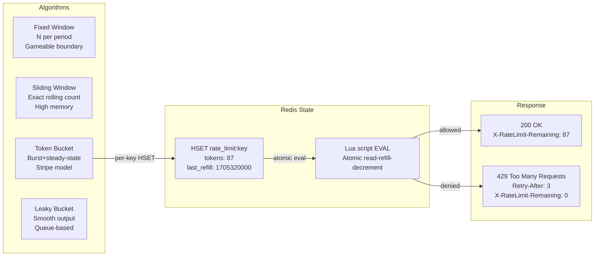

⚡ TL;DR - Rate limiting is not about protecting one API
endpoint: it is the universal mechanism for governing
access to any finite resource (CPU, database connections,
external API quota, memory, network bandwidth) across
distributed systems. Four algorithms: (1) Fixed Window:
N requests per period (gameable at window boundary),
(2) Sliding Window Log: exact count over rolling period
(expensive memory), (3) Token Bucket: accumulate tokens
at rate R, consume on request, allow burst up to bucket
size B (Stripe's model), (4) Leaky Bucket: FIFO queue
with constant drain rate, no burst (smooth output).
Standard HTTP response: `429 Too Many Requests` +
`Retry-After` header (seconds until next allowed request).
Standard headers: `X-RateLimit-Limit`, `X-RateLimit-Remaining`,
`X-RateLimit-Reset`. At scale: rate limit state in Redis
(distributed, atomic operations). At extreme scale:
rate limit state in a local in-process approximation
(cell-rate algorithm, eventual consistency acceptable).
The universal insight: any system that receives requests
faster than it can serve them MUST have rate limiting
or it will fail. Rate limiting is not optional for
production APIs.

---

| #087 | Category: HTTP & APIs | Difficulty: ★★★★☆ |
|:---|:---|:---|
| **Depends on:** | Internal vs Public API, Versioning at Scale, Open Problems in API Design, Contract Management | |
| **Used by:** | (closes the tier-2 API category) | |
| **Related:** | Internal vs Public API, Versioning, Open Problems, Contract Management, Event-Driven APIs, WebSocket | |

---

### 🔥 The Problem This Solves

**WORLD WITHOUT IT:**
A single misbehaving consumer (bug in retry logic, DDoS,
misconfigured cron job) sends 50,000 requests per second
to an API. The API's database connection pool exhausts.
Connection wait queue fills. All other consumers start
experiencing 500 errors and timeouts. Service is down
for everyone. Without rate limiting: there is no fair
resource allocation. The most aggressive consumer consumes
all available capacity. Legitimate consumers with modest
traffic are starved. Recovery requires manual intervention
(blocking the consumer's IP or API key, restarting
services, draining connection pool). With rate limiting:
the misbehaving consumer gets 429 responses; all other
consumers continue unaffected; the system degrades
gracefully instead of failing completely.

---

### 📘 Textbook Definition

**Rate Limiting:**
The mechanism for controlling the rate at which a
resource is accessed. Applied at: API gateway (per API key
or IP), application layer (per user, per operation type),
database layer (connection pool limits), external API
clients (respect third-party rate limits to avoid bans).

**Four Rate Limiting Algorithms:**

**1. Fixed Window Counter:**
N requests allowed per fixed time window (e.g., 100/minute).
Window resets at the start of each minute (00:00, 01:00...).
Gameable: 99 requests at 00:59, 99 requests at 01:01 = 198
requests in 2 seconds.

**2. Sliding Window Log:**
Maintain a log of all request timestamps in a sorted set.
On each request: remove timestamps older than window,
count remaining, allow if below limit, add current
timestamp. Exact count over rolling window. Memory cost:
proportional to request count per consumer (not bounded).

**3. Token Bucket:**
Bucket holds up to B tokens. Tokens added at rate R per
second. Each request consumes 1 token. If bucket empty:
request rejected (429). Allows burst up to B (bucket
fills when consumer is idle). Used by Stripe (B = burst
cap, R = steady-state rate). Conceptually: producer adds
tokens, consumer removes tokens.

**4. Leaky Bucket:**
Incoming requests queued in a bucket (FIFO). Bucket drains
at constant rate C. If bucket overflows: requests dropped.
Output rate is smooth (constant C regardless of input
burst). Used for traffic shaping (smooth output). Queue
introduces latency (requests wait their turn rather than
being accepted or rejected immediately).

**HTTP Rate Limit Response:**
```
HTTP/1.1 429 Too Many Requests
Content-Type: application/json
Retry-After: 30
X-RateLimit-Limit: 1000
X-RateLimit-Remaining: 0
X-RateLimit-Reset: 1705320000

{"error": "rate_limit_exceeded", "retry_after": 30}
```

---

### ⏱️ Understand It in 30 Seconds

**One line:**
Rate limiting controls the rate of access to any finite
resource: the four algorithms (fixed window, sliding window,
token bucket, leaky bucket) each trade burst tolerance
for implementation complexity; token bucket is most common
for APIs (allows bursts, enforces steady-state limit).

**One analogy:**
> Token bucket is a vending machine with a queue of coins:
> coins arrive at rate R per second (max B in the machine).
> Each purchase (request) costs one coin. Machine always
> accepts purchases when coins are available. When all coins
> are spent: machine returns "out of coins" (429), tells
> you "next coin arrives in X seconds" (Retry-After).
> If you are idle: coins accumulate (up to B) so you can
> make a burst of B purchases instantly. The machine
> does not care HOW FAST you spend - only that you have coins.

---

### 🔩 First Principles Explanation

**Why token bucket dominates for APIs:**

```
Scenario: API limit is 1000 requests/hour (R=0.278/sec).
Consumer does nightly batch import at 2:00 AM.
Needs to import 10,000 records: each record = 1 API call.

FIXED WINDOW (1000/hour):
  2:00-3:00 AM: 1000 requests. Rate limit hit.
  Wait until 3:00 AM. 1000 more. Wait. Total: 10 hours.
  Consumer's import job runs from 2:00 AM to noon.

TOKEN BUCKET (B=5000 burst, R=0.278/sec):
  Tokens accumulate during idle period (22 hours before import).
  22 hours × 0.278/sec × 3600 = ~22,000 tokens earned.
  But bucket max = 5000. So: 5000 tokens available at 2:00 AM.
  Consume 5000 instantly (first 5000 records in seconds).
  Then consume at 0.278/sec (steady state).
  Remaining 5000 records at 0.278/sec = 18,000 seconds = 5 hours.
  Import completes in 5 hours instead of 10.

LEAKY BUCKET (drain rate C = 0.278/sec = ~1000/hour):
  All 10,000 requests queued. Released at 0.278/sec.
  Total time: 10,000 / 0.278 = 36,000 seconds = 10 hours.
  But requests are not rejected - they queue.
  Client must hold TCP connections open (or implement polling).
  Practical for rate-smoothing at network edge, not for APIs.

SLIDING WINDOW LOG (1000 in any rolling 60-minute window):
  Prevents the boundary gaming of fixed window.
  Memory: 1000 timestamps per consumer per window.
  At 100,000 consumers: 100,000,000 timestamps in Redis.
  Expensive. Approximation (sliding window counter)
  is more practical at scale.
```

---

### 🧪 Thought Experiment

**SCENARIO: Distributed rate limiting - what can go wrong?**

```
Two instances of order-service (Instance A, Instance B)
behind a load balancer. Consumer limit: 100 req/minute.
Each instance has its OWN in-process token bucket.

Consumer sends 100 requests. Load balancer distributes 50/50.
Instance A: 50 requests → 50 tokens consumed → 50 remaining.
Instance B: 50 requests → 50 tokens consumed → 50 remaining.

Consumer sends 50 more requests. Load balancer distributes 25/25.
Instance A: 25 requests → 25 tokens consumed → 25 remaining.
Instance B: 25 requests → 25 tokens consumed → 25 remaining.

Consumer has now sent 150 requests (100 limit exceeded by 50).
Neither instance has hit its local limit (each sees 75/100).
Result: rate limit is bypassed.

N instances each with local bucket of B tokens
= effective limit of N×B for a consumer who can hit all instances.
At 10 instances with 100/min limit: consumer can send 1000/min.

SOLUTIONS:
1. Central rate limit state in Redis (atomic operations).
   All instances share one bucket counter.
   Cost: every request hits Redis (1-2ms latency).
   Single Redis node: SPOF. Redis Cluster or Redis Sentinel.

2. Approximate distributed rate limiting:
   Each instance maintains a local counter with a TTL.
   Periodically sync with central store (every 10 seconds).
   Accept some over-limit traffic during sync window.
   Error margin: burst of (N × local_window) allowed
   before central sync corrects it.
   Trade-off: slight over-limit in exchange for no Redis
   on the hot path.

3. Sticky routing by API key:
   Load balancer always routes api_key=X to the same instance.
   Each instance has full accurate state for its keys.
   Cost: uneven load distribution; if instance dies,
   another must pick up without knowing the current state.
```

---

### 🧠 Mental Model / Analogy

> Rate limiting is infrastructure for fairness under load.
> Think of a highway merge: all lanes of traffic funneling
> into one. The zipper merge is a rate limit: one car
> from each lane, alternating. This prevents any single
> lane from dominating. Token bucket is the zipper merge
> with a "burst lane" that allows three cars in a row
> from one lane if the others were empty recently. Leaky
> bucket is a toll booth: cars arrive in bursts, exit
> at a constant rate (one every 2 seconds). Fixed window
> is a time-shared highway: free for all during each period,
> then barrier drops. Rate limiting governs finite resources
> (road capacity = CPU/database/network) to ensure equitable
> access across all consumers.

---

### 📶 Gradual Depth - Five Levels

**Level 1 - What it is (anyone can understand):**
Rate limiting prevents any one user from using too much
of a shared service. Like a buffet with a "take one at
a time" rule: everyone gets fair access. Without it:
one person could take everything and nobody else gets
any food.

**Level 2 - How to use it (junior developer):**
Return HTTP 429 with Retry-After header when limit exceeded.
Include X-RateLimit-Limit (total allowed), X-RateLimit-Remaining
(left in current window), X-RateLimit-Reset (Unix timestamp
when limit resets). Store limit counters in Redis with TTL.

**Level 3 - How it works (mid-level engineer):**
Token bucket implementation: Redis hash key per consumer.
Two fields: `tokens` (current bucket level), `last_refill`
(timestamp). On each request: calculate elapsed time since
last refill, add elapsed × rate to tokens (cap at bucket max),
check if tokens ≥ 1, decrement by 1, update Redis. Atomic:
use Redis Lua script (EVAL) to prevent race condition between
read-and-update.

**Level 4 - Why it was designed this way (senior/staff):**
Rate limiting has three distinct concerns that should
be separated: (1) accounting (tracking consumption),
(2) enforcement (deciding allow/deny), (3) communication
(headers, error responses). API gateway handles (2) and
(3). Application may supplement (1) with fine-grained
per-operation limits (expensive write operations have
lower limits than cheap reads). Stripe's model: multiple
limit types simultaneously: per-API-key, per-endpoint,
per-IP, per-user. Any one exceeded: 429. The limit
that was exceeded is communicated in the error response.

**Level 5 - Mastery (distinguished engineer):**
Rate limiting is the universal solution to the general
problem: "How do I protect a finite resource from being
exhausted by an unbounded input rate?" This applies beyond
HTTP APIs:
- Database connection pool: semaphore-based rate limiting
  (max N concurrent acquisitions). Spring's HikariCP has
  `maximumPoolSize` and `connectionTimeout`.
- External API clients: token bucket consuming from a quota
  shared across all application instances that call the
  same third-party API (avoid getting banned by, e.g.,
  Google Maps or Stripe with 5000/min limit spread across
  20 application instances).
- Job queues: worker pool limits concurrency.
  Sidekiq: `concurrency: 10` = token bucket of size 10.
- Memory allocation: GC pressure limits object allocation
  rate. OS virtual memory limits page allocation.
The abstraction: all finite resources require admission
control. Rate limiting is one form of admission control.
Circuit breakers, bulkheads, and timeouts are others.

---

### ⚙️ How It Works (Mechanism)

**Token bucket in Redis (atomic Lua script):**

```python
import redis.asyncio as redis
import time
from dataclasses import dataclass

r = redis.Redis()

TOKEN_BUCKET_SCRIPT = """
local key = KEYS[1]
local now = tonumber(ARGV[1])
local rate = tonumber(ARGV[2])      -- tokens per second
local capacity = tonumber(ARGV[3])  -- max bucket size
local requested = tonumber(ARGV[4]) -- tokens to consume

-- Get current state
local last_tokens = tonumber(redis.call('HGET', key, 'tokens'))
local last_refill = tonumber(redis.call('HGET', key, 'last_refill'))

-- First request: initialize bucket at capacity
if last_tokens == nil then
    last_tokens = capacity
    last_refill = now
end

-- Refill: add tokens for time elapsed since last refill
local elapsed = now - last_refill
local new_tokens = math.min(
    capacity,
    last_tokens + elapsed * rate
)

-- Check and consume
local allowed = 0
local remaining = new_tokens
if new_tokens >= requested then
    remaining = new_tokens - requested
    allowed = 1
end

-- Save state with TTL (clean up idle keys)
redis.call('HSET', key, 'tokens', remaining)
redis.call('HSET', key, 'last_refill', now)
redis.call('EXPIRE', key, math.ceil(capacity / rate) + 60)

return {allowed, math.floor(remaining)}
"""

@dataclass
class RateLimitResult:
    allowed: bool
    remaining: int
    retry_after: float  # seconds

async def check_rate_limit(
    api_key: str,
    rate: float = 10.0,    # 10 tokens/second = 600/minute
    capacity: float = 100, # burst up to 100
) -> RateLimitResult:
    """
    Token bucket rate limiter.
    Returns: allowed (bool), remaining tokens, retry_after (secs)
    """
    now = time.time()
    result = await r.eval(
        TOKEN_BUCKET_SCRIPT,
        1,                         # num keys
        f"rate_limit:{api_key}",   # KEYS[1]
        str(now),                  # ARGV[1]
        str(rate),                 # ARGV[2]
        str(capacity),             # ARGV[3]
        "1",                       # ARGV[4]
    )
    allowed = bool(result[0])
    remaining = int(result[1])
    # If not allowed: retry_after = 1/rate (time to earn 1 token)
    retry_after = 0.0 if allowed else (1.0 / rate)
    return RateLimitResult(allowed, remaining, retry_after)
```

**FastAPI middleware with standard rate-limit headers:**

```python
from fastapi import FastAPI, Request, Response
from fastapi.responses import JSONResponse

app = FastAPI()

@app.middleware("http")
async def rate_limit_middleware(request: Request, call_next):
    api_key = request.headers.get("X-API-Key", request.client.host)
    result = await check_rate_limit(api_key)

    if not result.allowed:
        return JSONResponse(
            status_code=429,
            content={
                "error": "rate_limit_exceeded",
                "retry_after": result.retry_after,
            },
            headers={
                "Retry-After": str(int(result.retry_after)),
                "X-RateLimit-Limit": "600",
                "X-RateLimit-Remaining": "0",
                "X-RateLimit-Reset": str(
                    int(time.time() + result.retry_after)
                ),
            },
        )

    response = await call_next(request)
    response.headers["X-RateLimit-Remaining"] = str(result.remaining)
    return response
```



---

### 🔄 The Complete Picture - End-to-End Flow

**Multi-tier rate limiting (Stripe-style):**

```
Request arrives at API Gateway (Kong/Nginx/custom):

Tier 1: IP-based (DDoS protection)
  - Limit: 10,000 req/min per IP (broad protection)
  - State: Redis, key=ip:{ip_address}
  - Reject: 429 if exceeded

Tier 2: API key (per-consumer allocation)
  - Limit: 600 req/min per api_key (token bucket)
  - State: Redis, key=rate:{api_key}
  - Reject: 429 with Retry-After header

Tier 3: Per-endpoint (protect expensive operations)
  - POST /search: 100 req/min (expensive, full-text search)
  - POST /export: 10 req/min (very expensive, generates large files)
  - GET /: 600 req/min (cheap, standard limit)
  - State: Redis, key=rate:{api_key}:{endpoint}
  - Reject: 429 with endpoint-specific error

Tier 4: Concurrency limit (in-flight requests)
  - 20 concurrent requests per api_key
  - Prevent connection exhaustion regardless of request rate
  - State: Redis INCR/DECR with TTL
  - Reject: 429 if concurrent count exceeded

ALL TIERS PASS → Forward to application server
```

---

### 💻 Code Example

**Example 1 - BAD: Fixed window (gameable at boundary)**

```python
# BAD: Fixed window counter - gameable at boundary.
import time
from collections import defaultdict

counts = defaultdict(int)

def is_allowed_bad(api_key: str, limit: int = 100) -> bool:
    minute = int(time.time() // 60)  # Fixed 60s window
    key = f"{api_key}:{minute}"
    counts[key] += 1
    # BAD: 100 requests at 00:59 + 100 requests at 01:01
    # = 200 requests in 2 seconds. Limit bypassed.
    return counts[key] <= limit

# GOOD: Sliding window counter (approximate, memory-efficient)
async def is_allowed_sliding(
    api_key: str,
    limit: int = 100,
    window: int = 60
) -> bool:
    """
    Approximate sliding window using two fixed counters.
    Memory: O(1) per consumer (only 2 counters, not full log).
    Accuracy: within 5% of exact sliding window.
    Algorithm: weight current window count by time elapsed.
    """
    now = time.time()
    current_window = int(now // window)
    prev_window = current_window - 1
    elapsed_in_current = now % window
    weight = 1 - (elapsed_in_current / window)

    current_key = f"sw:{api_key}:{current_window}"
    prev_key = f"sw:{api_key}:{prev_window}"

    async with r.pipeline() as pipe:
        pipe.get(current_key)
        pipe.get(prev_key)
        results = await pipe.execute()

    current_count = int(results[0] or 0)
    prev_count = int(results[1] or 0)

    # Approximate: weighted previous + current
    approximate_count = (prev_count * weight) + current_count

    if approximate_count >= limit:
        return False

    # Increment current window counter
    await r.incr(current_key)
    await r.expire(current_key, window * 2)
    return True
```

---

### ⚖️ Comparison Table

| Algorithm | Burst Handling | Memory | Boundary Gaming | Use Case |
|:---|:---|:---|:---|:---|
| **Fixed Window** | Allows burst at window start | O(1) per consumer | Yes (boundary double-spend) | Simple, when gaming risk acceptable |
| **Sliding Window Log** | No burst | O(limit) per consumer | No | Exact limiting, low traffic |
| **Sliding Window Counter** | Approximate (weighted) | O(1) per consumer | No (approximate) | High traffic, slight inaccuracy acceptable |
| **Token Bucket** | Yes (up to bucket size) | O(1) per consumer | No | APIs with legitimate burst use cases (Stripe) |
| **Leaky Bucket** | No (queue absorbs bursts) | O(queue size) per consumer | No | Traffic shaping, smooth output required |

---

### ⚠️ Common Misconceptions

| Misconception | Reality |
|:---|:---|
| Rate limiting protects your API from DDoS | Rate limiting protects against accidental overuse and fair resource allocation. A true DDoS (millions of IPs, distributed) cannot be stopped by per-IP or per-key rate limiting alone. DDoS mitigation requires: CDN-level protection (Cloudflare, AWS Shield), traffic scrubbing, anycast routing, challenge-response (CAPTCHAs, JavaScript challenges). Rate limiting is necessary but insufficient for DDoS protection. |
| Token bucket requires Redis | Token bucket requires PERSISTENT, ATOMIC state shared across all instances that serve the same consumer. Redis is the common choice (low latency, atomic Lua scripts, TTL support). Alternatives: Postgres with row-level locking (works, higher latency), Nginx limit_req_module (process-local, not distributed), Envoy with rate_limit service (gRPC to external rate limit service), AWS API Gateway (built-in, not transparent). The requirement is atomic read-modify-write across instances, not Redis specifically. |
| Rate limiting is the same as throttling | Rate limiting: hard limit - requests ABOVE the limit are rejected with 429. Throttling: soft limit - requests ABOVE the limit are queued and processed later, possibly with degraded service. Throttling is appropriate for async operations (job queues). Rate limiting is appropriate for synchronous APIs (give the client a clear signal to back off). Some systems use both: rate limiting at the API gateway, throttling in the job queue. |

---

### 🚨 Failure Modes & Diagnosis

**Failure Mode 1: Race condition in distributed rate limiter**

**Symptom:** Limit is 100 requests/minute. Monitoring shows
consumers consistently making 180-200 requests/minute
without receiving 429. Rate limit appears to be broken.

**Root Cause:** Two application instances both read Redis
count (90), both check 90 < 100, both increment to 91.
Net result: 100 requests counted, 200 served. Non-atomic
read-check-increment.

**Diagnosis:**
```bash
# Monitor Redis rate limit keys in real-time:
redis-cli MONITOR | grep "rate_limit:"
# Look for: multiple HGET without corresponding HSET
# (indicates two reads before one write)

# Check if Lua script is being used:
redis-cli SCRIPT LIST
# If empty: application is using GET/SET, not EVAL
```

**Fix:** Replace GET + conditional SET with atomic Lua
script (EVAL). Or use Redis INCR with TTL check:
```python
async def atomic_increment(key: str, limit: int, ttl: int):
    """
    Atomic: INCR returns new value.
    If new value is 1: SET TTL (first request in window).
    If new value > limit: over limit.
    """
    count = await r.incr(key)
    if count == 1:
        await r.expire(key, ttl)
    return count <= limit
```

---

**Failure Mode 2: Retry storm amplifying load**

**Symptom:** Rate limit spike causes cascade. At T=0: load
spike triggers 429 for 40% of consumers. All 429 consumers
retry immediately (no backoff). Retry requests hit the
same rate limit. 429 responses → more retries → load
doubles → more 429 → oscillating overload.

**Root Cause:** Consumers retry on 429 without honoring
Retry-After header or with no exponential backoff.

**Diagnosis:**
```bash
# Check Retry-After header is present in 429 responses:
curl -i -X GET https://api.example.com/orders \
  -H "X-API-Key: test_key" | grep -i "retry-after"

# Check consumer retry behavior in logs:
grep "429" /var/log/app.log | awk '{print $1}' | sort | uniq -c
# → If timestamps cluster in tight bursts: no backoff
```

**Fix:**
1. Provider: include `Retry-After` header with exact seconds.
2. Consumer: use exponential backoff with jitter:
```python
import asyncio, random

async def call_with_retry(api_call, max_retries=5):
    for attempt in range(max_retries):
        resp = await api_call()
        if resp.status_code != 429:
            return resp
        retry_after = int(resp.headers.get("Retry-After", 1))
        # Exponential backoff with jitter: prevents thundering herd
        wait = retry_after * (2 ** attempt) + random.uniform(0, 1)
        await asyncio.sleep(min(wait, 60))  # Cap at 60 seconds
    raise Exception("Max retries exceeded")
```

---

### 🔗 Related Keywords

**Prerequisites (understand these first):**
- `Internal vs Public API Design` - audience determines limit policy
- `Open Problems in API Design` - rate limit fairness as an open problem

**Builds On This (learn these next):**
- Rate limiting integrates into all API design patterns
  covered in this category (contract management, deprecation,
  versioning, security)

---

### 📌 Quick Reference Card

```
┌──────────────────────────────────────────────────────────┐
│ 4 ALGORITHMS │ Fixed window: simple, gameable            │
│              │ Sliding window log: exact, expensive      │
│              │ Token bucket: burst+steady, Stripe model  │
│              │ Leaky bucket: smooth output, queued       │
├──────────────┼───────────────────────────────────────────┤
│ HTTP         │ 429 Too Many Requests                     │
│ RESPONSE     │ Retry-After: 30 (seconds)                 │
│              │ X-RateLimit-Limit / Remaining / Reset     │
├──────────────┼───────────────────────────────────────────┤
│ REDIS        │ Token bucket: Lua EVAL (atomic)           │
│ IMPLEMENTATION│ Sliding window: INCR + EXPIRE            │
│              │ Concurrency: INCR/DECR with TTL           │
├──────────────┼───────────────────────────────────────────┤
│ FAILURE MODES│ Race condition: use atomic Lua script     │
│              │ Retry storm: honor Retry-After + jitter   │
│              │ Distributed: central Redis, not per-node  │
├──────────────┼───────────────────────────────────────────┤
│ ONE-LINER    │ "Token bucket: accumulate tokens at rate  │
│              │  R, burst up to B, consume on request,    │
│              │  return 429 when empty."                  │
└──────────────────────────────────────────────────────────┘
```

**If you remember only 3 things:**
1. Token bucket for APIs (allows burst, enforces steady
   rate). Fixed window is gameable. Sliding window is
   expensive. Token bucket balances correctness and cost.
2. Rate limit response: `429 Too Many Requests` +
   `Retry-After` (seconds) header. Clients MUST honor
   Retry-After with exponential backoff + jitter.
3. Distributed: store token bucket state in Redis with
   atomic Lua script. Per-instance in-memory buckets
   allow N×limit bypass at N instances.

---

### 💎 Transferable Wisdom

**Reusable Engineering Principle:**
"Admission control is the universal solution to finite
resource protection." Rate limiting (token bucket, leaky
bucket) is admission control for request throughput.
Connection pool limits are admission control for database
connections. Worker concurrency limits are admission control
for CPU/memory. Circuit breakers are admission control
for downstream service health. Load shedding under memory
pressure is admission control for heap. The pattern:
(1) measure current consumption, (2) compare against
policy limit, (3) allow or reject based on comparison,
(4) communicate rejection with recovery instructions.
Any finite resource in a distributed system requires
this pattern or it will be exhausted under load.

**Where else this pattern applies:**
- Database connection pools: `maximumPoolSize` = bucket capacity.
  Connection acquisitions queue up to `connectionTimeout`.
  Overflow: exception (leaky bucket for DB connections).
- Message queue consumers: consumer concurrency limit.
  Sidekiq `concurrency: 10` = 10 simultaneous job leases.
- Kubernetes: `requests` and `limits` on pods are
  resource admission control per container.
- Calling external APIs: token bucket per API key shared
  across all application instances (prevent banning
  for exceeding provider rate limits).

---

### 💡 The Surprising Truth

The most important rate limiting decision is not which
algorithm to use - it is whether to count by REQUESTS
or by COST. Counting requests equally is fair by count
but unfair by resource usage. A search query that touches
1,000,000 rows costs 10,000× more than a GET-by-ID that
hits the primary key index. Stripe's rate limiting model
uses a REQUEST UNIT (RU) concept internally: each API
operation has a cost (simple reads = 1 RU, complex
aggregations = 50 RU, exports = 1000 RU). Consumer limit
is in RUs, not requests. This is identical to how AWS
charges for DynamoDB read/write capacity units. The
implication: if your API has operations with 1000×
cost variance and you rate limit by request count - your
"rate limited" API is actually unlimited for resource
consumption (a consumer who hits only expensive endpoints
consumes 1000× more resources per request slot than one
who hits cheap endpoints). Cost-based rate limiting prevents
resource exhaustion even under per-request rate limits.
The surprising industry insight: request-count rate limiting
optimizes for fairness-of-access; cost-based rate limiting
optimizes for fairness-of-resource-usage. Both are "fair"
in different senses. The right choice depends on your
resource bottleneck: if CPU and DB are your bottleneck,
cost-based is better. If you primarily want to prevent
spam and abuse, request-count is simpler.

---

### ✅ Mastery Checklist

**You've mastered this when you can:**
1. **IMPLEMENT** A token bucket rate limiter using Redis
   Lua script (EVAL) that is race-condition-free.
2. **EXPLAIN** Why fixed window rate limiting is gameable
   at window boundaries and how sliding window fixes it.
3. **CONFIGURE** Multi-tier rate limiting: per-IP (DDoS),
   per-API-key (consumer allocation), per-endpoint
   (expensive operation protection).
4. **DESIGN** A consumer retry strategy that honors
   Retry-After with exponential backoff and jitter to
   prevent thundering herd.
5. **DIAGNOSE** A race condition in a distributed rate
   limiter using Redis MONITOR output and request logs.

---

### 🎯 Interview Deep-Dive

**Q1: Compare token bucket and leaky bucket and explain
which you would use for a public REST API.**

*Why they ask:* Tests algorithm understanding and design
trade-off reasoning.

*Strong answer includes:*
- Token bucket: bucket holds up to B tokens. Tokens added
  at rate R. Request consumes 1 token. If empty: 429.
  Allows burst up to B (bucket fills during idle periods).
  Real-time: immediately allow or reject.
- Leaky bucket: incoming requests queue in a FIFO bucket.
  Bucket drains at constant rate C. Overflow: dropped.
  No burst allowed: output is smooth at rate C regardless
  of input.
- For a public REST API: token bucket. Consumers need
  predictable behavior: "I have 100 tokens, I can use
  them now or save them." Leaky bucket introduces queuing
  latency (unpredictable from the consumer's perspective).
  Token bucket gives instant allow/reject signal with
  the Retry-After header. Leaky bucket is appropriate
  for traffic shaping at network edge (smooth out bursts
  before they hit servers) - not for API request admission.

**Q2: How would you design a distributed rate limiter
that works across 20 application instances?**

*Why they ask:* Tests distributed systems thinking applied
to a concrete real problem.

*Strong answer includes:*
- Problem: per-instance in-memory counters allow N×limit
  bypass. Must centralize state.
- Solution: Redis as centralized rate limit store.
  Token bucket state: Redis hash per api_key with
  `tokens` and `last_refill` fields. Redis Lua script
  (EVAL): atomic read-compute-write prevents race conditions.
  Latency: 1-2ms per request to Redis. Acceptable.
- Redis availability: Redis Sentinel or Redis Cluster for
  HA. On Redis failure: fail open (allow requests) or
  fail closed (deny all). For most APIs: fail open
  (brief outage of rate limiting is better than 100% 429).
- Alternative for extreme scale (100k+ RPS): approximate
  rate limiting. Each instance maintains a local counter.
  Every 5 seconds: sync to Redis (HINCRBY). Accept
  over-limit traffic within the sync window (small % error).
  Reduces Redis load by 5× at the cost of slight inaccuracy.
- Mention: cloud-native alternatives: AWS API Gateway rate
  limiting (built-in, no Redis needed), Envoy + ratelimit
  service (gRPC sidecar pattern), Kong rate-limiting plugin.
