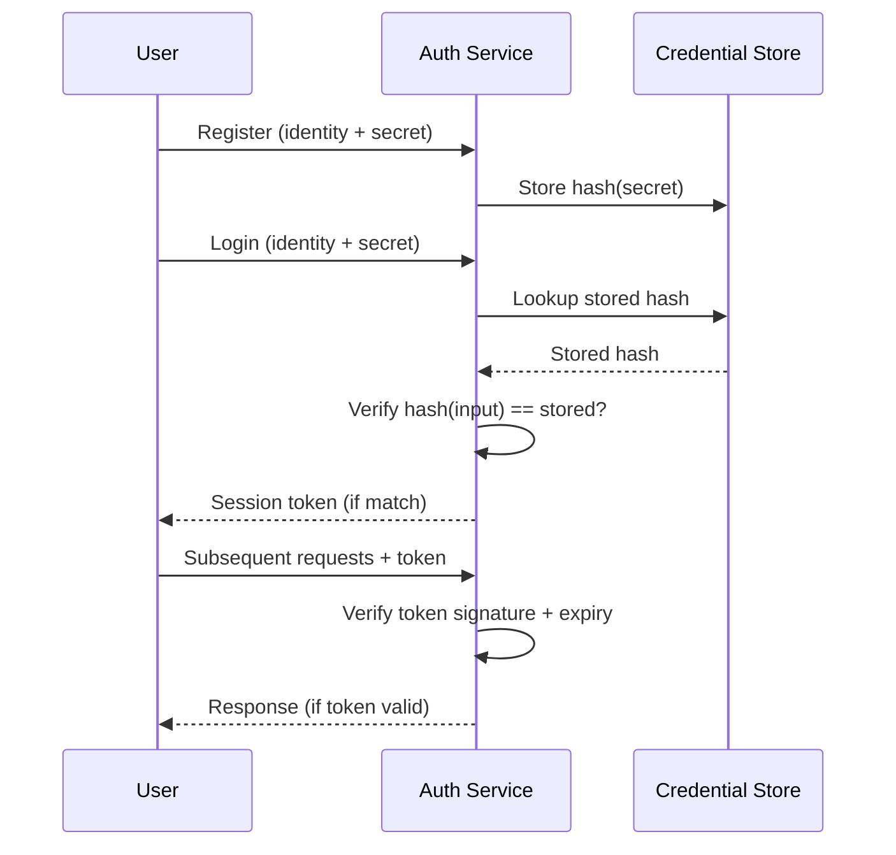
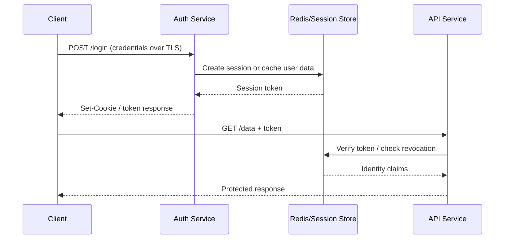

⚡ **TL;DR** - Authentication is the act of proving you are who you
claim to be - not just identifying yourself, but *proving* it. Every
authentication system is fundamentally a trust problem: how does a
system decide whether to believe a claim? The answer is always
"present a secret only the real user possesses" - but choosing
*which* secret, *how* to verify it, and *how long* to trust the
proof are where systems succeed or fail.

---

### 📊 Entry Metadata

| #001 | Category: Authentication | Difficulty: ★☆☆ |
|:---|:---|:---|
| **Depends on:** | - | |
| **Used by:** | ATH-006, ATH-008, ATH-012, ATH-047 | |
| **Related:** | ATH-002, ATH-003, ATH-004 | |

---

### 🔥 The Problem This Solves

**WORLD WITHOUT IT:**

Imagine a system where anyone who claims to be
"alice@company.com" gains access to Alice's files, emails,
and bank account. No verification. No challenge. The name
alone opens the door.

This was the early web. HTTP 1.0 had no authentication.
Any client that sent a request got a response. That was
fine for public documents. It was catastrophic the moment
systems held private data.

**THE BREAKING POINT:**

As soon as systems held private data - email, files,
financial records - two problems collided:

1. **Identity claims are free.** Anyone can say "I am Alice."
2. **Digital channels have no face.** A web server cannot
   look at a caller and recognize them the way a bank teller
   can.

**THE INVENTION MOMENT:**

The solution was forced by the combination of private data
and an anonymous network. Systems needed a way to bind a
claim ("I am Alice") to evidence that only Alice could
produce. Authentication was invented to solve that binding
problem.

**EVOLUTION:**

Early web authentication was HTTP Basic Auth (RFC 2617,
1999): Base64-encoded username:password on every request.
Every weakness in that model - cleartext secrets, no
multi-factor, no federation, no machine identity - drove
evolution toward sessions, JWTs, FIDO2 passkeys, and
workload identity systems used today.

---

### 📘 Textbook Definition

Authentication is the process of verifying that a claimed
identity is genuine. A subject (user, process, or device)
presents a credential - evidence of possessing a secret or
attribute linked to the claimed identity. The authenticating
party verifies the credential against a registered reference
and grants or denies the claim. Authentication answers "Are
you really who you say you are?" It does not answer "What
are you allowed to do?" - that is authorization.

---

### ⏱️ Understand It in 30 Seconds

**One line:**
Prove you are who you claim to be before being trusted.

**One analogy:**
> A hotel front desk checks your passport before giving
> you a room key. The passport does not grant access to
> anything - it only proves identity. Authentication is
> the passport check; authorization is the room key.

**One insight:**
Authentication and authorization are always separate steps,
even when they happen in milliseconds. Conflating them -
e.g. "if you have the URL, you're authorized" - is the root
cause of most access control vulnerabilities. Proving
identity and granting permission are different questions.

---

### 🔩 First Principles Explanation

**CORE INVARIANTS:**

1. **Claims are free.** Any party can assert any identity.
   The assertion has no cost and carries no inherent proof.
2. **Secrets are not free.** Producing the correct secret
   requires knowledge or possession. Forgery requires
   obtaining that secret.
3. **Verification is asymmetric.** The verifier must confirm
   the secret matches without necessarily knowing the raw
   secret (hashed passwords, public-key cryptography).

**DERIVED DESIGN:**

Given these invariants, every authentication system must:

- Bind a secret to an identity at registration time
- Challenge the claimant to produce that secret
- Verify without storing the raw secret where possible
- Expire the proof (secrets and sessions decay in trust)

The design space is constrained by: what secret can the
real user reliably produce? Passwords (knowledge), hardware
keys (possession), biometrics (inherence), or combinations.

**THE TRADE-OFFS:**

**Gain:** A verified binding between a digital request and
a real identity - trust can be extended selectively.

**Cost:** Friction. Every authentication event is user
effort. The stronger the requirement, the more users
abandon it. Security and usability are in direct tension.

**ESSENTIAL vs ACCIDENTAL COMPLEXITY:**

**Essential:** Verifying claims against unforgeable secrets
is irreducible. Any system holding private data must solve
it.

**Accidental:** Password complexity rules, forced periodic
rotation, CAPTCHA, and legacy Basic Auth headers are
accidental - workarounds for password limitations, not
fundamental authentication properties.

---

### 🧪 Thought Experiment

**SETUP:**

You are building a REST API. Users have accounts with
private data. HTTP requests arrive with a header:
`X-User-ID: alice`. Your API trusts this header.

**WHAT HAPPENS WITHOUT AUTHENTICATION:**

Anyone who learns Alice's user ID (visible in a URL, log
file, or response body) can set `X-User-ID: alice` and
receive all her private data:

```
GET /api/profile
X-User-ID: alice
```

The server returns Alice's full profile, messages, and
payment history. The claim is the access. There is no
check.

**WHAT HAPPENS WITH AUTHENTICATION:**

The server ignores `X-User-ID` and instead requires a
signed token that only Alice's login session could have
produced. Without Alice's password or hardware key, an
attacker cannot produce a valid token. The claim is
separated from the proof.

**THE INSIGHT:**

Any claim that cannot be challenged is a backdoor.
Authentication transforms identity from a *name* into
a *proof*.

---

### 🧠 Mental Model / Analogy

> A concert venue checks tickets before entry. Tickets are
> proof of purchase - only the buyer should have them. The
> checker does not know everyone's name; they verify the
> ticket is genuine and unused.

- "Ticket" → credential (password, token, certificate)
- "Ticket-checker" → authentication service
- "Genuine ticket" → valid credential matched to a user
- "Used ticket" → expired or revoked credential
- "Turnstile" → access gate (opens only after auth)
- "Concert" → the protected resource

**Where this analogy breaks down:** A stolen concert ticket
is fully usable. In strong authentication (MFA, hardware
keys), stealing the ticket alone is insufficient - the
attacker must also possess the physical key or biometric.

---

### 📶 Gradual Depth - Five Levels

**Level 1 - What it is (anyone can understand):**
Authentication is proving you are who you say you are.
Before a system trusts you, it checks a proof - usually
something only you know (password) or something only you
have (a phone app or hardware key).

**Level 2 - How to use it (junior developer):**
A user submits credentials, the server verifies against a
stored record, and issues a session or token. All subsequent
requests present that token. The server trusts the token,
not raw credentials on every call.

**Level 3 - How it works (mid-level engineer):**
Password auth: server computes bcrypt(input, stored_salt)
and compares to stored hash. On success, creates a session
record or signs a JWT. The credential is exchanged once;
subsequent trust lives in the session/token lifetime.

**Level 4 - Why it was designed this way (senior/staff):**
The session/token split exists because verifying credentials
on every request is expensive (bcrypt is deliberately slow)
or insecure (sending raw passwords repeatedly extends
exposure). Sessions add server state; JWTs add revocation
complexity. The design is a trade-off between statelessness
and the ability to instantly revoke trust.

**Level 5 - Mastery (distinguished engineer):**
Authentication is not a single decision point - it is a
trust chain. Each link (credential → session → request)
is an attack surface. The master practitioner designs
authentication in layers: phishing-resistant factor
(FIDO2), short-lived tokens (15-minute JWTs), continuous
risk signals, and instant revocation. They also know when
authentication is the WRONG layer - "has valid session"
proves identity, not freshness of consent.

---

### ⚙️ How It Works (Mechanism)

The authentication lifecycle has four distinct phases:

```
┌─────────────────────────────────────────────────────┐
│           Authentication Lifecycle                   │
├─────────────────────────────────────────────────────┤
│                                                      │
│  PHASE 1: REGISTRATION                               │
│  User ──→ [Submit identity + secret]                 │
│           ──→ [Store: identity + f(secret)]          │
│           (NEVER store raw secret)                   │
│                                                      │
│  PHASE 2: CHALLENGE                                  │
│  User ──→ [Claim identity]                           │
│           ──→ [Server: issue challenge / prompt]     │
│           ←── [Challenge delivered to user]          │
│                                                      │
│  PHASE 3: PROOF                                      │
│  User ──→ [Respond with secret]                      │
│           ──→ [Server: verify f(response) == stored] │
│           ──→ [Match? → trust established]           │
│                                                      │
│  PHASE 4: SESSION                                    │
│           ──→ [Issue session token / JWT]            │
│  User presents token on subsequent requests          │
│  Token expires → back to Phase 2                    │
│                                                      │
└─────────────────────────────────────────────────────┘
```



**Key security properties at each phase:**

- **Registration:** Never store raw secrets. Use adaptive
  hashing (bcrypt work factor=12, Argon2id). Add per-user
  salt to defeat rainbow table precomputation.
- **Challenge:** The challenge must be unpredictable.
  Nonces, timestamps, and PKCE verifiers serve this role.
- **Proof:** Secret must transit only over TLS. Use
  constant-time comparison to prevent timing side-channels.
- **Session:** Tokens must be signed (HMAC or RSA), have
  an expiry, and be revocable. A token that cannot be
  revoked is a credential that never expires.

---

### 🔄 The Complete Picture - End-to-End Flow

```
┌────────────────────────────────────────────────────────┐
│         End-to-End Authentication Flow                 │
├────────────────────────────────────────────────────────┤
│                                                        │
│  Browser/Client                                        │
│      │                                                 │
│      │ 1. POST /login {email, password} over TLS      │
│      ↓                                                 │
│  Auth Service  ← YOU ARE HERE                         │
│      │  a. Lookup user by email                       │
│      │  b. Verify bcrypt(input) == stored_hash        │
│      │  c. If match: create session or sign JWT       │
│      ↓                                                 │
│  Session / Token Store (Redis / DB)                   │
│      │                                                 │
│      │ 2. Response: Set-Cookie: session=...           │
│      │    OR: { "token": "eyJ..." }                   │
│      ↓                                                 │
│  Browser stores token / session cookie                │
│      │                                                 │
│      │ 3. GET /api/profile                            │
│      │    Authorization: Bearer eyJ...               │
│      ↓                                                 │
│  API Gateway / Middleware                             │
│      │  Verify token signature + expiry              │
│      │  Extract user identity claims                 │
│      ↓                                                 │
│  Application Logic (authorization check here)         │
│                                                        │
└────────────────────────────────────────────────────────┘
```



**FAILURE PATH:**

Auth service unavailable → all logins fail → cascades to
every authenticated endpoint → 401/503 for all users. The
auth service is often the highest-availability dependency in
the entire system.

**WHAT CHANGES AT SCALE:**

At 10k users: bcrypt + session DB is sufficient.
At 1M logins/day: bcrypt CPU becomes the bottleneck.
Auth service is consistently at 80%+ CPU. Solutions:
add dedicated auth replicas, move to stateless JWT
(verify signature only, no DB lookup on every request),
or use Argon2id (more GPU-resistant).

---

### 💻 Code Examples

**Example 1 - BAD vs GOOD: never store raw passwords**

```java
// BAD: storing raw password
// Any DB breach exposes every user's password
public void register(String email, String password) {
    userRepo.save(new User(email, password));
}

// GOOD: store only the bcrypt hash
// cost=12 means ~200ms per verify - expensive for attackers
public void register(String email, String password) {
    String hash = BCrypt.hashpw(
        password, BCrypt.gensalt(12)
    );
    userRepo.save(new User(email, hash));
}
```

**Example 2 - BAD vs GOOD: constant-time comparison**

```java
// BAD: short-circuits on first mismatch
// Timing side-channel reveals correct token prefix
if (submittedToken.equals(storedToken)) { ... }

// GOOD: constant time regardless of mismatch position
if (MessageDigest.isEqual(
        submittedToken.getBytes(StandardCharsets.UTF_8),
        storedToken.getBytes(StandardCharsets.UTF_8))) {
    // proceed
}
```

**Example 3 - FAILURE: timing side-channel on user lookup**

```
Symptom:
  Attacker measures response times:
    Unknown user  → 5ms (user lookup fails fast)
    Valid user,   → 205ms (bcrypt runs)
    wrong password
  Timing reveals which emails are registered.

Root cause:
  bcrypt only runs when user is found in DB.
  Fast path (user not found) vs slow path
  (user found, hash compared) is measurable.

Fix: Always run bcrypt, even for unknown users:

String DUMMY = BCrypt.hashpw("x", BCrypt.gensalt(12));

User user = userRepo.findByEmail(email);
String hash = (user != null) ? user.getHash() : DUMMY;
boolean valid = BCrypt.checkpw(password, hash);
if (user == null || !valid) {
    throw new AuthException("Invalid credentials");
}
```

**Example 4 - PRODUCTION: token revocation on logout**

```java
// BAD: pure stateless JWT with no revocation
// User logs out but token stays valid until expiry
public void logout(String token) {
    // Nothing - just tell client to delete cookie
    // Token valid for remaining lifetime (hours/days)
}

// GOOD: short-lived access + revocation cache
public void logout(String token) {
    String jti = parseJti(token);
    long remainingSecs = getRemainingSeconds(token);
    // Store jti in Redis with TTL = remaining lifetime
    redis.setex("revoked:" + jti, remainingSecs, "1");
}

// Every request: check revocation before trusting token
public boolean isValid(String token) {
    String jti = parseJti(token);
    if (redis.exists("revoked:" + jti)) return false;
    return verifySignatureAndExpiry(token);
}
```

---

### ⚠️ Common Failure Modes

**Credential stuffing:**

```
Symptom: spike in login failures at 3AM, thousands
of IPs, immediately followed by successful logins
and password-change events.

Root cause: attacker uses leaked credentials from
a breach of another service. Users reuse passwords.

Diagnosis:
  SELECT email, count(*) AS failures,
    count(DISTINCT ip) AS ips
  FROM auth_events
  WHERE success = false
    AND ts > NOW() - INTERVAL '1 hour'
  GROUP BY email HAVING count(*) > 20;

Fix:
  1. Rate-limit per IP AND per username independently
  2. Add CAPTCHA after 5 failures in 5 minutes
  3. Check HaveIBeenPwned API on login
  4. Require MFA for suspicious accounts
```

**Session fixation:**

```
Symptom: attacker logs in as victim without password.

Root cause: application reuses session ID across login.
Attacker sets victim's session ID before login; victim
authenticates; attacker now has authenticated session.

Fix: ALWAYS regenerate session ID on successful login:
  session.invalidate();
  // Spring Security: SessionFixationProtectionStrategy
  // does this automatically
```

**Token leakage via Referer:**

```
Symptom: JWT appears in third-party access logs.

Root cause: token placed in URL query string:
  /callback?token=eyJ...
  When page loads third-party resources, Referer header
  contains the full URL including the token.

Fix: NEVER put tokens in URLs.
  Use: Authorization header, POST body, HttpOnly cookie.
```

---

### 🔬 Internals Deep-Dive

**Why bcrypt is deliberately slow:**

bcrypt's cost factor sets Blowfish cipher rounds for key
derivation. At cost=12, one hash takes ~200ms on modern
hardware. This is the core defense:

```
Cost 10: ~65ms    → 15 guesses/sec (1 GPU)
Cost 12: ~250ms   →  4 guesses/sec (1 GPU)
Cost 14: ~1000ms  →  1 guess/sec  (1 GPU)

10-GPU rig against cost=12 DB:
  ~40 guesses/sec
  ~250 years for all 8-char lowercase passwords
  vs hours for unsalted MD5
```

The attacker computes the same function you do. There
is no way to make their computation cheaper without
making yours cheaper too. This is an algorithmic time-lock.

**Why salts defeat rainbow tables:**

Without salts: 1000 users with "password123" produce
the same hash. One crack exposes all 1000. With per-user
salts, identical passwords produce unique hashes. The
attacker must crack each hash independently.

---

### 📏 Decision Guide

**Use passwords when:**
- Users are familiar with password-based login
- Non-critical data, low attack surface
- Organization controls the client (corporate apps)

**Add MFA when:**
- Protecting financial, healthcare, or PII data
- B2B apps where accounts have high business value
- Compliance requires it (PCI-DSS, SOC 2, HIPAA)

**Move to passkeys (FIDO2) when:**
- Phishing resistance is required
- Mobile-first users with biometric devices
- User experience is a competitive differentiator

**Use federated auth (OIDC/SAML) when:**
- Enterprise users have existing corporate identity
- SSO required across multiple applications
- You want to delegate credential management risk

**Never build your own:**
- Never implement your own password hashing algorithm
- Never implement your own token generation
- Use: Spring Security, Passport.js, Authlib, devise

---

### 🔭 At Scale

**10x (tens of thousands of users):**
Standard bcrypt + session DB is fine. Redis sessions
scale horizontally. Single-region auth service is OK.

**100x (millions of users):**
bcrypt CPU becomes the bottleneck. Auth service at 80%+
CPU consistently. Solutions:
- Add auth replicas (stateless if JWT)
- Bounded thread pool for async bcrypt computation
- Move to Argon2id (more GPU-resistant)

**1000x (hundreds of millions):**
Global auth infrastructure. Regional endpoints reduce
latency (login should complete in <200ms globally).
Read replicas for credential lookup. Bot detection layer
before auth hits credential check - at this scale, >99%
of failed logins are credential stuffing.

---

### 🎓 Interview Deep-Dive

**Q: Why bcrypt over SHA-256 for password storage?**

SHA-256 is fast - designed for integrity checking.
On a modern GPU: 10 billion SHA-256 hashes per second.
A stolen SHA-256 database is fully cracked in hours.

bcrypt is deliberately slow. At cost=12, ~250ms per hash.
An attacker doing 10 billion operations cracks the same
database in ~30 years instead of hours.

SHA-256 is correct for integrity. bcrypt, Argon2, scrypt
are correct for password storage. Wrong tool = exposed
users at the next breach.

**Q: What is the difference between authentication and
   authorization, and why does conflating them matter?**

Authentication: "Is this really Alice?"
Authorization: "Is Alice allowed to do this?"

Different questions, different data, different failure
modes. A system that conflates them - "if authenticated,
access any record" - grants all users access to all data.
This is the root cause of IDOR (OWASP Top 1 category).

Design consequence: authentication produces an identity
claim (who you are). Authorization produces a permission
decision (what you may do). Separate systems, separate
audit trails.

**Q: Why is constant-time comparison critical?**

Non-constant-time comparisons short-circuit on the first
mismatched byte. An attacker observing timing can recover
the token one byte at a time - a timing side-channel.

For a 32-byte token, this reduces search space from 2^256
to 256 * 32 = 8,192 attempts. Constant-time comparison
ensures the same elapsed time regardless of where the
mismatch occurs, eliminating the observable timing signal.

---

### 🌍 Real-World Usage

- **AWS SigV4:** Every AWS API call is authenticated by
  HMAC-SHA256 signing with the IAM secret key. The server
  recomputes the HMAC - no password ever transits the wire.
- **GitHub passkeys (2023):** FIDO2 passkeys bound to
  the origin (github.com) - phishing-resistant because
  passkeys cannot be replayed against any other domain.
- **Okta breach (2022):** A compromised support engineer
  session token allowed attackers to access customer
  tenants. The token had no IP binding or time-of-day
  restriction - fully transferable after theft.

---

### 🔁 Transferable Wisdom

Authentication is a special case of **unforgeable proof
of possession**. The same structure appears everywhere:

- **Cryptographic signatures:** private key proves
  ownership without revealing the key itself
- **Physical access badges:** RFID proves physical
  possession (token equivalent)
- **Border control:** passport proves identity via
  issuing government's signature (PKI in physical form)
- **mTLS:** service proves identity via CA-signed
  certificate - authentication without username/password
  for machine-to-machine communication

The abstract pattern: **a trusted party binds a secret
to an identity at registration; the holder proves
possession at verification time without revealing the
raw secret.** Every authentication system is an instance
of this structure.

---

*Authentication category: ATH | Entry: ATH-001 | v5.0*