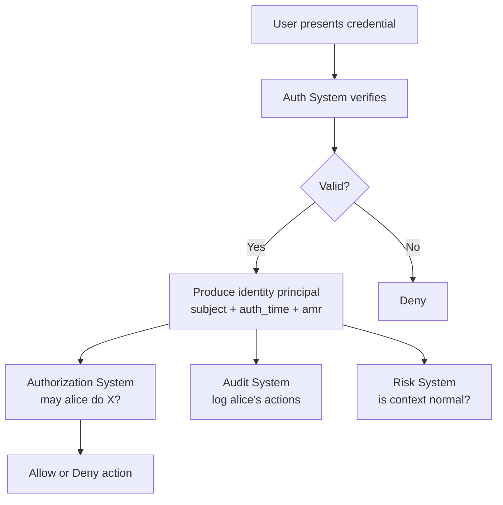

⚡ **TL;DR** - Authentication proves identity at a specific moment
in time using the presented credential. It does NOT prove intent,
current device safety, or entitlement to any resource. Understanding
this boundary prevents a common design mistake: over-trusting
authentication as a complete security control.

---

### 📊 Entry Metadata

| #002 | Category: Authentication | Difficulty: ★☆☆ |
|:---|:---|:---|
| **Depends on:** | ATH-001 The Authentication Problem | |
| **Used by:** | ATH-004, ATH-022, ATH-047 | |
| **Related:** | ATH-001, ATH-003, ATH-004 | |

---

### 🔥 The Problem This Solves

**WORLD WITHOUT IT:**

Many systems treat "logged in" as equivalent to "trustworthy."
The user authenticated, so every action they take must be
legitimate. This feels safe - they proved who they are.

But consider: Alice authenticated yesterday. Today her laptop
is compromised by malware. The malware is now making API calls
with Alice's valid session token. The server sees a valid, recent
authentication. It complies. There is no anomaly to detect
because the authentication claim is technically true.

**THE BREAKING POINT:**

Authentication answers exactly one question: did this entity
produce valid evidence of possessing the registered secret
at the time of the check?

It does NOT answer:
- Is this entity's device compromised?
- Is this entity acting voluntarily or under coercion?
- Should this entity have access to this specific resource?
- Has anything changed since the last authentication?

Systems that treat "authenticated" as "trusted for everything"
have failed to understand the boundary of what authentication
proves. The result is access that persists after compromise,
privilege that was never meant to be granted, and incidents
that authentication alone can never prevent.

**THE INVENTION MOMENT:**

Formalizing what authentication proves - and does not prove -
emerged from security architecture work in the 1990s and 2000s
as developers discovered that single-sign-on systems and long-
lived sessions created new attack surfaces that authentication
design had never considered.

---

### 📘 Textbook Definition

Authentication produces a verified identity claim: the assertion
that a specific registered entity produced valid evidence at a
specific time. It is a point-in-time verification of credential
possession. Authentication does not establish intent, authorization,
device integrity, or the continuation of trust beyond the moment
of verification. The result of authentication is an identity
principal that subsequent systems (authorization, audit logging,
risk analysis) can act on - but each must independently evaluate
its own question.

---

### ⏱️ Understand It in 30 Seconds

**One line:**
Authentication proves you had the right secret when you
presented it - nothing more.

**One analogy:**
> A bouncer checks your ID at the door. The ID confirms your
> identity and age at the time of issue. It does not confirm
> you are sober, that you will behave appropriately, or that
> you should be allowed into the VIP section. Each of those
> is a separate check, by a separate person, for a different
> question.

**One insight:**
Authentication is a building block, not a complete security
control. It answers "who" - authorization answers "may they,"
risk signals answer "should we trust this context," and audit
answers "what did they do." Treating any one of these as the
full answer is the root cause of privilege misuse.

---

### 🔩 First Principles Explanation

**WHAT AUTHENTICATION ACTUALLY ASSERTS:**

At the moment of successful authentication, the system can
assert exactly:

1. The credential presented matches the registered credential.
2. The credential is not expired or revoked.
3. The challenge-response exchange was completed correctly.

That is the complete list. Everything else is inference.

**WHAT IT DOES NOT ASSERT:**

| Claim | Why Authentication Cannot Prove It |
|---|---|
| Intent to perform a specific action | Authentication happens before any action |
| Device integrity | Auth checks the credential, not the machine |
| Account not compromised | Stolen credentials produce valid authentication |
| Entitlement to a resource | Authorization is a separate system |
| The user is the same person as at registration | Credentials can be transferred or stolen |
| Safety of subsequent requests | Sessions can be hijacked after authentication |

**THE TRADE-OFFS:**

**Gain:** A verified identity principal that all downstream
systems can build on without re-verifying the credential.

**Cost:** False confidence. Once developers know "the user
is authenticated," they may skip additional controls that
are actually required.

---

### 🧠 Mental Model / Analogy

> Authentication is like a signed contract at the moment of
> signing. The notary verifies the signature is genuine -
> that the person signing was who they claimed to be when
> they signed. But the contract does not enforce itself;
> it does not prevent the signer from changing their mind;
> it does not guarantee they will fulfill the terms. A
> different system (the courts, enforcement) handles that.

- "The notary" → the authentication system
- "Signature verification" → credential verification
- "The signed contract" → the issued session or token
- "Contract terms" → what the authenticated user may do (authorization)
- "Courts" → authorization and access control systems

**Where this analogy breaks down:** A contract is valid until
voided. An auth token has a TTL. But the key property holds:
verification of identity at signing time does not guarantee
behavior or entitlement after that moment.

---

### 📶 Gradual Depth - Five Levels

**Level 1 - What it is (anyone can understand):**
Logging in proves who you are at that moment. It does not
guarantee your computer is safe, that someone else isn't
using your account, or that you are allowed to do everything
you try to do after logging in.

**Level 2 - How to use it (junior developer):**
After authentication, always ask: "Is this authenticated
user authorized to perform this specific action on this
specific resource?" Do not assume "logged in" means
"authorized for everything." Authorization is a separate
check, every time.

**Level 3 - How it works (mid-level engineer):**
Authentication produces an identity principal (a user ID,
email, or token subject). That principal is passed to
authorization, audit logging, and risk systems. Each
evaluates its own question against the principal. None
should assume the others have already done their job.

**Level 4 - Why it was designed this way (senior/staff):**
Separation of authentication from authorization enables
each to evolve independently. A stronger authentication
mechanism (adding FIDO2) does not require changes to
authorization policies. A role change does not require
re-authentication. The two systems have different data
models, different storage, and different performance
characteristics - coupling them is an architectural mistake.

**Level 5 - Mastery (distinguished engineer):**
Authentication is point-in-time; trust is continuous. The
move toward continuous authentication (monitoring signals
after login to detect anomalies - new IP, unusual behavior,
device fingerprint mismatch) reflects the understanding that
a single point of verification is insufficient for high-value
resources. Zero Trust architecture formalizes this: never
implicitly trust a session; verify continuously based on
device posture, behavioral signals, and resource sensitivity.

---

### ⚙️ How It Works (Mechanism)

The authentication event produces a **principal** - a
structured representation of the verified identity. This
principal is the ONLY output authentication provides:

```
┌────────────────────────────────────────────────────┐
│      Authentication Output: Identity Principal     │
├────────────────────────────────────────────────────┤
│                                                    │
│  Authentication Result:                            │
│  {                                                 │
│    subject:  "user:alice@company.com",             │
│    auth_time: 1716048000,   // Unix timestamp      │
│    amr: ["pwd", "totp"],    // methods used        │
│    acr: "2",                // assurance level     │
│    session_id: "abc123...", // session reference   │
│    expires: 1716051600      // 1 hour later        │
│  }                                                 │
│                                                    │
│  What downstream systems MUST do with this:        │
│                                                    │
│  Authorization: check if alice may do the action   │
│  Audit logging: record alice performed the action  │
│  Risk analysis: evaluate if context seems normal   │
│                                                    │
│  What NO system should do:                         │
│  Assume "alice authenticated" = "alice may do X"   │
│                                                    │
└────────────────────────────────────────────────────┘
```



**The `amr` and `acr` claims (critical for downstream trust):**

Authentication produces metadata about HOW the user
authenticated, not just THAT they did:

- `amr` (Authentication Methods Reference): which methods
  were used - `["pwd"]`, `["pwd", "totp"]`, `["fido"]`
- `acr` (Authentication Context Class Reference): assurance
  level - "1" (single factor), "2" (multi-factor)

Downstream systems can use these to require re-authentication
for sensitive actions: "This operation requires acr=2. Current
session has acr=1. Prompt for step-up authentication."

---

### 💻 Code Examples

**Example - BAD vs GOOD: checking auth vs checking authz**

```java
// BAD: treats "authenticated" as "authorized for everything"
@GetMapping("/admin/users")
public List<User> getAllUsers(@AuthUser User user) {
    // Only checks: is there a valid user in the session?
    // Does NOT check: is this user an admin?
    return userService.findAll();
}

// GOOD: separates auth claim from authz check
@GetMapping("/admin/users")
@PreAuthorize("hasRole('ADMIN')")
public List<User> getAllUsers(@AuthUser User user) {
    // Spring Security checks role after authentication
    return userService.findAll();
}
```

**Example - PRODUCTION: step-up authentication for sensitive ops**

```java
// Require stronger authentication for high-value actions
@DeleteMapping("/account")
public void deleteAccount(
        @AuthUser User user,
        @RequestHeader("Authorization") String token) {

    JwtClaims claims = jwtParser.parse(token);
    String amr = claims.getStringClaimValue("amr");
    long authAge = Instant.now().getEpochSecond()
        - claims.getIssuedAt().getValue();

    // Require MFA AND recent authentication for deletion
    if (!amr.contains("totp") && !amr.contains("fido")) {
        throw new StepUpRequiredException(
            "MFA required for account deletion"
        );
    }
    if (authAge > 300) { // 5 minutes
        throw new StepUpRequiredException(
            "Recent re-authentication required"
        );
    }
    accountService.delete(user.getId());
}
```

---

### ⚠️ Common Failure Modes

**Over-trusting long sessions:**

```
Symptom:
  An employee's account is used for malicious actions
  at 2AM. The employee denies involvement.

Root cause:
  Session was 30 days old, issued at login. Employee's
  laptop was compromised. Authentication check passed
  (valid session) but the entity using the session had
  changed.

Fix:
  1. Short session lifetimes (hours, not days)
  2. Step-up re-authentication for sensitive actions
  3. Anomaly detection: unusual time, IP, or behavior
     should trigger session challenge or invalidation
```

---

### 🔭 At Scale

Authentication claims become trust tokens distributed across
microservices. Each service receives a JWT and must decide
what to trust. At scale:

- Services cannot call the auth service on every request
  (latency). JWTs enable stateless verification.
- But JWT validity != authorization. Each service must
  implement its own authz checks against the principal.
- Central authz services (OPA sidecars) enforce policies
  across services using the auth principal as input.

---

### 🎓 Interview Deep-Dive

**Q: What is the difference between authentication,
   authorization, and access control?**

Authentication: "Is this really Alice?" - identity proof.
Authorization: "May Alice perform this action?" - permission.
Access control: the enforcement of authorization decisions
in the system - the gates, middleware, and checks that
prevent unauthorized access even if the request reaches them.

They form a chain: authentication produces a verified
principal, authorization evaluates whether that principal
may act, access control enforces the decision. Breaking
any link breaks the chain - and authentication is only
the first link.

---

*Authentication category: ATH | Entry: ATH-002 | v5.0*