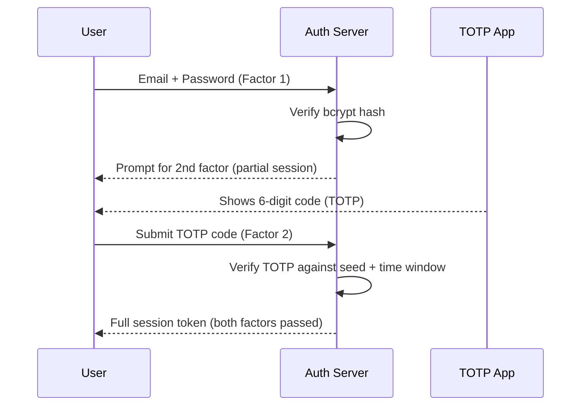

⚡ **TL;DR** - Every authentication credential falls into one of
three categories: something you know (password, PIN), something
you have (phone, hardware key), or something you are (biometric).
Combining two or more independent categories is multi-factor
authentication - its security strength comes from requiring an
attacker to compromise multiple independent channels.

---

### 📊 Entry Metadata

| #003 | Category: Authentication | Difficulty: ★☆☆ |
|:---|:---|:---|
| **Depends on:** | ATH-001 The Authentication Problem | |
| **Used by:** | ATH-012, ATH-013, ATH-028, ATH-036, ATH-037 | |
| **Related:** | ATH-002, ATH-004, ATH-012 | |

---

### 🔥 The Problem This Solves

**WORLD WITHOUT IT:**

Authentication systems historically used only passwords.
A password is "something you know" - and the problem
with knowledge-based factors is that knowledge can be
shared, observed, and transferred without the holder
being aware.

If someone learns your password - through phishing, a
data breach, shoulder surfing, or guessing - they have
everything needed to authenticate as you. The authentication
system cannot distinguish between you and the attacker.
The credential is fully portable.

**THE BREAKING POINT:**

The three-factor model emerged from the recognition that
different types of credentials have different attack
profiles. A credential tied to a physical device
(something you have) cannot be stolen without the device.
A credential tied to a biometric (something you are)
cannot be transferred at all. Combining factors that
have independent attack requirements means an attacker
must succeed at multiple independent challenges.

**THE INVENTION MOMENT:**

The three-factor framework was formalized in security
standards during the 1990s. NIST SP 800-63 (2003 and
later) codified the knowledge/possession/inherence
taxonomy that is now universal in authentication design.

---

### 📘 Textbook Definition

Authentication factors are classified into three mutually
exclusive categories based on the nature of the credential:
knowledge factors (something the authenticating entity knows),
possession factors (something the entity physically has), and
inherence factors (something the entity biologically is).
Multi-factor authentication (MFA) requires successful
verification of credentials from two or more distinct
categories. The security value of MFA derives from the
independence of factor categories: compromising one does not
compromise another.

---

### ⏱️ Understand It in 30 Seconds

**One line:**
Prove identity with something you know, something you have,
or something you are - or any combination of these.

**One analogy:**
> An ATM requires your card (something you have) AND your PIN
> (something you know). Stealing your PIN without your card is
> useless. Stealing your card without your PIN is useless.
> The attacker must win on two independent fronts simultaneously.

**One insight:**
Two factors from the SAME category is not MFA - it is 2SFA
(two-step factor authentication), which provides less protection.
"Password + security question" are both knowledge factors:
one breach often exposes both. True MFA combines categories:
password + TOTP code from a separate device.

---

### 🔩 First Principles Explanation

**THE THREE CATEGORIES AND THEIR PROPERTIES:**

**Factor 1 - Knowledge (Something You Know)**

Examples: password, PIN, security questions, passphrase

Properties:
- Can be shared (voluntarily or via breach/phishing)
- Can be observed (shoulder surfing, keylogging)
- Can be guessed (dictionary attacks, brute force)
- Has no physical presence requirement
- Can be reset if forgotten

Attack vectors: phishing, credential stuffing, keyloggers,
data breaches, social engineering, password guessing

**Factor 2 - Possession (Something You Have)**

Examples: smartphone (TOTP app), hardware security key
(YubiKey), smart card, one-time code sent to a phone,
software token, credential stored in a TPM chip

Properties:
- Requires physical access to steal
- Can be lost or stolen, but theft is detectable
- Time-based codes rotate, limiting the theft window
- Hardware keys are phishing-resistant (domain-bound)
- Can be provisioned and remotely deprovisioned

Attack vectors: SIM swapping (for SMS-based), device
theft, malware accessing soft tokens, relay attacks

**Factor 3 - Inherence (Something You Are)**

Examples: fingerprint, face recognition, iris scan,
voice recognition, behavioral biometrics

Properties:
- Cannot be transferred (no credential to steal)
- Cannot be forgotten or lost
- Cannot be changed if compromised (immutable)
- Verification is probabilistic, not deterministic
- Privacy implications (biometric data is highly sensitive)
- False acceptance and false rejection rates always > 0

Attack vectors: biometric spoofing (photos, 3D prints),
deepfake audio/video, sensor compromise, template theft

**INDEPENDENCE IS THE KEY SECURITY PROPERTY:**

```
Single factor (password only):
  Attack surface = steal the password
  One successful attack = full access

Two factors from same category (password + secret question):
  Attack surface = steal both (often from same breach)
  One data breach may expose both

Two factors from different categories (password + TOTP):
  Attack surface = steal password AND steal the device
  Requires two independent successful attacks
  → Dramatically higher attacker cost
```

**THE TRADE-OFFS:**

**Gain:** Requiring multiple independent factors forces
attackers to succeed at multiple independent challenges.

**Cost:** User friction. Each additional factor adds
steps to the login process. MFA adoption historically
stalls at ~50% even when offered to users who have
experienced account compromise.

---

### 🧠 Mental Model / Analogy

> A bank vault requires two separate keys held by two
> different bank employees. Neither employee can open
> the vault alone. An attacker must compromise both
> employees independently. The security comes from
> the independence of the two access paths.

- "Two separate keys" → two different factor categories
- "Two different employees" → two independent attack surfaces
- "Neither can open it alone" → single-factor is insufficient
- "Compromise both employees independently" → the attacker's cost

**Where this analogy breaks down:** Bank employees can
collude. Authentication factors cannot - a stolen password
still cannot produce a TOTP code from a hardware device
the attacker doesn't possess.

---

### 📶 Gradual Depth - Five Levels

**Level 1 - What it is (anyone can understand):**
There are three ways to prove who you are: know something
(password), have something (phone or key), or be something
(fingerprint). Using two different types at once makes it
much harder for attackers.

**Level 2 - How to use it (junior developer):**
When implementing MFA, ensure the second factor is from
a DIFFERENT category than the first. Password + TOTP is
genuine MFA. Password + security question is not - both
are knowledge factors. Always communicate to users why
MFA matters.

**Level 3 - How it works (mid-level engineer):**
The server stores a separate secret for each factor type.
For TOTP (possession): the server stores a seed shared with
the authenticator app. At verification: server generates
the expected TOTP for the current 30-second window and
compares to the user-submitted code. Both factors must
pass before the session is established.

**Level 4 - Why it was designed this way (senior/staff):**
Factor independence is the core security property. NIST
800-63B acknowledges that not all factors in a category
are equally strong: hardware keys (FIDO2) are phishing-
resistant while SMS OTPs are not (SIM swapping). The
standard introduced Authenticator Assurance Levels (AAL)
to distinguish these: AAL1 (single factor), AAL2 (two
factor including at least one possession), AAL3 (hardware-
bound key required).

**Level 5 - Mastery (distinguished engineer):**
The factor taxonomy is simplifying. Modern authentication
theory also considers: binding (is this factor bound to
a specific origin - FIDO2 is, TOTP is not), verifier
impersonation resistance (FIDO2 prevents phishing; passwords
do not), and the ceremony (does the user have to actively
participate in each factor, or can one be passive background).
Risk-based auth adds a fourth dimension: context signals
(device fingerprint, IP reputation, behavioral patterns) as
continuous implicit factors that can strengthen or weaken
required assurance level dynamically.

---

### ⚙️ How It Works (Mechanism)

A two-factor login flow with password + TOTP:

```
┌──────────────────────────────────────────────────────┐
│         Two-Factor Authentication Flow               │
├──────────────────────────────────────────────────────┤
│                                                      │
│  Step 1: KNOWLEDGE FACTOR                            │
│  User ──→ [submit email + password]                  │
│           ──→ [verify bcrypt hash]                   │
│           ──→ [PASS: identity confirmed]             │
│           ──→ [issue: PARTIAL session (pre-MFA)]     │
│                                                      │
│  Step 2: POSSESSION FACTOR                           │
│  User ──→ [submit 6-digit TOTP code]                 │
│           ──→ [verify against TOTP seed + time]      │
│           ──→ [PASS: possession confirmed]           │
│           ──→ [upgrade to FULL authenticated session]│
│                                                      │
│  Both factors required; failure at either = deny     │
│                                                      │
└──────────────────────────────────────────────────────┘
```



**TOTP verification internals:**

```
Server stores: TOTP seed (Base32 string per user)
On verification:
  time_step = floor(unix_timestamp / 30)
  expected = HMAC-SHA1(seed, time_step)
  truncate to 6 digits
  compare with user-submitted code
  Also check time_step ± 1 (clock drift tolerance)
```

---

### 💻 Code Examples

**Example - Spring Security: require MFA before full session**

```java
// Step 1: password check succeeds, issue pre-auth token
@PostMapping("/login")
public ResponseEntity<?> login(@RequestBody LoginRequest req) {
    User user = userService.verifyPassword(
        req.getEmail(), req.getPassword()
    );
    // Issue a short-lived, pre-MFA token (not full session)
    String preAuthToken = tokenService.issuePreAuthToken(
        user.getId(), Duration.ofMinutes(5)
    );
    return ResponseEntity.ok(
        Map.of("preAuthToken", preAuthToken,
               "requiresMfa", user.isMfaEnabled())
    );
}

// Step 2: TOTP verification completes authentication
@PostMapping("/mfa/verify")
public ResponseEntity<?> verifyMfa(
        @RequestBody MfaRequest req,
        @RequestHeader("X-PreAuth-Token") String preAuth) {
    Long userId = tokenService.validatePreAuth(preAuth);
    User user = userService.findById(userId);
    if (!totpService.verify(user.getTotpSeed(), req.getCode())) {
        throw new AuthException("Invalid TOTP code");
    }
    // Both factors passed - issue full session
    String sessionToken = tokenService.issueFullSession(userId);
    return ResponseEntity.ok(Map.of("token", sessionToken));
}
```

**Example - FAILURE: SMS OTP bypassed via SIM swap**

```
Scenario:
  1. Attacker socially engineers mobile carrier to transfer
     victim's phone number to attacker's SIM card
  2. Attacker uses victim's stolen password (from breach)
  3. Auth system sends OTP to victim's number
  4. OTP arrives on attacker's phone (SIM swap succeeded)
  5. Attacker submits password + OTP → full access

Why it works:
  SMS OTP is a possession factor, but the "possession"
  is the phone number, not a physical device. Phone
  numbers can be transferred without physical access.

Mitigation:
  Replace SMS OTP with:
  - TOTP app (seed bound to the app, not the number)
  - Hardware key (FIDO2, phishing AND SIM-swap resistant)
  For high-value accounts: explicitly disallow SMS downgrade
```

---

### ⚠️ Common Failure Modes

**Factor downgrade attack:**

```
Symptom:
  Users who set up hardware keys can bypass MFA by
  clicking "use a different method" and selecting SMS.

Root cause:
  Fallback to a weaker factor category is offered.
  The UI prioritizes user convenience over security.

Fix:
  For high-assurance accounts: no fallback to weaker
  factor. If hardware key is lost, require identity
  re-verification (in-person or video) to re-enroll.
  Never allow downgrade from hardware-bound to SMS.
```

**Recovery codes as a factor bypass:**

```
Symptom:
  Attacker uses phished password + recovery code to
  bypass MFA entirely.

Root cause:
  Recovery codes are knowledge factors. If they are
  stored insecurely (email, spreadsheet, reused across
  services), they become another phishable secret.

Fix:
  Recovery codes are one-time use. Store them encrypted.
  Limit recovery code attempts (rate-limit + alert).
  Require re-enrollment after using a recovery code.
```

---

### 🔭 At Scale

At consumer scale (millions of users), MFA adoption is
a UX and accessibility challenge. Mandatory TOTP drops
off users without smartphones. Hardware keys have hardware
costs. Passkeys (FIDO2 discoverable credentials) solve this
by using device biometrics as the possession/inherence
combination - the fingerprint sensor on a phone makes
FIDO2 authentication as easy as a password while being
phishing-resistant.

---

### 🌍 Real-World Usage

- **Google's internal deployment (2017):** Google replaced
  all employee SMS and TOTP MFA with hardware security keys.
  Result: zero successful phishing attacks on Google employees
  since deployment. The key is bound to accounts.google.com -
  it physically cannot authenticate against a phishing domain.
- **Microsoft authenticator push notifications:** Combined
  number matching (knowledge element) with push notification
  (possession). Mitigates MFA fatigue attacks where attackers
  spam approve prompts hoping the user accidentally taps.
- **NIST 800-63B (2017 update):** Officially deprecated SMS
  OTP as a recommended factor and classified it as "restricted"
  due to SIM swapping and SS7 interception vulnerabilities.

---

*Authentication category: ATH | Entry: ATH-003 | v5.0*