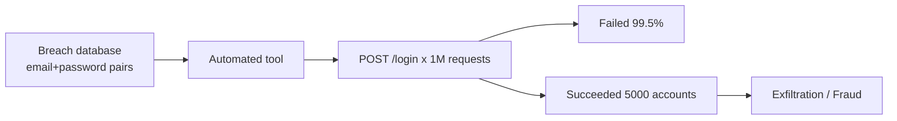

⚡ **TL;DR** - Authentication attacks fall into five categories:
steal credentials, guess credentials, bypass the challenge,
replay captured proofs, or hijack an active session. Every
authentication defense maps to one or more of these attack
classes. Understanding the taxonomy is the foundation of
designing defenses that address root causes rather than symptoms.

---

### 📊 Entry Metadata

| #005 | Category: Authentication | Difficulty: ★☆☆ |
|:---|:---|:---|
| **Depends on:** | ATH-001, ATH-003 | |
| **Used by:** | ATH-017, ATH-018, ATH-035, ATH-036, ATH-044, ATH-046 | |
| **Related:** | ATH-001, ATH-003, ATH-017 | |

---

### 🔥 The Problem This Solves

**WORLD WITHOUT IT:**

Developers who do not understand the attack space tend to
implement point defenses that look comprehensive but have
gaps. They add password requirements (addressing guessing)
but leave sessions valid for 30 days (enabling replay/session
theft). They require MFA (addressing credential theft) but
use SMS OTP (vulnerable to SIM swapping). They rate-limit
logins (addressing brute force) but not password resets
(alternative attack path).

Each defense solves one attack but leaves others open.
A systematic understanding of the attack taxonomy is the
prerequisite for systematic defense.

---

### 📘 Textbook Definition

Authentication attacks are adversarial techniques that
attempt to subvert the authentication process by obtaining,
guessing, bypassing, replaying, or hijacking the evidence
required to establish a verified identity. The five canonical
attack classes are: credential theft, credential guessing,
authentication bypass, proof replay, and session hijacking.
Each class targets a different phase of the authentication
lifecycle and requires different defensive countermeasures.

---

### ⏱️ Understand It in 30 Seconds

**One line:**
Attackers either steal your proof, guess it, skip the check,
reuse an old one, or take over after you've already proven it.

**One analogy:**
> A thief trying to get into a hotel room either steals your
> key card, guesses the room number and tries a master key
> they made, bribes the front desk to give them a key
> without showing ID, uses a scan of your card they captured
> yesterday, or follows you in right after you unlock the door.
> Each method requires a different counter.

**One insight:**
No single defense covers all five attack classes.
Rate-limiting stops guessing but not theft. MFA stops
theft but not session hijacking. Defense-in-depth requires
layering defenses that cover independent attack classes.

---

### 🔩 First Principles Explanation

**THE FIVE ATTACK CLASSES:**

```
┌──────────────────────────────────────────────────────┐
│         Authentication Attack Taxonomy               │
├──────────────────────────────────────────────────────┤
│                                                      │
│  1. CREDENTIAL THEFT                                 │
│     Attack: Obtain the actual credential             │
│     Methods: phishing, data breach, keylogger,       │
│              shoulder surfing, social engineering    │
│     Defense: MFA, phishing-resistant factors,        │
│              breach detection, credential monitoring │
│                                                      │
│  2. CREDENTIAL GUESSING                              │
│     Attack: Derive or guess the credential           │
│     Methods: brute force, dictionary attack,         │
│              credential stuffing (from other breaches│
│              password spraying                       │
│     Defense: rate limiting, account lockout,         │
│              strong password policy, MFA             │
│                                                      │
│  3. AUTHENTICATION BYPASS                            │
│     Attack: Skip the credential check entirely       │
│     Methods: SQL injection in login form,            │
│              logic flaws in auth code,               │
│              parameter manipulation, forced browsing │
│     Defense: parameterized queries, secure code      │
│              review, auth tests, WAF rules           │
│                                                      │
│  4. PROOF REPLAY                                     │
│     Attack: Reuse a captured valid credential/token  │
│     Methods: MITM to capture token, token leakage    │
│              in logs/URLs, JWT replay                │
│     Defense: HTTPS everywhere, short token TTL,      │
│              nonces, token binding, DPoP             │
│                                                      │
│  5. SESSION HIJACKING                                │
│     Attack: Take over after authentication completes │
│     Methods: session token theft (XSS, sniffing),   │
│              session fixation, CSRF                  │
│     Defense: HttpOnly cookies, Secure flag,          │
│              SameSite, CSRF tokens, session rotation │
│                                                      │
└──────────────────────────────────────────────────────┘
```

**ATTACK TARGETING BY LIFECYCLE PHASE:**

| Auth Phase | Primary Attack Class |
|---|---|
| Registration | Social engineering (phone/email account takeover) |
| Login - credential entry | Phishing, credential stuffing, brute force |
| Login - challenge/response | Bypass (SQLi, logic flaws) |
| Token/session issuance | Token theft, replay injection |
| Ongoing session use | Session hijacking, CSRF, XSS |
| Password reset | Account takeover via email/SMS interception |

**THE TRADE-OFFS:**

Adding defenses for each attack class increases complexity
and user friction. The art of authentication design is
choosing defenses proportional to the value of what is
being protected.

---

### 🧠 Mental Model / Analogy

> A castle gate has multiple failure modes: enemies can
> steal the key (theft), forge a matching key (guessing),
> find a secret passage (bypass), use a wax impression
> of the key made last week (replay), or sneak in behind
> a legitimate visitor (session hijacking). Each requires
> a different countermeasure: guard the key, make it
> unforgeable, seal the passage, change locks frequently,
> close the gate before the next visitor.

---

### 📶 Gradual Depth - Five Levels

**Level 1 - What it is (anyone can understand):**
Hackers try to log in as you by either stealing your
password, guessing it, finding a bug to skip the password
check, reusing an old password from a breach, or taking
over your session after you've already logged in.

**Level 2 - How to use it (junior developer):**
For each endpoint and authentication flow, ask: which
of the five attack classes could succeed here? Credential
stuffing → rate-limit logins. Session theft → HttpOnly
cookies, short TTL. Auth bypass → parameterized queries,
no string concatenation in SQL.

**Level 3 - How it works (mid-level engineer):**
Credential stuffing is automated: attackers take email/password
pairs from third-party breaches (available as bulk downloads
on dark web markets) and test them against your login API.
Success rate is ~0.1-2% - but at millions of attempts, that
yields thousands of compromised accounts. Defense: detect
and block by velocity per IP AND per username, not either alone.

**Level 4 - Why it was designed this way (senior/staff):**
Authentication attacks have evolved with defenses. When
passwords were plaintext, theft was sufficient. When hashing
became standard, guessing (rainbow tables, dictionary attacks)
became dominant. When rate limiting became standard, credential
stuffing (large, slow distributed attacks) became dominant.
When MFA became standard, attackers moved to phishing MFA
codes (real-time relay). Defense and attack co-evolve;
defense must be dynamic, not static.

**Level 5 - Mastery (distinguished engineer):**
The most dangerous attacks are those that exploit trust
transitions: password reset flows, account recovery, device
enrollment. These are the high-friction, low-frequency events
where users are willing to accept unusual steps - which
attackers exploit via social engineering. The design insight:
the weakest link in authentication is often not the login
flow but the account recovery path. Security of recovery
must match security of login.

---

### ⚙️ How It Works (Mechanism)

**Credential stuffing attack flow:**

```
┌───────────────────────────────────────────────────────┐
│           Credential Stuffing Attack                  │
├───────────────────────────────────────────────────────┤
│                                                       │
│  1. Attacker downloads breach database               │
│     (email:password pairs from other services)       │
│                                                       │
│  2. Automated tool tests pairs against target API    │
│     POST /login { email: "alice@x.com",              │
│                   password: "Summer2023!" }          │
│     → 401 (wrong password - user changes passwords)  │
│     POST /login { email: "bob@x.com",                │
│                   password: "Qwerty123" }            │
│     → 200 (password reused - account compromised)   │
│                                                       │
│  3. Successful logins yielded; accounts used for:    │
│     - data exfiltration                              │
│     - fraud (payment, loyalty points)               │
│     - pivoting to other accounts                    │
│                                                       │
│  4. Attack spread across thousands of IPs to avoid  │
│     per-IP rate limiting                            │
│                                                       │
└───────────────────────────────────────────────────────┘
```



---

### 💻 Code Examples

**Example - SQL injection authentication bypass**

```java
// CRITICALLY BAD: string concatenation in SQL
// Input: email = "x' OR '1'='1" -- password = anything
// Query becomes: SELECT * FROM users WHERE email='x'
//   OR '1'='1' -- AND password=...
// Returns ALL users, first row selected, attacker logged in
String query = "SELECT * FROM users WHERE email='"
    + email + "' AND password='" + password + "'";

// GOOD: parameterized query - injection impossible
PreparedStatement stmt = conn.prepareStatement(
    "SELECT * FROM users WHERE email=? AND password_hash=?"
);
stmt.setString(1, email);
stmt.setString(2, BCrypt.hashpw(password, storedSalt));
```

**Example - Credential stuffing detection**

```java
// Track failures per IP AND per username independently
public void recordFailedLogin(String email, String ip) {
    // Per-IP: blocks botnet IPs
    String ipKey = "fail:ip:" + ip;
    long ipCount = redis.incr(ipKey);
    redis.expire(ipKey, 300); // 5-minute window

    // Per-username: detects distributed attacks on one account
    String userKey = "fail:user:" + email;
    long userCount = redis.incr(userKey);
    redis.expire(userKey, 300);

    if (ipCount > 20 || userCount > 10) {
        // Flag for CAPTCHA or temporary block
        throw new RateLimitException("Too many attempts");
    }
}
```

---

### ⚠️ Common Failure Modes

**Rate limiting only by IP (fails against botnets):**

```
Symptom: credential stuffing succeeds despite IP rate limiting.

Root cause: attacker uses a botnet with 50,000 IPs. Each IP
makes 2 requests/5min - below per-IP threshold. 50,000 IPs
= 100,000 attempts per 5 minutes across all user accounts.

Fix: rate-limit by username AND IP independently.
Also: detect distributed patterns (many IPs, same user-agent
or timing pattern) using behavioral signals.
```

**Password reset as an auth bypass:**

```
Symptom: users receive unauthorized password reset emails.
Attacker resets password → logs in without knowing original.

Root cause: password reset only requires access to the
registered email. If the email account is compromised
(weak email provider, reused password), auth is bypassed.

Fix: send reset link to email AND require current MFA factor
for high-value accounts. Time-limit reset tokens (15 min).
Alert user to IP of reset request.
```

---

### 🔭 At Scale

At consumer scale, authentication attacks are constant
background noise. A service with 10M users receives
credential stuffing attempts continuously from automated
bots. Real numbers: GitHub, Twitter, and other large
services report hundreds of millions of credential stuffing
attempts per month. The attack is profitable because
password reuse rates remain high (~60% of users reuse
passwords across services). Defenses that work at this
scale: breach notification (Have I Been Pwned integration),
anomaly detection (first login from new country), and
MFA with phishing-resistant factors.

---

### 🌍 Real-World Usage

- **2022 Okta breach:** Initial access was via a compromised
  support engineer's laptop - credential theft through endpoint
  compromise. The lesson: MFA on the VPN was not enough if
  the device itself was under adversary control.
- **2023 LastPass breach:** Attacker targeted a DevOps
  engineer's home machine with a keylogger (credential theft).
  No MFA on the specific backup system targeted. The lesson:
  every privileged system needs MFA; no exceptions.
- **2019 Dunkin Donuts credential stuffing:** 300,000 customer
  accounts tested; compromised accounts sold. Service had no
  per-account rate limiting or breach-list detection.

---

*Authentication category: ATH | Entry: ATH-005 | v5.0*