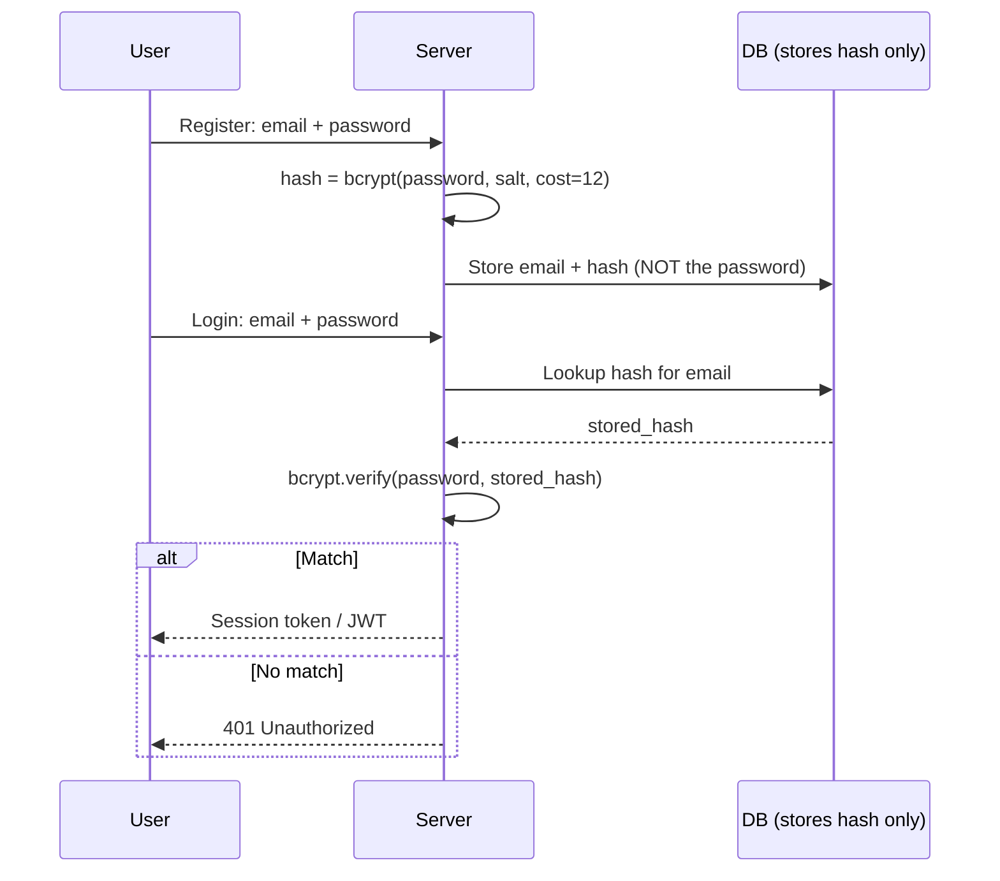

⚡ **TL;DR** - Username/password authentication is the most widely
deployed mechanism: the user presents a known secret (password) which
the server verifies against a stored hash. Its ubiquity comes from
zero hardware requirements and low user friction - its weakness
comes from passwords being phishable, reusable, and breach-portable.
Despite alternatives, it remains the foundation of most login flows.

---

### 📊 Entry Metadata

| #006 | Category: Authentication | Difficulty: ★☆☆ |
|:---|:---|:---|
| **Depends on:** | ATH-001, ATH-003 | |
| **Used by:** | ATH-007, ATH-008, ATH-017, ATH-018, ATH-019 | |
| **Related:** | ATH-007 Password Hashing, ATH-008 Sessions, ATH-010 Tokens | |

---

### 🔥 The Problem This Solves

**WORLD WITHOUT IT:**

The web needed a mechanism that required no special hardware,
no pre-shared keys, no certificate infrastructure, and could
be deployed by any developer on any server overnight.
Username/password authentication met all these criteria in the
1990s when the web was exploding. It is the zero-infrastructure
authentication option - the default that became universal.

**THE BREAKING POINT:**

Password authentication has two fundamental weaknesses:
1. **Reusability.** A password used at Site A can be used at
   Site B. Once stolen from A, it works everywhere.
2. **Phishability.** The user types the password, not the
   server. A convincing fake login page collects real passwords.

These are not implementation bugs - they are properties of the
mechanism itself. No amount of complexity policy fixes them.

---

### 📘 Textbook Definition

Username/password authentication is a knowledge-factor
authentication mechanism where the user presents a username
(identifier) and password (secret) to the server. The server
looks up the stored credential for the username and verifies
that the presented password, when hashed with the stored
parameters, matches the stored hash. On successful match, the
server establishes an authenticated session or issues a token.

---

### ⏱️ Understand It in 30 Seconds

**One line:**
You pick a secret word; the server checks it matches what
you registered with - without storing the word itself.

**One analogy:**
> A combination lock. You set a 4-digit combination when you
> register. When you return, you prove you know the combination.
> The lock itself does not store the combination as digits -
> it stores the mechanism that only opens with those digits.
> (The "mechanism" is the hash of the password.)

**One insight:**
The server NEVER stores the password. It stores a one-way
hash. When you log in, the server hashes your input and
compares hashes. This means a stolen database does not
immediately expose passwords - but if the hash function is
too fast (MD5, SHA1), it can be reversed in hours by brute
force on a GPU.

---

### ⚙️ How It Works (Mechanism)

```
┌────────────────────────────────────────────────────────┐
│       Username/Password Authentication Flow            │
├────────────────────────────────────────────────────────┤
│                                                        │
│  REGISTRATION:                                         │
│  User: email=alice, password=MySecret123               │
│  Server: salt = random_bytes(16)                       │
│          hash = bcrypt(password, salt, cost=12)        │
│          Store: {email: alice, hash: hash}             │
│  (MySecret123 is NEVER stored)                         │
│                                                        │
│  LOGIN:                                                │
│  User: email=alice, password=MySecret123               │
│  Server: lookup hash for alice                         │
│          verify = bcrypt.verify(password, hash)        │
│          If true: create session/token                 │
│          If false: return 401                          │
│                                                        │
└────────────────────────────────────────────────────────┘
```



---

### 💻 Code Examples

**Example - BAD vs GOOD: password storage**

```java
// BAD: storing plaintext password
userRepo.save(new User(email, password));

// BAD: fast hash (MD5, SHA-256) - GPU-crackable in hours
String hash = MessageDigest.getInstance("SHA-256")
    .digest(password.getBytes());

// GOOD: bcrypt with cost factor 12 (~200ms per hash)
String hash = BCrypt.hashpw(password, BCrypt.gensalt(12));
userRepo.save(new User(email, hash));

// VERIFY at login:
boolean valid = BCrypt.checkpw(submittedPassword, storedHash);
```

**Example - FAILURE: user enumeration via error messages**

```
BAD error messages that reveal whether email exists:
  "No account found for that email" → email not registered
  "Wrong password" → email IS registered, password wrong

GOOD: single message for both cases:
  "Invalid email or password"
  (Never reveal which part is wrong - this prevents
  attackers from using the login form to enumerate valid
  email addresses in your user base)
```

---

### ⚠️ Common Failure Modes

**Password in logs:**

```
Symptom: passwords appear in application logs, debug
output, or error messages.

Root cause: request body logged before password is consumed:
  log.debug("Login request: {}", request.getBody());

Fix: never log request bodies on auth endpoints.
Spring Security redacts password fields by default.
Audit all log statements near auth endpoints.
```

**Transferring password over HTTP (not HTTPS):**

```
Symptom: password captured by network observer.
Root cause: login form submitted to http:// endpoint.
Fix: HTTPS everywhere. HSTS header. Form action must
be https://. Never accept credentials over HTTP.
```

---

### 🔭 At Scale

Passwords are now the weakest link in most large-scale
systems not because of implementation weaknesses but because
of credential stuffing. At scale: check submitted passwords
against known breach lists (HaveIBeenPwned API v3 k-anonymity
model) at registration and login. This blocks the majority of
credential stuffing without requiring the server to store any
breach data.

---

*Authentication category: ATH | Entry: ATH-006 | v5.0*