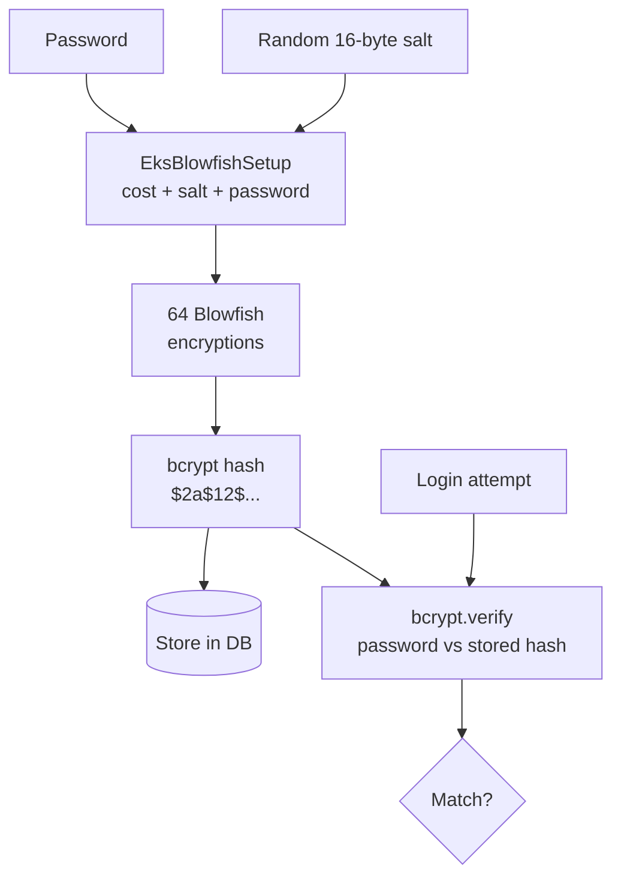

⚡ **TL;DR** - Password hashing converts a password into an
irreversible digest for storage. Secure password hashing requires
a deliberately SLOW algorithm (bcrypt, Argon2id, scrypt) - not
fast cryptographic hashes (MD5, SHA-256) - because slowness makes
offline brute-force attacks proportionally expensive. A stolen
database of bcrypt hashes takes years to crack; MD5 hashes take
hours on consumer hardware.

---

### 📊 Entry Metadata

| #007 | Category: Authentication | Difficulty: ★☆☆ |
|:---|:---|:---|
| **Depends on:** | ATH-006 Username and Password Authentication | |
| **Used by:** | ATH-017, ATH-019, ATH-044 | |
| **Related:** | ATH-006, ATH-008 | |

---

### 🔥 The Problem This Solves

**WORLD WITHOUT IT:**

In 2012, LinkedIn suffered a database breach. Approximately
6.5 million password hashes were stolen and published. They
used SHA-1 without salts. Within 24 hours, 90% of the hashes
were cracked. Fast hashing functions (MD5, SHA-1, SHA-256)
are designed for speed - a GPU can compute 10 billion SHA-256
hashes per second. A stolen database of SHA-256 password
hashes is cracked against a dictionary in minutes.

**THE INVENTION MOMENT:**

Niels Provos and David Mazieres introduced bcrypt in 1999
(USENIX 1999) with the explicit design goal: make password
hashing scalably slow. The key innovation was an adjustable
cost factor - as hardware gets faster, raise the cost factor
to maintain the target hash time. This is still the
foundational design used in modern password hashing.

---

### 📘 Textbook Definition

Password hashing is a one-way transformation that converts a
plaintext password into a fixed-length digest for secure
storage. Secure password hashing algorithms are intentionally
computational-expensive (slow), produce unique outputs even
for identical inputs via per-user random salts, and support
an adjustable work factor that can be increased as hardware
improves. The three recommended algorithms are bcrypt (1999),
scrypt (2009), and Argon2id (2015 PHC winner). Fast
cryptographic hashes (MD5, SHA-family) are not suitable for
password storage.

---

### ⏱️ Understand It in 30 Seconds

**One line:**
Store a scrambled, slow-to-verify version of the password,
not the password itself, so a breach does not immediately
expose all passwords.

**One analogy:**
> A puzzle safe that requires you to solve a 1000-piece jigsaw
> to open it. The lock designer chose 1000 pieces deliberately -
> it takes 10 minutes for the authorized person who knows the
> solution, but 10 million years for an attacker trying all
> random combinations. The puzzle IS the security mechanism.
> A fast hash is a 4-piece puzzle - it solves in milliseconds.

**One insight:**
The hash algorithm's slowness is its security property, not
a performance bug. Switching from bcrypt to SHA-256 "for
performance" is removing the security. The 200ms per hash is
the entire point.

---

### ⚙️ How It Works (Mechanism)

**bcrypt internals:**

```
┌─────────────────────────────────────────────────────┐
│               bcrypt Hash Structure                  │
├─────────────────────────────────────────────────────┤
│                                                      │
│  Algorithm:                                          │
│    key = EksBlowfishSetup(cost, salt, password)      │
│    hash = Encrypt("OrpheanBeholderScryDoubt", key)   │
│    64x  (64 Blowfish encryptions)                    │
│                                                      │
│  Output format: $2a$12$[22-char salt][31-char hash]  │
│  Example: $2a$12$N9qo8uLOickgx2ZMRZoMyeIjZAgcfl7p   │
│           72uKmm1jKS6zwB.w                           │
│                                                      │
│  Fields:                                             │
│    $2a$  = algorithm version                         │
│    12    = cost factor (2^12 = 4096 rounds)          │
│    N9qo8uLOickgx2ZMRZoMye = 22-char Base64 salt      │
│    IjZAgcfl7p72uKmm1jKS6zwB.w = 31-char hash         │
│                                                      │
│  Cost factor effect:                                 │
│    cost=10: ~65ms   cost=12: ~250ms   cost=14: ~1s   │
│                                                      │
└─────────────────────────────────────────────────────┘
```



**Why salts are mandatory:**

```
WITHOUT SALT:
  1000 users with "password123"
  → all produce same hash
  → crack once, expose all 1000

WITH SALT (per-user random salt):
  Alice: bcrypt("password123", salt_A) = $2a$12$AAAA...
  Bob:   bcrypt("password123", salt_B) = $2a$12$BBBB...
  → different hashes even for identical passwords
  → must crack each hash independently
  → eliminates rainbow table precomputation entirely
```

---

### 💻 Code Examples

**Example - Algorithm selection: bcrypt vs Argon2**

```java
// bcrypt - widely supported, good default
String hash = BCrypt.hashpw(password, BCrypt.gensalt(12));
boolean valid = BCrypt.checkpw(password, storedHash);

// Argon2id - PHC winner, more memory-hard than bcrypt
// (harder to crack with GPU due to memory requirement)
// Spring Security 5.8+ includes Argon2PasswordEncoder
PasswordEncoder encoder = new Argon2PasswordEncoder(
    16,  // salt length bytes
    32,  // hash length bytes
    1,   // parallelism
    65536, // memory cost (64 MB)
    3    // iterations
);
String hash = encoder.encode(password);
boolean valid = encoder.matches(password, hash);
```

**Example - FAILURE: upgrading algorithm without migration**

```
Problem: existing users have MD5 hashes in the DB.
Naively switching to bcrypt breaks all existing logins
(bcrypt.verify(password, md5_hash) always returns false).

Correct migration approach:
  On each successful login:
    1. User submits password
    2. Server detects "this hash is MD5 format" (by prefix)
    3. Server verifies MD5(password) == stored MD5 hash
    4. If valid: re-hash with bcrypt, update stored hash
    5. Issue session normally

  Over time: all active users migrate on their next login.
  Never require all users to reset passwords.
  Users who never log in: force password reset via email.
```

**Example - Pepper (server-side secret)**

```java
// Pepper: a secret mixed into the hash, stored in env var
// If DB is stolen but server config is not, hashes are
// useless without the pepper value
String PEPPER = System.getenv("PASSWORD_PEPPER");

// Hash with pepper appended
String hash = BCrypt.hashpw(
    password + PEPPER,
    BCrypt.gensalt(12)
);

// Verify with pepper
boolean valid = BCrypt.checkpw(password + PEPPER, hash);

// NOTE: pepper rotation requires re-hashing all passwords
// (unlike salt which is stored in the hash itself)
```

---

### ⚠️ Common Failure Modes

**Using SHA-256 or MD5 for password storage:**

```
Symptom: After a DB breach, user passwords are cracked
and published within hours.

Root cause: fast hash used instead of password-specific hash.
MD5: 50 billion hashes/sec (modern GPU)
SHA-256: 10 billion hashes/sec
bcrypt cost=12: 4 hashes/sec

Fix: migrate to bcrypt/Argon2id using incremental migration
(re-hash on successful login).

Timeline: with SHA-256 and no salt, a 10-GPU rig cracks
all 8-char passwords in < 1 hour.
With bcrypt cost=12: same rig requires 250+ years.
```

**bcrypt truncates at 72 bytes:**

```
Problem: bcrypt only processes the first 72 bytes of the
input. Long passphrases beyond 72 bytes are silently
truncated - the extra characters provide no security.

Mitigation: pre-hash with SHA-256 before bcrypt:
  String preHashed = Base64.encode(
      SHA256(password.getBytes(UTF_8))
  );
  String hash = BCrypt.hashpw(preHashed, BCrypt.gensalt(12));

This produces a 44-char Base64 string (well under 72 bytes)
while preserving all entropy of any-length passphrase.
```

---

### 📏 Decision Guide

| Algorithm | When to use | Notes |
|---|---|---|
| **Argon2id** | New systems, 2023+ | PHC winner; GPU-resistant; NIST recommended |
| **bcrypt** | Existing systems, wide support | Solid, battle-tested; 72-byte limit |
| **scrypt** | Memory-constrained environments | More tunable than bcrypt |
| **PBKDF2** | FIPS compliance required | Acceptable but weaker than above |
| ~~MD5~~ | NEVER | Insecure; crackable in seconds |
| ~~SHA-256~~ | NEVER for passwords | Too fast; crackable in hours |

---

*Authentication category: ATH | Entry: ATH-007 | v5.0*