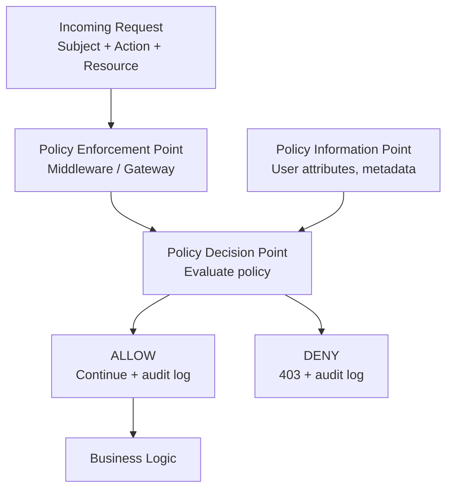

⚡ **TL;DR** - Authorization is the act of deciding what an
authenticated identity is permitted to do. Authentication proves
*who* you are; authorization decides *what* you may access.
The problem is not technical - it is definitional: specifying,
enforcing, and auditing who may do what to which resources,
across an ever-changing system, without over-granting or
under-restricting. Every authorization failure is either too
much access granted (privilege escalation, IDOR) or too little
(broken workflows, frustrated engineers). Getting this boundary
precise is one of the hardest engineering problems in production.

---

### 📊 Entry Metadata

| #001 | Category: Authorization | Difficulty: ★☆☆ |
|:---|:---|:---|
| **Depends on:** | ATH-001 The Authentication Problem | |
| **Used by:** | ATZ-006, ATZ-007, ATZ-015, ATZ-040 | |
| **Related:** | ATZ-002, ATZ-003, ATZ-004 | |

---

### 🔥 The Problem This Solves

**WORLD WITHOUT IT:**

You have built authentication. Users log in. You know who
they are. Now what?

An authenticated user is just a verified identity - it says
nothing about what they may do. Without authorization, every
authenticated user has the same access: everything, or
nothing. The first is a data breach waiting to happen; the
second is an unusable system.

The real world requires fine-grained answers: "Alice can
view invoices in her department but not others. Bob can edit
products but not delete them. The billing service can read
customer records but not payment methods. A read-only API key
can list resources but not create them."

**THE BREAKING POINT:**

Two failure modes define the extremes of the authorization
problem:

1. **Over-granting (the common mistake):** Alice's token
   lets her read `/api/invoices/1234`. It should be restricted
   to her invoices. But the check is "is the token valid?"
   not "does this token belong to the invoice owner?"
   Result: Alice reads every customer's invoice. This is IDOR
   - Insecure Direct Object Reference - OWASP's #1 finding.

2. **Under-granting (the maintenance trap):** Permissions
   are defined correctly today. Six months later, a new
   feature is added. Nobody updates the permission rules.
   Users cannot access a feature they should have. Support
   tickets accumulate. Engineers hand-grant access. The
   permission model drifts into unmaintainability.

**THE INVENTION MOMENT:**

Authorization was invented when shared systems needed
selective access. Multi-user operating systems in the 1960s
(MULTICS) introduced the concept of access control lists
to answer: which users may read, write, or execute which
resources? Every modern authorization system is a
descendant of that ACL concept.

**EVOLUTION:**

ACLs (1960s MULTICS) → Unix permissions (1970s, owner/group/other)
→ RBAC (1992, Ferraiolo and Kuhn) → ABAC (2000s NIST) →
PBAC and policy engines (OPA 2016, Cedar 2022) → relationship-
based access (Google Zanzibar 2019, now SpiceDB/OpenFGA).
Each generation solved the maintainability failures of the
previous model.

---

### 📘 Textbook Definition

Authorization is the process of determining whether an
authenticated subject (user, service, or device) is permitted
to perform a specific operation on a specific resource.
It is evaluated after authentication and operates on the
verified identity, the requested action, and the resource
being acted upon. Authorization systems encode *policies*
(rules about who may do what), enforce them at runtime, and
produce *decisions* (allow or deny). Access control is the
broader umbrella; authorization is the enforcement mechanism
within it.

---

### ⏱️ Understand It in 30 Seconds

**One line:**
Decide what a verified identity is allowed to do before
letting them do it.

**One analogy:**
> A hotel checks your passport (authentication) then checks
> whether your room key is programmed for your specific room
> (authorization). The key is not "master key for all rooms" -
> it is specifically encoded for Room 412, check-in to
> check-out. Knowing who you are does not automatically
> tell the system what you may access.

**One insight:**
Most security vulnerabilities are authorization failures,
not authentication failures. Systems correctly verify that
a user is logged in but then fail to verify that THIS user
may access THIS resource. Authentication is a solved problem.
Authorization is where production systems continuously fail.

---

### 🔩 First Principles Explanation

**CORE INVARIANTS:**

1. **Identity alone is insufficient.** Authentication proves
   who you are. It says nothing about what you may do. These
   are separate systems with separate data.
2. **Every access decision has three inputs.** WHO (subject),
   WHAT (action), and WHICH (resource). Remove any one of these
   and the decision is incomplete.
3. **Policies change; code should not.** If access rules are
   hardcoded, every policy change requires a deployment.
   Correct authorization separates policy from enforcement.

**DERIVED DESIGN:**

Given these invariants, every authorization system must:

- Capture and verify all three inputs (subject, action, resource)
- Evaluate policies against those inputs
- Produce a binary decision: allow or deny
- Be auditable: every decision must be loggable

The policy enforcement point (where the decision is applied)
must be separate from the policy decision point (where the
evaluation happens) to allow consistent enforcement at scale.

**THE TRADE-OFFS:**

**Gain:** Selective trust - different users get different
capabilities without separate user bases or deployments.

**Cost:** Complexity. Every resource, action, and subject
combination is a potential policy. Maintaining policies
that correctly reflect business intent at all times - as
the system evolves - is a permanent, non-trivial engineering
commitment.

**ESSENTIAL vs ACCIDENTAL COMPLEXITY:**

**Essential:** The need to distinguish "who may do what to
which resource" is irreducible in any multi-user system.
Someone must encode the rules.

**Accidental:** Hardcoding `if (user.role == "admin")`
throughout the codebase is accidental complexity. It creates
duplication, makes testing hard, and makes policy changes
require code changes. Externalized policy engines (OPA,
Cedar) move complexity into a manageable, testable artifact.

---

### 🧪 Thought Experiment

**SETUP:**

You are building a project management API. Users belong to
organizations. Projects belong to organizations. The API
has an endpoint: `GET /api/projects/{projectId}`.

**WHAT HAPPENS WITHOUT AUTHORIZATION:**

```
Alice (Org A, authenticated) sends:
  GET /api/projects/789  (which belongs to Org B)

Server logic: "Is Alice authenticated? Yes. Return project."
Alice reads Org B's confidential project. No error.
No audit log. Org B never knows.
```

This is IDOR - the most common authorization failure in
real APIs. The authentication check passed (Alice is
logged in) but the authorization check was missing
(does Alice belong to the organization that owns project 789?).

**WHAT HAPPENS WITH AUTHORIZATION:**

```
Server logic:
  1. Who is Alice? (authentication - from JWT)
  2. What action? GET (read)
  3. Which resource? Project 789
  4. Policy check: does Alice's org == project 789's org?
  5. No: return 403 Forbidden. Log the attempt.
```

**THE INSIGHT:**

Authentication gates the system. Authorization gates each
resource within it. Passing through the front door does not
grant access to every room. Every resource needs its own
check, not just "are they logged in?"

---

### 🧠 Mental Model / Analogy

> A hotel floor. Every guest has a key card (authenticated).
> Each key card is programmed for exactly one room for
> exactly one stay period. A guest can only open their room,
> not the room next door, not the housekeeping closet, not
> the penthouse - regardless of how legitimate their identity.
> Authorization is the programming of the key card, not the
> verification that it is real.

- "Key card programming" → permission assignment
- "Which room it opens" → resource scope
- "Expiry date" → time-bounded permissions
- "Housekeeping master key" → elevated privilege / admin role
- "Key card audit log" → authorization audit trail
- "Room 412 only" → principle of least privilege

**Where this analogy breaks down:** Hotel key cards are
static (one room). Real authorization systems evaluate
dynamic attributes: Alice may read project 789 today, but
if her project membership is revoked tomorrow, the same
request should fail without changing her key card.

---

### 📶 Gradual Depth - Five Levels

**Level 1 - What it is (anyone can understand):**
Authorization decides what you are allowed to do after you
have proven who you are. It enforces rules like "Alice can
read her own files, not Bob's" and "Admins can delete users,
regular users cannot."

**Level 2 - How to use it (junior developer):**
In code: check permissions before performing actions. For
REST APIs: middleware that reads the user identity from the
token and checks whether that identity has permission to
perform the requested operation on the requested resource.
Return 403 Forbidden on denial.

**Level 3 - How it works (mid-level engineer):**
Authorization systems have three components: a policy store
(who may do what), an enforcement point (where checks happen
in code), and a decision engine (evaluates policy + request).
Simple systems inline these; complex systems externalize the
decision engine (OPA, Cedar) for centralized policy management.

**Level 4 - Why it was designed this way (senior/staff):**
The separation of policy from enforcement exists because
policies change at business speed, not code-change speed.
A role assignment change should not require a deployment.
Externalized policy engines allow policy updates without
code changes, enable policy testing as code, and provide
a single audit trail for all access decisions.

**Level 5 - Mastery (distinguished engineer):**
Authorization at scale is a distributed systems problem.
The policy decision point must be available at every service
boundary, consistent across regions, and fast enough not to
add meaningful latency. The master practitioner designs
the authorization model as a first-class architecture concern:
what is the authorization model (RBAC? ABAC? ReBAC?), where
are decisions made (centralized vs sidecar vs inline), and
how are policy updates propagated (sync vs async, with what
consistency guarantees)?

---

### ⚙️ How It Works (Mechanism)

Authorization follows a consistent decision flow, regardless
of the underlying model (RBAC, ABAC, ReBAC):

```
┌────────────────────────────────────────────────────────┐
│          Authorization Decision Flow                   │
├────────────────────────────────────────────────────────┤
│                                                        │
│  Incoming Request                                      │
│      │                                                 │
│      │ Subject: alice (from JWT)                      │
│      │ Action:  READ                                  │
│      │ Resource: project:789                          │
│      ↓                                                 │
│  Policy Enforcement Point (PEP)                       │
│  (API Gateway, Middleware, Service Layer)             │
│      │                                                 │
│      │ Forwards authorization context                 │
│      ↓                                                 │
│  Policy Decision Point (PDP)                          │
│  (OPA, Cedar, inline code, DB check)                  │
│      │                                                 │
│      │ Evaluates: policy(subject, action, resource)   │
│      ↓                                                 │
│      ├── ALLOW ──→ Continue to business logic         │
│      │              + write audit log                 │
│      │                                                │
│      └── DENY  ──→ Return 403 Forbidden               │
│                    + write audit log (always)         │
│                                                        │
│  Policy Information Point (PIP)                       │
│  (user attributes, resource metadata, time, context)  │
│      │                                                 │
│      └── Consulted by PDP as needed                   │
│                                                        │
└────────────────────────────────────────────────────────┘
```



**The three authorization components:**

- **PEP (Policy Enforcement Point):** Where the check is
  enforced. Could be API gateway middleware, a gRPC
  interceptor, Spring Security annotations, or inline code.
  The PEP does not make decisions - it enforces them.
- **PDP (Policy Decision Point):** Where the policy is
  evaluated. Could be an external service (OPA, Cedar),
  a local sidecar, or inline code. Returns allow/deny.
- **PIP (Policy Information Point):** Where additional
  context comes from - the user's group memberships,
  a resource's metadata, the time of day, geographic region.

**Why separate PEP and PDP:**

If every service contains its own authorization logic,
updating a policy requires updating every service. A
centralized PDP allows policy changes to propagate
instantly without code deployments - critical for
compliance-driven access changes (e.g. "immediately
revoke all access for a terminated employee").

---

### 🔄 The Complete Picture - End-to-End Flow

```
┌───────────────────────────────────────────────────────┐
│       End-to-End Authorization in an API              │
├───────────────────────────────────────────────────────┤
│                                                       │
│  Client                                               │
│    │ GET /api/invoices/5678                          │
│    │ Authorization: Bearer eyJ... (Alice's token)    │
│    ↓                                                  │
│  API Gateway (PEP Layer 1)                           │
│    │ Is the token valid? (authentication check)      │
│    │ Extract: user=alice, org=A, roles=[viewer]      │
│    ↓                                                  │
│  Service Middleware (PEP Layer 2) ← YOU ARE HERE     │
│    │ Request to PDP:                                 │
│    │   subject: {user: alice, org: A, roles: viewer} │
│    │   action: READ                                  │
│    │   resource: invoice:5678 (org: B)               │
│    ↓                                                  │
│  Policy Decision Point                               │
│    │ Policy: user.org == invoice.org                 │
│    │ Evaluate: A == B? → NO → DENY                   │
│    ↓                                                  │
│  Middleware returns 403 Forbidden                    │
│  Audit log: alice attempted READ invoice:5678 DENIED │
│                                                       │
└───────────────────────────────────────────────────────┘
```

```mermaid
sequenceDiagram
    participant C as Client (Alice)
    participant GW as API Gateway
    participant MW as Service Middleware
    participant PDP as Policy Engine
    participant DB as Data Store
    C->>GW: GET /invoices/5678 + JWT
    GW->>GW: Validate JWT; extract identity
    GW->>MW: Forward request + identity claims
    MW->>PDP: authorize(alice, READ, invoice:5678)
    PDP->>DB: Get invoice:5678 owner (Org B)
    DB-->>PDP: owner=OrgB
    PDP->>PDP: alice.org=A != OrgB → DENY
    PDP-->>MW: DENY
    MW-->>C: 403 Forbidden
```

**FAILURE PATH:**

PDP unavailable → authorization check cannot complete →
service must fail-safe (deny all) or fail-open (allow all).
Fail-open is a security incident. Authorization service must
be high-availability (>99.99%) with local caching fallback.

**WHAT CHANGES AT SCALE:**

At low scale: inline authorization check in every handler.
At 100k req/sec: PDP becomes a latency bottleneck. Solutions:
- Cache authorization decisions at PEP (TTL: 1-60 seconds)
- Run PDP as a local sidecar (eliminates network hop)
- Pre-compute permissions on login (embed in JWT claims)

---

### 💻 Code Examples

**Example 1 - BAD vs GOOD: resource ownership check**

```java
// BAD: checks authentication only, not ownership
@GetMapping("/invoices/{id}")
public Invoice getInvoice(@PathVariable Long id,
                          @AuthUser User user) {
    // ANY authenticated user gets ANY invoice
    return invoiceRepo.findById(id)
        .orElseThrow(() -> new NotFoundException(id));
}

// GOOD: checks ownership before returning data
@GetMapping("/invoices/{id}")
public Invoice getInvoice(@PathVariable Long id,
                          @AuthUser User user) {
    Invoice invoice = invoiceRepo.findById(id)
        .orElseThrow(() -> new NotFoundException(id));
    // Authorization check: owner or same org
    if (!invoice.getOrgId().equals(user.getOrgId())) {
        throw new ForbiddenException(
            "User " + user.getId() +
            " not authorized for invoice " + id
        );
    }
    return invoice;
}
```

**Example 2 - BAD vs GOOD: hardcoded roles vs policy**

```java
// BAD: hardcoded role check scattered throughout codebase
// Changing role structure requires finding every if-block
if ("admin".equals(user.getRole())) {
    deleteUser(targetId);
} else {
    throw new ForbiddenException("Admins only");
}

// GOOD: declarative policy via annotation or engine
@PreAuthorize("hasPermission(#targetId, 'User', 'DELETE')")
public void deleteUser(Long targetId) {
    userRepo.deleteById(targetId);
}
// Policy defined once in SpEL, OPA, or Cedar
// Changing policy = update the policy file, not the code
```

**Example 3 - FAILURE: IDOR via sequential IDs**

```
Symptom:
  Support ticket: "I can see other customers' orders."
  Audit log shows user 1234 accessed orders 5001-6000,
  none of which belong to their account.

Root cause:
  Sequential numeric IDs make resources guessable.
  Authorization check was: "is the user authenticated?"
  Not: "does this order belong to this user?"

  GET /api/orders/5001  (Alice's request)
  GET /api/orders/5002  (Alice's request)
  GET /api/orders/5003  (Alice's request)
  ... all return 200 OK for any authenticated user

Fix:
  1. Add ownership check on every resource endpoint:
       if (order.userId != currentUser.id) return 403;
  2. Use UUIDs for resource IDs (not guessable)
  3. Add authorization integration tests:
       assertThat(bobRequest("/api/orders/" + aliceOrderId))
           .hasStatus(403);
```

**Example 4 - PRODUCTION: OPA for externalized policy**

```python
# policy.rego (OPA policy as code)
package invoices

# Default deny
default allow = false

# Allow: user in same org as invoice
allow {
    input.action == "READ"
    input.resource.org_id == input.subject.org_id
}

# Allow: admins can read any invoice
allow {
    input.action == "READ"
    input.subject.roles[_] == "admin"
}
```

```java
// Java service calls OPA via HTTP
public boolean authorize(User user, String action,
                         Invoice resource) {
    Map<String, Object> input = Map.of(
        "subject", Map.of(
            "id", user.getId(),
            "org_id", user.getOrgId(),
            "roles", user.getRoles()
        ),
        "action", action,
        "resource", Map.of(
            "id", resource.getId(),
            "org_id", resource.getOrgId()
        )
    );
    OpaResult result = opaClient.evaluate(
        "invoices/allow", input
    );
    return result.isAllow();
}
```

---

### ⚠️ Common Failure Modes

**IDOR - Insecure Direct Object Reference:**

```
Symptom:
  User A can read/modify User B's resources by changing
  a numeric ID in the URL.

Root cause:
  Authorization check verifies "is the user logged in?"
  but not "does this user own this resource?"

Diagnosis:
  Test: log in as user A, capture a request to their resource,
  replace the resource ID with user B's resource ID.
  If you get 200, IDOR is confirmed.

Fix:
  Every data fetch must include an ownership filter:
    SELECT * FROM orders
    WHERE id = ? AND user_id = ?  -- both conditions required
  Never trust the resource ID alone. Always join on identity.
```

**Privilege escalation via role assignment:**

```
Symptom:
  Users can grant themselves higher roles than they possess.

Root cause:
  The API to assign roles checks "is the user an admin?"
  but a user with "manage_users" permission can assign any
  role including "admin" - including to themselves.

Fix:
  A subject can only grant permissions they themselves hold:
  if (grantedRole.level > grantor.maxRole.level) {
      throw new ForbiddenException(
          "Cannot grant role higher than your own"
      );
  }
```

**Fail-open on policy engine unavailability:**

```
Symptom:
  During an auth service outage, all requests succeed.
  Post-incident review shows unauthorized access occurred.

Root cause:
  Authorization check:
    try {
        return policyEngine.evaluate(ctx);
    } catch (Exception e) {
        return true; // BAD: fail-open
    }

Fix:
  Default to DENY on all errors:
    try {
        return policyEngine.evaluate(ctx);
    } catch (Exception e) {
        log.error("Auth service unavailable - denying");
        return false; // fail-safe: deny all
    }
  + Set up local cache with TTL to reduce PDP dependency
```

---

### 🔬 Internals Deep-Dive

**Why RBAC became the dominant model:**

NIST's RBAC (1992) solved the n*m problem: in a system with
n users and m resources, assigning permissions individually
requires n*m assignments. With RBAC: assign users to roles
(n assignments) and roles to permissions (r*m assignments
where r << n). Total assignments: n + r*m, far fewer.

```
Without RBAC (n=1000 users, m=500 resources):
  1000 * 500 = 500,000 permission assignments to manage

With RBAC (10 roles):
  1000 users → 10 roles = 1,000 user-role assignments
  10 roles  → 500 resources = 5,000 role-resource assignments
  Total: 6,000 assignments (vs 500,000)
```

This is why RBAC dominates enterprise systems. It is not
the most expressive model - ABAC and ReBAC handle more
complex policies - but it is the most manageable at scale.

**Why ABAC emerged from RBAC's limits:**

RBAC breaks when permissions depend on attributes: "Alice
can read documents she created" or "access is only allowed
from corporate IP ranges during business hours". RBAC
requires creating a new role for every combination of
attributes - role explosion. ABAC evaluates attributes
directly: `subject.createdBy == resource.createdBy`.

---

### 📏 Decision Guide

**Use RBAC when:**
- Clear, stable role hierarchy (admin, manager, viewer)
- < 20-30 roles in the system
- Permissions driven by job function, not data attributes
- Simple reporting needs ("show all admins")

**Use ABAC when:**
- Permissions depend on resource attributes (department,
  classification, creation date)
- Context-dependent access (time of day, IP range, geography)
- Role explosion with RBAC (>100 roles for similar users)

**Use ReBAC (Zanzibar-style) when:**
- Permissions are relationship-based (Alice is member of
  project → can read project documents)
- Hierarchical resources (org → department → team → project)
- Google Docs-style sharing semantics

**Use an external policy engine (OPA, Cedar) when:**
- Policies change frequently without code deployments
- Multiple services share the same policy logic
- Policy needs to be audited, tested, and versioned
- Compliance requires policy-as-code evidence

---

### 🔭 At Scale

**10x (tens of thousands of users):**
Inline authorization checks work. A single policy DB
is fine. Focus on not missing ownership checks (IDOR risk).

**100x (millions of users, hundreds of services):**
Inline checks become inconsistent. Teams duplicate logic.
Policy drift starts. Solution: centralize policy in a
shared engine (OPA as a sidecar or central service).
Add authorization integration tests as a gate.

**1000x (global, thousands of services):**
The authorization system is its own distributed system.
Google Zanzibar (2019) describes the architecture used
at Google: a globally replicated, eventually consistent
authorization system that handles 10 million requests
per second with <10ms tail latency. Key designs:
- Store permissions as relationship tuples (user:alice is member of group:eng)
- Evaluate permissions by resolving tuple graphs
- Cache permission snapshots for consistency under read
- Zookies (consistency tokens) prevent stale auth from caching

---

### 🎓 Interview Deep-Dive

**Q: What is IDOR and why is it so common?**

IDOR (Insecure Direct Object Reference) is when an
attacker accesses a resource by guessing or enumerating
its identifier. It is common because developers add
authentication checks ("is the user logged in?") but
miss authorization checks ("does this user own this
specific resource?").

The pattern: `GET /api/orders/{orderId}` returns the order
for any authenticated user, regardless of ownership. Fix:
`SELECT * FROM orders WHERE id = ? AND user_id = ?` - the
ownership filter must always be part of the data query.

IDOR has been OWASP's #1 or #2 vulnerability for years
because it is invisible in code review - the endpoint looks
correct (it checks auth) but is functionally insecure.

**Q: What is the difference between RBAC and ABAC?**

RBAC assigns permissions to roles; subjects are assigned
to roles. Access is determined by the subject's role.
The entire permission evaluation is: "Is role R in the
subject's role list?"

ABAC evaluates a policy against subject attributes, action,
resource attributes, and environmental context. Example:
`allow if subject.clearance >= resource.classification AND
 current_time is within subject.allowed_hours AND
 subject.ip in corporate_ranges`.

RBAC is simpler and scales by managing role assignments.
ABAC is more expressive but more complex to manage and
debug. Most enterprise systems start with RBAC and add
ABAC-style attribute checks for edge cases.

**Q: What is the principle of least privilege and why
   does it matter operationally?**

Least privilege: every subject should have exactly the
permissions needed to perform their function - no more.
This limits blast radius when a credential is compromised.
If a compromised service account has read-only access to
one database table, the breach is contained. If it has
admin access to the entire cluster, the breach is total.

Operationally, least privilege is hard to maintain because
it requires ongoing curation. The easy path (grant broad
permissions, fix specific denials) produces permission
creep - over time, every account accumulates more access
than needed. Automated tooling (AWS IAM Access Analyzer,
policy linters) monitors drift and suggests minimum
required permissions based on observed usage.

---

### 🌍 Real-World Usage

- **Facebook/Meta Zanzibar (2019):** Authorization system
  handling 10M QPS, storing user-content relationship tuples,
  evaluating "can Alice view Bob's post?" in <10ms globally.
  The paper describes the consistency model (zookies) used
  to prevent stale permission caches from granting access
  after revocation.
- **AWS IAM Policies:** Every AWS API call is evaluated
  against IAM policies. Allow/Deny semantics: explicit Deny
  always wins, even over explicit Allow from another policy.
  Policy evaluation order: SCPs → Resource → Identity policies.
- **Broken Access Control (OWASP 2021 #1):** Moved from
  #5 to #1 in the OWASP Top 10 in 2021, reflecting that
  authorization failures - not injection, not XSS - are
  now the leading cause of real-world security incidents.

---

### 🔁 Transferable Wisdom

Authorization is a special case of **selective trust
delegation**. The same decision structure (who may do
what to which resource) appears across domains:

- **File system permissions:** Unix owner/group/other read/
  write/execute is RBAC at the filesystem layer. `chmod 644`
  is a role-based access control assignment.
- **Database row security:** PostgreSQL row-level security
  policies are ABAC evaluated per-row at query time.
- **Physical access control:** A building's card reader
  system is ReBAC: Alice is member of team X, team X has
  access to floor 3, therefore Alice may enter floor 3.
- **Financial account permissions:** "Alice can view
  transactions but not initiate wire transfers" is RBAC
  applied to banking operations.

The abstract pattern: **a policy maps (subject, action,
resource) to allow/deny, evaluated at enforcement points
that are consistent and auditable.** Every access control
system - digital or physical - is an instance of this
structure.

---

*Authorization category: ATZ | Entry: ATZ-001 | v5.0*