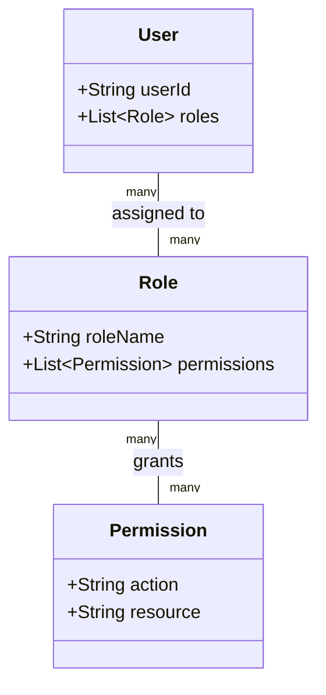

⚡ **TL;DR** - RBAC (Role-Based Access Control) is the dominant model
for authorization in enterprise systems: permissions are assigned to
roles, and users are assigned to roles - never permissions directly
to users. This indirection makes permission management scalable.
Defined in 1992 by Ferraiolo and Kuhn, formalized by NIST in 2000,
RBAC is the foundation most access control systems build on.

---

### 📊 Entry Metadata

| #006 | Category: Authorization | Difficulty: ★☆☆ |
|:---|:---|:---|
| **Depends on:** | ATZ-001, ATZ-003, ATZ-004 | |
| **Used by:** | ATZ-013, ATZ-014, ATZ-015, ATZ-036, ATZ-050 | |
| **Related:** | ATZ-003 Terminology, ATZ-007 Permissions, ATZ-015 ABAC | |

---

### 🔥 The Problem This Solves

**WORLD WITHOUT IT (DAC - Discretionary Access Control):**

Before RBAC, systems used direct permission assignment:
user Alice can read file A, write file B. When Alice changes
role from "analyst" to "manager," an admin must manually
review and update every individual permission. With 100 users
and 500 resources: 50,000 potential permission pairs to manage.

RBAC reduces this to: assign Alice the "manager" role.
Permissions to 500 resources flow from the role automatically.
Permission management scales with the number of roles
(typically 5-50), not the number of users.

---

### 📘 Textbook Definition

Role-Based Access Control (RBAC) is an access control model
(NIST SP 800-53) in which permissions are assigned to roles,
and users are assigned to roles. Authorization decisions are
made based on the roles a user holds at the time of access.
RBAC separates permission management (role ↔ permission) from
user management (user ↔ role), enabling scalable administration
where adding a new user to a job function requires assigning
one role rather than enumerating individual permissions.

---

### ⏱️ Understand It in 30 Seconds

**One line:**
Instead of giving permissions to people, give permissions
to roles; give roles to people.

**One analogy:**
> A new employee joins a law firm as an associate attorney.
> They are given the "Associate Attorney" role. That role
> comes with access to: the case management system,
> the legal research database, and their assigned cases.
> When they are promoted to "Senior Partner," they switch
> roles and gain access to: financial records, client
> acquisition tools, and all associates' cases.
> Nobody had to manually grant 47 individual permissions
> twice - just a role change.

---

### ⚙️ How It Works (Mechanism)

**NIST RBAC model:**

```
┌─────────────────────────────────────────────────────┐
│            NIST RBAC Core Model                     │
├─────────────────────────────────────────────────────┤
│                                                     │
│  USERS ─── assigned to ──→ ROLES                    │
│  ROLES ─── assigned to ──→ PERMISSIONS              │
│  PERMISSIONS = (OPERATION, OBJECT)                  │
│                                                     │
│  Example:                                           │
│  Users: Alice, Bob, Carol                           │
│  Roles: VIEWER, EDITOR, ADMIN                       │
│  Permissions:                                       │
│    VIEWER: (read, reports), (list, users)           │
│    EDITOR: all VIEWER + (write, reports)            │
│    ADMIN:  all EDITOR + (create, users), (delete,*) │
│                                                     │
│  Alice → ADMIN → all permissions                    │
│  Bob   → EDITOR → read + write reports, list users  │
│  Carol → VIEWER → read reports, list users          │
│                                                     │
│  When Bob is promoted: change Bob → ADMIN           │
│  No permission changes needed                       │
│                                                     │
└─────────────────────────────────────────────────────┘
```



---

### 💻 Code Examples

**Example - Spring Security RBAC**

```java
// Method-level role authorization
@RestController
public class ReportController {

    @GetMapping("/reports")
    @PreAuthorize("hasRole('VIEWER')") // VIEWER, EDITOR, ADMIN
    public List<Report> listReports() { ... }

    @PostMapping("/reports")
    @PreAuthorize("hasRole('EDITOR')") // Only EDITOR+
    public Report createReport(@RequestBody ReportDto dto) {...}

    @DeleteMapping("/reports/{id}")
    @PreAuthorize("hasRole('ADMIN')") // Only ADMIN
    public void deleteReport(@PathVariable Long id) { ... }
}
```

**Example - BAD vs GOOD: direct permission vs role**

```java
// BAD: checking specific permission strings everywhere
if (user.hasPermission("reports:write")
    && user.hasPermission("reports:publish")) {
    // Problem: what happens when the permission name changes?
    // Or when we add a new permission that editors need?
    // Every check must be updated individually.
}

// GOOD: role-based check (roles bundle permissions)
if (user.hasRole("EDITOR") || user.hasRole("ADMIN")) {
    // Adding new editor permissions = update role definition
    // All role checks automatically work correctly
}

// BETTER: Spring Security annotation - declarative,
// not buried in business logic
@PreAuthorize("hasAnyRole('EDITOR', 'ADMIN')")
```

**Example - FAILURE: role explosion causes admin confusion**

```
Timeline of a typical RBAC decay:
  Year 0: 3 roles (viewer, editor, admin) - clear and clean
  Year 1: + reports_editor (editors who can also export)
  Year 1: + external_viewer (viewers from partner orgs)
  Year 2: + senior_editor (editors with approval rights)
  Year 2: + limited_admin (admin without user deletion)
  Year 3: + temp_contractor, junior_viewer, regional_admin
  Year 3: 12 roles; nobody knows what "senior_editor"
           vs "reports_editor" means or if they overlap

Fix:
  1. Define roles from job functions, not access requests
  2. Role rationalization: merge similar roles
  3. Role matrix: document (role, permission) grid
  4. Role governance: creating a new role requires approval
  5. Maximum of ~20 roles for any one application
```

---

### 📏 When to Use RBAC (and when not to)

| RBAC works well when: | Consider ABAC/ReBAC when: |
|---|---|
| Access determined by job function | Access depends on object attributes (sensitivity, owner) |
| Small, stable role set | Roles would explode (hundreds needed) |
| Clear organizational hierarchy | Cross-organization or shared resources |
| No object-level variations | Same role needs different access to different records |

---

*Authorization category: ATZ | Entry: ATZ-006 | v5.0*