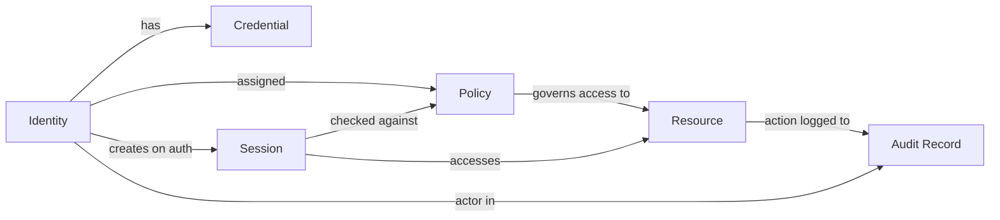

⚡ TL;DR - IAM manages six distinct objects: identities (who
a principal is), credentials (how they prove it), policies
(what they are allowed to do), resources (what is protected),
sessions (active authentication state), and audit records
(what happened and when). Each object fails independently
and requires its own lifecycle management.

---

### 🔥 The Problem This Solves

When engineers say "add IAM," they often mean different
things: add a login form, add RBAC, add audit logging,
add a secrets vault. Without a shared model of what IAM
manages, teams build systems where users are stored in
the application database, permissions are hardcoded in
`if` statements, sessions never expire, and nobody can
answer "who accessed this resource at 2am?"

A SaaS company at 10,000 users with six teams each
building "auth" independently cannot answer a basic
compliance audit question: "Show me every action by
contractor Alice across all systems in the past 90 days."
The data is fragmented with no common identity thread.

IAM as a discipline defines the six objects that every
access-controlled system must manage explicitly.

---

### 📘 Textbook Definition

IAM manages six interdependent objects:

1. **Identities** - the entity that can act: user alice,
   service payment-service, device laptop-1234

2. **Credentials** - the proof of identity: password,
   certificate, biometric, hardware token

3. **Policies** - the rules encoding what is permitted:
   RBAC roles, ABAC attributes, cloud IAM policies

4. **Resources** - the protected assets: API endpoints,
   S3 buckets, database rows, UI features

5. **Sessions** - the stateful proof that authentication
   occurred: session cookie, access token, mTLS connection

6. **Audit Records** - the immutable log of every
   identity-resource interaction with decision outcome
   (allow/deny) and timestamp

These six objects form a complete access control model.
A system missing any one of them has a gap that attackers
or auditors will find.

---

### ⏱️ Understand It in 30 Seconds

**One line:**
IAM manages what exists (identities), how they prove it
(credentials), what they can do (policies), what they
can access (resources), how long they stay verified
(sessions), and what it all left behind (audit records).

**One analogy:**
> A bank manages: customers (identities), PINs and cards
> (credentials), account permissions (policies), vaults
> and accounts (resources), teller sessions (sessions),
> and transaction logs (audit records). Lose any one and
> the bank fails - fraudulently, regulatorily, or both.

**One insight:**
Deleting a user identity does NOT automatically invalidate
their active sessions or API keys. Identity and session
lifecycle are separate objects requiring separate actions.

---

### 🔩 First Principles Explanation

Every access event has exactly three actors: a subject
(identity), a verb (action), and an object (resource).
IAM must manage metadata about all three to make and
record the access decision.

Identity proof decays over time - a credential valid today
may be compromised tomorrow. Sessions capture the point in
time when identity was verified. Expiry and revocation
mechanisms manage credential and session decay independently.

Access decisions must be reproducible. Given the same
identity, resource, and context, the same decision must
be reachable from audit records. This requires audit
records to capture all three, not just "user did thing."

**Trade-off:**

**Gain:** a complete, auditable, revocable model covering
all six access control concerns.

**Cost:** each object requires its own storage, lifecycle
management, and operational process.

---

### 🧪 Thought Experiment

Build an API with three users: Alice (admin), Bob (reader),
Carol (editor). Now break each IAM object independently:

1. **Identity breach:** Someone creates "alice_backup" with
   admin role. Audit logs show that user deleting reports.

2. **Credential breach:** Bob's password is "password123".
   Attacker logs in as Bob, reads all reports. Audit shows
   "bob" - looks completely legitimate.

3. **Policy misconfiguration:** Bug gives Carol admin role.
   She deletes reports she should not access. Fix requires
   a policy rollback - the identity was never compromised.

4. **Resource gap:** New endpoint /report/export added with
   no role requirement. All users reach it. The gap in the
   resource registry was the failure, not the policy engine.

5. **Session gap:** JWT never expires. Bob leaves the company,
   token still works for years. Identity deprovisioning alone
   did not fix this.

6. **Audit gap:** Logging disabled for performance. Breach
   discovered months later with zero evidence trail.

Every gap is a different object. Each requires a different
fix. Treating them as one "auth problem" causes misdiagnosis.

---

### 🧠 Mental Model / Analogy

> IAM is the HR + Security Operations + Legal Records
> departments of a company, combined.
>
> HR manages who works here (identities) and their job
> roles (policies). The security desk issues and checks
> badges (credentials + sessions). Facilities controls
> which doors badges open (resources). Legal keeps records
> of every badge swipe (audit records).
>
> Each department has its own system and its own failure
> mode. When a badge swipe is rejected, you need all four
> to diagnose which object failed.

**Where this analogy breaks down:** physical badges are
hard to clone. Digital credentials can be copied in
microseconds - hence the far greater urgency of credential
rotation and session expiry in digital IAM.

---

### 📶 Gradual Depth - Five Levels

**Level 1 (anyone):**
IAM tracks who you are, proves it is really you, decides
what you can do, tracks how long that lasts, and writes
down everything that happened.

**Level 2 (junior developer):**
IAM has six concerns. Each one needs explicit code:
identity store (database of users), auth (login/token),
authz (role checks), resource tagging (what needs
protecting), session management (token expiry), and
audit logging (action records). Frameworks handle some,
but not all six automatically.

**Level 3 (mid engineer):**
The six objects map to distinct systems: identity in an
IdP (Okta, Azure AD), credentials in a hashed store,
policies in a policy engine (IAM policies, OPA),
resources in an API gateway registry, sessions as JWT
with expiry, audit records in append-only log streams
(CloudTrail, SIEM). Each is deployed and operated
independently.

**Level 4 (senior/staff):**
The objects have different cadences. Identity lifecycle
(SCIM provisioning) and policy lifecycle (IGA access
reviews) operate on different timescales. Session
management must be stateless for horizontal scaling but
stateless tokens resist revocation - short expiry
(15 min) plus revocable refresh tokens bridges the gap.
Audit records must be immutable: WORM storage or
append-only event streams.

**Level 5 (distinguished):**
The open production problem is consistent policy
propagation. When a role is revoked, active sessions
with cached policy evaluations continue to use stale
permissions until expiry or cache invalidation. Google
Zanzibar solved this with globally consistent tuple
storage at 10M QPS. Most enterprises accept eventual
consistency with 60-second propagation latency - an
explicit design choice, not an oversight.

---

### ⚙️ How It Works (Mechanism)

```
IAM Object Lifecycles:

IDENTITY:  create -> assign credentials -> assign roles
          -> update attributes -> deactivate -> delete

CREDENTIAL:
  generate -> hash/store -> validate on use -> rotate
           -> revoke on breach -> delete on deactivation

POLICY:
  define rules -> attach to identity/resource -> evaluate
               -> audit -> review -> update -> retire

RESOURCE:
  register -> tag with policy requirements -> protect
           -> expose via API/gateway -> decommission

SESSION:
  authenticate -> issue token -> validate each request
               -> refresh before expiry -> expire/revoke

AUDIT RECORD:
  capture event -> append to log -> index -> alert
               -> archive -> satisfy retention policy
```



---

### ⚖️ Comparison Table

| Object | Storage | Failure Mode | Lifecycle Driver |
|:---|:---|:---|:---|
| Identity | IdP (Okta, LDAP) | Orphaned accounts post-offboarding | HR/SCIM events |
| Credential | Hashed vault | Weak, shared, unrotated secrets | Policy enforcement |
| Policy | Policy engine (OPA, IAM) | Drift from intended permissions | Access reviews |
| Resource | API gateway registry | Unprotected endpoints | Deployment pipeline |
| Session | JWT / session store | Long-lived non-revocable tokens | Auth design |
| Audit Record | SIEM / CloudTrail | Gaps, disabled logs, no alerting | Compliance |

---

### ⚠️ Common Misconceptions

| Misconception | Reality |
|:---|:---|
| Authentication handles all of IAM | Auth only verifies credentials. It says nothing about policies, resource registries, sessions beyond that event, or audit records. |
| RBAC alone is an IAM system | RBAC is just the policy object. Without identity provisioning/deprovisioning and audit records, RBAC is insufficient for compliance. |
| Audit logs are optional | SOC 2, PCI-DSS, HIPAA, and GDPR all mandate specific audit log retention. Missing records means audit failures and investigation impossibility. |
| Deleting a user revokes all access | Deleting an identity does not invalidate active JWTs or API keys. Session and credential objects require separate revocation. |

---

### 🚨 Failure Modes & Diagnosis

**Orphaned Accounts (identity lifecycle gap)**

**Symptom:** Former employee can still log in months
after leaving the company.

**Root Cause:** Identity deprovisioning not triggered
on HR offboarding. Identity and HR systems not connected
via SCIM or manual process.

```bash
# AWS IAM: generate credential report, find stale users
aws iam generate-credential-report
aws iam get-credential-report \
  --query 'Content' --output text | \
  base64 -d | \
  awk -F, 'NR>1 && $5=="N/A" || $5>90 {print $1, $5}'

# Azure AD: find users who have not signed in recently
az ad user list \
  --query "[?signInActivity.lastSignInDateTime < \
    '2025-01-01'].{upn:userPrincipalName}" \
  --output table
```

**Fix:** Integrate HR system with IdP via SCIM. Automate
deprovisioning on the offboarding event. Run quarterly
access certification to catch any remaining gaps.

---

**Policy drift (policy object stale)**

**Symptom:** Users have permissions they should have lost
when their role changed six months ago.

**Root Cause:** Policies created for a previous role were
never cleaned up. No access certification process exists.

```bash
# AWS IAM: check last-access time for all permissions
aws iam get-service-last-accessed-details \
  --arn arn:aws:iam::ACCOUNT:user/alice

# AWS Access Analyzer: find overly permissive policies
aws accessanalyzer list-findings \
  --analyzer-arn \
    arn:aws:accessanalyzer:us-east-1:ACCOUNT:analyzer/NAME

# Any permission unused for 90+ days is removal candidate
```

**Fix:** Implement access certification workflow via an
IGA tool. Review all permissions quarterly. Remove any
permissions with no recorded usage.

---

### 🔗 Related Keywords

**Prerequisites:**

- `IAM-001` - The Identity Problem: why IAM exists

**Builds On This:**

- `IAM-006` - IAM Principals: the concrete identity types
- `IAM-007` - Identity Lifecycle Management: identity object lifecycle
- `IAM-013` - Permissions and Policies: the policy object in depth

**Related:**

- `IAM-030` - IAM Observability: audit record patterns
- `ATZ-001` - Authorization Foundations: policy evaluation depth
- `ATH-001` - Authentication Foundations: credential verification

---

### 📌 Quick Reference Card

```
┌──────────────────────────────────────────────────────┐
│ SIX OBJECTS IAM MANAGES                              │
├─────────────────┬────────────────────────────────────┤
│ IDENTITY        │ Who is the actor                   │
│                 │ Stored in IdP / directory          │
├─────────────────┼────────────────────────────────────┤
│ CREDENTIAL      │ Proof of identity                  │
│                 │ Password, certificate, token       │
├─────────────────┼────────────────────────────────────┤
│ POLICY          │ Rules for what is permitted        │
│                 │ RBAC roles, ABAC attributes        │
├─────────────────┼────────────────────────────────────┤
│ RESOURCE        │ Protected asset                    │
│                 │ API endpoint, bucket, DB row       │
├─────────────────┼────────────────────────────────────┤
│ SESSION         │ Proof auth occurred (JWT, cookie)  │
│                 │ Has expiry and revocation path     │
├─────────────────┼────────────────────────────────────┤
│ AUDIT RECORD    │ Immutable log of all access events │
│                 │ Required by SOC 2, PCI, HIPAA      │
└─────────────────┴────────────────────────────────────┘
```

**If you remember 3 things:**

1. Six objects, each failing independently. Credential
   breach does not fix a policy gap, and vice versa.

2. Deleting a user does not revoke sessions. These are
   different objects with different lifecycle actions.

3. Audit records are compliance-required. "We disabled
   logging for performance" is an audit failure waiting
   to happen.

**Interview one-liner:**
"IAM manages six objects: identities, credentials,
policies, resources, sessions, and audit records - each
with its own storage, lifecycle, and failure mode."

---

### 💎 Transferable Wisdom

**Reusable Principle:**
Any access-controlled system manages variants of these
same six objects. A Kubernetes cluster has: service
accounts (identity), RBAC roles (policy), API resources
(resources), kubeconfig tokens (credentials + sessions),
and audit logs. An S3 bucket has: IAM principals
(identity), bucket policies (policy), objects
(resources), presigned URLs (sessions), CloudTrail
(audit records). The six-object model is universal.

**Where else this appears:**

- Database access control: user accounts (identity),
  passwords (credential), GRANT/REVOKE (policy),
  tables/schemas (resources), connection sessions
  (session), statement logs (audit)

- Linux file system: UID/GID (identity), PAM
  (credential), file permissions plus ACLs (policy),
  files and devices (resources), login sessions
  (session), auditd (audit records)

---

### 💡 The Surprising Truth

Most large cloud breaches do not attack the hardest IAM
object (credentials directly) - they exploit the
forgotten objects. The Uber breach (2022) used an
orphaned IAM account (identity lifecycle gap) combined
with MFA fatigue (credential bypass). The Capital One
breach (2019) exploited an IAM role with excessive
permissions never reviewed after creation (policy
drift). The weakest IAM object is almost always the one
nobody is actively managing.

---

### ✅ Mastery Checklist

**You have mastered this when you can:**

1. **EXPLAIN** List the six IAM objects and explain
   why deleting a user record does not automatically
   revoke their active JWT sessions.

2. **DESIGN** Given a new service with three user types
   (admin, editor, reader), describe what to manage
   for each of the six objects.

3. **DIAGNOSE** Given "a contractor who left three months
   ago can still access our API," identify which of the
   six objects has a gap and how to verify it.

---

*Identity & Access Management | IAM-002 | v5.0*