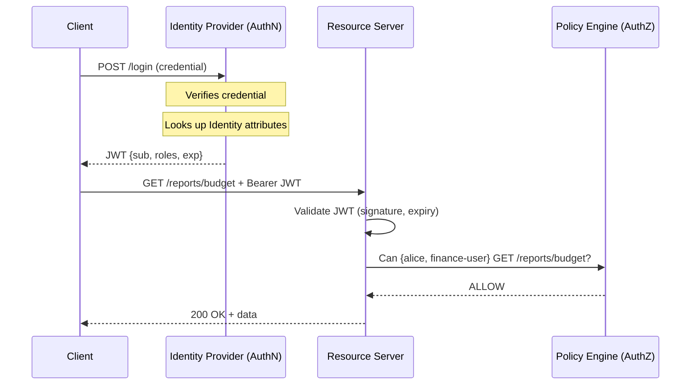

⚡ TL;DR - Identity is who you are (a set of attributes).
Authentication is proving you are who you claim (verifying
the credential). Authorization is deciding what you are
permitted to do (evaluating policy). Three completely separate
problems that can fail, scale, and change independently.
Conflating them causes systems where fixing a login bug
accidentally changes permissions.

---

### 🔥 The Problem This Solves

Engineering teams regularly confuse these three terms:

- "We need to add authentication" (they mean: build a login
  form, but also add RBAC and permission checks)
- "Our authorization is broken" (they mean: users can log
  in as the wrong tenant, which is actually authentication)
- "Identity service is down" (they mean: the login server
  is down, but identity data still exists)

This confusion leads to architectural mistakes: a single
"auth service" handles login, session management, role
evaluation, and user profile - all coupled together. When
one breaks, all break. Permissions cannot be changed without
touching authentication code. The root cause is failing to
treat the three as separate concepts.

---

### 📘 Textbook Definition

**Identity:** The complete set of attributes that describe
a principal (user, service, device). Identity is a data
model: name, email, department, job title, unique ID,
organizational membership. Identity exists independently
of whether the principal is currently logged in.

**Authentication (AuthN):** The process of verifying that a
principal is who they claim to be. Authentication takes a
credential (password, certificate, token) and either
accepts it ("you are alice") or rejects it. Authentication
produces a verified identity assertion.

**Authorization (AuthZ):** The process of deciding whether
a verified identity is permitted to perform a specific
action on a specific resource. Authorization takes the
verified identity assertion and evaluates policy: "alice
(verified) is allowed to read /reports but not delete
/users."

The AAA model extends these with **Auditing**: recording
the access decision with all three inputs (identity, action,
resource) for compliance and forensics.

---

### ⏱️ Understand It in 30 Seconds

**One line:**
Identity = WHO you are. Authentication = PROVING it.
Authorization = WHAT you are allowed to do.

**One analogy:**
> At an airport:
> - Your passport is your IDENTITY (attributes: name, nationality,
>   photo, date of birth - exists independent of travel)
> - Showing the passport at the gate is AUTHENTICATION
>   (proving you are the person named in the document)
> - Your boarding pass determines AUTHORIZATION (which
>   flight, which seat class, whether you can enter the
>   lounge - a separate decision from verifying who you are)
>
> The passport officer (IdP) and the lounge door scanner
> (Resource Server) are separate systems making separate
> decisions.

**One insight:**
You can be strongly authenticated (biometric + hardware
token) but still unauthorized (no permission for the
resource). You can have a rich identity (lots of attributes)
but still fail authentication (compromised credential).
Strong authentication does not imply authorization.

---

### 🔩 First Principles Explanation

**Three invariants:**

1. **Identity is static data.** It describes a principal.
   It does not change when the principal logs in or out.
   Alice's identity (her email, department, role assignment)
   exists in the IdP whether or not she has an active session.

2. **Authentication is a point-in-time event.** It answers
   "is this credential valid right now for this claimed
   identity?" The result is a verified identity assertion
   (session token or JWT) with a timestamp and expiry.

3. **Authorization is a policy evaluation per request.**
   It answers "does this verified identity have permission
   to perform this action on this resource at this time?"
   It runs on every protected request, not just at login.

**Why separation is essential:**

If authentication and authorization share code:
- A bug in the login flow can accidentally change permissions
- You cannot add a new authorization policy without touching
  authentication code
- You cannot delegate authentication to an external IdP
  (Okta, Google) without rewriting authorization logic
- Scaling them is impossible independently: authentication
  is bursty (login storms), authorization is constant
  (every API request)

---

### 🧪 Thought Experiment

**Scenario:** Alice is a Finance team member. She has a
verified account. You need to let Finance see budget reports
but not IT dashboards.

**Without separation:**
```java
// BAD: auth + authz mixed in login handler
if (password.matches(storedHash)) {
    // login succeeded - also set up permissions here
    if (user.getDepartment().equals("Finance")) {
        session.setAttribute("canViewBudgets", true);
    }
    // Problem: permissions set once at login, stale forever
    // Problem: changing permissions requires re-login
    // Problem: no separation of concerns
}
```

**With separation:**
```java
// GOOD: authentication (login handler)
AuthnResult result = idp.authenticate(username, password);
// Returns: {identity: alice@co.com, roles: [finance-user]}
// Does NOT make permission decisions

// GOOD: authorization (per-request middleware)
AuthzDecision decision = policyEngine.evaluate(
    request.getIdentity(),  // from validated token
    "read",                  // action
    "/reports/budget"        // resource
);
// Evaluates current policy, not stale session attribute
// Policy can change without touching auth code
```

**The insight:** When Finance team moves to a new tool,
you update the authorization policy. When the company
migrates to Google SSO for authentication, you update
only the auth layer. Neither change affects the other.

---

### 🧠 Mental Model / Analogy

> Three separate departments in a company:
>
> **HR (Identity):** Maintains employee records. Alice is
> a Finance employee, hired 2018, clearance level 3. This
> data exists whether or not Alice is in the building.
>
> **Security Desk (Authentication):** Checks Alice's badge
> against the HR record. Confirms she is the real Alice.
> Issues a temporary visitor pass. Does NOT decide where
> she can go.
>
> **Access Control System (Authorization):** Reads Alice's
> temporary pass + HR record, checks against floor access
> rules. Allows Finance floor, denies Server Room.

**Where this breaks down:** In this analogy the security
desk and access control system are physically close. In
software they can (and often should) be in completely
different services, vendors, and data centers.

---

### 📶 Gradual Depth - Five Levels

**Level 1 (anyone):**
Identity = your profile. Authentication = your login.
Authorization = your permissions. Three separate things
that can each break independently.

**Level 2 (junior developer):**
Authentication produces a token (JWT, session ID) after
verifying credentials. Every subsequent request carries
that token. Authorization middleware checks the token's
claims (user ID, roles) against a permission table before
allowing the request to reach the handler.

**Level 3 (mid engineer):**
The OAuth 2.0 protocol explicitly separates these:
Authorization Server (AuthN + issues tokens), Resource
Server (AuthZ checks). OIDC adds Identity Layer on top of
OAuth (id_token with identity claims). A system can use
Google for authentication (Google AuthN) while using its
own OPA instance for authorization (local AuthZ), with
identity attributes flowing from Google's OIDC id_token.

**Level 4 (senior/staff):**
At scale, authentication is bursty and stateless; it can
scale horizontally easily once moved to JWT. Authorization
is constant (one evaluation per request) and latency-
sensitive. Moving policy evaluation in-process (sidecar
OPA) eliminates network hops. Identity must be propagated
consistently through distributed systems - JWT claims
contain identity for each service, but the source of truth
must be the same IdP throughout the call chain.

**Level 5 (distinguished):**
The theoretical separation becomes a distributed systems
problem: if authorization caches identity claims from the
JWT, and identity changes (role revoked) after token
issuance, the policy engine sees stale identity until the
token expires. The CAEP (Continuous Access Evaluation
Protocol) and RISC (Risk and Incident Sharing Context)
standards address this: they push real-time identity
change events to resource servers so they can invalidate
sessions without waiting for token expiry.

---

### ⚙️ How It Works (Mechanism)

```
Request flow with all three concepts:

1. IDENTITY (exists before any request)
   IdP: {id: alice, dept: Finance, roles: [finance-user]}

2. AUTHENTICATION (at login)
   Client: POST /login {username: alice, pw: secret}
   IdP: verify credential -> issue JWT
   JWT payload: {sub: alice, roles: [finance-user], exp: +1h}

3. AUTHORIZATION (every protected request)
   Client: GET /reports/budget
           Authorization: Bearer {jwt}
   Middleware:
     a. Validate JWT signature (is this from our IdP?)
     b. Check expiry (still valid?)
     c. Extract claims {sub: alice, roles: [finance-user]}
     d. Evaluate policy: finance-user can GET /reports/*?
        -> ALLOW
   Handler: returns budget data

FAILURE SCENARIOS:
  Wrong password      -> AuthN fails -> 401
  JWT expired         -> AuthN fails -> 401 (re-auth needed)
  Wrong role          -> AuthZ fails -> 403 (authenticated, not authorized)
  Identity mismatch   -> AuthN fails -> 401 (claims don't match)
```



---

### ⚖️ Comparison Table

| Concept | Question | When It Runs | Who Answers | Failure Code |
|:---|:---|:---|:---|:---|
| Identity | Who is this principal? | Before first request | IdP / directory | N/A (data model) |
| Authentication | Is this credential valid? | At login | IdP / AuthN service | 401 Unauthorized |
| Authorization | Is this action permitted? | Every request | Policy engine / authz middleware | 403 Forbidden |
| Auditing | What was decided and logged? | Every request | Audit log pipeline | No HTTP code - silent gap |

---

### ⚠️ Common Misconceptions

| Misconception | Reality |
|:---|:---|
| 401 means "not authorized" | HTTP 401 means "not authenticated" - re-authenticate. HTTP 403 means "authenticated but not authorized" - credentials are fine but permissions are insufficient. |
| Strong authentication implies authorization | Biometric + hardware token proves who you are; it says nothing about what you are allowed to do. These are always separate decisions. |
| OAuth is an authentication protocol | OAuth 2.0 is an authorization delegation protocol. OIDC (built on OAuth) adds identity and authentication. Using OAuth alone does not authenticate the user. |
| The user "is logged in" so they can access anything | Being authenticated grants a verified identity assertion, not universal access. Every resource still requires authorization evaluation. |

---

### 🚨 Failure Modes & Diagnosis

**AuthZ error reported as AuthN bug**

**Symptom:** Bug report says "login is broken, user cannot
access the dashboard." Real cause: user authenticated
successfully but lacks the required role.

**Diagnosis:**
```bash
# Check HTTP response code - 401 vs 403
curl -v -H "Authorization: Bearer $TOKEN" \
  https://api.example.com/dashboard
# 401 = authentication problem (bad/expired token)
# 403 = authorization problem (valid token, wrong role)

# Decode JWT claims to verify identity and roles
echo $TOKEN | cut -d. -f2 | \
  base64 -d 2>/dev/null | python3 -m json.tool
# Check: does sub match expected user?
# Check: does roles array contain required role?
```

**Fix:** If 401: re-authenticate or refresh token.
If 403: check and update authorization policy for the user.

---

**Authentication bypass disguised as authorization gap**

**Symptom:** User A can access User B's data by changing
the resource ID in the URL (IDOR - Insecure Direct Object
Reference).

**Root Cause:** This is an authorization failure, not an
authentication failure. The user IS authenticated. The
authorization check verifies "is this user allowed to
access ANY resource?" instead of "is this user allowed to
access THIS specific resource ID?"

**Diagnosis:**
```bash
# Test IDOR: use user_A's valid token to access user_B's resource
curl -H "Authorization: Bearer $USER_A_TOKEN" \
  https://api.example.com/users/USER_B_ID/documents
# Expected: 403 (authz: A cannot access B's docs)
# Bug: 200 (authz checks role only, not ownership)
```

**Fix:** Authorization must check resource ownership, not
just role. Add ownership predicate to policy evaluation.

---

### 🔗 Related Keywords

**Prerequisites:**

- `IAM-001` - The Identity Problem: why IAM exists
- `IAM-002` - What IAM Actually Manages: the six objects

**Builds On This:**

- `IAM-009` - Single Sign-On: how authentication is federated
- `IAM-012` - Principle of Least Privilege: applied authorization
- `IAM-013` - Permissions and Policies: authorization deep dive

**Related / Comparisons:**

- `ATH-001` - Authentication Foundations (Authentication category)
- `ATZ-001` - Authorization Fundamentals (Authorization category)
- `OAU-001` - OAuth 2.0 Basics: the protocol separating AuthN/AuthZ

---

### 📌 Quick Reference Card

```
┌─────────────────────────────────────────────────────┐
│ THREE PILLARS OF IAM                                │
├──────────────┬──────────────────────────────────────┤
│ IDENTITY     │ Who is this principal?               │
│              │ Attributes in the IdP directory      │
│              │ Exists independent of login state    │
├──────────────┼──────────────────────────────────────┤
│ AUTHN        │ Is this credential valid?            │
│ (Authentication)  │ Runs at login                   │
│              │ Failure: 401 Unauthorized            │
├──────────────┼──────────────────────────────────────┤
│ AUTHZ        │ Is this action permitted?            │
│ (Authorization)   │ Runs on every request           │
│              │ Failure: 403 Forbidden               │
└──────────────┴──────────────────────────────────────┘

KEY RULE: 401 = re-authenticate. 403 = update permissions.
Never confuse them in error handling.
```

**If you remember 3 things:**

1. Identity = data model. AuthN = point-in-time verification.
   AuthZ = per-request policy evaluation.

2. 401 = authentication problem. 403 = authorization problem.
   These are never interchangeable in production.

3. OAuth 2.0 is authorization, not authentication. OIDC
   adds authentication on top of OAuth.

**Interview one-liner:**
"Identity is who you are. Authentication proves it.
Authorization decides what you can do. Three separate
systems, three separate failure modes, three separate
HTTP status codes."

---

### 💎 Transferable Wisdom

**Reusable Principle:**
These three concepts appear in every access-controlled
system. Linux: UID/GID is identity, PAM is authentication,
file permissions are authorization. AWS: IAM principal is
identity, SigV4 signing is authentication, IAM policies
are authorization. Kubernetes: service account is identity,
mTLS or token is authentication, RBAC is authorization.
The pattern is universal.

**Where else this appears:**

- Physical security: ID document (identity), security
  check (authentication), floor access list (authorization)

- Banking: customer record (identity), PIN verification
  (authentication), account permissions (authorization)

---

### 💡 The Surprising Truth

The OAuth 2.0 specification (RFC 6749, 2012) deliberately
chose NOT to define authentication. The spec authors made
this explicit: OAuth is for authorization delegation, not
user authentication. Years of developers using OAuth's
access token as proof of identity caused the OIDC
specification (2014) to be written as a correction - adding
an id_token specifically to carry authentication and
identity claims. The confusion between OAuth and OIDC is
a direct consequence of the original spec's boundary
decision.

---

### ✅ Mastery Checklist

**You have mastered this when you can:**

1. **EXPLAIN** A user reports "I cannot log in."
   Describe the questions you ask to determine whether
   the problem is authentication (wrong credentials,
   account locked) or authorization (can log in but
   cannot access the specific resource).

2. **DESIGN** Sketch the IAM components needed for a
   system where Google handles authentication but your
   own service enforces role-based access control.

3. **DEBUG** Given a 403 response, describe the
   diagnostic steps to determine whether the problem
   is a missing role, a misconfigured policy, or an
   IDOR authorization gap.

---

*Identity & Access Management | IAM-003 | v5.0*