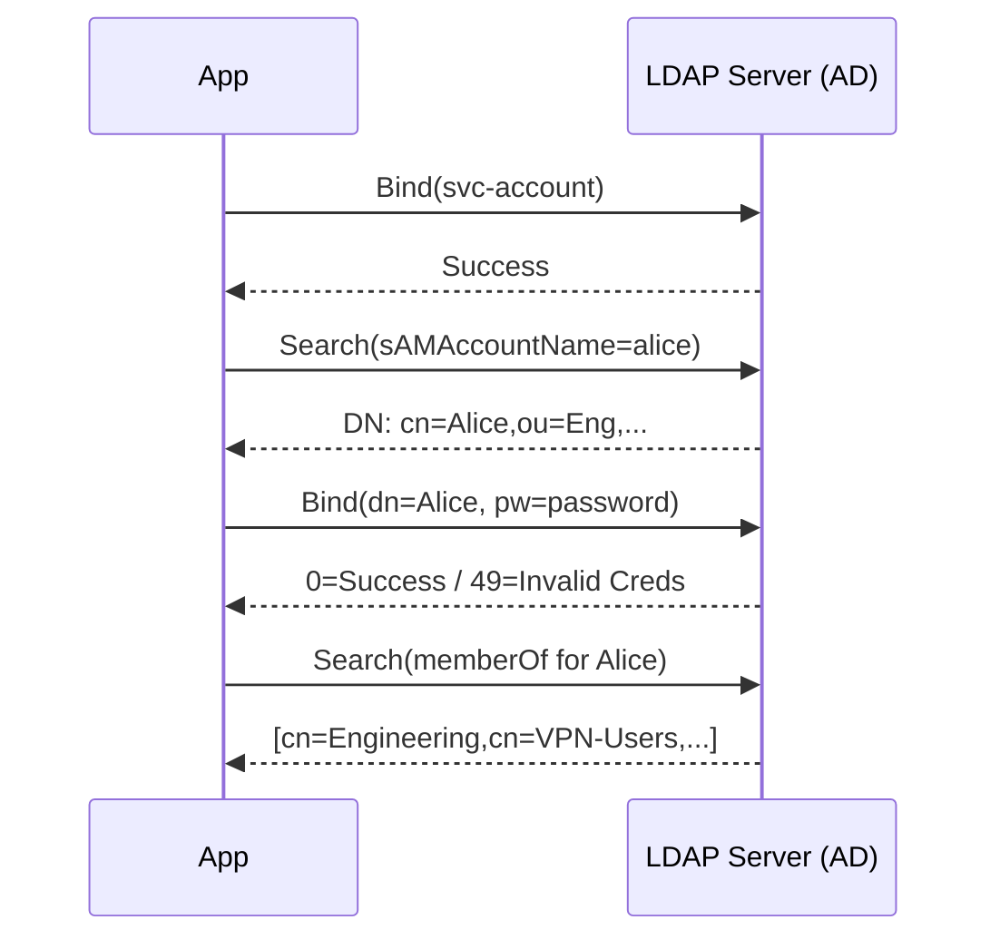

⚡ TL;DR - LDAP (Lightweight Directory Access Protocol)
is the protocol for querying and modifying hierarchical
identity directories. Active Directory (AD) is Microsoft's
enterprise LDAP implementation combined with Kerberos
authentication, DNS, and Group Policy. Understanding LDAP
is essential for integrating with any corporate directory;
it is the directory protocol underlying every enterprise
IdP including modern cloud IdPs that sync from on-premises AD.

---

### 🔥 The Problem This Solves

Enterprise organizations have thousands of employees,
groups, and computers that must share a common identity
namespace: the same username works for email, Windows
login, VPN, printers, and file shares. Before centralized
directories, every system maintained its own user database.
Login to the corporate network was different from login
to email, which was different from login to the ERP
system. No single source of truth. No central revocation.
No audit across systems.

X.500 (1988) introduced the directory concept: a
hierarchical, distributed database of identity objects.
LDAP (1993) made X.500 lightweight enough to deploy on
ordinary hardware. Active Directory (1999) combined LDAP
with Kerberos authentication and Windows Group Policy to
create the dominant enterprise identity platform for 20
years.

---

### 📘 Textbook Definition

**LDAP (Lightweight Directory Access Protocol):**
A protocol (RFC 4510-4519) for reading and modifying
a directory information tree (DIT). LDAP is access
protocol, not a directory server implementation.
Default ports: 389 (LDAP), 636 (LDAPS - LDAP over TLS).

**Directory Information Tree (DIT):** A hierarchical
tree of entries. Each entry has a Distinguished Name
(DN) that uniquely identifies it and a set of attributes.

**Distinguished Name (DN):** The full path to an entry.
Example: `cn=Alice Smith,ou=Engineers,dc=company,dc=com`
- cn = common name
- ou = organizational unit
- dc = domain component (domain = company.com)

**Active Directory (AD):** Microsoft's directory service
combining LDAP (directory queries), Kerberos (network
authentication), DNS (hostname resolution), and Group
Policy (workstation configuration). Deployed on
Domain Controllers (DCs). Now called Active Directory
Domain Services (AD DS). Cloud version: Microsoft
Entra ID (formerly Azure Active Directory).

---

### ⏱️ Understand It in 30 Seconds

**One line:**
LDAP is the protocol for querying a tree of identity
objects. Active Directory is the most widely deployed
LDAP server, adding Kerberos authentication and
Windows-specific management on top.

**One analogy:**
> A company phone book organized as an org chart:
> - Top level: the company (dc=company,dc=com)
> - Departments: Engineering, Finance, HR (ou=...)
> - People: individual employees with attributes
>   (name, email, phone, department, manager)
>
> LDAP is the language for looking up "find me all
> engineers in the London office." Active Directory
> is the specific phone book system Microsoft built
> for Windows enterprise environments.

**One insight:**
Almost every enterprise authentication system queries
Active Directory or an LDAP-compatible directory behind
the scenes - even modern cloud IdPs like Okta or Entra
often sync from on-premises AD via the AD Connect agent.

---

### 🔩 First Principles Explanation

**Why a hierarchical directory model:**

Identity data has natural hierarchy: company -> region
-> department -> team -> user. Hierarchical queries are
efficient: "find all users in ou=Engineering" traverses
a subtree, not a full table scan.

**Why LDAP over SQL:**

LDAP is optimized for read-heavy, attribute-based
queries with predictable access patterns ("find user
by username"). Relational SQL is better for complex
joins and ad-hoc queries. Directory servers maintain
indexes on common attributes (cn, mail, sAMAccountName)
for sub-millisecond lookup.

**LDAP operations:**
- **Bind:** authenticate to the directory (credentials)
- **Search:** query for entries matching a filter
- **Add/Modify/Delete:** modify directory entries
- **Compare:** test if an attribute has a specific value
- **Unbind:** end the session

**Active Directory specifics:**
AD adds over base LDAP:
- Kerberos KDC (Key Distribution Center) on each DC
- Group Policy Objects (GPOs) distributing workstation config
- Multi-master replication between DCs (conflict resolution
  via originating write timestamp)
- Schema extensions (custom attributes via AD Schema Snap-in)

---

### 🧪 Thought Experiment

**Find all engineers in the London office:**

LDAP query:
```
Base DN: ou=Engineering,dc=company,dc=com
Filter:  (&(objectClass=person)(l=London))
Attrs:   cn, mail, telephoneNumber
Scope:   subtree
```

This searches the Engineering subtree for all person
objects with location=London. No full table scan. The
directory server uses its DIT index to traverse only
the Engineering subtree.

Without LDAP: query a SQL users table with full text
search on department and location. 10x slower. No
hierarchical namespace. No attribute schema enforcement.

---

### 🧠 Mental Model / Analogy

> LDAP is a filing cabinet organized as an upside-down
> tree:
>
> - The root is at the top: dc=company,dc=com
> - Branches are organizational units: ou=Engineering
> - Leaves are entries: cn=Alice Smith (with attributes)
>
> Each entry has a unique "path" (Distinguished Name)
> from root to leaf: cn=Alice,ou=Engineering,dc=company,dc=com
>
> Finding Alice: follow the path. Searching Engineering:
> open the ou=Engineering drawer and look inside.
> Reading an attribute: look at Alice's "card" in the drawer.
>
> Active Directory = the office's custom filing system
> that also has a key safe (Kerberos) and a rules book
> for desk configuration (Group Policy) built in.

---

### 📶 Gradual Depth - Five Levels

**Level 1 (anyone):**
LDAP is a system for storing and looking up employee
information in a hierarchy (company > department >
person). Active Directory is the Microsoft version of
this, used by most large companies for Windows login.

**Level 2 (junior developer):**
When your app needs to authenticate users against
corporate credentials, you bind to LDAP and search for
the user's DN, then attempt to bind as that user with
their password. If the bind succeeds, they are
authenticated. This is LDAP simple bind authentication.

**Level 3 (mid engineer):**
Production LDAP usage: use a service account (readonly
bind DN) to search for the user's full DN by username,
then perform a second bind as that user to verify their
password. Use LDAPS (port 636) or StartTLS. Never send
credentials over plain LDAP (port 389) in production.
Use connection pooling - LDAP connections are expensive
to establish; reuse them.

**Level 4 (senior/staff):**
AD synchronization to cloud IdPs: Okta AD Agent and
Azure AD Connect both run as on-premises agents,
continuously syncing user and group data from AD to
the cloud IdP. Sync is one-way (AD is authoritative)
for user attributes; password hash sync is optional
and controversial (security vs convenience). Federation
without password sync (pass-through authentication)
keeps credentials on-premises but requires on-premises
agent availability.

**Level 5 (distinguished):**
Active Directory replication is multi-master with
a convergence model. Conflicts are resolved by
originating write timestamp (OWT). The FSMO roles
(Flexible Single Master Operations) designate specific
DCs as single masters for schema changes, PDC emulator
(authoritative time, password changes), and RID master
(unique SID allocation). AD forests and trusts enable
cross-domain authentication; trust direction and
transitivity determine what cross-domain access is
possible. At scale, AD is often the single largest
source of enterprise security incidents: AD compromise
= domain compromise = all systems compromised.

---

### ⚙️ How It Works (Mechanism)

```
LDAP Authentication Flow:

Step 1: Service Account Bind (readonly)
  Client -> LDAP server:
    Bind(dn="cn=svc-read,dc=company,dc=com",
         password="svc-password")
  Server: 0 (Success) or 49 (Invalid credentials)

Step 2: User DN Lookup
  Client -> LDAP server:
    Search(
      base="dc=company,dc=com",
      filter="(sAMAccountName=alice)",
      scope=SUBTREE,
      attrs=["dn", "mail", "memberOf"]
    )
  Server: returns entry with dn=
    "cn=Alice Smith,ou=Engineers,dc=company,dc=com"

Step 3: User Credential Bind
  Client -> LDAP server:
    Bind(dn="cn=Alice Smith,ou=Engineers,dc=company,dc=com",
         password="alice-password")
  Server: 0 (Success) = authentication confirmed

Step 4: Fetch attributes (optional)
  Client reads memberOf attribute for group membership
  Group membership -> RBAC role assignment in application

Active Directory-specific:
  Kerberos replaces LDAP bind for Windows clients:
  1. Client -> KDC: Authentication Request (AS-REQ)
  2. KDC -> Client: Ticket Granting Ticket (TGT) [encrypted]
  3. Client -> KDC: Service Ticket Request (TGS-REQ)
  4. KDC -> Client: Service Ticket for target service
  5. Client -> Service: Authenticate with Service Ticket
  LDAP still used for directory lookups even with Kerberos auth
```



---

### ⚖️ Comparison Table

| Feature | LDAP (generic) | Active Directory | Entra ID (Azure AD) |
|:---|:---|:---|:---|
| Protocol | LDAP RFC 4510 | LDAP + Kerberos + DNS | OAuth 2.0 / OIDC |
| Deployment | On-premises / cloud | On-premises (DCs) | Cloud SaaS (Microsoft) |
| Auth protocol | LDAP bind / SASL | Kerberos + LDAP bind | OIDC + SAML |
| Group Policy | No | Yes (GPO) | Intune (cloud MDM) |
| Best for | Linux/app integration | Windows enterprise | Modern cloud + hybrid |
| Max scale | Millions of entries | Tens of millions | Hundreds of millions |

---

### ⚠️ Common Misconceptions

| Misconception | Reality |
|:---|:---|
| LDAP and Active Directory are the same thing | AD uses LDAP as its directory protocol but adds Kerberos, DNS, Group Policy, and AD-specific schema. LDAP is the protocol; AD is the implementation. |
| LDAP authentication is secure | Plain LDAP (port 389) sends credentials in cleartext. LDAPS (636) or StartTLS is required. Never use plain LDAP for authentication over a network. |
| Azure AD is just AD in the cloud | Azure AD / Entra ID uses OAuth 2.0 and OIDC instead of Kerberos and LDAP. It is not a cloud-hosted Active Directory - it is a fundamentally different identity platform. |
| "We migrated to the cloud so we don't need AD" | Many enterprises run AD Connect to sync on-premises AD to Entra ID. Legacy apps still authenticate against on-premises LDAP. Full cloud migration of identity can take years. |

---

### 🚨 Failure Modes & Diagnosis

**LDAP authentication failing with error 49**

**Symptom:** Application reports authentication failure
for valid users. LDAP error code 49 (invalidCredentials).

**Root Cause:** Could be wrong password, account locked,
expired password, or incorrect bind DN format.

**Diagnosis:**
```bash
# Test LDAP connectivity and bind
ldapsearch -H ldaps://ad.company.com:636 \
  -x \
  -D "cn=svc-read,dc=company,dc=com" \
  -w "svc-password" \
  -b "dc=company,dc=com" \
  "(sAMAccountName=alice)" cn mail memberOf

# If bind fails: check service account credentials
# If search returns no results: check base DN and filter
# If bind as user fails with 49: check AD lockout status

# Check AD account status (Windows PowerShell on DC)
# Get-ADUser -Identity alice -Properties LockedOut,
#   PasswordExpired, AccountExpirationDate
```

**Fix:** Check AD lockout policy and account status.
Ensure the sAMAccountName filter is correct. Verify
LDAPS certificate is trusted by the connecting client.

---

**AD replication failure causing authentication inconsistency**

**Symptom:** Password reset works on some DCs, not others.
New accounts visible in one region but not another.

**Diagnosis:**
```bash
# Windows: check replication status across DCs
repadmin /replsummary
repadmin /showrepl
# Look for: Last Success, Failure Count, Last Failure

# Test specific attribute replication
repadmin /showattr * "dc=company,dc=com" \
  /atts:msDS-LastSuccessfulInteractiveLogonTime
```

**Fix:** Investigate network connectivity between DCs.
Force replication with `repadmin /syncall /AdeP`.
If lingering objects detected, use `repadmin
/removelingeringobjects`.

---

### 🔗 Related Keywords

**Prerequisites:**

- `IAM-002` - What IAM Actually Manages
- `IAM-006` - IAM Principals: user and group objects

**Builds On This:**

- `IAM-009` - Single Sign-On: LDAP/AD as SSO backend
- `IAM-010` - Identity Federation: connecting AD to cloud IdPs
- `IAM-014` - SAML 2.0: enterprise SSO using AD as IdP

**Related:**

- `NET-001` - Networking Fundamentals: LDAP runs on TCP
- `ATH-010` - Kerberos Protocol: AD authentication detail

---

### 📌 Quick Reference Card

```
┌──────────────────────────────────────────────────────┐
│ LDAP / ACTIVE DIRECTORY QUICK REFERENCE              │
├───────────────────────┬──────────────────────────────┤
│ LDAP ports            │ 389 (plain), 636 (LDAPS)     │
│                       │ Always use 636 in production  │
├───────────────────────┼──────────────────────────────┤
│ DN example            │ cn=Alice,ou=Eng,dc=co,dc=com  │
├───────────────────────┼──────────────────────────────┤
│ Key attributes (AD)   │ sAMAccountName (login name)  │
│                       │ userPrincipalName (UPN/email) │
│                       │ memberOf (group memberships)  │
│                       │ dn (full path in DIT)         │
├───────────────────────┼──────────────────────────────┤
│ Error 49              │ invalidCredentials (bad PW,   │
│                       │ locked, expired)             │
├───────────────────────┼──────────────────────────────┤
│ AD auth protocol      │ Kerberos (not LDAP bind)     │
│ for Windows clients   │ LDAP used for directory ops  │
├───────────────────────┼──────────────────────────────┤
│ Cloud AD              │ Entra ID (not LDAP/Kerberos) │
│                       │ Uses OAuth 2.0 / OIDC        │
└───────────────────────┴──────────────────────────────┘
```

**If you remember 3 things:**

1. Always use LDAPS (port 636) for production. Plain
   LDAP sends credentials in cleartext.

2. The two-step pattern: bind as service account,
   search for user DN, then bind as user to verify
   credentials.

3. Azure AD / Entra ID is NOT LDAP-based. It uses
   OAuth 2.0 / OIDC. Do not try to write LDAP queries
   against it.

**Interview one-liner:**
"LDAP is the protocol for querying hierarchical identity
directories; Active Directory is Microsoft's enterprise
implementation adding Kerberos, DNS, and Group Policy.
The authentication flow: bind as service account, search
for user DN, bind as user to validate credentials."

---

### 💎 Transferable Wisdom

**Reusable Principle:**
Hierarchical namespaces with attribute-based search are
a recurring solution across domains. DNS zones are a
hierarchical namespace for hostnames with record-type
queries. LDAP directories are a hierarchical namespace
for identity with attribute queries. File systems are
hierarchical namespaces for data. The DN
(cn=Alice,ou=Eng,dc=company,dc=com) is structurally
identical to a fully qualified domain name
(alice.engineering.company.com) - both are paths in
an inverted tree. The same tree traversal efficiency
rationale applies to all three.

**Where else this appears:**

- Kubernetes: namespaced resources form a hierarchical
  namespace (cluster/namespace/resource). kubectl queries
  are structurally similar to LDAP searches on a subtree.

- X.500 and LDAP influenced SNMP MIB (network device
  attribute trees), RADIUS (network authentication), and
  the original design of the web directory concept that
  became Google.

---

### 💡 The Surprising Truth

Active Directory's architecture has a well-documented
single point of failure: the FSMO PDC Emulator role.
All domain password changes replicate immediately to
the PDC Emulator; all other DCs check the PDC Emulator
on authentication failure (in case password was recently
changed). If the PDC Emulator is unavailable during a
password reset, users can be locked into authentication
failures across the domain. This is not a bug - it is
a deliberate design trade-off to prevent authentication
failures from stale password caches. But it means the
PDC Emulator must be treated as Tier 0 critical
infrastructure with its own HA and monitoring.

---

### ✅ Mastery Checklist

**You have mastered this when you can:**

1. **IMPLEMENT** Write the two-step LDAP authentication
   flow (service account bind, user DN search, user
   credential bind) in pseudocode or code, including
   connection pooling and LDAPS configuration.

2. **QUERY** Given a base DN and filter syntax, construct
   an LDAP search that returns all members of a specific
   group in a specific OU.

3. **DIAGNOSE** Given LDAP error code 49 for a specific
   user, list the three most common root causes and
   describe how to distinguish between them using AD
   admin tools or LDAP search results.

---

*Identity & Access Management | IAM-008 | v5.0*