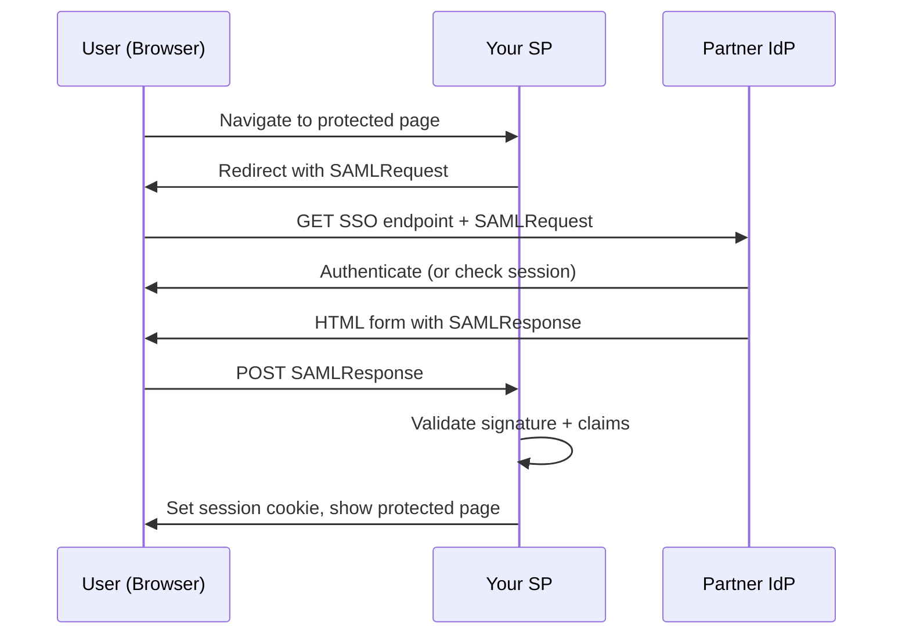

⚡ TL;DR - Identity federation is a trust relationship
between two organizations (or two systems) where one IdP's
authenticated identity assertions are accepted by the other's
resources - without sharing user databases or passwords.
Company A's employee can access Company B's portal using
their Company A credentials, because B trusts A's IdP
assertions. SAML and OIDC are the protocols that make this
work.

---

### 🔥 The Problem This Solves

A law firm's client needs to give the firm's lawyers
access to the client's document portal. Options:

1. Create separate accounts for all lawyers in the client's
   system. Problem: the law firm must now manage two sets
   of credentials per lawyer. When a lawyer leaves the firm,
   someone must separately deactivate their account in the
   client's system (often missed for months).

2. Share the client's admin password with the firm's team.
   Problem: unauditable, insecure, not scalable.

3. Federate identity: the client's portal trusts assertions
   from the law firm's IdP. Lawyers log in with their firm
   credentials. The client portal receives a signed assertion:
   "this person is an active employee of the firm."
   When a lawyer leaves the firm, their firm account is
   deactivated, and their access to the client portal
   is simultaneously revoked.

Federation solves cross-organizational access without
shared databases, shared passwords, or duplicate accounts.

---

### 📘 Textbook Definition

Identity federation is a trust arrangement between two
or more independent identity domains where one domain's
IdP (the Identity Provider) authenticates users and
issues signed assertions, and another domain's services
(the Service Providers) accept those assertions without
requiring a separate identity database.

**Identity Provider (IdP):** The organization that
authenticates users and issues assertions. "Home domain."

**Service Provider (SP) / Relying Party (RP):** The
organization or service that consumes the assertions.
"Visiting domain."

**Trust relationship:** The SP pre-configures trust in
the IdP by importing the IdP's metadata (public key for
signature verification, issuer ID, assertion endpoint).

**Identity claims:** Attributes in the assertion that
the SP receives about the authenticated user: email,
name, job title, group memberships. The SP uses these
claims to make authorization decisions locally.

**Protocol options:**
- SAML 2.0: XML assertions. Dominant in enterprise.
- OIDC: JWT id_tokens. Dominant in modern/cloud.
- WS-Federation: Microsoft/enterprise legacy.

---

### ⏱️ Understand It in 30 Seconds

**One line:**
Federation = "I trust your IdP to vouch for your users."
No user database sharing. No password sharing.
The IdP signs assertions; the SP verifies signatures.

**One analogy:**
> International travel with a passport:
> - Your country's government (IdP) issues your passport
>   and vouches for your identity with its official seal
> - Other countries' border control (SPs) accept your
>   passport because they trust your government's seal
> - No country maintains a copy of your personal file -
>   they trust the assertion in the passport
> - Your country revoking your passport (account deactivated)
>   means no other country will accept it at the border
>
> Federation for IT systems works the same way:
> signed assertions replace passports.

**One insight:**
Federation enables the deprovisioning linkage: deactivate
the user in the home IdP, and all federated services
that rely on the IdP for authentication immediately
see the user as invalid.

---

### 🔩 First Principles Explanation

**The cryptographic trust foundation:**

Federation security rests on asymmetric cryptography.
The IdP signs assertions with its private key. The SP
verifies signatures with the IdP's published public key
(in the IdP's metadata XML or JWKS endpoint). If the
signature verifies, the SP knows:

1. The assertion was issued by the expected IdP (not forged)
2. The assertion was not tampered with in transit
3. The claims (user identity) in the assertion are authentic

An attacker cannot forge a valid assertion without the
IdP's private key.

**What federation does NOT provide:**

- Authorization: the SP still decides what the federated
  user can do based on the claims. "This user is an active
  employee of FirmX" does not grant them any specific
  permission - the SP's authorization policy decides that.

- Real-time revocation: a federated assertion is valid
  until its expiry time. If the IdP account is disabled
  after the assertion is issued, the SP does not know
  immediately (until the next authentication attempt).

---

### 🧪 Thought Experiment

**Partner employee needs access to your SaaS application:**

**Without federation (manual accounts):**
- Your IT creates a separate account for each partner user
- Partner employee needs to remember two passwords
- When partner employee leaves their company, you are not
  notified; their account persists in your system
- Deprovisioning: manual ticket, often missed

**With OIDC federation:**
- Your app is configured as an OIDC client to the partner's IdP
- Partner employee navigates to your app
- App redirects to partner IdP for authentication
- Partner IdP authenticates user (their credentials, their MFA)
- Partner IdP issues id_token: {sub: emp-123, email: alice@partner.com}
- Your app creates a local session for alice@partner.com
- When alice leaves the partner company, partner IdP deactivates
  her account; she can no longer authenticate to your app
- Zero accounts to manage on your side

**The power of the model:** the partner's HR offboarding
cascade handles your access revocation automatically.

---

### 🧠 Mental Model / Analogy

> **Federation trust chain visualization:**
>
> ```
> Partner Company (IdP domain)          Your Company (SP domain)
> ┌───────────────────┐                ┌──────────────────────┐
> │ HR: alice hired   │                │ Your App (SP)        │
> │ IdP: alice active │                │ Trusts PartnerCo IdP │
> │ IdP signs:        │────assertion──>│ Verifies signature   │
> │ "alice is valid   │                │ Extracts claims      │
> │  partner employee"│                │ Authorizes access    │
> └───────────────────┘                └──────────────────────┘
>
> Trust is pre-configured (IdP metadata imported into SP)
> No user DB shared, no password shared
> ```
>
> The trust relationship is configured once (import
> metadata). Individual user assertions flow at runtime.
> Revoking alice in the IdP = all SPs reject her
> on next authentication attempt.

---

### 📶 Gradual Depth - Five Levels

**Level 1 (anyone):**
Federation means "Company A trusts Company B's login
system." Employees of Company A can access Company B's
tools using Company A's login. No separate passwords.

**Level 2 (junior developer):**
To set up OIDC federation: register your app as an OIDC
client with the partner's IdP. Get a client_id. Configure
your app to redirect authentication requests to the
partner's IdP. The rest is standard OIDC SSO flow -
the only difference is the IdP belongs to a different
organization.

**Level 3 (mid engineer):**
Federation metadata management: SAML federation requires
importing the IdP's metadata XML (contains public key,
issuer, SSO endpoint). When the IdP rotates its signing
key, all federated SPs must update the metadata or
assertions start failing (signature verification fails
with new key). Automated metadata refresh (SAML metadata
URL polling) prevents this operational failure.

**Level 4 (senior/staff):**
Claims mapping: the IdP and SP may use different
attribute names. Partner's IdP sends `user.jobTitle`;
your SP expects `role`. Claims transformation rules
(in the SP or in the IdP federation config) translate
attributes. Group claims from the IdP can be mapped
to local RBAC roles: `partner-engineers` group maps
to `readonly` role in your app. This enables role-based
access without sharing your authorization model with
the partner.

**Level 5 (distinguished):**
Multi-party federation (federated identity hubs): when
a service needs to accept identities from hundreds of
partner organizations, configuring bilateral trust with
each is not scalable. Identity hubs (InCommon for
academic federation, Kantara for enterprise) act as
trusted brokers. An SP trusts the hub; the hub validates
that the IdP is a trusted member. This is the architecture
behind academic SAML federations where a student's home
university credentials work at any member institution's
library system.

---

### ⚙️ How It Works (Mechanism)

```
SAML 2.0 Federation Flow (SP-initiated):

PRE-SETUP:
  SP imports IdP metadata XML:
  - EntityID: https://idp.partner.com/saml
  - SSO endpoint: https://idp.partner.com/sso
  - Public key: (for signature verification)

RUNTIME:

1. User navigates to sp.yourcompany.com
2. SP: no session -> generate SAMLRequest (XML, signed)
   Redirect: https://idp.partner.com/sso?SAMLRequest=...

3. Partner IdP: validates SAMLRequest
   -> Check SSO session (or prompt for login + MFA)
   -> Generate SAMLResponse (XML assertion):
      {Issuer: idp.partner.com,
       Subject: alice@partner.com,
       Conditions: valid 5 minutes,
       Attributes: email, groups, department,
       Signature: signed with IdP private key}

4. Browser POST (via HTML form auto-submit):
   POST https://sp.yourcompany.com/saml/acs
   Body: SAMLResponse=base64(signed XML)

5. SP validation:
   a. Verify XML signature with IdP public key
   b. Check Issuer = expected IdP EntityID
   c. Check Conditions (not expired, audience correct)
   d. Check SubjectConfirmation (one-time use, replay prevention)
   e. Extract identity claims

6. SP creates local session for alice@partner.com
   -> Apply claims mapping (partner groups -> local roles)
   -> User is in the application
```



---

### ⚖️ Comparison Table

| Scenario | Best Protocol | Reason |
|:---|:---|:---|
| Enterprise app with existing AD | SAML 2.0 | AD FS native SAML IdP; most legacy enterprise apps support SAML |
| New web/mobile app | OIDC | JSON/JWT based, simpler, OAuth 2.0 compatible |
| Partner B2B access | SAML 2.0 or OIDC | Both work; OIDC preferred for greenfield; SAML for legacy SPs |
| Academic institution federation | SAML 2.0 (Shibboleth) | InCommon federation uses SAML; widespread in academia |
| Social login (Google, Facebook) | OIDC | Social providers offer OIDC, not SAML |

---

### ⚠️ Common Misconceptions

| Misconception | Reality |
|:---|:---|
| Federation shares user data between organizations | Federation shares only the signed assertion about the current authenticated user. No user database is shared. |
| Federated users are managed by the SP | Federated users are managed by the IdP (home organization). The SP has no ability to reset passwords, lock accounts, or manage profiles of federated users. |
| Federation means no local authorization | The SP still manages authorization. Federation handles authentication only. The SP maps IdP claims to local permissions. |
| Metadata import is a one-time setup | IdP signing keys rotate. Metadata must be refreshed when keys change or assertion validation will fail. Automate metadata refresh. |

---

### 🚨 Failure Modes & Diagnosis

**SAML signature validation failure after IdP key rotation**

**Symptom:** Federation suddenly stops working. SP logs
show "invalid signature" on SAML assertions. All federated
users get errors. The IdP rotated its signing certificate.

**Diagnosis:**
```bash
# SP side: check what public key is cached
# Most SPs show federation config in admin console

# Fetch current IdP metadata and compare keys
curl https://idp.partner.com/saml/metadata | \
  xmllint --format - | \
  grep -A5 "X509Certificate"

# If key in SP metadata != key in current IdP metadata
# -> metadata is stale -> update SP metadata

# Okta: Admin -> Security -> Identity Providers
# -> your federation -> download fresh metadata
```

**Fix:** Update IdP metadata in SP configuration.
Prevent future failures by enabling automated metadata
refresh if your SP supports it.

---

**Claims mismatch: federated user gets wrong permissions**

**Symptom:** Partner users authenticate successfully
but land on an "insufficient permissions" page.
Expected access based on their partner role.

**Diagnosis:**
```bash
# Decode the SAML assertion (base64 + XML)
echo "SAMLResponseBase64" | base64 -d | xmllint --format -
# Check Attribute elements: what claims does the IdP send?
# Name, email, department, groups

# Compare to SP claims mapping config:
# Does the SP expect "groups" but IdP sends "memberOf"?
# Does the SP expect "admin" but IdP sends "Admin" (case)?
```

**Fix:** Update claims mapping rules in the SP (or IdP
adapter) to correctly translate the IdP's attribute
names and values to the SP's expected format.

---

### 🔗 Related Keywords

**Prerequisites:**

- `IAM-003` - Authentication vs Authorization vs Identity
- `IAM-009` - Single Sign-On: SSO is the mechanism within each domain

**Builds On This:**

- `IAM-014` - SAML 2.0: the XML-based federation protocol detail
- `IAM-024` - Cross-Organization Identity Federation: enterprise scale
- `IAM-028` - Federated Identity at Enterprise Scale

**Related:**

- `OAU-001` - OAuth 2.0 Basics: OIDC federation on OAuth foundation
- `ATH-011` - SAML 2.0 Authentication

---

### 📌 Quick Reference Card

```
┌──────────────────────────────────────────────────────┐
│ IDENTITY FEDERATION BASICS                           │
├──────────────────────┬───────────────────────────────┤
│ What is shared       │ Signed assertions only        │
│                      │ NOT: user DBs, passwords      │
├──────────────────────┼───────────────────────────────┤
│ Trust basis          │ IdP public key (asymmetric    │
│                      │ signature verification)       │
├──────────────────────┼───────────────────────────────┤
│ Protocol for new app │ OIDC (JWT based)              │
│ Protocol for legacy  │ SAML 2.0 (XML based)         │
├──────────────────────┼───────────────────────────────┤
│ User management      │ IdP (home org) owns users     │
│                      │ SP has no password management │
├──────────────────────┼───────────────────────────────┤
│ Revocation           │ Disable in IdP -> next auth   │
│                      │ attempt fails in all SPs      │
├──────────────────────┼───────────────────────────────┤
│ Common failure       │ Stale IdP metadata after      │
│                      │ signing key rotation          │
└──────────────────────┴───────────────────────────────┘
```

**If you remember 3 things:**

1. Federation = trust in a signed assertion. The SP
   verifies the IdP's signature, not the user's password.

2. The IdP owns the user. The SP cannot manage federated
   user credentials - only map their claims to permissions.

3. Key rotation invalidates stale metadata. Automate
   metadata refresh or federation will silently break.

**Interview one-liner:**
"Identity federation lets Organization B accept
Organization A's signed assertions as proof of user
identity. No shared user database. No shared passwords.
Trust is established via the IdP's public key, and
the assertion carries user claims the SP maps to
local permissions."

---

### 💎 Transferable Wisdom

**Reusable Principle:**
Federation is the "verified third-party endorsement"
pattern. It recurs anywhere two independent domains
need to share trust without sharing credentials:
Certificate Authorities federate trust through the
certificate chain (browser trusts CA, CA vouches for
website). Package signing (GPG key of a trusted
repository vouches for package integrity). Git commit
signing (GitHub trusts your GPG key, vouches for
your commits). The same structure: one trusted signer,
many relying parties, no password sharing.

**Where else this appears:**

- Certificate chains: Root CA -> Intermediate CA ->
  Leaf certificate. Any party trusting the Root CA
  transitively trusts all leaf certificates. Same
  federation trust transitivity model.

- GitHub Actions OIDC: GitHub's IdP issues short-lived
  OIDC tokens for Actions workflows. AWS STS accepts
  these tokens to issue temporary credentials. Pure
  federation: GitHub IdP, AWS as SP, no static keys.

---

### 💡 The Surprising Truth

The most common source of SAML implementation
vulnerabilities is XML signature wrapping (XSW) attacks.
An attacker who intercepts a valid SAML assertion can
wrap additional content around the signed portion in
ways that pass signature verification but change the
identity claims seen by the application. The SAML
XML signature specification allows signing a portion
of an XML document, not the whole document. If the
SP's SAML parser reads unsigned sections instead of
signed sections, the attacker can forge identity claims.
Major platforms (Salesforce, GitHub, various SSO libraries)
have been vulnerable to XSW at various points. The
mitigation: validate that the signed element is the
one your parser actually reads.

---

### ✅ Mastery Checklist

**You have mastered this when you can:**

1. **EXPLAIN** Why federation does not share user
   data, and what the cryptographic basis of trust
   is between the IdP and SP.

2. **CONFIGURE** Describe the setup steps for adding
   SAML federation between two organizations: what
   metadata is exchanged, who imports what, and what
   happens when the IdP's signing certificate rotates.

3. **DIAGNOSE** After a partner IdP rotates its signing
   certificate, all federated users get "invalid
   signature" errors. Describe the root cause and
   the fix without restarting any application server.

---

*Identity & Access Management | IAM-010 | v5.0*