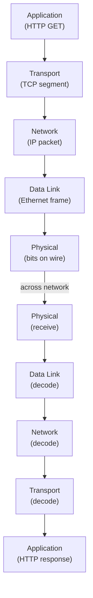

**⚡ TL;DR** - Networks exist because isolated computers are
useless islands; networking solves the fundamental problem of
making separate machines share data as if they were one system.

| #001 | Category: Networking | Difficulty: ★☆☆ |
|:---|:---|:---|
| **Depends on:** | (none - entry point) | |
| **Used by:** | What Happens When You Type a URL, Client-Server Model, OSI Model, TCP | |
| **Related:** | OSI Model - The Big Picture, Networking in the SE Landscape | |

---

### 🔥 The Problem This Solves

**WORLD WITHOUT IT:**

Imagine 1970. You work at a university. The physics department
has a powerful computer solving climate models. The chemistry
department has a different computer storing molecular databases.
The engineering department has a third machine running
simulations. Each is a powerful island. Sharing results means
printing paper and walking across campus. A physicist who needs
the chemist's data must wait days for a printout to arrive in
the mail.

**THE BREAKING POINT:**

When multiple computers exist at the same institution, the cost
of sharing data by physical media (punch cards, magnetic tape,
paper) grows proportionally with the number of machines. At 10
machines, it is inconvenient. At 1000 machines spanning
continents, it is catastrophically slow. The US Department of
Defense needed researchers at four universities to share
computing resources. Physical transfer was not viable.

**THE INVENTION MOMENT:**

This is exactly why computer networks were created. In 1969,
ARPANET sent the first networked message between UCLA and
Stanford Research Institute, proving that computers could
communicate directly over wire without a human in the loop.
The fundamental insight: a computer can generate and consume
messages on behalf of a human. If you can encode a message as
bits, you can transmit it at the speed of electrons.

**EVOLUTION:**

Before ARPANET, computing resources were shared using physical
media - operators physically carried tapes between machines.
ARPANET (1969) proved packet-switched networking was viable.
The TCP/IP protocol suite (1983) standardized communication
rules. Today networks carry everything: voice, video, financial
transactions, medical records, real-time sensor data from
billions of IoT devices - the entire digital economy depends on
the infrastructure ARPANET seeded.

---

### 📘 Textbook Definition

A **computer network** is a set of computing devices
interconnected by a communication medium, governed by protocols
that define how data is encoded, addressed, transmitted,
routed, and received. Networks enable resource sharing, remote
communication, and distributed computation by providing a
reliable (or explicitly unreliable) channel over which
programs on different machines can exchange structured data.

---

### ⏱️ Understand It in 30 Seconds

**One line:**
A network lets computers talk to each other without a human
carrying data between them.

**One analogy:**

> A computer without a network is like a post office that
> only delivers mail within one building. Networks are the
> roads, trucks, and addressing system that let any building
> send a letter to any other building - reliably, fast,
> anywhere in the world.

**One insight:**
The fundamental problem networking solves is not "how do we
move bytes" - it is "how do we build a system where any two
machines can communicate without knowing each other's internal
details in advance." The entire complexity of modern networking
(protocols, layers, routing, DNS) flows from this one
requirement: universal, decentralized reachability.

---

### 🔩 First Principles Explanation

**CORE INVARIANTS:**

1. Two programs on different machines cannot share memory
   directly - they must communicate by message passing.
2. Messages must travel through a physical medium (copper wire,
   fiber optic, radio waves) - physics sets hard limits on
   speed and error rates.
3. A shared medium (Ethernet, WiFi) means multiple senders can
   collide - some arbitration mechanism must exist.

**DERIVED DESIGN:**

Given these invariants, any network MUST have:

- An **addressing scheme** to identify senders and receivers
  (IP addresses, MAC addresses).
- A **framing scheme** to mark where one message ends and
  the next begins (Ethernet frames, IP packets).
- An **error-handling scheme** because physical media introduce
  bit errors (checksums, retransmission).
- A **routing scheme** to forward messages across multiple
  hops when sender and receiver are not directly connected
  (routers, BGP).

No design choice avoids these requirements. Every networking
protocol is just a specific way to solve these four universal
sub-problems.

**THE TRADE-OFFS:**

**Gain:** Any two machines anywhere can exchange data without
pre-coordination, without a human intermediary, at speeds
approaching the physical limits of light.

**Cost:** Shared infrastructure means contention, congestion,
security exposure, and failure modes absent in a single
isolated machine. The internet is a hostile environment.

**ESSENTIAL vs ACCIDENTAL COMPLEXITY:**

**Essential:** Message passing, addressing, routing, and error
recovery are fundamentally necessary. No implementation
eliminates them; they arise directly from the physics of
communication over a shared medium.

**Accidental:** The specific byte layout of TCP headers, the
32-bit limit of IPv4, the complexity of BGP routing tables -
these are artifacts of constraints at the time of invention
(early 1970s hardware, cold-war politics, limited address space
assumptions) that a new design starting today would not repeat.

---

### 🧪 Thought Experiment

**SETUP:**
You have two computers, A and B, on opposite sides of a
building. You need program A to send a 1MB file to program B.
No network exists. The only connection is a shared USB drive.

**WHAT HAPPENS WITHOUT NETWORKING:**

1. Program A writes the file to USB drive: 10 seconds.
2. A human picks up the USB drive: delays vary, minimum 30s.
3. Human walks to computer B: 2-5 minutes.
4. Human plugs in USB, program B reads: 10 seconds.
5. Total: at minimum 3 minutes per transfer.
6. At 100 transfers/day between 10 computers: impossible.
7. At internet scale (billions of machines): civilization stops.

**WHAT HAPPENS WITH NETWORKING:**

1. Program A passes data to the OS network stack.
2. OS breaks data into packets, assigns addresses.
3. Packets travel at ~200,000 km/s through fiber.
4. Across a building LAN: complete in under 1 millisecond.
5. Across continents: 50-200 milliseconds round-trip.
6. No human intervention required.

**THE INSIGHT:**
Networks automate the "walking with the USB drive" part at
the speed of electricity. Once the human is removed from the
data path, computation becomes programmable collaboration at
any scale and any distance.

---

### 🧠 Mental Model / Analogy

> Think of a computer network like a postal system. Every
> house (computer) has a unique address (IP address). You write
> a letter (packet), put it in an envelope with a "To" and
> "From" address, drop it in a mailbox (network card). Postal
> workers (routers) read only the "To" address and forward it
> hop by hop toward the destination. The recipient's post
> office delivers it to the exact house.

Mapping:
- "House address" → IP address
- "Letter + envelope" → network packet (data + headers)
- "Mailbox" → network interface card (NIC)
- "Postal worker" → router
- "Sorting center" → ISP backbone router
- "Street numbering system" → subnets and routing tables
- "Letter contents" → payload (TCP segment, HTTP request)

**Where this analogy breaks down:** A real postal letter takes
days; packets travel in milliseconds. More importantly, packets
can be duplicated, reordered, or dropped silently - a letter
that disappears from the post office is obvious, but a dropped
packet is invisible until a timeout fires.

---

### 📶 Gradual Depth - Five Levels

**Level 1 - What it is (anyone can understand):**
A computer network is what lets computers share information
with each other. Without it, every computer is isolated.
With it, your laptop can reach any server in the world in
milliseconds.

**Level 2 - How to use it (junior developer):**
As a developer, you interact with networks through sockets and
HTTP clients. Your application calls a library (e.g.
`fetch()`, `HttpClient`, `socket.connect()`), which hands the
data to the operating system. The OS handles all the
complexity: breaking data into packets, adding addresses,
retrying on errors. You only need to know the IP address or
hostname, the port, and the protocol.

**Level 3 - How it works (mid-level engineer):**
Data travels through a layered stack. Your application
produces data. TCP (or UDP) wraps it with source/destination
ports. IP wraps it with source/destination IP addresses. The
Ethernet driver wraps it with MAC addresses and sends it as
electrical (or light) signals. Each layer strips its wrapper
at the destination. This layered design means you can swap the
physical layer (WiFi instead of Ethernet) without changing the
application.

**Level 4 - Why it was designed this way (senior/staff):**
The layered model was chosen deliberately in the 1970s to
ensure extensibility. ARPANET's designers had seen monolithic
network designs that could not evolve. By separating concerns
(physical, logical, transport, application), each layer could
be improved independently. This is why we can run modern HTTPS
traffic over fiber optic cables invented 40 years after TCP/IP
was designed - the layers were stable interfaces.

**Level 5 - Mastery (distinguished engineer):**
The network's fundamental design decision - connectionless,
best-effort packet forwarding at the IP layer - was
controversial. The telephone network used circuit switching
(dedicated lines per connection). ARPANET's packet switching
was chosen because it is more resilient: if one path fails,
packets route around it. Today, the tension between these two
models persists in modern protocols: QUIC (connectionless
datagrams) vs TCP (stateful connection). A distinguished
engineer asks: "Given my latency and reliability requirements,
which layer should own the reliability guarantee, and at what
cost?"

---

### ⚙️ How It Works (Mechanism)

Every act of network communication follows the same path,
regardless of protocol:

```
┌──────────────────────────────────────────────────┐
│          Data Transmission Pipeline              │
├──────────────────────────────────────────────────┤
│                                                  │
│  Application     "GET /index.html HTTP/1.1"      │
│       │                                          │
│       ↓  (encode: add port numbers)              │
│  Transport       TCP segment (port 80)           │
│       │                                          │
│       ↓  (encode: add IP addresses)              │
│  Network         IP packet (192.168.1.1 ->       │
│       │          93.184.216.34)                  │
│       ↓  (encode: add MAC addresses)             │
│  Data Link       Ethernet frame                  │
│       │                                          │
│       ↓  (encode: electrical/optical signals)    │
│  Physical        Bits on wire / fiber / radio    │
│                                                  │
│  ─────────────────── NETWORK ─────────────────── │
│                                                  │
│  Physical        Bits received                   │
│       │                                          │
│       ↑  (decode at each layer in reverse)       │
│  ...  → Application gets: "GET /index.html"      │
└──────────────────────────────────────────────────┘
```



At each layer, a **header** is prepended containing metadata
the layer needs to do its job. The receiving side strips each
header in reverse order. This is called **encapsulation**.

The physical medium (copper Ethernet, fiber, WiFi) sets hard
limits: electrical signals degrade with distance (copper:
~100m), fiber carries light at ~200,000 km/s but needs
amplifiers every 80km, WiFi shares spectrum and degrades with
interference. Every networking concept above the physical layer
is an attempt to work around these physical realities.

---

### 🔄 The Complete Picture - End-to-End Flow

```
┌──────────────────────────────────────────────────┐
│      Full Network Communication: Browser → Web   │
├──────────────────────────────────────────────────┤
│                                                  │
│  [Browser]                                       │
│     │ 1. URL entered: https://example.com        │
│     ↓                                            │
│  [DNS Resolver]  ← YOU ARE HERE (name → IP)      │
│     │ 2. Returns 93.184.216.34                   │
│     ↓                                            │
│  [TCP Stack]                                     │
│     │ 3. Three-way handshake with server         │
│     ↓                                            │
│  [TLS Layer]                                     │
│     │ 4. Encrypt connection                      │
│     ↓                                            │
│  [HTTP Request]                                  │
│     │ 5. GET /index.html                         │
│     ↓                                            │
│  [Routers × N]                                   │
│     │ 6. Each router forwards to next hop        │
│     ↓                                            │
│  [Web Server]    7. Response sent in reverse     │
└──────────────────────────────────────────────────┘
```

**FAILURE PATH:**
If step 2 (DNS) fails → `Name or service not known` error.
If step 3 (TCP handshake) fails → `Connection refused` or
timeout. If any router drops packets → TCP retransmits, or
application sees timeout if too many lost.

**WHAT CHANGES AT SCALE:**
At 1 billion users, the concern shifts from "can A reach B" to
"how do 100,000 routers agree on the best paths?" BGP (Border
Gateway Protocol) governs this - it is one of the most
operationally complex systems in existence, and its failures
(Cloudflare 2022, Facebook 2021) take down the internet for
millions simultaneously.

---

### ⚖️ Comparison Table

| Approach | Speed | Reliability | Cost | Best For |
|---|---|---|---|---|
| **Networking** | Milliseconds | Engineered | Low marginal | Everything |
| Physical media (USB/tape) | Minutes-hours | High if medium OK | Low fixed | Air-gapped systems |
| Telephone circuit switching | Milliseconds | Very high | High per-call | Legacy voice |
| Sneakernet (walking files) | Minutes-hours | High | Zero tech cost | Isolated, small-scale |

How to choose: Use networking unless you have regulatory
air-gap requirements or no infrastructure. Physical transfer
is only relevant for petabyte-scale migrations where bandwidth
cost exceeds shipping cost (AWS Snowball exists for exactly
this reason).

---

### ⚠️ Common Misconceptions

| Misconception | Reality |
|---|---|
| The internet is a cloud | The internet is physical: undersea fiber cables, data centers, routers in buildings. "The cloud" has a physical location and can flood. |
| Networks are reliable | The internet is a best-effort network. Packets are regularly dropped, delayed, and reordered. TCP hides this from applications, but it costs throughput. |
| More bandwidth = faster | Bandwidth is capacity (how much data per second); latency is delay (how long per round trip). A 10Gbps link with 200ms RTT is slower for interactive apps than a 100Mbps link with 5ms RTT. |
| WiFi is as good as wired | WiFi adds 1-50ms jitter, packet loss under contention, and halved throughput per added device. For latency-sensitive apps (trading, gaming, real-time video), wired is categorically different. |
| Networks are secure by default | The internet was designed for cooperative academic use, not adversarial environments. Every packet you send traverses routers you do not own. Encryption is not optional - it is survival. |

---

### 🚨 Failure Modes & Diagnosis

**Packet Loss**

**Symptom:** Slow application performance, intermittent
timeouts, TCP retransmission storms in `netstat`, users report
"spinning" or hanging requests.

**Root Cause:** Physical medium errors (damaged cable, RF
interference), buffer overflow at a congested router, software
bugs in NIC driver.

**Diagnostic Command / Tool:**
```bash
# Measure packet loss to a host
ping -c 100 8.8.8.8 | tail -2
# Shows: "5 packets received, 5% packet loss"

# Trace packet loss hop-by-hop
mtr --report --report-cycles 100 8.8.8.8
```

**Fix:** If loss > 1% on a LAN, investigate cable or switch
port. If loss is on WAN path, contact ISP or use a different
egress route. TCP will retransmit but at massive cost to
throughput.

**Prevention:** Monitor packet loss on all production paths
with continuous probes. Alert at > 0.1%.

---

**DNS Resolution Failure**

**Symptom:** `Name or service not known` errors, services
cannot reach each other by hostname, new deployments work but
cannot resolve service names.

**Root Cause:** DNS resolver unreachable, misconfigured
`/etc/resolv.conf`, TTL expired but new record not propagated,
firewall blocking port 53 UDP.

**Diagnostic Command / Tool:**
```bash
# Check DNS resolution
nslookup example.com
dig @8.8.8.8 example.com

# Check what resolver the system uses
cat /etc/resolv.conf
```

**Fix:** Ensure DNS resolver is reachable, check firewall
rules for UDP port 53, verify record TTL and propagation.

**Prevention:** Always test DNS resolution as a separate
health check from TCP connectivity. A service can be up while
DNS is broken.

---

**Network Partition**

**Symptom:** Service A cannot reach service B even though
both are running. Logs show connection timeouts, not
connection refused.

**Root Cause:** A router or switch in the path between A and
B has failed or been misconfigured, creating an isolated
network segment. Common after network changes or hardware
failure.

**Diagnostic Command / Tool:**
```bash
# Trace the path between two hosts
traceroute service-b.internal
# Look for where hops stop responding

# Test raw connectivity (no DNS, no TLS)
nc -zv service-b.internal 8080
```

**Fix:** Identify the failing hop in traceroute, restart or
replace the faulty network device.

**Prevention:** Implement redundant network paths (ECMP or
multi-path routing). Never have a single router as the only
path between production services.

---

### 🔗 Related Keywords

**Prerequisites (understand these first):**
- `Binary and Bits` - all network data is bits; understanding
  binary encoding is required to grasp packet structure

**Builds On This (learn these next):**
- `OSI Model` - the formal framework that organizes all
  networking concepts into seven layers
- `TCP/IP Model` - the practical four-layer model used in
  production internet infrastructure
- `IP Address` - the addressing scheme that enables routing
  across the internet
- `DNS Overview` - the naming system that maps human-readable
  names to IP addresses
- `Packet Structure` - the anatomy of a network packet, which
  is the universal unit of network communication

**Alternatives / Comparisons:**
- `Distributed Systems` - networking enables distributed
  systems; understanding networking is prerequisite to
  reasoning about consistency and availability

---

### 📌 Quick Reference Card

```
┌──────────────────────────────────────────────────────────┐
│ WHAT IT IS   │ The problem of inter-machine communication │
├──────────────┼───────────────────────────────────────────┤
│ PROBLEM IT   │ Isolated computers cannot share data       │
│ SOLVES       │ without a human carrying physical media    │
├──────────────┼───────────────────────────────────────────┤
│ KEY INSIGHT  │ Packet switching routes data around        │
│              │ failures; no dedicated path needed         │
├──────────────┼───────────────────────────────────────────┤
│ USE WHEN     │ Any time two processes on different        │
│              │ machines must exchange data                │
├──────────────┼───────────────────────────────────────────┤
│ AVOID WHEN   │ Air-gap security requirement; or data is   │
│              │ petabyte-scale (use physical shipping)     │
├──────────────┼───────────────────────────────────────────┤
│ ANTI-PATTERN │ Assuming the network is reliable or        │
│              │ trusted without validation                 │
├──────────────┼───────────────────────────────────────────┤
│ TRADE-OFF    │ Ubiquitous connectivity vs shared medium   │
│              │ = contention, latency, security exposure   │
├──────────────┼───────────────────────────────────────────┤
│ ONE-LINER    │ "Networks are the roads that connect       │
│              │  computing islands into a continent."      │
├──────────────┼───────────────────────────────────────────┤
│ NEXT EXPLORE │ OSI Model → TCP/IP Model → IP Address      │
└──────────────────────────────────────────────────────────┘
```

**If you remember only 3 things:**
1. Networks exist because computers cannot share memory across
   machines - message passing over a medium is the only option.
2. The internet is best-effort; packets are dropped, delayed,
   and reordered. Every reliability guarantee is built on top
   of this unreliable base.
3. Bandwidth is capacity; latency is delay. They are
   independent, and for interactive applications, latency
   dominates user experience.

**Interview one-liner:**
"Computer networks solve the fundamental isolation problem by
providing a packet-switched communication medium with
universal addressing, allowing any two machines to exchange
data without pre-coordination. The internet's genius is that
reliability, security, and ordering are optional layers built
above a deliberately simple, unreliable core."

---

### 💎 Transferable Wisdom

**Reusable Engineering Principle:**
Every complex system that needs universal, decentralized
reachability will independently invent layered protocols with
addressing, routing, and error recovery - because these are
forced by the physics and economics of shared communication
media, not by design preference.

**Where else this pattern appears:**
- **Postal system** - same addressing, routing, and
  delivery-with-error-recovery structure invented independently
  centuries before computers
- **Biological nervous system** - neurons pass electrochemical
  packets with addressing (synaptic targets) and
  error-correction (signal amplification at nodes of Ranvier)
- **Financial settlement networks** (SWIFT, ACH) - packet-like
  message routing between financial institutions with
  acknowledgment, retry, and reconciliation

**Industry applications:**
- **E-commerce** - every transaction traverses 10-30 network
  hops; understanding latency and packet loss directly explains
  why checkout abandonment spikes when CDN performance degrades
- **Healthcare** - HL7 FHIR is a protocol built on the same
  layering principle; understanding networking makes medical
  system integration comprehensible

---

### 💡 The Surprising Truth

The internet was designed to survive nuclear attack. ARPANET's
packet-switching architecture was explicitly chosen because
circuit-switched networks (like the telephone system) could
be knocked out by destroying a few key nodes. With packet
switching, data automatically routes around damage - there is
no central switching station to bomb. The internet's famous
resilience to failures is not an accident of good engineering;
it was a deliberate military requirement that became the
backbone of global commerce.

---

### ✅ Mastery Checklist

**You've mastered this when you can:**
1. **EXPLAIN** the difference between bandwidth and latency to
   a non-engineer, and correctly state which one matters more
   for a video call vs a file download.
2. **DEBUG** a connectivity failure by systematically checking
   DNS resolution, then TCP connectivity, then routing path,
   identifying at which layer the failure occurs.
3. **DECIDE** when physical media (AWS Snowball, hard drives)
   is more cost-effective than network transfer for large
   datasets, and calculate the crossover point.
4. **BUILD** a simple mental model of what happens at each
   network layer when you type a URL, including which layer
   handles which header and why.
5. **EXTEND** the concept of "layers with encapsulation" to
   explain why adding a VPN changes the network behavior but
   does not require modifying the application.

---

### 🧠 Think About This Before We Continue

**Q1.** The internet was designed to route around failures,
yet the Facebook outage in October 2021 took down all
Facebook properties globally for 6 hours. If the network
routes around failures, why did a single configuration change
cause a total outage? What does this reveal about the limits
of packet-switched resilience?

*Hint: Think about what BGP (Border Gateway Protocol) does and
what happens when the machines that advertise a network's
existence withdraw all their route announcements.*

**Q2.** At 1 billion users simultaneously streaming 4K video
(each stream ~25 Mbps), the aggregate bandwidth required
exceeds the total theoretical capacity of all undersea fiber
cables combined. Yet Netflix works. Trace step-by-step how
this is possible - what architecture makes billion-user
video streaming work within the physical constraints of the
network?

*Hint: Consider where Netflix actually places its servers and
what "eyeball networks" means in CDN architecture.*

**Q3.** [Hands-On] Use `traceroute google.com` on your
machine. Count the hops. Now trace to a server in a different
continent. What increases - the number of hops, the latency
per hop, or both? Can you identify which hops cross an
undersea cable based on the latency jump? What does this tell
you about where to place servers for global applications?

*Hint: Look for latency jumps of 80-200ms between two
consecutive hops - these typically indicate transoceanic links.*

---

### 🎯 Interview Deep-Dive

**Q1: Explain what happens at each network layer when a web
browser makes an HTTPS request to a server.**

*Why they ask:* Tests whether the candidate has internalized
the OSI/TCP-IP model as a working mental model, not just
memorized layer names.

*Strong answer includes:*
- DNS resolution (application layer) before any TCP connection
- TCP three-way handshake establishing a reliable stream
- TLS handshake layered on top of TCP for encryption
- HTTP request encapsulated inside TLS inside TCP inside IP
- Mention that HTTP/2 or HTTP/3 changes the transport behavior

**Q2: What is the difference between bandwidth and latency,
and which one would you optimize for a high-frequency trading
system vs a video streaming service?**

*Why they ask:* Tests nuanced understanding of the two
fundamental network performance dimensions and ability to
apply them to real requirements.

*Strong answer includes:*
- Bandwidth = throughput capacity; latency = one-way or
  round-trip delay
- HFT: latency dominates - even 1ms difference is worth
  millions; use co-location, dedicated fiber, kernel bypass
- Video streaming: bandwidth dominates once buffered;
  latency matters less than sustained throughput
- Jitter (variance in latency) matters more than raw latency
  for real-time media; mention buffering strategies

**Q3: A service suddenly experiences intermittent timeouts.
The application logs show no errors, and the service appears
healthy. Describe your systematic diagnostic approach.**

*Why they ask:* Tests production debugging methodology for
network-related issues - a common 3 AM scenario.

*Strong answer includes:*
- Distinguish DNS failure from TCP failure: `nslookup` vs
  `nc -zv host port`
- Use `ping` and `mtr` to detect packet loss and identify
  which network hop is failing
- Check connection pool exhaustion (`ss -s`, `netstat`)
  before assuming network fault
- Distinguish "connection refused" (service down) from
  "timeout" (network issue) from "no route to host" (routing)
- Mention: intermittent = likely congestion or flapping
  route, not complete failure