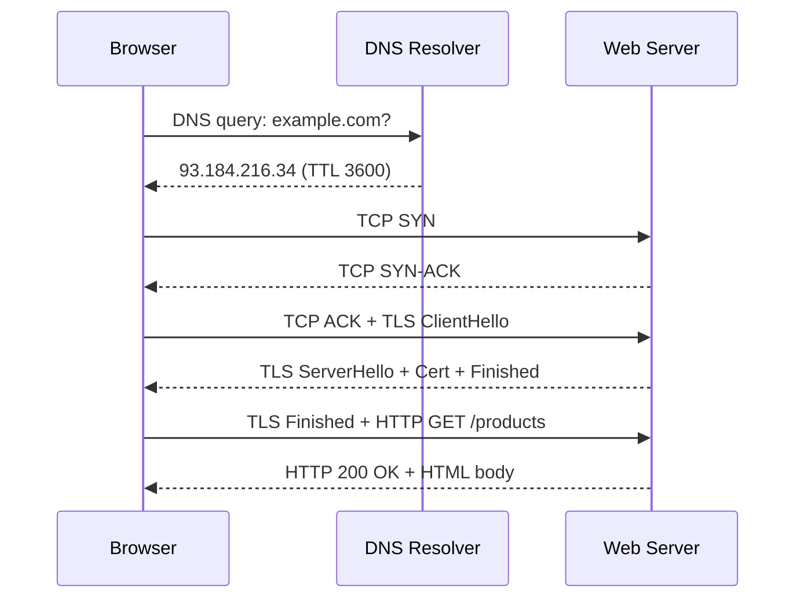

**⚡ TL;DR** - Typing a URL triggers a precise 7-step chain:
DNS resolution, TCP connection, TLS handshake, HTTP request,
server processing, HTTP response, and browser rendering.

| #002 | Category: Networking | Difficulty: ★☆☆ |
|:---|:---|:---|
| **Depends on:** | The Networking Problem - Why Networks Exist | |
| **Used by:** | OSI Model, IP Address, DNS Overview, TCP | |
| **Related:** | Client-Server Model, OSI Model - The Big Picture, TCP Three-Way Handshake, TLS Handshake Deep Dive | |

---

### 🔥 The Problem This Solves

**WORLD WITHOUT IT:**

This entry is not solving a problem - it is revealing a hidden
mechanism. Billions of people type URLs every day and receive
a web page in under a second. Almost none know what happens
in that second. When things break - a timeout, a DNS error, a
TLS handshake failure - engineers without this mental model
are blind. They see only "the website is down" and have no
idea where to look.

**THE BREAKING POINT:**

A web page load involves at minimum 5 separate protocols
(DNS, TCP, TLS, HTTP, HTML), 3 network round-trips before a
single byte of content arrives, and typically 50-200 separate
resource requests. When any layer fails, the failure symptom
at the browser is identical: the page does not load. Only
someone who can mentally trace the full chain can diagnose
where the failure occurred and fix it in minutes rather than
hours.

**THE INVENTION MOMENT:**

This sequence was not designed all at once - it evolved
organically from 1969 (TCP/IP) through 1991 (HTTP/HTML) to
1994 (SSL/TLS) to today. Each step exists because of a
specific engineering requirement. Understanding the "why" of
each step makes the chain memorable and the failure modes
predictable.

**EVOLUTION:**

HTTP/1.1 (1997): one request per TCP connection. HTTP/2
(2015): multiplexing, many requests over one connection.
HTTP/3 (2022): QUIC replaces TCP, eliminating head-of-line
blocking. Each evolution reduced the number of round-trips
before content arrives. In HTTP/3, 0-RTT resumption can
deliver content with zero round-trips for returning visitors.

---

### 📘 Textbook Definition

When a user enters a URL in a browser, the following sequence
occurs: (1) the browser parses the URL into scheme, host,
path, and query components; (2) DNS resolves the host to an
IP address; (3) a TCP connection is established to the server
IP and port; (4) if the scheme is HTTPS, a TLS handshake
negotiates an encrypted channel; (5) an HTTP request is sent;
(6) the server processes the request and returns an HTTP
response; (7) the browser renders the response body and
initiates additional requests for embedded resources (CSS,
JavaScript, images).

---

### ⏱️ Understand It in 30 Seconds

**One line:**
Typing a URL starts a chain: find the IP, connect, encrypt,
ask for the page, receive it, display it.

**One analogy:**

> Typing a URL is like calling a friend using only their
> name. Your phone (DNS) looks up their number (IP address).
> You dial (TCP handshake). You say "hello" in a secret code
> only they understand (TLS). You ask for what you want (HTTP
> request). They respond. You hear their answer (render page).
> Every step is required; skip any one and the call fails.

**One insight:**
The shocking reality is that before your browser downloads
a single byte of the HTML page, at least 3 network round-trips
have already occurred: one for DNS, one for TCP handshake,
one for TLS handshake. On a 100ms RTT connection, the page
cannot arrive in under 300ms no matter how fast the server is
- this is a physics constraint, not an engineering one.

---

### 🔩 First Principles Explanation

**CORE INVARIANTS:**

1. Machines communicate by IP address, not hostname. Humans
   use hostnames. A mapping system must bridge this gap (DNS).
2. TCP requires setup before data flows (SYN-SYN/ACK-ACK).
   This is the price of reliability guarantees.
3. Encryption requires a key exchange before data can be
   encrypted (TLS handshake). This adds latency unavoidably.

**DERIVED DESIGN:**

Given these invariants, every secure web request MUST have:
- At minimum 3 round-trips before content (DNS + TCP + TLS)
  in HTTP/1.1 with a cold start.
- HTTP/2 reduces TCP connections but does not reduce the
  initial 3-round-trip penalty.
- HTTP/3 with QUIC combines TCP + TLS into 1 round-trip,
  reducing cold start to 2 round-trips.
- TLS 1.3 session resumption with HTTP/3 0-RTT reduces
  returning visitor requests to 0 round-trips before data.

**THE TRADE-OFFS:**

**Gain:** Universal, secure, reliable access to any named
resource anywhere in the world, with no pre-configuration.

**Cost:** At minimum 3 network round-trips of overhead on
every cold connection. On high-latency networks (mobile, cross-
continental), this is 300-600ms before the first byte arrives.

**ESSENTIAL vs ACCIDENTAL COMPLEXITY:**

**Essential:** Address resolution (DNS), reliable delivery
(TCP or QUIC), encryption negotiation (TLS), content request/
response (HTTP) - these four steps are unavoidable given the
requirements of universal, named, secure resource access.

**Accidental:** HTTP/1.1's one-request-per-connection
constraint (solved by HTTP/2 multiplexing), TLS 1.2's 2-RTT
handshake (reduced to 1-RTT by TLS 1.3), DNS's separate
round-trip (solvable by DNS-over-HTTPS, HTTPS records) are
all accidental complexity that evolved from historical
constraints.

---

### 🧪 Thought Experiment

**SETUP:**
You type `https://example.com/products` in your browser.
Your DNS cache is cold (no cached answer). The server is
200ms RTT away. TLS 1.3 is used.

**WHAT HAPPENS WITHOUT THE CHAIN (hypothetical):**

If you could skip directly to "send HTTP request":
1. You have no IP address → cannot route the packet.
2. You have no TCP connection → no reliable stream.
3. You have no TLS session → all data is plaintext.
4. Request arrives as unintelligible bytes → server ignores.

**WHAT HAPPENS WITH THE CHAIN:**

- t=0ms: Browser parses URL. Checks DNS cache - miss.
- t=0ms: DNS query sent to resolver.
- t=200ms: DNS response arrives: 93.184.216.34.
- t=200ms: TCP SYN sent to port 443.
- t=400ms: TCP SYN-ACK received. TCP ACK sent.
- t=400ms: TLS ClientHello sent (piggybacked on TCP ACK).
- t=600ms: TLS ServerHello + Certificate received.
  TLS finished (TLS 1.3: 1-RTT handshake).
- t=600ms: HTTP GET /products sent.
- t=800ms: HTTP 200 OK + HTML body received.
- t=800ms: Browser begins rendering.

**THE INSIGHT:**
800ms to first paint on a 200ms-RTT network is the MINIMUM
regardless of server performance. Bringing your server closer
to the user (CDN, edge computing) is the single most effective
latency optimization because it shrinks RTT from 200ms to
5-10ms, reducing first paint from 800ms to ~40ms.

---

### 🧠 Mental Model / Analogy

> Think of a URL request like calling a restaurant for
> delivery. First you call directory assistance to get their
> number (DNS). Then you call them (TCP handshake). If it's a
> private channel, you agree on a secret code (TLS). Then you
> place your order (HTTP GET). The restaurant prepares your
> food (server processing). The delivery arrives (response).
> You eat (browser renders).

Mapping:
- "Directory assistance" → DNS resolver
- "Phone number" → IP address
- "Calling them" → TCP three-way handshake
- "Secret code for private order" → TLS handshake
- "Placing your order" → HTTP request (GET /path)
- "Restaurant preparing food" → server processing
- "Delivery" → HTTP response + body
- "You eating" → browser rendering the HTML

**Where this analogy breaks down:** A phone call is circuit-
switched (dedicated line for duration). TCP is packet-switched
(bytes share the network with other connections). Also, HTTP/2
is more like ordering multiple items in a single call and
receiving them in parallel - the restaurant starts preparing
each item independently.

---

### 📶 Gradual Depth - Five Levels

**Level 1 - What it is (anyone can understand):**
Typing a URL triggers a chain of automated steps: find the
server's address, connect to it, verify its identity, ask for
the page, and receive it back. This takes under 1 second for
a nearby server.

**Level 2 - How to use it (junior developer):**
As a developer, `curl -v https://example.com` shows each step
in real time: DNS lookup, TCP connect, TLS handshake, HTTP
request, response headers, response body. When building web
applications, this chain is why `localhost` is instant (DNS
and TCP are skipped) but production is slower.

**Level 3 - How it works (mid-level engineer):**
Each step has measurable timing. Chrome DevTools Network tab
shows: DNS, Initial Connection, SSL, Request, and Waiting
(TTFB - Time To First Byte) as separate columns. Slow DNS
causes slow "DNS" column. Slow server causes slow TTFB. A CDN
reduces the TLS + TCP columns by moving the server closer. A
browser cache skips DNS + TCP + TLS entirely for cached assets.

**Level 4 - Why it was designed this way (senior/staff):**
HTTP/1.1's sequential request model was a bottleneck: browsers
opened 6-8 TCP connections per domain to parallelize requests.
HTTP/2 replaced this with multiplexing: one TCP connection,
multiple parallel streams. But HTTP/2 has its own problem:
head-of-line blocking at the TCP level - a single lost packet
stalls all streams. HTTP/3 solves this by using QUIC (UDP-
based), where packet loss on one stream does not stall others.
Every generation of HTTP is solving one bottleneck created by
the previous generation's fix.

**Level 5 - Mastery (distinguished engineer):**
A distinguished engineer optimizes this chain at every layer:
use DNS prefetch (`<link rel="dns-prefetch">`) to start DNS
resolution before the browser needs it. Use HSTS preloading
to skip the initial HTTP redirect. Use QUIC 0-RTT to
eliminate round-trips for returning users. Understand that
every millisecond removed from TTFB requires either moving
the server closer (CDN) or reducing server processing time -
these are the only two levers. The "URL chain" is not just
interesting theory; it is a performance optimization framework.

---

### ⚙️ How It Works (Mechanism)

```
┌──────────────────────────────────────────────────┐
│      URL to Response: Detailed Timeline          │
├──────────────────────────────────────────────────┤
│                                                  │
│  1. PARSE URL                                    │
│     https://example.com:443/products?id=1        │
│     scheme=https, host=example.com, port=443     │
│     path=/products, query=id=1                   │
│           │                                      │
│  2. DNS RESOLUTION                               │
│     Check: browser cache → OS cache → resolver  │
│     Query: A record for example.com              │
│     Answer: 93.184.216.34 (TTL: 3600s)          │
│           │                                      │
│  3. TCP THREE-WAY HANDSHAKE                      │
│     Client → SYN → Server                        │
│     Client ← SYN-ACK ← Server                   │
│     Client → ACK → Server                        │
│     [Connection established - 1 RTT]             │
│           │                                      │
│  4. TLS HANDSHAKE (TLS 1.3)                      │
│     Client → ClientHello (ciphers, key share)    │
│     Client ← ServerHello + Cert + Finished       │
│     Client → Finished (application data)         │
│     [Encrypted channel - 1 RTT]                  │
│           │                                      │
│  5. HTTP REQUEST                                 │
│     GET /products?id=1 HTTP/1.1                  │
│     Host: example.com                            │
│     Accept: text/html                            │
│           │                                      │
│  6. SERVER PROCESSING                            │
│     Route → Controller → DB Query → Template    │
│           │                                      │
│  7. HTTP RESPONSE                                │
│     HTTP/1.1 200 OK                              │
│     Content-Type: text/html                      │
│     [body: HTML]                                 │
│           │                                      │
│  8. BROWSER RENDERING                            │
│     Parse HTML → Build DOM → Fetch sub-resources │
└──────────────────────────────────────────────────┘
```



**Performance breakdown (200ms RTT example):**

| Step | Duration | Cumulative |
|---|---|---|
| URL parse | ~0ms | 0ms |
| DNS (cold) | 200ms | 200ms |
| TCP handshake | 200ms | 400ms |
| TLS 1.3 handshake | 200ms | 600ms |
| HTTP request + TTFB | 200ms | 800ms |
| Content transfer | varies | 800ms+ |

On a 5ms RTT connection (CDN edge): first byte in ~20ms.
This is why CDN placement is the single highest-leverage
performance optimization in web development.

---

### 🔄 The Complete Picture - End-to-End Flow

```
┌──────────────────────────────────────────────────┐
│        Full URL Request: System Context          │
├──────────────────────────────────────────────────┤
│                                                  │
│  [User types URL]                                │
│        │                                         │
│  [Browser DNS cache]   ← cache hit = skip step 3 │
│        │                                         │
│  [Recursive DNS resolver] ← YOU ARE HERE         │
│        │                                         │
│  [Root NS → TLD NS → Auth NS]                    │
│        │                                         │
│  [Browser TCP+TLS to server IP]                  │
│        │                                         │
│  [Load Balancer]  → [App Server]  → [Database]  │
│        │                                         │
│  [HTTP Response]                                 │
│        │                                         │
│  [Browser renders HTML + fetches 50-200 assets] │
└──────────────────────────────────────────────────┘
```

**FAILURE PATH:**
DNS fail → `ERR_NAME_NOT_RESOLVED`. TCP fail (port closed) →
`ERR_CONNECTION_REFUSED`. TLS fail (cert mismatch) →
`ERR_CERT_AUTHORITY_INVALID`. HTTP 500 → server error page.

**WHAT CHANGES AT SCALE:**
At 10 million requests/second, step 2 (DNS) becomes a
critical bottleneck - DNS resolvers can be overwhelmed. CDNs
solve this by distributing IP resolution and caching responses
at 200+ edge locations. At this scale, DNS TTL management
becomes a deployment concern: too long and deployments are
slow to propagate, too short and DNS becomes a bottleneck.

---

### ⚠️ Common Misconceptions

| Misconception | Reality |
|---|---|
| HTTPS is "just HTTP with encryption" | HTTPS adds a full TLS handshake (1 RTT minimum), certificate validation, and ongoing encryption overhead. It is meaningfully different from HTTP in connection setup time. |
| DNS is instant | Cold DNS can take 10-200ms. Even "fast" DNS (Cloudflare 1.1.1.1) has network RTT overhead. DNS prefetch and caching matter enormously. |
| The browser fetches one file | A typical web page triggers 50-200 separate HTTP requests (HTML + CSS + JS + images + fonts + analytics). Each requires a connection. |
| Typing `www.` is the same as omitting it | `www.example.com` and `example.com` are different DNS names (unless explicitly configured as equivalent), can resolve to different IPs, and are different for cookie/CORS purposes. |
| HTTPS means the website is safe | HTTPS means the connection is encrypted. The website itself can still be malicious, contain malware, or serve phishing content. The padlock means privacy, not trustworthiness. |

---

### 🚨 Failure Modes & Diagnosis

**DNS Resolution Failure**

**Symptom:** `ERR_NAME_NOT_RESOLVED` in browser,
`Name or service not known` in curl, service cannot reach
other services by hostname.

**Root Cause:** DNS resolver unreachable, domain does not
exist, DNS record deleted or expired, firewall blocking
UDP/TCP port 53, `/etc/resolv.conf` misconfigured.

**Diagnostic Command / Tool:**
```bash
# Check if DNS works at all
dig @8.8.8.8 example.com A

# Check what resolver the system uses
cat /etc/resolv.conf

# Test if port 53 is blocked
nc -zvu 8.8.8.8 53 && echo "UDP 53 open"
```

**Fix:** Verify resolver is reachable. Check firewall rules
for UDP 53. Verify the domain has valid A records. If in a
container, check `/etc/resolv.conf` is not empty.

**Prevention:** Treat DNS as a separate health check from
HTTP. Monitor DNS resolution latency and failure rate.

---

**TLS Certificate Error**

**Symptom:** `ERR_CERT_AUTHORITY_INVALID` or `SSL_ERROR_RX_
RECORD_TOO_LONG` in browser. `curl: (60) SSL certificate
problem` in CLI tools.

**Root Cause:** Certificate expired, certificate issued by
an untrusted CA, hostname mismatch (connecting to IP instead
of hostname, or wrong domain), self-signed cert in production.

**Diagnostic Command / Tool:**
```bash
# Inspect certificate details
echo | openssl s_client -connect example.com:443 2>/dev/null \
  | openssl x509 -noout -dates -subject -issuer

# Check certificate expiry
curl -vI https://example.com 2>&1 | grep -A5 "SSL"
```

**Fix:** Renew expired certificates. Ensure hostname on cert
matches the hostname being used. Use Let's Encrypt for free
auto-renewing certificates.

**Prevention:** Monitor certificate expiry with 30-day and
7-day alerts. Use automated certificate management (cert-
manager in Kubernetes, ACM in AWS).

---

**Slow Time to First Byte (TTFB)**

**Symptom:** Chrome DevTools shows large "Waiting (TTFB)"
time. Users report "slow page load" even with fast internet.

**Root Cause:** Server processing too slow (DB query, cache
miss), server geographically far from user (high RTT), no CDN
for cacheable content, large initial response not gzip'd.

**Diagnostic Command / Tool:**
```bash
# Measure TTFB precisely
curl -o /dev/null -s -w \
  "DNS: %{time_namelookup}s\n\
TCP: %{time_connect}s\n\
TLS: %{time_appconnect}s\n\
TTFB: %{time_starttransfer}s\n\
Total: %{time_total}s\n" \
  https://example.com
```

**Fix:** Add CDN for static assets. Move database queries
to cached layer. Reduce server processing time. Add
compression (`gzip` or `brotli`).

**Prevention:** Set TTFB SLA (< 200ms for cacheable,
< 500ms for dynamic). Monitor with synthetic probes from
multiple regions.

---

### 🔗 Related Keywords

**Prerequisites (understand these first):**
- `The Networking Problem - Why Networks Exist` - the
  foundational motivation for the entire chain
- `Client-Server Model` - the architectural pattern behind
  the request-response exchange

**Builds On This (learn these next):**
- `DNS Overview` - deep understanding of the first step
  (hostname to IP resolution)
- `TCP Three-Way Handshake` - deep understanding of the
  connection setup step
- `TLS Handshake Deep Dive` - deep understanding of the
  encryption negotiation step
- `HTTP and HTTPS Basics` - deep understanding of the
  request-response protocol

**Alternatives / Comparisons:**
- `HTTP/3 and QUIC Protocol` - the modern evolution that
  eliminates the separate TCP handshake step

---

### 📌 Quick Reference Card

```
┌──────────────────────────────────────────────────────────┐
│ WHAT IT IS   │ The 7-step chain from URL to web page     │
├──────────────┼───────────────────────────────────────────┤
│ PROBLEM IT   │ Makes abstract "network request" concrete │
│ SOLVES       │ and diagnosable                           │
├──────────────┼───────────────────────────────────────────┤
│ KEY INSIGHT  │ 3 round-trips minimum before first byte   │
│              │ (DNS + TCP + TLS) - physics, not code     │
├──────────────┼───────────────────────────────────────────┤
│ USE WHEN     │ Debugging slow page loads or network      │
│              │ failures in web applications              │
├──────────────┼───────────────────────────────────────────┤
│ AVOID WHEN   │ (knowledge framework - always applicable) │
├──────────────┼───────────────────────────────────────────┤
│ ANTI-PATTERN │ Treating "website is slow" as one problem │
│              │ instead of tracing which step is slow     │
├──────────────┼───────────────────────────────────────────┤
│ TRADE-OFF    │ Security and reliability of each layer    │
│              │ vs extra round-trip latency per layer     │
├──────────────┼───────────────────────────────────────────┤
│ ONE-LINER    │ "Before the first byte arrives, 3 round-  │
│              │  trips of handshakes have already passed."│
├──────────────┼───────────────────────────────────────────┤
│ NEXT EXPLORE │ DNS → TCP Handshake → TLS Handshake       │
└──────────────────────────────────────────────────────────┘
```

**If you remember only 3 things:**
1. The 7 steps: DNS, TCP, TLS, HTTP request, server
   processing, HTTP response, browser render.
2. Three mandatory round-trips before content: DNS + TCP + TLS.
   CDN reduces RTT from 200ms to 5ms - single biggest perf win.
3. Each step fails differently: `ERR_NAME_NOT_RESOLVED` =
   DNS failure. `ERR_CONNECTION_REFUSED` = TCP failure.
   `ERR_CERT_*` = TLS failure. `5xx` = server failure.

**Interview one-liner:**
"When you type a URL, at minimum three round-trips happen
before any content arrives: DNS resolution, TCP three-way
handshake, and TLS negotiation. CDNs reduce latency by
shrinking RTT, not by making servers faster. HTTP/3 with QUIC
merges TCP and TLS into a single round-trip, and 0-RTT
resumption eliminates them entirely for returning visitors."

---

### 💎 Transferable Wisdom

**Reusable Engineering Principle:**
Every distributed system has a "cold start" penalty: the
cost of establishing shared state (identities, channels,
keys) before useful work can begin. This cost is unavoidable
but can be amortized through caching, pre-connection, and
session resumption.

**Where else this pattern appears:**
- **Database connections** - connection pool "warming" is the
  same problem: pay TCP + TLS + auth overhead once,
  then reuse the connection for thousands of queries
- **gRPC stub creation** - creating a gRPC channel involves
  the same DNS + TCP + TLS chain; reusing channels is
  critical for performance
- **OAuth token acquisition** - token exchange = extra round-
  trip; token caching solves the same problem as TLS session
  resumption

**Industry applications:**
- **E-commerce** - every 100ms reduction in TTFB increases
  conversion rate by ~1% (Amazon's famous finding). The URL
  chain is a revenue optimization problem at scale.
- **Mobile applications** - on 4G/5G with 80ms RTT, the
  3-RTT minimum is 240ms cold start. Offline-first
  architecture with background sync avoids this entirely.

---

### 💡 The Surprising Truth

The most visited websites in the world - Google, Facebook,
Netflix - do not use the standard URL chain you just learned.
They use protocols they designed themselves that run over
UDP, with custom congestion control, custom multiplexing, and
0-RTT resumption. Google invented QUIC specifically to
eliminate the 3-RTT cold start and HTTP/2 head-of-line
blocking. Netflix uses HTTPS for delivery but sits behind
custom-built edge routers that handle 15% of all North
American internet traffic. "What happens when you type a URL"
for these companies is a completely custom engineering stack
with teams of hundreds maintaining protocols the rest of the
industry eventually adopts as standards.

---

### ✅ Mastery Checklist

**You've mastered this when you can:**
1. **EXPLAIN** the 7-step URL-to-response chain to a
   non-technical stakeholder and correctly identify which
   step causes a specific error type they describe.
2. **DEBUG** a slow web page load by using `curl -w`
   timing output to identify whether slowness is in DNS,
   TCP, TLS, TTFB, or content transfer.
3. **DECIDE** which layer to optimize first for a web
   application with 800ms average page load times, given
   a breakdown of DNS (200ms), TCP (100ms), TLS (100ms),
   TTFB (300ms), content (100ms).
4. **BUILD** a mental model of how HTTP/3 changes the
   chain: which of the 7 steps are changed, merged, or
   eliminated compared to HTTP/1.1.
5. **EXTEND** the concept to explain why gRPC clients
   benefit from connection pooling using the same latency
   analysis applied to web browser connections.

---

### 🧠 Think About This Before We Continue

**Q1.** A webpage shows blank for 3 seconds, then instantly
loads everything at once. Using the URL chain as your
framework, which specific layer is most likely causing this
behavior? What is your reasoning? What command would you run
first to confirm?

*Hint: Think about which step causes a delay where nothing
can load until it completes - not a step that just makes
individual resources slow.*

**Q2.** Google serves 8.5 billion searches per day. If
each search involves the full URL chain including DNS
resolution, the DNS system would receive 8.5 billion lookups
per day to Google's servers alone. How does this actually
work without DNS infrastructure collapsing? What mechanisms
allow this scale?

*Hint: Consider where DNS answers are cached and for how
long - at browser level, OS level, resolver level - and what
the aggregate query reduction factor is.*

**Q3.** [Hands-On] Open Chrome DevTools Network tab, check
"Disable cache", and navigate to a website you use daily.
Look at the first HTML document's timing breakdown. Now
navigate to the same URL again (without disabling cache).
Compare the timing. Which steps were skipped? Which steps
still occur even with a cache hit? What does this tell you
about what the browser caches vs what it always redoes?

*Hint: Pay attention to whether DNS, TCP, and TLS are still
present in the waterfall on the second load. What does
"cache hit" actually mean - which layer's cache?*

---

### 🎯 Interview Deep-Dive

**Q1: Walk me through exactly what happens when you type
`https://example.com` in a browser. I want every layer.**

*Why they ask:* Classic networking fundamentals question.
Tests whether the candidate has a complete, layered mental
model or just surface knowledge.

*Strong answer includes:*
- URL parsing (scheme, host, port, path)
- DNS resolution with cache hierarchy (browser → OS → ISP)
- TCP three-way handshake (SYN, SYN-ACK, ACK)
- TLS handshake with certificate validation
- HTTP request with all relevant headers (Host, Accept)
- Server processing at application layer
- Response received and browser rendering triggered
- Mention sub-resource loading cascade

**Q2: A production deployment just went live and users are
reporting the site is slow. Your monitoring shows no server
errors. How do you systematically identify the bottleneck?**

*Why they ask:* Tests ability to use the URL chain as a
diagnostic framework rather than just theoretical knowledge.

*Strong answer includes:*
- Use `curl -w` timing to measure each phase
- Compare DNS resolution time (should be < 50ms with caching)
- Compare TTFB from CDN edge vs origin server
- Check if slowness is in DNS (resolver issue), TCP
  (routing/congestion), TLS (certificate validation),
  or TTFB (server processing)
- Check browser synthetic monitoring for geographic variation

**Q3: How does HTTP/2 improve on HTTP/1.1, and what problem
does HTTP/3 solve that HTTP/2 could not?**

*Why they ask:* Tests depth of protocol knowledge and ability
to reason about protocol evolution trade-offs.

*Strong answer includes:*
- HTTP/1.1: one request per connection → browsers open 6-8
  connections per domain as workaround
- HTTP/2: multiplexing many streams over one TCP connection,
  removing need for connection proliferation
- HTTP/2 problem: TCP head-of-line blocking - one lost
  packet stalls all streams on that TCP connection
- HTTP/3: QUIC (UDP-based) gives independent streams - lost
  packet only stalls that stream, not others
- HTTP/3 also merges TCP + TLS into 1-RTT (vs 2-RTT for
  HTTP/2), reducing cold start latency