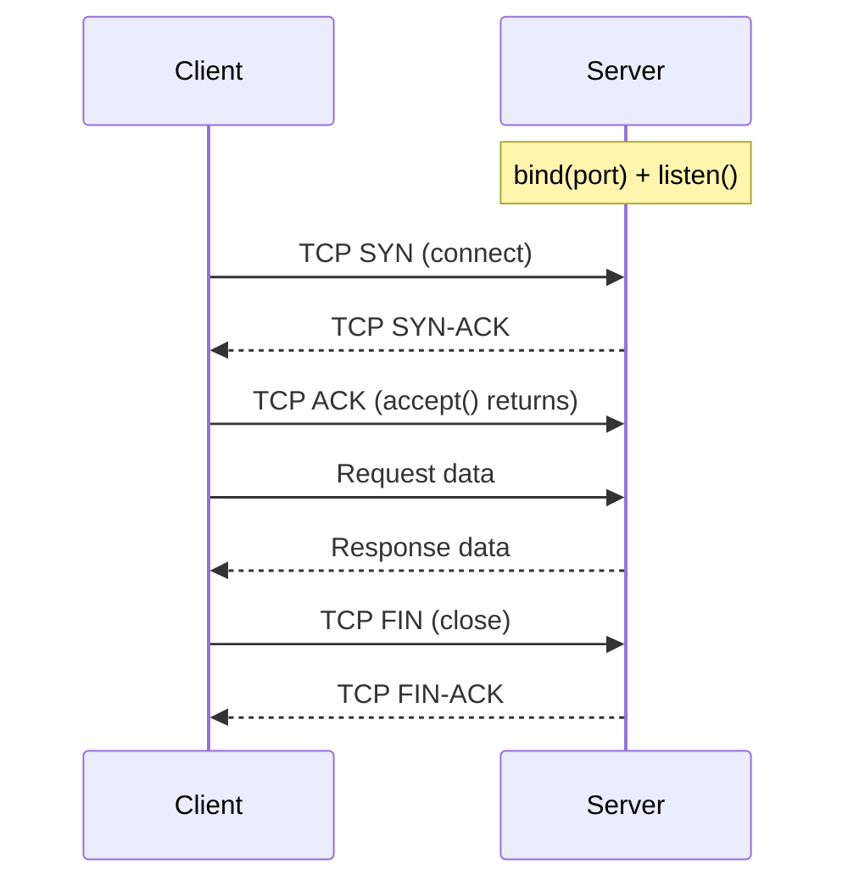

**⚡ TL;DR** - The client-server model splits networked
communication into two roles: clients that initiate requests,
and servers that listen and respond - the architectural
backbone of the entire internet.

| #003 | Category: Networking | Difficulty: ★☆☆ |
|:---|:---|:---|
| **Depends on:** | The Networking Problem - Why Networks Exist | |
| **Used by:** | TCP, Socket Programming Basics, HTTP and HTTPS Basics, Load Balancer Basics | |
| **Related:** | What Happens When You Type a URL, Packets vs Streams Mental Model | |

---

### 🔥 The Problem This Solves

**WORLD WITHOUT IT:**

Before the client-server model, computing was dominated by
the "mainframe" model: one central machine that all users
shared by connecting terminals. Terminals were dumb - they
displayed output and sent keystrokes, but all computation
happened on the mainframe. This worked for text-based
applications but collapsed when applications needed to run
locally and share data centrally.

**THE BREAKING POINT:**

In the late 1970s, personal computers arrived. Each PC could
compute independently. But they still needed to share
resources: printers, storage, databases. The mainframe model
required expensive, centralized hardware for all computation.
The peer-to-peer model (everyone talks to everyone) did not
scale past small groups. Something in between was needed.

**THE INVENTION MOMENT:**

This is exactly why the client-server model was formalized.
A "server" is a process that waits for requests. A "client"
is a process that initiates them. The server provides a
shared resource (database, file, computation). Clients access
it independently. The model emerged gradually through the
1980s as networked file systems, email servers, and databases
adopted it, and was cemented by the web's HTTP protocol in
1991.

**EVOLUTION:**

Mainframe era (1960s): centralized, dumb terminals.
Client-server era (1980s-2000s): distributed clients,
centralized servers. Three-tier era (1990s-2010s): client,
application server, database server - separating presentation,
logic, and data. Microservices era (2010s-present): many
servers, each serving others, blurring the client/server
distinction. Today every microservice is simultaneously a
client (calling other services) and a server (serving its
own API).

---

### 📘 Textbook Definition

The **client-server model** is a distributed computing
architecture in which tasks are split between service
providers (servers) and service requesters (clients). A
server is a process that listens on a well-known address for
incoming requests, processes them, and returns responses. A
client is a process that initiates requests to a server's
address and waits for responses. Communication is
asymmetric: clients initiate, servers respond. A single
machine can run both client and server processes simultaneously.

---

### ⏱️ Understand It in 30 Seconds

**One line:**
A client asks, a server answers - one side initiates,
the other side waits.

**One analogy:**

> A client-server model is like a restaurant. You (the
> client) walk in, sit down, and place an order. The kitchen
> (the server) waits for orders, prepares food when an order
> arrives, and sends it back. The kitchen never calls you at
> home to offer food - it only responds when you ask.

**One insight:**
The client-server model's most important property is the
asymmetry: clients initiate, servers wait. This determines
everything about networking: who opens the TCP connection,
who listens on a port, who has a well-known address (server)
and who does not need one (client). Understanding this
asymmetry explains every firewall rule, every load balancer
design, and every API architecture decision.

---

### 🔩 First Principles Explanation

**CORE INVARIANTS:**

1. Communication requires one party to be "reachable" (have
   a known address and be listening) and one party to be
   the "initiator" (know the address and send the first
   message).
2. A server must be able to handle multiple clients
   concurrently without dedicating infinite resources to each.
3. The server's availability is a shared dependency for all
   clients - its failure affects everyone simultaneously.

**DERIVED DESIGN:**

From invariant 1: servers bind to a well-known port (80, 443,
5432) and call `accept()` in a loop. Clients call `connect()`
with the server's IP and port. The OS creates a new socket
for each accepted connection.

From invariant 2: servers use one of three patterns: one
process per connection (Apache prefork), one thread per
connection (early Java servers), or non-blocking I/O with
event loops (Nginx, Node.js). Each is a different trade-off
between isolation and resource efficiency.

From invariant 3: servers become single points of failure
unless made redundant. Load balancers and clustering exist
to solve this invariant's consequence.

**THE TRADE-OFFS:**

**Gain:** Centralized resource sharing. Many clients can
share one server's data without copying it. Changes to data
are immediately visible to all clients.

**Cost:** The server is a bottleneck and a single point of
failure. Client capacity scales infinitely; server capacity
must be explicitly provisioned. Network latency is added to
every operation that was previously in-memory.

**ESSENTIAL vs ACCIDENTAL COMPLEXITY:**

**Essential:** Asymmetric communication (one initiates, one
waits), concurrency handling, and availability are inherently
hard. No design eliminates these.

**Accidental:** HTTP's stateless request-response protocol
(sessions must be managed separately), the impedance mismatch
between client-side and server-side state, and complex
session management are all artifacts of how HTTP was designed
in 1991, not fundamental requirements.

---

### 🧪 Thought Experiment

**SETUP:**
You have 10 desktop computers in an office. Each needs to
print documents. One laser printer is connected to Computer 1.

**WHAT HAPPENS WITHOUT CLIENT-SERVER:**

Without a server model, each computer must have a physical
connection to the printer (impossible with one printer port)
or computers must pass print jobs to Computer 1 directly
(peer-to-peer coupling). Computer 1 must be running and
reachable for anyone to print. There is no queue management.

**WHAT HAPPENS WITH CLIENT-SERVER:**

Computer 1 runs a print server process that listens for
connections. Computers 2-10 are print clients. Each sends
a print job to the server's IP and port. The server queues
and processes jobs. Computer 1 can be optimized for serving
without users needing it for anything else.

**THE INSIGHT:**
The client-server model converts a physical resource (one
printer) into a shared network service with queuing,
access control, and monitoring - without changing the
printer hardware. "Serviceification" is the fundamental
idea: make any resource accessible over a network interface.

---

### 🧠 Mental Model / Analogy

> The client-server model is like a bank with tellers. The
> bank (server) is at a fixed address, open during certain
> hours (listening on a port), with tellers (worker threads)
> ready to serve. Customers (clients) come to the bank, join
> a queue, and each gets served by a teller. The bank does
> not visit customers - customers come to the bank.

Mapping:
- "Bank at a fixed address" → server bound to a port
- "Bank's opening hours" → server's `listen()` state
- "Teller" → worker thread or process per connection
- "Customer queue" → OS accept queue (backlog parameter)
- "Customer goes to bank" → client calls `connect()`
- "Transaction" → request-response exchange
- "Bank closes" → server crashes (all pending transactions lost)

**Where this analogy breaks down:** A bank handles one
customer per teller at a time. Modern servers use async I/O
to handle thousands of "customers" per teller (thread),
because most request time is spent waiting for I/O (DB,
disk), not computing. The bank analogy does not capture this
non-blocking model.

---

### 📶 Gradual Depth - Five Levels

**Level 1 - What it is (anyone can understand):**
In a client-server model, one computer (the server) waits for
requests, and other computers (clients) send them. Your web
browser is a client; the computer hosting Google's website
is a server.

**Level 2 - How to use it (junior developer):**
When you write a REST API with Spring Boot or Express.js, you
are writing a server. Your API endpoints bind to a port. When
a mobile app or another service calls your API, it is acting
as a client. You almost never need to write raw socket code -
frameworks handle the `listen()` and `accept()` loop for you.

**Level 3 - How it works (mid-level engineer):**
At the TCP level, a server calls `socket()`, `bind()` (to a
port), `listen()` (set backlog queue size), then `accept()`
in a loop. Each `accept()` creates a new socket for that
specific client connection. The server must handle multiple
connections concurrently: pre-forking processes (Apache),
thread-per-connection (early Tomcat), or non-blocking event
loop (Nginx). The choice between these determines max
concurrent connections at a given memory budget.

**Level 4 - Why it was designed this way (senior/staff):**
The model's fundamental asymmetry (client initiates) has deep
consequences. It means NAT (Network Address Translation)
works for clients without modification - clients behind a
home router can reach servers because they always initiate.
Servers behind NAT are impossible without port forwarding
because external clients cannot initiate connections to an
unknown private address. WebSockets, gRPC streaming, and
reverse tunnels (ngrok) all exist to work around this
limitation when a "server" needs to push to a "client."

**Level 5 - Mastery (distinguished engineer):**
The client-server model is not a binary state. In
microservices, every service is simultaneously a server (for
its API callers) and a client (for databases and downstream
services). Service mesh (Istio, Linkerd) exists because the
"client" and "server" roles are reversed depending on
perspective. gRPC bidirectional streaming blurs the
distinction entirely - both sides can initiate messages.
A distributed system architect asks: "For this communication
pattern, which side should initiate? The answer determines
who needs a stable address, who handles connection failures,
and who implements retry logic."

---

### ⚙️ How It Works (Mechanism)

```
┌──────────────────────────────────────────────────┐
│       Client-Server TCP Socket Lifecycle         │
├──────────────────────────────────────────────────┤
│                                                  │
│  SERVER SIDE           CLIENT SIDE               │
│                                                  │
│  socket()              (later)                   │
│     │                                            │
│  bind(port 8080)                                 │
│     │                                            │
│  listen(backlog=128)                             │
│     │                                            │
│  ┌─ accept() ─────────────────────────────────┐  │
│  │  (blocks until client connects)            │  │
│  │                      socket()              │  │
│  │                      connect(IP, 8080)     │  │
│  │  ←── TCP SYN ──────────────────────────── │  │
│  │  ──── SYN-ACK ──────────────────────────→ │  │
│  │  ←── ACK ──────────────────────────────── │  │
│  │  accept() returns new_sock                 │  │
│  │                                            │  │
│  │  read(new_sock)  ←── request ──────────── │  │
│  │  write(new_sock) ──── response ─────────→ │  │
│  │  close(new_sock)                           │  │
│  └────────────────────────────────────────────┘  │
│  (loop: accept next client)                      │
└──────────────────────────────────────────────────┘
```



**Concurrency models compared:**

| Model | Connections | Memory | Isolation | Used By |
|---|---|---|---|---|
| Process per conn | Low (1000s) | High (MB each) | Full | PostgreSQL |
| Thread per conn | Medium (10Ks) | Medium (MB each) | Good | Tomcat |
| Async event loop | Very high (100Ks) | Low (shared) | None | Nginx, Node.js |
| Async + thread pool | High (100Ks) | Low-medium | Partial | Go, modern Java |

The Linux kernel's socket backlog queue deserves attention:
`listen(socket, 128)` means a maximum of 128 connections can
be queued waiting to be `accept()`ed. Under a SYN flood
attack, this queue fills and legitimate connections are
refused. This is the basis of a SYN flood DDoS attack.

---

### 🔄 The Complete Picture - End-to-End Flow

```
┌──────────────────────────────────────────────────┐
│     Three-Tier Client-Server (Web App)           │
├──────────────────────────────────────────────────┤
│                                                  │
│  Browser (Client)                                │
│     │ HTTP GET /api/users                        │
│     ↓                                            │
│  Load Balancer          ← routes to healthy node │
│     │                                            │
│  App Server (Server to browser, Client to DB)    │
│  ← YOU ARE HERE ──────────────────────────────── │
│     │ SELECT * FROM users                        │
│     ↓                                            │
│  Database (Server to app, Client to nothing)     │
│     │ Returns rows                               │
│     ↑                                            │
│  App Server returns JSON response                │
│     ↑                                            │
│  Load Balancer forwards response                 │
│     ↑                                            │
│  Browser renders response                        │
└──────────────────────────────────────────────────┘
```

**FAILURE PATH:**
Server crash → clients get `Connection refused` (port no
longer accepting). Server overloaded → new connections fail
with `Connection timed out` (accept backlog full). Network
partition → clients get `Connection timed out` indefinitely.

**WHAT CHANGES AT SCALE:**
At 100,000 concurrent connections, thread-per-connection
models exhaust memory. Event-loop models handle this but
require careful non-blocking code. At 1 million connections,
the server itself becomes a bottleneck - horizontal scaling
(multiple servers behind a load balancer) replaces vertical
scaling. The client-server model becomes client → LB →
server cluster → database.

---

### ⚖️ Comparison Table

| Architecture | Scalability | Complexity | Centralization | Best For |
|---|---|---|---|---|
| **Client-Server** | Server is bottleneck | Low | High | CRUD apps, APIs |
| Peer-to-Peer (P2P) | Scales with nodes | High | None | File sharing, blockchains |
| Mainframe+Terminals | Server only scales | Low | Total | Legacy enterprise |
| Microservices | Each service scales | Very high | Distributed | Large-scale platforms |

How to choose: Client-server is the right default for 95% of
web applications. Peer-to-peer is only needed when true
decentralization is required (censorship resistance, no
central authority). Microservices add complexity only justified
by organizational scale or independent scaling requirements.

---

### ⚠️ Common Misconceptions

| Misconception | Reality |
|---|---|
| A server needs dedicated server hardware | Any computer can run server software. Your laptop can be a server. The distinction is software role, not hardware. |
| Clients cannot be servers | Every microservice is a server to its callers and a client to services it calls. The distinction is per-connection, not per-machine. |
| Client-server is outdated (microservices replaced it) | Microservices IS client-server. Each microservice exposes an HTTP/gRPC API (server role) and calls other services (client role). The pattern persists - only scale changed. |
| Servers must be stateless | Many server designs maintain state (session state, in-memory cache, websocket connections). "Stateless servers" is a design choice for horizontal scalability, not an inherent property. |

---

### 🚨 Failure Modes & Diagnosis

**Server Overload - Accept Queue Full**

**Symptom:** New connections time out even though the server
appears running. Existing connections work fine. Error: `connect() timed out`.

**Root Cause:** The OS TCP accept backlog queue is full.
The server's `accept()` loop cannot consume connections as
fast as clients are creating them. New SYNs are silently
dropped (Linux default) or RST is sent.

**Diagnostic Command / Tool:**
```bash
# Check current connection states on server
ss -s
# Output shows: listen, established, time_wait counts

# Check if backlog is full
ss -lnt | grep :8080
# LISTEN column shows queue size
# "0 128/128" means queue is full

# Check SYN drops
cat /proc/net/netstat | grep ListenDrops
```

**Fix:**
```bash
# Increase backlog on Linux
sysctl -w net.core.somaxconn=65535

# In application code (Java example):
# BAD: ServerSocket(8080)  - uses default backlog
new ServerSocket(8080, 1024)  # GOOD: explicit backlog
```

**Prevention:** Monitor `ListenDrops` counter. Set backlog
to at least 1024 for production servers. Add horizontal
scaling before the queue fills.

---

**Server Is Single Point of Failure**

**Symptom:** 100% of clients lose access simultaneously when
the server host fails. No graceful degradation.

**Root Cause:** Only one server instance exists. No
redundancy.

**Diagnostic Command / Tool:**
```bash
# Test if any server is reachable
for ip in 10.0.0.1 10.0.0.2; do
  nc -zv $ip 8080 && echo "$ip OK" || echo "$ip FAIL"
done
```

**Fix:** Add a second server instance and a load balancer.
Use health checks to automatically remove failed instances.

**Prevention:** Never run a single instance of any stateful
service in production. Minimum is active-passive failover;
prefer active-active with load balancing.

---

### 🔗 Related Keywords

**Prerequisites (understand these first):**
- `The Networking Problem - Why Networks Exist` - why
  inter-machine communication is needed at all

**Builds On This (learn these next):**
- `TCP (Transmission Control Protocol)` - the transport
  protocol that implements client-server connections
- `Socket Programming Basics` - the API for implementing
  client-server communication
- `Load Balancer Basics` - adds redundancy and horizontal
  scalability to the server side
- `HTTP and HTTPS Basics` - the application protocol built
  on the client-server model

**Alternatives / Comparisons:**
- `gRPC and Protocol Buffers` - client-server pattern with
  a structured IDL, binary protocol, and streaming support

---

### 📌 Quick Reference Card

```
┌──────────────────────────────────────────────────────────┐
│ WHAT IT IS   │ Clients initiate; servers wait and respond │
├──────────────┼───────────────────────────────────────────┤
│ PROBLEM IT   │ Sharing resources across isolated machines │
│ SOLVES       │ without copying data to every client       │
├──────────────┼───────────────────────────────────────────┤
│ KEY INSIGHT  │ The asymmetry (client initiates) determines│
│              │ every firewall rule and LB design          │
├──────────────┼───────────────────────────────────────────┤
│ USE WHEN     │ Sharing a resource (DB, API, file) across  │
│              │ multiple clients                           │
├──────────────┼───────────────────────────────────────────┤
│ AVOID WHEN   │ True decentralization required (P2P is     │
│              │ better when no central authority is wanted)│
├──────────────┼───────────────────────────────────────────┤
│ ANTI-PATTERN │ Single server instance in production -     │
│              │ always add redundancy                      │
├──────────────┼───────────────────────────────────────────┤
│ TRADE-OFF    │ Shared centralized resource vs single      │
│              │ point of failure and network latency       │
├──────────────┼───────────────────────────────────────────┤
│ ONE-LINER    │ "The server waits. The client asks.        │
│              │  Everything else is detail."               │
├──────────────┼───────────────────────────────────────────┤
│ NEXT EXPLORE │ TCP → Socket Programming → Load Balancer   │
└──────────────────────────────────────────────────────────┘
```

**If you remember only 3 things:**
1. Client initiates, server waits. The server must have a
   known address and open port; the client needs neither.
2. Every microservice is simultaneously a client (calling
   others) and a server (serving its API). The model is
   directional, not machine-level.
3. The server's TCP accept backlog is a real bottleneck under
   load - monitor `ListenDrops` and tune backlog size.

**Interview one-liner:**
"The client-server model is asymmetric: clients initiate
connections to servers listening at known addresses. This
asymmetry drives everything: why NAT works for clients but
not servers, why load balancers sit in front of servers not
clients, and why in microservices every service is both a
server to its callers and a client to its dependencies."

---

### 💎 Transferable Wisdom

**Reusable Engineering Principle:**
Any shared resource that needs to serve multiple consumers
independently becomes a "server" - whether it is a computer,
a database, a message queue, or a restaurant kitchen. The
pattern of "provider listens, consumer initiates" is universal
in distributed systems.

**Where else this pattern appears:**
- **Database connection pools** - the database is always a
  server; application nodes are clients. Even within a
  process, the thread pool is the "server" and HTTP handlers
  are "clients"
- **Message queues** - Kafka brokers are servers; producers
  and consumers are clients. This explains why partition
  leadership reassignment (server-side change) affects all
  producers and consumers simultaneously
- **DNS** - the DNS resolver is a server; every application
  making a DNS lookup is a client. DNS failure is the
  ultimate demonstration of the server-SPOF problem

**Industry applications:**
- **Banking** - transaction processing servers (OLTP) are
  the canonical client-server system: teller terminals
  (clients) connect to a central database (server). Every
  bank failure in history involved the server side going down.
- **Gaming** - game servers are authoritative servers; game
  clients submit actions and receive game state. Latency
  between client and server is the definition of "ping" and
  the primary driver of competitive gaming server placement.

---

### 💡 The Surprising Truth

The client-server model was not the obvious design choice.
ARPANET's original design treated all nodes as equals - peers
that could both initiate and accept connections (true peer-
to-peer). The shift to a dedicated "server" model happened
because running a service 24/7 on dedicated hardware was more
reliable and economical than asking every user's personal
computer to be available. The web's explosion in the 1990s
cemented the client-server model as the internet's dominant
pattern. But the original peer-to-peer vision never died -
BitTorrent, Napster, Bitcoin, and WebRTC all implement the
original ARPANET idea of equal peers, and every decade these
technologies create new disruptions because they remove the
server's power as a gatekeeper.

---

### ✅ Mastery Checklist

**You've mastered this when you can:**
1. **EXPLAIN** to a business stakeholder why their mobile
   app cannot work if the server goes down, and why making
   the server highly available requires running multiple
   instances behind a load balancer.
2. **DEBUG** a "connection refused" error by identifying
   whether the server is not running, not listening on the
   expected port, or blocked by a firewall.
3. **DECIDE** between thread-per-connection and async event
   loop models for a server that needs to handle 50,000
   concurrent long-lived WebSocket connections.
4. **BUILD** a minimal TCP server in Python or Java using
   raw socket APIs: `socket()`, `bind()`, `listen()`,
   `accept()`, `read()`/`write()`, `close()`.
5. **EXTEND** the model to explain why serverless functions
   (AWS Lambda) are still client-server: the Lambda function
   is the server, the event trigger is the client, and
   AWS's infrastructure handles the accept loop.

---

### 🧠 Think About This Before We Continue

**Q1.** WebSockets are built on HTTP (a client-server
protocol). Yet in a WebSocket connection, the server can
send messages to the client at any time - which seems to
violate the "client initiates" rule. How does WebSocket
reconcile this? At what moment does the connection switch
from client-server to bidirectional? What does this reveal
about the scope of the "client initiates" invariant?

*Hint: Trace the exact TCP and HTTP handshake that upgrades
a connection to WebSocket, and identify at which step the
initiation asymmetry is established and how it is then
bypassed.*

**Q2.** A microservice has 10 instances behind a load
balancer. Each instance maintains 200 database connections.
The database server has a `max_connections = 500` limit.
At what point does this architecture break, and what is the
exact failure mode? How would you redesign it?

*Hint: Calculate total connections as you scale instances,
then consider what mechanism could sit between the app
servers and the database to limit connections.*

**Q3.** [Hands-On] Open two terminals. In terminal 1, run
`python3 -m http.server 8080` (a simple HTTP server). In
terminal 2, run `curl http://localhost:8080`. Now run
`ss -tnp | grep 8080` in a third terminal. What do you
see? What does each column mean? Stop the server and run
the command again. What changed and why?

*Hint: Pay attention to the LOCAL and PEER address columns
and the connection states. What does ESTABLISHED vs LISTEN
mean for each side?*

---

### 🎯 Interview Deep-Dive

**Q1: What is the difference between a client and a server,
and why does this distinction matter for firewall rules?**

*Why they ask:* Tests understanding of the fundamental
network asymmetry and practical security implications.

*Strong answer includes:*
- Server binds to a well-known port and calls `listen()` +
  `accept()`; client calls `connect()` to that address
- Firewalls allow client → server direction (outbound) by
  default; server → client direction (inbound) requires
  explicit rules
- This is why you need to open port 443 for HTTPS servers
  but clients can reach the internet without firewall changes
- NAT (home routers) allows client traffic outbound but
  blocks unsolicited inbound connections to servers

**Q2: In a microservices architecture where Service A calls
Service B, which is the client and which is the server?
What happens to the client-server model when you add a
message queue between them?**

*Why they ask:* Tests ability to apply the model to modern
architectures and reason about indirect communication.

*Strong answer includes:*
- A is client, B is server - A initiates, B listens
- With a message queue: A is client of the queue (producer),
  B is client of the queue (consumer). The queue is now the
  server for both
- This inversion (B becomes a client instead of a server)
  is the key benefit of event-driven architecture: B no
  longer needs to be reachable when A sends a message
- Failure modes change: queue becomes the new SPOF; B can
  be down during message send without A knowing