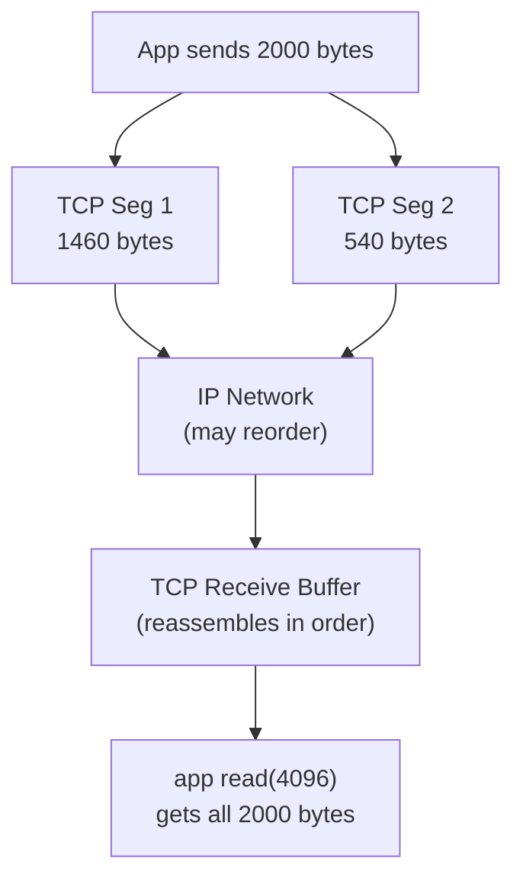

**⚡ TL;DR** - All network data is physically sent as
discrete packets; some protocols (TCP) reassemble packets
into a continuous stream for applications, while others (UDP)
expose raw packets directly.

| #004 | Category: Networking | Difficulty: ★☆☆ |
|:---|:---|:---|
| **Depends on:** | The Networking Problem - Why Networks Exist, Client-Server Model | |
| **Used by:** | OSI Model, Packet Structure, TCP, UDP | |
| **Related:** | OSI Model - The Big Picture, TCP Three-Way Handshake | |

---

### 🔥 The Problem This Solves

**WORLD WITHOUT IT:**

Without understanding the packet/stream distinction,
developers write code with a fundamental assumption: "if I
call `write(socket, data, len)`, the other side will receive
exactly `len` bytes in one `read()` call." This assumption
is wrong for TCP and catastrophically wrong for UDP. Bugs
from this misconception are among the most common and
hardest-to-reproduce networking bugs - they appear
intermittently because they only manifest when the network
fragments data differently than expected.

**THE BREAKING POINT:**

A developer writes a protocol: send a 1000-byte message.
The receiver reads 1000 bytes. Works perfectly in testing
on a local machine. In production on a WAN link, the TCP
stack decides to split the 1000 bytes into two segments of
700 and 300 bytes. The receiver calls `read(1000)` and gets
only 700 bytes. The application hangs waiting for the other
300 bytes that are in a second TCP segment, and the sender
has already moved on expecting a response. Deadlock.

**THE INVENTION MOMENT:**

This is not a problem that was "invented" - it is a physical
reality. Networks are packet-switched: all data is divided
into discrete chunks (packets) for transmission. TCP was
designed to hide this reality by reassembling packets into
a byte stream. But the abstraction is "leaky": the stream
boundaries are arbitrary, and application code must handle
incomplete reads.

**EVOLUTION:**

Original ARPANET used fixed-size packets. IP standardized
variable-size packets (up to MTU, typically 1500 bytes).
TCP's streaming abstraction was designed to hide IP's packet
nature from applications. The "message boundary" problem
(knowing where one message ends and the next begins) is the
eternal consequence: every TCP protocol must solve it
independently. HTTP solved it with `Content-Length` headers
and chunked transfer encoding.

---

### 📘 Textbook Definition

**Packets** are discrete, self-contained units of data with
headers containing addressing and routing information,
transmitted individually across a network. There is no
guaranteed correspondence between packet boundaries and
application message boundaries. **Streams** are continuous
sequences of bytes where the sender and receiver share no
concept of "message" - data flows as an ordered byte river.
TCP exposes a stream abstraction on top of IP's packet
delivery, guaranteeing order and delivery while hiding packet
boundaries from the application. UDP exposes packets
directly, preserving message boundaries but providing no
ordering or reliability guarantees.

---

### ⏱️ Understand It in 30 Seconds

**One line:**
The network sends chunks (packets); TCP pretends it's a
river (stream); UDP sends you the raw chunks.

**One analogy:**

> Sending data over TCP is like sending a book by mail, but
> the postal service tears each page into envelope-sized
> pieces and reassembles them in order for you. You receive
> the book, and it reads continuously - you never see the
> individual envelopes. UDP is like the postal service
> handing you the envelopes directly: you get them, maybe
> out of order, maybe with some missing, and you must
> reassemble the book yourself.

**One insight:**
The most dangerous misconception in network programming is
that "one `send()` = one `recv()`." TCP is a byte stream: a
single `send(1000_bytes)` can result in two `recv()` calls
of 700 and 300 bytes on the other side. Every TCP protocol
must implement message framing (knowing where messages begin
and end) because TCP itself does not provide it.

---

### 🔩 First Principles Explanation

**CORE INVARIANTS:**

1. Physical networks transmit discrete units (frames/packets).
   There is no such thing as a physical "stream of bytes."
2. TCP reassembles packets into an in-order byte stream but
   cannot guarantee how the stream is divided across
   individual `read()` calls.
3. UDP delivers packets as-is: message boundaries are
   preserved (one `sendto()` = one `recvfrom()`), but there
   is no ordering or delivery guarantee.

**DERIVED DESIGN:**

TCP's stream model means: the reader must implement a
protocol boundary mechanism. Three common approaches:

1. **Fixed length**: every message is exactly N bytes.
   Simple, inefficient for variable data.
2. **Length prefix**: prepend a 4-byte integer with message
   length. Read exactly that many bytes after.
3. **Delimiter**: use a special byte sequence (e.g., `\r\n`
   in HTTP, `\0` in C strings) to mark message ends.
   Requires escaping if delimiter appears in data.

HTTP uses approach 3 (header delimiter: `\r\n\r\n`) and
approach 2 (body: `Content-Length`).

**THE TRADE-OFFS:**

**TCP streams:**
- Gain: ordered, reliable delivery; application just reads
  bytes without worrying about retransmission
- Cost: no message boundaries; application must implement
  framing; TCP head-of-line blocking in HTTP/2

**UDP packets:**
- Gain: message boundaries preserved; lower overhead; no
  head-of-line blocking
- Cost: no ordering, no delivery guarantee; application
  must handle loss, reordering, duplication

**ESSENTIAL vs ACCIDENTAL COMPLEXITY:**

**Essential:** The packet/stream mismatch is fundamental.
No transport protocol can provide both guaranteed ordered
delivery AND zero head-of-line blocking simultaneously.
QUIC (HTTP/3) works around this by providing per-stream
ordering within a single UDP connection, but even QUIC
makes trade-offs.

**Accidental:** TCP's rigid coupling of reliability,
ordering, and congestion control into one monolithic
abstraction means you cannot have reliability without
ordering or ordering without congestion control. QUIC
decouples these by building on UDP.

---

### 🧪 Thought Experiment

**SETUP:**
You write a simple TCP chat application. You send "Hello"
then immediately send "World" from the sender.

**WHAT HAPPENS WITHOUT FRAMING:**

```
# Sender
sock.send(b"Hello")
sock.send(b"World")

# Receiver - might get any of these:
sock.recv(1024)  # "HelloWorld" (merged by Nagle's algorithm)
sock.recv(1024)  # "Hello" (only first send)
sock.recv(1024)  # "Hel" (partial - rare but possible)
```

TCP's Nagle's algorithm deliberately merges small sends
into one TCP segment. What the receiver gets in one `recv()`
is unpredictable.

**WHAT HAPPENS WITH FRAMING:**

```python
# Sender - length-prefix framing
def send_msg(sock, msg):
    data = msg.encode()
    # Prepend 4-byte length
    sock.send(len(data).to_bytes(4, 'big') + data)

# Receiver - reads exactly one message per call
def recv_msg(sock):
    # Read 4-byte length prefix
    raw_len = recvall(sock, 4)
    msg_len = int.from_bytes(raw_len, 'big')
    # Read exactly msg_len bytes
    return recvall(sock, msg_len).decode()
```

Now each `recv_msg()` returns exactly one message,
regardless of how TCP segments the data.

**THE INSIGHT:**
TCP is a byte pipe, not a message pipe. Every application
protocol built on TCP must implement its own message
framing. This is not a bug in TCP - it is a deliberate
design choice that keeps TCP simple and lets applications
choose the framing scheme appropriate for their needs.

---

### 🧠 Mental Model / Analogy

> **Stream (TCP):** Water flowing through a pipe. The sender
> pours water in one end; the receiver drains it from the
> other. The receiver gets continuous water - they cannot
> tell when the sender added a cup vs a bucket. Both sides
> must agree on how to measure units (e.g., "one unit = one
> liter") - the pipe itself does not measure.

> **Packets (UDP):** Separate cups of water handed one at
> a time. Each cup is a complete unit. The receiver knows
> exactly "this cup came from that send." But cups can
> arrive out of order or not at all.

Mapping:
- "Water" → application bytes
- "Pipe" → TCP connection
- "Measuring cups" → framing protocol (length prefixes)
- "Separate cups" → UDP datagrams
- "Water meter" → Content-Length header (HTTP's framing)
- "Ordered cups" → TCP's sequence number guarantee

**Where this analogy breaks down:** Water flows due to
gravity continuously. TCP bytes only flow when the sender
actively sends. A TCP connection can be idle for minutes
with the stream "paused" - keepalives exist to detect if
the other end is still alive during silence.

---

### 📶 Gradual Depth - Five Levels

**Level 1 - What it is (anyone can understand):**
Network data physically travels in discrete chunks (packets).
TCP reassembles these into a continuous byte sequence
(stream) for the application. UDP hands you the raw chunks
directly.

**Level 2 - How to use it (junior developer):**
When reading from a TCP socket, never assume one `send()`
on the sender equals one `recv()` on the receiver. Always
implement a framing protocol: length-prefix or delimiter.
Libraries like `BufferedReader` in Java or HTTP client
libraries handle this for you - understand why they exist.

**Level 3 - How it works (mid-level engineer):**
TCP's byte stream is implemented through sequence numbers.
Every byte sent is numbered. The receiver uses these numbers
to reorder out-of-order segments and detect missing ones
(triggering retransmission). The result is an ordered byte
stream, but the OS decides how to break it into `recv()`
calls based on available buffer space, not sender boundaries.

**Level 4 - Why it was designed this way (senior/staff):**
TCP's stream abstraction was a deliberate choice to simplify
application development at the cost of message boundaries.
The alternative (UDP with application-level reliability) is
harder to implement correctly. HTTP/2's head-of-line blocking
problem (one lost TCP packet stalls all streams) is a direct
consequence of TCP's stream ordering guarantee - you cannot
have stream ordering without head-of-line blocking. QUIC
solves this by implementing per-stream ordering in user space
on top of UDP's datagram model.

**Level 5 - Mastery (distinguished engineer):**
The packet/stream distinction is a microcosm of the
fundamental tension in distributed systems: ordering vs
availability. TCP guarantees order at the cost of availability
(a lost packet stalls the stream). UDP provides availability
(no stalling) at the cost of ordering. Every distributed
system eventually rediscovers this trade-off - in different
forms: consistency vs availability (CAP theorem), strong vs
eventual consistency, serializable vs read-committed isolation.
The packet/stream mental model is the simplest gateway into
understanding why this trade-off is unavoidable.

---

### ⚙️ How It Works (Mechanism)

```
┌──────────────────────────────────────────────────┐
│      TCP Segmentation and Stream Reassembly      │
├──────────────────────────────────────────────────┤
│                                                  │
│  Application: send("Hello World 1234567890...")  │
│                    2000 bytes                    │
│                        │                         │
│                        ↓ TCP splits at MSS~1460b │
│  TCP Segment 1: seq=0,  bytes 0-1459  [1460b]   │
│  TCP Segment 2: seq=1460, bytes 1460-1999 [540b] │
│                        │                         │
│              ┌─────────┴──────────┐              │
│              │    IP Network      │              │
│              │ (may reorder,       │              │
│              │  may lose pkts)    │              │
│              └─────────┬──────────┘              │
│                        │                         │
│  Received seg 2 first (seq=1460) → buffered      │
│  Received seg 1 (seq=0) → deliver in order:      │
│                        │                         │
│  recv(4096) → bytes 0-1999 → "Hello World..."   │
│  (Application sees complete stream, in order)    │
│                                                  │
│  ─────────────── vs UDP ──────────────────────── │
│                                                  │
│  sendto("Hello", addr)   → datagram 1            │
│  sendto("World", addr)   → datagram 2            │
│                                                  │
│  recvfrom() → "Hello"  (exactly 1 message)       │
│  recvfrom() → "World"  (exactly 1 message)       │
│  (or: "World" arrives first if network reorders) │
└──────────────────────────────────────────────────┘
```



**Key implementation detail:** The TCP receive buffer is
separate from the application buffer. The OS places received
segments into the TCP buffer (reordering as needed). When the
application calls `read()`, it drains whatever is available
in that buffer - not necessarily aligned to send boundaries.

---

### ⚖️ Comparison Table

| Property | TCP (Stream) | UDP (Packets) | QUIC (Streams over UDP) |
|---|---|---|---|
| Message boundaries | None - application must frame | Preserved per datagram | Per-stream, no cross-stream HOL |
| Ordering | Guaranteed, in-order | Not guaranteed | Per-stream ordered |
| Reliability | Guaranteed (retransmit) | None | Per-stream optional |
| Head-of-line blocking | Yes - whole connection | No | No - per stream only |
| Best For | HTTP, databases, file transfer | DNS, video streaming, gaming | HTTP/3, modern transports |

How to choose: Use TCP (via HTTP/gRPC) for anything needing
reliability. Use UDP for low-latency real-time data where
occasional loss is acceptable (gaming, live video). QUIC is
the modern default for new protocols.

---

### ⚠️ Common Misconceptions

| Misconception | Reality |
|---|---|
| "TCP guarantees complete message delivery per send" | TCP guarantees ordered, complete byte delivery - NOT message delivery. One `send(1000)` can arrive as `recv(400)` + `recv(600)`. |
| "UDP is unreliable, so it's unsafe for production" | UDP is used in DNS (every web request), video conferencing (Zoom, WebRTC), online gaming, and QUIC (HTTP/3). "Unreliable" means no automatic retransmit, not "broken." |
| "Packets are a TCP concept" | Packets are an IP (layer 3) concept. TCP segments are carried inside IP packets. TCP adds the stream abstraction on top. |
| "Receiving the same amount sent means success" | Even if 1000 bytes are sent and 1000 bytes are received, the framing could be wrong. Correctness requires checking protocol boundaries, not byte counts. |

---

### 🚨 Failure Modes & Diagnosis

**Partial Read Bug (Missing Message Framing)**

**Symptom:** Application intermittently hangs waiting for
data that has already been sent. Protocol state machine
gets confused. Happens only on loaded networks or WAN
connections, not on `localhost`.

**Root Cause:** Application calls `read(N)` assuming it will
get exactly N bytes in one call. TCP may deliver a partial
read. Application processes incomplete data as complete.

**Diagnostic Command / Tool:**
```bash
# Use strace to observe actual read() sizes
strace -e read,write -p <PID> 2>&1 | grep "read("

# Or use Wireshark to see TCP segmentation:
# Filter: tcp.port == 8080
# Look at TCP segment sizes vs application protocol boundaries
```

**Fix:**
```python
# BAD: assumes recv returns full message
def bad_recv(sock, n):
    return sock.recv(n)  # May return fewer than n bytes

# GOOD: loop until n bytes received
def recvall(sock, n):
    data = b""
    while len(data) < n:
        chunk = sock.recv(n - len(data))
        if not chunk:
            raise ConnectionError("Connection closed")
        data += chunk
    return data
```

**Prevention:** Always use a `recvall()` helper or a
buffered reader that implements length-prefix or delimiter
framing. Never call raw `recv(N)` and assume you get N bytes.

---

**UDP Message Loss Silent Failure**

**Symptom:** Occasional missing data in UDP-based application.
No error thrown. Happens under load.

**Root Cause:** UDP datagrams are dropped silently when
network or receive buffer is congested. Application receives
no notification.

**Diagnostic Command / Tool:**
```bash
# Check UDP receive buffer drops
netstat -su | grep "receive buffer errors"
# Or:
cat /proc/net/udp | awk '{print $5}' | head

# Check socket buffer overflow
ss -u -a
```

**Fix:** Increase receive buffer size, or add application-
level acknowledgments and retransmission.

**Prevention:** If using UDP for critical data, implement
sequence numbers and application-level retransmit. If using
UDP for real-time media, design for graceful degradation on
loss (skip the lost frame, not hang).

---

### 🔗 Related Keywords

**Prerequisites (understand these first):**
- `The Networking Problem - Why Networks Exist` - why data
  travels as packets at all
- `Client-Server Model` - context for why framing matters

**Builds On This (learn these next):**
- `TCP (Transmission Control Protocol)` - the stream
  abstraction in detail
- `UDP (User Datagram Protocol)` - the packet-native protocol
- `Packet Structure` - what a packet actually contains

**Alternatives / Comparisons:**
- `HTTP/3 and QUIC Protocol` - modern hybrid: streams over
  UDP, solving TCP's head-of-line blocking while keeping the
  stream abstraction developers expect

---

### 📌 Quick Reference Card

```
┌──────────────────────────────────────────────────────────┐
│ WHAT IT IS   │ TCP = byte stream; UDP = discrete packets  │
├──────────────┼───────────────────────────────────────────┤
│ PROBLEM IT   │ send(1000) ≠ recv(1000) in one call on TCP │
│ SOLVES       │ (forces correct framing implementation)    │
├──────────────┼───────────────────────────────────────────┤
│ KEY INSIGHT  │ All networks use packets physically; TCP   │
│              │ hides this, but the abstraction leaks      │
├──────────────┼───────────────────────────────────────────┤
│ USE WHEN     │ Deciding between TCP/UDP; implementing a   │
│              │ custom binary protocol on raw sockets      │
├──────────────┼───────────────────────────────────────────┤
│ AVOID WHEN   │ (foundational mental model - always apply) │
├──────────────┼───────────────────────────────────────────┤
│ ANTI-PATTERN │ Assuming recv() returns exactly as many    │
│              │ bytes as the corresponding send()          │
├──────────────┼───────────────────────────────────────────┤
│ TRADE-OFF    │ TCP: ordering + reliability vs HOL block   │
│              │ UDP: low latency vs no delivery guarantee  │
├──────────────┼───────────────────────────────────────────┤
│ ONE-LINER    │ "TCP is a river; UDP is a bucket brigade.  │
│              │  Both carry water; the buckets keep shape."│
├──────────────┼───────────────────────────────────────────┤
│ NEXT EXPLORE │ TCP → UDP → TCP Three-Way Handshake        │
└──────────────────────────────────────────────────────────┘
```

**If you remember only 3 things:**
1. TCP is a byte stream: `send(1000)` may become two
   `recv()` calls. Always implement framing (length prefix
   or delimiter) in TCP protocols.
2. UDP preserves message boundaries (`send()` = `recv()`)
   but provides no ordering or delivery guarantee.
3. Head-of-line blocking is TCP's cost for ordering: one
   lost packet stalls the entire stream. QUIC/HTTP/3
   eliminates this by providing per-stream ordering on UDP.

**Interview one-liner:**
"TCP is a byte stream, not a message stream: one send() on
the sender can arrive as multiple recv() calls on the
receiver. Every application protocol on TCP must implement
message framing independently - that's why HTTP has Content-
Length headers and \r\n\r\n delimiters. UDP preserves message
boundaries but provides no ordering or delivery guarantee,
which is why it's used for DNS and real-time media."

---

### 💎 Transferable Wisdom

**Reusable Engineering Principle:**
Any abstraction that hides the physical chunking of data
creates a "framing problem" at the layer above it. This
pattern repeats everywhere: files are read in OS blocks but
applications want logical records; databases store data in
pages but SQL queries want rows; TCP carries bytes but
applications want messages. Every layer that hides chunking
creates a new framing contract for the layer above.

**Where else this pattern appears:**
- **File I/O** - `read(fd, buf, 1000)` can return fewer
  than 1000 bytes from a file; always check return value
  and loop. Same framing problem as TCP.
- **Message queues** - Kafka messages are discrete (like
  UDP datagrams). Consumer reads one message at a time.
  No streaming ambiguity. This is a design choice.
- **Database result sets** - cursor-based pagination is
  the database's answer to the "I want a stream but the
  data is in chunks" problem

**Industry applications:**
- **Financial trading** - FIX protocol over TCP uses `|`
  delimiters for message framing. A framing bug in a trading
  system can cause misinterpreted trades worth millions.
- **IoT devices** - MQTT uses a 2-byte length-prefixed
  header because devices may have tiny buffers and must
  handle partial reads correctly even on constrained hardware.

---

### 💡 The Surprising Truth

UDP was invented not because TCP was too complicated, but
because TCP's ordering guarantee makes it unsuitable for
real-time audio. If you are streaming audio and one packet
is lost, TCP will wait to retransmit that packet before
delivering the subsequent ones. By the time the retransmitted
packet arrives, it is too late to play it - the audio has
moved on. It is better to skip the lost sample (you hear a
tiny glitch) than to play a 200ms silence waiting for
retransmit. UDP was designed specifically so that real-time
applications could make this trade-off themselves. Every
video call you make uses UDP (usually via WebRTC/QUIC)
precisely because your voice should glitch, not freeze.

---

### ✅ Mastery Checklist

**You've mastered this when you can:**
1. **EXPLAIN** why a TCP chat application that works on
   localhost might fail intermittently over a WAN, and
   exactly what code change fixes it.
2. **DEBUG** a protocol parsing bug by using `strace` or
   Wireshark to observe actual TCP segment boundaries vs
   application read boundaries.
3. **DECIDE** between TCP and UDP for a new application:
   given requirements of real-time telemetry at 10,000
   updates/second with 1% acceptable loss, argue which
   protocol to use and why.
4. **BUILD** a correct `recvall(n)` function in Python or
   Java that loops until exactly n bytes are received,
   handling partial reads and connection closure.
5. **EXTEND** the framing concept to explain why HTTP/2's
   binary frame format (explicit frame length prefix) is
   superior to HTTP/1.1's text headers with `\r\n\r\n`
   delimiter for high-performance scenarios.

---

### 🧠 Think About This Before We Continue

**Q1.** HTTP/2 uses TCP and therefore has TCP head-of-line
blocking. HTTP/3 uses QUIC (UDP-based) to eliminate this.
But QUIC still provides stream ordering within each stream.
At what layer does QUIC provide ordering, and how does this
eliminate head-of-line blocking compared to TCP? Trace a
packet loss scenario through both HTTP/2 and HTTP/3 to show
the difference.

*Hint: Think about what "stream" means in TCP (one stream per
connection) vs QUIC (multiple independent streams per
connection), and what happens to other streams when one has
a lost packet.*

**Q2.** At 10 Gbps line rate with 1500-byte MTU, packets
arrive every 1.2 microseconds. The Linux kernel UDP receive
buffer defaults to 212KB. At what arrival rate does the
receive buffer fill faster than the application can drain it?
What are the symptoms and fixes?

*Hint: Calculate buffer capacity in packets, packets-per-
second at 10Gbps, drain rate of a single-threaded reader,
and at what point drops begin.*

**Q3.** [Hands-On] Write a Python TCP echo server and client.
Have the client send 100 messages of 100 bytes each in a
tight loop. On the receiver, only call `recv(50)`. How many
recv calls does it take to get all 10,000 bytes? Does the
output align to the 100-byte message boundaries? What does
this demonstrate about TCP streams?

*Hint: The answer reveals whether TCP preserved your message
boundaries. If recv(50) gives you exactly half of each
message - what does that tell you about how TCP fragmented
the data?*

---

### 🎯 Interview Deep-Dive

**Q1: You are writing a binary protocol over TCP. What
framing mechanism would you use and why?**

*Why they ask:* Tests whether the candidate understands the
stream-vs-message distinction and can make a practical
protocol design decision.

*Strong answer includes:*
- Acknowledge that TCP has no message boundaries
- Length-prefix (4-byte uint32 before payload): works for
  any binary data, no escaping needed, O(1) to find message
  end. Best for binary protocols.
- Delimiter (`\r\n`): simple but requires escaping; works
  for text protocols (HTTP, SMTP, Redis RESP)
- Fixed-length: simplest but wastes space for variable data
- Mention: HTTP uses both (header delimiter `\r\n\r\n`,
  body length-prefix via Content-Length)

**Q2: When would you choose UDP over TCP for a production
system?**

*Why they ask:* Tests nuanced understanding of protocol
trade-offs beyond "TCP is reliable, UDP is not."

*Strong answer includes:*
- Real-time media (audio/video): loss better than delay.
  Retransmit arrives too late to be useful.
- DNS queries: single request-response, no need for
  connection overhead
- Online gaming: client sends position updates 60/second.
  Old updates are worthless if new one arrives. TCP's
  ordering guarantee would force delivery of stale data.
- Multicast/broadcast: UDP supports one-to-many; TCP is
  always point-to-point
- Modern: QUIC (HTTP/3) is UDP-based and provides better
  semantics than raw UDP for most use cases

**Q3: Explain TCP head-of-line blocking and why it matters
for HTTP/2.**

*Why they ask:* Tests depth of protocol knowledge - a
common topic in performance-focused interviews.

*Strong answer includes:*
- TCP must deliver bytes in order. If packet N is lost,
  packets N+1, N+2... are buffered and not delivered to
  the application until N is retransmitted and received.
- HTTP/2 multiplexes many "streams" (e.g., HTML + CSS + JS
  resources) over one TCP connection to avoid the 6-
  connection-per-domain limit of HTTP/1.1
- But all these streams share one TCP byte stream. If one
  packet is lost, ALL streams stall waiting for retransmit.
- HTTP/3 with QUIC solves this: multiple independent QUIC
  streams over one UDP connection. A lost packet in stream 1
  does not stall stream 2.
- Impact: on a 1% packet loss network, HTTP/2 has 1%
  head-of-line blocking affecting all concurrent resources.
  HTTP/3 reduces this to 1% affecting only the specific
  resource whose packet was lost.