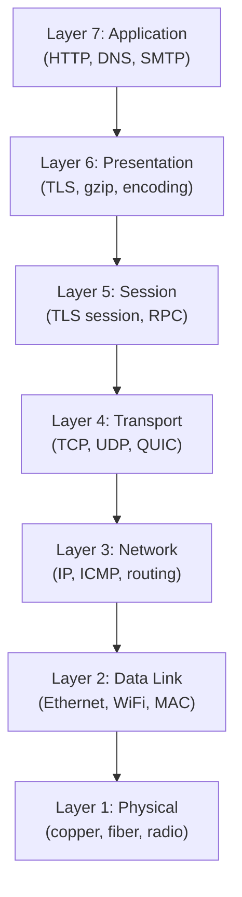

**⚡ TL;DR** - The OSI model is a 7-layer framework that
organizes all networking concepts by separating concerns:
physical transmission, addressing, reliable transport,
and application communication live at different layers.

| #005 | Category: Networking | Difficulty: ★☆☆ |
|:---|:---|:---|
| **Depends on:** | The Networking Problem - Why Networks Exist | |
| **Used by:** | OSI Model (Seven Layers), TCP/IP Model, IP Address | |
| **Related:** | The Networking Problem, Packets vs Streams Mental Model, Networking in the SE Landscape | |

---

### 🔥 The Problem This Solves

**WORLD WITHOUT IT:**

Before the OSI model, every networking vendor built
incompatible, proprietary systems. IBM's SNA, DEC's
DECnet, and Xerox's XNS networks could not communicate
with each other. A company using IBM networking could not
exchange data with a company using DEC equipment without
expensive protocol converters. Hardware and software were
tightly coupled - changing a network adapter required
rewriting the application code.

**THE BREAKING POINT:**

As the internet grew in the late 1970s, the lack of a
standard networking architecture meant every system
re-invented the same concepts (addressing, routing,
error-correction) in incompatible ways. The ISO (International
Organization for Standardization) and CCITT realized that
without a common reference model, networking would remain
fragmented and expensive.

**THE INVENTION MOMENT:**

This is exactly why the OSI (Open Systems Interconnection)
model was created in 1984 by ISO. It defines seven layers
of networking functionality, each with a specific
responsibility. The layers could be implemented
independently, meaning you could change the physical medium
(copper to fiber) without changing the application protocol
(HTTP). Separation of concerns applied to networks.

**EVOLUTION:**

OSI (1984) was the theoretical model. TCP/IP (used on
ARPANET since 1983) was the practical model. In practice,
TCP/IP won because it was already deployed and working.
OSI remains the teaching and diagnostic framework. When
engineers say "layer 3 problem" or "layer 7 firewall,"
they are using OSI vocabulary even if the actual protocol
is TCP/IP. The OSI model is the universal networking
language, even though OSI protocols were never widely adopted.

---

### 📘 Textbook Definition

The **OSI (Open Systems Interconnection) model** is a
conceptual framework standardized by ISO (ISO/IEC 7498-1,
1994) that divides network communication into seven
abstraction layers: Physical, Data Link, Network, Transport,
Session, Presentation, and Application. Each layer provides
services to the layer above and uses services from the layer
below, communicating with its peer layer on the remote host
via a defined protocol. The model provides a universal
vocabulary for describing networking concepts and a
framework for diagnosing where in the communication stack
a failure occurs.

---

### ⏱️ Understand It in 30 Seconds

**One line:**
The OSI model divides networking into 7 independent layers
so each concern (physical, routing, reliable delivery,
application) can be changed independently.

**One analogy:**

> The OSI model is like shipping a product internationally.
> Layer 1 (Physical) is the truck or airplane. Layer 2
> (Data Link) is the road or shipping route between two
> specific cities. Layer 3 (Network) is the address label
> with country, city, and zip code. Layer 4 (Transport) is
> the guarantee that the package arrives complete. Layers 5-7
> are the business contract, the language the invoice is
> written in, and what's actually inside the package.

**One insight:**
Engineers use OSI layers daily without realizing it. "Layer
3 switch" means it routes by IP address. "Layer 7 load
balancer" means it routes by HTTP path. "Open port at the
OS level" means layer 4. "Packet loss" is layer 3. "Frame
error" is layer 2. The model is a diagnostic coordinate
system: knowing which layer has a problem tells you exactly
which tools to use and which team to call.

---

### 🔩 First Principles Explanation

**CORE INVARIANTS:**

1. Complex systems must be decomposed into independent
   layers with clean interfaces to be maintainable.
2. Each layer should have exactly one well-defined
   responsibility.
3. A change in one layer should not require changes in
   other layers (the only dependency is the interface).

**DERIVED DESIGN:**

The OSI model applies the layered architecture pattern to
networking. Seven layers were chosen to match the actual
structure of the problem (physical media → local addressing
→ global addressing → reliable delivery → session → encoding
→ application). Too few layers and concerns mix; too many
and the model becomes impractical.

Each layer adds a header (encapsulation) when sending and
removes it when receiving. The receiving machine processes
headers from layer 1 up, each layer extracting its header
and passing the remaining payload to the layer above.

**THE TRADE-OFFS:**

**Gain:** Independent evolution of layers. WiFi (layer 1/2)
replaced Ethernet at the physical level without changing
IP (layer 3) or TCP (layer 4) or HTTP (layer 7). This is
why WiFi "just works" with all existing applications.

**Cost:** Each layer adds header overhead and processing.
Each layer crossing adds latency. Some optimizations
(kernel bypass networking) intentionally violate layering
to gain performance.

**ESSENTIAL vs ACCIDENTAL COMPLEXITY:**

**Essential:** Some form of layered decomposition is
necessary for network protocol design. The specific number
of layers is debatable.

**Accidental:** Seven layers is arguably too many - in
practice, TCP/IP collapses Session and Presentation into
the Application layer. The OSI model's elegance is as a
teaching tool, not as a practical protocol stack.

---

### 🧪 Thought Experiment

**SETUP:**
You need to send an HTTP request to `api.example.com`.
Trace exactly which layer does what.

**WHAT HAPPENS:**

- Layer 7 (Application): HTTP formats: `GET /users HTTP/1.1`
- Layer 6 (Presentation): TLS encrypts the HTTP text
- Layer 5 (Session): TLS session state is maintained
- Layer 4 (Transport): TCP adds port numbers (src: 54321,
  dst: 443), sequence numbers, and splits data into segments
- Layer 3 (Network): IP adds source IP (10.0.0.1) and
  destination IP (93.184.216.34)
- Layer 2 (Data Link): Ethernet adds MAC addresses (local
  interface → local gateway) and FCS checksum
- Layer 1 (Physical): Electrical signals or photons
  transmitted on the wire/fiber/radio

**THE INSIGHT:**
At each layer, a header wraps the previous layer's data.
By the time data leaves the wire, an HTTP request carries
7 nested headers: Ethernet (layer 2) contains IP (layer 3)
which contains TCP (layer 4) which contains TLS (layers 5-6)
which contains HTTP (layer 7) which contains the actual
payload. This is encapsulation - each layer has no knowledge
of the layers above or below its interface.

---

### 🧠 Mental Model / Analogy

> The OSI model is like sending a confidential legal
> document internationally. The document (Layer 7: content)
> is translated into the destination country's language
> (Layer 6: Presentation). It's placed in a sealed folder
> for the meeting (Layer 5: Session). The folder goes into a
> padded envelope with your full legal address (Layer 4:
> Transport). The envelope gets a routing label with country
> and city (Layer 3: Network). A courier takes it to the
> local postal hub (Layer 2: Data Link). The hub puts it on
> a physical vehicle (Layer 1: Physical).

Mapping:
- "Document content" → application payload (HTTP body)
- "Translation" → encoding (TLS, UTF-8, compression)
- "Sealed folder for meeting" → session management
- "Full legal address + registered mail" → TCP (port + guaranteed delivery)
- "Country/city routing label" → IP address
- "Local courier + postal hub" → Ethernet frame + MAC address
- "Physical vehicle" → electrical/optical signal

**Where this analogy breaks down:** Each OSI layer's
header is transparent to non-adjacent layers - HTTP does
not know TCP exists. The legal document analogy suggests
awareness at each stage, but in networking, each layer
is completely opaque to non-adjacent layers.

---

### 📶 Gradual Depth - Five Levels

**Level 1 - What it is (anyone can understand):**
The OSI model is a map of 7 levels of networking, from the
physical cable (layer 1) to the application making the
request (layer 7). Each level has a job. Layer 3 (IP) routes
data to the right computer. Layer 4 (TCP) ensures it arrives
reliably. Layer 7 (HTTP) is what your app uses.

**Level 2 - How to use it (junior developer):**
When someone says "layer 7 issue," they mean the problem is
in the application protocol (HTTP, gRPC). "Layer 3 issue"
means routing (wrong IP, routing table error). "Layer 4
issue" means connection problem (TCP port not open, firewall
blocking). Using this vocabulary lets you communicate
precisely with network engineers.

**Level 3 - How it works (mid-level engineer):**
When troubleshooting, you test layers from bottom to top.
Layer 1: physical link up? (`ip link show`). Layer 3: IP
reachable? (`ping`). Layer 4: TCP port open? (`nc -zv host
port`). Layer 7: HTTP responding? (`curl -v`). This bottom-
up testing procedure rapidly identifies the failing layer.

**Level 4 - Why it was designed this way (senior/staff):**
The seven layers reflect a 1984 view of networking that
assumed session management and presentation encoding would
be distinct from the application. In practice, TLS handles
both presentation (encryption) and session (resumption)
and lives in the OS or library, not the application. HTTP/2
merged session and transport concerns. The OSI model's
boundaries are philosophically clean but do not map
perfectly to modern protocol stacks.

**Level 5 - Mastery (distinguished engineer):**
OSI layers are a vocabulary, not a constraint. Modern
systems regularly violate strict layering for performance:
DPDK bypasses layers 1-4 in the kernel (kernel bypass);
RDMA bypasses TCP entirely. Hardware offloading moves TLS
(layer 6) into the NIC. Kernel bypass networking shows that
OSI layers are guidelines for interoperability, not laws
of physics. A distinguished engineer knows when to respect
the layers and when to violate them for performance.

---

### ⚙️ How It Works (Mechanism)

```
┌──────────────────────────────────────────────────┐
│          OSI Layer Stack with Protocols          │
├──────────────────────────────────────────────────┤
│                                                  │
│  Layer 7 - Application   HTTP, DNS, SMTP, FTP    │
│       ↕ (interface: socket API)                  │
│  Layer 6 - Presentation  TLS/SSL, gzip, UTF-8    │
│       ↕ (interface: session context)             │
│  Layer 5 - Session       TLS session, RPCsession │
│       ↕ (interface: reliable byte stream)        │
│  Layer 4 - Transport     TCP, UDP, SCTP, QUIC    │
│       ↕ (interface: IP datagram)                 │
│  Layer 3 - Network       IPv4, IPv6, ICMP, BGP   │
│       ↕ (interface: Ethernet frame)              │
│  Layer 2 - Data Link     Ethernet, WiFi, PPP     │
│       ↕ (interface: physical signal)             │
│  Layer 1 - Physical      copper, fiber, radio    │
│                                                  │
│  Mnemonic: Please Do Not Throw Sausage Pizza Away│
│  (Physical, Data, Network, Transport, Session,   │
│   Presentation, Application - bottom to top)     │
└──────────────────────────────────────────────────┘
```



**Encapsulation at each layer:**

```
┌─────────────────────────────────────────────┐
│  L7 HTTP: GET /index.html                   │
├─────────────────────────────────────────────┤
│  L4 TCP: [src:54321][dst:443][seq:100][...] │
│  L7 payload                                 │
├─────────────────────────────────────────────┤
│  L3 IP: [src:10.0.0.1][dst:93.184.216.34]  │
│  L4+L7 payload                              │
├─────────────────────────────────────────────┤
│  L2 ETH: [src:aa:bb:..][dst:cc:dd:..][FCS] │
│  L3+L4+L7 payload                           │
├─────────────────────────────────────────────┤
│  L1: bits on wire                            │
└─────────────────────────────────────────────┘
```

---

### ⚖️ Comparison Table

| Model | Layers | Used For | Status |
|---|---|---|---|
| **OSI** | 7 | Teaching, diagnostics, vocabulary | Reference model |
| TCP/IP (DoD) | 4 | Actual internet implementation | Production standard |
| QUIC stack | ~4 | HTTP/3 transport | Emerging replacement |

How to choose: Use OSI vocabulary when communicating about
network problems ("layer 3 routing issue"). Use TCP/IP
model when describing actual protocol stacks. QUIC
represents a collapse of TCP/IP layers 4-6 into a unified
transport built on UDP.

---

### ⚠️ Common Misconceptions

| Misconception | Reality |
|---|---|
| TCP/IP has 7 layers | TCP/IP has 4 layers: Link, Internet, Transport, Application. OSI has 7. They overlap but are not the same. |
| OSI layers are strictly enforced in production | Modern protocols regularly span or collapse OSI layers. TLS spans layers 4-6. QUIC implements layers 4-6 as one protocol. |
| Layer 1 is just hardware, not a software concern | NIC firmware, DPDK drivers, and kernel bypass techniques ARE layer 1 concerns for high-performance engineers. |
| "Layer N issue" means only one layer is involved | Network issues often span layers: a TLS cert error (layer 6) requires fixing the application (layer 7). DNS failure (layer 7) prevents TCP (layer 4) from connecting. |

---

### 🚨 Failure Modes & Diagnosis

**Wrong Layer Diagnosis**

**Symptom:** Engineer spends hours debugging application
code for a connectivity issue that is actually a firewall
rule (layer 4) or routing problem (layer 3).

**Root Cause:** Skipping the bottom-up diagnostic approach.

**Diagnostic Command / Tool:**
```bash
# Layer 1-2: Check physical link
ip link show eth0
# Look for: state UP, no "NO-CARRIER"

# Layer 3: Check IP routing
ping -c 3 10.0.0.1       # gateway reachable?
ping -c 3 8.8.8.8        # internet reachable?
traceroute 8.8.8.8       # where does routing stop?

# Layer 4: Check TCP port
nc -zv hostname 443      # TCP port open?
ss -tnlp | grep :8080    # is my service listening?

# Layer 7: Check application
curl -v https://hostname # Full HTTP response
```

**Fix:** Always test bottom-up. A layer 7 HTTP error is
meaningless if the layer 3 routing is broken.

**Prevention:** Create a standard runbook for connectivity
testing that starts at layer 1 and works up. Never
start debugging at the application layer.

---

### 🔗 Related Keywords

**Prerequisites (understand these first):**
- `The Networking Problem - Why Networks Exist` - why
  networking layers exist at all

**Builds On This (learn these next):**
- `OSI Model (Seven Layers)` - deep dive into each layer
- `TCP/IP Model (Four Layers)` - the production equivalent
- `IP Address` - layer 3 concept
- `TCP (Transmission Control Protocol)` - layer 4 protocol

**Alternatives / Comparisons:**
- `TCP/IP Model (Four Layers)` - the practical alternative
  to OSI's 7-layer theoretical framework

---

### 📌 Quick Reference Card

```
┌──────────────────────────────────────────────────────────┐
│ WHAT IT IS   │ 7-layer framework for organizing network  │
│              │ protocols by responsibility               │
├──────────────┼───────────────────────────────────────────┤
│ PROBLEM IT   │ Incompatible vendor networks; no shared   │
│ SOLVES       │ vocabulary for networking diagnostics     │
├──────────────┼───────────────────────────────────────────┤
│ KEY INSIGHT  │ "Layer N problem" = know which tools to   │
│              │ use and which team to call                │
├──────────────┼───────────────────────────────────────────┤
│ USE WHEN     │ Diagnosing network failures; communicating │
│              │ with network teams; understanding products │
├──────────────┼───────────────────────────────────────────┤
│ AVOID WHEN   │ Performance-critical systems where layer  │
│              │ violations (kernel bypass) are necessary  │
├──────────────┼───────────────────────────────────────────┤
│ ANTI-PATTERN │ Debugging application (L7) before         │
│              │ verifying connectivity (L1-L4)            │
├──────────────┼───────────────────────────────────────────┤
│ TRADE-OFF    │ Clean separation of concerns vs overhead  │
│              │ at each layer crossing                    │
├──────────────┼───────────────────────────────────────────┤
│ ONE-LINER    │ "OSI is a diagnostic coordinate system:   │
│              │  knowing the layer tells you the fix."    │
├──────────────┼───────────────────────────────────────────┤
│ NEXT EXPLORE │ OSI 7 Layers → TCP/IP Model → IP Address  │
└──────────────────────────────────────────────────────────┘
```

**If you remember only 3 things:**
1. OSI = 7 layers; TCP/IP = 4 layers; OSI is the vocabulary,
   TCP/IP is the production reality.
2. Diagnose bottom-up: physical → IP → TCP → application.
   Jumping to app debugging with a broken route is wasted time.
3. "Layer N" in product names is OSI vocabulary:
   L3 switch = routes by IP, L7 LB = routes by HTTP.

**Interview one-liner:**
"The OSI model is a 7-layer reference framework that
separates physical transmission from logical addressing from
reliable delivery from application protocols. In production,
TCP/IP uses 4 layers. OSI's value is diagnostic and
communicative: knowing that a problem is at layer 3 (routing),
layer 4 (TCP port blocked), or layer 7 (application error)
tells you exactly which tool to use and which team to call."

---

### 💎 Transferable Wisdom

**Reusable Engineering Principle:**
Layered architecture is the universal solution to building
complex systems from simple components. Each layer handles
exactly one concern, exposes a stable interface, and hides
its implementation from adjacent layers. The OSI model
applies this principle to networking; the same principle
appears in operating systems (hardware → kernel → OS API →
application), databases (storage → buffer pool → query
engine → SQL interface), and microservices.

**Where else this pattern appears:**
- **Operating system rings** - user space, kernel space,
  hardware are OSI-like layers; a syscall is the
  "inter-layer interface"
- **Container runtime** - hardware → hypervisor → OS →
  container runtime → container → app is a 6-layer OSI
  equivalent for virtualization
- **Compiler pipeline** - source → lexer → parser → AST
  → IR → optimizer → machine code is a 6-layer stack
  where each stage has a defined interface

**Industry applications:**
- **Telecom** - 5G NR (New Radio) uses the same layered
  model as OSI, with PHY/MAC/RLC/PDCP layers mapping to
  OSI layers 1-2. Every telecom engineer speaks OSI.
- **Cloud security** - "defense in depth" is OSI applied
  to security: controls at the physical (data center),
  network (VPC), transport (TLS), and application (auth)
  layers - each layer independently limits attacker access.

---

### 💡 The Surprising Truth

The OSI model was designed to replace TCP/IP, not just
complement it. In 1984, the US government mandated that all
government networking contracts use OSI protocols (not
TCP/IP) by 1988. The OSI protocol stack was fully specified
and even partially deployed. It lost to TCP/IP for one
surprising reason: TCP/IP had running code that worked, and
OSI had specifications that did not run yet. Jon Postel's
"robustness principle" - "be conservative in what you send,
be liberal in what you accept" - allowed TCP/IP to work
across incompatible implementations, while OSI required
strict compliance that was impossible with 1980s hardware.
Working, imperfect systems beat perfect, non-working systems.

---

### ✅ Mastery Checklist

**You've mastered this when you can:**
1. **EXPLAIN** the 7 OSI layers from memory, with a
   real-world protocol example at each layer, in under 2
   minutes.
2. **DEBUG** a connectivity failure by running bottom-up
   layer tests in under 5 minutes, identifying at which
   layer the failure occurs.
3. **DECIDE** when someone says "layer 7 load balancer" vs
   "layer 4 load balancer" - what is the exact practical
   difference in capability and use case.
4. **BUILD** a mental model of how a packet's headers grow
   as it moves down the stack (encapsulation) and shrink
   as it moves up (decapsulation) on the receiving side.
5. **EXTEND** the layered model to explain why QUIC
   "breaks" OSI layering by implementing transport,
   session, and presentation in one protocol, and why this
   is a performance optimization, not a design flaw.

---

### 🧠 Think About This Before We Continue

**Q1.** A "layer 7 firewall" (WAF - Web Application Firewall)
inspects HTTP content and blocks malicious patterns. But to
inspect layer 7 content, it must also understand layers 4
(TCP), 3 (IP), and 6 (TLS). What does this tell you about
the "clean layer separation" principle of OSI? Is it
possible to enforce security at layer 7 without violating
the independence of lower layers?

*Hint: Think about what a TLS-terminating proxy does and
whether that changes the trust model for the connections
between the proxy and the backend servers.*

**Q2.** Netflix serves 15% of all North American internet
traffic. They run their own CDN (Open Connect) that places
servers directly inside ISPs. From an OSI perspective,
what layer does Netflix operate at when they place hardware
inside an ISP? What layers does this optimize? Why does
this architectural choice reduce latency more than any
application-level optimization could?

*Hint: Consider which OSI layer determines physical distance
and the speed of light constraint.*

**Q3.** [Hands-On] Run `tcpdump -i any -n 'port 80' -X` and
open a website in your browser. Identify which bytes in the
raw packet output correspond to each OSI layer. Can you
find the Ethernet header (src/dst MAC), IP header (src/dst
IP), TCP header (src/dst port, sequence number), and HTTP
payload? What does this exercise reveal about how "layer
independence" works in practice?

*Hint: tcpdump shows raw bytes. Look for the pattern:
14 bytes Ethernet, 20 bytes IP, 20 bytes TCP minimum,
then HTTP text starting with "GET" or "HTTP".*