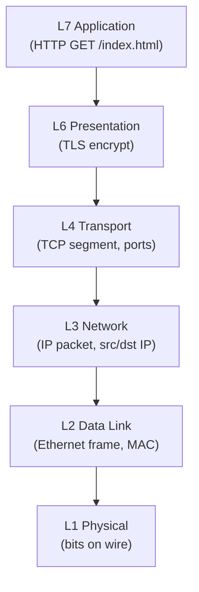

**⚡ TL;DR** - The OSI model's 7 layers each handle one
network concern: Physical (bits), Data Link (frames between
neighbors), Network (IP routing), Transport (TCP/UDP), Session,
Presentation (TLS), and Application (HTTP).

| #007 | Category: Networking | Difficulty: ★☆☆ |
|:---|:---|:---|
| **Depends on:** | OSI Model - The Big Picture | |
| **Used by:** | IP Address, Port Number, Packet Structure, TCP | |
| **Related:** | TCP/IP Model (Four Layers), OSI Model - The Big Picture | |

---

### 🔥 The Problem This Solves

Without OSI layer names, engineers have no shared vocabulary
for locating network failures. "The network is broken" is
useless. "The layer 3 routing table is missing the route to
10.0.2.0/24" is precise and actionable. This entry provides
the deep layer-by-layer reference that makes the vocabulary
precise and usable.

---

### 📘 Textbook Definition

The **OSI model** defines seven protocol layers, each
responsible for a specific communication concern. Layers 1-4
are transport-oriented (moving bits reliably from A to B).
Layers 5-7 are application-oriented (encoding, session
management, and application semantics). Each layer
communicates with its peer layer on the remote host via a
protocol, and with adjacent local layers via a service
interface.

---

### ⏱️ Understand It in 30 Seconds

**One line:**
Seven layers, each with one job: bits, local delivery, global
routing, reliable transport, session, encoding, application.

**One analogy:**

> The OSI layers are like an onion: each layer wraps the one
> inside it. When data is sent, each layer adds a new skin
> (header). When data is received, each layer peels its skin
> off. Layer 1 is the outermost skin (physical medium), layer
> 7 is the innermost core (application meaning).

**One insight:**
The single most useful application of OSI for a software
engineer is the diagnostic procedure: test layer 3 (ping)
before testing layer 4 (TCP port), and test layer 4 before
testing layer 7 (HTTP). Each test gives you a binary answer:
"works up to this layer." This bottom-up approach finds the
failure layer in minutes.

---

### 🔩 First Principles Explanation

**THE SEVEN LAYERS - DETAILED:**

```
┌──────────────────────────────────────────────────┐
│  OSI Model - Full Layer Reference                │
├────┬──────────────┬───────────────────────────── ┤
│ #  │ Layer        │ Responsibility + Examples     │
├────┼──────────────┼─────────────────────────────  ┤
│ 7  │ Application  │ Application protocol meaning  │
│    │              │ HTTP, DNS, SMTP, FTP, SSH,    │
│    │              │ SNMP, Telnet, POP3, IMAP      │
│    │              │ PDU: Message/Data             │
├────┼──────────────┼─────────────────────────────  ┤
│ 6  │ Presentation │ Data encoding and encryption  │
│    │              │ TLS/SSL, gzip, JPEG, MPEG,    │
│    │              │ ASCII, UTF-8, Base64           │
│    │              │ PDU: Data                     │
├────┼──────────────┼─────────────────────────────  ┤
│ 5  │ Session      │ Dialog control, session state │
│    │              │ TLS sessions, RPC session,    │
│    │              │ NetBIOS, SOCKS                │
│    │              │ PDU: Data                     │
├────┼──────────────┼─────────────────────────────  ┤
│ 4  │ Transport    │ End-to-end delivery, port     │
│    │              │ addressing, reliability       │
│    │              │ TCP, UDP, SCTP, QUIC          │
│    │              │ PDU: Segment (TCP)/Datagram   │
├────┼──────────────┼─────────────────────────────  ┤
│ 3  │ Network      │ Logical addressing, routing   │
│    │              │ between networks              │
│    │              │ IPv4, IPv6, ICMP, IPsec, BGP  │
│    │              │ PDU: Packet                   │
├────┼──────────────┼─────────────────────────────  ┤
│ 2  │ Data Link    │ Physical addressing, access   │
│    │              │ to shared medium, error detect│
│    │              │ Ethernet, WiFi (802.11),      │
│    │              │ PPP, VLAN, STP                │
│    │              │ PDU: Frame                    │
├────┼──────────────┼─────────────────────────────  ┤
│ 1  │ Physical     │ Bit transmission over medium  │
│    │              │ copper (Cat6), fiber, coax,   │
│    │              │ radio (4G/5G/WiFi), RS-232    │
│    │              │ PDU: Bit                      │
└────┴──────────────┴──────────────────────────────-┘
```

**Mnemonic - bottom to top:**
"**P**lease **D**o **N**ot **T**hrow **S**ausage **P**izza **A**way"
(Physical, Data Link, Network, Transport, Session,
Presentation, Application)

**Mnemonic - top to bottom:**
"**A**ll **P**eople **S**eem **T**o **N**eed **D**ata **P**rocessing"

---

### 🧪 Thought Experiment

**SETUP:**
You send an email. Trace the layers:

Layer 7 (Application): SMTP protocol encodes: `MAIL FROM:
user@example.com`

Layer 6 (Presentation): TLS encrypts the SMTP transaction.

Layer 5 (Session): TLS session state tracks the connection.

Layer 4 (Transport): TCP adds port numbers (src ephemeral,
dst 587). Provides ordered, reliable delivery.

Layer 3 (Network): IP adds source IP (10.0.0.1) and
destination IP of mail server (50.16.0.1).

Layer 2 (Data Link): Ethernet adds MAC addresses for the
local hop (your NIC → your router's NIC).

Layer 1 (Physical): Bits transmitted as electrical signals
over Cat6 to your router.

**THE INSIGHT:**
At layers 2 and 3, the addresses are different: layer 2
(MAC) is local hop addresses, layer 3 (IP) is global end-
to-end addresses. Routers update MAC addresses at every hop
but leave IP addresses unchanged. This is why traceroute can
show each router's IP address: the IP header persists end-
to-end, while MAC headers change at each hop.

---

### 🧠 Mental Model / Analogy

> Each OSI layer is like a government ministry. The Ministry
> of Physical Transport (Layer 1) moves goods on roads and
> rails - it doesn't care what's in the boxes. The Ministry
> of Local Delivery (Layer 2) knows how to get a box from
> your house to the post office - it uses street addresses.
> The Ministry of International Routing (Layer 3) knows how
> to route a box from the UK to Japan - it uses country and
> city codes. The Ministry of Reliable Delivery (Layer 4)
> guarantees the package arrives and tracks if it doesn't.
> Each ministry has its own staff, rules, and address format.
> They cooperate but do not interfere with each other.

---

### 📶 Gradual Depth - Five Levels

**Level 1 - What it is (anyone can understand):**
The 7 OSI layers divide networking into separate concerns.
Bottom layers move bits physically. Middle layers route
data to the right computer. Top layers translate and
interpret the meaning of data for applications.

**Level 2 - How to use it (junior developer):**
When debugging: ping tests layer 3 (IP routing). `nc -zv
host port` tests layer 4 (TCP port). `curl -v` tests
layers 7 (HTTP). If ping works but curl doesn't, the
problem is layer 4 (firewall blocking port) or layer 7
(application error).

**Level 3 - How it works (mid-level engineer):**
Each layer's PDU (Protocol Data Unit) is what that layer
considers a "unit": bits (L1), frames (L2), packets (L3),
segments (L4). A packet is an IP-addressed unit. A frame
is an Ethernet-addressed unit. A segment is a TCP-ordered
unit. Wireshark shows all four headers simultaneously.

**Level 4 - Why it was designed this way (senior/staff):**
The boundary between L2 and L3 is the boundary between
"local network" and "global network." MAC addresses are
local (non-routable), IP addresses are global (routable).
This split was deliberate: local networks can use any
technology (Ethernet, WiFi, Token Ring), while the global
internet uses a uniform IP address space. ARP bridges L2
and L3 by mapping IP to MAC for local delivery.

**Level 5 - Mastery (distinguished engineer):**
Layers 5-7 are where the OSI model diverges most from
TCP/IP reality. In practice, TLS implements both layer 5
(session resumption) and layer 6 (encryption). HTTP/2
implements both session management (streams) and
application protocol. The "separation" between 5, 6, 7
is intellectual, not real. Modern protocol design collapses
these three layers for performance reasons.

---

### ⚙️ How It Works (Mechanism)

**Encapsulation - sending data:**

```
┌──────────────────────────────────────────────────┐
│        Data Encapsulation: L7 → L1               │
├──────────────────────────────────────────────────┤
│                                                  │
│  L7: [HTTP data: "GET / HTTP/1.1"]               │
│                  │                               │
│  L6: [TLS header][encrypted HTTP data]           │
│                  │                               │
│  L4: [TCP hdr: src:5001 dst:443 seq:100]         │
│      [L6+L7 payload]                             │
│                  │                               │
│  L3: [IP hdr: src:10.0.0.1 dst:1.1.1.1]         │
│      [L4+L6+L7 payload]                          │
│                  │                               │
│  L2: [ETH hdr: src:aa:bb dst:cc:dd][FCS]         │
│      [L3+L4+L6+L7 payload]                       │
│                  │                               │
│  L1: 0101001100011...  (bits on wire)            │
└──────────────────────────────────────────────────┘
```



**Key protocols at each layer:**

| Layer | Protocols | PDU Name | Header Size |
|---|---|---|---|
| 7 Application | HTTP, DNS, SMTP, SSH | Message | Varies |
| 6 Presentation | TLS, gzip, JPEG | Data | Varies |
| 5 Session | TLS session, SOCKS | Data | Varies |
| 4 Transport | TCP, UDP | Segment/Datagram | 20b(TCP)/8b(UDP) |
| 3 Network | IPv4, IPv6 | Packet | 20b(IPv4) |
| 2 Data Link | Ethernet, WiFi | Frame | 14b(ETH) |
| 1 Physical | Cat6, fiber, radio | Bit | None |

**Total overhead per HTTP/1.1 request:**
~14 (Eth) + 20 (IP) + 20 (TCP) + ~20 (TLS) + ~200 (HTTP) =
~274 bytes of protocol overhead before your 1-byte payload.
This overhead is why HTTP/2 header compression matters at
scale: 1 million requests/second with 200-byte HTTP headers
= 200 MB/s of headers alone.

---

### 🔄 The Complete Picture - End-to-End Flow

```
┌──────────────────────────────────────────────────┐
│     OSI Layers at Router Hop (L2 changes)        │
├──────────────────────────────────────────────────┤
│                                                  │
│  Client (10.0.0.1) → Router (10.0.0.254)        │
│                           → Server (1.1.1.1)    │
│                                                  │
│  L3 IP header: src=10.0.0.1, dst=1.1.1.1        │
│    [unchanged across all hops]                   │
│                                                  │
│  L2 Ethernet frame at hop 1:                     │
│    src_mac=client_mac, dst_mac=router_mac        │
│    [stripped and replaced at each router]        │
│                                                  │
│  L2 Ethernet frame at hop 2:                     │
│    src_mac=router_mac, dst_mac=server_mac        │
│    [new local MAC addresses for each segment]    │
└──────────────────────────────────────────────────┘
```

**FAILURE PATH:**
Layer 2 failure (bad cable, switch port error): layer 3 ping
fails. Layer 3 failure (route missing): ping fails but
traceroute shows where. Layer 4 failure (firewall): ping
works but TCP `nc -zv` fails.

**WHAT CHANGES AT SCALE:**
At 100Gbps line rate, layer 2 processing (FCS checksum
verification) must happen in hardware (ASIC or NIC offload).
Software cannot keep up at 100Gbps. Every layer's header
processing must be hardware-accelerated at carrier scale.
This is why "line-rate hardware" is a category: Ethernet
switches that process all 7 layers at wire speed.

---

### ⚖️ Comparison Table

| OSI Layer | TCP/IP Equivalent | Real Protocol | Failure Symptom |
|---|---|---|---|
| 7 Application | Application | HTTP 500 | Error page or JSON error |
| 6 Presentation | Application | TLS cert error | SSL handshake fail |
| 5 Session | Application | TLS timeout | Connection reset |
| 4 Transport | Transport | TCP RST | Connection refused |
| 3 Network | Internet | No route | Ping timeout |
| 2 Data Link | Link | Cable failure | Link down |
| 1 Physical | Link | Physical break | NIC offline |

---

### ⚠️ Common Misconceptions

| Misconception | Reality |
|---|---|
| Routers operate at layer 3 only | Modern routers operate at layers 2-7. Load-balancers, firewalls, and DPI (Deep Packet Inspection) operate at layer 7. "Layer 3 device" means it CAN do L3 - it doesn't mean it only does L3. |
| Layer 7 is always HTTP | Layer 7 is any application protocol: DNS (UDP), SSH, SMTP, FTP, MQTT, gRPC, WebSocket. HTTP is the most common but not the only one. |
| L5 (Session) is unimportant | TLS session resumption (layer 5) is why HTTPS connections reconnect 10x faster for returning users. Tickets and session IDs are critical for performance. |
| OSI and TCP/IP are incompatible | TCP/IP IS an implementation of the OSI model with simplified layers. TCP (L4) + IP (L3) = layers 3-4. HTTP (L7) spans OSI layers 5-7 in practice. |

---

### 🚨 Failure Modes & Diagnosis

**Layer 2 MTU Mismatch (Fragmentation)**

**Symptom:** Large files and pages fail to transfer; small
requests work. SSH works for login but hangs when running
commands that produce lots of output.

**Root Cause:** MTU mismatch between network segments.
Jumbo frames (9000 bytes) configured on some interfaces,
standard 1500 bytes on others. Large frames fragmented or
dropped when they exceed the smaller MTU.

**Diagnostic Command / Tool:**
```bash
# Test if large packets are blocked
ping -M do -s 1472 target_ip
# -M do = don't fragment
# -s 1472 = 1500 MTU - 28 IP+ICMP header bytes
# If this fails but ping -s 100 works: MTU mismatch

# Check interface MTU
ip link show eth0
# Look for: mtu 1500 or mtu 9000
```

**Fix:** Standardize MTU across all interfaces in the path,
or enable MSS clamping on routers to prevent oversized
segments.

**Prevention:** Always test with large packets when
configuring new network paths. MTU mismatches are common
after VPN or tunnel configurations.

---

**Layer 3 Route Missing or Black-Hole**

**Symptom:** `ping` to target IP times out. `traceroute`
shows packets reaching a router and then silence (no more
hops respond).

**Root Cause:** Missing route entry in routing table.
Or a "black-hole" route: a route exists but points to a
non-existent next hop.

**Diagnostic Command / Tool:**
```bash
# Show routing table
ip route show table main
ip route get 10.0.2.0   # trace what route would be used

# Test connectivity layer by layer
ping -c 3 10.0.0.1       # gateway (L3 local)
ping -c 3 8.8.8.8        # internet (L3 global)
traceroute 10.0.2.5      # where does it stop?
```

**Fix:** Add missing route: `ip route add 10.0.2.0/24 via
10.0.0.254`. Or fix the default gateway if internet is
unreachable.

**Prevention:** Monitor routing tables. Use BGP health
monitoring. Test new network configuration with traffic
from production before cutting over.

---

### 🔗 Related Keywords

**Prerequisites (understand these first):**
- `OSI Model - The Big Picture` - the overview and mental
  model before this deep-dive

**Builds On This (learn these next):**
- `TCP/IP Model (Four Layers)` - the practical equivalent
- `IP Address` - layer 3 deep dive
- `TCP (Transmission Control Protocol)` - layer 4 deep dive
- `Packet Structure` - what layer 3 packets contain

**Alternatives / Comparisons:**
- `TCP/IP Model (Four Layers)` - 4-layer model vs OSI's 7
  layers - understanding both makes diagnostics clearer

---

### 📌 Quick Reference Card

```
┌──────────────────────────────────────────────────────────┐
│ WHAT IT IS   │ 7 layers each handling one network concern │
├──────────────┼───────────────────────────────────────────┤
│ PROBLEM IT   │ No shared vocabulary for network failures  │
│ SOLVES       │ and protocol design                       │
├──────────────┼───────────────────────────────────────────┤
│ KEY INSIGHT  │ Test bottom-up: L1 link → L3 ping →       │
│              │ L4 TCP → L7 HTTP - each gives binary info │
├──────────────┼───────────────────────────────────────────┤
│ USE WHEN     │ Diagnosing connectivity; designing protocol│
│              │ stacks; communicating with network teams   │
├──────────────┼───────────────────────────────────────────┤
│ AVOID WHEN   │ N/A - foundational vocabulary             │
├──────────────┼───────────────────────────────────────────┤
│ ANTI-PATTERN │ Debugging at layer 7 without confirming   │
│              │ layers 1-4 are healthy first              │
├──────────────┼───────────────────────────────────────────┤
│ TRADE-OFF    │ Header overhead at each layer vs          │
│              │ independence and replaceability           │
├──────────────┼───────────────────────────────────────────┤
│ ONE-LINER    │ "Please Do Not Throw Sausage Pizza Away   │
│              │  - the mnemonic that saves debugging."    │
├──────────────┼───────────────────────────────────────────┤
│ NEXT EXPLORE │ TCP/IP Model → IP Address → TCP → HTTP    │
└──────────────────────────────────────────────────────────┘
```

**If you remember only 3 things:**
1. L1-Physical, L2-DataLink, L3-Network, L4-Transport,
   L5-Session, L6-Presentation, L7-Application.
   Mnemonic: "Please Do Not Throw Sausage Pizza Away."
2. Diagnose bottom-up: ping (L3) → nc port test (L4) →
   curl (L7). Each level gives you one binary answer.
3. MAC addresses change at every router hop (L2). IP
   addresses stay constant end-to-end (L3). This is why
   ARP exists: to map the stable (IP) to the local (MAC).

**Interview one-liner:**
"The 7 OSI layers divide network communication into Physical
(bits), Data Link (local frames with MAC), Network (global
routing with IP), Transport (TCP/UDP ports and reliability),
Session (TLS state), Presentation (TLS encryption), and
Application (HTTP, DNS). The diagnostic procedure is always
bottom-up: confirm L3 with ping, L4 with nc, L7 with curl.
MAC addresses change at every router hop; IP addresses
persist end-to-end."

---

### 💎 Transferable Wisdom

**Reusable Engineering Principle:**
Layered architectures with strict interface contracts allow
independent evolution of components. The OSI model's power
is that you can replace WiFi with 5G (layer 1 change) and
all higher layers work unchanged. This same principle
appears in: OS kernel modules (any driver → kernel API →
applications), container images (any base image → runtime →
orchestrator), and API versioning (any implementation →
REST interface → client).

**Where else this pattern appears:**
- **Compiler design** - source → lexer → parser → AST
  → IR → optimizer → backend → machine code. Each "layer"
  has a defined interface (tokens, AST nodes, IR instructions)
  allowing independent replacement.
- **Cloud infrastructure** - IaaS (hardware virtualization)
  → PaaS (OS, runtime) → SaaS (application). Each layer
  can be replaced without affecting the others.
- **Storage systems** - block storage → file system → object
  storage API → application. POSIX file API is the "interface"
  between layers, like Ethernet is between L1 and L3.

**Industry applications:**
- **Telecom** - 5G NR uses PHY/MAC/RLC/PDCP/RRC, mapping
  directly to OSI layers 1-3. Every telecom engineer and
  every radio protocol designer works within the OSI model.
- **Firewall design** - stateful firewalls operate at L4,
  WAFs at L7. Understanding which layer a security control
  operates at determines what attacks it can and cannot stop.

---

### 💡 The Surprising Truth

IP addresses are not globally unique in practice, and this
is by design. Network Address Translation (NAT) allows
millions of private IP addresses (10.0.0.0/8, 192.168.0.0/16)
to share a single public IP address through the magic of
layer 4 port numbers. When your laptop at home (192.168.1.5)
connects to a website, your router rewrites the source IP to
its public IP and maps the source port to a tracking entry.
The internet sees only the public IP. When the response
arrives, the router reverse-maps it back. IPv4 would have
run out of addresses in 1993 without NAT. The entire internet
has been running on what is essentially a massive address
allocation hack for 30 years. IPv6 was designed to make NAT
unnecessary, but NAT is so deeply embedded that many
networks still use it with IPv6.

---

### ✅ Mastery Checklist

**You've mastered this when you can:**
1. **EXPLAIN** the 7 OSI layers from memory in 60 seconds
   with a real protocol example at each layer and the PDU
   name (bit, frame, packet, segment).
2. **DEBUG** a connectivity issue to its exact OSI layer
   using only `ping`, `traceroute`, `nc`, and `curl` in
   under 5 minutes.
3. **DECIDE** which layer a product description targets: a
   "Layer 4 load balancer" vs "Layer 7 load balancer" and
   what the practical capability difference is.
4. **BUILD** a mental model of packet encapsulation: draw
   the nested headers for an HTTPS request from application
   payload to bits on wire, naming each header.
5. **EXTEND** the layered model to explain why adding a
   VPN tunnel adds two new sets of L3 and L4 headers to
   every packet and what this does to MTU effective size.

---

### 🧠 Think About This Before We Continue

**Q1.** A VPN creates a "tunnel": it wraps the original
IP packet (L3) inside a new UDP datagram (L4) with new IP
addresses (L3). This means a VPN-tunneled packet has two
IP headers. What layer does VPN operate at? How does this
affect MTU? If your effective MTU without VPN is 1500 bytes,
what is it with VPN encapsulation?

*Hint: Calculate the overhead of IP+UDP (or IP+ESP for IPsec)
added by VPN encapsulation, and what the resulting effective
MTU is for the application.*

**Q2.** Wireshark is a "packet analyzer" that shows OSI
layers 1-7 simultaneously. But to display layer 7 HTTPS
content, Wireshark needs the TLS session keys. Why? What
does this tell you about the relationship between layer 4
(TCP), layer 6 (TLS), and layer 7 (HTTP) in practice?
Is the "clean layer separation" of OSI real or theoretical?

*Hint: TLS decryption at layer 6 requires the private key
or the session keys. What does this imply about which layer
"owns" the content?*

**Q3.** [Hands-On] Run `sudo tcpdump -i eth0 -n "host
8.8.8.8 and icmp"` and then in another terminal run `ping
-c 5 8.8.8.8`. In the tcpdump output, identify the layer
2 (Ethernet src/dst), layer 3 (IP src/dst), and layer 3
protocol (ICMP type). Now run `sudo tcpdump -XX` (show raw
bytes) and locate the IP TTL field (byte 9 in the IP header
for IPv4). What value is it? What does it mean?

*Hint: IPv4 header starts at byte 14 (after 14-byte Ethernet
header). TTL is at offset 8 within the IP header. An initial
TTL of 64 and a received TTL of 60 means the packet crossed
4 routers.*