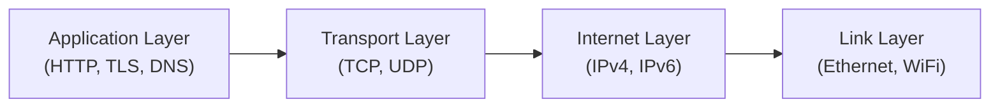

**⚡ TL;DR** - The TCP/IP model is the practical 4-layer
framework (Link, Internet, Transport, Application) that
describes how the internet actually works - simpler than
OSI, and what production systems are actually built on.

| #008 | Category: Networking | Difficulty: ★☆☆ |
|:---|:---|:---|
| **Depends on:** | OSI Model (Seven Layers) | |
| **Used by:** | IP Address, TCP, Subnet and CIDR Notation | |
| **Related:** | OSI Model (Seven Layers), OSI Model - The Big Picture | |

---

### 🔥 The Problem This Solves

The OSI model, while intellectually satisfying, has 7 layers
that do not map cleanly to real protocols. TCP/IP was the
actual network stack powering ARPANET and the internet. The
TCP/IP model describes what engineers actually built and what
production systems run on. Understanding it removes the
confusion between the theoretical 7-layer OSI and the real
4-layer implementation.

---

### 📘 Textbook Definition

The **TCP/IP model** (also called the Internet model or DoD
model) describes the internet protocol suite in four layers:
(1) **Link layer** - hardware-level transmission on local
networks (Ethernet, WiFi); (2) **Internet layer** - global
routing of packets by IP address (IPv4, IPv6); (3)
**Transport layer** - end-to-end delivery and multiplexing
by port number (TCP, UDP); (4) **Application layer** -
all application protocols (HTTP, DNS, TLS, SSH). Unlike
OSI, TCP/IP does not separate session and presentation from
the application layer.

---

### ⏱️ Understand It in 30 Seconds

**One line:**
TCP/IP has 4 layers: Link (your cable), Internet (IP
routing), Transport (TCP/UDP ports), Application (HTTP, DNS).

**One analogy:**

> TCP/IP is like international shipping simplified: local
> carrier (Link layer) picks up the package. The parcel
> service routes it internationally by address (Internet
> layer). Registered mail guarantees delivery and tracking
> (Transport layer). The invoice and contents inside the
> package are what the business cares about (Application).

**One insight:**
The TCP/IP model's most important simplification is collapsing
OSI's Session + Presentation + Application into one layer.
This means TLS (encryption), HTTP (application protocol),
and session management all live in the same "Application"
layer. In production, this is accurate: TLS is just a
library your application calls. There is no separate OS
"presentation" or "session" service.

---

### 🔩 First Principles Explanation

**THE FOUR LAYERS:**

```
┌──────────────────────────────────────────────────┐
│    TCP/IP Model vs OSI Model                     │
├─────────────────┬────────────────────────────────┤
│  TCP/IP         │  OSI (equivalent)              │
├─────────────────┼────────────────────────────────┤
│ 4. Application  │  7. Application                │
│    HTTP, DNS,   │  6. Presentation               │
│    TLS, SSH,    │  5. Session                    │
│    SMTP, FTP    │  (all three collapsed)          │
├─────────────────┼────────────────────────────────┤
│ 3. Transport    │  4. Transport                  │
│    TCP, UDP     │  (identical)                   │
├─────────────────┼────────────────────────────────┤
│ 2. Internet     │  3. Network                    │
│    IPv4, IPv6,  │  (equivalent)                  │
│    ICMP, IPsec  │                                │
├─────────────────┼────────────────────────────────┤
│ 1. Link         │  2. Data Link                  │
│    Ethernet,    │  1. Physical                   │
│    WiFi, PPP    │  (two collapsed into one)      │
└─────────────────┴────────────────────────────────┘
```

**THE TRADE-OFFS:**

**Gain:** Simpler model that maps 1:1 to real protocols.
No artificial separation between session and presentation.

**Cost:** Less precise diagnostic vocabulary than OSI.
"Application layer problem" covers everything from TLS
cert errors to HTTP 500s to DNS failures - OSI would
distinguish these as L6, L7, or L7.

**ESSENTIAL vs ACCIDENTAL COMPLEXITY:**

**Essential:** Four categories of concern - physical
delivery, global routing, end-to-end transport, application
semantics - are genuinely distinct.

**Accidental:** The exact number of layers (4 vs 7) is
a choice, not a law. The TCP/IP model chose pragmatism
over theoretical elegance.

---

### 🧪 Thought Experiment

**SETUP:**
Your browser makes an HTTPS request. Map each component
to a TCP/IP layer:

- DNS resolution → Application layer (DNS is an application
  protocol, even though it enables the connection)
- TLS → Application layer (TLS is a library, not OS service)
- TCP connection → Transport layer (port numbers, SYN/ACK)
- IP routing → Internet layer (source and destination IPs)
- Ethernet frame → Link layer (MAC addresses, physical wire)
- `cat5e` cable → Link layer (physical medium)

**THE INSIGHT:**
In TCP/IP, "Application layer" carries a lot of water. A
junior engineer confused by TLS being "application layer"
should understand: the TCP/IP model groups by who manages
it. Link = NIC driver. Internet = OS kernel IP stack.
Transport = OS kernel TCP/UDP stack. Application = library
or application code. TLS is a library your app uses, so it's
Application, even though it's transparently applied below
HTTP in the call stack.

---

### 🧠 Mental Model / Analogy

> TCP/IP is like a four-department organization:
>
> - **Facilities** (Link): manages the building's
>   infrastructure - cables, ports, physical access.
> - **Logistics** (Internet): manages routing packages
>   between offices globally using addresses.
> - **Delivery service** (Transport): guarantees packages
>   arrive complete and in order to the right department
>   (port number).
> - **Business units** (Application): actually use the
>   packages - HR (DNS), Finance (HTTPS), Engineering (SSH).

**Where this analogy breaks down:** The "Facilities" (Link)
layer encompasses both the physical medium (cable/WiFi) and
the local addressing (MAC), which OSI separates. The
analogy merges these as "facilities" does both physical
infrastructure and local logistics.

---

### 📶 Gradual Depth - Five Levels

**Level 1 - What it is (anyone can understand):**
The TCP/IP model describes how the internet actually works
in 4 layers: the wire, IP addresses, TCP connections, and
applications.

**Level 2 - How to use it (junior developer):**
Knowing TCP/IP layers helps map tools to layers: `ip link`
(Link), `ip route / ping` (Internet), `ss / netstat`
(Transport), `curl / dig` (Application). Each tool reveals
the health of one layer.

**Level 3 - How it works (mid-level engineer):**
The Link layer is handled by the NIC and kernel network
driver. The Internet layer is handled by the kernel IP
stack (Linux `netfilter`). The Transport layer is handled
by the kernel TCP/UDP stack. The Application layer is
handled by user-space processes. This means a TLS library
bug is entirely in user space, while a TCP bug requires
kernel change.

**Level 4 - Why it was designed this way (senior/staff):**
TCP/IP's 4-layer model won over OSI's 7-layer model because
ARPANET was running, working software. The model was
derived from the working implementation rather than the
other way around. This "implementation first, model second"
approach was controversial academically but pragmatically
correct: the model accurately described what worked, rather
than prescribing what should work.

**Level 5 - Mastery (distinguished engineer):**
The distinction between TCP/IP's Application layer and
OSI's separate Session/Presentation layers has real
engineering consequences. When Go's standard library added
first-class TLS support (1.0) and HTTP/2 (1.6), these were
Application layer changes. When the Linux kernel added
TCP fast open (3.7) and QUIC-like features in io_uring
(5.6), these were Transport/Internet layer changes. The
OS team, network team, and application team own different
TCP/IP layers - understanding this determines who to call
for each type of problem.

---

### ⚙️ How It Works (Mechanism)

```
┌──────────────────────────────────────────────────┐
│    TCP/IP Layer Responsibilities and PDUs         │
├──────────────────────────────────────────────────┤
│                                                  │
│  LAYER 4 - APPLICATION                           │
│  Owner: User-space process or library            │
│  Protocols: HTTP/2, gRPC, DNS, TLS, SSH          │
│  PDU: Message                                    │
│  What it does: Defines the meaning of data       │
│                                                  │
│  LAYER 3 - TRANSPORT                             │
│  Owner: OS kernel (TCP/UDP stack)                │
│  Protocols: TCP, UDP, SCTP, QUIC*                │
│  PDU: Segment (TCP) / Datagram (UDP)             │
│  What it does: Port-to-port delivery, optional   │
│  reliability, optional ordering                  │
│                                                  │
│  LAYER 2 - INTERNET                              │
│  Owner: OS kernel (IP stack, routing)            │
│  Protocols: IPv4, IPv6, ICMP, IPsec, BGP         │
│  PDU: Packet                                     │
│  What it does: Host-to-host routing across       │
│  multiple networks using IP addresses            │
│                                                  │
│  LAYER 1 - LINK                                  │
│  Owner: NIC driver + hardware                    │
│  Protocols: Ethernet, WiFi, PPP, DSL             │
│  PDU: Frame                                      │
│  What it does: Node-to-node delivery on a        │
│  single local network using MAC addresses        │
│                                                  │
│  * QUIC is user-space, blurring L3-L4 boundary  │
└──────────────────────────────────────────────────┘
```



**Ownership mapping for debugging:**

| Problem Type | TCP/IP Layer | Who to Call | Tool |
|---|---|---|---|
| TLS cert expired | Application | App developer | `openssl s_client` |
| HTTP 500 error | Application | App developer | `curl -v` |
| TCP port not open | Transport | App/SRE | `nc -zv`, `ss -lntp` |
| IP unreachable | Internet | Network/SRE | `ping`, `traceroute` |
| Link down | Link | Infrastructure | `ip link`, datacenter |

---

### 🔄 The Complete Picture - End-to-End Flow

**TCP/IP stack for an HTTPS GET request:**

Each TCP/IP layer adds a header (down the stack) or strips
one (up the stack). The Link layer's header changes at
every router; all other headers are preserved end-to-end.

**WHAT CHANGES AT SCALE:**
At internet scale, the Internet layer becomes the most
complex: BGP routing tables exceed 900,000 routes. Router
CPUs must process millions of packets/second. Hardware
ASICs implement the Internet layer for line-rate forwarding.
The Application and Transport layers remain in software
because they require per-connection state management.

---

### ⚖️ Comparison Table

| Model | Layers | Layer Names | Practical Use |
|---|---|---|---|
| **TCP/IP** | 4 | Link, Internet, Transport, Application | Actual internet implementation |
| OSI | 7 | Physical, Data Link, Network, Transport, Session, Presentation, Application | Teaching, diagnostics vocabulary |
| TCP/IP + TLS detail | 5 | Link, Internet, Transport, TLS, Application | More precise for HTTPS debugging |

How to choose: Use OSI vocabulary when communicating about
where a problem is. Use TCP/IP when describing protocol
implementation architecture. The "5-layer" model (adding
TLS as a distinct layer) is useful when TLS-specific issues
need separate diagnosis.

---

### ⚠️ Common Misconceptions

| Misconception | Reality |
|---|---|
| TCP/IP replaced OSI | Both exist and are used. OSI is the vocabulary framework; TCP/IP is the implementation model. "Layer 3" means L3 in OSI (Network), which maps to L2 (Internet) in TCP/IP - be careful in context. |
| The 4 layers map 1:1 to OSI | TCP/IP's Application layer = OSI's 5+6+7. TCP/IP's Link layer = OSI's 1+2. The mapping is not 1:1. |
| "Layer 7 firewall" uses TCP/IP layer numbering | No - "Layer 7 firewall" uses OSI numbering (Layer 7 = Application). Even though the actual implementation is TCP/IP, the industry uses OSI layer numbers. Always clarify which model is meant. |
| QUIC is a Transport layer protocol | QUIC runs in user space (Application layer in TCP/IP) while providing Transport-layer semantics. It deliberately crosses the TCP/IP layer boundary. |

---

### 🚨 Failure Modes & Diagnosis

**Confusion Between OSI and TCP/IP Layer Numbers**

**Symptom:** Engineer says "layer 4 load balancer" but means
something that routes on HTTP path (which is OSI layer 7,
but would be TCP/IP application layer). Miscommunication
causes wrong product selection.

**Diagnostic Command / Tool:**
Ask: "Are you using OSI or TCP/IP layer numbering?" Then
confirm: "So you mean routing by TCP port (OSI L4 / TCP/IP
Transport) or by HTTP path (OSI L7 / TCP/IP Application)?"

**Fix:** Establish team convention: use OSI layer numbers
(1-7) universally. This avoids ambiguity because the
industry products (L4 LB, L7 LB, L3 switch) use OSI numbers.

**Prevention:** Always specify the model when referencing
layers in design documents and runbooks.

---

### 🔗 Related Keywords

**Prerequisites (understand these first):**
- `OSI Model (Seven Layers)` - essential context for
  understanding the difference between models

**Builds On This (learn these next):**
- `IP Address` - the Internet layer addressing scheme
- `TCP (Transmission Control Protocol)` - the Transport
  layer protocol in detail
- `DNS Overview` - Application layer protocol running on
  top of the TCP/IP stack

**Alternatives / Comparisons:**
- `OSI Model (Seven Layers)` - the 7-layer alternative
  model; OSI and TCP/IP are complementary, not competing

---

### 📌 Quick Reference Card

```
┌──────────────────────────────────────────────────────────┐
│ WHAT IT IS   │ 4-layer model of the actual internet      │
├──────────────┼───────────────────────────────────────────┤
│ PROBLEM IT   │ OSI's 7 layers don't map to real protocols│
│ SOLVES       │ - TCP/IP describes what's actually built  │
├──────────────┼───────────────────────────────────────────┤
│ KEY INSIGHT  │ "Layer N" in the industry uses OSI numbers│
│              │ even when the implementation is TCP/IP    │
├──────────────┼───────────────────────────────────────────┤
│ USE WHEN     │ Describing protocol implementation;       │
│              │ debugging ownership (whose code is it?)   │
├──────────────┼───────────────────────────────────────────┤
│ AVOID WHEN   │ N/A - foundational model                  │
├──────────────┼───────────────────────────────────────────┤
│ ANTI-PATTERN │ Mixing OSI and TCP/IP layer numbers       │
│              │ in the same document without clarifying   │
├──────────────┼───────────────────────────────────────────┤
│ TRADE-OFF    │ Simpler model vs less diagnostic           │
│              │ precision than OSI's 7 layers             │
├──────────────┼───────────────────────────────────────────┤
│ ONE-LINER    │ "TCP/IP: Link cable, Internet routes,     │
│              │  Transport connects, App communicates."   │
├──────────────┼───────────────────────────────────────────┤
│ NEXT EXPLORE │ IP Address → TCP → HTTP and HTTPS Basics  │
└──────────────────────────────────────────────────────────┘
```

**If you remember only 3 things:**
1. TCP/IP has 4 layers: Link, Internet, Transport, Application.
   OSI has 7. Industry uses OSI numbers even on TCP/IP systems.
2. Ownership matters: Link = NIC driver, Internet = kernel
   IP stack, Transport = kernel TCP stack, Application = your
   code. Bug location determines who fixes it.
3. TLS is Application layer in TCP/IP (user-space library),
   not a separate layer - even though OSI would call it L6.

**Interview one-liner:**
"The TCP/IP model has 4 layers: Link (Ethernet/WiFi),
Internet (IP routing), Transport (TCP/UDP ports), Application
(HTTP, TLS, DNS). It collapses OSI's 7 layers into 4 by
merging Physical+DataLink into Link, and Session+Presentation+
Application into Application. The industry uses OSI layer
numbers (L3, L4, L7) even when referring to TCP/IP
implementations, which causes confusion - always clarify
which model's layer numbers you mean."

---

### 💎 Transferable Wisdom

**Reusable Engineering Principle:**
When theory (OSI) and practice (TCP/IP) diverge, working
implementations define the real model. The lesson: build
first, model second. ARPANET worked before anyone had
defined the TCP/IP "model." The model was reverse-engineered
from the working implementation. In any engineering domain,
a working system with a post-hoc model beats an unimplemented
theoretically perfect model.

**Where else this pattern appears:**
- **SQL dialects** - the SQL standard is the "OSI model."
  PostgreSQL, MySQL, SQLite are the "TCP/IP models" -
  working implementations that diverge from the standard
  in practical, useful ways
- **REST architecture** - Roy Fielding's REST thesis is
  the "OSI model"; actual REST APIs diverge significantly
  from Fielding's constraints but work in practice

**Industry applications:**
- **Cloud providers** - AWS VPC, Azure VNet, GCP VPC all
  implement TCP/IP model internally (not OSI), but their
  documentation uses OSI layer vocabulary for security
  groups (L3/L4) and WAF (L7).

---

### 💡 The Surprising Truth

The TCP/IP model was never officially designed as a model.
Vint Cerf and Bob Kahn published the 1974 paper that defined
TCP, not to create a 4-layer architecture model, but to
solve a specific practical problem: how to interconnect
ARPANET with other networks (satellite, radio). The 4-layer
"TCP/IP model" was only codified retroactively to explain
what had already been built. The OSI model, designed by a
committee to be theoretically complete, failed in the market
because by the time it was finished, TCP/IP had already won.
This is one of the clearest examples in engineering history
of "worse is better" (Richard Gabriel's principle): a simpler,
imperfect, working system beats a perfect, unimplemented one.

---

### ✅ Mastery Checklist

**You've mastered this when you can:**
1. **EXPLAIN** the 4 TCP/IP layers and map them to their
   OSI equivalents, noting where TCP/IP merges OSI layers.
2. **DEBUG** a connectivity issue by identifying which
   TCP/IP layer is responsible and which tool addresses it.
3. **DECIDE** when someone says "layer 7" whether they mean
   OSI layer 7 (Application) or TCP/IP layer 4 (Application)
   - and why this ambiguity exists.
4. **BUILD** the mental model of which team (app developer,
   SRE, network engineer) owns each TCP/IP layer in a
   production organization.
5. **EXTEND** the model to explain why QUIC (user-space
   UDP) blurs the TCP/IP layer boundary and why this is
   intentional.

---

### 🧠 Think About This Before We Continue

**Q1.** When an AWS security group blocks a TCP port,
which TCP/IP layer is it operating at? When an AWS WAF
blocks an HTTP request, which layer? If you're getting
`Connection refused` (TCP RST) - which layer is blocking
the connection? If you're getting an HTTP 403 - which layer?

*Hint: Map each blocking mechanism to the TCP/IP layer
it inspects, and trace the difference in diagnostic tools
needed for each.*

**Q2.** QUIC protocol runs in user space (Application layer
in TCP/IP) but provides congestion control, reliable
delivery, and stream multiplexing - all traditionally
Transport layer functions. Why did Google implement QUIC
in user space instead of modifying the OS kernel TCP stack?
What practical engineering constraints drove this decision?

*Hint: Think about deployment timelines: how long does it
take to update the OS kernel on a billion Android devices
vs deploying a new version of Chrome?*

**Q3.** [Hands-On] Run `sudo tcpdump -n -i any "port 443"
-c 20` while loading a webpage with HTTPS. You will see
TCP packets. Can you identify which packets are TCP
handshake (SYN, SYN-ACK, ACK), TLS handshake (larger data
packets early in the connection), and HTTP data transfer
(stream of packets after TLS completes)? At which TCP/IP
layer does each phase operate?

*Hint: SYN and SYN-ACK are small (60-70 bytes). TLS
ClientHello is larger (300-500 bytes). HTTP data packets
vary in size. The timing pattern shows handshake (sequential)
vs data transfer (burst).*
