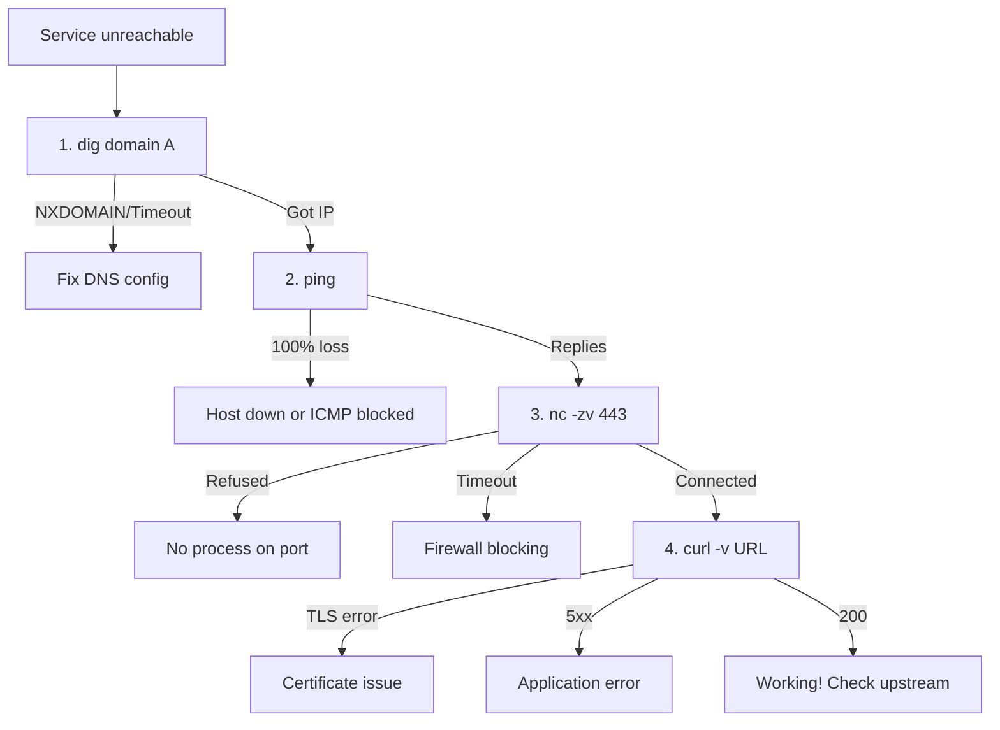

**⚡ TL;DR** - Three commands every engineer must know: 
`ping` (is the host reachable? how long does it take?),
`traceroute` (what path do packets take?), and
`nslookup`/`dig` (what IP does this domain resolve to?).
These three tools cover 80% of initial network diagnosis.

| #017 | Category: Networking | Difficulty: ★☆☆ |
|:---|:---|:---|
| **Depends on:** | IP Address, DNS Overview, OSI Model (Seven Layers) | |
| **Used by:** | Wireshark and tcpdump, Network Performance Testing | |
| **Related:** | Wireshark and tcpdump, Network Latency Sources, DNS Overview | |

---

### 🔥 The Problem This Solves

When a service fails, engineers without network diagnostic
skills face a black box: "it doesn't work." Engineers with
these three tools can answer in 60 seconds: "DNS resolves,
the host is reachable, but TCP port 443 is blocked at the
third hop." That answer directs the fix immediately.

---

### 📘 Textbook Definition

**ping:** Uses ICMP Echo Request/Reply to test reachability
and measure round-trip time (RTT). Validates layer 3 (IP)
connectivity. Does not test TCP connections or application
availability.

**traceroute** (Linux/Mac) / **tracert** (Windows): Sends
packets with incrementally increasing TTL values to discover
each router hop on the path. Uses ICMP Time Exceeded
responses from intermediate routers. Maps the network path
and measures per-hop latency.

**nslookup / dig:** Query DNS servers directly. `nslookup`
is a basic cross-platform tool. `dig` (Domain Information
Groper) is more powerful with detailed output.

---

### ⏱️ Understand It in 30 Seconds

**One line:**
ping = is it reachable? traceroute = which path does it
take? dig/nslookup = what IP does this name resolve to?

**One analogy:**

> Diagnosing a network failure is like debugging why a
> letter didn't arrive:
> - **ping** = "Did any letter I sent reach this address?"
> - **traceroute** = "At which post office did my letter
>   get lost? How long at each step?"
> - **dig** = "Is the address in the phonebook? What's the
>   correct address for this name?"

**One insight:**
These tools test different layers. `dig` tests DNS (layer
7/application). `ping` tests IP reachability (layer 3).
`nc -zv host port` tests TCP (layer 4). Always diagnose
bottom-up: DNS → ping → TCP port test. If DNS fails, ping
will also fail (wrong address). If ping fails, TCP cannot
connect. Each layer depends on the one below it.

---

### 🔩 First Principles Explanation

**How ping works:**

```
┌──────────────────────────────────────────────────────────┐
│  ICMP Echo Request/Reply                                 │
├──────────────────────────────────────────────────────────┤
│  Your machine sends:                                     │
│    ICMP Type 8 (Echo Request) to target IP              │
│    Contains: identifier, sequence number, timestamp     │
│                                                          │
│  Target machine responds:                               │
│    ICMP Type 0 (Echo Reply) back to you                 │
│    Echoes back: identifier, sequence, original data     │
│                                                          │
│  Your machine calculates:                               │
│    RTT = receive_time - send_time                       │
│                                                          │
│  No response → host unreachable, blocked, or down       │
│  High RTT → congestion or long geographic path          │
│  Variable RTT (high mdev) → jitter or congestion        │
└──────────────────────────────────────────────────────────┘
```

**How traceroute works:**

```
┌──────────────────────────────────────────────────────────┐
│  traceroute TTL Probing                                  │
├──────────────────────────────────────────────────────────┤
│  Probe 1: TTL=1, sent to target_ip                      │
│    Router 1 decrements TTL to 0, drops packet,          │
│    sends ICMP "Time Exceeded" back.                     │
│    traceroute records: Router 1's IP + RTT              │
│                                                          │
│  Probe 2: TTL=2, sent to target_ip                      │
│    Router 1 passes, Router 2 drops, ICMP returned.      │
│    traceroute records: Router 2's IP + RTT              │
│                                                          │
│  Probe N: TTL=N, until target_ip responds               │
│    Target responds with ICMP Echo Reply (or UDP error). │
│    traceroute records: target IP + final RTT            │
│                                                          │
│  Each hop: 3 probes sent (3 RTT columns in output)      │
└──────────────────────────────────────────────────────────┘
```

---

### 🧪 Thought Experiment

**SETUP:**
Your monitoring alerts: `https://api.example.com` is down.
Walk through the diagnostic sequence:

**Step 1: DNS check**
```bash
dig api.example.com A
```
- Returns IP: DNS is working. Proceed.
- NXDOMAIN: domain doesn't exist. Check DNS config.
- Timeout: DNS resolver is broken. Check `/etc/resolv.conf`.

**Step 2: IP reachability**
```bash
ping -c 3 <resolved_ip>
```
- Replies received: Layer 3 is good. Proceed.
- No reply: host may be down, or ICMP is blocked.
  (ICMP blocked doesn't mean TCP is broken - proceed anyway.)

**Step 3: TCP port**
```bash
nc -zv <resolved_ip> 443
```
- Connected: Layer 4 is fine. Problem is in the application.
- Connection refused: No process on port 443 (app down).
- Timeout: Firewall blocking port 443.

**Step 4: Application**
```bash
curl -v https://api.example.com/health
```
- HTTP 200: The endpoint works. Problem is elsewhere.
- HTTP 500: Application error. Check app logs.
- TLS error: Certificate problem.

**THE INSIGHT:**
This bottom-up sequence isolates the failing layer in < 2
minutes. Without it, you'd guess: "restart the server"
or "check the logs" - actions that may waste 30 minutes.

---

### 🧠 Mental Model / Analogy

> These tools are like a medical triage kit:
> - **ping** = pulse check. Is the patient alive?
> - **traceroute** = blood pressure at each point in the
>   cardiovascular system. Where is the blockage?
> - **dig** = check the address book. Are you even trying
>   to reach the right patient?
>
> Diagnosis before treatment. You wouldn't prescribe
> treatment without checking vitals first.

---

### 📶 Gradual Depth - Five Levels

**Level 1 - What it is (anyone can understand):**
`ping` checks if a computer can be reached. `traceroute`
shows the path packets take. `nslookup` looks up a website's
IP address from its name.

**Level 2 - How to use it (junior developer):**
Run `ping google.com` to verify internet connectivity.
Run `dig @8.8.8.8 api.example.com` to bypass your local
DNS and check if the domain resolves. Run `traceroute
8.8.8.8` to see if your traffic leaves your network
successfully.

**Level 3 - How it works (mid-level engineer):**
`traceroute` `* * *` lines mean the router at that hop is
not responding to ICMP/UDP probes (firewall). This is
normal for cloud providers' core routers. If `* * *`
appears on hop 5 and then the destination responds on
hop 9, the intermediate router is just filtered - not
broken. The path continues even if some hops don't respond.

**Level 4 - Why it was designed this way (senior/staff):**
`traceroute` on Linux uses UDP probes by default. On MacOS
it uses UDP. Windows `tracert` uses ICMP. `traceroute -T`
(Linux) uses TCP SYN probes to port 80, which is more
likely to traverse firewalls (since port 80 is often
allowed). This is why network engineers use `traceroute
-T` for firewall-traversal path testing.

**Level 5 - Mastery (distinguished engineer):**
MTR (My Traceroute) combines ping and traceroute in
continuous mode, showing real-time packet loss at each hop.
It reveals transient packet loss that a single traceroute
misses. `mtr --report --report-cycles 100 8.8.8.8` shows
100-cycle statistics per hop, making it the standard for
network quality diagnosis (ISP issues, routing instability).

---

### ⚙️ How It Works (Mechanism)

**Complete command reference:**

```bash
# ─────────────────────────────────────────────
# PING - test reachability and measure RTT
# ─────────────────────────────────────────────

# Basic ping (10 packets)
ping -c 10 google.com

# Output:
# PING google.com (142.250.80.78): 56 bytes
# 64 bytes from 142.250.80.78: icmp_seq=1 ttl=55
#   time=5.123 ms
# ...
# 10 packets transmitted, 10 received, 0% packet loss
# rtt min/avg/max/mdev = 4.8/5.1/6.1/0.3 ms
#                                         ^
#                                         mdev = jitter

# Specify packet count and interval
ping -c 5 -i 0.2 google.com   # 5 packets, 0.2s interval

# Test specific MTU (don't fragment)
ping -M do -s 1400 google.com

# ─────────────────────────────────────────────
# TRACEROUTE - map the path
# ─────────────────────────────────────────────

# Default traceroute (UDP on Linux)
traceroute google.com

# TCP SYN probe (bypasses more firewalls)
traceroute -T -p 443 google.com

# ICMP probe (like tracert on Windows)
traceroute -I google.com

# Output:
# 1  192.168.1.1     1.234 ms  1.456 ms  1.678 ms  ← LAN
# 2  10.0.0.1        5.123 ms  5.234 ms  5.345 ms  ← ISP
# 3  * * *            ← hop doesn't respond (filtered)
# 4  142.250.80.78   5.678 ms  5.789 ms  5.890 ms  ← dest

# MTR: continuous traceroute (best for diagnosis)
mtr --report --report-cycles 50 8.8.8.8

# ─────────────────────────────────────────────
# DIG - DNS lookup (preferred over nslookup)
# ─────────────────────────────────────────────

# Basic A record lookup
dig google.com A

# Bypass local resolver, use Google DNS
dig @8.8.8.8 google.com A

# Short output (answer only)
dig +short google.com A

# All record types
dig google.com ANY

# Reverse lookup (IP → hostname)
dig -x 8.8.8.8

# Check nameservers
dig google.com NS

# Trace full resolution path
dig +trace google.com

# Check TTL of cached record
dig google.com +noall +answer
# google.com. 299 IN A 142.250.80.78
#             ^^^ TTL remaining
```

**nslookup (simpler, cross-platform):**

```bash
# Basic lookup
nslookup google.com

# Use specific DNS server
nslookup google.com 8.8.8.8

# Interactive mode
nslookup
> set type=MX
> google.com
```

---

### 🔄 The Complete Picture - End-to-End Flow

**Diagnostic decision tree:**

```
┌──────────────────────────────────────────────────┐
│  Network Diagnosis Decision Tree                 │
├──────────────────────────────────────────────────┤
│  1. dig domain A                                 │
│     └── NXDOMAIN? → Fix DNS record               │
│     └── Timeout? → Fix /etc/resolv.conf or       │
│                    network connectivity          │
│     └── Got IP? → Continue                       │
│                                                  │
│  2. ping <IP>                                    │
│     └── 100% loss? → Host down OR ICMP blocked  │
│     └── Some loss? → Congestion or routing issue │
│     └── High RTT? → Distance or congestion      │
│     └── Replies? → L3 OK, continue              │
│                                                  │
│  3. nc -zv <IP> 443                              │
│     └── Connection refused? → No app on port    │
│     └── Timeout? → Firewall dropping packets    │
│     └── Connected? → L4 OK, app issue           │
│                                                  │
│  4. curl -v https://domain/health                │
│     └── TLS error? → Certificate issue          │
│     └── HTTP 5xx? → Application error           │
│     └── HTTP 200? → Endpoint works (use it)     │
└──────────────────────────────────────────────────┘
```



---

### ⚖️ Comparison Table

| Tool | Tests | Protocol | Info Provided |
|---|---|---|---|
| `ping` | L3 reachability | ICMP | RTT, packet loss |
| `traceroute` | Path to target | ICMP/UDP/TCP | Per-hop RTT, routing |
| `mtr` | Path + packet loss | ICMP | Per-hop continuous stats |
| `dig` | DNS resolution | DNS (UDP/TCP) | Record values, TTL |
| `nc -zv` | TCP port | TCP | Port open/closed/filtered |
| `curl -v` | Full HTTP stack | HTTP/HTTPS | Response headers + body |
| `openssl s_client` | TLS certificate | TLS | Certificate chain |

---

### ⚠️ Common Misconceptions

| Misconception | Reality |
|---|---|
| `ping` failure = server is down | Many hosts block ICMP intentionally (AWS instances without security group allowing ICMP, hardened servers). Use `nc -zv host 443` to test TCP connectivity separately. Ping failure proves ICMP is blocked or host is unreachable. It does NOT prove the service is down. |
| `traceroute` `* * *` = packet is being dropped | `* * *` means the router at that hop is not responding to traceroute probes. The packet may still be forwarded - many routers deprioritize responding to traceroute to protect CPU. If the final destination responds, the path works despite `* * *` hops in the middle. |
| `nslookup` and `dig` are equivalent | `dig` provides much richer output: TTL, authority section, additional section, query time, and server used. `nslookup` is simpler but provides less diagnostic information. Always use `dig` for serious diagnosis. |

---

### 🚨 Failure Modes & Diagnosis

**Asymmetric Routing Causing Mysterious Failures**

**Symptom:** `ping` shows varying RTTs. Some pings return
quickly, others take much longer. `traceroute` shows
different paths on different probes. TCP connections are
slow in one direction.

**Root Cause:** Asymmetric routing: outbound path uses
different routers than the inbound (return) path. This is
normal, but if there's a misconfiguration (e.g., firewall
only allows traffic on one path), connections fail
intermittently.

**Diagnostic Command / Tool:**
```bash
# From target host: trace path back to you
# (requires access to target or reverse traceroute tool)
traceroute <your_public_IP>

# Compare outbound vs inbound path
# Outbound (from you to target):
traceroute target_ip

# Check if RTT variance is in outbound or inbound
# by using timestamps in ping
ping -D -c 20 target_ip
# -D = print timestamp; look for RTT variance pattern

# MTR in bidirectional mode
mtr --report --report-cycles 50 target_ip
# Compare per-hop latency going out vs coming back
```

**Fix:** Usually not something you can fix directly
(routing is controlled by carriers). Report to ISP with
MTR output if systematic. If in your own network, check
routing policies for asymmetric policy routing.

**Prevention:** Monitor with MTR in regular intervals.
Use anycast or BGP-based routing that selects paths based
on actual performance.

---

### 🔗 Related Keywords

**Prerequisites (understand these first):**
- `IP Address` - what ping and traceroute are actually testing
- `DNS Overview` - what dig/nslookup are querying
- `OSI Model (Seven Layers)` - each tool tests a different layer

**Builds On This (learn these next):**
- `Wireshark and tcpdump` - deeper packet analysis beyond
  what ping/traceroute/dig provide
- `Network Latency Sources and Measurement` - systematic
  methodology for measuring all components of latency
- `Network Performance Testing (iperf)` - bandwidth testing
  complements the latency testing of ping

---

### 📌 Quick Reference Card

```
┌──────────────────────────────────────────────────────────┐
│ PING         │ ping -c 10 host                           │
│              │ Tests ICMP (L3). RTT + packet loss.       │
├──────────────┼───────────────────────────────────────────┤
│ TRACEROUTE   │ traceroute host (UDP, Linux/Mac)           │
│              │ tracert host (ICMP, Windows)              │
│              │ traceroute -T -p 443 (TCP SYN, fw-bypass) │
├──────────────┼───────────────────────────────────────────┤
│ DIG          │ dig domain A (basic lookup)               │
│              │ dig @8.8.8.8 domain (bypass local DNS)   │
│              │ dig +trace domain (full resolution)       │
├──────────────┼───────────────────────────────────────────┤
│ NC (TCP test)│ nc -zv host port                          │
│              │ Refused=no app. Timeout=firewall block.   │
├──────────────┼───────────────────────────────────────────┤
│ SEQUENCE     │ dig → ping → nc → curl (bottom-up)       │
├──────────────┼───────────────────────────────────────────┤
│ MTR          │ mtr --report host (best continuous tool)  │
├──────────────┼───────────────────────────────────────────┤
│ ONE-LINER    │ "DNS → IP → port → app. Test each        │
│              │  layer before blaming the next."          │
└──────────────────────────────────────────────────────────┘
```

**If you remember only 3 things:**
1. Bottom-up diagnosis: `dig` (DNS) → `ping` (L3) →
   `nc -zv` (L4) → `curl` (L7). Each confirms one layer.
2. `ping` failure ≠ service down. ICMP may be blocked.
   Test TCP separately with `nc -zv host port`.
3. `traceroute` `* * *` ≠ packet dropped. Router ignores
   probes but still forwards packets. If destination
   responds, path works.

**Interview one-liner:**
"The diagnostic sequence: `dig @8.8.8.8 domain` to bypass
local DNS and confirm resolution, `ping` to test L3
reachability, `nc -zv host port` to test TCP port, `curl
-v` to test the full application stack. `traceroute` maps
the path and per-hop latency. MTR combines traceroute with
continuous packet-loss monitoring - the best tool for
identifying network quality issues."

---

### 💎 Transferable Wisdom

**Reusable Engineering Principle:**
Layered systems require layered diagnosis. Each layer
provides a specific invariant: DNS gives the address, IP
gives reachability, TCP gives port availability, TLS gives
certificate validity, HTTP gives application response.
Testing out of order wastes time. This bottom-up principle
applies to: database debugging (connection → query → index
→ data), service mesh diagnosis (DNS → connectivity →
routing → policy → application), and distributed system
debugging (health check → networking → service discovery →
application logic).

---

### 💡 The Surprising Truth

`traceroute`'s `* * *` responses are the most misunderstood
output in all of networking. Countless production incidents
have been misdiagnosed as "routing problem between hop 5
and hop 6" when the actual issue was elsewhere. The hops
showing `* * *` are perfectly healthy routers that simply
rate-limit or disable ICMP Time Exceeded responses to
protect CPU. Network equipment handles billions of packets
per second - generating an ICMP response for every TTL-
exceeded traceroute probe would be expensive. Almost all
modern core internet routers silently drop TTL=0 packets
without responding. Only border and edge routers typically
respond. This means the path you see in traceroute is
never the complete picture.

---

### ✅ Mastery Checklist

**You've mastered this when you can:**
1. **EXPLAIN** how traceroute uses TTL to map a path,
   and why `* * *` does NOT mean the packet is dropped.
2. **DEBUG** a failed connection in under 2 minutes using
   the bottom-up sequence: dig → ping → nc → curl.
3. **DECIDE** when to use `dig +trace` vs `dig @8.8.8.8`
   and what each reveals about the DNS infrastructure.
4. **BUILD** the MTR report interpretation: what `Loss%`
   and `Avg` mean at each hop, and what constitutes a real
   problem vs normal behavior.
5. **EXTEND** the starter kit to `tcpdump` when these tools
   don't provide enough detail.

---

### 🧠 Think About This Before We Continue

**Q1.** You run `ping -c 10 api.example.com` and see 30%
packet loss. You run `curl https://api.example.com` and
the response returns in 200ms with HTTP 200. What do you
conclude? Is there a network problem? What is the most
likely explanation for ping loss without curl failures?

*Hint: The server or an intermediate firewall may be
rate-limiting or deprioritizing ICMP Echo Requests. TCP
connections (curl) are higher priority than ICMP in most
QoS configurations.*

**Q2.** Your traceroute to a remote server shows:
```
1  192.168.1.1      1ms  1ms  1ms
2  10.0.0.1         5ms  5ms  5ms
3  * * *
4  * * *
5  * * *
6  10.20.30.40     98ms  99ms 100ms
```
Is there a problem at hops 3, 4, and 5? How do you
distinguish "routers not responding to probes" from
"actual packet loss at those hops"?

*Hint: The RTT jump from hop 2 (5ms) to hop 6 (98ms) is
~93ms. This is the time through hops 3-5 even though they
don't respond. The path works - it's just silent hops.*

**Q3.** [Hands-On] Run the full diagnostic sequence on
a service that is currently working (e.g., `github.com`):
1. `dig @8.8.8.8 github.com A` - what IP(s) do you get?
2. `ping -c 5 <first_IP>` - what RTT and packet loss?
3. `nc -zv github.com 443` - does it connect?
4. `traceroute -T -p 443 github.com` - how many hops?
5. `curl -v https://github.com/ 2>&1 | head -30` - what
   TLS version negotiated?