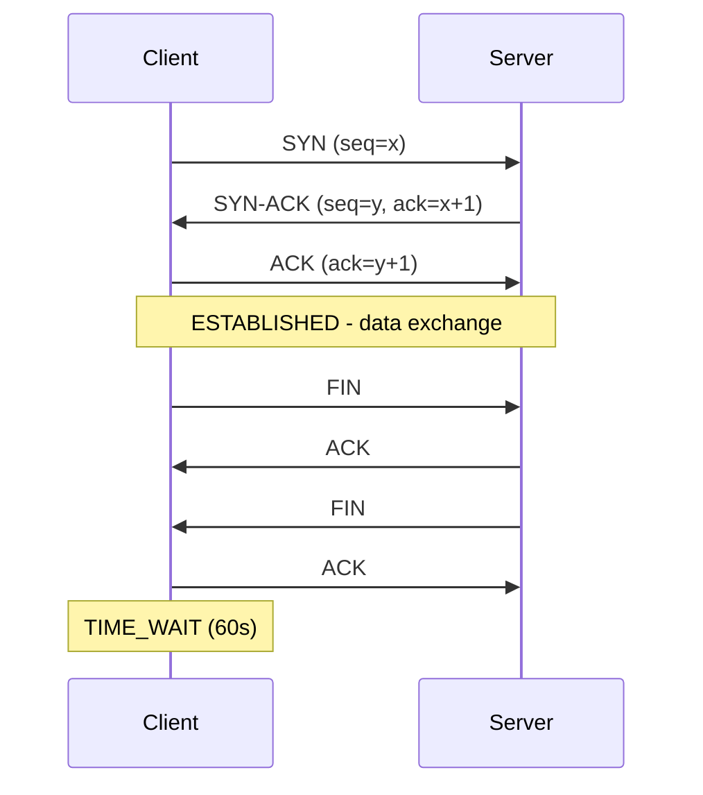

**⚡ TL;DR** - TCP is the reliable, ordered, error-checked
byte-stream transport protocol that powers HTTP, HTTPS,
SSH, and virtually every application that cannot tolerate
lost data. It achieves reliability through sequence numbers,
acknowledgments, retransmission, and flow/congestion control
at the cost of connection overhead and head-of-line blocking.

| #020 | Category: Networking | Difficulty: ★★☆ |
|:---|:---|:---|
| **Depends on:** | The Networking Problem, Client-Server Model, IP Address, Port Number, Packet Structure | |
| **Used by:** | TCP Three-Way Handshake, TCP Connection Lifecycle, TCP Congestion Control, Flow vs Congestion, Connection Pooling | |
| **Related:** | UDP, TCP Three-Way Handshake, TCP Connection Lifecycle, TCP Congestion Control, Nagle's Algorithm | |

---

### 🔥 The Problem This Solves

IP packets are unreliable: they can be lost, reordered,
duplicated, or corrupted. Building reliable applications
on top of unreliable IP would require every developer to
implement their own retransmission, ordering, and error
handling. TCP solves this once, at the transport layer,
so every application using TCP gets reliability for free.
The cost is connection setup overhead and the complexity
that comes from state management.

---

### 📘 Textbook Definition

**TCP (Transmission Control Protocol)** is a connection-
oriented, reliable, ordered, error-checked byte-stream
protocol defined in RFC 793 (1981), updated by RFC 9293
(2022). It provides: (1) **reliability** via sequence
numbers and acknowledgments (retransmit lost segments),
(2) **ordered delivery** (seq numbers allow reordering
on arrival), (3) **error detection** (16-bit checksum),
(4) **flow control** (receive window prevents sender from
overwhelming receiver), (5) **congestion control** (slow
start + AIMD prevents network saturation). A TCP
connection is established by 3-way handshake and terminated
by 4-way FIN/ACK exchange.

---

### ⏱️ Understand It in 30 Seconds

**One line:**
TCP is a contract: "I will deliver every byte in order,
exactly once, or tell you if I can't. The price is a
connection, state, and extra round trips."

**One analogy:**

> TCP is certified mail with tracking. If a package is
> lost, the sender retransmits it. Packages are numbered
> so they can be assembled in order even if they arrive
> out of sequence. The recipient sends receipts (ACKs).
> The sender slows down if the recipient's mailbox is full
> (flow control) and slows down if the road is congested
> (congestion control).

**One insight:**
TCP is a byte stream, not a message protocol. If you write
"Hello" and "World" as two separate sends, the receiver
might read "Hel" and "loWorld" in one `recv()` call. This
catches many developers off guard. HTTP uses `Content-
Length` or chunked encoding as the message framing layer
on top of TCP because TCP itself provides none.

---

### 🔩 First Principles Explanation

**THE FIVE TCP GUARANTEES:**

```
┌──────────────────────────────────────────────────────────┐
│  TCP Five Guarantees                                     │
├──────────────────────────────────────────────────────────┤
│  1. RELIABILITY                                          │
│     Every byte sent is received or the connection fails. │
│     Mechanism: seq number + ACK + retransmit on timeout  │
│                                                          │
│  2. ORDERED DELIVERY                                     │
│     Bytes received in same order as sent.               │
│     Mechanism: sequence numbers + receive buffer sort   │
│                                                          │
│  3. ERROR DETECTION                                      │
│     Corrupted segments are discarded and retransmitted. │
│     Mechanism: 16-bit checksum over header + data       │
│                                                          │
│  4. FLOW CONTROL                                         │
│     Sender cannot overflow receiver's buffer.          │
│     Mechanism: receiver advertises window size (rwnd)  │
│     Sender cannot send > rwnd bytes unacknowledged      │
│                                                          │
│  5. CONGESTION CONTROL                                   │
│     Sender adapts to network capacity.                  │
│     Mechanism: cwnd (congestion window) + slow start   │
│     + AIMD (Additive Increase Multiplicative Decrease)  │
└──────────────────────────────────────────────────────────┘
```

**TCP segment header:**

```
┌──────────────────────────────────────────────────────────┐
│  TCP Header (20 bytes minimum)                           │
├─────────────────────────────────────────────────────────-┤
│  Source Port     (16 bits) | Destination Port (16 bits)  │
│  Sequence Number (32 bits)                               │
│  Acknowledgment  (32 bits)                               │
│  Data Offset (4) | Reserved | Flags (9 bits)             │
│    Flags: NS CWR ECE URG ACK PSH RST SYN FIN            │
│  Window Size     (16 bits)                               │
│  Checksum        (16 bits) | Urgent Pointer (16 bits)    │
│  Options (0-40 bytes): MSS, window scaling, SACK, TFO   │
└──────────────────────────────────────────────────────────┘
```

---

### 🧪 Thought Experiment

**SETUP:**
Sending "Hello World" (11 bytes) over TCP.

The OS doesn't necessarily send one 11-byte TCP segment.
It might:
- Buffer the 11 bytes in the send buffer
- If Nagle's algorithm is active, it waits up to 200ms to
  batch with other small writes
- When it sends, the segment might include ISN+0 to ISN+10
  (sequence numbers for the 11 bytes)
- The receiver's `recv()` call might return "Hello " (6
  bytes) and "World\n" (6 bytes) in separate calls
- OR return "Hello World" (11 bytes) in one call
- OR return "He" "llo W" "orld" in three calls

**THE INSIGHT:**
This is the "TCP is a byte stream" problem. The application
has no guarantee about how its writes map to reads on the
other side. This is why protocols like HTTP use framing
(Content-Length, chunked transfer encoding) and Redis uses
the RESP protocol (each command prefixed with length) -
to give applications message boundaries on top of TCP's
byte stream.

---

### 🧠 Mental Model / Analogy

> TCP is a reliable conveyor belt:
> - You place numbered packages on the belt (seq numbers)
> - The receiver sends back a receipt for every package
>   received (ACKs)
> - If you don't get a receipt within a timeout, you resend
>   (retransmit)
> - The receiver's holding area has limited capacity (rwnd
>   = receive window). The belt must slow down if the
>   holding area is full (flow control).
> - If the warehouse is congested (network congestion),
>   the belt slows down gradually (congestion control).
>
> The belt is one-way: "conveyor belt" is per direction.
> TCP has separate buffers for each direction.

---

### 📶 Gradual Depth - Five Levels

**Level 1 - What it is (anyone can understand):**
TCP makes sure every piece of data arrives, in order, no
matter what. It's what HTTP, SSH, and email use. The cost:
a small delay to set up the connection and confirm delivery.

**Level 2 - How to use it (junior developer):**
TCP is the default for application protocols. Use TCP for:
HTTP clients, database connections, SSH, file transfer.
The OS manages TCP for you via sockets. Key thing to know:
TCP is byte-stream, so implement your own message framing
(length prefix or delimiter). Always set `TCP_NODELAY`
for interactive applications (SSH, gaming, trading) - it
disables Nagle's algorithm which batches small packets.

**Level 3 - How it works (mid-level engineer):**
TCP maintains a sliding window: the sender can have at
most min(cwnd, rwnd) bytes "in flight" (sent but not yet
ACKed). `cwnd` is the congestion window (network capacity
estimate). `rwnd` is the receiver's advertised window
(buffer space). When a segment is lost (timeout or 3
duplicate ACKs), the sender reduces `cwnd` (slow start
restart or halved). This adaptive window is why TCP
"fills up" the available bandwidth over many RTTs.

**Level 4 - Why it was designed this way (senior/staff):**
TCP's design reflects the end-to-end principle: the network
(routers) should be simple (forward packets). Complexity
(reliability, ordering, congestion control) belongs at the
endpoints. This allows routers to be replaced (IPv4 → IPv6,
copper → fiber) without changing TCP. The trade-off: TCP
is implemented in the OS kernel, so changing TCP behavior
requires kernel updates. QUIC (HTTP/3) moved reliability
to user space precisely to escape this constraint.

**Level 5 - Mastery (distinguished engineer):**
TCP SACK (Selective Acknowledgment, RFC 2018) allows the
receiver to inform the sender exactly which segments were
received, not just the highest contiguous segment. Without
SACK, a single lost segment forces retransmission of
everything from the lost segment onward. With SACK, only
the specific missing segments are retransmitted. SACK is
critical for performance on lossy links. Modern Linux
enables SACK by default (`sysctl net.ipv4.tcp_sack = 1`).
Disabling SACK to "simplify debugging" is a common mistake
that causes production performance regression on mobile
networks with 1-2% packet loss.

---

### ⚙️ How It Works (Mechanism)

**TCP connection lifecycle:**

```
┌──────────────────────────────────────────────────────────┐
│  TCP Connection States                                   │
├──────────────────────────────────────────────────────────┤
│                                                          │
│  CLOSED → LISTEN (server: socket+bind+listen)           │
│                                                          │
│  3-Way Handshake (connect):                             │
│  Client: CLOSED → SYN_SENT    SYN →                    │
│  Server: LISTEN → SYN_RCVD         ← SYN-ACK           │
│  Client: SYN_SENT → ESTABLISHED  ACK →                  │
│  Server: SYN_RCVD → ESTABLISHED                         │
│                                                          │
│  Data transfer: ESTABLISHED (both sides)                │
│                                                          │
│  4-Way Close (active closer initiates FIN):             │
│  Client: FIN_WAIT_1    FIN →                            │
│  Server: CLOSE_WAIT         ← ACK                       │
│  Server: LAST_ACK      FIN →                            │
│  Client: TIME_WAIT          ← ACK                       │
│  [Wait 2*MSL = 60s] → CLOSED                            │
└──────────────────────────────────────────────────────────┘
```



**Linux TCP diagnostics:**

```bash
# Show TCP connections and their states
ss -tnp

# Show TIME_WAIT count (important for port exhaustion)
ss -tn state time-wait | wc -l

# TCP statistics (retransmits, out-of-order, etc.)
ss -s   # summary
netstat -s | grep -i "failed\|retransmit\|error"

# TCP socket buffer usage per connection
ss -tnm   # -m = memory usage

# TCP send/receive buffer configuration
sysctl net.ipv4.tcp_rmem   # min, default, max receive
sysctl net.ipv4.tcp_wmem   # min, default, max send
sysctl net.ipv4.tcp_mem    # total TCP memory

# Check TCP SACK, timestamps, window scaling
sysctl net.ipv4.tcp_sack         # selective ACK
sysctl net.ipv4.tcp_window_scaling  # large windows
sysctl net.ipv4.tcp_timestamps   # RTT measurement

# Retransmission stats (key health metric)
netstat -s | grep "segments retransmited"
# High value = packet loss in the network
```

**Wrong vs Right - TCP byte stream framing:**

```python
# BAD: assuming one write = one read
def send_message(sock, message):
    sock.sendall(message.encode())

def receive_message(sock):
    data = sock.recv(4096)   # BAD: may get partial msg
    return data.decode()

# GOOD: length-prefix framing
import struct

def send_message(sock, message):
    msg = message.encode()
    # Prefix with 4-byte length
    sock.sendall(struct.pack('>I', len(msg)) + msg)

def receive_message(sock):
    # Read exactly 4 bytes for length
    raw_len = recv_all(sock, 4)
    msg_len = struct.unpack('>I', raw_len)[0]
    # Read exactly msg_len bytes
    return recv_all(sock, msg_len).decode()

def recv_all(sock, n):
    """Read exactly n bytes from socket."""
    data = b''
    while len(data) < n:
        chunk = sock.recv(n - len(data))
        if not chunk:
            raise ConnectionError("Connection closed")
        data += chunk
    return data
```

---

### 🔄 The Complete Picture - End-to-End Flow

**TCP slow start and throughput ramp-up:**

```
┌──────────────────────────────────────────────────────────┐
│  TCP Congestion Window Growth                            │
├──────────────────────────────────────────────────────────┤
│  RTT 1: cwnd=1 MSS → send 1 segment                    │
│  RTT 2: cwnd=2 MSS → send 2 segments (doubled)         │
│  RTT 3: cwnd=4 MSS → send 4 segments (doubled)         │
│  ...                                                     │
│  At ssthresh: switch to congestion avoidance             │
│  cwnd += 1 per RTT (linear growth)                      │
│                                                          │
│  On packet loss: cwnd halved (fast recovery)            │
│  or cwnd=1 restart (timeout)                            │
│                                                          │
│  Consequence: TCP takes many RTTs to reach full          │
│  bandwidth. On 100ms RTT, slow start to 10Mbps takes   │
│  ~5 seconds. This is why HTTP keep-alive exists:        │
│  reusing an existing connection avoids slow start.      │
└──────────────────────────────────────────────────────────┘
```

**WHAT CHANGES AT SCALE:**
At 10,000 connections, the default TCP buffers (87KB per
connection) consume 87KB × 10,000 = 870MB RAM just for
receive buffers. Linux auto-tunes buffer sizes but you
must set `net.core.rmem_max` and `net.ipv4.tcp_rmem` to
allow large windows for high-BDP connections. At 100,000
connections, connection memory is a significant fraction
of available RAM. This is why UDP-based protocols (QUIC,
gaming servers) can handle more concurrent connections:
no per-connection kernel state.

---

### ⚖️ Comparison Table

| Feature | TCP | UDP | QUIC |
|---|---|---|---|
| **Connection** | Required (3-way) | None | 1 RTT (TLS integrated) |
| **Reliability** | Full (retransmit) | None | Full (user space) |
| **Ordering** | Guaranteed | Not guaranteed | Per-stream guaranteed |
| **HOL blocking** | Yes (all streams) | No | No (per-stream) |
| **Header size** | 20+ bytes | 8 bytes | ~20 bytes (variable) |
| **Congestion control** | Yes (kernel) | No | Yes (user space) |
| **TLS integration** | Separate | Separate | Integrated |
| **0-RTT reconnect** | No (TFO experimental) | N/A | Yes |
| **Use case** | HTTP, SSH, DB, email | DNS, streaming, gaming | HTTP/3, media |

---

### ⚠️ Common Misconceptions

| Misconception | Reality |
|---|---|
| TCP guarantees delivery | TCP guarantees delivery AS LONG AS THE CONNECTION STAYS UP. If the connection drops (network failure), data in flight is lost and the application gets a socket error. TCP does not persist across disconnections. |
| TCP is message-oriented | TCP is a byte stream. There are no message boundaries. Two `send()` calls may arrive as one `recv()`. Always implement message framing in your application protocol. |
| Retransmit timeout is fast | Default TCP retransmit timeout (RTO) starts at 1 second and doubles (exponential backoff) up to 120 seconds. A single lost packet can cause 1-second latency spike. SACK helps but doesn't eliminate this. |
| TCP send buffer = what was sent | Data remains in the TCP send buffer until ACKed. If you send 100KB and the receiver ACKs 50KB, 50KB is still in the send buffer. High send buffer usage = network congestion or slow receiver. |

---

### 🚨 Failure Modes & Diagnosis

**TCP Retransmit Storms - High Latency Under Load**

**Symptom:** Latency spikes from 5ms to 500ms+. CPU usage
is normal. Bandwidth appears normal. `netstat -s` shows
high retransmit count. Happens intermittently, correlates
with traffic spikes.

**Root Cause:** Packet loss in the network causes TCP
retransmits. A 1% packet loss causes significant latency
increase due to retransmit timeout (minimum 200ms). If
many connections experience loss simultaneously (switch
buffer overflow, ISP congestion), application latency
spikes across the board.

**Diagnostic Command / Tool:**
```bash
# Check retransmit count (run twice, compare delta)
netstat -s | grep "segments retransmited"
# If delta > 0.1% of total segments: packet loss issue

# Check per-connection retransmits
ss -ti
# Look for: retrans:N/M fields in connection detail

# System-wide packet loss (if you have monitoring)
# Check network interface error counters
ip -s link show eth0
# Look for: RX errors, drops, overruns
# TX errors, drops, carrier

# Test actual packet loss
mtr --report --report-cycles 100 target_ip
# Look for Loss% at each hop
```

**Fix:** If packet loss is at the network (not just one
hop), escalate to network team. Check switch buffer
utilization. Check for duplex mismatch (`ip link show`
should show "FULL-duplex"). Tune TCP congestion algorithm
(`sysctl net.ipv4.tcp_congestion_control = bbr` for
long-distance links).

**Prevention:** Monitor `netstat -s` retransmit rate.
Alert at > 0.1% retransmit rate. Use BBR congestion
control for cross-region connections.

---

**TCP Connection Table Full (conntrack overflow)**

**Symptom:** New connections fail with "no buffer space
available" or clients get no response. Existing connections
continue to work. Affects all new connections simultaneously.

**Root Cause:** Linux `nf_conntrack` table is full. Default
maximum: 65,536 entries. Under high connection rate (DDoS,
legitimate high traffic), table fills, and new connections
are dropped without error to sender.

**Diagnostic Command / Tool:**
```bash
# Check conntrack table usage
cat /proc/sys/net/netfilter/nf_conntrack_count
# If close to nf_conntrack_max: problem

cat /proc/sys/net/netfilter/nf_conntrack_max
# Increase if needed

# Check syslog for conntrack overflow
dmesg | grep "nf_conntrack: table full"

# Count connections by state
ss -tn | awk '{print $1}' | sort | uniq -c
# Many SYN_RECV → SYN flood
# Many TIME_WAIT → normal but check if exhausting ports
```

**Fix:**
```bash
# Increase conntrack max
sysctl -w net.netfilter.nf_conntrack_max=524288

# Reduce TIME_WAIT timeout (default 60s)
sysctl -w net.ipv4.tcp_fin_timeout=30

# Enable TIME_WAIT reuse for outbound
sysctl -w net.ipv4.tcp_tw_reuse=1
```

---

### 🔗 Related Keywords

**Prerequisites (understand these first):**
- `The Networking Problem` - why reliability is needed
- `Client-Server Model` - the pattern TCP serves
- `IP Address` + `Port Number` - TCP's addressing scheme
- `Packet Structure` - TCP header in context

**Builds On This (learn these next):**
- `TCP Three-Way Handshake` - connection setup in detail
- `TCP Connection Lifecycle and States` - all 11 TCP states
- `TCP Congestion Control` - slow start, AIMD, BBR
- `TCP Flow Control vs Congestion Control` - the two window
  mechanisms distinguished

**Alternatives / Comparisons:**
- `UDP (User Datagram Protocol)` - the connectionless
  alternative without TCP's guarantees
- `HTTP/3 and QUIC Protocol` - QUIC providing TCP-like
  reliability over UDP in user space

---

### 📌 Quick Reference Card

```
┌──────────────────────────────────────────────────────────┐
│ WHAT IT IS   │ Reliable, ordered, byte-stream transport  │
│              │ with flow and congestion control          │
├──────────────┼───────────────────────────────────────────┤
│ CONNECTION   │ 3-way handshake (SYN/SYN-ACK/ACK)        │
│              │ 4-way close (FIN/ACK/FIN/ACK + TIME_WAIT) │
├──────────────┼───────────────────────────────────────────┤
│ RELIABILITY  │ Seq numbers + ACK + retransmit on timeout │
│              │ SACK for selective retransmit             │
├──────────────┼───────────────────────────────────────────┤
│ KEY INSIGHT  │ TCP is a byte STREAM. No message          │
│              │ boundaries. Add framing in your protocol. │
├──────────────┼───────────────────────────────────────────┤
│ ANTI-PATTERN │ Assuming one write = one read.            │
│              │ Not using SO_REUSEADDR on server socket.  │
├──────────────┼───────────────────────────────────────────┤
│ DIAGNOSTIC   │ ss -tnp (connections), ss -s (stats),    │
│              │ netstat -s | grep retrans, ss -ti         │
├──────────────┼───────────────────────────────────────────┤
│ TRADE-OFF    │ Reliability + ordering = 3-way handshake  │
│              │ overhead + HOL blocking. Use UDP/QUIC     │
│              │ when these costs exceed benefits.         │
├──────────────┼───────────────────────────────────────────┤
│ ONE-LINER    │ "TCP: every byte arrives in order, once.  │
│              │  Cost: connection + RTTs + state."        │
├──────────────┼───────────────────────────────────────────┤
│ NEXT EXPLORE │ TCP Three-Way Handshake → TCP States →    │
│              │ TCP Congestion Control                    │
└──────────────────────────────────────────────────────────┘
```

**If you remember only 3 things:**
1. TCP guarantees: reliability (retransmit), ordering (seq),
   flow control (rwnd), congestion control (cwnd). It is a
   BYTE STREAM - no message boundaries.
2. Connection = 3-way handshake (1 RTT). Teardown = 4-way
   FIN + TIME_WAIT (60s). TIME_WAIT is normal and prevents
   stale packets from corrupting new connections.
3. Retransmit rate > 0.1% signals packet loss. Check with
   `netstat -s | grep retrans`. High TIME_WAIT count is
   normal for busy servers; port exhaustion is the issue
   to watch for.

**Interview one-liner:**
"TCP provides reliable, ordered, error-checked delivery
of a byte stream via sequence numbers, acknowledgments,
and retransmission. It uses flow control (receiver window
prevents buffer overflow) and congestion control (cwnd
slow-start + AIMD prevents network saturation). TCP is
a byte stream - not message-oriented - so application
protocols add their own framing (HTTP Content-Length,
Redis RESP). The key trade-offs vs UDP: one RTT connection
overhead, head-of-line blocking, and per-connection kernel
state memory. QUIC moves TCP-like reliability to user space
over UDP to escape these constraints."

---

### 💎 Transferable Wisdom

**Reusable Engineering Principle:**
Reliability through acknowledgment and retransmission is
a universal pattern. The same principle appears in: Kafka
consumer offsets (ACK after processing, not just receipt),
message queues with at-least-once delivery, gRPC bidirectional
streaming (application-level ACKs), database transaction
commits (WAL durability before commit ACK), and HTTP
idempotent retry logic. When building any distributed system
that requires reliability, you are essentially re-implementing
a subset of TCP at a higher abstraction level.

**Industry applications:**
- **Database replication** - primary → replica replication
  uses TCP (or TCP-like reliability in Raft/Paxos) to
  guarantee every write is replicated.
- **QUIC protocol** - Google's alternative to TCP, runs over
  UDP, implements all of TCP's reliability + TLS in user space.
  Powers HTTP/3 and Google's internal RPCs.

---

### 💡 The Surprising Truth

TCP's congestion control algorithm (slow start + AIMD) was
invented in 1988 by Van Jacobson at Lawrence Berkeley Labs
in response to a series of congestion collapses on the
ARPANET in 1986-1988. The internet reduced bandwidth by
1000x during these collapses. Before Van Jacobson's fix,
the only congestion response was... nothing. TCP would keep
sending at full rate, causing more loss, which caused more
retransmits, which caused more congestion. Van Jacobson
fixed the internet in a single afternoon in October 1988
by adding 40 lines of C code to BSD's TCP implementation.
The RFC documenting this was published three years later.
Modern BBR (Bottleneck Bandwidth and RTT) congestion control,
deployed at Google in 2016, replaced AIMD for high-bandwidth
long-distance connections, improving throughput by up to
2000% on satellite links.

---

### ✅ Mastery Checklist

**You've mastered this when you can:**
1. **EXPLAIN** the 5 TCP guarantees (reliability, ordering,
   error detection, flow control, congestion control) with
   the mechanism for each.
2. **DEBUG** TCP retransmit issues using `ss -s` and
   `netstat -s`, correlating retransmit rate with latency
   spikes.
3. **DECIDE** between TCP and UDP for a given protocol,
   articulating the specific trade-off (HOL blocking vs
   reliability, connection overhead vs simplicity).
4. **BUILD** correct TCP message framing code using length-
   prefix protocol design.
5. **EXTEND** TCP concepts to explain why QUIC moves
   reliability to user space and what specific TCP
   limitations it solves.

---

### 🧠 Think About This Before We Continue

**Q1.** You're building a multiplayer game that sends 60
position updates per second, each about 50 bytes. If a
packet is lost, re-sending an old position update is
WORSE than ignoring the loss (old position causes jitter).
Should you use TCP or UDP? What reliability mechanism,
if any, should you add at the application layer?

*Hint: TCP's automatic retransmit causes HOL blocking -
50ms stall waiting for a retransmit while newer updates
queue behind it. UDP + application-level sequence numbers
(drop old, accept new) is the right answer.*

**Q2.** A service makes 1,000 requests/second to a backend.
Each request opens a new TCP connection (no connection
pooling). Each connection requires a 3-way handshake
(1 RTT = 10ms). What fraction of each request's total
latency is just handshake overhead? What is the total
handshake overhead per second? How does connection pooling
eliminate this?

*Hint: 1 RTT = 10ms per new connection × 1000/sec = 10
seconds worth of handshake delay per second. Connection
pooling maintains persistent connections - subsequent
requests skip the handshake entirely.*

**Q3.** [Hands-On] Run a large file download while
monitoring TCP retransmits:
```bash
# Terminal 1: monitor retransmits
watch -n 1 "netstat -s | grep retransmited"
# Terminal 2: download
curl -o /dev/null https://speed.cloudflare.com/__down\
?bytes=100000000
```
Does the retransmit counter increase? Compare the download
speed you achieve vs your theoretical bandwidth. If they
differ, what accounts for the gap? (Hint: check
`/proc/net/netstat` for TCPLostRetransmit and TCPFastRetrans.)