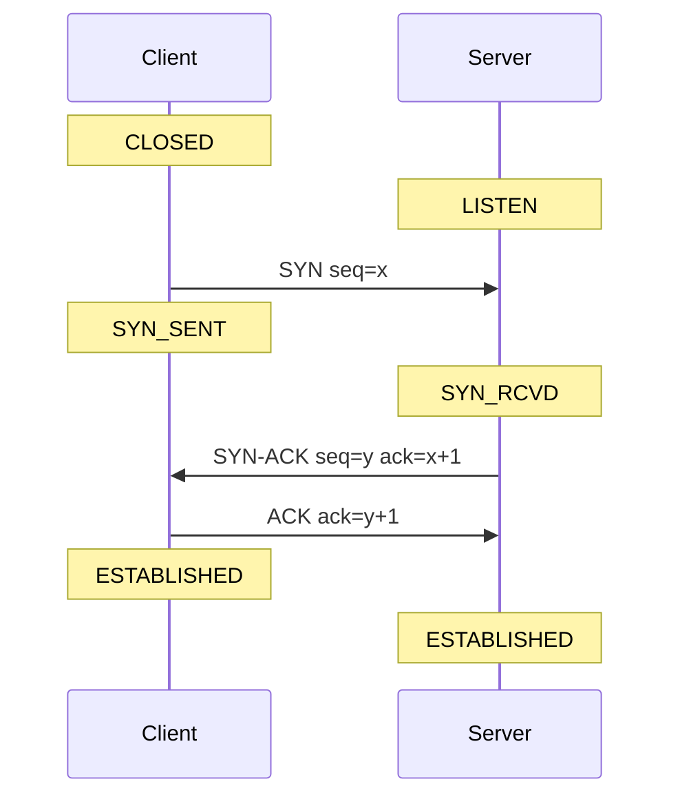

**⚡ TL;DR** - The TCP three-way handshake (SYN → SYN-ACK
→ ACK) establishes a connection by synchronizing sequence
numbers and confirming reachability in both directions.
It costs exactly 1 RTT. This cost makes TCP unsuitable for
single-packet request-response (DNS uses UDP instead), and
is why HTTP keep-alive and connection pooling exist - to
reuse the already-established connection for multiple
requests.

| #022 | Category: Networking | Difficulty: ★★☆ |
|:---|:---|:---|
| **Depends on:** | TCP, Port Number | |
| **Used by:** | TCP Connection Lifecycle and States, TLS Handshake Deep Dive, Connection Pooling | |
| **Related:** | TCP, TCP Connection Lifecycle and States, TLS Handshake Deep Dive | |

---

### 🔥 The Problem This Solves

Before TCP can transfer data reliably, both endpoints must
agree on: (1) an initial sequence number (ISN) for each
direction, (2) the receive window size, and (3) TCP options
like MSS and window scaling. Neither side can just start
sending data because: (a) the server might not be listening,
(b) sequence numbers must be synchronized to enable reliable
delivery, (c) the server needs to confirm the client's
address is reachable. The 3-way handshake solves all three
with the minimum possible round trips: one RTT.

---

### 📘 Textbook Definition

The **TCP three-way handshake** is the connection
establishment procedure requiring three segments:
1. **SYN** - Client sends a segment with the SYN flag
   set, containing the client's ISN (Initial Sequence
   Number) and TCP options.
2. **SYN-ACK** - Server responds with both SYN and ACK
   flags set, containing the server's own ISN and ACK
   for client's ISN+1.
3. **ACK** - Client sends a final ACK, acknowledging the
   server's ISN+1. Connection is now ESTABLISHED.

After step 3, both sides have exchanged ISNs and either
side can send data. The client can piggyback data with
the ACK in step 3 (TCP Fast Open does this).

---

### ⏱️ Understand It in 30 Seconds

**One line:**
Three messages to agree on sequence numbers and confirm
both directions work. Takes exactly 1 RTT.

**The math:**

```
Client sends SYN at t=0
Server receives SYN at t=RTT/2
Server sends SYN-ACK at t=RTT/2
Client receives SYN-ACK at t=RTT
Client sends ACK at t=RTT → connection ESTABLISHED
Data can flow at t=RTT

Total connection setup cost = 1 RTT
```

**Why this matters:**
On a 10ms RTT connection making 1000 requests/second with
no connection reuse, just handshakes cost 10ms × 1000 =
10 seconds of delay per second. Connection pooling
eliminates this: the handshake is paid once, then every
subsequent request reuses the connection. This is the
primary motivation for HTTP keep-alive and database
connection pools.

---

### 🔩 First Principles Explanation

**The full 3-way exchange with sequence numbers:**

```
┌──────────────────────────────────────────────────────────┐
│  TCP 3-Way Handshake - Detailed                          │
├──────────────────────────────────────────────────────────┤
│                                                          │
│  Client (CLOSED → SYN_SENT)                              │
│  ┌─────────────────────────────────────────────────┐    │
│  │ SYN segment:                                    │    │
│  │   Flags: SYN                                    │    │
│  │   Seq: x (random ISN, e.g. 3274891520)          │    │
│  │   Ack: 0 (no ack yet)                           │    │
│  │   Win: 64240 (receive buffer)                   │    │
│  │   Options: MSS=1460, SACK_OK, WS=128            │    │
│  └─────────────────────────────────────────────────┘    │
│              ─────────────────────────────────>          │
│                                                          │
│  Server (LISTEN → SYN_RCVD)                              │
│  ┌─────────────────────────────────────────────────┐    │
│  │ SYN-ACK segment:                                │    │
│  │   Flags: SYN, ACK                               │    │
│  │   Seq: y (server's random ISN)                  │    │
│  │   Ack: x+1 (client's seq + 1)                   │    │
│  │   Win: 65535                                    │    │
│  │   Options: MSS=1460, SACK_OK, WS=128            │    │
│  └─────────────────────────────────────────────────┘    │
│              <─────────────────────────────────          │
│                                                          │
│  Client (SYN_SENT → ESTABLISHED)                         │
│  ┌─────────────────────────────────────────────────┐    │
│  │ ACK segment:                                    │    │
│  │   Flags: ACK                                    │    │
│  │   Seq: x+1                                      │    │
│  │   Ack: y+1 (server's seq + 1)                   │    │
│  │   (may include first data bytes here)           │    │
│  └─────────────────────────────────────────────────┘    │
│              ─────────────────────────────────>          │
│                                                          │
│  Server: ESTABLISHED (receives ACK)                      │
└──────────────────────────────────────────────────────────┘
```



**Why random ISN?**
TCP ISNs must be random to prevent TCP hijacking attacks.
If ISNs were predictable (e.g., always start at 0), an
attacker on the same network could inject forged ACKs with
the correct sequence number, hijacking the connection.
Modern OS use cryptographically strong ISN generation
(RFC 6528 - ISN based on keyed hash of 4-tuple + time).

**What the options negotiate:**
- **MSS (Max Segment Size)** - largest data payload allowed
  per segment (typically 1460 bytes for Ethernet). Both
  sides announce MSS; minimum is used.
- **SACK (Selective Acknowledgment)** - enables selective
  retransmit (not just GBN). Both sides must advertise.
- **Window Scaling** - allows windows > 64KB (needed for
  high-bandwidth × latency links). Negotiated once during
  handshake only.
- **Timestamps** - enables RTT measurement and PAWS
  (protection against wrapped sequence numbers)

---

### 🧪 Thought Experiment

**SETUP:**
Your HTTPS connection to `api.example.com` (50ms RTT):

Timeline from your browser pressing "send request":
```
t=0ms     : SYN sent (3-way handshake starts)
t=50ms    : SYN-ACK received (server side replied)
t=50ms    : ACK sent + TLS ClientHello (TCP connection up)
t=100ms   : TLS ServerHello received
t=100ms   : TLS key exchange messages sent
t=150ms   : TLS Finished received → TLS handshake done
t=150ms   : HTTP request sent (first data)
t=200ms   : HTTP response received

Total: 200ms = 4 RTTs (TCP: 1 RTT + TLS 1.3: 1 RTT
= 2 RTTs + 2 RTTs for request+response)
```

**INSIGHT:**
Without connection reuse, every HTTPS request costs at
least 2 RTTs before any application data flows. HTTP/1.1
keep-alive eliminates the TCP handshake for subsequent
requests (saves 1 RTT). HTTP/2 multiplexing eliminates
per-request overhead. HTTP/3 + QUIC eliminates TLS
overhead (0-RTT on reconnect).

---

### 🧠 Mental Model / Analogy

> The 3-way handshake is a phone call being connected:
>
> You: "Ring ring" (SYN) - "Is anyone there? My number
>       is 555-1234 and I can hear you"
> Them: "Hello? Yes I'm here! Your number is 555-1234.
>        My number is 555-5678." (SYN-ACK)
> You: "Got it! Your number is 555-5678." (ACK)
> Both: Now talking (ESTABLISHED)
>
> Each party has confirmed: they can hear the other,
> they know the other's "sequence number" (phone number),
> and they've exchanged capabilities (call quality,
> language preferences = MSS, window scaling, SACK).
> It takes 3 messages because both sides must confirm
> bidirectional communication, and you can't compress
> below 3 without losing confirmation from one side.

---

### ⚙️ How It Works (Mechanism)

**Capturing the handshake:**

```bash
# Capture TCP handshakes to a target
sudo tcpdump -i eth0 -n "host google.com and tcp[13] & 2 != 0"
# tcp[13] is the flags byte. Bit 1 (value 2) is SYN flag.
# This captures SYN and SYN-ACK packets.

# Show connection establishment in real time
sudo tcpdump -i eth0 -n "tcp[tcpflags] & tcp-syn != 0"

# Full handshake capture with timing
sudo tcpdump -i eth0 -n -tt "host 8.8.8.8 and tcp"
# -tt = Unix timestamp (float seconds, see RTT easily)

# After capturing handshake:
# SYN: 1699999999.000000
# SYN-ACK: 1699999999.015000 (15ms later = RTT/2)
# ACK: 1699999999.030000 (30ms from SYN = 1 RTT)
```

**Wrong vs Right - connection pool (avoid per-request handshake):**

```python
# BAD: new connection per database query
def run_query(sql):
    conn = psycopg2.connect(dsn)   # 3-way handshake!
    result = conn.execute(sql)
    conn.close()                   # 4-way FIN + TIME_WAIT
    return result
# Cost: 1 RTT handshake + 1 RTT TLS + query + 2 RTT close
# For 1000 queries/s at 5ms RTT: 5s of handshake overhead/s

# GOOD: connection pool - handshake paid once
from psycopg2 import pool

db_pool = pool.ThreadedConnectionPool(
    minconn=5,
    maxconn=20,
    dsn=DATABASE_URL
)

def run_query(sql):
    conn = db_pool.getconn()   # get existing connection
    try:
        result = conn.execute(sql)
        return result
    finally:
        db_pool.putconn(conn)   # return, not close
# Cost: just the query RTT. No handshake overhead.
```

**SYN flood attack and SYN cookies:**

```
┌──────────────────────────────────────────────────────────┐
│  SYN Flood Attack                                        │
├──────────────────────────────────────────────────────────┤
│  Attack: Attacker sends millions of SYN packets with    │
│  spoofed source IPs. Server sends SYN-ACK to fake IPs.  │
│  SYN-ACKs go unanswered (no real client). Server keeps  │
│  each half-open connection in SYN_RCVD state for 75s    │
│  (default). If backlog fills → legitimate SYNs dropped. │
│                                                          │
│  Defense: SYN Cookies (RFC 4987)                        │
│  Instead of allocating state for SYN_RCVD:              │
│  - Encode (ISN = hash(src IP, src port, dst, secret))   │
│  - Send SYN-ACK with this ISN                           │
│  - Only allocate state when valid ACK arrives           │
│  - ACK must contain hash(ISN)+1 to be valid             │
│  - Spoofed SYNs never send ACK → no state allocated     │
│                                                          │
│  Check if SYN cookies are enabled:                      │
│  sysctl net.ipv4.tcp_syncookies                         │
│  # Should be 1 on production servers                    │
└──────────────────────────────────────────────────────────┘
```

---

### 🔄 The Complete Picture - End-to-End Flow

**TCP Fast Open (TFO) - 0-RTT data on repeat connections:**

```bash
# TFO allows data in the SYN packet (first request from
# a previously-seen client):
# First connection: normal 3-way, server sends TFO cookie
# Subsequent connections:
#   Client sends SYN + TFO cookie + HTTP request data
#   Server sends SYN-ACK + response data
#   No need to wait for handshake before data flows!

# Enable TFO on Linux
sysctl net.ipv4.tcp_fastopen=3  # client + server mode

# This reduces TFO connection latency from 1 RTT to 0.5 RTT
# (data arrives with SYN-ACK, not after ACK)

# Note: TFO has limitations (middlebox interference, replay
# risk for non-idempotent requests) - QUIC's 0-RTT is safer
```

**WHAT CHANGES AT SCALE:**
At 100,000 new connections/second, processing SYN packets
becomes a measurable CPU cost. Linux `tcp_syncookies = 2`
(always use cookies) eliminates per-SYN state allocation
at the cost of not supporting all TCP options on the first
connection. At DDoS scale (1M SYN/sec), SYN cookies are
essential but insufficient alone - you need carrier-level
DDoS mitigation to avoid saturating the network link.

---

### ⚖️ Comparison Table

| | 3-Way Handshake | TLS 1.2 on top | TLS 1.3 on top | QUIC |
|---|---|---|---|---|
| **RTTs to data** | 1 RTT | 3 RTT | 2 RTT | 1 RTT (or 0-RTT) |
| **Protocol** | TCP | TCP + TLS 1.2 | TCP + TLS 1.3 | UDP + QUIC |
| **New conn cost** | Low | High | Medium | Low |
| **Resume cost** | N/A | 1 RTT (session) | 0-RTT | 0-RTT |

---

### ⚠️ Common Misconceptions

| Misconception | Reality |
|---|---|
| The 3-way handshake is slow | The handshake is exactly 1 RTT - the absolute minimum to confirm bidirectional communication. There is no 2-way version that is safe. The cost is the speed-of-light, not TCP overhead. |
| You can't send data during the handshake | With TCP Fast Open (TFO), client data can be sent with the SYN packet and server data can be sent with the SYN-ACK, effectively pipelining the handshake with the first request. |
| The server allocates resources during handshake | With SYN cookies (default on Linux production servers), the server allocates NO state during the SYN/SYN-ACK exchange. State is only allocated when the final ACK with valid cookie is received. |

---

### 🚨 Failure Modes & Diagnosis

**Connection Refused vs Connection Timeout**

These are two very different failures with different causes:

```
Connection Refused (ECONNREFUSED):
  - Server immediately sends TCP RST
  - Means: port is reachable BUT no service is listening
  - OR firewall sends RST (active reject)
  - Diagnosis: nc -zv host port → "Connection refused"
  - Fix: is the service running? ss -lntp on server

Connection Timeout (ETIMEDOUT):
  - Client sends SYN. Nothing comes back.
  - Client retransmits (1s, 2s, 4s, 8s, 16s intervals)
  - After ~75 seconds: connection.connect() raises timeout
  - Means: firewall is silently dropping SYN packets (DROP
    rule, not REJECT rule), or server is down/unreachable
  - Diagnosis: traceroute -T -p PORT host
    - See where packets stop
  - Fix: check firewall DROP rules; check server availability
```

```bash
# Distinguish refused vs timeout:
# Refused: returns immediately
time nc -zv bad-host 8080
# Connection to bad-host 8080 port [tcp/http-alt] failed:
# Connection refused
# real 0m0.002s  ← immediate

# Timeout: waits for TCP retransmit sequence
time nc -zv -w 5 filtered-host 8080
# nc: connect to filtered-host port 8080: timeout
# real 0m5.000s  ← waited for timeout
```

---

### 🔗 Related Keywords

**Prerequisites:**
- `TCP` - full TCP protocol understanding

**Builds On This:**
- `TCP Connection Lifecycle and States` - all 11 states
- `TLS Handshake Deep Dive` - TLS on top of TCP handshake
- `Connection Pooling` - avoiding repeated handshakes

---

### 📌 Quick Reference Card

```
┌──────────────────────────────────────────────────────────┐
│ COST         │ 1 RTT - the minimum possible              │
├──────────────┼───────────────────────────────────────────┤
│ STEP 1       │ Client → SYN (seq=x, my MSS, my window)  │
├──────────────┼───────────────────────────────────────────┤
│ STEP 2       │ Server → SYN-ACK (seq=y, ack=x+1)        │
├──────────────┼───────────────────────────────────────────┤
│ STEP 3       │ Client → ACK (ack=y+1) → ESTABLISHED     │
├──────────────┼───────────────────────────────────────────┤
│ WHY RANDOM   │ ISN must be random to prevent TCP          │
│ SEQUENCE#    │ hijacking attacks                         │
├──────────────┼───────────────────────────────────────────┤
│ REFUSED vs   │ RST = port closed. Timeout = SYN dropped  │
│ TIMEOUT      │ by firewall (DROP rule, not REJECT)       │
├──────────────┼───────────────────────────────────────────┤
│ SYN FLOOD    │ SYN cookies: encode state in ISN, allocate│
│ DEFENSE      │ no memory until valid ACK received        │
├──────────────┼───────────────────────────────────────────┤
│ AVOID COST   │ HTTP keep-alive, connection pools, HTTP/2 │
│              │ multiplexing, QUIC 0-RTT resume           │
└──────────────────────────────────────────────────────────┘
```

**Interview one-liner:**
"The TCP 3-way handshake synchronizes sequence numbers
and confirms bidirectionality in exactly 1 RTT: client
SYN → server SYN-ACK → client ACK. It costs 1 RTT before
any data can flow. SYN cookies defend against SYN floods
by encoding state into the ISN instead of allocating server
memory per half-open connection. Connection refused means
RST received (service down, port closed); connection timeout
means SYN was dropped (firewall DROP rule). Connection
pooling amortizes the 1 RTT cost across thousands of
requests - the primary motivation for HTTP keep-alive and
database connection pools."