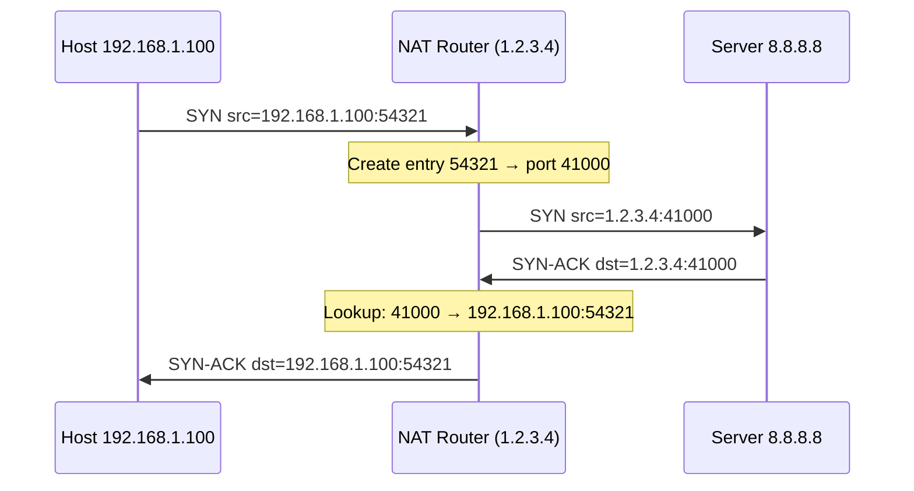

**⚡ TL;DR** - NAT translates private IP addresses to a
public IP (and back) by rewriting IP headers and tracking
the mapping in a connection table. It enables thousands
of private hosts to share one public IP and provides an
implicit firewall (private hosts are unreachable from
the internet unless a mapping exists). Every home router,
cloud NAT gateway, and Kubernetes pod IP uses NAT.

| #025 | Category: Networking | Difficulty: ★★☆ |
|:---|:---|:---|
| **Depends on:** | IP Address, Subnet and CIDR Notation | |
| **Used by:** | DHCP, VPN Fundamentals | |
| **Related:** | IP Address, Subnet and CIDR Notation, Routing Basics | |

---

### 🔥 The Problem This Solves

IPv4 has ~4.3 billion addresses. The world has ~50 billion
internet-connected devices. Without NAT, this would have
been impossible without IPv6 (which has 3.4×10³⁸ addresses).
NAT allows a single public IP to serve thousands of private
devices by dynamically mapping outbound connections. As a
side effect, NAT also prevents unsolicited inbound
connections (implicit firewall), which has become a
fundamental security boundary in most networks.

---

### 📘 Textbook Definition

**NAT (Network Address Translation)** is a process where
a network device (router, firewall, or NAT gateway) modifies
IP packet headers in transit, replacing source or
destination IP addresses (and ports). **NAPT (Network
Address Port Translation)** - the most common form, also
called PAT or "overloading" - extends NAT by also
translating port numbers, allowing many private IPs to
share one public IP using unique port mappings. NAT
maintains a translation table mapping (private IP, private
port) ↔ (public IP, public port) for each active connection.

---

### ⏱️ Understand It in 30 Seconds

**The NAT translation:**

```
Without NAT (impossible with IPv4 exhaustion):
  Host 192.168.1.100 → sends packet with src 192.168.1.100
  Internet cannot route to 192.168.1.100 (RFC 1918)

With NAT:
  Host 192.168.1.100:54321 → Router rewrites to:
  1.2.3.4:41000 → internet → server 93.184.216.34
  Server responds to 1.2.3.4:41000
  Router rewrites back to 192.168.1.100:54321
  Host receives response → transparency complete
```

**The NAT table entry:**

```
Private Side          Public Side          State
192.168.1.100:54321 ↔ 1.2.3.4:41000  →  google.com:443  ESTABLISHED
192.168.1.101:62000 ↔ 1.2.3.4:41001  →  github.com:443  ESTABLISHED
192.168.1.100:60200 ↔ 1.2.3.4:41002  →   8.8.8.8:53     TIME_WAIT
```

---

### 🔩 First Principles Explanation

**Three types of NAT:**

```
┌──────────────────────────────────────────────────────────┐
│  NAT Types                                               │
├─────────────────┬────────────────────────────────────────┤
│  Static NAT     │  1:1 mapping (one private IP = one     │
│                 │  public IP). Permanent. Used for       │
│                 │  servers that need consistent public   │
│                 │  IP. AWS Elastic IP on an instance.    │
├─────────────────┼────────────────────────────────────────┤
│  Dynamic NAT    │  Pool of public IPs shared by private  │
│                 │  hosts (first-come-first-served).      │
│                 │  Rarely used today.                    │
├─────────────────┼────────────────────────────────────────┤
│  NAPT / PAT     │  Many-to-one: all private hosts share  │
│  (the common    │  one public IP, distinguished by port  │
│  one)           │  numbers. Max ~65535 concurrent        │
│                 │  connections per public IP per dest.   │
│                 │  Used in: home routers, AWS NAT GW,    │
│                 │  corporate firewalls, Kubernetes.      │
└─────────────────┴────────────────────────────────────────┘
```

**How NAPT (PAT) works - step by step:**

```
┌──────────────────────────────────────────────────────────┐
│  NAPT Connection Walkthrough                             │
├──────────────────────────────────────────────────────────┤
│                                                          │
│  Outbound (private → internet):                         │
│  1. Host 192.168.1.100:54321 sends SYN to 8.8.8.8:53   │
│  2. Router receives packet on LAN interface             │
│  3. Router creates NAT entry:                           │
│     {192.168.1.100:54321} ↔ {1.2.3.4:PORT}            │
│     (PORT = next available in ephemeral range)          │
│  4. Router rewrites packet: src 192.168.1.100:54321     │
│     → src 1.2.3.4:PORT                                  │
│  5. Sends rewritten packet out WAN interface            │
│                                                          │
│  Inbound (internet → private):                          │
│  6. Response arrives: dst 1.2.3.4:PORT                  │
│  7. Router looks up NAT table: PORT → 192.168.1.100:54321│
│  8. Rewrites packet: dst 1.2.3.4:PORT → dst             │
│     192.168.1.100:54321                                  │
│  9. Sends to host on LAN interface                      │
│                                                          │
│  Connection cleanup:                                     │
│  10. FIN/RST detected → NAT entry removed after timeout │
│      (TCP: 30-120s after FIN, UDP: 30s idle timeout)   │
└──────────────────────────────────────────────────────────┘
```



---

### 🧪 Thought Experiment

**SETUP:**
You're at home. Your router has 1 public IP: `203.0.113.5`.
You open three browser tabs simultaneously:

Tab 1: github.com:443
Tab 2: google.com:443
Tab 3: github.com:443 (second connection)

**NAT table on your router:**

```
Priv IP:Port          Pub IP:Port         Destination
192.168.1.5:51000  ↔  203.0.113.5:40001  → github.com:443
192.168.1.5:51001  ↔  203.0.113.5:40002  → google.com:443
192.168.1.5:51002  ↔  203.0.113.5:40003  → github.com:443
```

**Q: Why is Tab 3 (same dest) distinguishable?**
Because the SOURCE port is different (51002 vs 51000).
The 4-tuple (src IP, src port, dst IP, dst port) is unique
for each. The NAT router uses the DESTINATION's src port
(40003 vs 40001) to distinguish inbound responses.

**Q: Can you have 65,535 simultaneous connections to the
same server?**
Approximately yes (limited by available port range) - but
to DIFFERENT combinations of remote address. The constraint
is: (public IP, public port, dst IP, dst port) must be
unique. So 65K connections to github.com:443 from one
public IP is the practical limit (minus reserved ports).
AWS NAT Gateway handles this limit with multiple IP aliases.

---

### 🧠 Mental Model / Analogy

> NAT is a hotel switchboard operator:
>
> Your hotel (private network) has rooms 100-999.
> The hotel has one main phone number (public IP).
>
> Guest (192.168.1.100) calls room "google.com:443"
> → Switchboard intercepts: "Room 100 called external,
>   I'll map extension 4001 to room 100's call"
> → External world sees: "Call from main number, ext 4001"
>
> When response arrives at "main number, ext 4001":
> → Switchboard consults table: ext 4001 = room 100
> → Rings room 100
>
> External callers cannot reach rooms directly:
> → "Can I speak with room 100 directly?"
> → Switchboard: "Unknown extension" (NAT drops unsolicited
>   inbound connections with no existing mapping)

---

### ⚙️ How It Works (Mechanism)

**NAT diagnosis commands:**

```bash
# View NAT connection tracking table (Linux)
sudo conntrack -L
# tcp 6 431999 ESTABLISHED src=192.168.1.100
#   dst=93.184.216.34 sport=54321 dport=443
#   src=93.184.216.34 dst=1.2.3.4 sport=443 dport=41000
#   [ASSURED] mark=0 use=1

# Count connections by state
sudo conntrack -L | awk '{print $4}' | sort | uniq -c

# NAT table size (risk of overflow)
cat /proc/sys/net/netfilter/nf_conntrack_count
cat /proc/sys/net/netfilter/nf_conntrack_max

# Show iptables NAT rules
sudo iptables -t nat -L -n -v

# Simple NAT rule (masquerade outbound from LAN):
# sudo iptables -t nat -A POSTROUTING \
#   -s 192.168.1.0/24 -o eth0 -j MASQUERADE
```

**Wrong vs Right - NAT and UDP keepalive:**

```python
# BAD: no keepalive for idle UDP connection through NAT
# UDP NAT table entries expire after 30 seconds idle.
# If your DNS resolver or VoIP client goes quiet for
# 30+ seconds, the NAT entry is evicted.
# Next packet: dropped (no entry to route it back).

# GOOD: send periodic keepalive packets for persistent
# UDP connections (VoIP, VPN, P2P)

import time
import socket

def keepalive_udp(sock, server_addr, interval=25):
    """Send keepalive every 25s to prevent NAT eviction.
    25s < 30s default UDP NAT timeout."""
    while True:
        time.sleep(interval)
        try:
            sock.sendto(b'\x00', server_addr)  # NOP
        except Exception:
            break  # connection closed, stop keepalive
```

**Port forwarding (inbound through NAT):**

```bash
# Forward external port 80 to internal server:
# External: router_public_ip:80 → internal 192.168.1.50:80
sudo iptables -t nat -A PREROUTING \
  -i eth0 -p tcp --dport 80 \
  -j DNAT --to-destination 192.168.1.50:80

sudo iptables -A FORWARD \
  -p tcp -d 192.168.1.50 --dport 80 -j ACCEPT

# This is how home hosting and game port forwarding works:
# Without this rule: inbound connections dropped (no NAT entry)
# With this rule: creates permanent static mapping
```

---

### 🔄 The Complete Picture - End-to-End Flow

**Kubernetes pod networking and NAT:**

```
┌──────────────────────────────────────────────────────────┐
│  Kubernetes NAT Layers                                   │
├──────────────────────────────────────────────────────────┤
│  Pod IP:  10.244.1.5  (cluster-internal CIDR)           │
│  Node IP: 192.168.1.10 (VPC private IP)                 │
│  NAT GW:  Public IP   (AWS NAT Gateway)                 │
│                                                          │
│  Pod → internet:                                        │
│  Step 1: Pod IP masqueraded to Node IP (iptables MASQ)  │
│  Step 2: Node IP masqueraded to NAT GW public IP        │
│                                                          │
│  Two NAT translations in series:                        │
│  10.244.1.5:PORT → 192.168.1.10:PORT2 → public:PORT3   │
│                                                          │
│  Kubernetes Service (NodePort):                         │
│  External:30000 → DNAT → Pod IP:8080                    │
│  (DNAT = Destination NAT, changes the destination)      │
└──────────────────────────────────────────────────────────┘
```

**WHAT CHANGES AT SCALE:**
AWS NAT Gateway supports up to 55,000 simultaneous
connections per destination (public IP, port) due to
port exhaustion. For services making many connections to
the same downstream endpoint, you may hit this limit.
Signs: `ESTABLISHED` connections drop. Fix: use multiple
NAT Gateway IPs (each has 55K ports) or use VPC endpoints
for AWS services (bypasses NAT entirely, free). At
container scale, each pod doing outbound NAT through one
NAT Gateway can exhaust connection limits faster than expected.

---

### ⚖️ Comparison Table

| | Home Router NAT | AWS NAT Gateway | CGNAT |
|---|---|---|---|
| **Direction** | Many:1 | Many:1 | Many:Many |
| **State** | In router memory | AWS-managed | Carrier-managed |
| **Bandwidth** | Limited | 45 Gbps max | Variable |
| **Connection limit** | ~65K per dest | 55K per dest | Shared pool |
| **Cost** | Free (router) | $0.045/hr + data | ISP cost |
| **Use case** | Home/office | Cloud private subnet | ISP (mobile) |

---

### ⚠️ Common Misconceptions

| Misconception | Reality |
|---|---|
| NAT is a firewall | NAT provides implicit protection by blocking unsolicited inbound connections, but it is NOT a firewall. It doesn't inspect traffic, filter malware, or provide stateful packet filtering. A real firewall is needed alongside NAT. |
| NAT breaks nothing | NAT breaks protocols that embed IP addresses in payload (FTP passive mode, SIP/VoIP). These require NAT helpers/ALGs (Application Layer Gateways) that inspect and rewrite packet payloads. |
| NAT is transparent to applications | For TCP/UDP with common patterns: yes. But peer-to-peer protocols that need inbound connections (BitTorrent, WebRTC) require NAT traversal techniques (STUN, TURN, ICE, hole punching) because NAT blocks unsolicited inbound. |
| IPv6 eliminates NAT | IPv6 was designed to eliminate NAT (enough addresses for every device). In practice, many enterprises still use NAT66 (NAT for IPv6) for address stability and security policy reasons. |

---

### 🚨 Failure Modes & Diagnosis

**NAT Connection Table Overflow**

**Symptom:** New TCP connections fail (SYN timeout). Existing
connections work. Event correlates with high connection rate
or many short-lived connections. `dmesg` shows conntrack full.

**Root Cause:** Linux `nf_conntrack` table full. Default
max: 65,536 entries. Short-lived connections (Lambda functions
making HTTP calls, microservice fanout) create entries faster
than they expire.

**Diagnosis:**
```bash
# Check table utilization
cat /proc/sys/net/netfilter/nf_conntrack_count
cat /proc/sys/net/netfilter/nf_conntrack_max

# Check syslog for overflow
dmesg | grep "nf_conntrack: table full"

# Connection breakdown by state
sudo conntrack -L | awk '{print $4}' | sort | uniq -c
# Many TIME_WAIT or CLOSE_WAIT = lots of short-lived conns
```

**Fix:**
```bash
# Increase limit
sysctl -w net.netfilter.nf_conntrack_max=524288

# Reduce UDP timeout (default 30s, minimum 10s)
sysctl -w net.netfilter.nf_conntrack_udp_timeout=10

# Reduce TIME_WAIT hold time
sysctl -w net.ipv4.tcp_fin_timeout=15
```

---

### 🔗 Related Keywords

**Prerequisites:**
- `IP Address` - private vs public IP concepts
- `Subnet and CIDR Notation` - understanding IP ranges

**Builds On This:**
- `DHCP` - assigns private IPs that NAT translates
- `VPN Fundamentals` - VPN replaces NAT for many use cases

---

### 📌 Quick Reference Card

```
┌──────────────────────────────────────────────────────────┐
│ WHAT IT DOES │ Rewrites IP:port headers to share one     │
│              │ public IP among many private hosts        │
├──────────────┼───────────────────────────────────────────┤
│ HOW          │ Outbound: src private → src public:port   │
│              │ Inbound: dst public:port → dst private    │
├──────────────┼───────────────────────────────────────────┤
│ TABLE        │ (priv IP, priv port) ↔ (pub port) tracked │
│              │ per connection. Evicted after idle timeout │
├──────────────┼───────────────────────────────────────────┤
│ IMPLICIT SEC │ Blocks unsolicited inbound (no table entry)│
│              │ NOT a replacement for a real firewall     │
├──────────────┼───────────────────────────────────────────┤
│ LIMITATION   │ ~55K simultaneous to same destination.    │
│              │ Breaks protocols embedding IPs in payload │
│              │ (FTP passive, SIP). Breaks P2P without   │
│              │ NAT traversal (STUN/TURN)                 │
├──────────────┼───────────────────────────────────────────┤
│ DIAGNOSE     │ sudo conntrack -L, nf_conntrack_count,    │
│              │ dmesg | grep conntrack                    │
└──────────────────────────────────────────────────────────┘
```

**Interview one-liner:**
"NAT (specifically NAPT/PAT) allows thousands of private
hosts to share one public IP by rewriting source IP:port
on outbound packets and reversing the translation on
inbound responses using a connection table. It provides
implicit inbound firewall protection (unsolicited inbound
connections are dropped - no table entry exists). Key
limitations: ~55K simultaneous connections to the same
destination, breaks protocols embedding IPs in payloads
(FTP, SIP), breaks peer-to-peer without NAT traversal
(STUN/TURN/ICE). AWS NAT Gateway uses the same mechanism
at cloud scale with multiple IP aliases to scale beyond
single-IP port limits."