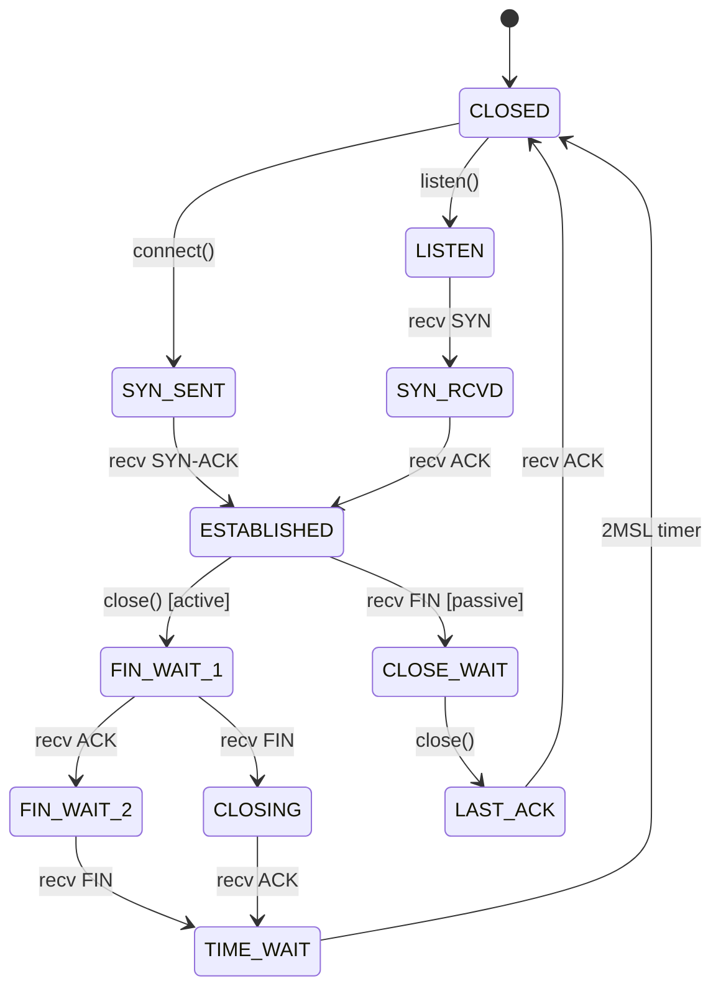

**⚡ TL;DR** - TCP connections move through 11 states
from CLOSED to ESTABLISHED and back. Understanding each
state is the difference between diagnosing a socket
accumulation bug in 5 minutes and spending a day
restarting services blindly. `CLOSE_WAIT` accumulation
means your application has a bug. `TIME_WAIT`
accumulation means you are handling many short-lived
connections. Both are diagnosable instantly with `ss`.

| #035 | Category: Networking | Difficulty: ★★★ |
|:---|:---|:---|
| **Depends on:** | TCP (NET-020), TCP Three-Way Handshake (NET-022) | |
| **Used by:** | TCP Congestion Control, TCP Flow Control vs Congestion Control, HTTP Connection Management | |
| **Related:** | Socket Programming Basics, TCP Congestion Control, TCP Retransmit and Packet Loss | |

---

### 🔥 The Problem This Solves

A production service slowly stops accepting connections.
`ss -tnp | grep CLOSE_WAIT | wc -l` returns 50,000. The
service is leaking sockets - connection objects are piling
up in CLOSE_WAIT because the application never calls
`close()`. Without understanding TCP states, this
diagnosis takes hours. With it, takes 30 seconds.

---

### 🧠 Intuition: A Connection Is a State Machine

A TCP connection is not binary (connected/disconnected).
It moves through 11 distinct states. Each state has
exactly one legal set of transitions. The OS enforces
these - you cannot skip states or go backwards.

The states that matter in practice:
- **ESTABLISHED**: data flowing - this is the "working" state
- **TIME_WAIT**: client-side 60s waiting period after close
- **CLOSE_WAIT**: server received FIN but app has not called close()
- **SYN_SENT**: client connecting, waiting for SYN-ACK
- **LISTEN**: server socket waiting for incoming SYNs

---

### ⚙️ The Complete State Machine

```
ASCII Diagram (Client perspective):

CLOSED
  │ connect()
  ▼
SYN_SENT ──── (SYN-ACK received) ──► ESTABLISHED
  │                                      │
  │                        close() │     │ recv FIN
  │                                ▼     ▼
  │                          FIN_WAIT_1  CLOSE_WAIT
  │                                │          │ close()
  │                                ▼          ▼
  │                          FIN_WAIT_2  LAST_ACK
  │                                │          │ ACK sent
  │                                ▼          ▼
  │                           TIME_WAIT ──► CLOSED
  │                                │
  └─────────────────────────► CLOSED
```



---

### ⚙️ Connection Setup States

**Client side (active opener):**

```
CLOSED → SYN_SENT → ESTABLISHED
  connect() sends SYN packet
  SYN-ACK received → send ACK → ESTABLISHED
  
  Diagnosis:
  ss -tnp | grep SYN_SENT    ← connecting (normal briefly)
  Many SYN_SENT = server unreachable or overloaded
```

**Server side (passive opener):**

```
CLOSED → LISTEN → SYN_RCVD → ESTABLISHED
  listen() creates LISTEN state
  SYN arrives → OS creates SYN_RCVD entry in backlog
  ACK arrives → moves to ESTABLISHED, added to accept queue
  application calls accept() → gets ESTABLISHED socket

  Diagnosis:
  ss -lntp | grep PORT     ← server listening?
  ss -tnp | grep SYN_RCVD  ← SYN flood or slow app?
  Too many SYN_RCVD = accept queue backed up
```

**The Accept Queue vs SYN Backlog:**

```
Incoming SYNs
    │
    ▼
SYN backlog (incomplete, SYN_RCVD)
    │  3-way handshake completes
    ▼
Accept queue (complete, ESTABLISHED)
    │  app calls accept()
    ▼
Application handles connection

If accept queue is full → OS refuses new connections
Check: ss -lntp   ← look at Recv-Q column
If Recv-Q > 0 on LISTEN socket → accept queue filling up
```

---

### ⚙️ Connection Teardown States

This is where production bugs live. TCP has an asymmetric
close - either side can initiate it:

**Active closer (calls close() first):**

```
ESTABLISHED → FIN_WAIT_1 → FIN_WAIT_2 → TIME_WAIT → CLOSED

FIN_WAIT_1: sent FIN, waiting for ACK
FIN_WAIT_2: got ACK for FIN, waiting for peer's FIN
TIME_WAIT:  got peer's FIN, waiting 2MSL (60s) before CLOSED

TIME_WAIT exists to:
1. Ensure delayed packets from this connection expire
2. Ensure the final ACK was received by peer
```

**Passive closer (receives FIN first):**

```
ESTABLISHED → CLOSE_WAIT → LAST_ACK → CLOSED

CLOSE_WAIT: received peer's FIN, waiting for app to close()
LAST_ACK:   sent own FIN, waiting for ACK
CLOSED:     ACK received, done

DANGER: CLOSE_WAIT should last microseconds.
If CLOSE_WAIT accumulates → app never calls close()!
```

---

### ⚙️ Wrong vs Right: The CLOSE_WAIT Leak

```python
# BAD: opens connection, never closes it
def fetch_data(url):
    conn = socket.socket()
    conn.connect(HOST_PORT)
    conn.sendall(b"GET / HTTP/1.0\r\n\r\n")
    data = conn.recv(4096)
    return data  # conn is NEVER closed!
    # Connection stays in CLOSE_WAIT if server closes first
    # Python GC may eventually close it... or may not

# GOOD: always use context manager to guarantee close
def fetch_data(url):
    with socket.socket() as conn:
        conn.connect(HOST_PORT)
        conn.sendall(b"GET / HTTP/1.0\r\n\r\n")
        data = conn.recv(4096)
    return data  # conn.close() called by context manager
```

```python
# BAD: try/except without close in finally
def process_connection(conn):
    try:
        data = conn.recv(4096)
        process(data)
    except Exception as e:
        log(e)
    # Missing finally: conn.close() → CLOSE_WAIT leak!

# GOOD: always close in finally block
def process_connection(conn):
    try:
        data = conn.recv(4096)
        process(data)
    except Exception as e:
        log(e)
    finally:
        conn.close()  # always runs, even on exception
```

---

### ⚙️ Diagnosing State Accumulation in Production

```bash
# Count connections by state (the 30-second diagnosis)
ss -tn | awk 'NR>1 {print $1}' | sort | uniq -c | sort -rn
# Output:
# 12847  ESTABLISHED
#   423  TIME_WAIT
#     2  CLOSE_WAIT   ← OK if < 10
#     1  SYN_SENT

# CLOSE_WAIT is > 100: APPLICATION BUG
# Find which process owns CLOSE_WAIT sockets:
ss -tnp state close-wait
# Shows process name and PID → look at their socket handling code

# TIME_WAIT diagnosis:
ss -tn state time-wait | wc -l
# Up to 10,000: normal for high-traffic HTTP service
# Over 50,000: consider SO_LINGER, tcp_tw_reuse, connection pooling

# SYN_RCVD > 100: accept queue backed up
ss -lntp   # look at Recv-Q for LISTEN sockets
# Recv-Q > 0 on LISTEN socket = queue building up
# Solution: increase listen() backlog, fix slow accept() path

# FIN_WAIT_2 accumulation:
ss -tn state fin-wait-2
# Usually brief (< 1s). If accumulating: peer not sending FIN
# Indicates peer-side CLOSE_WAIT leak
```

---

### ⚙️ TIME_WAIT: Deep Dive

```
TIME_WAIT = 2 × MSL = 2 × 60s = 120s on Linux
(Linux actually uses 60s for TIME_WAIT, not full 2MSL)

Why it exists:
1. The ACK sent for the peer's FIN might be lost
   → peer retransmits FIN → our TIME_WAIT state sends ACK
   → without TIME_WAIT, ACK is gone, peer stuck

2. Delayed packets from this 4-tuple (src IP:port,dst IP:port)
   might arrive late
   → TIME_WAIT prevents new connection reusing this tuple
   → prevents packet mix-up between old and new connections

TIME_WAIT is on the ACTIVE CLOSER (client or whoever calls close() first)
The passive closer reaches CLOSED quickly.
```

```bash
# TIME_WAIT is a scalability concern, not a bug:
# 10K TIME_WAIT entries = 10K connections made in last 60s
# At 160 new connections/second: 160 × 60 = 9,600 TIME_WAIT

# Mitigation: connection pooling (keep connections alive)
# Each reused connection = 1 TIME_WAIT instead of 1 per request

# TCP option: net.ipv4.tcp_tw_reuse (server-side)
# Allows reuse of TIME_WAIT sockets for new outgoing connections
# when timestamps are enabled (safe, but limited benefit)
sysctl net.ipv4.tcp_tw_reuse   # should be 1 on modern Linux

# NEVER use tcp_tw_recycle (deprecated, breaks behind NAT)
```

---

### ⚙️ The SYN Flood and SYN Cookies Defense

```
SYN Flood Attack:
  Attacker sends thousands of SYNs with spoofed source IPs
  Server creates SYN_RCVD entry for each
  Backlog fills up
  Legitimate connections refused

SYN Cookie Defense:
  Instead of storing SYN_RCVD state, encode it in ISN
  ISN = hash(src IP, src port, dst IP, dst port, timestamp)
  State is "stored" in the packet exchange itself
  No memory consumed per SYN → SYN flood harmless

Verify SYN cookies are enabled:
  sysctl net.ipv4.tcp_syncookies   # should be 1

Check if SYN floods are occurring:
  netstat -s | grep -i "SYN"
  # "SYNs to LISTEN sockets dropped" or
  # "SYN cookies sent" → indicates backlog pressure
```

---

### ⚙️ Failure Example: Port Exhaustion from TIME_WAIT

**Symptoms:** Intermittent "Cannot assign requested address"
or `EADDRNOTAVAIL` when making outbound connections.

**Root cause:**

```bash
# Service makes thousands of short HTTP calls per minute
# Each call creates a connection, which enters TIME_WAIT
# Ephemeral ports are exhausted (default: 32768-60999)

# Diagnose:
ss -tn state time-wait | wc -l
# Returns 28,232 - exhausting ~28K ephemeral ports

cat /proc/sys/net/ipv4/ip_local_port_range
# 32768   60999  ← 28,231 ports available
# TIME_WAIT count ≈ port range = exhaustion imminent

# Fix option 1: expand ephemeral port range
sysctl -w net.ipv4.ip_local_port_range="10000 65535"

# Fix option 2 (correct): use connection pooling
# HTTPConnectionPool in Python requests, RestTemplate
# in Spring, pgBouncer for Postgres, etc.
# One connection serves many requests → no TIME_WAIT flood

# Fix option 3: enable tcp_tw_reuse
sysctl -w net.ipv4.tcp_tw_reuse=1
```

---

### ⚙️ Observe States Live with ss

```bash
# Full state monitoring dashboard (refresh every second)
watch -n 1 "ss -tn | awk 'NR>1{print \$1}' \
  | sort | uniq -c | sort -rn"

# Find processes with CLOSE_WAIT
ss -tnp state close-wait

# Specific connection in specific state
ss -tnp state established dst 10.0.0.5

# Count TIME_WAIT by destination (shows which backend)
ss -tn state time-wait \
  | awk '{print $5}' \
  | cut -d: -f1 \
  | sort | uniq -c | sort -rn | head -10
# Shows which backend is generating most TIME_WAIT
```

---

### 🔬 Under the Hood

```
TCP state is stored in kernel struct tcp_sock
(inherits from inet_connection_sock, sock)

Key fields:
  sk_state    = current TCP state (TCP_ESTABLISHED etc.)
  rcv_nxt     = next expected sequence number
  snd_nxt     = next sequence number to send
  snd_una     = oldest unACKed sequence number
  tp->rcv_wnd = receive window size (flow control)
  tp->snd_cwnd= congestion window size

Time wait bucket (tw_bucket):
  TIME_WAIT connections use a lightweight struct
  to save memory (full tcp_sock would waste 1.5KB
  per TIME_WAIT; tw_bucket is ~64 bytes)
  Linux can handle millions of TIME_WAIT entries
  (memory = millions × 64 bytes = hundreds of MB)
```

---

### 📐 Scale Considerations

```
100 connections/second service:
  100 × 60s TIME_WAIT = 6,000 TIME_WAIT entries → trivial

10,000 connections/second:
  10K × 60s = 600,000 TIME_WAIT entries
  Memory: 600K × 64 bytes = ~37MB → manageable
  Port range: 28K ports → EXHAUSTION RISK
  → Connection pooling becomes mandatory

100,000 connections/second (large proxy):
  6M TIME_WAIT entries → 384MB for TIME_WAIT alone
  → At this scale, persistent connections / HTTP keep-alive
    are critical; TIME_WAIT reclaim options matter
  → Consider SO_LINGER l_linger=0 for outgoing connections
    (sends RST instead of FIN → skips TIME_WAIT, but
    loses reliability guarantees on close - use carefully)
```

---

### 🧭 When to Use This Knowledge

```
Interview answer: "Why is there CLOSE_WAIT accumulation?"
→ The application is receiving a FIN (peer closed) but
  not calling close() on the socket. It's a code bug.
  Find it with: ss -tnp state close-wait → look at process.

Interview answer: "Why is TIME_WAIT not a bug?"
→ TIME_WAIT ensures delayed packets expire and gives
  the final ACK a chance to arrive. At high connection
  rates, use connection pooling to reduce TIME_WAIT
  count - not kernel tweaks.

Production decision: Should I tune tcp_tw_recycle?
→ NEVER. It is deprecated (removed in Linux 4.12).
  It breaks connections from behind NAT. Use
  tcp_tw_reuse + timestamps instead (much safer).
```