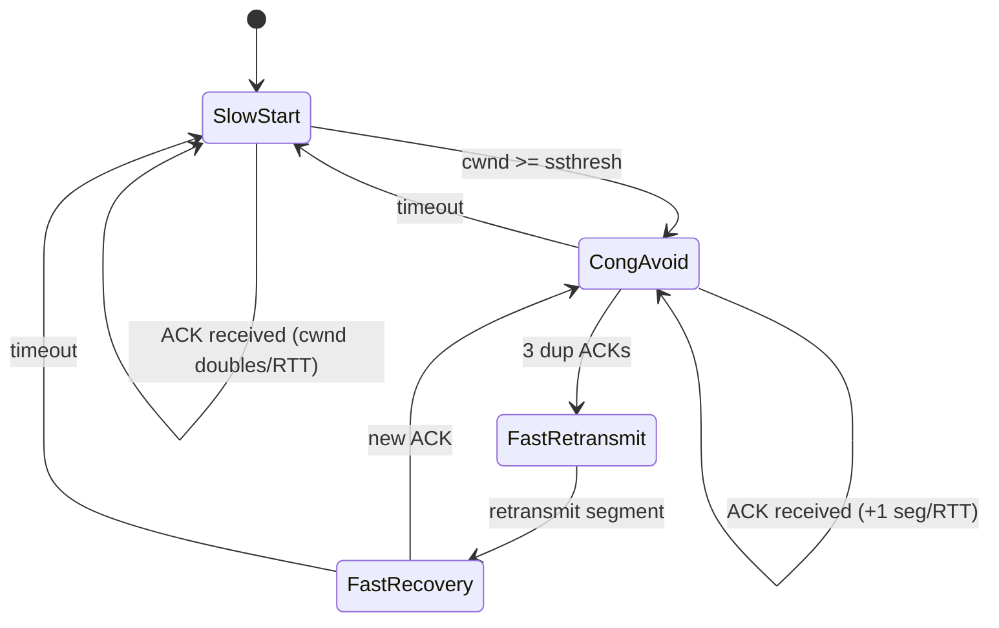

**⚡ TL;DR** - TCP congestion control is the mechanism that
prevents a single sender from collapsing the shared
network. It does this by maintaining a congestion window
(cwnd) that limits how much data can be in-flight at once,
and by reducing cwnd aggressively when it detects packet
loss. On a 100ms RTT link, a small cwnd is the difference
between 1 Mbps and 100 Mbps throughput.

| #036 | Category: Networking | Difficulty: ★★★ |
|:---|:---|:---|
| **Depends on:** | TCP (NET-020) | |
| **Used by:** | TCP Flow Control vs Congestion Control, TCP Retransmit and Packet Loss | |
| **Related:** | TCP Connection Lifecycle and States, TCP Flow Control vs Congestion Control, TCP Retransmit | |

---

### 🔥 The Problem This Solves

In 1986, the internet suffered its first congestion
collapse. Throughput dropped 100x in minutes because
every sender transmitted as fast as possible, routers
dropped packets, senders retransmitted even faster, and
the cycle accelerated. Van Jacobson at LBL designed TCP
congestion control as the fix. Every TCP connection since
1988 uses a variant of this algorithm. Without it, the
internet cannot function under load.

---

### 🧠 Intuition: Congestion Window as a Throttle

TCP flow control (receive window, rwnd) limits the sender
to not overwhelm the *receiver*. TCP congestion control
(congestion window, cwnd) limits the sender to not
overwhelm the *network*.

The actual in-flight data is:
```
bytes_in_flight = min(cwnd, rwnd)
```

**Throughput formula:**

$$\text{Throughput} \approx \frac{cwnd}{RTT}$$

On a 100ms RTT link:
- cwnd = 1 packet (1460 bytes): 116 Kbps
- cwnd = 10 packets (14.6 KB): 1.16 Mbps
- cwnd = 100 packets (146 KB): 11.7 Mbps
- cwnd = 1000 packets (1.46 MB): 117 Mbps

**The job of congestion control:** grow cwnd as fast as
safely possible, detect congestion (packet loss or ECN
mark), and reduce cwnd to back off.

---

### ⚙️ The Four Phases of TCP Congestion Control (Reno)

```
Phase 1: Slow Start
  - cwnd starts at ~10 segments (Linux default)
  - cwnd doubles every RTT (exponential growth)
  - Until cwnd >= ssthresh (slow start threshold)
  
Phase 2: Congestion Avoidance
  - cwnd grows by 1 segment per RTT (linear growth)
  - "Additive increase, multiplicative decrease" (AIMD)
  
Phase 3: Fast Retransmit
  - 3 duplicate ACKs = implicit congestion signal
  - Retransmit immediately without waiting for timeout
  
Phase 4: Fast Recovery
  - ssthresh = cwnd / 2 (halve the threshold)
  - cwnd = ssthresh (reset, not zero)
  - Continue in Congestion Avoidance
  
Timeout case (severe loss):
  - cwnd → 1 segment (restart slow start)
  - ssthresh = cwnd / 2 (remember where we were)
```

**ASCII diagram:**

```
cwnd │
     │  Slow Start      Cong. Avoid.    Loss!
 100 │                 .......●─────   │
     │              ...      │Fast Retx│
  50 │           ...         │────────────── ssthresh
     │        ...            ▼         │
  10 │     ...          recovered      │
     │  ...                            ▼cwnd drops
   1 │●                                1─────start again
     └──────────────────────────────────────▶ time
```



---

### ⚙️ Modern Algorithms: Beyond Reno

```
┌──────────────────────────────────────────────────────────┐
│  Algorithm   │ Signal Used    │ Behavior                 │
├──────────────┼────────────────┼──────────────────────────┤
│ Reno (1988)  │ packet loss    │ Classic. AIMD.           │
│ Cubic (2006) │ packet loss    │ Linux default. Better    │
│              │                │ for high BDP links.      │
│ BBR (2016)   │ RTT + BW model │ Google. Ignores loss as  │
│              │                │ primary signal. Better   │
│              │                │ on lossy links (mobile,  │
│              │                │ satellite). Used for     │
│              │                │ YouTube, GCP.            │
│ QUIC/BBR     │ RTT + BW model │ HTTP/3 uses BBR-like    │
│              │                │ control at app level.    │
└──────────────┴────────────────┴──────────────────────────┘
```

```bash
# Check current congestion control algorithm
sysctl net.ipv4.tcp_congestion_control
# Typically: cubic

# Available algorithms
sysctl net.ipv4.tcp_available_congestion_control
# cubic bbr reno

# Switch to BBR (better for lossy networks, cloud VMs)
sysctl -w net.ipv4.tcp_congestion_control=bbr
# Verify per-socket algorithm:
ss -tni | grep algo
```

---

### ⚙️ Bandwidth-Delay Product: Why cwnd Matters So Much

```
BDP = Bandwidth × RTT

Example: 1 Gbps link, 100ms RTT:
  BDP = 1Gbps × 0.1s = 100 Mbit = 12.5 MB

To fully utilize the link, cwnd must be ≥ BDP.
cwnd < BDP means you're not sending fast enough to
fill the pipe even though the network could handle it.

Practical example:
  Cloud VM to US: 50ms RTT, 1Gbps link
  BDP = 1Gbps × 0.05s = 6.25 MB (4,275 × 1460-byte packets)
  Default initial cwnd ≈ 10 packets ≈ 14.6 KB
  Initial throughput = 14.6 KB / 0.05s = 2.3 Mbps
  At full cwnd = 2.3 Gbps would be achievable

  Slow start reaches BDP after ~log2(4275) ≈ 12 RTTs
  = 12 × 50ms = 600ms before full speed
  → Cold connections are slow for the first ~600ms
```

---

### ⚙️ Production Failure: The Slow-Start Cliff

**Symptoms:** Latency-sensitive requests are fast, but
large file transfers are inexplicably slow for the first
few seconds.

**Root cause:**

```bash
# Every new TCP connection starts with cwnd = ~10 packets
# A 1 MB file download on a 100ms RTT link:

# RTT 1: 10 packets (14.6 KB sent)
# RTT 2: 20 packets (29.2 KB sent) - slow start
# RTT 3: 40 packets (58.4 KB sent) - still slow start
# RTT 4: 80 packets → hits ssthresh or exceeds BDP
# Total time for 1 MB: 4+ RTTs = 400ms+ just for slow start

# On a 10ms RTT LAN:
# RTT 1: 10 pkts, RTT 2: 20, RTT 3: 40, RTT 4: 80...
# 1MB / 1460 = 700 packets, so ~log2(700)=10 RTTs × 10ms = 100ms

# Fix: increase initial cwnd (icwnd)
# Linux default: 10 (RFC 6928 - already set)
# Check:
ip route show | head -5
# Look for "initcwnd" value, default is 10
# To set:
ip route change default via GW_IP initcwnd 100
# WARNING: only helps for connections through that route
# Risk: can worsen congestion if set too high for bad links
```

---

### ⚙️ Diagnosing Congestion in Production

```bash
# 1. Check retransmit rate (congestion signal)
netstat -s | grep -i retransmit
# RetransSegs: 14832   ← retransmit count
# FastRetransmits: 9123 ← 3-dup-ACK fast retransmit
# TimeoutRetransmits: 1823 ← timeout (severe congestion)
# Timeout >> FastRetransmit = serious congestion

# 2. Current socket cwnd and RTT
ss -tni 'dst 10.0.0.5'
# Look for: cwnd:100 rtt:45.4/10.2 mss:1448
# cwnd = current congestion window in segments
# rtt = SRTT / variance (ms)
# Low cwnd relative to BDP = connection still ramping up

# 3. Dropped packets at interface
ip -s link show eth0
# TX errors/dropped should be ~0 on healthy host

# 4. Packet loss with ping (simple baseline)
ping -c 1000 -i 0.01 TARGET_IP 2>&1 | tail -2
# "1000 packets transmitted, 997 received, 0.3% packet loss"
# > 0.1% loss will significantly degrade TCP throughput

# 5. ss monitoring loop
watch -n 1 "ss -tni 'dst 10.0.0.5' | grep cwnd"
# Watch cwnd during an active transfer to see algorithm behavior
```

---

### ⚙️ ECN: Explicit Congestion Notification

```
Traditional: router drops packet → sender detects loss → backs off
ECN: router marks packet (doesn't drop) → receiver ACKs with ECN
  → sender sees ECN → reduces cwnd → no packet lost

Benefits:
  - Lower latency (packet drop is avoided, no retransmit)
  - Better throughput under moderate congestion
  - Works only if both endpoints and all routers support it

Drawbacks:
  - Disabled by some firewalls/middleboxes (they block ECN)
  - May mask actual packet loss on misconfigured networks

Check if ECN is enabled:
  sysctl net.ipv4.tcp_ecn   # 2 = on (RFC 3168 default on Linux)

Enable:
  sysctl -w net.ipv4.tcp_ecn=1  # 1 = request ECN on connection setup
```

---

### 🔬 Under the Hood

```
Kernel: net/ipv4/tcp_cubic.c (CUBIC), net/ipv4/tcp_bbr.c (BBR)

CUBIC uses a cubic function of time since last loss event:
  W(t) = C(t - K)^3 + W_max
  K = time when W will reach W_max again
  C = scaling constant (0.4 default)

This gives:
  - Fast increase when far from the last congestion point
  - Slow increase when near it (reduces oscillation)
  - Better on high-BDP links than classic AIMD

BBR (Bottleneck Bandwidth and RTT):
  - Maintains a model of bottleneck bandwidth (BtlBw)
    and minimum RTT (RTprop)
  - pacing_rate = BtlBw × pacing_gain
  - cwnd = BtlBw × RTprop × cwnd_gain
  - Probes for bandwidth periodically (1 RTT every 8)
  - Explicitly avoids filling the buffer (buffer bloat
    mitigation) → lower RTT under load
```

---

### 📐 Scale Considerations

```
Single connection (1 client → 1 server):
  Congestion control works well, self-manages.
  Issue: high-BDP links benefit from increased icwnd.

1,000 parallel connections (HTTP server):
  Sum of all cwnd values = total in-flight bytes.
  With CUBIC: fair allocation across connections.
  With BBR: each independently models bandwidth.
  Risk: one misbehaving client can't starve others.

Data center (low RTT, low loss):
  RTT = 0.1-1ms, loss ≈ 0.
  cwnd ramps to max almost instantly.
  Slow-start penalty is < 1ms.
  CUBIC and DCTCP optimized for this environment.

WAN/Internet (high RTT, some loss):
  RTT = 50-500ms, loss 0.1-5%.
  BBR strongly preferred over CUBIC.
  CUBIC interprets random loss as congestion,
  aggressively cuts cwnd, hurts throughput.
  BBR ignores packet loss unless RTT also increases.
```

---

### 🧭 Decision Guide

```
Should I care about congestion control algorithm?
  YES if:
  - Running on cloud VMs with 50ms+ RTT between nodes
  - Application does large data transfers (backups,
    ETL, ML model weights, video)
  - Running on mobile or satellite links (packet loss)

  Probably not if:
  - All traffic stays in same data center (1ms RTT)
  - Short request-response only (small payloads)
  - Using a CDN or cloud load balancer (they handle it)

What algorithm to use?
  Same-region cloud → CUBIC (default, good enough)
  Cross-region or lossy → BBR (google.com uses BBR)
  Data center with ECMP → DCTCP (needs router support)

Interview answer for "how does TCP handle congestion":
  "cwnd starts small, doubles in slow start until ssthresh,
  then grows linearly. 3 dup ACKs = halve cwnd and
  retransmit (fast retransmit). Timeout = restart from 1.
  The formula: throughput ≈ cwnd / RTT."
```