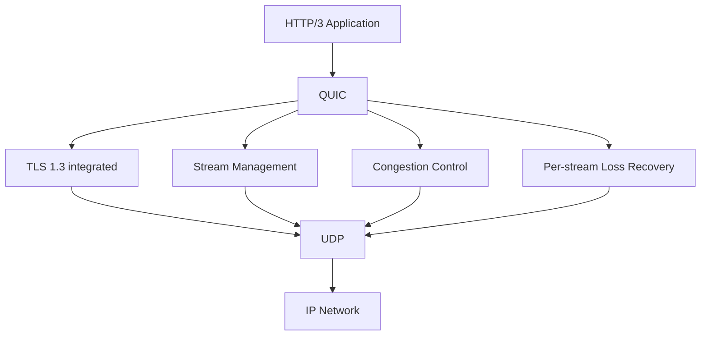

**⚡ TL;DR** - HTTP/3 replaces TCP with QUIC as the
transport layer. QUIC runs over UDP, implements
reliable delivery per-stream (not per-connection), and
combines the TLS handshake with the connection handshake
into 1 RTT (or 0-RTT for returning connections). The key
win: a lost packet only stalls the affected stream, not
all streams - solving TCP's head-of-line blocking that
limited HTTP/2. Used by Google (YouTube, Search) since
2016 and by ~28% of the web.

| #039 | Category: Networking | Difficulty: ★★★ |
|:---|:---|:---|
| **Depends on:** | HTTP/2 Multiplexing (NET-038) | |
| **Used by:** | gRPC and Protocol Buffers, HTTP Connection Management | |
| **Related:** | TCP (NET-020), HTTP/2 Multiplexing, gRPC | |

---

### 🔥 The Problem HTTP/3 Solves

HTTP/2 multiplexes 50 streams on one TCP connection.
TCP delivers bytes in-order. If one packet carrying data
for stream 7 is lost, the kernel buffers ALL received
bytes - for streams 1, 2, 3, 4, 5, 6 - until the
retransmit arrives. Every stream stalls for the 200ms+
retransmit timeout. On mobile networks with 1-5% packet
loss this is catastrophic. QUIC implements stream-aware
loss recovery: a lost packet stalls only the stream
that needs those bytes.

---

### 🧠 Intuition: QUIC = TCP + TLS at Application Layer

```
TCP + TLS:
  1. TCP 3-way handshake     (1 RTT)
  2. TLS 1.3 handshake       (1 RTT)
  3. First request           (1 RTT)
  Total: 3 RTTs before data arrives

QUIC:
  1. QUIC handshake (includes TLS 1.3)  (1 RTT)
  2. First request                       (1 RTT)
  Total: 2 RTTs before data arrives

  0-RTT (returning client):
  1. Client sends request with QUIC token  (0 RTT wait)
  Total: 1 RTT  ← data in first packet
```

---

### ⚙️ QUIC Architecture

```
Protocol stack comparison:

HTTP/1.1 + TLS:              HTTP/2 + TLS:
  Application: HTTP/1.1        Application: HTTP/2
  Transport:   TCP             Transport:   TCP
  TLS:         TLS 1.3         TLS:         TLS 1.3
  Network:     IP              Network:     IP

HTTP/3 + QUIC:
  Application: HTTP/3
  QUIC:        streams, reliability, congestion ctrl
  TLS 1.3:     integrated into QUIC (not optional)
  UDP:         datagram delivery
  Network:     IP

QUIC = UDP + (connection management + stream management
            + flow control + congestion control
            + loss recovery + TLS 1.3 security)
```



---

### ⚙️ Per-Stream Reliability: The Key Innovation

```
TCP reliability (connection-scoped):
  All bytes on a connection are sequenced globally
  Sequence number 10,001-11,460 lost (stream 7's data)
  TCP receiver CANNOT deliver bytes 11,461+ to application
  Even if those bytes belong to stream 1, 2, 3...
  All streams wait for the gap to be filled

QUIC reliability (stream-scoped):
  Each stream has independent byte offsets
  Stream 7's offset 0-1459 lost
  QUIC delivers stream 1's data immediately
  Stream 7 waits for retransmit of its own offset
  Other streams continue at full speed

Example:
  80 concurrent streams, 1% packet loss per RTT:
  - HTTP/2 (TCP): 1% × 80 streams = ~80% chance one stall/RTT
    → effectively stalled most of the time
  - HTTP/3 (QUIC): 1% × 80 streams → 80 per-stream stalls
    → 1% chance each stream is stalled per RTT → much better
```

---

### ⚙️ QUIC Connection and Handshake

```
QUIC connection ID:
  Unlike TCP (identified by 4-tuple: src/dst IP:port),
  QUIC connections have explicit Connection IDs
  
  Benefit: connection survives IP/port change
  Example: mobile switches from WiFi to LTE
    TCP: 4-tuple changes → all connections break
    QUIC: Connection ID unchanged → connection continues
  This is "connection migration" - critical for mobile

QUIC handshake (1-RTT):
  Client sends: ClientHello (includes crypto, QUIC version)
  Server sends: ServerHello + Certificate + Finished
  Client sends: Finished + first request (data!)
  → TLS and QUIC parameters established in one exchange
  → First data sent before handshake RTT completes

0-RTT resumption:
  Client has session ticket from prior connection
  Client sends: 0-RTT data + new ClientHello
  Server decrypts with session ticket key
  → Data arrives before any handshake roundtrip
  Security: 0-RTT is replayable - only use for idempotent ops!
```

---

### ⚙️ QUIC vs TCP Feature Comparison

```
┌──────────────────────────────────────────────────────────┐
│  Feature                 │  TCP        │  QUIC           │
├──────────────────────────┼─────────────┼─────────────────┤
│  Transport               │  Kernel     │  User space     │
│  Layer                   │  TCP        │  QUIC over UDP  │
│  Encryption              │  Optional   │  Mandatory (TLS)│
│  Connection setup        │  1 RTT + TLS│  1 RTT total    │
│  0-RTT                   │  No         │  Yes (replayable)│
│  HOL blocking            │  Conn-level │  Stream-level   │
│  Connection migration    │  No         │  Yes            │
│  Middlebox interference  │  Low        │  Possible (UDP) │
│  Deployment              │  OS kernel  │  Library update │
│  Firewall support        │  Universal  │  Some block UDP │
│  Packet loss handling    │  Conn-stall │  Stream-local   │
└──────────────────────────┴─────────────┴─────────────────┘
```

---

### ⚙️ Wrong vs Right: Blocking UDP for Performance

```
# BAD: "We block all UDP except DNS on our firewall"
# (Common enterprise security policy)
# Effect: HTTP/3 completely breaks, client falls back to HTTP/2
# The fallback is handled by ALPN negotiation:
#   Server advertises Alt-Svc: h3=":443" header
#   Client tries UDP 443 → blocked → falls back to TCP 443
#   All traffic via HTTP/2 → no HTTP/3 benefit

# GOOD: Allow UDP 443 (QUIC) in firewall rules
# Firewall rule (iptables):
# iptables -A INPUT -p udp --dport 443 -j ACCEPT
# iptables -A OUTPUT -p udp --sport 443 -j ACCEPT

# Check if HTTP/3 is working:
curl -v --http3 https://www.google.com 2>&1 | head -20
# Look for: * Using HTTP/3
# or Alt-Svc header in response

# If HTTP/3 fails, check firewall:
sudo tcpdump -n "udp port 443" -i eth0
# Should see UDP packets; if empty = UDP 443 blocked
```

---

### ⚙️ QUIC User-Space Deployment Advantage

```
TCP limitation: TCP is in the OS kernel
  New TCP feature (e.g., BBR, MPTCP) requires:
  - Kernel patch
  - OS upgrade across all servers
  - Testing with every application
  - Typically 3-5 years from RFC to widespread deployment

QUIC advantage: implemented in user space
  New QUIC feature requires:
  - Library update (e.g., ngtcp2, quiche, msquic)
  - Application restart
  - Hours to days, not years

Examples of rapid QUIC iteration:
  Google shipped QUIC internally in 2013
  RFC 9000 published May 2021
  Chrome 91 (June 2021) enabled HTTP/3 by default
  ~28% of web requests use HTTP/3 by 2024

QUIC libraries:
  nginx-quic (Cloudflare)   ← production nginx with QUIC
  quiche (Rust, Cloudflare) ← used by curl, Cloudflare
  ngtcp2 (C)                ← reference implementation
  msquic (C, Microsoft)     ← Windows/Azure
  aioquic (Python)          ← testing/prototyping
  lsquic (LiteSpeed)        ← web server implementation
```

---

### ⚙️ Diagnosing HTTP/3 in Production

```bash
# Check if a server offers HTTP/3
curl -sI https://www.google.com | grep -i "alt-svc"
# alt-svc: h3=":443"; ma=2592000

# Force HTTP/3 with curl
curl --http3 -v https://www.google.com 2>&1 | head -5
# * Using HTTP/3

# Check server advertises QUIC in response headers
curl -sI https://cloudflare.com | grep -i "alt-svc\|quic"
# alt-svc: h3=":443"; ma=86400

# Measure HTTP/3 vs HTTP/2 timing (needs curl with http3 support):
curl --http3 -o /dev/null -w "HTTP/3: %{time_total}s\n" \
  https://example.com
curl --http2 -o /dev/null -w "HTTP/2: %{time_total}s\n" \
  https://example.com

# nginx QUIC access log (shows protocol version):
# $http_version → "3.0" for HTTP/3
```

---

### ⚙️ Failure Example: 0-RTT Replay Attack

**Symptoms:** A payment API reports duplicate charges when
enabled with HTTP/3 0-RTT.

**Root cause:**

```
0-RTT sends data before completing the handshake.
The server decrypts using a session ticket key.

Attacker captures the 0-RTT datagram:
  → Contains the POST /charge?amount=100 request
  → Replays it after the legitimate connection closes
  → Server processes the request again: double charge!

Prevention:
  1. Disable 0-RTT for non-idempotent operations:
     # nginx: 
     # ssl_early_data off;  ← disables 0-RTT
     
  2. Use idempotency keys on server side:
     POST /charge
     Idempotency-Key: uuid-abc123
     → Server rejects duplicate key → no double charge
     
  3. 0-RTT is safe for: GET, search, read-only queries
     0-RTT is unsafe for: POST, PUT, DELETE, payment, auth

  RFC 9001 explicitly says:
  "Applications that use 0-RTT MUST make sure that
  replayed 0-RTT data is acceptable."
```

---

### 🔬 Under the Hood

```
QUIC packet types:
  Initial:     first handshake packets (crypto bootstrap)
  Handshake:   later handshake packets
  1-RTT:       application data (post-handshake)
  0-RTT:       early data (before handshake complete)
  Retry:       server challenges client with token

QUIC frame types (within packets):
  STREAM:      data for a specific stream (stream ID + offset)
  ACK:         acknowledgment with gap blocks (like SACK)
  CRYPTO:      TLS handshake data
  CONNECTION_CLOSE: graceful or error shutdown
  NEW_CONNECTION_ID: for connection migration
  MAX_DATA:    connection-level flow control
  MAX_STREAM_DATA: stream-level flow control

QUIC packet number space:
  Three independent spaces: Initial, Handshake, 1-RTT
  Monotonically increasing (never reused for retransmits)
  Retransmitted data gets a NEW packet number
  → No TCP ambiguity problem: clear ACK of original vs retransmit
```

---

### 📐 Scale Considerations

```
Mobile network (3% packet loss):
  HTTP/1.1: 6 connections, each retransmits independently
            Mixed performance
  HTTP/2:   1 connection, 50 streams all stall per loss
            ~3% × 50 = significant stalling
  HTTP/3:   1 connection, stream-scoped loss
            ~3% of each stream's data independently retransmitted
            Other streams unaffected → ~3x better perceived speed

CDN scale (Cloudflare handles HTTP/3):
  100M+ QUIC connections/day
  Connection ID routing: multiple servers can handle same conn
  Connection migration: mobile IP changes handled transparently

Server-side deployment:
  CPU: QUIC requires more CPU than TLS over TCP
       (user-space UDP vs kernel TCP path)
       ~15-30% more CPU for same throughput
  Memory: comparable to HTTP/2 (per-stream state)
  
  Optimization: reduce UDP syscalls with UDP GSO/GRO
  (Generic Segmentation Offload) for batching packets
```

---

### 🧭 Decision Guide

```
Should I deploy HTTP/3?
  YES if:
  - Your users are on mobile (WiFi ↔ LTE switching)
  - Global user base with high-latency paths
  - You use a CDN that already supports it (Cloudflare,
    Fastly, AWS CloudFront) → nearly free benefit

  MAYBE if:
  - Internal services: benefit is smaller, complexity higher
  - UDP 443 blocked by enterprise firewalls → fallback needed

  Consider carefully:
  - 0-RTT enabled for POST endpoints → security review required
  - More CPU for same throughput
  - Debugging tooling (Wireshark supports QUIC, curl supports h3)

When HTTP/3 matters most:
  - Mobile-first apps (Instagram, YouTube, TikTok)
  - Real-time apps (video calls over QUIC)
  - Global APIs with users in high-latency regions

Interview one-liner:
  "HTTP/3 runs over QUIC (UDP-based), which fixes TCP's
  HOL blocking by implementing per-stream loss recovery.
  A lost packet only stalls the affected stream. QUIC also
  combines the TLS handshake with connection setup (1 RTT
  vs 2 for TCP+TLS), and supports 0-RTT for returning
  clients. The tradeoff: more CPU, UDP may be blocked."
```
---
