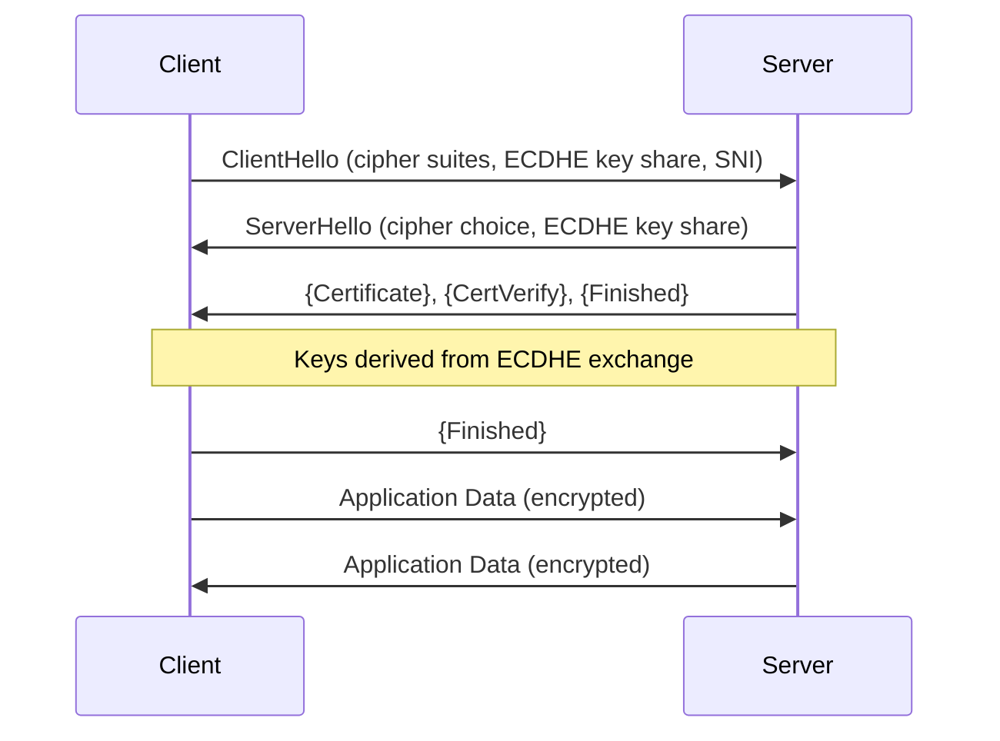

**⚡ TL;DR** - The TLS handshake authenticates the server
(via certificate), negotiates a cipher suite, and
establishes shared symmetric keys - all in 1 RTT (TLS
1.3) or 2 RTTs (TLS 1.2). TLS 1.3 is mandatory for all
new deployments: it eliminates RSA key exchange (forward
secrecy only via ECDHE), removes obsolete cipher suites,
and cuts handshake latency in half. Most TLS performance
problems are caused by certificate chain validation,
missing OCSP stapling, or oversized certificates.

| #044 | Category: Networking | Difficulty: ★★★ |
|:---|:---|:---|
| **Depends on:** | HTTP and HTTPS Basics (NET-030) | |
| **Used by:** | VPN Fundamentals, Networking System Design Interview Patterns | |
| **Related:** | HTTP and HTTPS Basics, VPN Fundamentals, Networking System Design | |

---

### 🔥 The Problem TLS Solves

HTTP sends data in plaintext. A coffee shop WiFi access
point can see every HTTP request: URLs, cookies, form
data, passwords. TLS wraps HTTP in an encrypted tunnel.
But encryption alone isn't enough - without authentication,
an attacker can set up their own server and present their
own certificate. TLS solves both: it authenticates the
server's identity (via certificate chain to a trusted CA)
AND encrypts the connection.

---

### 🧠 Intuition: Three Things TLS Provides

```
1. Authentication: "You are talking to the REAL example.com"
   Mechanism: server presents certificate signed by a CA
   Your OS/browser trusts a set of root CAs
   Chain: Root CA → Intermediate CA → example.com cert

2. Confidentiality: "Nobody can read your data in transit"
   Mechanism: symmetric encryption (AES-256-GCM typical)
   Keys derived from handshake, unique per session

3. Integrity: "Data was not tampered with in transit"
   Mechanism: HMAC/AEAD authentication tag on every record
   Modified data causes MAC verification failure → connection abort
```

---

### ⚙️ TLS 1.3 Handshake (the modern standard)

```
1 RTT to establish encrypted connection:

Client → Server:
  ClientHello:
    - TLS version: 1.3
    - Random bytes (32 bytes)
    - Supported cipher suites: TLS_AES_256_GCM_SHA384, etc.
    - Supported groups: x25519, P-256, P-384 (key exchange)
    - Key share: client's ECDHE public key
      (send it speculatively to save 1 RTT)
    - SNI: example.com (which domain to connect to)

Server → Client:
  ServerHello:
    - Selected cipher suite
    - Selected group (x25519 chosen)
    - Server's ECDHE public key
  {EncryptedExtensions} ← already encrypted from here
  {Certificate}
  {CertificateVerify}: server signs transcript with private key
  {Finished}: HMAC over entire handshake

  ← server uses pre-master secret derived from ECDHE to encrypt
    client and server public keys → shared secret via DH math

Client → Server:
  {Finished}: HMAC verifying server's handshake

Application data flows immediately after this!

Total: 1 RTT (vs TLS 1.2: 2 RTTs + separate key exchange)
```

**ASCII diagram:**

```
Client                         Server
  │                              │
  │──── ClientHello ─────────────▶│
  │     (key share, ciphers, SNI) │
  │                              │
  │◀──── ServerHello ────────────│
  │      {Certificate}           │
  │      {CertVerify}            │
  │      {Finished}              │
  │                              │
  │──── {Finished} ─────────────▶│
  │                              │
  │◀═══ Application Data ═══════▶│  ← encrypted
  │═══════════════════════════════│
  RTT1 completes, data flows
```



---

### ⚙️ TLS 1.2 vs TLS 1.3

```
┌──────────────────────────────────────────────────────────┐
│  TLS 1.2                   │  TLS 1.3                    │
├──────────────────────────  ┼──────────────────────────   │
│  2 RTT handshake           │  1 RTT handshake            │
│  0-RTT not supported       │  0-RTT resumption supported │
│  RSA key exchange: static  │  RSA key exchange: REMOVED  │
│  key (no forward secrecy)  │  ECDHE only (forward secrecy│
│  ~30 cipher suites         │  3 cipher suites (clean)    │
│  SHA-1 cert hashes allowed │  SHA-1 removed              │
│  RC4, 3DES allowed         │  Only AEAD ciphers          │
│  Separate key exchange step│  Key share in ClientHello   │
│  Certificate in cleartext  │  Certificate encrypted      │
└──────────────────────────  ┴──────────────────────────   │
```

---

### ⚙️ Certificate Chain Validation

```
A TLS certificate contains:
  - Subject: CN=api.example.com (or SAN extensions)
  - Issuer: intermediate CA name
  - Public key: server's RSA or EC public key
  - Validity: not before / not after dates
  - Signature: signed by issuer's private key
  - Extensions: SANs, key usage, OCSP URL, CRL URL

Chain of trust:
  Browser/OS trusts: ~150 Root CA certificates
  Root CA → signs → Intermediate CA certificate
  Intermediate CA → signs → Your domain certificate

  Validation steps:
  1. Is signature on your cert valid? (using intermediate's pubkey)
  2. Is signature on intermediate valid? (using root's pubkey)
  3. Is root CA in browser's trust store?
  4. Is your cert expired?
  5. Does CN or SAN match the hostname?
  6. Is the cert revoked? (OCSP check or CRL download)
  
  All 6 must pass, or browser shows error
```

**Common certificate errors:**

```
SSL_ERROR_BAD_CERT_DOMAIN:
  cert for www.example.com, connecting to api.example.com
  Fix: add api.example.com to SANs, or use wildcard *.example.com

CERTIFICATE_VERIFY_FAILED:
  Missing intermediate certificate in chain
  Server must send: [domain cert] + [intermediate cert]
  (root cert is NOT sent, it's pre-installed in browser)
  Fix: configure server to send full chain

CERTIFICATE_HAS_EXPIRED:
  Cert expired, Let's Encrypt didn't auto-renew
  Fix: certbot renew / check cron job

CERTIFICATE_UNKNOWN:
  Self-signed cert, not in trust store
  Fix: add cert to OS/browser trust store (dev only)
       or get cert from public CA (production)
```

---

### ⚙️ Wrong vs Right: Missing Certificate Chain

```bash
# BAD: server sends only the domain certificate
# Intermediate CA not included in TLS response
# Some clients have the intermediate cached, most don't
# Result: intermittent TLS failures in production

# Diagnose:
openssl s_client -connect api.example.com:443 \
  -showcerts 2>&1 | grep -E "^subject|^issuer"
# Only one subject/issuer pair = missing intermediate!
# Two pairs = full chain present

# GOOD: always include full chain
# nginx:
# ssl_certificate /etc/ssl/certs/fullchain.pem;
# fullchain.pem = domain.crt + intermediate.crt + [root.crt]
# (Let's Encrypt certbot creates fullchain.pem automatically)

# Verify chain is complete:
openssl verify -CAfile /etc/ssl/certs/ca-certificates.crt \
  /etc/ssl/certs/fullchain.pem
# Result: fullchain.pem: OK  ← chain validates
```

---

### ⚙️ OCSP Stapling: Eliminating Certificate Revocation Latency

```
Problem: Browser must check if cert is revoked
  Option 1: CRL download (certificate revocation list)
    Download a file listing all revoked certs
    CRL can be MB in size, checked before every new TLS conn
    
  Option 2: OCSP request (online certificate status protocol)
    HTTP request to CA's OCSP server
    "Is cert with serial X still valid?"
    Adds 50-200ms to TLS handshake for every new connection
    Privacy: CA learns which domains you're connecting to

  Option 3: OCSP stapling (best)
    Server fetches OCSP response and "staples" it to handshake
    Browser gets revocation status directly from server
    No additional roundtrip, no privacy leak
    Server refreshes stapled response every few hours

Enable in nginx:
  ssl_stapling on;
  ssl_stapling_verify on;
  resolver 8.8.8.8 8.8.4.4 valid=300s;
  resolver_timeout 5s;

Verify:
  openssl s_client -connect api.example.com:443 \
    -status 2>&1 | grep "OCSP Response Status"
  # OCSP Response Status: successful (0x0)  ← stapling works
```

---

### ⚙️ TLS Performance Tuning

```bash
# 1. Measure TLS handshake time
curl -o /dev/null -w "%{time_appconnect}s TLS\n%{time_connect}s TCP\n" \
  https://api.example.com
# TLS - TCP = TLS handshake time
# 0.08s typical (1 RTT TLS 1.3 + certificate validation)

# 2. Check TLS version in use
openssl s_client -connect api.example.com:443 2>&1 | grep "Protocol"
# Protocol: TLSv1.3  ← good

# 3. Check cipher suite
openssl s_client -connect api.example.com:443 2>&1 | grep "Cipher"
# Cipher: TLS_AES_256_GCM_SHA384  ← good (TLS 1.3)
# Cipher: AES256-SHA  ← bad (old, no forward secrecy)

# 4. Session resumption (reduces 1 RTT on returning clients)
# TLS 1.3 uses PSK (pre-shared key) session tickets
# Server sends New Session Ticket after handshake
# Client reuses: saves 1 RTT on reconnect
# Verify:
openssl s_client -connect api.example.com:443 \
  -sess_out /tmp/sess.pem 2>&1 | grep "Session-ID"
openssl s_client -connect api.example.com:443 \
  -sess_in /tmp/sess.pem 2>&1 | grep "Reused"
# "Reused, TLSv1.3, ..." ← session resumed

# 5. nginx TLS optimization config
# ssl_protocols TLSv1.2 TLSv1.3;
# ssl_ciphers ECDHE-ECDSA-AES256-GCM-SHA384:...; # TLS 1.2 only
# ssl_prefer_server_ciphers off;  # let client choose (TLS 1.3)
# ssl_session_cache shared:SSL:50m;  # session cache
# ssl_session_timeout 1d;
# ssl_session_tickets off;  # use cache, not tickets (forward secrecy)
```

---

### ⚙️ Failure Example: TLS Handshake Timeout in Production

**Symptoms:** Some clients fail to connect with
`connection reset` or `handshake timeout` errors,
especially on first connection.

**Diagnosis:**

```bash
# Capture TLS handshake
sudo tcpdump -i eth0 -n "port 443" -w /tmp/tls.pcap &
# Reproduce the failure
# Stop capture: pkill tcpdump
# Analyze: tshark -r /tmp/tls.pcap -Y "tls.handshake"

# Check if OCSP request is slow:
time curl -o /dev/null https://ocsp.example-ca.com
# > 1s = OCSP server is slow → blocking handshakes

# Check certificate size:
openssl s_client -connect api.example.com:443 \
  -showcerts 2>&1 | grep "BEGIN CERTIFICATE" | wc -l
# > 3 certificates = oversized chain, adds ~5KB to handshake

# Check if TLS 1.3 is actually being used:
# Some clients/proxies only support TLS 1.2
# nginx logs: $ssl_protocol → should show TLSv1.3

# Common fixes:
# 1. Enable OCSP stapling (eliminates OCSP latency)
# 2. Remove unnecessary certificates from chain
# 3. Use ECDSA cert (smaller key, faster) instead of RSA 4096
# 4. Enable session resumption for returning clients
```

---

### 📐 Scale Considerations

```
TLS at 100K TPS:
  Each handshake: ~1-2ms CPU (RSA 2048 sign/verify)
  100K new connections/s × 2ms = 200s of CPU per second
  = 200 cores just for TLS handshakes!
  
  Solutions:
  1. Session resumption: amortize handshake cost over many requests
  2. Connection keep-alive: HTTP/1.1 keep-alive, HTTP/2, HTTP/3
     Each connection handles 100s of requests → 1/100 handshake cost
  3. TLS termination at load balancer (AWS ALB, nginx)
     Backend servers use plain HTTP (within trusted network)
  4. ECDSA certificates (faster than RSA, smaller)
     ECDSA P-256 is ~10x faster than RSA 2048 for signing

Memory per TLS session (nginx):
  ~20KB per active connection
  1M concurrent connections × 20KB = 20GB
  → Use session cache with expiry to bound memory
```

---

### 🧭 Decision Guide

```
TLS 1.2 vs TLS 1.3?
  Always use 1.3 for new deployments.
  Keep 1.2 only for legacy client compatibility
  (older Android < 10, Windows 7, legacy IoT).
  Disable TLS 1.0 and 1.1 everywhere (deprecated, CVEs).

Self-signed cert vs CA-signed?
  Development: self-signed is fine (add to trust store locally)
  Production: never. Use Let's Encrypt (free) or commercial CA.
  Internal services: use internal CA (e.g., Vault PKI, step-ca)

Client certificate auth (mTLS)?
  Service-to-service in microservices: YES (via service mesh)
  End-user browser: only for high-security internal tools

OCSP stapling?
  Always enable on production servers. Non-negotiable.
  Without it: every new TLS connection incurs 50-200ms OCSP RTT.

Interview answer for "what happens in TLS handshake":
  "Client sends ClientHello with supported ciphers and ECDHE
  key share. Server responds with its key share and certificate.
  Both derive the same symmetric key via ECDHE math. Server
  sends encrypted Finished. Client verifies and sends Finished.
  TLS 1.3: 1 RTT. TLS 1.2: 2 RTTs. The cert chain is validated
  against trusted root CAs to authenticate the server's identity."
```