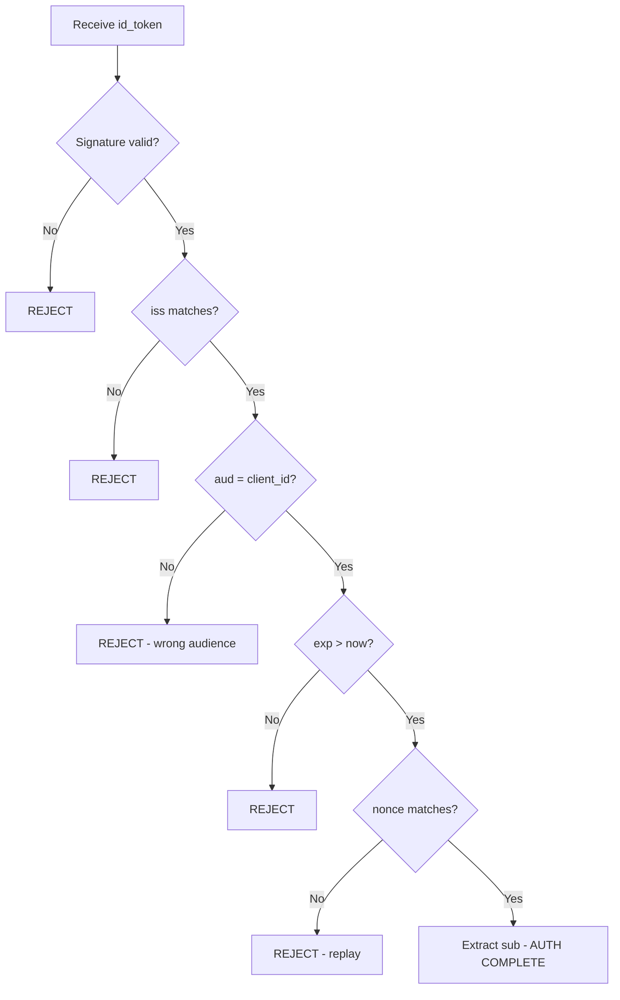

⚡ TL;DR - OAuth 2.0 is an authorization framework, not an
authentication protocol. It answers "what may this app do?" - not
"who is this person?" Confusing the two is the most dangerous
misconception in OAuth, and it has caused real security vulnerabilities.

---

### 🔥 The Problem This Solves

**WORLD WITHOUT IT:**

Developers new to OAuth see "Sign in with Google" and assume OAuth is
a login mechanism. They receive an access token, call the Google
`/userinfo` endpoint, get back a user email, and treat the email as
proof of identity. Their code: "if the token is valid and the email
matches, the user is authenticated."

This seems harmless until an attacker understands the design. OAuth
tokens are *audience-specific* only when the application validates
the audience claim. Without that check, an access token issued to
a malicious application can be presented to your application - and
your application happily accepts it. The attacker logged into your
app using a token your app never issued.

**THE BREAKING POINT:**

This exact vulnerability - using OAuth access tokens for
authentication without audience validation - is cataloged in the
OAuth 2.0 Threat Model (RFC 6819). Security researchers have found
it in production social login implementations at major platforms.

**THE INVENTION MOMENT:**

This is why OpenID Connect (OIDC) was invented on top of OAuth 2.0.
OIDC adds a second token - the `id_token` - that is specifically
designed for authentication. Unlike access tokens (which grant
API access), the `id_token` is a signed JWT that names your
specific application as its audience.

**EVOLUTION:**

When OAuth 2.0 launched in 2012, its authors explicitly warned
that it was not an authentication protocol. The community ignored
this. By 2014, the OpenID Connect 1.0 specification formalized
authentication on top of OAuth, defining exactly what an identity
token must contain and how applications must validate it. Today,
"Sign in with Google" is OIDC, not plain OAuth - but the
confusion persists.

---

### 📘 Textbook Definition

**Authentication** verifies *who* a principal is - it establishes
identity. The result is a claim: "This is Alice."

**Authorization** determines *what* a principal may do - it
establishes permissions. The result is a grant: "Alice's calendar
app may read her Google Calendar."

OAuth 2.0 is an authorization framework. An access token answers
"what is this client permitted to do?" - not "who owns this session?"
OpenID Connect 1.0 extends OAuth 2.0 with authentication semantics:
an `id_token` answers "who is this user?" with cryptographic binding
to a specific relying party (your application).

---

### ⏱️ Understand It in 30 Seconds

**One line:**
OAuth tells a guard what the visitor is allowed to do - it does not
check the visitor's ID.

**One analogy:**

> When a hotel staff member opens a maintenance closet with a master
> key, the lock does not know who the staff member is - only that they
> have the right key for this door. If someone steals that key and
> uses it on the same lock, the lock opens. Authentication is the
> front desk checking ID before issuing a key; OAuth is just the
> key itself.

**One insight:**
The danger is not that OAuth lacks authentication - it is that OAuth
*looks* like authentication. You get a token, call `/userinfo`, get
a user profile back. It feels like login. But without audience
validation on the `id_token`, any application that accepts
"a valid Google token" can be fooled by a token issued to a
different application.

---

### 🔩 First Principles Explanation

**CORE INVARIANTS:**

1. Authentication establishes identity - the answer to "who are you?"
2. Authorization grants permissions - the answer to "what may you do?"
3. A credential that proves permission does not prove identity.
4. Identity proof must be bound to the specific verifying party
   (the audience) to prevent replay across applications.

**DERIVED DESIGN:**

An access token is issued with a `scope` (what is allowed) and
typically a `client_id` (who requested it). It is not necessarily
bound to your application. If Application A and Application B both
trust the same authorization server, a user who grants access to A
cannot be assumed to have granted access to B - but an access token
from A might be accepted by B if B does not validate the audience.

For authentication, you need a token that:
- Names the verifying party explicitly (the `aud` claim)
- Contains an unforgeable identity claim (`sub`)
- Has a short TTL and cannot be reused across sessions (`nonce`)

This is the `id_token` (JWT format) defined by OpenID Connect. The
`aud` claim must match your application's `client_id`. Any token
without your `client_id` in `aud` must be rejected - even if it
is cryptographically valid.

**THE TRADE-OFFS:**

**Gain:** Separating authentication and authorization concerns allows
each to be optimized independently. Access tokens can be long-lived
for performance; id_tokens are short-lived for security.

**Cost:** Developers must understand both OAuth and OIDC, and must
implement both correctly. The `/userinfo` endpoint feels like an
easier "one-stop" solution - but it does not provide the audience
binding that prevents cross-app token reuse.

**ESSENTIAL vs ACCIDENTAL COMPLEXITY:**

**Essential:** Any honest authentication proof must be bound to the
specific verifier. This is irreducible - without audience binding,
any valid token becomes valid everywhere.

**Accidental:** The confusion between OAuth and OIDC exists because
they share the same flows, endpoints, and token format - a design
choice that eases adoption but creates conceptual overlap.

---

### 🧪 Thought Experiment

**SETUP:**

Two apps share the same Google OAuth integration: `app-a.com` and
`app-b.com`. Both trust Google's authorization server. A user logs
into `app-a.com` using their Google account. The access token issued
is valid for Google APIs with scope `email profile`.

**WHAT HAPPENS WITHOUT AUDIENCE VALIDATION:**

The attacker (who controls `app-a.com`) captures the access token.
They call `app-b.com/auth/google/callback` with this token. `app-b.com`
calls Google's `/userinfo` endpoint, gets the user's profile back (the
token is still valid), and considers the user authenticated. The
attacker has logged into `app-b.com` as the victim - using a token
the victim never intended for `app-b.com`.

**WHAT HAPPENS WITH PROPER OIDC:**

`app-b.com` uses the `id_token` from a flow the user completed at
`app-b.com`. The `id_token` has `aud: "app-b-client-id"`. When the
attacker presents the `id_token` from `app-a.com`, `app-b.com` checks
the `aud` claim, finds `app-a-client-id`, and rejects the token.
The victim's session at `app-b.com` is never compromised.

**THE INSIGHT:**

Authentication requires a token bound to the specific verifier.
Access tokens grant API access to anyone who holds them - they are
not identity proofs for your application.

---

### 🧠 Mental Model / Analogy

> Think of authorization as a concert wristband and authentication as
> a photo ID. The wristband proves you paid for a ticket (authorization)
> but does not prove who you are. A bouncer checking wristbands only
> verifies entry rights. If someone steals your wristband, they get in.
> A bouncer checking photo IDs matches the ticket to the person.

- "Wristband" - access token (grants entry to the API)
- "Photo ID" - id_token (proves who the user is)
- "Matching wristband to person" - audience validation in OIDC
- "Bouncer checking only wristbands" - using access tokens for auth
- "Wristband stolen, forged entry" - access token replay attack

Where this analogy breaks down: wristbands are visible and
physical; tokens are cryptographic and can be duplicated without
detection by the holder - making the absence of audience binding
more dangerous than it appears.

---

### 📶 Gradual Depth - Five Levels

**Level 1 - What it is (anyone can understand):**
OAuth answers "what is this app allowed to do?" - like a note saying
"this person may use the printer." It does not answer "who is this
person?" Authentication is a separate step that proves identity.

**Level 2 - How to use it (junior developer):**
For login ("who is this user?"), use OpenID Connect. The OIDC
flow adds an `id_token` (a JWT) to the standard OAuth access token
response. Validate the `id_token`'s signature, `aud` claim (must
match your `client_id`), `iss` claim, and `nonce` before trusting
any user identity claims inside it.

**Level 3 - How it works (mid-level engineer):**
The `id_token` is a signed JWT with claims: `sub` (user identifier),
`iss` (issuer URL), `aud` (your client_id), `iat` and `exp`
(timestamps), and optionally `nonce` (prevents replay). The signature
is verified using the authorization server's public key from its JWKS
endpoint. If `aud` does not include your `client_id`, the token must
be rejected regardless of signature validity.

**Level 4 - Why it was designed this way (senior/staff):**
The split was a deliberate architectural choice. OAuth 2.0 authors
wanted a flexible authorization framework usable across use cases
(API access, delegation, service accounts) without baking in
identity semantics. OIDC adds identity as a layer, allowing the
authorization server to be pure-OAuth for machine-to-machine use
cases while supporting full identity for user-facing flows.
This layering is elegant but requires developers to know which
layer they are operating at.

**Level 5 - Mastery (distinguished engineer):**
The deepest insight is that authentication and authorization are
fundamentally orthogonal concerns that happen to share infrastructure.
An experienced architect designs systems where these concerns are
explicitly separated in code - not because they are always independent,
but because conflating them causes the exact class of vulnerabilities
the OAuth community spent a decade documenting. When reviewing a
new authentication implementation, the first question is always:
"Where is the audience validated?"

---

### ⚙️ How It Works (Mechanism)

**OAuth 2.0 access token flow (authorization only):**

The access token encodes what the client may do. It does not
encode who the user is in a way that is safe to verify across
applications:

```
Access Token (JWT example):
{
  "iss": "https://accounts.google.com",
  "sub": "118234567890",    // user ID
  "aud": "google-apis",     // NOT your app's client_id
  "scope": "email profile",
  "exp": 1716000000
}
```

The `aud` is the resource server (Google APIs), not your app.
If your app checks "is this token valid?" by calling `/userinfo`,
you get user data back - but you did not verify the token was
meant for you.

**OpenID Connect id_token (authentication):**

```
id_token (JWT):
{
  "iss": "https://accounts.google.com",
  "sub": "118234567890",
  "aud": "YOUR-CLIENT-ID",  // bound to YOUR app
  "iat": 1715996400,
  "exp": 1715999400,        // short TTL: 1 hour
  "nonce": "random-per-req",// prevents replay
  "email": "alice@example.com",
  "name": "Alice"
}
```

The `aud` is your `client_id`. If someone presents an `id_token`
with a different `aud`, your application must reject it.

**Correct validation sequence for OIDC login:**

```
┌────────────────────────────────────────────────────┐
│          OIDC id_token Validation                  │
├────────────────────────────────────────────────────┤
│                                                    │
│  Receive id_token                                  │
│       │                                            │
│       ↓                                            │
│  Verify JWT signature using JWKS                   │
│       │ fail ──→ REJECT                            │
│       ↓                                            │
│  Check iss == expected issuer URL                  │
│       │ fail ──→ REJECT                            │
│       ↓                                            │
│  Check aud contains your client_id                 │
│       │ fail ──→ REJECT (token for other app)      │
│       ↓                                            │
│  Check exp > now                                   │
│       │ fail ──→ REJECT                            │
│       ↓                                            │
│  Check nonce == session nonce                      │
│       │ fail ──→ REJECT (replay attempt)           │
│       ↓                                            │
│  Extract sub as user identifier                    │
│       │                                            │
│       ↓                                            │
│  AUTHENTICATION COMPLETE                           │
└────────────────────────────────────────────────────┘
```



---

### 💻 Code Example

**Example 1 - Wrong vs Right: Using access token for authentication:**

```java
// BAD: Using access token to "authenticate" the user
// No audience validation - vulnerable to token theft attack
@PostMapping("/auth/google/callback")
public ResponseEntity<?> callback(
    @RequestParam String accessToken) {
  // Calls /userinfo with ANY valid Google access token
  // Attacker presents token from another app - succeeds!
  GoogleUserInfo user =
    googleClient.getUserInfo(accessToken);
  // WRONG: access token "aud" is not validated
  session.setAttribute("user", user.getEmail());
  return ResponseEntity.ok("Logged in as " + user.getEmail());
}
```

```java
// GOOD: Validate id_token with audience check (OIDC)
@PostMapping("/auth/google/callback")
public ResponseEntity<?> callback(
    @RequestParam String idToken,
    HttpSession session) {
  try {
    GoogleIdToken.Payload payload =
      verifier.verify(idToken);
    // verifier is configured with YOUR client_id
    // GoogleIdTokenVerifier rejects wrong audience
    if (payload == null) {
      return ResponseEntity.status(401)
        .body("Invalid id_token");
    }
    // Validate nonce to prevent replay attacks
    String sessionNonce =
      (String) session.getAttribute("nonce");
    if (!payload.getNonce().equals(sessionNonce)) {
      return ResponseEntity.status(401)
        .body("Nonce mismatch");
    }
    // sub is the stable user identifier - use it
    String userId = payload.getSubject();
    session.setAttribute("userId", userId);
    return ResponseEntity.ok("Authenticated");
  } catch (GeneralSecurityException e) {
    return ResponseEntity.status(401)
      .body("Token verification failed");
  }
}
```

- WHY: `GoogleIdTokenVerifier` is configured with your specific
  `client_id`. It rejects any token whose `aud` does not match.
- WHAT BREAKS: If you skip audience validation, an attacker with
  a valid Google access token from any application can impersonate
  any user at your application.
- HOW TO TEST: Obtain a Google access token from a *different*
  application (e.g. a test app with a different client_id).
  Present it to your callback. A secure implementation rejects it.

**Example 2 - Production: Spring Security + OIDC (correct setup):**

```java
// Spring Security auto-validates id_token audience
// application.yml
spring:
  security:
    oauth2:
      client:
        registration:
          google:
            client-id: ${GOOGLE_CLIENT_ID}
            client-secret: ${GOOGLE_CLIENT_SECRET}
            scope: openid,profile,email
            # "openid" scope triggers OIDC flow
            # Spring validates aud, iss, exp, nonce
        provider:
          google:
            issuer-uri: https://accounts.google.com
```

```java
// Access user identity from security context
@GetMapping("/profile")
public String profile(
    @AuthenticationPrincipal OidcUser user) {
  // OidcUser is the validated id_token payload
  String userId = user.getSubject(); // stable, use for DB key
  String email = user.getEmail();    // may change - not a key
  return "Hello " + email;
}
```

- WHY: Spring's `OidcUserService` validates the `id_token` fully
  (signature, aud, iss, exp, nonce). The `OidcUser` principal is
  only available if all validations pass.
- WHAT CHANGES AT SCALE: The `sub` claim is stable even if the
  user changes their email. Always use `sub` as the database key
  for the user record, not `email`.

---

### ⚖️ Comparison Table

| Token | Answers | Audience-Bound | Use For |
|---|---|---|---|
| **id_token (OIDC)** | Who is the user? | Yes (your client_id) | Login / authentication |
| Access token | What may the client do? | Resource server | API access |
| Refresh token | May the client get a new token? | Authorization server | Token renewal |
| API key | Who is this service? | Implicit (the API) | Machine auth |

How to choose: Use `id_token` for user login. Use access tokens
for calling APIs on behalf of a user. Never use an access token
as proof of user identity in your application.

---

### ⚠️ Common Misconceptions

| Misconception | Reality |
|---|---|
| "OAuth IS login - that is why we use it for Sign in with Google" | "Sign in with Google" is OpenID Connect, which *extends* OAuth 2.0 with authentication. Plain OAuth 2.0 has no authentication semantics. |
| "If I call /userinfo and get back an email, the user is authenticated" | You verified the token was valid at Google - not that it was issued for your application. Audience validation is the missing step. |
| "The access token's sub claim is the user's identity" | The `sub` in an access token identifies the user for the issuer, but is not audience-bound to your app. Use the `id_token`'s `sub`. |
| "Email is a stable identifier for users" | Email addresses change. The `sub` claim (a stable opaque user ID from the issuer) is the correct database key. Using email causes account collision when users change addresses. |
| "If the token signature is valid, authentication is complete" | Signature validity proves the token is genuine, not that it was issued for your application. The `aud` check is equally important. |

---

### 🚨 Failure Modes & Diagnosis

**Cross-Application Token Acceptance (Confused Deputy)**

**Symptom:**
Attacker can log into your application using an OAuth token that
was issued for a completely different application, impersonating
any user.

**Root Cause:**
Application validates token signature and calls `/userinfo` to
get user info, but does not validate the `aud` (audience) claim.
Any valid Google access token (regardless of which app it was
issued for) passes the check.

**Diagnostic Command / Tool:**

```bash
# Test: does your app accept tokens from other apps?
# 1. Get an access token from your own app
# 2. Decode the JWT to check its aud claim
echo "YOURTOKEN" | cut -d'.' -f2 \
  | base64 --decode 2>/dev/null | jq '.aud'

# 3. If using id_token, check audience
echo "YOURIDTOKEN" | cut -d'.' -f2 \
  | base64 --decode 2>/dev/null | jq '.aud'
# Expected: your application's client_id
# Vulnerable: "google-apis" or another app's client_id
```

**Fix:**
Switch from access token to `id_token` for authentication.
Validate `aud == your_client_id` before accepting any identity
claims from the token.

**Prevention:**
Use an OIDC library (Spring Security, Passport.js, Auth0 SDK) that
validates the audience automatically. Never write token validation
logic from scratch.

---

**Using Email as User Identifier (Account Collision)**

**Symptom:**
A user changes their Gmail address, signs in again, and is treated
as a new user. Or two different identity providers issue the same
email for different users, causing account merging.

**Root Cause:**
Application stores users by email (from the OIDC `email` claim)
instead of the stable `sub` (subject) identifier.

**Diagnostic Command / Tool:**

```sql
-- Check if your users table uses email as primary identifier
SELECT column_name, data_type
FROM information_schema.columns
WHERE table_name = 'users'
  AND column_name IN ('email', 'sub', 'provider_id');
-- If sub/provider_id is absent, you have this vulnerability
```

**Fix:**

```java
// Use sub (stable, issuer-scoped) as the primary key
// Use email only for display purposes
String userId = oidcUser.getSubject(); // OAU-stable
String email  = oidcUser.getEmail();   // display only

User user = userRepo.findByProviderAndSub(
  "google", userId
).orElseGet(() -> userRepo.save(
  new User(userId, "google", email)
));
```

**Prevention:**
Always store both the issuer (`iss`) and subject (`sub`) as a
composite key. The same `sub` from different issuers can refer to
different people.

---

### 🔗 Related Keywords

**Prerequisites (understand these first):**

- `The Delegation Problem - Why OAuth Exists` - what OAuth is for
- `JWT (JSON Web Token)` - the format of id_token and access tokens

**Builds On This (learn these next):**

- `OpenID Connect (OIDC)` - the authentication layer on top of OAuth
- `Token Validation` - full id_token validation rules
- `OAuth 2.0 Threat Model` - the complete attack catalog

**Alternatives / Comparisons:**

- `SAML 2.0` - older enterprise SSO that is natively an authentication
  protocol (not built on OAuth)
- `Session Cookies` - traditional authentication for first-party apps

---

### 📌 Quick Reference Card

```
┌──────────────────────────────────────────────────────────┐
│ WHAT IT IS   │ The distinction between what OAuth does   │
│              │ (authorize) vs what OIDC adds (identify)  │
├──────────────┼───────────────────────────────────────────┤
│ PROBLEM IT   │ Using OAuth access tokens as identity     │
│ SOLVES       │ proof enables cross-app token attacks     │
├──────────────┼───────────────────────────────────────────┤
│ KEY INSIGHT  │ Audience validation is what makes an      │
│              │ identity token different from an API token│
├──────────────┼───────────────────────────────────────────┤
│ USE WHEN     │ Need user login: use OIDC id_token,       │
│              │ validate aud == your client_id            │
├──────────────┼───────────────────────────────────────────┤
│ AVOID WHEN   │ Never use plain OAuth access tokens as    │
│              │ proof of user identity                    │
├──────────────┼───────────────────────────────────────────┤
│ ANTI-PATTERN │ "Token from Google /userinfo = logged in" │
│              │ without checking the token audience       │
├──────────────┼───────────────────────────────────────────┤
│ TRADE-OFF    │ OIDC correctness vs simpler /userinfo     │
│              │ shortcut that is insecure without aud     │
├──────────────┼───────────────────────────────────────────┤
│ ONE-LINER    │ "OAuth is a key; OIDC is an ID card.      │
│              │  Keys grant access; ID cards prove who."  │
├──────────────┼───────────────────────────────────────────┤
│ NEXT EXPLORE │ OpenID Connect → Token Validation → CSRF  │
└──────────────────────────────────────────────────────────┘
```

**If you remember only 3 things:**

1. OAuth is authorization. OpenID Connect is authentication. They
   share flows but answer different questions.

2. Always validate `aud == your_client_id` on the `id_token`.
   A token with the wrong audience must be rejected even if it
   is cryptographically valid.

3. Use the `sub` claim as the stable user identifier, not `email`.
   Emails change; `sub` does not.

**Interview one-liner:**
"OAuth 2.0 answers 'what may this client do?' with a scoped access
token. It does not answer 'who is this user?' OpenID Connect adds
an id_token with audience binding for that - and every secure
login implementation must validate the aud claim to prevent
cross-application token replay attacks."

---

### 💎 Transferable Wisdom

**Reusable Engineering Principle:**
Credentials must be bound to their intended verifier. A credential
that is valid everywhere becomes valuable to steal precisely because
it is universal. Adding audience scope - restricting what the
credential is valid for - converts a master key into a valet key,
limiting blast radius on compromise.

**Where else this pattern appears:**

- JWT validation in any context - the `aud` claim serves the same
  purpose in API gateway token validation, not just OIDC
- SSH host key verification - your SSH client validates the server's
  host key is specifically the host you intended to connect to,
  preventing MITM attacks
- TLS certificate validation - the CN/SAN must match the exact
  hostname you are connecting to; a valid cert for another domain
  is rejected

**Industry applications:**

- Banking apps - regulatory audits explicitly check that access
  tokens are audience-validated before user identity claims are
  trusted; PSD2/FAPI requirements enforce this
- Healthcare (SMART on FHIR) - patient apps must validate `aud`
  before accessing records; missing audience checks are flagged
  as critical vulnerabilities in security assessments

---

### 💡 The Surprising Truth

The RFC 6749 authors explicitly warned in the specification that
OAuth 2.0 "is not an authentication protocol." They added a
separate section titled "Authenticating Clients" specifically to
clarify that the framework did not handle user authentication.
Despite this explicit warning in the foundational document, the
misuse was so widespread by 2013 that the OpenID Foundation had
to publish OpenID Connect specifically to fix the resulting
security problems. The lesson: when a specification explicitly
tells you what it does NOT do, engineers will still use it for
that purpose - which is why explicit protocol layers (OIDC)
matter more than specification text.

---

### ✅ Mastery Checklist

**You've mastered this when you can:**

1. **[EXPLAIN]** Explain to a junior developer why calling
   `/userinfo` with an access token is not sufficient to
   authenticate a user - without using the word "audience."

2. **[DEBUG]** Given a production bug where users from Company A
   can log into Company B's app using their OAuth tokens, identify
   the specific validation step that is missing and the exact
   claim to check.

3. **[DECIDE]** Your team's mobile app uses a shared Google API
   project with your web app. Both use OAuth. Describe the exact
   risk this creates and how OIDC audience validation prevents it.

4. **[BUILD]** Configure Spring Security OIDC login for Google,
   ensuring that the id_token audience is validated against your
   specific client_id and that users are stored by `sub`, not
   `email`.

5. **[EXTEND]** A team builds an internal microservices platform
   and wants to use the same OIDC token for both user authentication
   and service-to-service authorization. Identify the design flaw
   and propose a correct architecture that handles both.

---

### 🧠 Think About This Before We Continue

**Q1.** Your company uses Google SSO. The engineering team has
three separate Google Cloud projects, each with their own
`client_id`. All three share the same user directory. A developer
suggests consolidating to one `client_id` to simplify token
validation. What security property do you lose when all three
apps share the same `client_id`, and when would this matter?

*Hint: Think about what a valid `id_token` with `aud: shared-client`
can be used for across all three apps - and what an attacker who
compromises one app can now do.*

**Q2.** An OIDC token's `nonce` claim is designed to prevent
replay attacks. If you do not validate the `nonce`, and an attacker
captures a user's `id_token` over a network they control, describe
step-by-step how the attacker can use that token to hijack the
user's session at your application.

*Hint: Consider the timing window. The id_token has a 1-hour TTL.
What can an attacker do within that window if the nonce is never
checked?*

**Q3.** Build a minimal OIDC id_token validator in pseudocode.
It should accept an id_token string and return a validated user
identity or an error. Which validation steps must run in exactly
which order, and why does order matter for security?

*Hint: Consider what happens if you check the expiry before the
signature - can a forged token pass the expiry check? What is the
cheapest check (local) vs the most expensive (network)? Optimize
for both security and performance.*

---

### 🎯 Interview Deep-Dive

**Q1: A developer implements "Sign in with Google" by exchanging the
authorization code for an access token, then calling Google's
/userinfo endpoint to get the user's email. They store the email in
a session cookie and consider the user authenticated. What is wrong?**

*Why they ask:* Tests whether the candidate understands the
authentication vs authorization distinction and audience binding.

*Strong answer includes:*
- Missing audience validation: the access token's `aud` is Google
  APIs, not your app - any valid Google access token could be used
- Correct approach: use OpenID Connect, receive `id_token`, validate
  `aud == your_client_id`, validate `iss`, `exp`, and `nonce`
- Using email as identifier: emails change; `sub` is stable
- The correct library approach: use a validated OIDC library
  rather than raw token parsing

**Q2: Your login system receives an id_token. Walk me through every
validation step required, in order, explaining why each step exists
and what attack it prevents.**

*Why they ask:* Tests depth of OIDC knowledge and security thinking.

*Strong answer includes:*
- Step 1: Verify JWT signature using JWKS public key - prevents
  forged tokens
- Step 2: Check `iss` matches expected issuer - prevents tokens
  from different providers
- Step 3: Check `aud` includes your `client_id` - prevents
  cross-application token replay (critical!)
- Step 4: Check `exp > now` - prevents expired token reuse
- Step 5: Check `nonce` matches session-stored nonce - prevents
  replay attacks within TTL window
- Only after all checks pass: extract `sub` as user identity

**Q3: How would you explain to a product manager why you cannot
simply use the access token that "Sign in with Google" already
provides for user authentication, and why you need a separate id_token?**

*Why they ask:* Tests ability to translate security concepts to
business stakeholders.

*Strong answer includes:*
- Access tokens grant API access (like a room keycard - proves
  permission, not identity)
- Without audience binding, any Google token could log anyone in
- Concrete risk: if a user ever grants access to any Google app,
  that token could be used to log them into your app
- id_token is specifically designed for authentication with
  your app's client_id in the `aud` field
- An OIDC library handles this correctly in a few lines of config