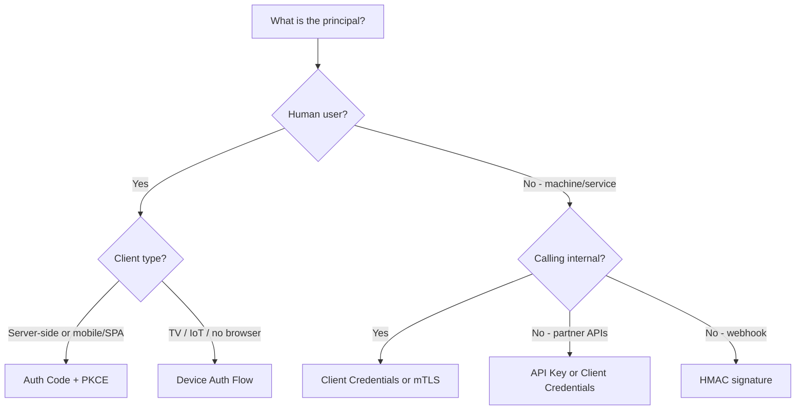

⚡ TL;DR - API authorization has evolved from shared passwords to
API keys to token-based delegation. OAuth 2.0 sits at the intersection
of three axes: who needs access (user vs service), how much trust the
client has (public vs confidential), and what type of access is needed
(delegated vs direct). Understanding this landscape helps you pick the
right mechanism before writing a line of code.

---

### 🔥 The Problem This Solves

**WORLD WITHOUT IT:**

A developer building an integration needs to call a third-party API.
Without context, they default to the first mechanism they find in a
tutorial - perhaps pasting an API key into `.env`, or asking a
colleague how to set up "the OAuth thing." They pick mechanisms by
copying patterns, not by understanding the design space.

Six months later, the integration breaks because the refresh token
expired. Or a security audit flags the fact that a server-side
microservice is using the Authorization Code flow designed for
browser-based apps. Or the API key has full admin access when the
integration only needed read access.

**THE BREAKING POINT:**

Every authorization mechanism exists because a specific combination
of client type, trust level, and access pattern had no good solution
before it. Picking the wrong mechanism creates either security
vulnerabilities (too much trust) or operational failures (mechanism
not designed for the use case).

**THE INVENTION MOMENT:**

The API authorization landscape is not chaos - it is a structured
space of decisions. Understanding the axes of that space lets you
navigate to the right answer confidently.

**EVOLUTION:**

The landscape evolved in response to real failures: API keys (simple
but non-delegated), OAuth 1.0 (delegated but cryptographically
complex), OAuth 2.0 (simplified delegation via HTTPS bearer tokens),
and now OAuth 2.1 (consolidating security lessons and deprecating
the flows that caused most of the vulnerabilities).

---

### 📘 Textbook Definition

API authorization is the process of determining whether a given
principal (user, service, or application) is permitted to perform a
requested action on a given resource. The landscape encompasses
credential types (passwords, API keys, tokens, certificates), grant
mechanisms (OAuth flows, SAML assertions, mTLS), and trust models
(delegated vs direct, user-mediated vs machine-to-machine).

---

### ⏱️ Understand It in 30 Seconds

**One line:**
API authorization is a spectrum from "trust this service completely"
(API keys) to "trust this service with exactly what the user just
approved" (OAuth delegation).

**One analogy:**

> Imagine a city with different ways to enter a building: a master
> key (API key - access to everything), a visitor badge for a specific
> floor (OAuth token - scoped to what the visitor requested), and a
> biometric badge tied to an employee identity (mutual TLS - both
> parties are authenticated cryptographically). Different visitors
> need different access, and different buildings have different
> security requirements.

**One insight:**
The most important axis in the authorization landscape is
*delegation* - does the access represent a user's choice, or
a service's standing credentials? This distinction drives almost
every design decision that follows.

---

### 🔩 First Principles Explanation

**CORE INVARIANTS:**

1. All authorization reduces to: "Does principal P have permission
   to perform action A on resource R?"

2. The answer depends on three independent variables: who P is,
   what they are allowed to do, and on whose behalf they act.

3. Different mechanisms make different trade-offs across security,
   simplicity, revocability, and expressiveness.

**DERIVED DESIGN:**

The landscape can be mapped across three axes:

- **Axis 1: Client Type** - Public client (browser, mobile app, no
  safe secret storage) vs Confidential client (server, can keep a
  secret). This determines whether a `client_secret` can be used.

- **Axis 2: Delegation** - User-delegated (the access represents
  choices made by a human user) vs Service-direct (the service acts
  on its own authority, no user involved).

- **Axis 3: Trust Scope** - Full trust (API key grants everything)
  vs Scoped trust (token grants specific actions).

Each mechanism maps to a region in this space:

```
┌────────────────────────────────────────────────┐
│         API Authorization Mechanism Map        │
├────────────────────────────────────────────────┤
│                                                │
│  HIGH TRUST                                    │
│  (full access)                                 │
│       │ API Keys ──────────────────────────    │
│       │                                        │
│       │           Basic Auth ───────────────   │
│       │                                        │
│  LOW TRUST                                     │
│  (scoped)                                      │
│       │ OAuth CC ──── machine-to-machine       │
│       │                                        │
│       │ OAuth AC ──── user-delegated           │
│       │                                        │
│       │ mTLS ─────── mutual identity           │
│       │                                        │
│       ◄────────────────────────────────────    │
│  Service-direct        User-delegated          │
└────────────────────────────────────────────────┘
```

**THE TRADE-OFFS:**

**Gain:** Matching the mechanism to the use case gives you the right
security properties with minimal complexity.

**Cost:** Each mechanism requires different infrastructure (OAuth
needs an authorization server; mTLS needs a PKI). Choosing a
complex mechanism for a simple use case wastes engineering effort.

**ESSENTIAL vs ACCIDENTAL COMPLEXITY:**

**Essential:** Authorization always requires at least (1) a
credential that proves authority, (2) a way to validate that
credential, and (3) a way to revoke it. These are irreducible.

**Accidental:** The fragmentation of the landscape (multiple OAuth
grant types, SAML, proprietary schemes) is historical accumulation,
not inevitable complexity.

---

### 🧪 Thought Experiment

**SETUP:**

You have three integrations to build:
1. A CI/CD pipeline that needs to deploy to your Kubernetes cluster.
2. A mobile app that lets users upload photos to their Google Drive.
3. A B2B webhook integration where a partner's server sends events
   to your API.

**WHAT HAPPENS WITHOUT THE LANDSCAPE MAP:**

You pick OAuth 2.0 for everything because it is "the modern standard."
The CI/CD pipeline uses Authorization Code flow - which requires
a browser redirect and user interaction. This is impossible for
an automated pipeline. You work around it by hardcoding credentials
in the OAuth flow, which defeats the purpose. The webhook integration
uses a shared secret but you implement it as an OAuth Implicit flow,
exposing the token in every response URL.

**WHAT HAPPENS WITH THE LANDSCAPE MAP:**

1. CI/CD pipeline: no user, server-to-server - Client Credentials
   flow. The pipeline authenticates as itself, no user involved.

2. Mobile photo upload: user delegates access to their Google Drive -
   Authorization Code + PKCE (public client, user-delegated).

3. B2B webhook: partner server sends events to you - HMAC signature
   on the webhook payload (no OAuth needed; the partner is the
   resource owner, not a delegator).

**THE INSIGHT:**

Authorization mechanisms are specialized tools. Using the wrong
tool forces awkward workarounds that create security problems.

---

### 🧠 Mental Model / Analogy

> Think of the authorization landscape as a toolbox. A hammer is
> not better than a screwdriver - they solve different problems.
> API keys are hammers (simple, powerful, blunt). OAuth is a
> precision screwdriver set (multiple tips for different screw
> types). mTLS is a combination lock (both parties prove themselves).
> The skill is knowing which tool the job requires.

- "Hammer" - API key: powerful, simple, no granularity
- "Precision screwdriver" - OAuth token: right scope for the job
- "Combination lock" - mTLS: both client and server verify identity
- "Using a hammer on a screw" - using API keys for user delegation
- "Choosing the right tip" - picking the right OAuth grant type

Where this analogy breaks down: in security, using the wrong
mechanism is not just inefficient - it creates exploitable
vulnerabilities. The cost is higher than a stripped screw.

---

### 📶 Gradual Depth - Five Levels

**Level 1 - What it is (anyone can understand):**
There are multiple ways to control who can use an API. Some are
simple (API keys - like a password for the service). Some are
sophisticated (OAuth - a system for letting users delegate
specific access). Choosing the right one depends on whether a
human user is involved and how much trust the API needs to grant.

**Level 2 - How to use it (junior developer):**
When building an API integration, answer three questions: (1) Is a
human user delegating access, or is this service-to-service? (2) Is
the client running in a trusted environment (server) or untrusted
(browser/mobile)? (3) Does the integration need full access or
specific scoped access? These answers map directly to a mechanism.

**Level 3 - How it works (mid-level engineer):**
The landscape has two fundamental divisions. Delegated access (OAuth
AC, Device Flow) requires a user consent step; non-delegated access
(API keys, Client Credentials, mTLS) does not. For delegated access,
client type (public vs confidential) determines whether PKCE or
client_secret is used. For non-delegated, the trust model (full vs
scoped) determines whether API keys or Client Credentials are
appropriate.

**Level 4 - Why it was designed this way (senior/staff):**
The proliferation of grant types in OAuth 2.0 reflects the reality
that no single flow fits all use cases. The Authorization Code flow
was designed for server-side web apps in 2012; PKCE was added later
for mobile and SPAs; Device Flow was added for IoT; Client
Credentials for service mesh. Each is a response to a real gap.
The downside: developers must understand the full landscape to
choose correctly, which is why most security vulnerabilities in OAuth
implementations stem from using the wrong grant type.

**Level 5 - Mastery (distinguished engineer):**
The authorization landscape is not static. OAuth 2.0 bearer tokens
(trust the token holder) are giving way to sender-constrained tokens
(DPoP, mTLS) that bind the token to the client's cryptographic key.
This shift is driven by the observation that bearer token theft is
the dominant OAuth attack vector. A staff engineer evaluates
the landscape not just for today's requirements but for the trust
model evolution their platform will need at the next order of
magnitude of scale or sensitivity.

---

### ⚙️ How It Works (Mechanism)

**The decision tree:**

```
┌─────────────────────────────────────────────────────┐
│         Authorization Mechanism Selection           │
├─────────────────────────────────────────────────────┤
│                                                     │
│  START: What is the principal?                      │
│       │                                             │
│       ├──→ Human user delegating to an app          │
│       │         │                                   │
│       │         ├──→ App is a server-side web app   │
│       │         │         → Auth Code + PKCE        │
│       │         │                                   │
│       │         ├──→ App is a mobile/SPA            │
│       │         │         → Auth Code + PKCE        │
│       │         │                                   │
│       │         └──→ App is on a TV/IoT device      │
│       │                   → Device Auth Flow        │
│       │                                             │
│       └──→ Machine / service (no user)              │
│                 │                                   │
│                 ├──→ Calling internal APIs          │
│                 │         → Client Credentials      │
│                 │           or mTLS                 │
│                 │                                   │
│                 ├──→ Calling partner APIs           │
│                 │         → API Key or              │
│                 │           Client Credentials      │
│                 │                                   │
│                 └──→ Webhook receiver               │
│                           → HMAC signature          │
│                             verification            │
└─────────────────────────────────────────────────────┘
```



---

### ⚖️ Comparison Table

| Mechanism | User-Delegated | Client Type | Revocable | Best For |
|---|---|---|---|---|
| **OAuth Auth Code + PKCE** | Yes | Any | Yes | User-delegated access, all client types |
| OAuth Client Credentials | No | Confidential | Yes (token TTL) | Service-to-service |
| API Key | No | Any | Yes (key rotation) | Simple service auth, partner APIs |
| mTLS | No | Any (with cert) | Yes (cert revocation) | High-trust machine auth |
| Basic Auth | No | Any | No (change password) | Legacy only |
| Device Auth Flow | Yes | Public | Yes | Browserless devices (TV, CLI) |
| SAML 2.0 Assertion | Yes | Confidential | Limited | Enterprise SSO federation |

How to choose: Start with whether a human user is delegating access.
If yes, use Auth Code + PKCE. If no (machine-to-machine), use
Client Credentials or API keys depending on whether the API supports
OAuth. Reserve mTLS for high-security environments with PKI.

---

### ⚠️ Common Misconceptions

| Misconception | Reality |
|---|---|
| "OAuth is always the best choice" | OAuth adds authorization server dependency and redirect flows. For simple service-to-service calls without user delegation, API keys or Client Credentials are often simpler and sufficient. |
| "API keys are insecure and should be replaced with OAuth" | API keys are insecure only if they are never rotated, have no scope limits, and are not protected in transit. A well-managed, scoped, rotated API key is appropriate for many machine-to-machine use cases. |
| "The Authorization Code flow works for server-side AND browser apps" | True, but browser/mobile apps (public clients) must add PKCE. Without PKCE, a public client using Auth Code flow has no way to verify the code was issued to it specifically. |
| "mTLS is too complex for modern applications" | mTLS is complex to set up manually, but service mesh platforms (Istio, Linkerd) automate it. For zero-trust internal APIs, mTLS provides the strongest mutual authentication available. |
| "Webhooks should be secured with OAuth" | Webhooks are push events from the sender to your endpoint. OAuth is pull-oriented (client fetches tokens). Webhook security is typically HMAC signature verification on the payload, not OAuth. |

---

### 🚨 Failure Modes & Diagnosis

**Wrong Grant Type for Use Case**

**Symptom:**
CI/CD pipeline authentication requires a browser, or a mobile app
cannot complete login without a server-side component, or a service
account flow breaks when no user is present.

**Root Cause:**
Authorization Code flow (requires user interaction) used for
machine-to-machine access, or Client Credentials (no user) used
for user-delegated access.

**Diagnostic Command / Tool:**

```bash
# Check what grant_type your app requests
# Look for grant_type in token exchange calls
grep -rn "grant_type" src/ --include="*.java"
# Authorization Code: grant_type=authorization_code
# Client Credentials: grant_type=client_credentials
# Device Flow: grant_type=urn:ietf:params:oauth:grant-type:device_code

# Check if there is a user present in a service account flow
# If you see redirect_uri in a non-browser context: wrong grant
grep -rn "redirect_uri" config/ --include="*.yml"
```

**Fix:**
Map the use case to the correct grant type using the decision tree.
For automated pipelines, use Client Credentials. For user-delegated
access from any client, use Auth Code + PKCE.

**Prevention:**
Include authorization mechanism selection as part of API integration
design review before coding starts.

---

**Full-Scope API Key Where Scoped Token Needed**

**Symptom:**
An API key breach exposes full admin access when the integration
only needed read access. Audit log shows the compromised key
performing destructive operations.

**Root Cause:**
API key grants full access without scope restriction. There was no
mechanism to limit what the key could do at issuance time.

**Diagnostic Command / Tool:**

```bash
# Audit current API key permissions in AWS
aws iam list-access-keys --user-name service-account-name
aws iam simulate-principal-policy \
  --policy-source-arn arn:aws:iam::123:user/svc \
  --action-names "*" \
  --query 'EvaluationResults[?EvalDecision==`allowed`]'
# Any "allowed" action beyond what the integration needs
# is excess privilege - replace with scoped OAuth tokens
```

**Fix:**
Replace full-access API keys with OAuth Client Credentials tokens
scoped to exactly what the service needs. Rotate existing keys
and scope new ones at issuance.

**Prevention:**
Enforce "minimum scope" as part of API key issuance policy. Any
key with `*` or admin scope requires security review.

---

### 🔗 Related Keywords

**Prerequisites (understand these first):**

- `The Delegation Problem - Why OAuth Exists` - why this landscape exists
- `HTTP Headers` - how credentials are transmitted in API calls

**Builds On This (learn these next):**

- `Grant Types Overview` - detailed guide to each OAuth 2.0 flow
- `Client Credentials Flow` - the machine-to-machine OAuth pattern
- `Authorization Code Flow` - the user-delegated OAuth pattern

**Alternatives / Comparisons:**

- `SAML 2.0` - enterprise SSO alternative to OAuth, XML-based
- `mTLS` - mutual certificate authentication for high-trust services

---

### 📌 Quick Reference Card

```
┌──────────────────────────────────────────────────────────┐
│ WHAT IT IS   │ The structured decision space for API     │
│              │ authorization mechanisms                  │
├──────────────┼───────────────────────────────────────────┤
│ PROBLEM IT   │ Developers pick mechanisms by copying     │
│ SOLVES       │ tutorials, not by matching use cases      │
├──────────────┼───────────────────────────────────────────┤
│ KEY INSIGHT  │ The first question is always: is a human  │
│              │ user delegating, or is this machine-only? │
├──────────────┼───────────────────────────────────────────┤
│ USE WHEN     │ Designing a new API integration or        │
│              │ reviewing an existing auth mechanism      │
├──────────────┼───────────────────────────────────────────┤
│ AVOID WHEN   │ Do not apply OAuth to all use cases by    │
│              │ default - it is often overkill for simple │
│              │ service-to-service calls                  │
├──────────────┼───────────────────────────────────────────┤
│ ANTI-PATTERN │ Using OAuth Authorization Code flow for   │
│              │ automated pipelines (requires user/browser)│
├──────────────┼───────────────────────────────────────────┤
│ TRADE-OFF    │ Richer authorization model vs additional  │
│              │ infrastructure (auth server, PKCE, etc.)  │
├──────────────┼───────────────────────────────────────────┤
│ ONE-LINER    │ "Match the credential to the use case:    │
│              │  user-delegated = OAuth; service = keys"  │
├──────────────┼───────────────────────────────────────────┤
│ NEXT EXPLORE │ Grant Types → Auth Code + PKCE → CC Flow  │
└──────────────────────────────────────────────────────────┘
```

**If you remember only 3 things:**

1. The central question: is a human user delegating access, or is
   this machine-to-machine? That answer drives everything.

2. Do not default to OAuth for everything - simpler mechanisms are
   appropriate for simple service-to-service access.

3. API keys are fine when properly scoped, rotated, and protected -
   they are not automatically less secure than OAuth.

**Interview one-liner:**
"API authorization spans from simple API keys (full trust, any
client) to OAuth tokens (scoped, user-delegated, time-limited) to
mTLS (mutual cryptographic identity). The right choice depends on
three variables: whether a human user is delegating, what trust level
the client environment has, and how granular the permissions need to be."

---

### 💎 Transferable Wisdom

**Reusable Engineering Principle:**
Use the right level of trust for the job. Over-trusting (full access
where scoped is sufficient) creates excess blast radius on breach.
Under-trusting (adding OAuth complexity where a simple signed
request suffices) creates operational burden without security benefit.
Security and simplicity are not in opposition when you match the
mechanism to the actual threat model.

**Where else this pattern appears:**

- Database access - connecting as root vs a scoped application user
  vs a read-only reporting user; the same trust landscape in a
  different domain
- File system permissions - user, group, world permissions; the
  same least-privilege structure applied to file access
- Network firewall rules - "allow all" vs specific port/IP allow
  lists; the same scoping principle for network traffic

**Industry applications:**

- Platform engineering - internal developer platforms must define
  the authorization landscape for their organization's API catalog,
  choosing consistent mechanisms that developers can use without
  making individual security decisions on each integration
- Open Banking - regulatory frameworks (PSD2, CDR) mandate specific
  authorization mechanisms (OAuth 2.0 / FAPI) for specific access
  patterns (account reading vs payment initiation)

---

### 💡 The Surprising Truth

The most security-critical decision in API authorization is not which
mechanism you choose - it is the scope you grant. A perfectly
implemented OAuth flow with a `scope: *` is less secure than a
simple API key with a narrow read-only scope. The mechanism defines
the security ceiling; the scope defines the actual blast radius on
compromise. Most security audits focus on mechanism (is it OAuth?)
and miss the scope (can this token delete all data?). The 2019
Facebook token leak compromised 50 million accounts not because the
OAuth implementation was wrong but because the tokens had
`publish_actions` scope - far broader than what any user expected a
"View as" feature to need.

---

### ✅ Mastery Checklist

**You've mastered this when you can:**

1. **[EXPLAIN]** Given a new integration requirement in a design
   review, ask exactly two questions to determine the correct
   authorization mechanism - without needing to consult a reference.

2. **[DEBUG]** A CI/CD pipeline fails with an OAuth error saying
   "redirect_uri is required." Identify the wrong grant type in use
   and name the correct replacement.

3. **[DECIDE]** A team asks whether to use API keys or OAuth Client
   Credentials for their internal microservice communication. Walk
   through the decision criteria including token lifetime,
   revocability, and operational overhead.

4. **[BUILD]** Design the authorization strategy for a platform with
   three integration types: user-facing mobile app, internal
   service mesh, and external partner webhooks. Name the mechanism
   for each and the reason.

5. **[EXTEND]** A financial services platform is migrating from API
   keys to OAuth. Identify the two non-OAuth scenarios in that
   platform (webhook receiving, service mesh) where OAuth would be
   the wrong tool, and propose the correct mechanism for each.

---

### 🧠 Think About This Before We Continue

**Q1.** Your platform has 200 internal microservices communicating
via REST. The security team proposes replacing all API keys with
OAuth Client Credentials flows. What are the three operational
costs of this migration that would not exist with API keys, and how
do you weigh them against the security benefit?

*Hint: Think about what Client Credentials requires that API keys
do not (an authorization server, token refresh logic, discovery
endpoints). At 200 services, each calling the auth server N times
per minute, what is the auth server load? What happens when it
goes down?*

**Q2.** A partner wants to receive webhook events from your platform.
They propose using OAuth tokens in the webhook payload header. You
disagree. Walk through exactly why OAuth is the wrong tool for
securing webhook delivery, and what the correct mechanism is.

*Hint: Webhooks are push events. Who is the resource owner? Who
authenticates to whom? What does OAuth's delegation model require
that webhooks cannot provide?*

**Q3.** Build a service that accepts API requests from three types
of callers: (1) human users via a browser, (2) automated CI/CD
pipelines, (3) a partner company's backend service. Design the
authorization scheme for each caller type, specifying the exact
mechanism, credential storage approach, and token TTL. What single
piece of infrastructure is shared, and what is separate?

*Hint: All three can use the same authorization server. What is
different is the grant type, the audience, and the credential
format. What must the authorization server store for each case?*

---

### 🎯 Interview Deep-Dive

**Q1: You are reviewing a PR where a developer has implemented OAuth
Authorization Code flow in a CI/CD pipeline to deploy to AWS. What
is wrong and what should they use instead?**

*Why they ask:* Tests understanding of when OAuth grant types are
appropriate.

*Strong answer includes:*
- Authorization Code flow requires user interaction (a browser
  redirect to a consent screen) - impossible in automated pipelines
- Correct mechanism: OAuth Client Credentials flow (service acts
  on its own behalf, no user involved) or cloud-native IAM roles
  (AWS IAM roles for EC2/Lambda, no credentials needed at all)
- Deeper answer: for AWS specifically, IAM instance roles are
  better than OAuth Client Credentials because they rotate
  credentials automatically with no client secret to protect

**Q2: A junior developer says "We should use OAuth everywhere - it is
more secure than API keys." How do you respond?**

*Why they ask:* Tests nuanced security judgment over dogma.

*Strong answer includes:*
- OAuth is not inherently more secure - it is appropriate for
  specific use cases (user delegation, multi-tenant, standard scoping)
- API keys are appropriate for machine-to-machine calls when
  properly managed (stored in secrets manager, scoped, rotated)
- The actual security properties that matter: is access scoped to
  minimum privilege? Is the credential revocable? Is it protected
  at rest and in transit? Both OAuth tokens and API keys can
  satisfy or fail these criteria depending on implementation
- Additional OAuth complexity (auth server, token refresh, redirect
  flows) is only worth it when delegation or standard scoping is needed