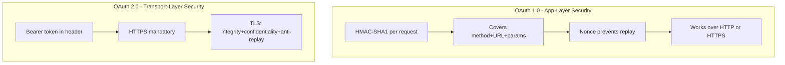
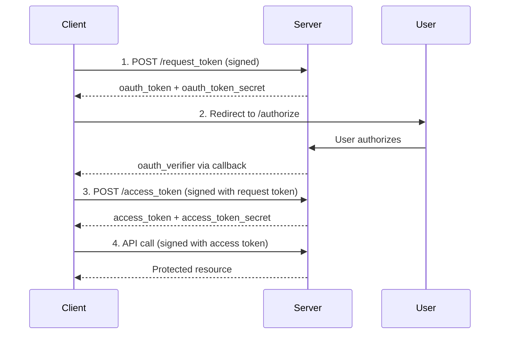

⚡ TL;DR - OAuth 1.0 required cryptographically signing every request
by combining HTTP method, URL, parameters, and two secrets in an
exact order - one wrong character silently fails. OAuth 2.0 abandoned
signatures entirely, betting on mandatory HTTPS to carry security,
and replaced the whole mechanism with a simple bearer token.

---

### 🔥 The Problem This Solves

**WORLD WITHOUT IT:**

You are a developer in 2009. Twitter just opened its API and you
want to post tweets on behalf of users. Twitter uses OAuth 1.0.
You spend day one reading the spec, day two implementing percent-
encoding rules, and day three debugging 401 errors. The only error
message: "Invalid signature." That is all you get. Is the nonce
format wrong? Is the timestamp too old? Did you sort parameters
before or after encoding them? Did you use `%20` or `+` for spaces
in the base string vs the header?

**THE BREAKING POINT:**

The OAuth 1.0 signing algorithm required combining the HTTP method,
the URL (percent-encoded in a specific way), and every parameter
(sorted alphabetically, each percent-encoded individually, then the
entire collection percent-encoded again) using `&` separators. Then
HMAC-SHA1 the result using `consumer_secret&token_secret` as the
key. One extra space in a URL, one wrong encoding decision, and the
signature fails silently. Server and client compute different
signatures from what looks like identical input. Debugging is
guesswork without the ability to inspect the server's base string.

**THE INVENTION MOMENT:**

This is exactly why OAuth 2.0 was created - to move security to
the transport layer and make delegated authorization accessible
to every developer, not just cryptography experts.

**EVOLUTION:**

OAuth 1.0 emerged in 2007 from a collaboration between Blaine Cook
(Twitter), Chris Messina, and others to solve the password anti-
pattern on the early social web. OAuth 1.0a (RFC 5849, April 2010)
patched a session fixation vulnerability. OAuth 2.0 (RFC 6749,
October 2012) broke backward compatibility entirely - discarding
signatures in favor of bearer tokens over mandatory HTTPS. The
field now moves toward OAuth 2.1, which consolidates the security
lessons of a decade of production experience.

---

### 📘 Textbook Definition

OAuth 1.0 (RFC 5849) is an authorization protocol that uses
per-request HMAC-SHA1 cryptographic signatures to authenticate API
calls, requiring clients to compute a signature from the HTTP
method, URL, parameters, timestamp, nonce, consumer key, and token
on every request. OAuth 2.0 (RFC 6749) is an incompatible redesign
that delegates transport security to TLS/HTTPS and replaces
per-request signatures with opaque or JWT bearer tokens. The two
protocols share goals but differ completely in mechanism, threat
model, and implementation requirements.

---

### ⏱️ Understand It in 30 Seconds

**One line:**
OAuth 1.0 made every API call a signed notarized document; OAuth 2.0
said use a locked mailbox (HTTPS) and just put the key inside.

**One analogy:**

> OAuth 1.0 is like using a notary to certify every message you
> send - legally airtight, but you must get every detail exactly
> right or the notarization is void. OAuth 2.0 is like using a
> locked safe-deposit box: the bank (HTTPS) guarantees only the
> key-holder can open it, so the message inside just needs to be
> the right key, not a certified document.

**One insight:**
The fundamental shift was which layer owns security. OAuth 1.0 made
every client responsible for cryptographic correctness on every
request, because HTTPS was not yet universal. OAuth 2.0 transferred
that burden to the transport layer once TLS became ubiquitous. The
cost: OAuth 2.0 tokens are worthless if transported without TLS.

---

### 🔩 First Principles Explanation

**CORE INVARIANTS:**

1. A third party must prove its identity and authorization to the
   resource server on every API call.

2. An attacker who intercepts a message must not be able to replay
   it without modification being detectable.

3. The security mechanism must be correctly implementable by
   developers who are not cryptography specialists.

**DERIVED DESIGN:**

OAuth 1.0's designers could not assume HTTPS was universal in 2007.
Mobile clients, embedded devices, and many services still used
plain HTTP. Without transport encryption, they needed message-level
security: the request itself must carry unforgeable proof of
authenticity. Hence HMAC-SHA1 signatures. Each request is signed
so that even if an attacker intercepts it, they cannot replay it
(the nonce prevents replay) or modify it (signature covers all
parameters).

By 2012, TLS/HTTPS was ubiquitous. The security assumption changed.
OAuth 2.0's designers made an explicit trade: require TLS at the
transport layer, remove all message-level signing, and simplify
client implementation dramatically. The bearer token pattern
emerged: include the token in the `Authorization` header and HTTPS
handles confidentiality, integrity, and anti-replay.

**THE TRADE-OFFS:**

**Gain (OAuth 2.0):** Any developer can implement a correct client
in minutes. No signature library needed. Token validation is simple.
Multiple grant types for web, mobile, and server clients.

**Cost (OAuth 2.0):** Tokens are bearer credentials - theft equals
full access until expiry. The entire security model collapses if
TLS is misconfigured or bypassed. OAuth 1.0 signing provided a
defense layer even if transport security failed.

**ESSENTIAL vs ACCIDENTAL COMPLEXITY:**

**Essential:** Any delegated authorization protocol must prove
client identity per-request, prevent replay attacks, and scope
access. These requirements are irreducible.

**Accidental:** OAuth 1.0's specific signature algorithm - the
percent-encoding rules, parameter sorting, double-encoding of the
parameter string - was accidental complexity. TLS solves the same
threat model at the infrastructure layer and eliminates the need
for application-level signing entirely.

---

### 🧪 Thought Experiment

**SETUP:**

Two developers build Twitter integrations - one in 2009 using
OAuth 1.0, one in 2020 using OAuth 2.0. Both follow their
platform's documentation carefully. Neither is a cryptographer.

**WHAT HAPPENS WITHOUT OAUTH 2.0 (OAuth 1.0 path):**

Developer A reads the spec and learns that parameter names and
values must each be percent-encoded (RFC 3986 - spaces are `%20`,
not `+` as in HTML forms), then sorted lexicographically by encoded
name, then joined with `&`, then that entire string must be percent-
encoded again as one component of the base string. They implement
it, get a 401. After four hours: the bug was that `%2B` (a literal
`+`) needs different encoding inside the base string vs inside the
Authorization header. Six months later, a library update changes
URL encoding behavior and breaks production silently.

**WHAT HAPPENS WITH OAUTH 2.0:**

Developer B gets an access token, adds one header to every request:
`Authorization: Bearer <token>`. Done. HTTPS handles encryption,
integrity, and replay prevention. Wrong token produces a clear
`401 invalid_token`. Time to working integration: two hours.

**THE INSIGHT:**

The correct level to handle a security concern is the lowest layer
that can enforce it universally. Once TLS became ubiquitous,
handling confidentiality and integrity at the application layer
became accidental complexity - a cost paid by every developer for
a guarantee already provided by the infrastructure.

---

### 🧠 Mental Model / Analogy

> OAuth 1.0 is a wax seal on every letter: the seal proves the
> sender is authentic, survives transport, and cannot be forged
> without the original signet ring. But you must make the seal
> perfectly every time - wrong temperature, wrong pressure, broken
> seal. OAuth 2.0 is a safety deposit box: the box itself (TLS)
> is impenetrable, so the contents just need to be the right key.

- "The signet ring" - the consumer_secret (signing key)
- "Making the seal" - computing the HMAC-SHA1 signature per request
- "The impenetrable box" - TLS/HTTPS transport layer
- "The key inside" - the bearer token
- "Wrong seal temperature" - incorrect percent-encoding order
- "Box without a lock" - HTTP without TLS (bearer tokens are insecure)

Where this analogy breaks down: the wax seal (OAuth 1.0) provides
defense-in-depth even if an attacker sees the message in transit.
Bearer tokens over HTTPS have no defense if the box is opened
(TLS terminated improperly or certificate validation bypassed).

---

### 📶 Gradual Depth - Five Levels

**Level 1 - What it is (anyone can understand):**
OAuth 1.0 made developers solve a complex math puzzle on every API
call to prove who they were. OAuth 2.0 said: use a secure connection
(HTTPS) instead, and just send a password-like token. OAuth 2.0 won
because it was simple enough for every developer to use correctly.

**Level 2 - How to use it (junior developer):**
If you encounter OAuth 1.0 in a legacy API, use a battle-tested
library - never implement the signing algorithm manually. The
library handles nonce generation, timestamp, base string
construction, and HMAC-SHA1. For OAuth 2.0, obtain a bearer token
once, then add `Authorization: Bearer <token>` to every request.

**Level 3 - How it works (mid-level engineer):**
OAuth 1.0 base string: `<METHOD>&<encoded_URL>&<encoded_params>`.
Parameters must be sorted by encoded name, each percent-encoded
individually, joined, then the entire collection percent-encoded
again. The HMAC-SHA1 key is `consumer_secret&token_secret`. The
signature goes in the `Authorization: OAuth ...` header alongside
consumer_key, token, nonce, and timestamp. OAuth 2.0 replaces all
of this: the token IS the credential, presented in
`Authorization: Bearer`, with TLS providing the security guarantees.

**Level 4 - Why it was designed this way (senior/staff):**
OAuth 1.0's designers made a reasonable bet on the 2007 threat
model: HTTPS was expensive, not universal, and not mandatory. By
2012 that bet had expired. Eran Hammer, the lead editor of OAuth
2.0, resigned from the IETF working group in July 2012 - the same
month RFC 6749 was published - calling the result "a bad protocol"
designed by large enterprises who optimized for their own use cases
over security purity. His specific complaint: the spec was so
deliberately underspecified that every provider built incompatible
implementations, requiring a decade of follow-on RFCs to fill gaps.

**Level 5 - Mastery (distinguished engineer):**
The evolution from OAuth 1.0 to 2.0 illustrates a core systems
principle: security mechanisms belong at the layer that can provide
them universally. When TLS became ubiquitous, per-request
application-level signing became accidental complexity - correctly
solving a problem already solved by the infrastructure. A principal
engineer recognizes this pattern across domains: custom encryption
over TLS, application-level HMAC on already-signed webhook
payloads, manual signature verification of API responses already
protected by TLS. The question is always: "Which layer owns this
guarantee, and am I duplicating it unnecessarily?"

---

### ⚙️ Why It Holds True (Formal Basis)

**The security model shift was justified by two changed assumptions:**

**ASSUMPTION 1 - TLS ubiquity.**
In 2007, HTTPS was computationally expensive, not universal, and
not mandatory. By 2012, TLS hardware acceleration made it cheap,
CA certificates were affordable, and every major browser and HTTP
client supported it. The "trust the transport" assumption became
safe to make for public APIs.

```
┌───────────────────────────────────────────────────────┐
│     OAuth 1.0 vs 2.0 Security Layer Comparison        │
├───────────────────────────────────────────────────────┤
│                                                       │
│  OAuth 1.0 (2007):                                    │
│  ┌────────────────────────────────────────────┐       │
│  │ HMAC-SHA1 signature covers:                │       │
│  │   - HTTP method + URL + all parameters     │       │
│  │   - Nonce + timestamp (anti-replay)        │       │
│  │   - consumer_key + token                   │       │
│  └────────────────────────────────────────────┘       │
│  Transport: HTTP or HTTPS (optional)                  │
│                                                       │
│  OAuth 2.0 (2012):                                    │
│  ┌────────────────────────────────────────────┐       │
│  │ Bearer token in Authorization header       │       │
│  │   - No request signing                     │       │
│  │   - Token IS the credential                │       │
│  └────────────────────────────────────────────┘       │
│  Transport: HTTPS mandatory (TLS handles rest)        │
│                                                       │
│  Security guarantee: equivalent under TLS             │
│  Implementation complexity: 1.0 >> 2.0               │
└───────────────────────────────────────────────────────┘
```



**ASSUMPTION 2 - Developer accessibility is a security property.**
A security protocol too complex to implement correctly is insecure
in practice. OAuth 1.0 was famously error-prone. Most third-party
library implementations had bugs at some point. OAuth 2.0's
simplicity was a deliberate security improvement: fewer
implementation errors across the ecosystem produces better
aggregate security than a rigorous protocol implemented incorrectly
by the majority of developers.

**The OAuth 1.0 signature steps (for recognition only):**

```
Step 1: Collect ALL parameters
  oauth_consumer_key, oauth_nonce, oauth_timestamp,
  oauth_token, oauth_signature_method, oauth_version
  + all request body/query parameters

Step 2: Percent-encode each name and each value
  (RFC 3986: space → %20, NOT + like HTML forms)

Step 3: Sort by encoded name, break ties by encoded value

Step 4: Join pairs with = and join collection with &
  oauth_consumer_key=abc&oauth_nonce=xyz&...

Step 5: Percent-encode the ENTIRE joined string again
  (& becomes %26, = becomes %3D inside the base string)

Step 6: Build base string:
  METHOD&percent_encoded_url&double_encoded_params

Step 7: Signing key = consumer_secret&token_secret
  (both percent-encoded, joined with literal &)

Step 8: HMAC-SHA1(base_string, signing_key) → base64
```

One wrong decision at any of these eight steps produces an invalid
signature with no meaningful error message from the server.

---

### 🔄 System Design Implications

The OAuth 1.0 - 2.0 transition illustrates three design principles
with broad applicability:

**1. Security at the right layer.**
When TLS became universal, application-layer signing became
redundant. Systems using both added complexity without additional
security. Periodically audit whether each security mechanism is
still earning its implementation and operational cost.

**2. Accessibility is a security property.**
A mechanism too hard to implement correctly is insecure by default.
OAuth 2.0's simplicity was not a concession to security - it was
a security improvement measured by the reduction in implementation
bugs across the ecosystem.

**3. Protocol evolution has migration cost.**
OAuth 1.0 and 2.0 are incompatible. Providers supporting both
maintained parallel code paths. Clients migrating required re-
registration, new token flows, and complete rewrites. Migration
friction is a design consideration: plan how a protocol evolves
and at what cost to existing integrations.

**WHAT CHANGES AT SCALE:**

OAuth 1.0 per-request signature verification requires
cryptographic computation on every call. OAuth 2.0 token
validation is either a fast JWT signature check (microseconds,
done once per token issuance) or a cached introspection call.
At 100,000 requests/second, that CPU difference is material for
both the API client and the authorization server.

---

### 💻 Code Example

**Example 1 - BAD then GOOD: OAuth 1.0 signing (common encoding bug):**

```python
# BAD: Two classic OAuth 1.0 signing bugs
# Bug 1: quote() keeps / unencoded (safe='/' is default)
# Bug 2: parameters not sorted before encoding
from urllib.parse import quote
import hmac, hashlib, base64

def bad_sign(method, url, params, c_secret, t_secret):
    # BUG: quote(k) uses safe='/' - / not encoded
    pairs = [f"{quote(k)}={quote(v)}"
             for k, v in params.items()]  # unsorted!
    param_str = "&".join(pairs)
    base = f"{method}&{url}&{param_str}"  # url not encoded
    key = f"{c_secret}&{t_secret}"
    sig = hmac.new(
        key.encode(), base.encode(), hashlib.sha1
    ).digest()
    return base64.b64encode(sig).decode()
    # Result: wrong signature every time → always 401
```

```python
# GOOD: Correct OAuth 1.0 per RFC 5849
# WHY each step: RFC 3986 encoding is stricter than HTML
#   forms (no + for space). The param string is encoded
#   twice - individually and then as a unit in the base.
from urllib.parse import quote as enc
import hmac, hashlib, base64

def oauth1_sign(
    method, base_url, params, consumer_secret, token_secret
):
    # Step 1: Encode each name and value with safe=''
    # safe='' encodes ~ ! * ' ( ) and / unlike defaults
    encoded = {
        enc(str(k), safe=''): enc(str(v), safe='')
        for k, v in params.items()
    }
    # Step 2: Sort by encoded name, join with &
    param_str = "&".join(
        f"{k}={v}" for k, v in sorted(encoded.items())
    )
    # Step 3: Build base string - each component encoded
    base = "&".join([
        enc(method.upper(), safe=''),
        enc(base_url, safe=''),
        enc(param_str, safe='')  # double-encode params
    ])
    # Step 4: Signing key from both secrets, both encoded
    key = (
        enc(consumer_secret, safe='') + "&" +
        enc(token_secret, safe='')
    )
    sig = base64.b64encode(
        hmac.new(
            key.encode('ascii'),
            base.encode('ascii'),
            hashlib.sha1
        ).digest()
    ).decode('ascii')
    return sig
    # WHAT BREAKS: Any step using wrong encoding produces
    #   an invalid signature with no diagnostic information.
    # HOW TO TEST: Use the provider's signature debugger
    #   (most OAuth 1.0 providers document test vectors).
```

**Example 2 - OAuth 2.0 equivalent (the simplification):**

```python
# OAuth 2.0: No signatures. Token in header. HTTPS = security.
# WHY: RFC 6750 defines Authorization: Bearer as the standard
#   token transport. TLS handles confidentiality and integrity.
import httpx

def call_api_oauth2(bearer_token: str, url: str) -> dict:
    # The entire "security" of OAuth 2.0 is this one header.
    # HTTPS carries confidentiality, integrity, anti-replay.
    # The token carries the authorization proof.
    response = httpx.get(
        url,
        headers={"Authorization": f"Bearer {bearer_token}"}
    )
    response.raise_for_status()
    return response.json()
    # WHAT BREAKS: Call over http:// and the token is visible
    #   to any network observer. TLS is not optional in OAuth
    #   2.0 - it IS the security model.
    # HOW TO TEST: assert url.startswith("https://") before
    #   every token-bearing request; fail fast otherwise.
    # WHAT CHANGES AT SCALE: JWT validation is O(1) per
    #   request (one public-key signature check). OAuth 1.0
    #   signature validation is O(params) on every request.
```

**How to test / verify correctness:**
For OAuth 1.0, use the provider's signature verification tool -
most OAuth 1.0 providers (Twitter v1, LinkedIn) publish their
expected base strings for known inputs. For OAuth 2.0, call the
token introspection endpoint with your token before building on
it to verify the expected `scope`, `sub`, and `active` claims.

---

### ⚖️ Comparison Table

| Protocol | Signing | Transport | Token Type | Effort |
|---|---|---|---|---|
| **OAuth 1.0** | HMAC-SHA1 per request | HTTP or HTTPS | Signed params | Very High |
| OAuth 1.0a | HMAC-SHA1 per request | HTTP or HTTPS | Signed params | Very High |
| **OAuth 2.0** | None (TLS only) | HTTPS mandatory | Bearer token | Low |
| OAuth 2.1 | None (DPoP optional) | HTTPS mandatory | Bearer + proof | Low-Medium |

How to choose: use OAuth 2.0 for all new systems. Use OAuth 1.0
only when integrating with a legacy API that does not support 2.0,
and always use a maintained library - never implement the signing
algorithm from scratch.

---

### 🔁 Flow / Lifecycle

OAuth 1.0 required a three-legged "OAuth dance" not present in
OAuth 2.0's Authorization Code flow:

```
┌───────────────────────────────────────────────────────┐
│         OAuth 1.0 Three-Legged Flow                   │
├───────────────────────────────────────────────────────┤
│                                                       │
│  Client          Server             User              │
│    │                │                  │              │
│    │ 1. Get Request Token              │              │
│    │ POST /request_token (signed)      │              │
│    │───────────────>│                  │              │
│    │<───────────────│                  │              │
│    │  oauth_token + oauth_token_secret │              │
│    │                │                  │              │
│    │ 2. Redirect user to authorize     │              │
│    │──────────────────────────────────>│              │
│    │                │<─────────────────│              │
│    │                │  User authorizes │              │
│    │                │─────────────────>│              │
│    │<──────────────────────────────────│              │
│    │  oauth_verifier via callback      │              │
│    │                │                  │              │
│    │ 3. Exchange for Access Token      │              │
│    │ POST /access_token (signed with   │              │
│    │   request token)                  │              │
│    │───────────────>│                  │              │
│    │<───────────────│                  │              │
│    │  access_token + access_token_secret              │
│    │                │                  │              │
│    │ 4. API calls (every one signed)   │              │
│    │───────────────>│                  │              │
│    │<───────────────│                  │              │
└───────────────────────────────────────────────────────┘
```



OAuth 2.0 Authorization Code flow removes the request token step:
redirect - user approves - code returned - exchange for token.
One fewer round trip and no server-side request token storage.

---

### ⚠️ Common Misconceptions

| Misconception | Reality |
|---|---|
| OAuth 2.0 is a security upgrade of OAuth 1.0 | They are incompatible protocols with different security models. OAuth 2.0 improves usability but makes different security trade-offs, not universally better ones. |
| OAuth 2.0 is less secure than OAuth 1.0 | Over HTTPS, OAuth 2.0 provides equivalent security. OAuth 1.0's edge is only when transport is unencrypted - not a valid scenario for any production API. |
| Migrating from OAuth 1.0 to 2.0 requires minor changes | The protocols are fully incompatible. Clients must be re-registered, all token flows rewritten, and all signature code removed entirely. |
| OAuth 1.0 is deprecated and unsupported everywhere | Many enterprise, financial, and legacy APIs still require OAuth 1.0a. It is not deprecated globally - only not recommended for new systems. |
| OAuth 1.0a is just a minor version bump | OAuth 1.0a patched a session fixation vulnerability allowing attackers to substitute their own request token in a victim's authorization flow - a critical account takeover vector, not a minor fix. |

---

### 🚨 Failure Modes & Diagnosis

**Invalid Signature (OAuth 1.0 implementation bug)**

**Symptom:**
HTTP 401 with `{"error": "invalid_signature"}` or equivalent XML.
The error appears on all requests, or only on requests with certain
parameter patterns (spaces, special characters, multi-value params).

**Root Cause:**
Any encoding error in the signing algorithm. Common culprits:
using `+` for spaces instead of `%20` (HTML form encoding vs
RFC 3986), wrong parameter sort order (sorting raw values instead
of encoded values), failing to percent-encode the collected
parameter string a second time as a base string component.

**Diagnostic Command / Tool:**

```python
# Reconstruct the base string and print for comparison:
from urllib.parse import quote as enc

params = {
    "oauth_consumer_key": "YOUR_KEY",
    "oauth_nonce": "NONCE_VALUE",
    "oauth_signature_method": "HMAC-SHA1",
    "oauth_timestamp": "TIMESTAMP",
    "oauth_token": "TOKEN_VALUE",
    "oauth_version": "1.0",
    # add all request parameters too
}
encoded = {
    enc(k, safe=''): enc(str(v), safe='')
    for k, v in params.items()
}
param_str = "&".join(
    f"{k}={v}" for k, v in sorted(encoded.items())
)
base = "&".join([
    enc("POST", safe=''),
    enc("https://api.example.com/resource", safe=''),
    enc(param_str, safe='')
])
print(base)
# Compare output against provider's signature debug tool
```

**Fix:**
Use a maintained OAuth 1.0 library with a track record of passing
provider conformance tests. Do not implement the signing algorithm
from scratch.

**Prevention:**
OAuth 2.0 eliminates this failure mode entirely. For OAuth 1.0
integrations, add base string logging in debug mode to expose
encoding mismatches immediately rather than after hours of guessing.

---

**Bearer Token Transmitted Over HTTP (OAuth 2.0)**

**Symptom:**
Token leakage is silent - the API works normally. Discovery
typically happens during a security audit, penetration test, or
post-incident analysis, not during normal operation.

**Root Cause:**
An OAuth 2.0 bearer token sent over plain HTTP is visible to any
network intermediary. Unlike OAuth 1.0 signed requests (where the
token alone is insufficient without the signing keys), a bearer
token is a full credential: possession equals authorization.

**Diagnostic Command / Tool:**

```bash
# Find HTTP (not HTTPS) OAuth token usage in source:
grep -rn "http://" src/ \
  | grep -i "bearer\|Authorization\|token"
# Any match is a critical security vulnerability.

# Verify TLS is enforced in integration tests:
curl -sv https://api.example.com/resource \
  -H "Authorization: Bearer $TOKEN" 2>&1 \
  | grep "SSL connection\|TLS\|issuer"
```

**Fix:**

```python
# BAD: HTTP transmits bearer token to any observer
import requests
requests.get(
    "http://api.example.com/data",
    headers={"Authorization": f"Bearer {token}"}
)

# GOOD: HTTPS enforced, TLS verification enabled
import httpx
# httpx uses TLS verification by default; never set
# verify=False in production - it disables TLS checking
client = httpx.Client(verify=True)
client.get(
    "https://api.example.com/data",
    headers={"Authorization": f"Bearer {token}"}
)
```

**Prevention:**
Add a pre-request hook that raises if the URL scheme is `http://`.
Include a security test asserting all token-bearing requests go to
`https://` endpoints. This is a CI/CD gate, not a manual check.

---

**Timestamp Skew Causing Intermittent 401s (OAuth 1.0)**

**Symptom:**
OAuth 1.0 requests fail with `timestamp_refused` or
`invalid_timestamp` intermittently - often after the integration
has worked for some time or after deploying to a new environment.

**Root Cause:**
OAuth 1.0 servers reject requests with `oauth_timestamp` outside
±300 seconds of server time. System clocks drift. In containers
and VMs, NTP synchronization often fails silently.

**Diagnostic Command / Tool:**

```bash
# Check clock synchronization:
timedatectl status | grep "synchronized"

# Compare to authoritative time source:
ntpdate -q pool.ntp.org

# In containers - compare host vs container:
date && docker run --rm alpine date
# Large difference = clock skew causing OAuth 1.0 failures
```

**Fix:**
Ensure NTP is running and not blocked by firewall rules. In
container environments, the container inherits host clock - fix
the host clock. Never hardcode timestamps in OAuth 1.0 requests.

**Prevention:**
Add NTP sync status to deployment health checks. Alert on clock
skew > 60 seconds before it causes OAuth 1.0 failures in
production.

---

### 🔗 Related Keywords

**Prerequisites (understand these first):**

- `The Delegation Problem - Why OAuth Exists` - the motivation that
  drove both OAuth versions to exist
- `The API Authorization Landscape` - where OAuth sits in the
  broader ecosystem of authorization approaches

**Builds On This (learn these next):**

- `Authorization Code Flow` - the primary OAuth 2.0 flow that
  replaced the three-legged OAuth 1.0 dance
- `Grant Types Overview` - the variety of flows OAuth 2.0 introduced
  to replace OAuth 1.0's single three-legged pattern
- `OAuth 2.1 Consolidation and Simplification` - where OAuth 2.0
  heads after a decade of production lessons

**Alternatives / Comparisons:**

- `PKCE (Proof Key for Code Exchange)` - restores per-request
  cryptographic proofs in OAuth 2.0 for public clients, addressing
  one key security trade-off made when dropping OAuth 1.0 signatures
- `mTLS Client Authentication for OAuth` - another approach to
  restoring client-side crypto that OAuth 1.0 provided, now as a
  standards extension for high-security OAuth 2.0 deployments

---

### 📌 Quick Reference Card

```
┌──────────────────────────────────────────────────────────┐
│ WHAT IT IS   │ Why OAuth 1.0 failed and 2.0 replaced it  │
├──────────────┼───────────────────────────────────────────┤
│ PROBLEM IT   │ Per-request signing was too error-prone   │
│ SOLVES       │ for correct implementation at scale       │
├──────────────┼───────────────────────────────────────────┤
│ KEY INSIGHT  │ TLS ubiquity made app-layer signing       │
│              │ redundant - security at the right layer   │
├──────────────┼───────────────────────────────────────────┤
│ USE WHEN     │ Integrating with legacy OAuth 1.0 APIs   │
│              │ or explaining why the protocols differ    │
├──────────────┼───────────────────────────────────────────┤
│ AVOID WHEN   │ Building new systems - use OAuth 2.0      │
├──────────────┼───────────────────────────────────────────┤
│ ANTI-PATTERN │ Implementing OAuth 1.0 signatures by hand │
├──────────────┼───────────────────────────────────────────┤
│ TRADE-OFF    │ OAuth 2.0 simplicity vs bearer token risk │
│              │ (token theft = full access without TLS)   │
├──────────────┼───────────────────────────────────────────┤
│ ONE-LINER    │ "OAuth 2.0 trusts HTTPS so developers     │
│              │  don't have to sign every request"        │
├──────────────┼───────────────────────────────────────────┤
│ NEXT EXPLORE │ Auth Code Flow → Grant Types → PKCE       │
└──────────────────────────────────────────────────────────┘
```

**If you remember only 3 things:**

1. OAuth 1.0 signed every request with HMAC-SHA1; OAuth 2.0 uses
   bearer tokens over mandatory HTTPS - they are incompatible
   protocols with incompatible security models.

2. The protocols cannot be migrated with minor changes - clients
   must be re-registered, flows completely rewritten.

3. Never implement OAuth 1.0 signing manually. Never send OAuth 2.0
   bearer tokens over HTTP.

**Interview one-liner:**
"OAuth 1.0 provided message-level security through per-request HMAC
signatures - necessary when HTTPS was unreliable. OAuth 2.0 bet on
TLS and replaced signatures with bearer tokens, trading defense-in-
depth for developer accessibility. The right choice today is always
OAuth 2.0 - except when a legacy API forces OAuth 1.0."

---

### 💎 Transferable Wisdom

**Reusable Engineering Principle:**
Security mechanisms belong at the layer that can enforce them
universally. When a lower layer provides a guarantee reliably,
duplicating that guarantee at a higher layer creates accidental
complexity without meaningful security improvement.

**Where else this pattern appears:**

- **Application-level encryption over TLS** - adding custom AES
  encryption to payloads already protected by TLS duplicates
  guarantees; the right answer is trusting TLS or adding mTLS
- **Custom HMAC on HTTPS webhook payloads** - provides defense-in-
  depth against TLS termination at load balancers; a defensible
  duplication when multi-hop trust is required
- **Signed JWTs over HTTPS** - the JWT signature survives TLS
  termination at intermediaries, justified when multi-hop trust
  extends beyond the initial HTTPS connection

**Industry applications:**

- **Financial services (FAPI)** - the Financial-grade API spec
  restores per-request cryptographic binding (DPoP or mTLS) on
  top of OAuth 2.0 because financial transactions require defense-
  in-depth beyond TLS alone; the OAuth 1.0 design trade-off is
  re-litigated for high-value targets
- **IoT and embedded systems** - constrained devices with
  unreliable TLS may prefer signed message approaches; the OAuth
  1.0 decision recurs wherever transport security is not guaranteed

---

### 💡 The Surprising Truth

The lead editor of OAuth 2.0 publicly resigned from its working
group in July 2012 - the same month RFC 6749 was published. Eran
Hammer's post "OAuth 2.0 and the Road to Hell" called the result
"a bad protocol" that "fails to deliver a comparable level of
security" to OAuth 1.0 and accused the working group of being
captured by large enterprises optimizing for their own use cases.
His specific complaint: the spec was so deliberately underspecified
that every provider built incompatible implementations, requiring a
decade of follow-on RFCs to fill the gaps (token revocation, token
introspection, JWKS, server metadata). He withdrew his name from
the spec and later created HAWK as an alternative. The irony: his
resigned-from spec now authenticates billions of users daily, and
virtually no one uses OAuth 1.0 for new systems.

---

### ✅ Mastery Checklist

**You've mastered this when you can:**

1. **[EXPLAIN]** Describe the OAuth 1.0 signature algorithm steps
   to a junior developer and explain why each step was necessary
   given the 2007 threat model where HTTPS was not universal.

2. **[DEBUG]** Given a production OAuth 1.0 integration returning
   intermittent 401 errors, identify the three most likely root
   causes (clock skew, encoding mismatch, parameter set change)
   and the specific diagnostic step to isolate each.

3. **[DECIDE]** Evaluate a proposal to migrate a financial API
   from OAuth 1.0 to OAuth 2.0. Articulate the migration steps,
   the security trade-offs introduced, and whether DPoP or mTLS
   should be added to compensate for lost per-request signing.

4. **[BUILD]** Implement an OAuth 2.0 bearer token flow from
   scratch: token acquisition, usage with correct header format,
   and automatic token refresh on 401 response.

5. **[EXTEND]** Explain why a constrained IoT device on an
   unreliable network might prefer OAuth 1.0-style signed messages
   over OAuth 2.0 bearer tokens, and what modern alternatives
   (DPoP, mTLS) achieve the same goal without full OAuth 1.0
   signing complexity.

---

### 🧠 Think About This Before We Continue

**Q1.** OAuth 1.0 signed every request. Modern specs like DPoP
restore per-request cryptographic binding to OAuth 2.0. Under what
conditions does adding DPoP to an OAuth 2.0 flow make sense, and
what specific threat does it address that plain bearer tokens over
HTTPS cannot prevent even with correct TLS configuration?

*Hint: Think about what happens after TLS terminates at a load
balancer - the token may travel in plaintext on the internal
network. Consider what an attacker with internal network access
can do with a stolen bearer token versus a DPoP-bound token.*

**Q2.** At 500,000 API requests/second, your authorization server
validates all OAuth requests. Compare the CPU cost of OAuth 1.0
HMAC-SHA1 signature validation per request versus OAuth 2.0 JWT
RS256 validation, and explain which is cheaper at this scale and
why the asymmetry exists.

*Hint: HMAC-SHA1 is symmetric - same key signs and verifies.
RS256 is asymmetric - public key verification is much cheaper
than signing. Research the relative throughput of HMAC-SHA1 vs
RSA public-key operations at equivalent security levels.*

**Q3.** Build a minimal test suite that catches the three most
common OAuth 1.0 signing bugs. What are the exact test vectors
you need, and how do you obtain a known-correct reference
signature to compare against?

*Hint: The bugs cluster around percent-encoding edge cases -
spaces, plus signs embedded in parameter values, ampersands in
values, and non-ASCII characters. Most OAuth 1.0 providers
publish test vectors in their developer documentation.*

---

### 🎯 Interview Deep-Dive

**Q1: Why did OAuth 2.0 drop per-request signatures, and what
security trade-off did that create?**

*Why they ask:* Tests understanding of protocol design decisions
and the relationship between security model and threat model.

*Strong answer includes:*

- The 2007 threat model required message-level security because
  HTTPS was not universal; by 2012, TLS was ubiquitous
- The trade-off: bearer tokens are credentials-in-full - theft
  equals authorization without any additional cryptographic proof
- Mitigations: short-lived tokens (5-15 min), refresh token
  rotation, DPoP for high-security contexts requiring binding
- Developer accessibility is a security property: a simpler
  correctly-implemented protocol beats a rigorous but
  incorrectly-implemented one across the ecosystem

**Q2: A developer reports their OAuth 1.0 integration works in
testing but fails intermittently in production with
"invalid_signature." Walk through your debugging approach.**

*Why they ask:* Tests production debugging skill with a protocol
that provides deliberately minimal error information.

*Strong answer includes:*

- First suspect: clock skew - oauth_timestamp outside ±300s
  window; check NTP sync on the client host
- Second suspect: environment-specific encoding differences
  (OS locale, HTTP library version affecting URL encoding)
- Third suspect: different parameter set in production vs test
  (extra query parameters changing the base string)
- Diagnostic: log the computed base string in both environments
  and diff them - the difference reveals the exact bug

**Q3: When would you choose OAuth 1.0 over OAuth 2.0 today?**

*Why they ask:* Tests engineering judgment and recognition of
where legacy protocols still apply in real systems.

*Strong answer includes:*

- No new systems should use OAuth 1.0 by design choice
- Forced exceptions: legacy enterprise or financial APIs that
  support only OAuth 1.0 and cannot be migrated in the near term
- Even then: use a battle-tested library, never implement
  signing manually, and plan a migration path to OAuth 2.0
- IoT environments where TLS is too resource-intensive are a
  consideration - but evaluate DTLS and DPoP alternatives first